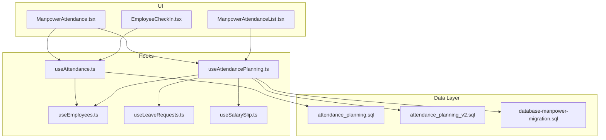
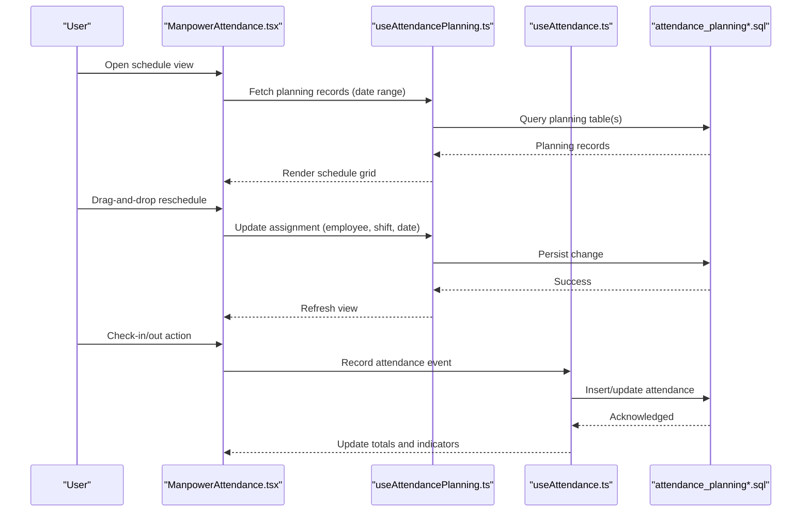
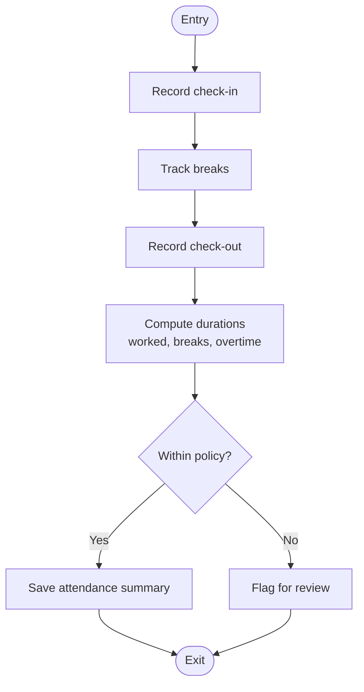
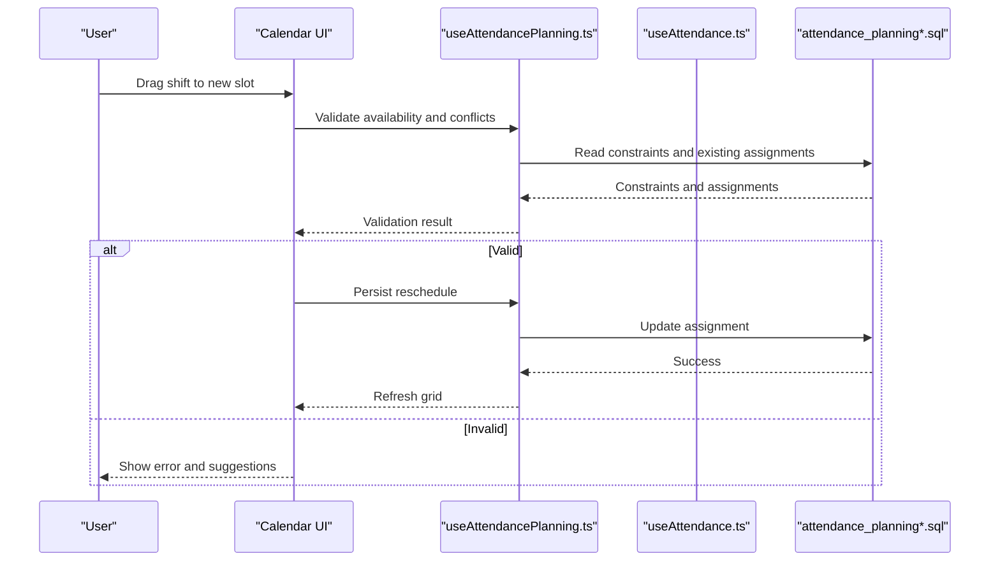
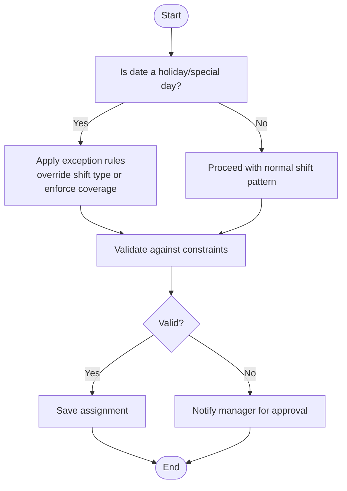
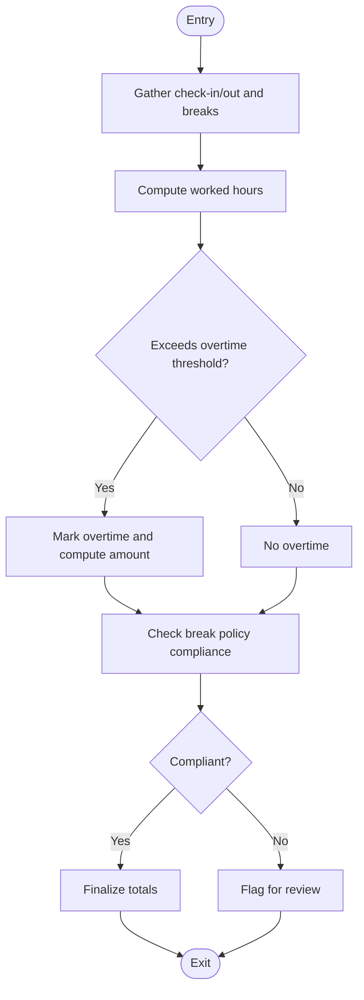
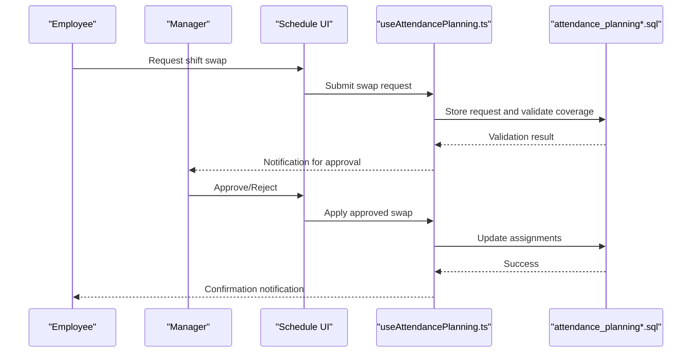
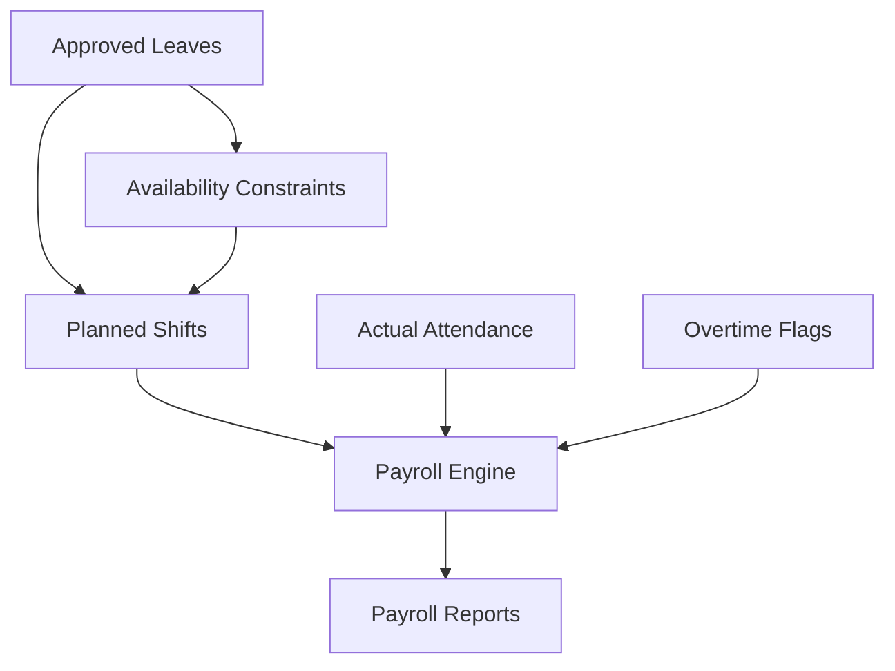
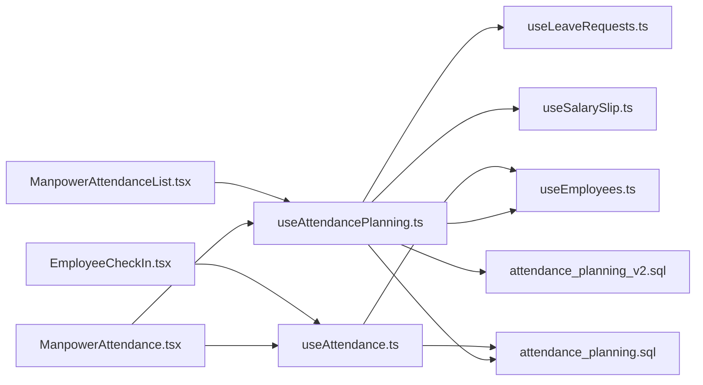

# Shift Scheduling & Management

<cite>
**Referenced Files in This Document**
- [useAttendance.ts](file://src/hooks/useAttendance.ts)
- [useAttendancePlanning.ts](file://src/hooks/useAttendancePlanning.ts)
- [attendance_planning.sql](file://sql/attendance_planning.sql)
- [attendance_planning_v2.sql](file://sql/attendance_planning_v2.sql)
- [ManpowerAttendance.tsx](file://src/pages/ManpowerAttendance.tsx)
- [ManpowerAttendanceList.tsx](file://src/pages/ManpowerAttendanceList.tsx)
- [EmployeeCheckIn.tsx](file://src/pages/EmployeeCheckIn.tsx)
- [useEmployees.ts](file://src/hooks/useEmployees.ts)
- [useLeaveRequests.ts](file://src/hooks/useLeaveRequests.ts)
- [useSalarySlip.ts](file://src/hooks/useSalarySlip.ts)
- [database-manpower-migration.sql](file://src/database-manpower-migration.sql)
</cite>

## Table of Contents
1. [Introduction](#introduction)
2. [Project Structure](#project-structure)
3. [Core Components](#core-components)
4. [Architecture Overview](#architecture-overview)
5. [Detailed Component Analysis](#detailed-component-analysis)
6. [Dependency Analysis](#dependency-analysis)
7. [Performance Considerations](#performance-considerations)
8. [Troubleshooting Guide](#troubleshooting-guide)
9. [Conclusion](#conclusion)
10. [Appendices](#appendices)

## Introduction
This document explains the shift scheduling and management functionality implemented in the application. It covers how shifts are modeled, configured, and visualized; how rotating schedules and exceptions (holidays/special days) are handled; overtime and break policies; compliance considerations; calendar-based editing with drag-and-drop rescheduling and bulk operations; conflict detection and availability checks; automated notifications for schedule changes; and integration points with payroll calculations and leave balance adjustments.

The implementation is centered around attendance planning hooks and SQL schemas that define shift patterns, employee assignments, and related data flows. The UI provides pages for viewing and managing manpower attendance and check-in workflows.

## Project Structure
Shift scheduling spans several layers:
- Data layer: SQL migrations defining attendance planning tables and relationships.
- Hooks layer: React hooks to fetch, create, update, and manage attendance planning records and employee data.
- UI layer: Pages for attendance views, lists, and check-in interactions.

**Diagram sources**
- [ManpowerAttendance.tsx](file://src/pages/ManpowerAttendance.tsx)
- [ManpowerAttendanceList.tsx](file://src/pages/ManpowerAttendanceList.tsx)
- [EmployeeCheckIn.tsx](file://src/pages/EmployeeCheckIn.tsx)
- [useAttendance.ts](file://src/hooks/useAttendance.ts)
- [useAttendancePlanning.ts](file://src/hooks/useAttendancePlanning.ts)
- [useEmployees.ts](file://src/hooks/useEmployees.ts)
- [useLeaveRequests.ts](file://src/hooks/useLeaveRequests.ts)
- [useSalarySlip.ts](file://src/hooks/useSalarySlip.ts)
- [attendance_planning.sql](file://sql/attendance_planning.sql)
- [attendance_planning_v2.sql](file://sql/attendance_planning_v2.sql)
- [database-manpower-migration.sql](file://src/database-manpower-migration.sql)

**Section sources**
- [useAttendance.ts](file://src/hooks/useAttendance.ts)
- [useAttendancePlanning.ts](file://src/hooks/useAttendancePlanning.ts)
- [ManpowerAttendance.tsx](file://src/pages/ManpowerAttendance.tsx)
- [ManpowerAttendanceList.tsx](file://src/pages/ManpowerAttendanceList.tsx)
- [EmployeeCheckIn.tsx](file://src/pages/EmployeeCheckIn.tsx)
- [attendance_planning.sql](file://sql/attendance_planning.sql)
- [attendance_planning_v2.sql](file://sql/attendance_planning_v2.sql)
- [database-manpower-migration.sql](file://src/database-manpower-migration.sql)

## Core Components
- Attendance Planning Hook: Provides CRUD operations and queries for shift planning records, including creation, updates, deletions, and retrieval by date ranges or employees.
- Attendance Hook: Manages daily attendance state, check-in/out actions, and derived metrics such as worked hours and breaks.
- Employee Hook: Supplies employee profiles, roles, and availability constraints used during scheduling and validation.
- Leave Requests Hook: Integrates approved leaves into scheduling to prevent conflicts and adjust coverage.
- Salary Slip Hook: Bridges planned shifts and actual attendance to compute overtime and pay components.

Key responsibilities:
- Create and edit shift plans per employee and date.
- Validate against availability and leave constraints.
- Persist changes and reflect them in attendance views.
- Compute totals for reporting and payroll integration.

**Section sources**
- [useAttendancePlanning.ts](file://src/hooks/useAttendancePlanning.ts)
- [useAttendance.ts](file://src/hooks/useAttendance.ts)
- [useEmployees.ts](file://src/hooks/useEmployees.ts)
- [useLeaveRequests.ts](file://src/hooks/useLeaveRequests.ts)
- [useSalarySlip.ts](file://src/hooks/useSalarySlip.ts)

## Architecture Overview
The system follows a layered architecture:
- UI pages render schedules and provide interactive controls.
- Hooks encapsulate business logic and API calls.
- SQL schemas define the canonical data model for attendance planning and related entities.

**Diagram sources**
- [ManpowerAttendance.tsx](file://src/pages/ManpowerAttendance.tsx)
- [useAttendancePlanning.ts](file://src/hooks/useAttendancePlanning.ts)
- [useAttendance.ts](file://src/hooks/useAttendance.ts)
- [attendance_planning.sql](file://sql/attendance_planning.sql)
- [attendance_planning_v2.sql](file://sql/attendance_planning_v2.sql)

## Detailed Component Analysis

### Attendance Planning Hook
Responsibilities:
- Load planning entries for a given period.
- Create, update, and delete shift assignments.
- Apply filters by employee, site, or shift type.
- Surface validation errors (e.g., overlapping shifts).

Operational flow:
- Fetch planning records from the database schema.
- Normalize results for UI consumption.
- Execute mutations via provided methods.
- Emit events or callbacks for UI refresh.

```mermaid
flowchart TD
Start(["Start"]) --> Load["Load planning records"]
Load --> Filter{"Apply filters?"}
Filter --> |Yes| ApplyFilters["Filter by employee/date/shift"]
Filter --> |No| UseRecords["Use raw records"]
ApplyFilters --> UseRecords
UseRecords --> Mutate{"Create/Update/Delete?"}
Mutate --> |Create| CreatePlan["Create new assignment"]
Mutate --> |Update| UpdatePlan["Update existing assignment"]
Mutate --> |Delete| DeletePlan["Remove assignment"]
CreatePlan --> Persist["Persist to DB"]
UpdatePlan --> Persist
DeletePlan --> Persist
Persist --> Done(["Done"])
```

**Diagram sources**
- [useAttendancePlanning.ts](file://src/hooks/useAttendancePlanning.ts)
- [attendance_planning.sql](file://sql/attendance_planning.sql)
- [attendance_planning_v2.sql](file://sql/attendance_planning_v2.sql)

**Section sources**
- [useAttendancePlanning.ts](file://src/hooks/useAttendancePlanning.ts)
- [attendance_planning.sql](file://sql/attendance_planning.sql)
- [attendance_planning_v2.sql](file://sql/attendance_planning_v2.sql)

### Attendance Hook
Responsibilities:
- Manage check-in/check-out timestamps.
- Compute worked hours, breaks, and overtime flags.
- Provide real-time status for each employee on a given day.

Processing logic:
- On check-in, record start time and initialize break counters.
- On check-out, finalize end time and calculate durations.
- Apply break rules and overtime thresholds based on configuration.

**Diagram sources**
- [useAttendance.ts](file://src/hooks/useAttendance.ts)

**Section sources**
- [useAttendance.ts](file://src/hooks/useAttendance.ts)

### Calendar Interface and Interactions
Features:
- Visual schedule grid with color-coded shifts.
- Drag-and-drop rescheduling between employees and dates.
- Bulk operations to apply shift templates across multiple days.
- Conflict detection overlays when overlaps occur.
- Availability indicators based on employee constraints and leaves.

Interaction sequence:
- User drags a shift block to a new slot.
- System validates availability and conflicts.
- If valid, mutation persists the change and refreshes the grid.
- If invalid, user receives actionable feedback.

**Diagram sources**
- [ManpowerAttendance.tsx](file://src/pages/ManpowerAttendance.tsx)
- [useAttendancePlanning.ts](file://src/hooks/useAttendancePlanning.ts)
- [useAttendance.ts](file://src/hooks/useAttendance.ts)
- [attendance_planning.sql](file://sql/attendance_planning.sql)
- [attendance_planning_v2.sql](file://sql/attendance_planning_v2.sql)

**Section sources**
- [ManpowerAttendance.tsx](file://src/pages/ManpowerAttendance.tsx)
- [ManpowerAttendanceList.tsx](file://src/pages/ManpowerAttendanceList.tsx)
- [useAttendancePlanning.ts](file://src/hooks/useAttendancePlanning.ts)
- [useAttendance.ts](file://src/hooks/useAttendance.ts)

### Exception Handling for Holidays and Special Days
- Holidays and special days are treated as exceptions to standard shift patterns.
- When creating or updating assignments, the system checks if the date is marked as a holiday or special day.
- Exceptions can override default shift types or enforce minimum staffing requirements.

**Diagram sources**
- [useAttendancePlanning.ts](file://src/hooks/useAttendancePlanning.ts)
- [attendance_planning.sql](file://sql/attendance_planning.sql)
- [attendance_planning_v2.sql](file://sql/attendance_planning_v2.sql)

**Section sources**
- [useAttendancePlanning.ts](file://src/hooks/useAttendancePlanning.ts)
- [attendance_planning.sql](file://sql/attendance_planning.sql)
- [attendance_planning_v2.sql](file://sql/attendance_planning_v2.sql)

### Overtime Calculation Rules and Break Policies
Overtime calculation:
- Worked hours are computed from check-in to check-out minus breaks.
- Overtime thresholds are configurable (e.g., beyond regular hours per day/week).
- Flags indicate overtime eligibility and amounts for payroll integration.

Break policies:
- Minimum break duration enforced per shift length.
- Multiple breaks allowed within a shift; total break time subtracted from worked hours.
- Violations flagged for review.

**Diagram sources**
- [useAttendance.ts](file://src/hooks/useAttendance.ts)
- [useSalarySlip.ts](file://src/hooks/useSalarySlip.ts)

**Section sources**
- [useAttendance.ts](file://src/hooks/useAttendance.ts)
- [useSalarySlip.ts](file://src/hooks/useSalarySlip.ts)

### Compliance with Labor Regulations
- Enforce maximum working hours per day/week.
- Ensure mandatory rest periods between shifts.
- Respect local labor rules for holidays and special days.
- Maintain audit trails for schedule changes and approvals.

Implementation approach:
- Validation rules integrated into planning mutations.
- Alerts and approvals for non-compliant changes.
- Reporting exports for compliance audits.

**Section sources**
- [useAttendancePlanning.ts](file://src/hooks/useAttendancePlanning.ts)
- [attendance_planning.sql](file://sql/attendance_planning.sql)
- [attendance_planning_v2.sql](file://sql/attendance_planning_v2.sql)

### Managing Shift Swaps and Last-Minute Changes
- Shift swap requests initiated by employees or managers.
- Approval workflow ensures coverage and compliance before applying changes.
- Last-minute changes trigger notifications to affected parties.

**Diagram sources**
- [ManpowerAttendance.tsx](file://src/pages/ManpowerAttendance.tsx)
- [useAttendancePlanning.ts](file://src/hooks/useAttendancePlanning.ts)
- [attendance_planning.sql](file://sql/attendance_planning.sql)
- [attendance_planning_v2.sql](file://sql/attendance_planning_v2.sql)

**Section sources**
- [ManpowerAttendance.tsx](file://src/pages/ManpowerAttendance.tsx)
- [useAttendancePlanning.ts](file://src/hooks/useAttendancePlanning.ts)

### Integration with Payroll and Leave Balances
Payroll integration:
- Planned shifts and actual attendance feed into salary computations.
- Overtime flags and amounts influence pay calculations.
- Exportable summaries for payroll processing.

Leave balance adjustments:
- Approved leaves reduce available working days.
- Leaves affect coverage and may require additional shift assignments.
- Leave balances updated upon approval and reflected in scheduling constraints.

**Diagram sources**
- [useSalarySlip.ts](file://src/hooks/useSalarySlip.ts)
- [useLeaveRequests.ts](file://src/hooks/useLeaveRequests.ts)
- [useAttendancePlanning.ts](file://src/hooks/useAttendancePlanning.ts)
- [useAttendance.ts](file://src/hooks/useAttendance.ts)

**Section sources**
- [useSalarySlip.ts](file://src/hooks/useSalarySlip.ts)
- [useLeaveRequests.ts](file://src/hooks/useLeaveRequests.ts)
- [useAttendancePlanning.ts](file://src/hooks/useAttendancePlanning.ts)
- [useAttendance.ts](file://src/hooks/useAttendance.ts)

## Dependency Analysis
The following diagram shows key dependencies among hooks and UI components:

**Diagram sources**
- [ManpowerAttendance.tsx](file://src/pages/ManpowerAttendance.tsx)
- [ManpowerAttendanceList.tsx](file://src/pages/ManpowerAttendanceList.tsx)
- [EmployeeCheckIn.tsx](file://src/pages/EmployeeCheckIn.tsx)
- [useAttendancePlanning.ts](file://src/hooks/useAttendancePlanning.ts)
- [useAttendance.ts](file://src/hooks/useAttendance.ts)
- [useEmployees.ts](file://src/hooks/useEmployees.ts)
- [useLeaveRequests.ts](file://src/hooks/useLeaveRequests.ts)
- [useSalarySlip.ts](file://src/hooks/useSalarySlip.ts)
- [attendance_planning.sql](file://sql/attendance_planning.sql)
- [attendance_planning_v2.sql](file://sql/attendance_planning_v2.sql)

**Section sources**
- [useAttendancePlanning.ts](file://src/hooks/useAttendancePlanning.ts)
- [useAttendance.ts](file://src/hooks/useAttendance.ts)
- [useEmployees.ts](file://src/hooks/useEmployees.ts)
- [useLeaveRequests.ts](file://src/hooks/useLeaveRequests.ts)
- [useSalarySlip.ts](file://src/hooks/useSalarySlip.ts)
- [attendance_planning.sql](file://sql/attendance_planning.sql)
- [attendance_planning_v2.sql](file://sql/attendance_planning_v2.sql)

## Performance Considerations
- Batch operations: Use bulk APIs where available to minimize round-trips during large reschedules.
- Pagination and virtualization: For large datasets, paginate planning records and virtualize the calendar grid.
- Indexing: Ensure database indexes on date ranges, employee IDs, and shift types to speed up queries.
- Debouncing: Debounce drag-and-drop updates to avoid excessive writes.
- Caching: Cache read-only planning data for short intervals to improve responsiveness.

[No sources needed since this section provides general guidance]

## Troubleshooting Guide
Common issues and resolutions:
- Overlapping shifts detected: Review conflict overlays and adjust assignments to ensure no overlaps.
- Availability violations: Verify employee constraints and leave statuses; reassign as needed.
- Overtime not calculated: Confirm check-in/out times and break records; ensure thresholds are configured.
- Notifications not received: Check notification settings and delivery channels; verify successful mutation responses.

Validation and logging:
- Inspect hook error states and messages for detailed diagnostics.
- Use audit logs to trace schedule changes and approvals.

**Section sources**
- [useAttendancePlanning.ts](file://src/hooks/useAttendancePlanning.ts)
- [useAttendance.ts](file://src/hooks/useAttendance.ts)

## Conclusion
The shift scheduling and management system integrates planning, attendance tracking, and payroll-related computations through well-defined hooks and schemas. It supports complex scheduling scenarios including rotating patterns, exceptions, swaps, and last-minute changes while enforcing compliance and providing robust UI interactions. Continuous improvements should focus on performance optimizations, enhanced validation, and richer reporting capabilities.

[No sources needed since this section summarizes without analyzing specific files]

## Appendices

### Example Scenarios
- Creating a rotating weekly pattern: Define a base shift template and apply it across a date range with rotation offsets.
- Managing holiday overrides: Mark specific dates as holidays and assign minimal coverage shifts.
- Handling last-minute swaps: Initiate a swap request, obtain manager approval, and persist the change with notifications.

[No sources needed since this section provides conceptual examples]