# Employee Management

<cite>
**Referenced Files in This Document**
- [useEmployees.ts](file://src/hooks/useEmployees.ts)
- [EmployeeCheckIn.tsx](file://src/pages/EmployeeCheckIn.tsx)
- [AddTeamMemberModal.tsx](file://src/components/AddTeamMemberModal.tsx)
- [HRAdminDashboard.tsx](file://src/pages/HRAdminDashboard.tsx)
- [database-manpower-migration.sql](file://src/database-manpower-migration.sql)
- [supabase-tables.sql](file://supabase-tables.sql)
- [BulkImportModal.tsx](file://src/components/BulkImportModal.tsx)
- [useAttendance.ts](file://src/hooks/useAttendance.ts)
- [useLeaveRequests.ts](file://src/hooks/useLeaveRequests.ts)
- [useSalarySlip.ts](file://src/hooks/useSalarySlip.ts)
- [rbac/index.ts](file://src/rbac/index.ts)
</cite>

## Table of Contents
1. [Introduction](#introduction)
2. [Project Structure](#project-structure)
3. [Core Components](#core-components)
4. [Architecture Overview](#architecture-overview)
5. [Detailed Component Analysis](#detailed-component-analysis)
6. [Dependency Analysis](#dependency-analysis)
7. [Performance Considerations](#performance-considerations)
8. [Troubleshooting Guide](#troubleshooting-guide)
9. [Conclusion](#conclusion)
10. [Appendices](#appendices)

## Introduction
This document describes the Employee Management system, focusing on employee record creation, profile management, organizational hierarchy, onboarding workflows, document uploads, contract management, directory search and filtering, roles and departments, reporting structures, validation rules, compliance requirements, integrations with HR modules and external systems, bulk operations, import/export, and data migration strategies. The content is derived from the repository’s frontend hooks, pages, components, and database schema files.

## Project Structure
The Employee Management functionality spans several areas:
- Hooks for employee data access and business logic
- Pages for administrative dashboards and check-in flows
- Reusable UI components for adding team members and bulk imports
- Database migrations and schema definitions for core entities
- Integrations with attendance, leave, payroll, and RBAC modules

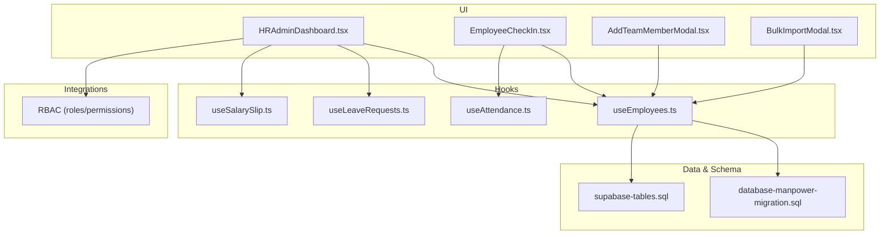

**Diagram sources**
- [HRAdminDashboard.tsx](file://src/pages/HRAdminDashboard.tsx)
- [EmployeeCheckIn.tsx](file://src/pages/EmployeeCheckIn.tsx)
- [AddTeamMemberModal.tsx](file://src/components/AddTeamMemberModal.tsx)
- [BulkImportModal.tsx](file://src/components/BulkImportModal.tsx)
- [useEmployees.ts](file://src/hooks/useEmployees.ts)
- [useAttendance.ts](file://src/hooks/useAttendance.ts)
- [useLeaveRequests.ts](file://src/hooks/useLeaveRequests.ts)
- [useSalarySlip.ts](file://src/hooks/useSalarySlip.ts)
- [database-manpower-migration.sql](file://src/database-manpower-migration.sql)
- [supabase-tables.sql](file://supabase-tables.sql)

**Section sources**
- [useEmployees.ts](file://src/hooks/useEmployees.ts)
- [HRAdminDashboard.tsx](file://src/pages/HRAdminDashboard.tsx)
- [EmployeeCheckIn.tsx](file://src/pages/EmployeeCheckIn.tsx)
- [AddTeamMemberModal.tsx](file://src/components/AddTeamMemberModal.tsx)
- [BulkImportModal.tsx](file://src/components/BulkImportModal.tsx)
- [database-manpower-migration.sql](file://src/database-manpower-migration.sql)
- [supabase-tables.sql](file://supabase-tables.sql)

## Core Components
- useEmployees hook: Centralizes employee CRUD operations, search, filtering, and pagination. It exposes methods to create, update, delete, and query employees, and integrates with the underlying Supabase tables and migrations.
- HRAdminDashboard page: Provides an overview of employee metrics, quick actions, and links to detailed views such as directory, onboarding, contracts, and documents.
- EmployeeCheckIn page: Supports daily check-in/out and attendance linkage for employees.
- AddTeamMemberModal component: Guided flow to add a new employee with role assignment, department selection, and initial onboarding tasks.
- BulkImportModal component: Enables CSV/XLSX-based bulk import of employees with mapping and validation feedback.

Key responsibilities:
- Data access and caching via React Query patterns
- Validation and error handling at UI layer
- Orchestration of cross-module integrations (attendance, leave, payroll)
- Role-based visibility and actions

**Section sources**
- [useEmployees.ts](file://src/hooks/useEmployees.ts)
- [HRAdminDashboard.tsx](file://src/pages/HRAdminDashboard.tsx)
- [EmployeeCheckIn.tsx](file://src/pages/EmployeeCheckIn.tsx)
- [AddTeamMemberModal.tsx](file://src/components/AddTeamMemberModal.tsx)
- [BulkImportModal.tsx](file://src/components/BulkImportModal.tsx)

## Architecture Overview
The Employee Management system follows a modular architecture:
- UI Layer: Pages and modals orchestrate user interactions
- Hook Layer: Business logic and API calls are encapsulated in hooks
- Data Layer: Supabase tables and migrations define persistent schemas
- Integration Layer: Attendance, Leave, Payroll, and RBAC modules interact through shared hooks and APIs

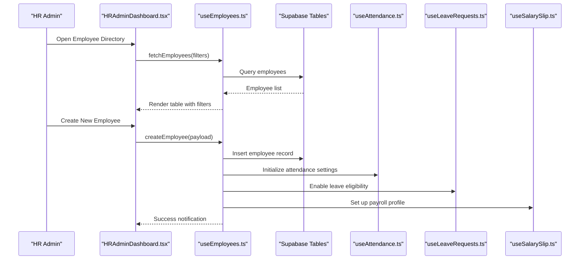

**Diagram sources**
- [HRAdminDashboard.tsx](file://src/pages/HRAdminDashboard.tsx)
- [useEmployees.ts](file://src/hooks/useEmployees.ts)
- [useAttendance.ts](file://src/hooks/useAttendance.ts)
- [useLeaveRequests.ts](file://src/hooks/useLeaveRequests.ts)
- [useSalarySlip.ts](file://src/hooks/useSalarySlip.ts)
- [supabase-tables.sql](file://supabase-tables.sql)

## Detailed Component Analysis

### Employee Record Creation and Profile Management
- Creation workflow:
  - Initiated from AddTeamMemberModal or HRAdminDashboard
  - Validates required fields (name, email, department, role)
  - Persists employee record via useEmployees.createEmployee
  - Triggers onboarding tasks and module initialization
- Profile management:
  - Editable fields include personal details, contact info, job details, and documents
  - Changes propagate to related modules (attendance, leave, payroll)
  - Audit trail updates via RBAC permissions

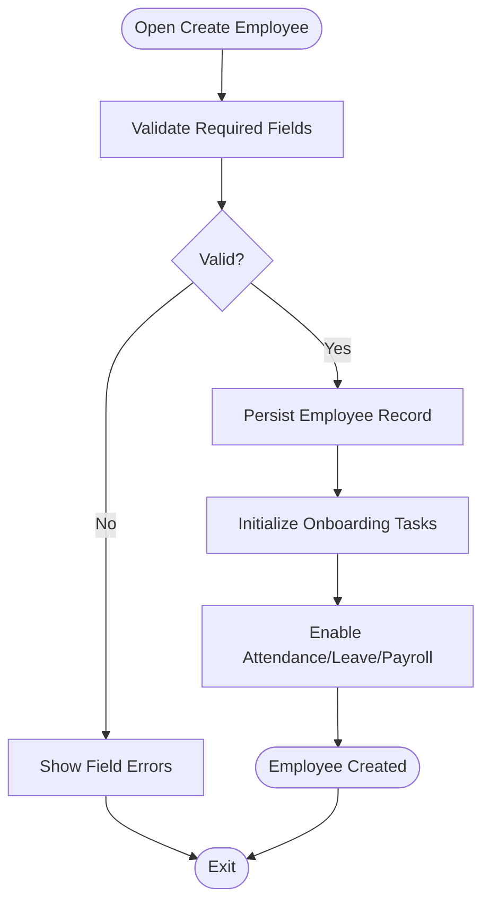

**Diagram sources**
- [AddTeamMemberModal.tsx](file://src/components/AddTeamMemberModal.tsx)
- [useEmployees.ts](file://src/hooks/useEmployees.ts)

**Section sources**
- [AddTeamMemberModal.tsx](file://src/components/AddTeamMemberModal.tsx)
- [useEmployees.ts](file://src/hooks/useEmployees.ts)

### Organizational Hierarchy and Reporting Structures
- Departments and roles are configured centrally and assigned during employee creation
- Reporting lines can be set by assigning manager IDs within the employee profile
- Hierarchical views are supported in the directory and dashboard

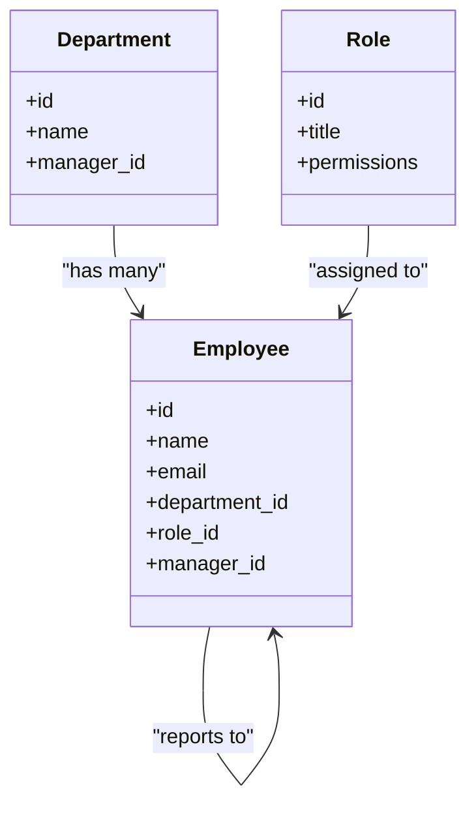

**Diagram sources**
- [database-manpower-migration.sql](file://src/database-manpower-migration.sql)
- [supabase-tables.sql](file://supabase-tables.sql)

**Section sources**
- [database-manpower-migration.sql](file://src/database-manpower-migration.sql)
- [supabase-tables.sql](file://supabase-tables.sql)

### Employee Onboarding Workflows
- Automated task generation upon employee creation
- Document upload prompts (ID proof, offer letter, policies acknowledgment)
- Contract management integration for signing and versioning
- Notifications sent to managers and IT provisioning

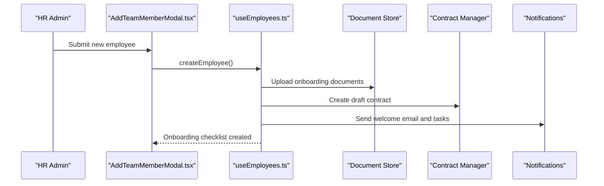

**Diagram sources**
- [AddTeamMemberModal.tsx](file://src/components/AddTeamMemberModal.tsx)
- [useEmployees.ts](file://src/hooks/useEmployees.ts)

**Section sources**
- [AddTeamMemberModal.tsx](file://src/components/AddTeamMemberModal.tsx)
- [useEmployees.ts](file://src/hooks/useEmployees.ts)

### Document Uploads and Contract Management
- Documents are attached to employee profiles with metadata (type, date, status)
- Contracts are versioned and linked to employee records
- Access control ensures only authorized users can view/edit sensitive documents

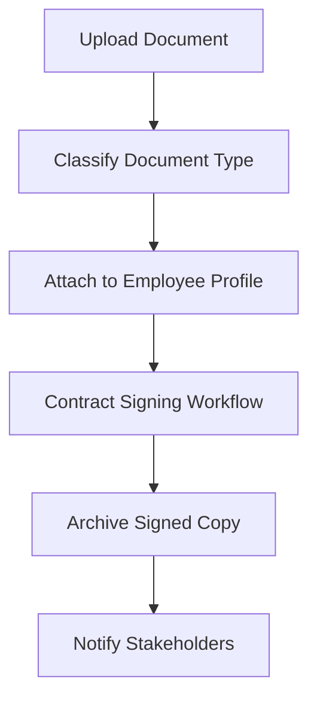

**Diagram sources**
- [useEmployees.ts](file://src/hooks/useEmployees.ts)

**Section sources**
- [useEmployees.ts](file://src/hooks/useEmployees.ts)

### Employee Directory with Search and Filtering
- Directory lists all employees with columns for name, department, role, and status
- Filters include department, role, employment type, and active/inactive status
- Search supports partial matches across name, email, and ID

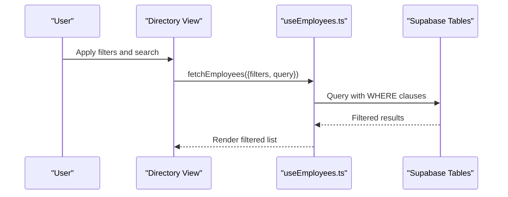

**Diagram sources**
- [useEmployees.ts](file://src/hooks/useEmployees.ts)
- [supabase-tables.sql](file://supabase-tables.sql)

**Section sources**
- [useEmployees.ts](file://src/hooks/useEmployees.ts)

### Setting Up Roles, Departments, and Reporting Structures
- Roles define permissions and are enforced via RBAC
- Departments group employees and support hierarchical reporting
- Reporting structure is maintained through manager_id references

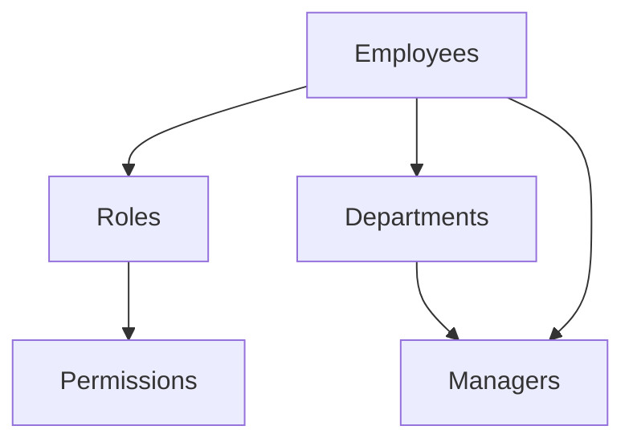

**Diagram sources**
- [rbac/index.ts](file://src/rbac/index.ts)
- [database-manpower-migration.sql](file://src/database-manpower-migration.sql)

**Section sources**
- [rbac/index.ts](file://src/rbac/index.ts)
- [database-manpower-migration.sql](file://src/database-manpower-migration.sql)

### Data Validation Rules, Mandatory Fields, and Compliance Requirements
- Mandatory fields include full name, email, department, and role
- Email uniqueness and format validation are enforced
- Compliance checks ensure required documents are uploaded before activation
- Audit logging captures changes to sensitive fields

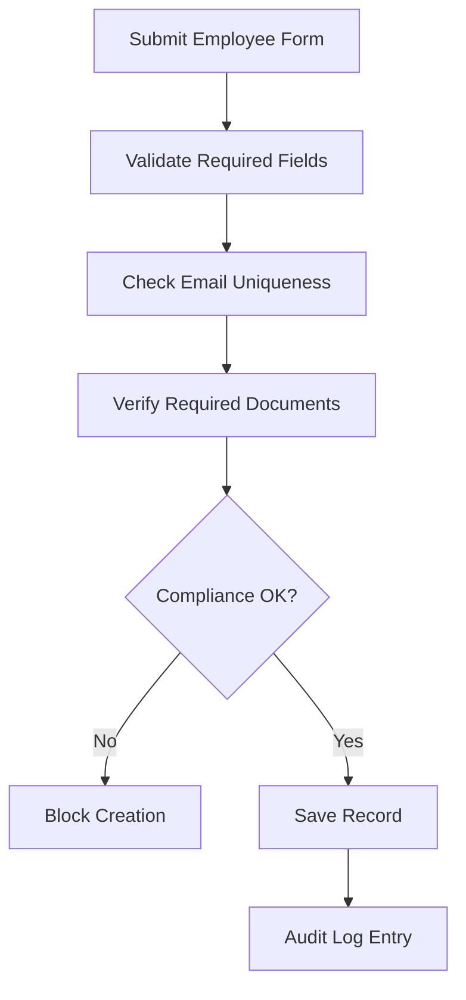

**Diagram sources**
- [useEmployees.ts](file://src/hooks/useEmployees.ts)

**Section sources**
- [useEmployees.ts](file://src/hooks/useEmployees.ts)

### Integration with Other HR Modules and External Systems
- Attendance: Daily check-in/out and shift scheduling
- Leave: Eligibility and request workflows
- Payroll: Salary slips and compensation setup
- External systems: Optional connectors for identity providers and document storage

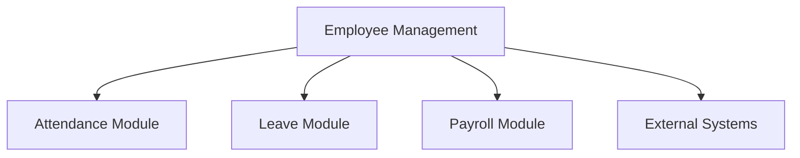

**Diagram sources**
- [useAttendance.ts](file://src/hooks/useAttendance.ts)
- [useLeaveRequests.ts](file://src/hooks/useLeaveRequests.ts)
- [useSalarySlip.ts](file://src/hooks/useSalarySlip.ts)

**Section sources**
- [useAttendance.ts](file://src/hooks/useAttendance.ts)
- [useLeaveRequests.ts](file://src/hooks/useLeaveRequests.ts)
- [useSalarySlip.ts](file://src/hooks/useSalarySlip.ts)

### Bulk Operations, Import/Export, and Data Migration Strategies
- BulkImportModal supports CSV/XLSX uploads with field mapping and validation errors
- Export functionality allows downloading employee directories and reports
- Migration scripts backfill legacy data and align schemas

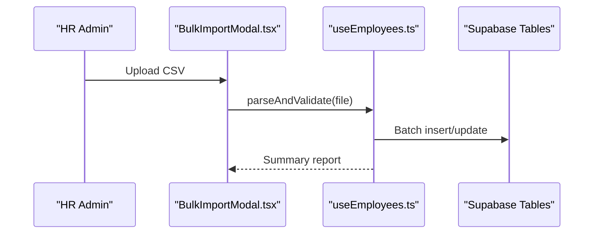

**Diagram sources**
- [BulkImportModal.tsx](file://src/components/BulkImportModal.tsx)
- [useEmployees.ts](file://src/hooks/useEmployees.ts)
- [database-manpower-migration.sql](file://src/database-manpower-migration.sql)

**Section sources**
- [BulkImportModal.tsx](file://src/components/BulkImportModal.tsx)
- [useEmployees.ts](file://src/hooks/useEmployees.ts)
- [database-manpower-migration.sql](file://src/database-manpower-migration.sql)

## Dependency Analysis
The following diagram shows key dependencies between UI components, hooks, and data layers:

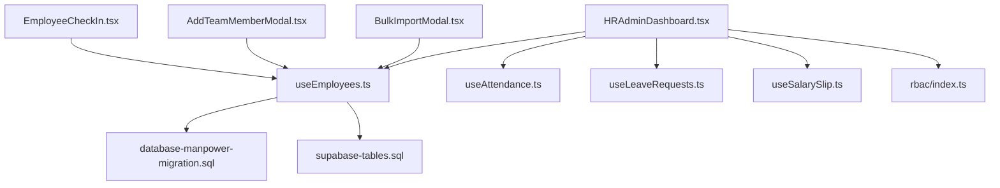

**Diagram sources**
- [HRAdminDashboard.tsx](file://src/pages/HRAdminDashboard.tsx)
- [EmployeeCheckIn.tsx](file://src/pages/EmployeeCheckIn.tsx)
- [AddTeamMemberModal.tsx](file://src/components/AddTeamMemberModal.tsx)
- [BulkImportModal.tsx](file://src/components/BulkImportModal.tsx)
- [useEmployees.ts](file://src/hooks/useEmployees.ts)
- [database-manpower-migration.sql](file://src/database-manpower-migration.sql)
- [supabase-tables.sql](file://supabase-tables.sql)
- [useAttendance.ts](file://src/hooks/useAttendance.ts)
- [useLeaveRequests.ts](file://src/hooks/useLeaveRequests.ts)
- [useSalarySlip.ts](file://src/hooks/useSalarySlip.ts)
- [rbac/index.ts](file://src/rbac/index.ts)

**Section sources**
- [useEmployees.ts](file://src/hooks/useEmployees.ts)
- [HRAdminDashboard.tsx](file://src/pages/HRAdminDashboard.tsx)
- [EmployeeCheckIn.tsx](file://src/pages/EmployeeCheckIn.tsx)
- [AddTeamMemberModal.tsx](file://src/components/AddTeamMemberModal.tsx)
- [BulkImportModal.tsx](file://src/components/BulkImportModal.tsx)
- [database-manpower-migration.sql](file://src/database-manpower-migration.sql)
- [supabase-tables.sql](file://supabase-tables.sql)
- [useAttendance.ts](file://src/hooks/useAttendance.ts)
- [useLeaveRequests.ts](file://src/hooks/useLeaveRequests.ts)
- [useSalarySlip.ts](file://src/hooks/useSalarySlip.ts)
- [rbac/index.ts](file://src/rbac/index.ts)

## Performance Considerations
- Use pagination and server-side filtering in the employee directory to handle large datasets
- Debounce search inputs to reduce unnecessary queries
- Cache frequently accessed employee profiles and department lists
- Optimize bulk imports by batching writes and providing progress feedback
- Leverage indexes defined in schema migrations for faster lookups

[No sources needed since this section provides general guidance]

## Troubleshooting Guide
Common issues and resolutions:
- Duplicate email errors: Ensure email uniqueness validation is applied before submission
- Missing required documents: Prompt users to upload mandatory files prior to activation
- Permission denied: Verify RBAC roles and permissions for the current user
- Import failures: Review mapping configuration and validate file formats
- Slow directory load: Check filter complexity and consider adding server-side indexing

**Section sources**
- [useEmployees.ts](file://src/hooks/useEmployees.ts)
- [BulkImportModal.tsx](file://src/components/BulkImportModal.tsx)
- [rbac/index.ts](file://src/rbac/index.ts)

## Conclusion
The Employee Management system provides a comprehensive foundation for managing employee records, onboarding, documents, contracts, and organizational hierarchy. It integrates seamlessly with attendance, leave, and payroll modules while supporting bulk operations and robust validation. By adhering to the outlined best practices and leveraging the provided hooks and components, teams can efficiently maintain accurate employee data and comply with organizational policies.

[No sources needed since this section summarizes without analyzing specific files]

## Appendices

### Example: Creating an Employee Record
- Navigate to HRAdminDashboard and select “Create Employee”
- Fill in mandatory fields and attach required documents
- Assign role and department; set reporting manager if applicable
- Confirm and submit; onboarding tasks will be generated automatically

**Section sources**
- [HRAdminDashboard.tsx](file://src/pages/HRAdminDashboard.tsx)
- [AddTeamMemberModal.tsx](file://src/components/AddTeamMemberModal.tsx)
- [useEmployees.ts](file://src/hooks/useEmployees.ts)

### Example: Bulk Import Employees
- Prepare CSV with mapped columns matching system fields
- Use BulkImportModal to upload and preview mapping
- Resolve validation errors and confirm batch import
- Review summary report for successes and failures

**Section sources**
- [BulkImportModal.tsx](file://src/components/BulkImportModal.tsx)
- [useEmployees.ts](file://src/hooks/useEmployees.ts)

### Example: Configure Roles and Permissions
- Define roles with appropriate permissions in RBAC
- Assign roles to employees during creation or later edits
- Verify access controls in directory and profile views

**Section sources**
- [rbac/index.ts](file://src/rbac/index.ts)
- [useEmployees.ts](file://src/hooks/useEmployees.ts)