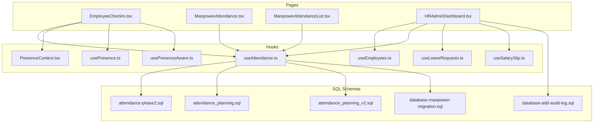
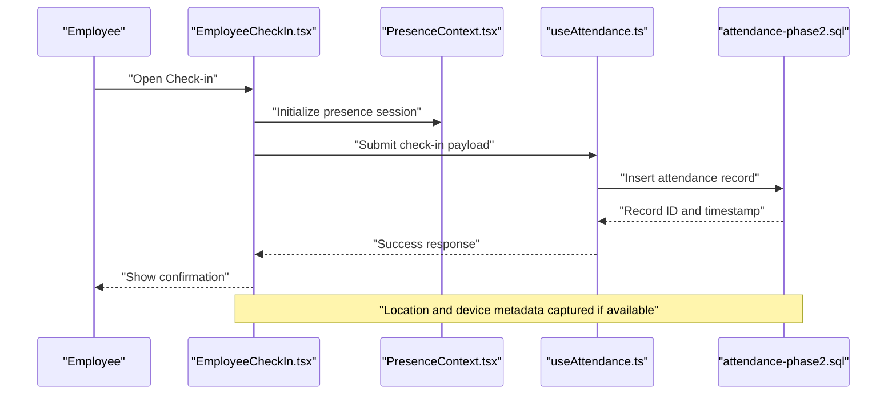
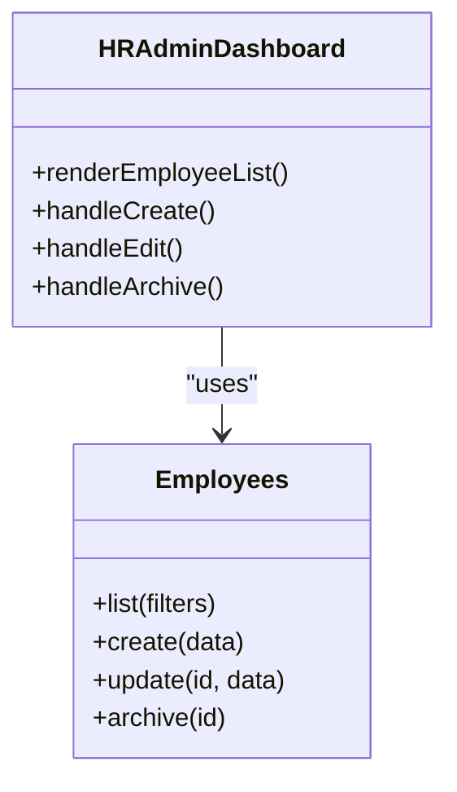
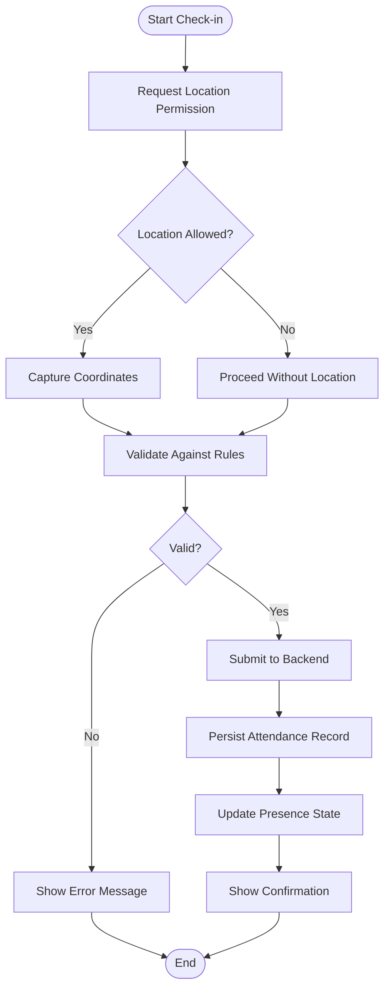
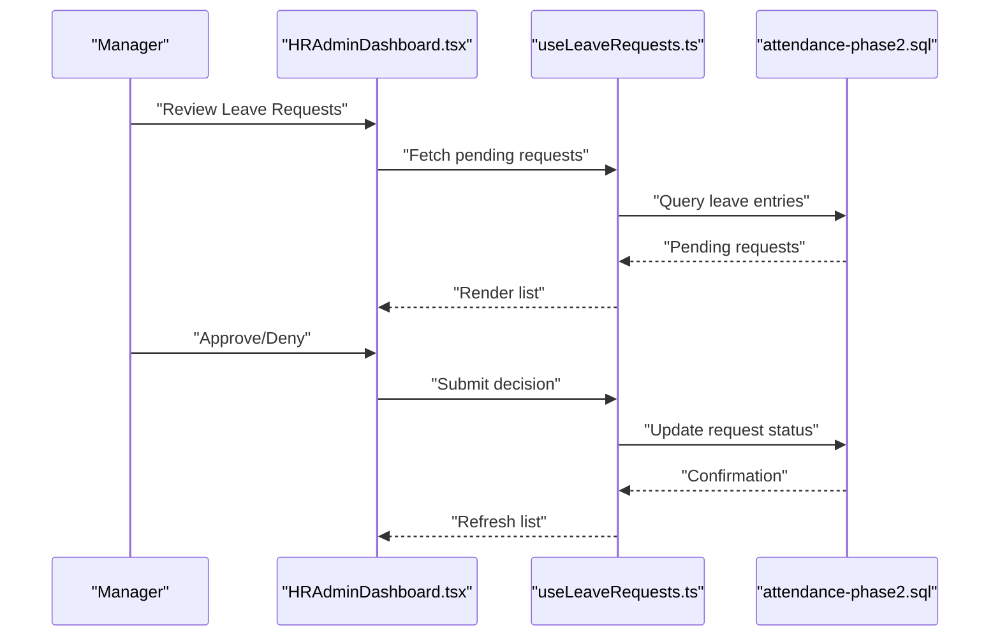
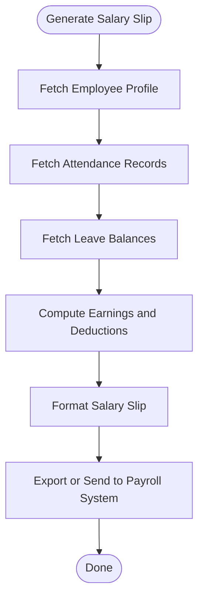
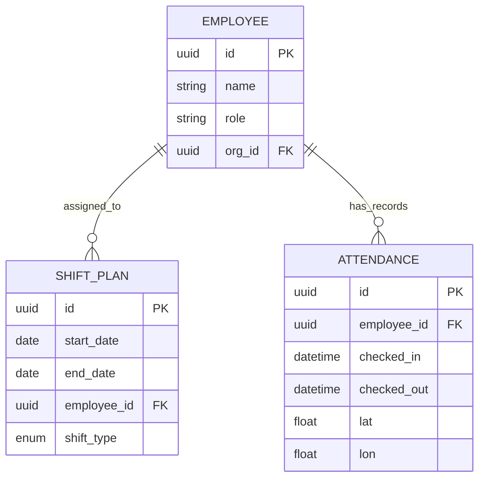
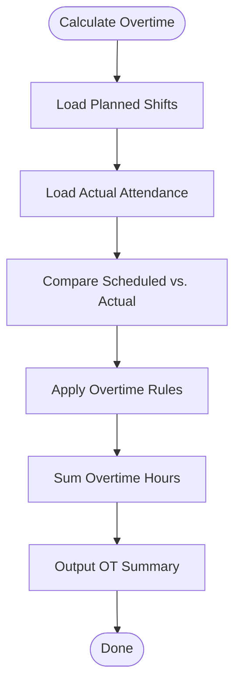
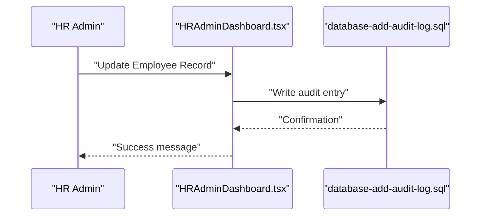
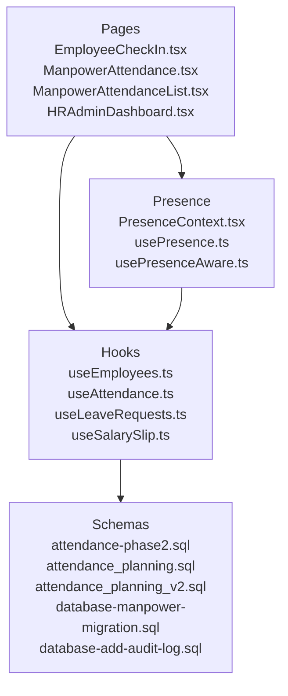

# Human Resources

<cite>
**Referenced Files in This Document**
- [EmployeeCheckIn.tsx](file://src/pages/EmployeeCheckIn.tsx)
- [ManpowerAttendance.tsx](file://src/pages/ManpowerAttendance.tsx)
- [ManpowerAttendanceList.tsx](file://src/pages/ManpowerAttendanceList.tsx)
- [HRAdminDashboard.tsx](file://src/pages/HRAdminDashboard.tsx)
- [useEmployees.ts](file://src/hooks/useEmployees.ts)
- [useAttendance.ts](file://src/hooks/useAttendance.ts)
- [useLeaveRequests.ts](file://src/hooks/useLeaveRequests.ts)
- [useSalarySlip.ts](file://src/hooks/useSalarySlip.ts)
- [attendance-phase2.sql](file://sql/attendance-phase2.sql)
- [attendance_planning.sql](file://sql/attendance_planning.sql)
- [attendance_planning_v2.sql](file://sql/attendance_planning_v2.sql)
- [database-manpower-migration.sql](file://src/database-manpower-migration.sql)
- [database-add-audit-log.sql](file://src/database-add-audit-log.sql)
- [PresenceContext.tsx](file://src/hooks/PresenceContext.tsx)
- [usePresence.ts](file://src/hooks/usePresence.ts)
- [usePresenceAware.ts](file://src/hooks/usePresenceAware.ts)
- [PresenceAwareExample.tsx](file://src/examples/PresenceAwareExample.tsx)
</cite>

## Table of Contents
1. [Introduction](#introduction)
2. [Project Structure](#project-structure)
3. [Core Components](#core-components)
4. [Architecture Overview](#architecture-overview)
5. [Detailed Component Analysis](#detailed-component-analysis)
6. [Dependency Analysis](#dependency-analysis)
7. [Performance Considerations](#performance-considerations)
8. [Troubleshooting Guide](#troubleshooting-guide)
9. [Conclusion](#conclusion)
10. [Appendices](#appendices)

## Introduction
This document describes the Human Resources management system implemented in the web application. It covers employee record management, attendance tracking (including mobile check-in/out and geolocation), leave management, payroll integration points, workforce planning, shift scheduling, overtime calculation, salary slip generation, benefits administration, compliance reporting, customization of attendance rules and leave policies, external HR integrations, data privacy and audit logging, scalability for large workforces, and reporting for workforce analytics, absenteeism tracking, and labor cost analysis.

## Project Structure
The HR functionality is primarily composed of:
- Pages for user-facing features such as employee check-in, attendance lists, and HR admin dashboard
- React hooks encapsulating business logic and API interactions for employees, attendance, leaves, and salary slips
- SQL migrations defining database schemas for attendance, planning, and manpower
- Presence utilities enabling real-time presence awareness for check-in/out flows

**Diagram sources**
- [EmployeeCheckIn.tsx](file://src/pages/EmployeeCheckIn.tsx)
- [ManpowerAttendance.tsx](file://src/pages/ManpowerAttendance.tsx)
- [ManpowerAttendanceList.tsx](file://src/pages/ManpowerAttendanceList.tsx)
- [HRAdminDashboard.tsx](file://src/pages/HRAdminDashboard.tsx)
- [useEmployees.ts](file://src/hooks/useEmployees.ts)
- [useAttendance.ts](file://src/hooks/useAttendance.ts)
- [useLeaveRequests.ts](file://src/hooks/useLeaveRequests.ts)
- [useSalarySlip.ts](file://src/hooks/useSalarySlip.ts)
- [attendance-phase2.sql](file://sql/attendance-phase2.sql)
- [attendance_planning.sql](file://sql/attendance_planning.sql)
- [attendance_planning_v2.sql](file://sql/attendance_planning_v2.sql)
- [database-manpower-migration.sql](file://src/database-manpower-migration.sql)
- [database-add-audit-log.sql](file://src/database-add-audit-log.sql)
- [PresenceContext.tsx](file://src/hooks/PresenceContext.tsx)
- [usePresence.ts](file://src/hooks/usePresence.ts)
- [usePresenceAware.ts](file://src/hooks/usePresenceAware.ts)

**Section sources**
- [EmployeeCheckIn.tsx](file://src/pages/EmployeeCheckIn.tsx)
- [ManpowerAttendance.tsx](file://src/pages/ManpowerAttendance.tsx)
- [ManpowerAttendanceList.tsx](file://src/pages/ManpowerAttendanceList.tsx)
- [HRAdminDashboard.tsx](file://src/pages/HRAdminDashboard.tsx)
- [useEmployees.ts](file://src/hooks/useEmployees.ts)
- [useAttendance.ts](file://src/hooks/useAttendance.ts)
- [useLeaveRequests.ts](file://src/hooks/useLeaveRequests.ts)
- [useSalarySlip.ts](file://src/hooks/useSalarySlip.ts)
- [attendance-phase2.sql](file://sql/attendance-phase2.sql)
- [attendance_planning.sql](file://sql/attendance_planning.sql)
- [attendance_planning_v2.sql](file://sql/attendance_planning_v2.sql)
- [database-manpower-migration.sql](file://src/database-manpower-migration.sql)
- [database-add-audit-log.sql](file://src/database-add-audit-log.sql)
- [PresenceContext.tsx](file://src/hooks/PresenceContext.tsx)
- [usePresence.ts](file://src/hooks/usePresence.ts)
- [usePresenceAware.ts](file://src/hooks/usePresenceAware.ts)

## Core Components
- Employee Record Management
  - Centralized hooks provide CRUD operations and queries for employee profiles and metadata.
  - Admin dashboards orchestrate employee listing, creation, updates, and archival workflows.
- Attendance Tracking
  - Mobile-friendly check-in/out page captures timestamps, device context, and optional location data.
  - Real-time presence utilities support live status indicators and conflict resolution during overlapping sessions.
- Leave Management
  - Dedicated hooks manage leave requests, approvals, balances, and policy enforcement.
- Payroll Integration
  - Salary slip generation hook prepares earnings, deductions, and net pay summaries for export or downstream systems.
- Workforce Planning and Shift Scheduling
  - SQL schemas define planning tables and relationships to support rostering, capacity planning, and shift assignments.
- Overtime Calculation
  - Attendance records feed into calculations that determine regular vs. overtime hours based on configured thresholds.
- Benefits Administration
  - Administrative pages allow configuration of benefit plans and eligibility tied to employee attributes.
- Compliance Reporting
  - Audit logging schema supports personnel change trails; reports can be generated from attendance and leave datasets.
- Customization
  - Attendance rules and leave policies are configurable via settings and schema-driven validations.
- External Integrations
  - Hooks expose endpoints suitable for connecting with third-party HRIS or payroll providers.
- Data Privacy and Security
  - Access controls and audit logs ensure sensitive personnel data is protected and traceable.
- Scalability
  - Schema design and query patterns are optimized for large workloads and high-frequency check-ins.
- Reporting and Analytics
  - Dashboards and list views enable workforce analytics, absenteeism tracking, and labor cost analysis.

**Section sources**
- [useEmployees.ts](file://src/hooks/useEmployees.ts)
- [useAttendance.ts](file://src/hooks/useAttendance.ts)
- [useLeaveRequests.ts](file://src/hooks/useLeaveRequests.ts)
- [useSalarySlip.ts](file://src/hooks/useSalarySlip.ts)
- [attendance-phase2.sql](file://sql/attendance-phase2.sql)
- [attendance_planning.sql](file://sql/attendance_planning.sql)
- [attendance_planning_v2.sql](file://sql/attendance_planning_v2.sql)
- [database-manpower-migration.sql](file://src/database-manpower-migration.sql)
- [database-add-audit-log.sql](file://src/database-add-audit-log.sql)
- [HRAdminDashboard.tsx](file://src/pages/HRAdminDashboard.tsx)

## Architecture Overview
The HR module follows a layered architecture:
- Presentation Layer: Pages render UI for employees, attendance, leaves, and admin tasks.
- Logic Layer: Hooks encapsulate state, validation, and API calls.
- Persistence Layer: SQL migrations define relational schemas for attendance, planning, and audit trails.
- Real-time Layer: Presence utilities coordinate concurrent check-ins and live status.

**Diagram sources**
- [EmployeeCheckIn.tsx](file://src/pages/EmployeeCheckIn.tsx)
- [PresenceContext.tsx](file://src/hooks/PresenceContext.tsx)
- [useAttendance.ts](file://src/hooks/useAttendance.ts)
- [attendance-phase2.sql](file://sql/attendance-phase2.sql)

## Detailed Component Analysis

### Employee Record Management
- Responsibilities
  - Create, update, archive, and retrieve employee profiles.
  - Provide filters and search for administrative operations.
- Key Implementation Points
  - useEmployees.ts centralizes employee data access and mutations.
  - HRAdminDashboard.tsx orchestrates employee workflows and integrates with other HR modules.
- Data Model Highlights
  - Employee entities include identifiers, personal details, role, department, and status fields.
- Best Practices
  - Use optimistic updates for better UX; validate inputs before submission.
  - Enforce RBAC at both UI and API layers.

**Diagram sources**
- [useEmployees.ts](file://src/hooks/useEmployees.ts)
- [HRAdminDashboard.tsx](file://src/pages/HRAdminDashboard.tsx)

**Section sources**
- [useEmployees.ts](file://src/hooks/useEmployees.ts)
- [HRAdminDashboard.tsx](file://src/pages/HRAdminDashboard.tsx)

### Attendance Tracking (Mobile Check-in/out and Geolocation)
- Responsibilities
  - Capture check-in/out events with timestamps and optional geolocation.
  - Prevent duplicate sessions and handle conflicts using presence.
- Key Implementation Points
  - EmployeeCheckIn.tsx provides the mobile-first interface.
  - useAttendance.ts handles persistence and validation.
  - PresenceContext.tsx, usePresence.ts, and usePresenceAware.ts coordinate real-time state.
- Data Model Highlights
  - Attendance records include employee ID, type (check-in/check-out), timestamp, device info, and location coordinates when available.
- Customization Examples
  - Attendance Rules: Configure grace periods, required minimum duration, and location-based restrictions via settings consumed by useAttendance.ts.
  - Example Flow: Define rule thresholds → Validate input in hook → Persist record → Update presence.

**Diagram sources**
- [EmployeeCheckIn.tsx](file://src/pages/EmployeeCheckIn.tsx)
- [useAttendance.ts](file://src/hooks/useAttendance.ts)
- [PresenceContext.tsx](file://src/hooks/PresenceContext.tsx)
- [usePresence.ts](file://src/hooks/usePresence.ts)
- [usePresenceAware.ts](file://src/hooks/usePresenceAware.ts)
- [attendance-phase2.sql](file://sql/attendance-phase2.sql)

**Section sources**
- [EmployeeCheckIn.tsx](file://src/pages/EmployeeCheckIn.tsx)
- [useAttendance.ts](file://src/hooks/useAttendance.ts)
- [PresenceContext.tsx](file://src/hooks/PresenceContext.tsx)
- [usePresence.ts](file://src/hooks/usePresence.ts)
- [usePresenceAware.ts](file://src/hooks/usePresenceAware.ts)
- [attendance-phase2.sql](file://sql/attendance-phase2.sql)

### Leave Management
- Responsibilities
  - Manage leave requests, approvals, balances, and policy enforcement.
- Key Implementation Points
  - useLeaveRequests.ts encapsulates leave lifecycle operations.
  - Policies are enforced via validation rules integrated into hooks.
- Customization Examples
  - Leave Policies: Define eligible leave types, accrual rates, carry-forward limits, and approval hierarchies.
  - Example Flow: Request created → Policy validated → Approval workflow triggered → Balance updated.

**Diagram sources**
- [HRAdminDashboard.tsx](file://src/pages/HRAdminDashboard.tsx)
- [useLeaveRequests.ts](file://src/hooks/useLeaveRequests.ts)
- [attendance-phase2.sql](file://sql/attendance-phase2.sql)

**Section sources**
- [useLeaveRequests.ts](file://src/hooks/useLeaveRequests.ts)
- [HRAdminDashboard.tsx](file://src/pages/HRAdminDashboard.tsx)

### Payroll Integration and Salary Slip Generation
- Responsibilities
  - Generate salary slips aggregating earnings, deductions, and net pay.
  - Export data for payroll processing or integrate with external payroll systems.
- Key Implementation Points
  - useSalarySlip.ts computes summary data and formats outputs.
  - Attendance and leave records inform gross-to-net calculations.
- Customization Examples
  - Deductions: Configure tax brackets, insurance contributions, and allowances.
  - Integration: Map internal fields to external payroll schemas via transformation functions in the hook.

**Diagram sources**
- [useSalarySlip.ts](file://src/hooks/useSalarySlip.ts)
- [useAttendance.ts](file://src/hooks/useAttendance.ts)
- [useLeaveRequests.ts](file://src/hooks/useLeaveRequests.ts)

**Section sources**
- [useSalarySlip.ts](file://src/hooks/useSalarySlip.ts)
- [useAttendance.ts](file://src/hooks/useAttendance.ts)
- [useLeaveRequests.ts](file://src/hooks/useLeaveRequests.ts)

### Workforce Planning and Shift Scheduling
- Responsibilities
  - Plan workforce capacity, assign shifts, and track planned vs. actual attendance.
- Key Implementation Points
  - attendance_planning.sql and attendance_planning_v2.sql define planning tables and relationships.
  - ManpowerAttendance.tsx and ManpowerAttendanceList.tsx visualize planned and actual data.
- Customization Examples
  - Shift Templates: Define standard shifts, break times, and overlap constraints.
  - Capacity Rules: Set minimum staffing levels per role/location.

**Diagram sources**
- [attendance_planning.sql](file://sql/attendance_planning.sql)
- [attendance_planning_v2.sql](file://sql/attendance_planning_v2.sql)
- [attendance-phase2.sql](file://sql/attendance-phase2.sql)
- [ManpowerAttendance.tsx](file://src/pages/ManpowerAttendance.tsx)
- [ManpowerAttendanceList.tsx](file://src/pages/ManpowerAttendanceList.tsx)

**Section sources**
- [attendance_planning.sql](file://sql/attendance_planning.sql)
- [attendance_planning_v2.sql](file://sql/attendance_planning_v2.sql)
- [attendance-phase2.sql](file://sql/attendance-phase2.sql)
- [ManpowerAttendance.tsx](file://src/pages/ManpowerAttendance.tsx)
- [ManpowerAttendanceList.tsx](file://src/pages/ManpowerAttendanceList.tsx)

### Overtime Calculation
- Responsibilities
  - Determine overtime hours based on scheduled shifts and actual attendance.
- Key Implementation Points
  - Use attendance records and shift plans to compute regular vs. overtime durations.
  - Apply organization-specific thresholds and multipliers.
- Customization Examples
  - Thresholds: Define daily/weekly overtime triggers.
  - Multipliers: Configure premium rates for weekends/holidays.

**Diagram sources**
- [attendance_planning.sql](file://sql/attendance_planning.sql)
- [attendance-phase2.sql](file://sql/attendance-phase2.sql)
- [useAttendance.ts](file://src/hooks/useAttendance.ts)

**Section sources**
- [attendance_planning.sql](file://sql/attendance_planning.sql)
- [attendance-phase2.sql](file://sql/attendance-phase2.sql)
- [useAttendance.ts](file://src/hooks/useAttendance.ts)

### Benefits Administration
- Responsibilities
  - Configure benefit plans, eligibility criteria, and enrollment.
- Key Implementation Points
  - Admin pages manage plan definitions and associate them with employee attributes.
  - Integration with payroll ensures deductions and contributions are applied correctly.
- Customization Examples
  - Eligibility: Tie benefits to tenure, role, or location.
  - Contributions: Set employer/employee contribution ratios.

**Section sources**
- [HRAdminDashboard.tsx](file://src/pages/HRAdminDashboard.tsx)

### Compliance Reporting and Audit Logging
- Responsibilities
  - Maintain audit trails for personnel changes and generate compliance reports.
- Key Implementation Points
  - database-add-audit-log.sql defines audit table structure.
  - Admin dashboards log critical actions and export reports.
- Customization Examples
  - Audit Fields: Include actor, action, entity, old/new values, and timestamp.
  - Retention: Configure retention policies for audit data.

**Diagram sources**
- [HRAdminDashboard.tsx](file://src/pages/HRAdminDashboard.tsx)
- [database-add-audit-log.sql](file://src/database-add-audit-log.sql)

**Section sources**
- [database-add-audit-log.sql](file://src/database-add-audit-log.sql)
- [HRAdminDashboard.tsx](file://src/pages/HRAdminDashboard.tsx)

### External HR Systems Integration
- Responsibilities
  - Sync employee data, attendance, and payroll information with external HRIS/payroll providers.
- Key Implementation Points
  - Hooks expose structured payloads for outbound integrations.
  - Mapping configurations translate internal fields to provider schemas.
- Customization Examples
  - Webhooks: Trigger sync on key events (hire, termination, check-in).
  - Batch Jobs: Periodic synchronization for large datasets.

**Section sources**
- [useEmployees.ts](file://src/hooks/useEmployees.ts)
- [useAttendance.ts](file://src/hooks/useAttendance.ts)
- [useSalarySlip.ts](file://src/hooks/useSalarySlip.ts)

### Data Privacy and Security
- Responsibilities
  - Protect sensitive personnel data and enforce access controls.
- Key Implementation Points
  - Role-based access in admin dashboards.
  - Audit logging for all sensitive operations.
- Customization Examples
  - Field-level masking for non-admin users.
  - Consent management for location data collection.

**Section sources**
- [database-add-audit-log.sql](file://src/database-add-audit-log.sql)
- [HRAdminDashboard.tsx](file://src/pages/HRAdminDashboard.tsx)

### Scalability for Large Workforces
- Responsibilities
  - Ensure performance under high concurrency and large datasets.
- Key Implementation Points
  - Efficient indexing and pagination in attendance and planning queries.
  - Presence-aware conflict resolution reduces redundant writes.
- Customization Examples
  - Sharding strategies for attendance tables by time partitions.
  - Read replicas for reporting queries.

**Section sources**
- [attendance-phase2.sql](file://sql/attendance-phase2.sql)
- [attendance_planning.sql](file://sql/attendance_planning.sql)
- [attendance_planning_v2.sql](file://sql/attendance_planning_v2.sql)

### Reporting Capabilities
- Responsibilities
  - Provide workforce analytics, absenteeism tracking, and labor cost analysis.
- Key Implementation Points
  - Aggregations over attendance and leave data.
  - Visualizations in admin dashboards and list pages.
- Customization Examples
  - KPIs: Absenteeism rate, overtime utilization, headcount trends.
  - Cost Models: Labor cost per project/department.

**Section sources**
- [ManpowerAttendance.tsx](file://src/pages/ManpowerAttendance.tsx)
- [ManpowerAttendanceList.tsx](file://src/pages/ManpowerAttendanceList.tsx)
- [HRAdminDashboard.tsx](file://src/pages/HRAdminDashboard.tsx)

## Dependency Analysis
The HR module exhibits clear separation between presentation, logic, and persistence layers, with minimal coupling across components.

**Diagram sources**
- [EmployeeCheckIn.tsx](file://src/pages/EmployeeCheckIn.tsx)
- [ManpowerAttendance.tsx](file://src/pages/ManpowerAttendance.tsx)
- [ManpowerAttendanceList.tsx](file://src/pages/ManpowerAttendanceList.tsx)
- [HRAdminDashboard.tsx](file://src/pages/HRAdminDashboard.tsx)
- [useEmployees.ts](file://src/hooks/useEmployees.ts)
- [useAttendance.ts](file://src/hooks/useAttendance.ts)
- [useLeaveRequests.ts](file://src/hooks/useLeaveRequests.ts)
- [useSalarySlip.ts](file://src/hooks/useSalarySlip.ts)
- [PresenceContext.tsx](file://src/hooks/PresenceContext.tsx)
- [usePresence.ts](file://src/hooks/usePresence.ts)
- [usePresenceAware.ts](file://src/hooks/usePresenceAware.ts)
- [attendance-phase2.sql](file://sql/attendance-phase2.sql)
- [attendance_planning.sql](file://sql/attendance_planning.sql)
- [attendance_planning_v2.sql](file://sql/attendance_planning_v2.sql)
- [database-manpower-migration.sql](file://src/database-manpower-migration.sql)
- [database-add-audit-log.sql](file://src/database-add-audit-log.sql)

**Section sources**
- [EmployeeCheckIn.tsx](file://src/pages/EmployeeCheckIn.tsx)
- [ManpowerAttendance.tsx](file://src/pages/ManpowerAttendance.tsx)
- [ManpowerAttendanceList.tsx](file://src/pages/ManpowerAttendanceList.tsx)
- [HRAdminDashboard.tsx](file://src/pages/HRAdminDashboard.tsx)
- [useEmployees.ts](file://src/hooks/useEmployees.ts)
- [useAttendance.ts](file://src/hooks/useAttendance.ts)
- [useLeaveRequests.ts](file://src/hooks/useLeaveRequests.ts)
- [useSalarySlip.ts](file://src/hooks/useSalarySlip.ts)
- [PresenceContext.tsx](file://src/hooks/PresenceContext.tsx)
- [usePresence.ts](file://src/hooks/usePresence.ts)
- [usePresenceAware.ts](file://src/hooks/usePresenceAware.ts)
- [attendance-phase2.sql](file://sql/attendance-phase2.sql)
- [attendance_planning.sql](file://sql/attendance_planning.sql)
- [attendance_planning_v2.sql](file://sql/attendance_planning_v2.sql)
- [database-manpower-migration.sql](file://src/database-manpower-migration.sql)
- [database-add-audit-log.sql](file://src/database-add-audit-log.sql)

## Performance Considerations
- Optimize attendance write paths to minimize contention during peak check-in times.
- Use pagination and server-side filtering for large attendance and planning datasets.
- Cache frequently accessed reference data (roles, departments, benefit plans) on the client where appropriate.
- Leverage presence utilities to avoid duplicate submissions and reduce unnecessary network calls.

[No sources needed since this section provides general guidance]

## Troubleshooting Guide
- Common Issues
  - Duplicate check-ins: Verify presence state and deduplication logic in useAttendance.ts.
  - Missing location data: Ensure permission prompts and fallback handling in EmployeeCheckIn.tsx.
  - Leave balance discrepancies: Reconcile leave requests and approvals via useLeaveRequests.ts.
  - Salary slip mismatches: Cross-check attendance and leave inputs used by useSalarySlip.ts.
- Debugging Steps
  - Inspect presence context for active sessions.
  - Review audit logs for recent personnel changes.
  - Validate attendance records against planned shifts.

**Section sources**
- [useAttendance.ts](file://src/hooks/useAttendance.ts)
- [EmployeeCheckIn.tsx](file://src/pages/EmployeeCheckIn.tsx)
- [useLeaveRequests.ts](file://src/hooks/useLeaveRequests.ts)
- [useSalarySlip.ts](file://src/hooks/useSalarySlip.ts)
- [database-add-audit-log.sql](file://src/database-add-audit-log.sql)

## Conclusion
The HR module provides a comprehensive foundation for managing employees, attendance, leaves, payroll integration, workforce planning, and reporting. Its modular design, presence-aware real-time capabilities, and robust schema support enable customization, scalability, and compliance. By leveraging the documented hooks, pages, and SQL schemas, teams can extend functionality, integrate with external systems, and deliver actionable workforce insights.

[No sources needed since this section summarizes without analyzing specific files]

## Appendices

### Example: Customizing Attendance Rules
- Define thresholds for grace periods and minimum durations.
- Implement validation in useAttendance.ts to enforce rules before persisting records.
- Surface configuration options in admin settings for non-technical users.

**Section sources**
- [useAttendance.ts](file://src/hooks/useAttendance.ts)
- [attendance-phase2.sql](file://sql/attendance-phase2.sql)

### Example: Setting Up Leave Policies
- Configure leave types, accrual rates, and approval hierarchies.
- Integrate policy checks into useLeaveRequests.ts to enforce eligibility and balances.
- Display policy summaries in HRAdminDashboard.tsx for transparency.

**Section sources**
- [useLeaveRequests.ts](file://src/hooks/useLeaveRequests.ts)
- [HRAdminDashboard.tsx](file://src/pages/HRAdminDashboard.tsx)

### Example: Integrating with External HR Systems
- Map internal employee and attendance fields to provider schemas.
- Use hooks to emit events and batch payloads for periodic sync.
- Handle error retries and reconciliation jobs for consistency.

**Section sources**
- [useEmployees.ts](file://src/hooks/useEmployees.ts)
- [useAttendance.ts](file://src/hooks/useAttendance.ts)
- [useSalarySlip.ts](file://src/hooks/useSalarySlip.ts)