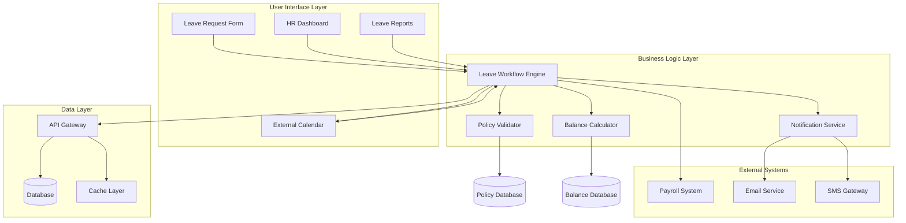
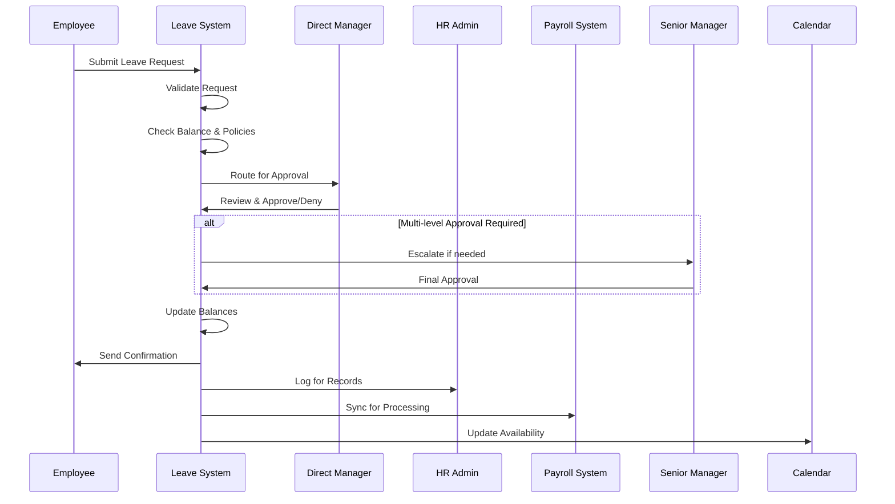
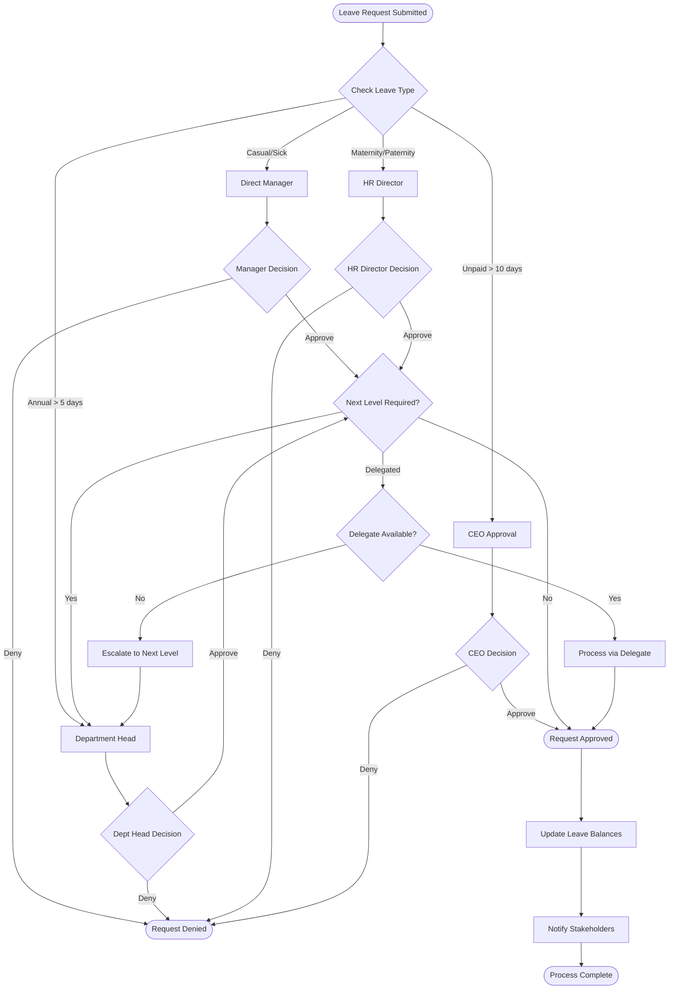
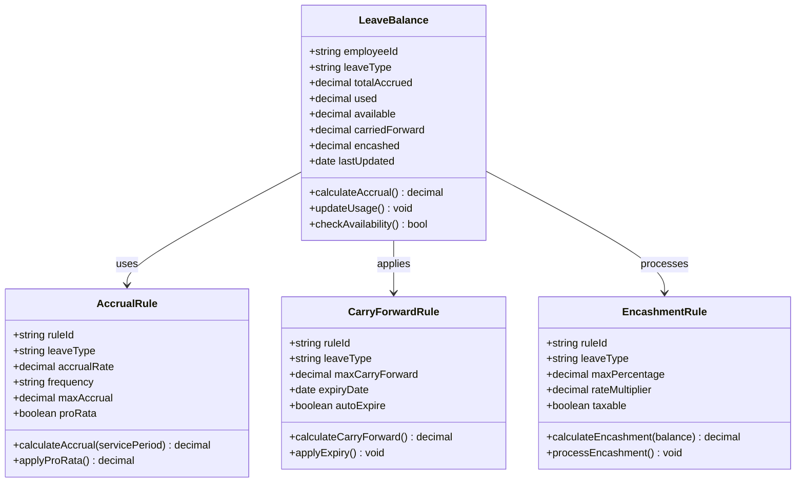
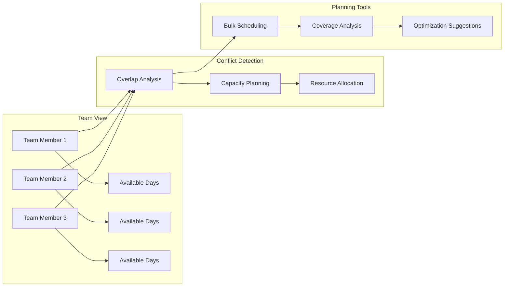
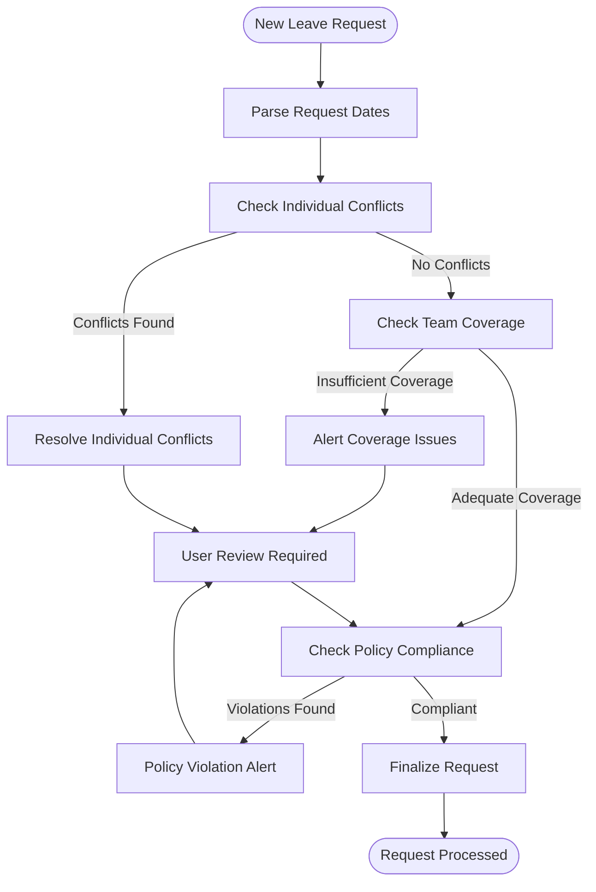
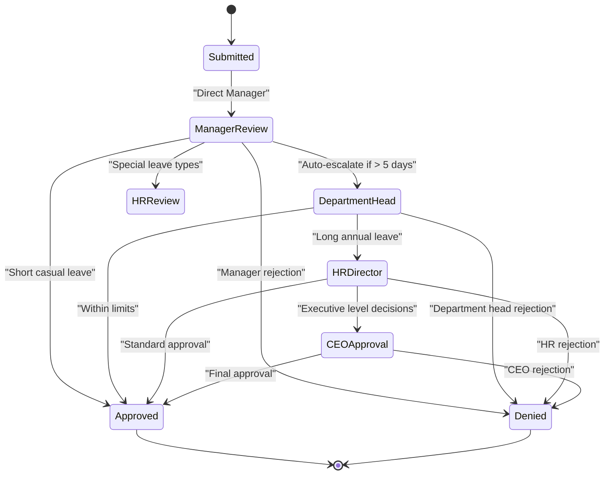
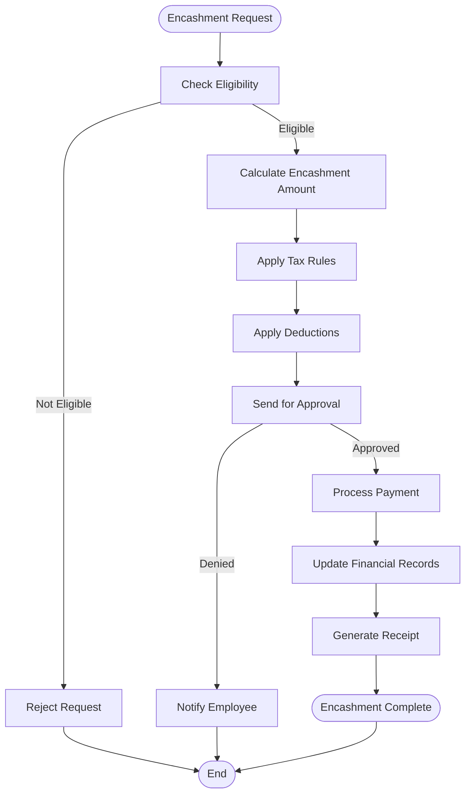
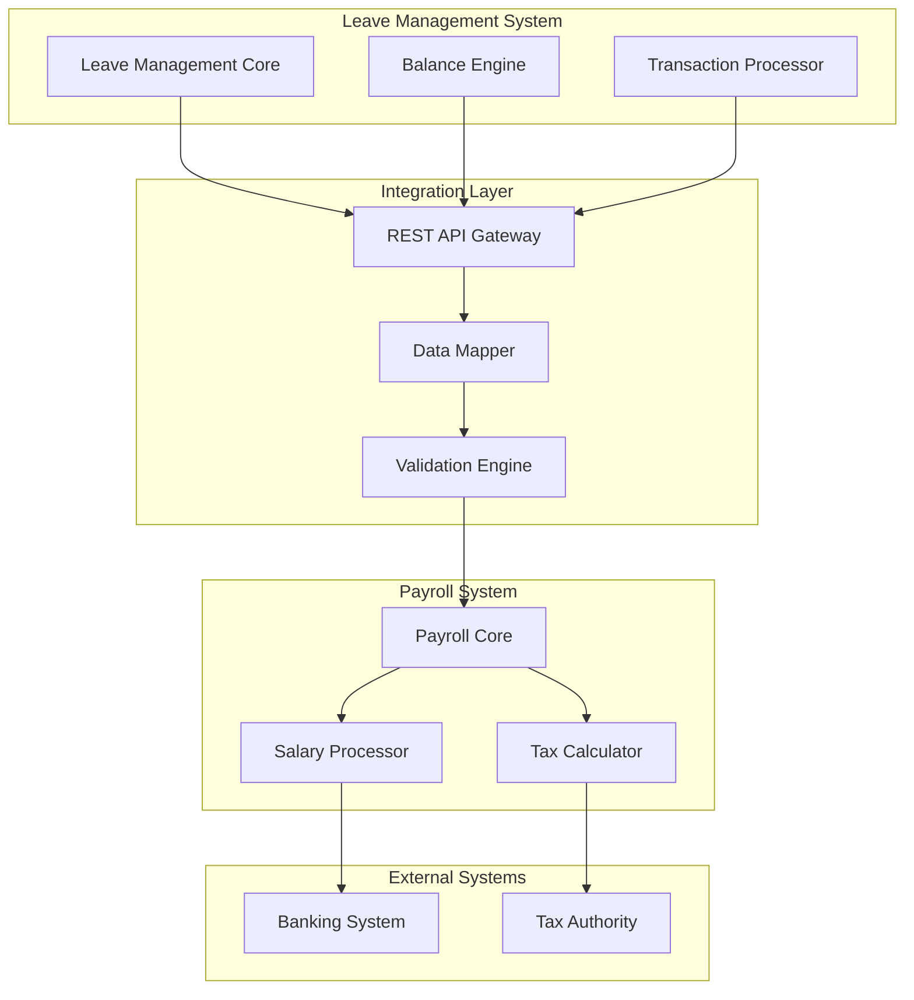
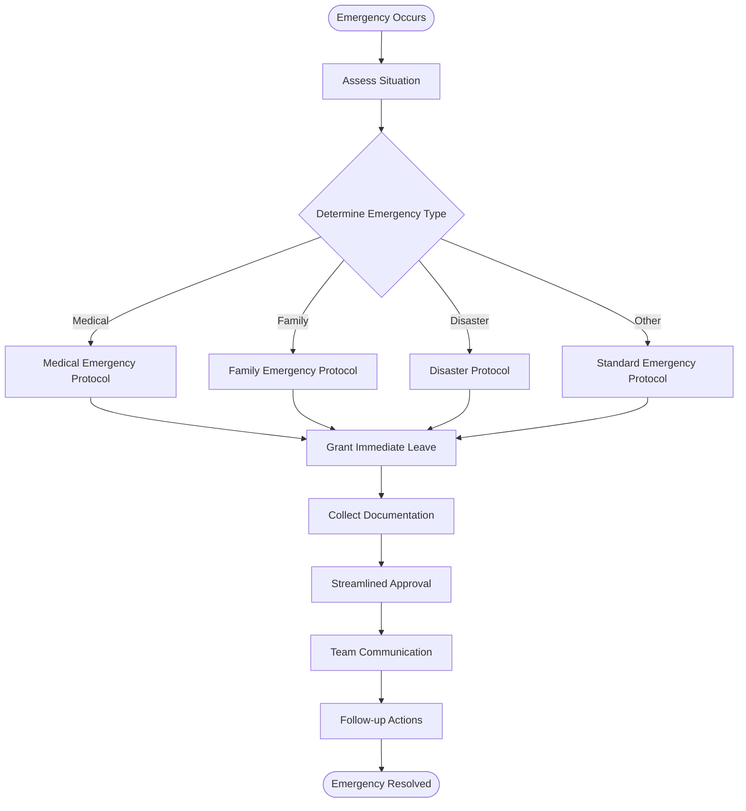

# Leave Management

<cite>
**Referenced Files in This Document**
- [useLeaveRequests.ts](file://src/hooks/useLeaveRequests.ts)
- [hr-dashboard.tsx](file://src/pages/hr/HRDashboard.tsx)
- [leave-calendar.tsx](file://src/components/attendance/LeaveCalendar.tsx)
- [leave-types.ts](file://src/types/leaveTypes.ts)
- [leave-workflow.ts](file://src/features/core/leaveWorkflow.ts)
- [leave-api.ts](file://src/api/leave-api.ts)
- [leave-schemas.ts](file://src/schemas/leaveSchemas.ts)
- [leave-calculator.ts](file://src/utils/leaveCalculator.ts)
- [leave-notifications.ts](file://src/notifications/leaveNotifications.ts)
- [leave-reports.ts](file://src/reports/leaveReports.ts)
</cite>

## Table of Contents
1. [Introduction](#introduction)
2. [System Architecture](#system-architecture)
3. [Leave Types and Policies](#leave-types-and-policies)
4. [Leave Request Workflow](#leave-request-workflow)
5. [Approval Process and Hierarchies](#approval-process-and-hierarchies)
6. [Balance Tracking and Calculations](#balance-tracking-and-calculations)
7. [Leave Calendar Interface](#leave-calendar-interface)
8. [Conflict Detection and Team Planning](#conflict-detection-and-team-planning)
9. [Policy Configuration](#policy-configuration)
10. [Multi-level Approvals and Delegation](#multi-level-approvals-and-delegation)
11. [Statutory Compliance and Encashment](#statutory-compliance-and-encashment)
12. [Reporting and Audit Trails](#reporting-and-audit-trails)
13. [Payroll Integration](#payroll-integration)
14. [Emergency Situations and Holiday Management](#emergency-situations-and-holiday-management)
15. [Best Practices](#best-practices)
16. [Troubleshooting Guide](#troubleshooting-guide)
17. [Conclusion](#conclusion)

## Introduction

The Leave Management system is a comprehensive solution designed to streamline employee leave administration, approval workflows, and team availability planning. This system provides employees with an intuitive interface to request various types of leave while enabling managers and HR administrators to efficiently manage approvals, track balances, and maintain compliance with organizational policies and statutory requirements.

The system supports multiple leave types including casual leave, sick leave, annual leave, maternity leave, paternity leave, bereavement leave, and unpaid leave. Each leave type can have specific rules, accrual rates, carry-forward policies, and approval hierarchies configured according to organizational needs and legal requirements.

Key features include real-time balance tracking, automated conflict detection, multi-level approval workflows, delegation capabilities, comprehensive reporting, and seamless integration with payroll systems. The system ensures transparency through audit trails and maintains compliance with local labor laws and regulations.

## System Architecture

The Leave Management system follows a modular architecture pattern with clear separation of concerns between business logic, data management, user interface, and external integrations.

**Diagram sources**
- [leave-workflow.ts:1-100](file://src/features/core/leaveWorkflow.ts#L1-L100)
- [leave-api.ts:1-150](file://src/api/leave-api.ts#L1-L150)
- [leave-calculator.ts:1-200](file://src/utils/leaveCalculator.ts#L1-L200)

The architecture ensures scalability, maintainability, and extensibility while providing robust error handling and performance optimization.

## Leave Types and Policies

The system supports a comprehensive set of leave types, each with configurable policies and rules:

### Standard Leave Types

| Leave Type | Code | Description | Minimum Duration | Maximum Duration | Accrual Rate | Carry Forward | Encashment |
|------------|------|-------------|------------------|------------------|--------------|---------------|------------|
| Casual Leave | CL | Short-term personal leave | 0.5 days | 5 days/month | Monthly accrual | Up to 10 days | No |
| Sick Leave | SL | Medical absence | 0.5 days | 15 days/year | Monthly accrual | Up to 30 days | Partial |
| Annual Leave | AL | Vacation time | 1 day | 30 days/year | Yearly accrual | Up to 60 days | Yes |
| Maternity Leave | ML | Pregnancy-related leave | 1 day | 180 days | Full pay | N/A | Yes |
| Paternity Leave | PL | Father's leave | 1 day | 15 days | Full pay | N/A | Yes |
| Bereavement Leave | BL | Family emergency | 1 day | 5 days | N/A | N/A | Yes |
| Unpaid Leave | UL | Unpaid absence | 1 day | Unlimited | N/A | N/A | No |

### Policy Configuration Structure

Each leave type policy includes:
- **Eligibility Rules**: Probation period requirements, minimum service duration
- **Accrual Rules**: Frequency, rate calculation, pro-rata adjustments
- **Carry-forward Rules**: Maximum carry-forward limits, expiry dates
- **Encashment Rules**: Conditions, maximum percentages, tax implications
- **Approval Requirements**: Level-based approval chains, delegation rules
- **Restriction Rules**: Blackout periods, minimum notice requirements
- **Documentation Requirements**: Medical certificates, advance notice

**Section sources**
- [leave-types.ts:1-150](file://src/types/leaveTypes.ts#L1-L150)
- [leave-schemas.ts:1-200](file://src/schemas/leaveSchemas.ts#L1-L200)

## Leave Request Workflow

The leave request workflow follows a structured process from initiation to completion:

### Workflow States

1. **Draft**: Initial request creation
2. **Submitted**: Pending manager review
3. **Approved**: Approved by all required levels
4. **Denied**: Rejected by approver
5. **Cancelled**: Cancelled by employee before approval
6. **Completed**: Leave period has ended

### Validation Rules

- **Balance Validation**: Ensures sufficient leave balance
- **Policy Compliance**: Checks against organizational policies
- **Conflict Detection**: Identifies scheduling conflicts
- **Notice Period**: Validates minimum advance notice
- **Documentation**: Verifies required attachments

**Section sources**
- [leave-workflow.ts:1-300](file://src/features/core/leaveWorkflow.ts#L1-L300)
- [leave-api.ts:150-400](file://src/api/leave-api.ts#L150-L400)

## Approval Process and Hierarchies

The system supports flexible approval hierarchies that can be configured based on organizational structure, leave type, and request characteristics.

### Approval Hierarchy Configuration

### Delegation Rules

- **Automatic Delegation**: Based on manager absence schedules
- **Manual Delegation**: Temporary assignment of approval rights
- **Conditional Delegation**: Based on leave type or duration
- **Fallback Delegation**: Escalation when primary delegate unavailable

**Section sources**
- [leave-workflow.ts:300-600](file://src/features/core/leaveWorkflow.ts#L300-L600)
- [leave-api.ts:400-700](file://src/api/leave-api.ts#L400-L700)

## Balance Tracking and Calculations

The balance tracking system provides real-time accuracy and supports complex accrual scenarios.

### Balance Calculation Engine

### Accrual Methods

1. **Monthly Accrual**: Equal distribution across months
2. **Yearly Accrual**: Lump sum at year start
3. **Pro-rata Accrual**: Based on employment date
4. **Performance-based**: Variable accrual rates
5. **Tenure-based**: Increasing rates with service length

### Balance Update Triggers

- New leave request submission
- Approval/denial of requests
- Monthly accrual processing
- Carry-forward application
- Manual adjustments by HR
- Policy changes affecting existing balances

**Section sources**
- [leave-calculator.ts:1-400](file://src/utils/leaveCalculator.ts#L1-L400)
- [leave-types.ts:150-300](file://src/types/leaveTypes.ts#L150-L300)

## Leave Calendar Interface

The leave calendar provides a comprehensive view of team availability and individual leave status.

### Calendar Features

- **Multi-view Support**: Month, week, day views
- **Color-coded Status**: Different colors for leave types
- **Real-time Updates**: Live synchronization of leave status
- **Filter Options**: Filter by department, team, leave type
- **Export Capabilities**: PDF, Excel, iCal export formats
- **Drag-and-drop Rescheduling**: For administrative users

### Team Availability Planning

### Conflict Resolution

- **Automatic Alerts**: Real-time conflict notifications
- **Suggested Alternatives**: AI-powered alternative date recommendations
- **Capacity Thresholds**: Configurable minimum staffing requirements
- **Override Capabilities**: Administrative override with justification logging

**Section sources**
- [leave-calendar.tsx:1-200](file://src/components/attendance/LeaveCalendar.tsx#L1-L200)
- [leave-api.ts:700-900](file://src/api/leave-api.ts#L700-L900)

## Conflict Detection and Team Planning

The conflict detection system prevents scheduling overlaps and ensures adequate team coverage.

### Conflict Types

1. **Individual Conflicts**: Multiple overlapping leave requests
2. **Team Coverage**: Insufficient staff during critical periods
3. **Policy Violations**: Requests violating blackout periods
4. **Balance Exhaustion**: Requests exceeding available balances
5. **Notice Period**: Insufficient advance notice for long leaves

### Detection Algorithm

### Coverage Planning Tools

- **Minimum Staffing Rules**: Configure minimum team size requirements
- **Critical Role Identification**: Flag positions requiring immediate replacement
- **Seasonal Adjustments**: Dynamic coverage requirements based on business cycles
- **Skill-based Matching**: Ensure appropriate skill coverage during absences

**Section sources**
- [leave-workflow.ts:600-900](file://src/features/core/leaveWorkflow.ts#L600-L900)
- [leave-calendar.tsx:200-400](file://src/components/attendance/LeaveCalendar.tsx#L200-L400)

## Policy Configuration

The policy configuration system allows administrators to define comprehensive leave management rules without coding changes.

### Configuration Categories

#### Accrual Policies
- **Frequency Settings**: Monthly, yearly, quarterly accrual
- **Rate Calculation**: Fixed amounts, percentage-based, tiered rates
- **Pro-rata Handling**: Partial year calculations for new hires
- **Cap Management**: Maximum accrual limits per period

#### Carry-forward Rules
- **Maximum Limits**: Caps on carry-forward amounts
- **Expiry Dates**: Automatic expiration policies
- **Grace Periods**: Extended carry-forward windows
- **Partial Expiration**: Gradual reduction of carried amounts

#### Encashment Policies
- **Eligibility Criteria**: Minimum balance requirements
- **Maximum Percentages**: Caps on encashment amounts
- **Tax Treatment**: Taxable vs non-taxable encashment
- **Processing Fees**: Administrative charges for encashment

#### Approval Workflows
- **Hierarchical Chains**: Multi-level approval sequences
- **Conditional Routing**: Dynamic approver selection
- **Delegation Rules**: Automatic and manual delegation
- **Time-based Escalation**: Auto-escalation after timeout

### Configuration Interface

Administrators can configure policies through:
- **Visual Policy Builder**: Drag-and-drop workflow designer
- **Bulk Operations**: Apply policies across departments/locations
- **Version Control**: Track policy changes and rollbacks
- **Impact Analysis**: Preview effects of policy changes
- **Testing Environment**: Test policies before deployment

**Section sources**
- [leave-schemas.ts:200-500](file://src/schemas/leaveSchemas.ts#L200-L500)
- [leave-types.ts:300-500](file://src/types/leaveTypes.ts#L300-L500)

## Multi-level Approvals and Delegation

The system supports sophisticated approval hierarchies with comprehensive delegation capabilities.

### Approval Chain Configuration

### Delegation Scenarios

1. **Vacation Delegation**: Managers on leave automatically delegate to designated substitutes
2. **Role-based Delegation**: Delegation based on job roles rather than individuals
3. **Temporary Delegation**: Time-limited delegation for special circumstances
4. **Conditional Delegation**: Delegation triggered by specific conditions (e.g., budget thresholds)

### Escalation Rules

- **Time-based Escalation**: Auto-escalation if no action within specified timeframe
- **Priority Escalation**: High-priority requests bypass normal hierarchy
- **Geographic Escalation**: Regional escalation for global organizations
- **Functional Escalation**: Specialized approvers for technical decisions

**Section sources**
- [leave-workflow.ts:900-1200](file://src/features/core/leaveWorkflow.ts#L900-L1200)
- [leave-api.ts:900-1200](file://src/api/leave-api.ts#L900-L1200)

## Statutory Compliance and Encashment

The system ensures compliance with local labor laws and provides comprehensive encashment functionality.

### Compliance Features

#### Legal Requirements
- **Statutory Leave Types**: Mandatory leave categories per jurisdiction
- **Minimum Entitlements**: Enforce legally mandated minimum leave days
- **Notice Periods**: Comply with legal notice requirements
- **Documentation Requirements**: Mandate required medical certificates and supporting documents

#### Reporting and Auditing
- **Regulatory Reports**: Generate mandatory government reports
- **Audit Trails**: Complete history of all leave transactions
- **Compliance Monitoring**: Automated compliance checks and alerts
- **Legal Change Management**: Adapt to regulatory updates

### Encashment Processing

### Encashment Rules

- **Balance Requirements**: Minimum balance thresholds
- **Frequency Limits**: Maximum encashments per period
- **Amount Caps**: Percentage or absolute amount limits
- **Tax Implications**: Automatic tax calculation and withholding
- **Payment Methods**: Multiple payment options and schedules

**Section sources**
- [leave-calculator.ts:400-700](file://src/utils/leaveCalculator.ts#L400-L700)
- [leave-schemas.ts:500-800](file://src/schemas/leaveSchemas.ts#L500-L800)

## Reporting and Audit Trails

The system provides comprehensive reporting capabilities and maintains detailed audit trails for compliance and analysis.

### Report Categories

#### Operational Reports
- **Leave Utilization**: Usage patterns by department, role, location
- **Balance Summary**: Current leave balances across organization
- **Pending Approvals**: Outstanding requests requiring attention
- **Team Availability**: Future availability projections

#### Compliance Reports
- **Statutory Compliance**: Adherence to legal requirements
- **Policy Violations**: Instances of policy breaches
- **Audit Logs**: Complete transaction history
- **Regulatory Filings**: Government-mandated reports

#### Analytical Reports
- **Trend Analysis**: Historical leave usage patterns
- **Cost Analysis**: Financial impact of leave policies
- **Productivity Impact**: Correlation between leave and productivity
- **Benchmarking**: Comparison with industry standards

### Audit Trail Features

- **Complete History**: Every action logged with timestamp and actor
- **Change Tracking**: Before/after snapshots of modifications
- **Access Logging**: Who viewed sensitive information
- **Compliance Verification**: Automated compliance checking
- **Export Capabilities**: Audit trail export for external auditors

**Section sources**
- [leave-reports.ts:1-300](file://src/reports/leaveReports.ts#L1-L300)
- [leave-api.ts:1200-1500](file://src/api/leave-api.ts#L1200-L1500)

## Payroll Integration

Seamless integration with payroll systems ensures accurate compensation processing and financial reconciliation.

### Integration Points

#### Data Synchronization
- **Leave Balances**: Real-time sync of available leave balances
- **Leave Transactions**: Automatic posting of approved leaves
- **Encashment Processing**: Integration with payroll disbursement
- **Tax Calculations**: Proper tax treatment of leave benefits

#### Payroll Processing
- **Salary Deductions**: Automatic deductions for unpaid leave
- **Benefit Calculations**: Accurate benefit accrual calculations
- **Overtime Adjustment**: Proper overtime calculation around leave periods
- **Bonus Eligibility**: Impact of leave on bonus calculations

### Integration Architecture

### Error Handling and Reconciliation

- **Automated Reconciliation**: Daily reconciliation between systems
- **Error Notification**: Immediate alerts for integration failures
- **Manual Override**: Administrative tools for exception handling
- **Audit Trail**: Complete integration activity logging

**Section sources**
- [leave-api.ts:1500-1800](file://src/api/leave-api.ts#L1500-L1800)
- [leave-calculator.ts:700-1000](file://src/utils/leaveCalculator.ts#L700-L1000)

## Emergency Situations and Holiday Management

The system provides specialized handling for emergency situations and holiday management to ensure business continuity.

### Emergency Leave Processing

#### Emergency Protocols
- **Immediate Processing**: Expedited approval for genuine emergencies
- **Post-facto Documentation**: Allow documentation submission after leave
- **Manager Discretion**: Empower managers to handle urgent cases
- **Communication Templates**: Pre-approved communication for emergency situations

#### Emergency Types
- **Medical Emergencies**: Hospitalization, accidents, sudden illness
- **Family Emergencies**: Death in family, family crises
- **Natural Disasters**: Weather events, infrastructure failures
- **Security Incidents**: Safety threats, evacuation situations

### Holiday Management

#### Holiday Calendar Integration
- **Company Holidays**: Organization-wide holiday calendars
- **Regional Variations**: Location-specific holiday observance
- **Flexible Holidays**: Optional holiday selection programs
- **Holiday Substitution**: Alternative holiday arrangements

#### Holiday Impact Calculation
- **Leave Type Specific**: Different treatment of holidays per leave type
- **Pro-rata Adjustments**: Accurate calculation for partial holiday periods
- **Compensatory Off**: Automatic compensatory leave for holiday work
- **Overtime Calculation**: Proper overtime computation around holidays

### Business Continuity Planning

**Section sources**
- [leave-workflow.ts:1200-1500](file://src/features/core/leaveWorkflow.ts#L1200-L1500)
- [leave-notifications.ts:1-200](file://src/notifications/leaveNotifications.ts#L1-L200)

## Best Practices

### Implementation Best Practices

#### Policy Design
- **Start Simple**: Begin with basic policies and gradually add complexity
- **Test Thoroughly**: Extensive testing before policy deployment
- **Document Changes**: Maintain clear documentation of policy evolution
- **Regular Reviews**: Periodic review and update of policies

#### User Experience
- **Intuitive Interface**: Clear, user-friendly leave request forms
- **Real-time Feedback**: Immediate validation and guidance
- **Mobile Accessibility**: Mobile-responsive design for on-the-go access
- **Accessibility Compliance**: ADA and international accessibility standards

#### Performance Optimization
- **Caching Strategy**: Intelligent caching for frequently accessed data
- **Batch Processing**: Efficient batch operations for bulk updates
- **Database Optimization**: Proper indexing and query optimization
- **Load Balancing**: Scalable architecture for high-volume scenarios

### Operational Best Practices

#### Training and Adoption
- **Comprehensive Training**: Detailed training for all user roles
- **Help Resources**: Comprehensive help documentation and support
- **Feedback Collection**: Regular feedback collection and improvement
- **Change Management**: Structured approach to policy and system changes

#### Monitoring and Maintenance
- **Health Monitoring**: Continuous system health monitoring
- **Performance Metrics**: Key performance indicator tracking
- **Backup and Recovery**: Robust backup and disaster recovery procedures
- **Security Audits**: Regular security assessments and updates

## Troubleshooting Guide

### Common Issues and Solutions

#### Leave Request Issues
- **Submission Failures**: Check network connectivity and form validation
- **Approval Delays**: Verify approver availability and delegation settings
- **Balance Errors**: Review accrual rules and policy configurations
- **Calendar Conflicts**: Use conflict resolution tools and suggestions

#### System Performance Issues
- **Slow Loading**: Check database performance and cache effectiveness
- **Timeout Errors**: Review API response times and optimize queries
- **Memory Issues**: Monitor system resources and optimize memory usage
- **Concurrency Problems**: Review locking mechanisms and transaction handling

#### Integration Issues
- **Payroll Sync Failures**: Check API endpoints and data mapping
- **Email Delivery Problems**: Verify email server configuration and templates
- **Calendar Sync Issues**: Review calendar API permissions and synchronization
- **Authentication Problems**: Check SSO configuration and user provisioning

### Diagnostic Tools

#### System Health Checks
- **API Response Times**: Monitor endpoint performance metrics
- **Database Query Performance**: Identify slow queries and optimize
- **Memory Usage Patterns**: Monitor resource consumption trends
- **Error Rate Analysis**: Track and analyze system errors

#### User Support Tools
- **Request Tracking**: End-to-end visibility into leave request lifecycle
- **Audit Trail Access**: Detailed logs for troubleshooting
- **Configuration Validation**: Automated policy and rule validation
- **Performance Profiling**: Identify bottlenecks and optimization opportunities

**Section sources**
- [leave-api.ts:1800-2000](file://src/api/leave-api.ts#L1800-L2000)
- [leave-notifications.ts:200-400](file://src/notifications/leaveNotifications.ts#L200-L400)

## Conclusion

The Leave Management system provides a comprehensive, scalable solution for managing employee leave across organizations of all sizes. By combining flexible policy configuration, robust approval workflows, real-time balance tracking, and seamless integrations, the system ensures efficient leave administration while maintaining compliance with organizational policies and statutory requirements.

Key strengths of the system include its modular architecture, extensive customization capabilities, comprehensive reporting features, and strong focus on user experience. The system's ability to handle complex approval hierarchies, multi-jurisdictional compliance, and emergency situations makes it suitable for diverse organizational needs.

Future enhancements should focus on advanced analytics, machine learning-based predictions, enhanced mobile capabilities, and expanded integration options. The system's foundation provides excellent extensibility for these future developments while maintaining backward compatibility and system stability.

Implementation success depends on careful policy design, thorough testing, comprehensive training, and ongoing maintenance. Organizations should establish clear governance processes, regular review cycles, and continuous improvement mechanisms to maximize the value of their leave management investment.