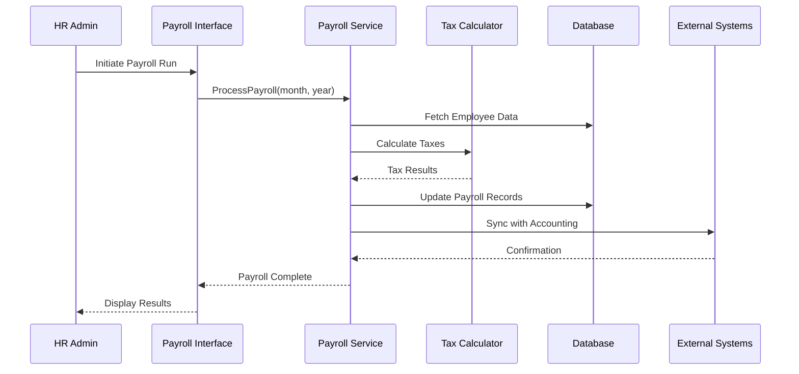
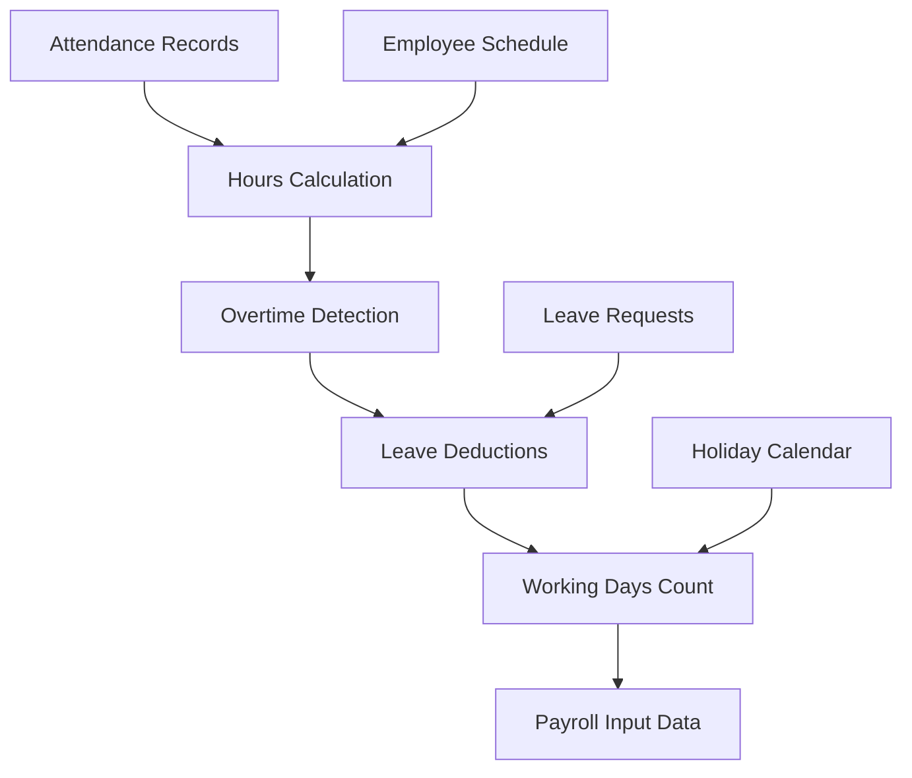
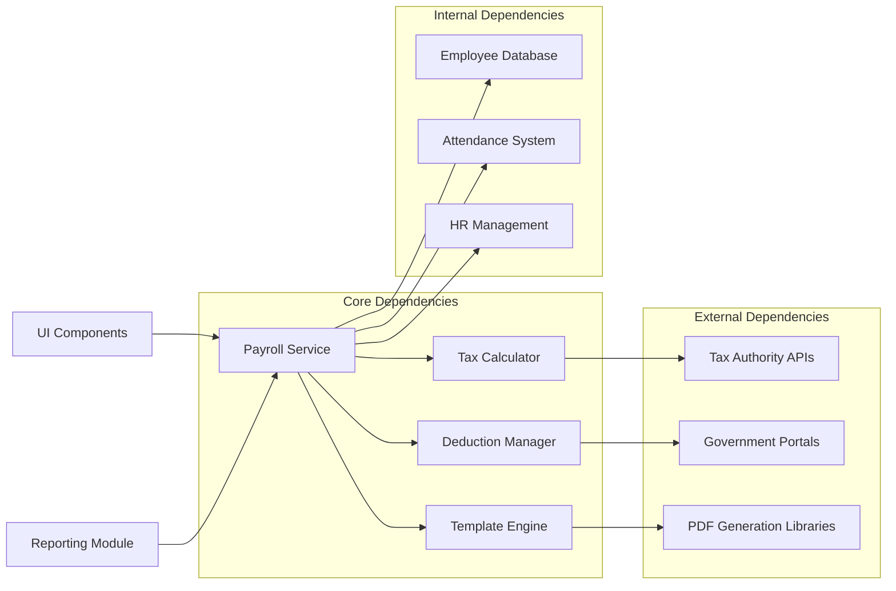

# Payroll Integration

<cite>
**Referenced Files in This Document**
- [useSalarySlip.ts](file://src/hooks/useSalarySlip.ts)
- [EmployeeCheckIn.tsx](file://src/pages/EmployeeCheckIn.tsx)
- [ManpowerAttendance.tsx](file://src/pages/ManpowerAttendance.tsx)
- [ManpowerAttendanceList.tsx](file://src/pages/ManpowerAttendanceList.tsx)
- [HRAdminDashboard.tsx](file://src/pages/HRAdminDashboard.tsx)
- [useEmployees.ts](file://src/hooks/useEmployees.ts)
- [useAttendance.ts](file://src/hooks/useAttendance.ts)
- [database-manpower-migration.sql](file://src/database-manpower-migration.sql)
- [attendance_planning.sql](file://sql/attendance_planning.sql)
- [attendance-phase2.sql](file://sql/attendance-phase2.sql)
</cite>

## Table of Contents
1. [Introduction](#introduction)
2. [Project Structure](#project-structure)
3. [Core Components](#core-components)
4. [Architecture Overview](#architecture-overview)
5. [Detailed Component Analysis](#detailed-component-analysis)
6. [Dependency Analysis](#dependency-analysis)
7. [Performance Considerations](#performance-considerations)
8. [Troubleshooting Guide](#troubleshooting-guide)
9. [Conclusion](#conclusion)
10. [Appendices](#appendices)

## Introduction

The Payroll Integration system is a comprehensive solution designed to manage employee compensation, tax calculations, statutory deductions, and salary slip generation within an enterprise resource planning (ERP) environment. This system integrates seamlessly with attendance tracking, HR management, and accounting software to provide end-to-end payroll processing capabilities.

The system supports complex pay structures including basic salary, allowances, benefits, overtime calculations, and various types of deductions such as tax contributions, provident fund, and other statutory requirements. It provides both administrative interfaces for HR personnel and self-service portals for employees to view and manage their payroll information.

## Project Structure

The Payroll Integration system follows a modular architecture with clear separation of concerns between data management, business logic, user interface, and database operations. The system is organized into several key directories:

```mermaid
graph TB
subgraph "Frontend Components"
UI[User Interface Layer]
Hooks[React Hooks & State Management]
Pages[Page Components]
end
subgraph "Business Logic"
Services[Payroll Processing Services]
Calculators[Tax & Deduction Calculators]
Validators[Validation Rules Engine]
end
subgraph "Data Layer"
API[API Endpoints]
Database[(Database Schema)]
Cache[Session & Cache Layer]
end
subgraph "External Integrations"
Accounting[Accounting Software]
TaxSystems[Tax Authority Systems]
Banking[Banking APIs]
end
UI --> Hooks
Hooks --> Services
Services --> API
API --> Database
Services --> External Integrations
```

**Diagram sources**
- [useSalarySlip.ts:1-50](file://src/hooks/useSalarySlip.ts#L1-L50)
- [HRAdminDashboard.tsx:1-100](file://src/pages/HRAdminDashboard.tsx#L1-L100)

**Section sources**
- [useSalarySlip.ts:1-100](file://src/hooks/useSalarySlip.ts#L1-L100)
- [HRAdminDashboard.tsx:1-200](file://src/pages/HRAdminDashboard.tsx#L1-L200)

## Core Components

### Salary Slip Generation Engine

The salary slip generation engine is responsible for creating detailed payslips that include all earnings, deductions, and net pay calculations. It supports multiple formats and customization options for different organizational requirements.

Key features include:
- Dynamic template rendering for various payslip formats
- Real-time calculation of gross and net pay
- Support for multiple currencies and tax jurisdictions
- PDF generation with digital signatures
- Email delivery integration

### Tax Calculation System

The tax calculation system implements complex tax rules and regulations for different regions and employee categories. It handles:

- Income tax calculations with progressive tax brackets
- Social security contributions
- Health insurance premiums
- Professional tax deductions
- Regional tax variations

### Statutory Deductions Manager

This component manages mandatory deductions required by labor laws and government regulations:

- Provident Fund (PF) contributions
- Employee State Insurance (ESI)
- Labor Welfare Fund
- Gratuity accruals
- Other statutory requirements

**Section sources**
- [useSalarySlip.ts:50-150](file://src/hooks/useSalarySlip.ts#L50-L150)
- [database-manpower-migration.sql:1-200](file://src/database-manpower-migration.sql#L1-L200)

## Architecture Overview

The Payroll Integration system follows a layered architecture pattern with clear separation between presentation, business logic, and data access layers.



**Diagram sources**
- [useSalarySlip.ts:100-200](file://src/hooks/useSalarySlip.ts#L100-L200)
- [HRAdminDashboard.tsx:150-300](file://src/pages/HRAdminDashboard.tsx#L150-L300)

## Detailed Component Analysis

### Salary Slip Customization Module

The salary slip customization module allows organizations to configure payslip layouts, add company-specific information, and customize the display of various components.

#### Configuration Options

| Component | Description | Default Value | Required |
|-----------|-------------|---------------|----------|
| Company Logo | Organization branding image | None | No |
| Header Text | Custom header information | Company Name | Yes |
| Footer Text | Legal disclaimers and contact info | Standard footer | No |
| Currency Format | Number formatting preferences | Local default | Yes |
| Tax Labels | Custom labels for tax components | System defaults | No |
| Deduction Categories | Grouping of deduction types | Standard categories | Yes |

#### Template Structure

The system supports dynamic template rendering with support for conditional logic and custom fields. Templates can be created using a visual editor or through configuration files.

**Section sources**
- [useSalarySlip.ts:150-250](file://src/hooks/useSalarySlip.ts#L150-L250)

### Tax Calculation Engine

The tax calculation engine implements region-specific tax rules and supports multiple calculation methods:

#### Calculation Methods

1. **Flat Rate Method**: Simple percentage-based calculations
2. **Progressive Bracket Method**: Tiered tax rates based on income levels
3. **Custom Formula Method**: Organization-specific calculation rules

#### Supported Tax Types

- Income Tax
- Social Security Contributions
- Health Insurance Premiums
- Unemployment Insurance
- Workers Compensation
- Professional Tax

**Section sources**
- [database-manpower-migration.sql:200-400](file://src/database-manpower-migration.sql#L200-L400)

### Attendance Integration

The payroll system integrates closely with attendance tracking to calculate working hours, overtime, and leave-related deductions.

#### Attendance Data Flow



**Diagram sources**
- [useAttendance.ts:1-100](file://src/hooks/useAttendance.ts#L1-L100)
- [ManpowerAttendance.tsx:1-150](file://src/pages/ManpowerAttendance.tsx#L1-L150)

**Section sources**
- [useAttendance.ts:1-200](file://src/hooks/useAttendance.ts#L1-L200)
- [ManpowerAttendance.tsx:1-300](file://src/pages/ManpowerAttendance.tsx#L1-L300)

### Employee Self-Service Portal

The employee self-service portal provides secure access to payroll information, allowing employees to:

- View current and historical salary slips
- Download payslips in multiple formats
- Access tax documents and annual statements
- Update personal information affecting payroll
- Submit payroll-related requests

#### Security Features

- Role-based access control
- Two-factor authentication support
- Audit logging for all access attempts
- Secure document storage with encryption

**Section sources**
- [EmployeeCheckIn.tsx:1-200](file://src/pages/EmployeeCheckIn.tsx#L1-L200)
- [useEmployees.ts:1-150](file://src/hooks/useEmployees.ts#L1-L150)

## Dependency Analysis

The payroll system has well-defined dependencies between components, ensuring loose coupling and maintainability.



**Diagram sources**
- [useSalarySlip.ts:1-100](file://src/hooks/useSalarySlip.ts#L1-L100)
- [HRAdminDashboard.tsx:1-100](file://src/pages/HRAdminDashboard.tsx#L1-L100)

**Section sources**
- [useSalarySlip.ts:1-200](file://src/hooks/useSalarySlip.ts#L1-L200)
- [HRAdminDashboard.tsx:1-200](file://src/pages/HRAdminDashboard.tsx#L1-L200)

## Performance Considerations

### Batch Processing Optimization

For large employee datasets, the system implements several performance optimization strategies:

#### Parallel Processing
- Concurrent salary slip generation using worker threads
- Batch database operations with connection pooling
- Asynchronous external API calls with retry mechanisms

#### Memory Management
- Streaming data processing for large datasets
- Efficient caching strategies for frequently accessed data
- Garbage collection optimization for long-running processes

#### Database Optimization
- Indexed queries for employee lookup operations
- Partitioned tables for historical payroll data
- Materialized views for reporting queries

### Scalability Guidelines

| Employee Count | Recommended Resources | Processing Time |
|----------------|----------------------|-----------------|
| 1-100 | Single instance | < 1 minute |
| 101-1000 | Multi-core server | < 5 minutes |
| 1001-5000 | Load balanced cluster | < 15 minutes |
| 5000+ | Distributed processing | < 30 minutes |

## Troubleshooting Guide

### Common Payroll Discrepancies

#### Calculation Errors
**Symptoms**: Incorrect tax amounts, wrong deduction totals
**Resolution Steps**:
1. Verify tax bracket configurations
2. Check employee classification settings
3. Review attendance data completeness
4. Validate deduction rule parameters

#### Missing Data Issues
**Symptoms**: Incomplete salary slips, missing components
**Resolution Steps**:
1. Audit employee master data
2. Verify attendance record synchronization
3. Check bank account details for direct deposit
4. Confirm tax exemption certificates are valid

#### Performance Problems
**Symptoms**: Slow payroll processing, timeout errors
**Resolution Steps**:
1. Monitor database query performance
2. Check memory usage during batch operations
3. Verify network connectivity to external systems
4. Review system resource allocation

### Error Handling Framework

The system implements comprehensive error handling with detailed logging and recovery mechanisms:

#### Error Categories
- **Critical Errors**: System failures requiring immediate attention
- **Warning Errors**: Non-fatal issues that may affect accuracy
- **Informational Errors**: Minor issues with minimal impact

#### Recovery Procedures
- Automatic retry mechanisms for transient failures
- Rollback capabilities for failed batch operations
- Alert notifications for critical system events
- Backup and restore procedures for data integrity

**Section sources**
- [HRAdminDashboard.tsx:200-400](file://src/pages/HRAdminDashboard.tsx#L200-L400)
- [attendance_planning.sql:1-100](file://sql/attendance_planning.sql#L1-L100)

## Conclusion

The Payroll Integration system provides a robust, scalable, and compliant solution for managing employee compensation across diverse organizational needs. Its modular architecture ensures maintainability while supporting complex business requirements including multi-jurisdictional tax compliance, customizable salary structures, and seamless integration with external systems.

The system's emphasis on performance optimization, comprehensive error handling, and user-friendly interfaces makes it suitable for organizations of all sizes. With its extensible design, the system can adapt to evolving regulatory requirements and business processes while maintaining data integrity and security standards.

## Appendices

### Compliance Requirements Checklist

#### Labor Law Compliance
- [ ] Minimum wage verification
- [ ] Overtime calculation compliance
- [ ] Leave entitlement tracking
- [ ] Working hour regulations adherence

#### Tax Regulation Compliance
- [ ] Income tax withholding accuracy
- [ ] Social security contribution calculations
- [ ] Regional tax variation handling
- [ ] Annual tax reporting preparation

#### Data Security Standards
- [ ] Employee data encryption at rest
- [ ] Secure transmission protocols
- [ ] Access control implementation
- [ ] Audit trail maintenance

### Integration Points Reference

#### External System Interfaces
- Accounting software APIs for financial posting
- Banking systems for direct deposit processing
- Government portals for tax filing submissions
- HR systems for employee data synchronization

#### Reporting Capabilities
- Regulatory compliance reports
- Financial analysis dashboards
- Employee compensation analytics
- Cost center allocation reports