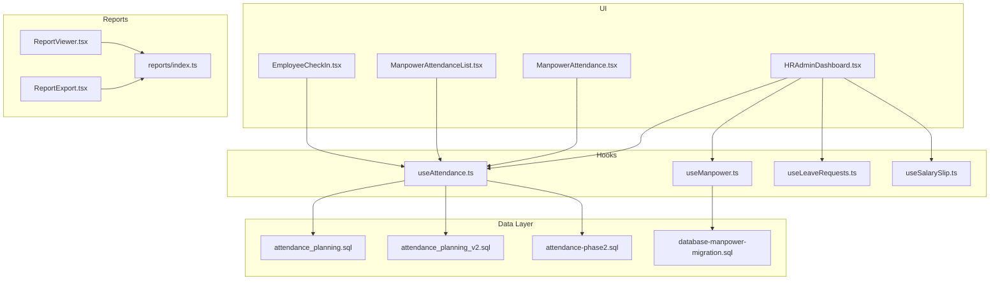
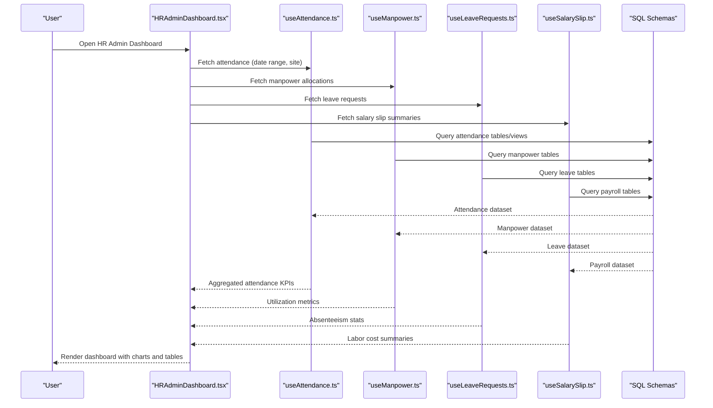
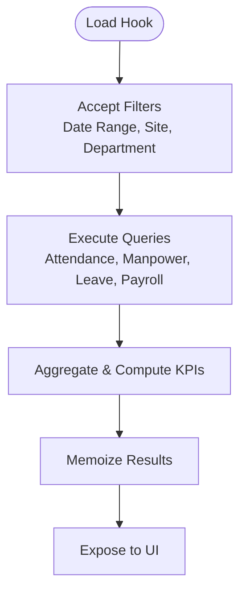
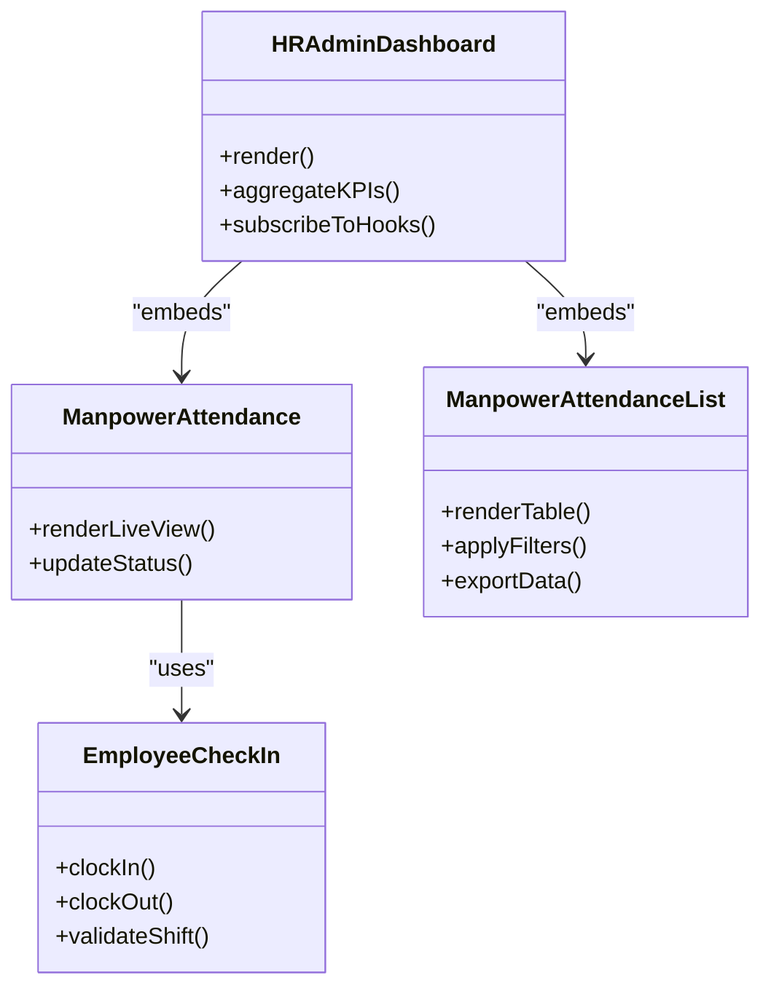
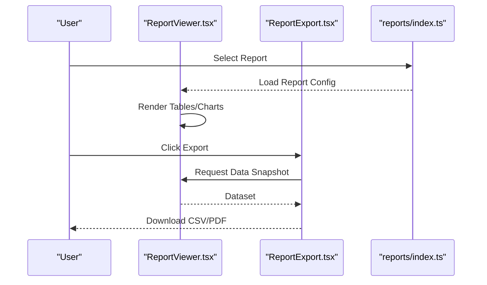
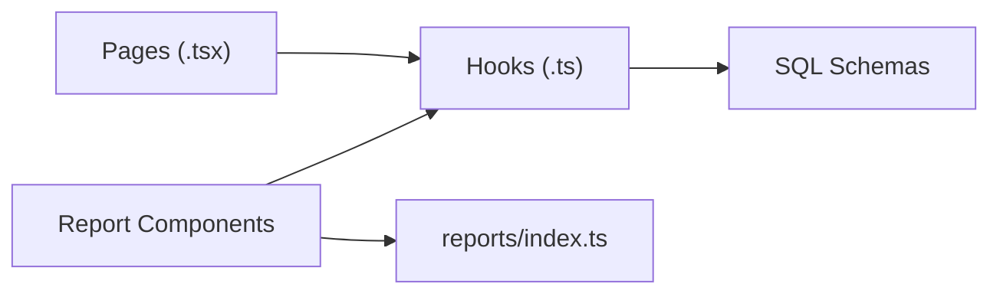

# Workforce Analytics

<cite>
**Referenced Files in This Document**
- [useAttendance.ts](file://src/hooks/useAttendance.ts)
- [useManpower.ts](file://src/hooks/useManpower.ts)
- [useLeaveRequests.ts](file://src/hooks/useLeaveRequests.ts)
- [useSalarySlip.ts](file://src/hooks/useSalarySlip.ts)
- [ManpowerAttendance.tsx](file://src/pages/ManpowerAttendance.tsx)
- [ManpowerAttendanceList.tsx](file://src/pages/ManpowerAttendanceList.tsx)
- [EmployeeCheckIn.tsx](file://src/pages/EmployeeCheckIn.tsx)
- [HRAdminDashboard.tsx](file://src/pages/HRAdminDashboard.tsx)
- [attendance_planning.sql](file://sql/attendance_planning.sql)
- [attendance_planning_v2.sql](file://sql/attendance_planning_v2.sql)
- [attendance-phase2.sql](file://sql/attendance-phase2.sql)
- [database-manpower-migration.sql](file://src/database-manpower-migration.sql)
- [reports/index.ts](file://src/reports/index.ts)
- [components/reports/ReportViewer.tsx](file://src/components/reports/ReportViewer.tsx)
- [components/reports/ReportExport.tsx](file://src/components/reports/ReportExport.tsx)
</cite>

## Table of Contents
1. Introduction
2. Project Structure
3. Core Components
4. Architecture Overview
5. Detailed Component Analysis
6. Dependency Analysis
7. Performance Considerations
8. Troubleshooting Guide
9. Conclusion
10. Appendices

## Introduction
This document provides comprehensive guidance for building and using Workforce Analytics and reporting within the application. It covers key performance indicators (KPIs), workforce dashboards, trend analysis, labor cost analysis, productivity metrics, efficiency reports, absenteeism tracking, turnover analysis, retention insights, custom report creation, data visualization, export capabilities, predictive analytics for workforce planning and capacity management, integration with business intelligence tools, automated reporting schedules, data privacy and anonymization, compliance considerations, and best practices for interpreting workforce metrics to make data-driven HR decisions.

## Project Structure
The workforce analytics capability is implemented across hooks, pages, SQL migrations, and reusable report components:
- Hooks provide data access and state for attendance, manpower, leave requests, and salary slips.
- Pages deliver user-facing dashboards and operational screens for attendance and HR administration.
- SQL files define attendance planning schemas and related database structures.
- Report components encapsulate rendering and export logic for standardized outputs.

**Diagram sources**
- [HRAdminDashboard.tsx](file://src/pages/HRAdminDashboard.tsx)
- [ManpowerAttendance.tsx](file://src/pages/ManpowerAttendance.tsx)
- [ManpowerAttendanceList.tsx](file://src/pages/ManpowerAttendanceList.tsx)
- [EmployeeCheckIn.tsx](file://src/pages/EmployeeCheckIn.tsx)
- [useAttendance.ts](file://src/hooks/useAttendance.ts)
- [useManpower.ts](file://src/hooks/useManpower.ts)
- [useLeaveRequests.ts](file://src/hooks/useLeaveRequests.ts)
- [useSalarySlip.ts](file://src/hooks/useSalarySlip.ts)
- [ReportViewer.tsx](file://src/components/reports/ReportViewer.tsx)
- [ReportExport.tsx](file://src/components/reports/ReportExport.tsx)
- [reports/index.ts](file://src/reports/index.ts)
- [attendance_planning.sql](file://sql/attendance_planning.sql)
- [attendance_planning_v2.sql](file://sql/attendance_planning_v2.sql)
- [attendance-phase2.sql](file://sql/attendance-phase2.sql)
- [database-manpower-migration.sql](file://src/database-manpower-migration.sql)

**Section sources**
- [useAttendance.ts](file://src/hooks/useAttendance.ts)
- [useManpower.ts](file://src/hooks/useManpower.ts)
- [useLeaveRequests.ts](file://src/hooks/useLeaveRequests.ts)
- [useSalarySlip.ts](file://src/hooks/useSalarySlip.ts)
- [ManpowerAttendance.tsx](file://src/pages/ManpowerAttendance.tsx)
- [ManpowerAttendanceList.tsx](file://src/pages/ManpowerAttendanceList.tsx)
- [EmployeeCheckIn.tsx](file://src/pages/EmployeeCheckIn.tsx)
- [HRAdminDashboard.tsx](file://src/pages/HRAdminDashboard.tsx)
- [attendance_planning.sql](file://sql/attendance_planning.sql)
- [attendance_planning_v2.sql](file://sql/attendance_planning_v2.sql)
- [attendance-phase2.sql](file://sql/attendance-phase2.sql)
- [database-manpower-migration.sql](file://src/database-manpower-migration.sql)
- [reports/index.ts](file://src/reports/index.ts)
- [components/reports/ReportViewer.tsx](file://src/components/reports/ReportViewer.tsx)
- [components/reports/ReportExport.tsx](file://src/components/reports/ReportExport.tsx)

## Core Components
- Attendance and Manpower Hooks
  - useAttendance.ts: Centralizes attendance data fetching, filtering by date range and site, and aggregates presence status.
  - useManpower.ts: Provides manpower allocation and utilization data for planning and reporting.
  - useLeaveRequests.ts: Supplies leave request lifecycle data for absenteeism and coverage analysis.
  - useSalarySlip.ts: Exposes payroll-related fields used in labor cost analysis.

- Operational Pages
  - ManpowerAttendance.tsx: Real-time or near-real-time attendance view for managers.
  - ManpowerAttendanceList.tsx: Tabular listing with filters and drill-downs.
  - EmployeeCheckIn.tsx: Entry point for clock-in/out operations that feed attendance analytics.
  - HRAdminDashboard.tsx: Consolidated dashboard aggregating attendance, manpower, leave, and payroll summaries.

- Reporting Components
  - ReportViewer.tsx: Renders tabular and charted views for workforce metrics.
  - ReportExport.tsx: Handles CSV/PDF exports from report views.
  - reports/index.ts: Registry of available reports and their metadata.

- Data Layer
  - attendance_planning.sql, attendance_planning_v2.sql, attendance-phase2.sql: Define attendance tables, indexes, and planning views.
  - database-manpower-migration.sql: Establishes manpower schema and relationships.

**Section sources**
- [useAttendance.ts](file://src/hooks/useAttendance.ts)
- [useManpower.ts](file://src/hooks/useManpower.ts)
- [useLeaveRequests.ts](file://src/hooks/useLeaveRequests.ts)
- [useSalarySlip.ts](file://src/hooks/useSalarySlip.ts)
- [ManpowerAttendance.tsx](file://src/pages/ManpowerAttendance.tsx)
- [ManpowerAttendanceList.tsx](file://src/pages/ManpowerAttendanceList.tsx)
- [EmployeeCheckIn.tsx](file://src/pages/EmployeeCheckIn.tsx)
- [HRAdminDashboard.tsx](file://src/pages/HRAdminDashboard.tsx)
- [ReportViewer.tsx](file://src/components/reports/ReportViewer.tsx)
- [ReportExport.tsx](file://src/components/reports/ReportExport.tsx)
- [reports/index.ts](file://src/reports/index.ts)
- [attendance_planning.sql](file://sql/attendance_planning.sql)
- [attendance_planning_v2.sql](file://sql/attendance_planning_v2.sql)
- [attendance-phase2.sql](file://sql/attendance-phase2.sql)
- [database-manpower-migration.sql](file://src/database-manpower-migration.sql)

## Architecture Overview
Workforce analytics follows a layered architecture: UI pages consume typed hooks; hooks query the database via SQL-defined schemas; report components render and export results. The HR admin dashboard orchestrates multiple data sources into unified KPIs.

**Diagram sources**
- [HRAdminDashboard.tsx](file://src/pages/HRAdminDashboard.tsx)
- [useAttendance.ts](file://src/hooks/useAttendance.ts)
- [useManpower.ts](file://src/hooks/useManpower.ts)
- [useLeaveRequests.ts](file://src/hooks/useLeaveRequests.ts)
- [useSalarySlip.ts](file://src/hooks/useSalarySlip.ts)
- [attendance_planning.sql](file://sql/attendance_planning.sql)
- [attendance_planning_v2.sql](file://sql/attendance_planning_v2.sql)
- [attendance-phase2.sql](file://sql/attendance-phase2.sql)
- [database-manpower-migration.sql](file://src/database-manpower-migration.sql)

## Detailed Component Analysis

### Attendance and Manpower Hooks
- Responsibilities
  - Aggregate daily attendance counts, present/absent ratios, and site-level breakdowns.
  - Provide manpower allocation snapshots and utilization percentages.
  - Surface leave request statuses for absence forecasting.
  - Summarize salary slip totals for labor cost calculations.

- Key Metrics Derived
  - Headcount, active headcount, average daily attendance.
  - Absenteeism rate, planned vs actual utilization.
  - Leave coverage gaps and backfill needs.
  - Labor cost per project/site and variance against budget.

- Data Flow
  - Hooks accept filter parameters (date range, department/site).
  - Queries are executed against attendance and manpower schemas.
  - Results are memoized and exposed to UI components.

**Diagram sources**
- [useAttendance.ts](file://src/hooks/useAttendance.ts)
- [useManpower.ts](file://src/hooks/useManpower.ts)
- [useLeaveRequests.ts](file://src/hooks/useLeaveRequests.ts)
- [useSalarySlip.ts](file://src/hooks/useSalarySlip.ts)
- [attendance_planning.sql](file://sql/attendance_planning.sql)
- [attendance_planning_v2.sql](file://sql/attendance_planning_v2.sql)
- [attendance-phase2.sql](file://sql/attendance-phase2.sql)
- [database-manpower-migration.sql](file://src/database-manpower-migration.sql)

**Section sources**
- [useAttendance.ts](file://src/hooks/useAttendance.ts)
- [useManpower.ts](file://src/hooks/useManpower.ts)
- [useLeaveRequests.ts](file://src/hooks/useLeaveRequests.ts)
- [useSalarySlip.ts](file://src/hooks/useSalarySlip.ts)
- [attendance_planning.sql](file://sql/attendance_planning.sql)
- [attendance_planning_v2.sql](file://sql/attendance_planning_v2.sql)
- [attendance-phase2.sql](file://sql/attendance-phase2.sql)
- [database-manpower-migration.sql](file://src/database-manpower-migration.sql)

### Operational Pages
- ManpowerAttendance.tsx
  - Displays real-time attendance status, shift adherence, and on-site presence.
  - Integrates with check-in flows to update attendance records promptly.

- ManpowerAttendanceList.tsx
  - Provides sortable/filterable lists with export options.
  - Supports drill-down to individual employee histories.

- EmployeeCheckIn.tsx
  - Captures clock-in/out events and validates eligibility based on shifts and permissions.
  - Triggers downstream updates for attendance analytics.

- HRAdminDashboard.tsx
  - Orchestrates multiple hooks to present consolidated KPIs.
  - Includes trend lines for absenteeism, utilization, and labor costs.

**Diagram sources**
- [HRAdminDashboard.tsx](file://src/pages/HRAdminDashboard.tsx)
- [ManpowerAttendance.tsx](file://src/pages/ManpowerAttendance.tsx)
- [ManpowerAttendanceList.tsx](file://src/pages/ManpowerAttendanceList.tsx)
- [EmployeeCheckIn.tsx](file://src/pages/EmployeeCheckIn.tsx)

**Section sources**
- [ManpowerAttendance.tsx](file://src/pages/ManpowerAttendance.tsx)
- [ManpowerAttendanceList.tsx](file://src/pages/ManpowerAttendanceList.tsx)
- [EmployeeCheckIn.tsx](file://src/pages/EmployeeCheckIn.tsx)
- [HRAdminDashboard.tsx](file://src/pages/HRAdminDashboard.tsx)

### Reporting Components
- ReportViewer.tsx
  - Renders tabular and charted views for workforce metrics.
  - Supports dynamic column selection and grouping.

- ReportExport.tsx
  - Exports current report view to CSV or PDF.
  - Applies formatting and pagination for large datasets.

- reports/index.ts
  - Defines available reports, titles, descriptions, and default filters.
  - Acts as a registry for navigation and scheduling.

**Diagram sources**
- [ReportViewer.tsx](file://src/components/reports/ReportViewer.tsx)
- [ReportExport.tsx](file://src/components/reports/ReportExport.tsx)
- [reports/index.ts](file://src/reports/index.ts)

**Section sources**
- [components/reports/ReportViewer.tsx](file://src/components/reports/ReportViewer.tsx)
- [components/reports/ReportExport.tsx](file://src/components/reports/ReportExport.tsx)
- [reports/index.ts](file://src/reports/index.ts)

## Dependency Analysis
- UI-to-Hook Dependencies
  - Pages depend on hooks for data retrieval and state synchronization.
  - Hooks encapsulate query logic and expose normalized datasets.

- Hook-to-Database Dependencies
  - Attendance hooks rely on attendance planning schemas.
  - Manpower hooks rely on manpower migration schemas.
  - Leave and payroll hooks rely on respective tables defined in migrations.

- Report Component Cohesion
  - ReportViewer and ReportExport share a common registry for report definitions.
  - Export functionality depends on rendered data snapshots from viewers.

**Diagram sources**
- [ManpowerAttendance.tsx](file://src/pages/ManpowerAttendance.tsx)
- [ManpowerAttendanceList.tsx](file://src/pages/ManpowerAttendanceList.tsx)
- [EmployeeCheckIn.tsx](file://src/pages/EmployeeCheckIn.tsx)
- [HRAdminDashboard.tsx](file://src/pages/HRAdminDashboard.tsx)
- [useAttendance.ts](file://src/hooks/useAttendance.ts)
- [useManpower.ts](file://src/hooks/useManpower.ts)
- [useLeaveRequests.ts](file://src/hooks/useLeaveRequests.ts)
- [useSalarySlip.ts](file://src/hooks/useSalarySlip.ts)
- [attendance_planning.sql](file://sql/attendance_planning.sql)
- [attendance_planning_v2.sql](file://sql/attendance_planning_v2.sql)
- [attendance-phase2.sql](file://sql/attendance-phase2.sql)
- [database-manpower-migration.sql](file://src/database-manpower-migration.sql)
- [ReportViewer.tsx](file://src/components/reports/ReportViewer.tsx)
- [ReportExport.tsx](file://src/components/reports/ReportExport.tsx)
- [reports/index.ts](file://src/reports/index.ts)

**Section sources**
- [useAttendance.ts](file://src/hooks/useAttendance.ts)
- [useManpower.ts](file://src/hooks/useManpower.ts)
- [useLeaveRequests.ts](file://src/hooks/useLeaveRequests.ts)
- [useSalarySlip.ts](file://src/hooks/useSalarySlip.ts)
- [attendance_planning.sql](file://sql/attendance_planning.sql)
- [attendance_planning_v2.sql](file://sql/attendance_planning_v2.sql)
- [attendance-phase2.sql](file://sql/attendance-phase2.sql)
- [database-manpower-migration.sql](file://src/database-manpower-migration.sql)
- [ReportViewer.tsx](file://src/components/reports/ReportViewer.tsx)
- [ReportExport.tsx](file://src/components/reports/ReportExport.tsx)
- [reports/index.ts](file://src/reports/index.ts)

## Performance Considerations
- Indexing Strategy
  - Ensure attendance tables include indexes on date, site_id, and employee_id columns to optimize filtering and aggregation.
  - Add composite indexes for common query patterns (e.g., date_range + site_id).

- Query Optimization
  - Use pre-aggregated views for daily summaries to reduce runtime computation.
  - Limit result sets with pagination and server-side filtering.

- Client-Side Rendering
  - Memoize hook results to avoid redundant re-renders.
  - Virtualize large tables in list views to maintain responsiveness.

- Export Efficiency
  - Stream large exports rather than loading entire datasets into memory.
  - Compress PDF exports when necessary.

[No sources needed since this section provides general guidance]

## Troubleshooting Guide
- Attendance Not Reflecting Clock-In/Out
  - Verify EmployeeCheckIn.tsx validation logic and ensure shift assignments exist.
  - Confirm attendance hooks are subscribed to live updates and that database triggers fire correctly.

- Dashboard KPIs Incorrect
  - Inspect HRAdminDashboard.tsx aggregation logic and confirm date range filters are applied consistently.
  - Validate leave requests and manpower allocations are included in computations.

- Export Failures
  - Check ReportExport.tsx for dataset size limits and format compatibility.
  - Review browser console for errors during CSV/PDF generation.

- Slow Queries
  - Analyze execution plans for attendance and manpower queries.
  - Add missing indexes and consider materialized views for heavy aggregations.

**Section sources**
- [EmployeeCheckIn.tsx](file://src/pages/EmployeeCheckIn.tsx)
- [HRAdminDashboard.tsx](file://src/pages/HRAdminDashboard.tsx)
- [ReportExport.tsx](file://src/components/reports/ReportExport.tsx)
- [useAttendance.ts](file://src/hooks/useAttendance.ts)
- [useManpower.ts](file://src/hooks/useManpower.ts)

## Conclusion
The workforce analytics module integrates attendance, manpower, leave, and payroll data through well-structured hooks and pages, enabling robust dashboards and reporting. By leveraging indexed schemas, optimized queries, and cohesive report components, teams can derive actionable insights on productivity, absenteeism, turnover, and labor costs. Extending the system with predictive models and BI integrations further enhances strategic workforce planning while maintaining strong data privacy and compliance standards.

[No sources needed since this section summarizes without analyzing specific files]

## Appendices

### Key Performance Indicators (KPIs)
- Attendance and Presence
  - Average Daily Attendance Rate
  - On-Time Arrival Percentage
  - Shift Adherence Rate
- Absenteeism and Turnover
  - Absenteeism Rate (planned vs unplanned)
  - Turnover Rate (voluntary/involuntary)
  - Retention Rate by Department/Site
- Productivity and Efficiency
  - Utilization Rate (allocated vs actual hours)
  - Output per Worker Hour
  - Overtime Ratio
- Labor Cost Analysis
  - Labor Cost per Project/Site
  - Variance Against Budget
  - Cost per Unit Produced

[No sources needed since this section provides general guidance]

### Custom Report Creation
- Steps
  - Register a new report in reports/index.ts with title, description, and default filters.
  - Implement data fetching in relevant hooks (attendance/manpower/leave/payroll).
  - Build a ReportViewer configuration for table columns and chart types.
  - Enable export via ReportExport.tsx with appropriate formatting.

**Section sources**
- [reports/index.ts](file://src/reports/index.ts)
- [useAttendance.ts](file://src/hooks/useAttendance.ts)
- [useManpower.ts](file://src/hooks/useManpower.ts)
- [useLeaveRequests.ts](file://src/hooks/useLeaveRequests.ts)
- [useSalarySlip.ts](file://src/hooks/useSalarySlip.ts)
- [ReportViewer.tsx](file://src/components/reports/ReportViewer.tsx)
- [ReportExport.tsx](file://src/components/reports/ReportExport.tsx)

### Data Visualization Examples
- Trend Lines
  - Monthly absenteeism trends by site.
  - Quarterly utilization rates by department.
- Heatmaps
  - Daily attendance heatmaps highlighting peak and low activity periods.
- Stacked Bars
  - Labor cost composition by category (base pay, overtime, allowances).

[No sources needed since this section provides general guidance]

### Predictive Analytics for Workforce Planning
- Capacity Management
  - Forecast demand based on historical project pipelines and seasonal patterns.
  - Model staffing requirements using regression on past utilization and output.
- Attrition Risk
  - Identify employees at risk of leaving using tenure, leave frequency, and performance signals.
- Scenario Planning
  - Simulate impact of hiring freezes or surge staffing on labor costs and delivery timelines.

[No sources needed since this section provides general guidance]

### Integration with Business Intelligence Tools
- Data Extraction
  - Use scheduled exports from ReportExport.tsx to populate BI datasets.
  - Connect BI tools directly to database views for live dashboards.
- Transformation
  - Apply BI-layer transformations for advanced analytics and cross-domain insights.
- Visualization
  - Leverage BI-native charting for executive-level presentations.

[No sources needed since this section provides general guidance]

### Automated Reporting Schedules
- Approaches
  - Server-side cron jobs to generate and email PDF reports.
  - Webhooks triggering BI refreshes upon data updates.
- Configuration
  - Define schedule metadata in reports/index.ts and orchestrate via task queues.

[No sources needed since this section provides general guidance]

### Data Privacy, Anonymization, and Compliance
- Anonymization
  - Mask personally identifiable information (PII) in exported reports unless explicitly authorized.
  - Aggregate data at group levels for sensitive analyses.
- Access Control
  - Enforce role-based access to attendance and payroll data.
- Compliance
  - Align with GDPR/CCPA principles: consent, minimization, right to erasure.
  - Maintain audit logs for data access and modifications.

[No sources needed since this section provides general guidance]

### Best Practices for Interpreting Workforce Metrics
- Contextualize Trends
  - Compare against industry benchmarks and internal targets.
- Segment Carefully
  - Break down metrics by site, department, and shift to uncover hidden patterns.
- Avoid Overreliance on Single Metrics
  - Combine attendance, utilization, and cost metrics for holistic insights.
- Validate Data Quality
  - Regularly reconcile attendance clocks with payroll and project records.

[No sources needed since this section provides general guidance]