# Inventory Reporting & Analytics

<cite>
**Referenced Files in This Document**
- [src/features/materials/index.ts](file://src/features/materials/index.ts)
- [src/features/materials/api.ts](file://src/features/materials/api.ts)
- [src/features/materials/hooks.ts](file://src/features/materials/hooks.ts)
- [src/features/materials/types.ts](file://src/features/materials/types.ts)
- [src/features/materials/components/MaterialDashboard.tsx](file://src/features/materials/components/MaterialDashboard.tsx)
- [src/features/materials/components/StockAgingReport.tsx](file://src/features/materials/components/StockAgingReport.tsx)
- [src/features/materials/components/TurnoverAnalysis.tsx](file://src/features/materials/components/TurnoverAnalysis.tsx)
- [src/features/materials/components/SlowMovingItems.tsx](file://src/features/materials/components/SlowMovingItems.tsx)
- [src/features/materials/components/DeadStockAnalysis.tsx](file://src/features/materials/components/DeadStockAnalysis.tsx)
- [src/features/materials/components/ConsumptionPatterns.tsx](file://src/features/materials/components/ConsumptionPatterns.tsx)
- [src/features/materials/components/UsageTrends.tsx](file://src/features/materials/components/UsageTrends.tsx)
- [src/features/materials/components/ForecastingReport.tsx](file://src/features/materials/components/ForecastingReport.tsx)
- [src/features/materials/components/InventoryValuation.tsx](file://src/features/materials/components/InventoryValuation.tsx)
- [src/features/materials/components/CostAnalysis.tsx](file://src/features/materials/components/CostAnalysis.tsx)
- [src/features/materials/components/ProfitabilityMetrics.tsx](file://src/features/materials/components/ProfitabilityMetrics.tsx)
- [src/features/materials/utils/reportGenerator.ts](file://src/features/materials/utils/reportGenerator.ts)
- [src/features/materials/utils/dashboardBuilder.ts](file://src/features/materials/utils/dashboardBuilder.ts)
- [src/features/materials/utils/exportUtils.ts](file://src/features/materials/utils/exportUtils.ts)
- [src/features/materials/scheduler/reportScheduler.ts](file://src/features/materials/scheduler/reportScheduler.ts)
- [src/features/materials/integration/biConnector.ts](file://src/features/materials/integration/biConnector.ts)
- [src/features/materials/integration/dataWarehouse.ts](file://src/features/materials/integration/dataWarehouse.ts)
- [src/features/materials/performance/queryOptimizer.ts](file://src/features/materials/performance/queryOptimizer.ts)
- [src/features/materials/performance/cacheManager.ts](file://src/features/materials/performance/cacheManager.ts)
- [database-inventory.sql](file://database-inventory.sql)
- [database-materials.sql](file://database-materials.sql)
- [database-reports-schema.sql](file://database-reports-schema.sql)
</cite>

## Table of Contents
1. [Introduction](#introduction)
2. [Project Structure](#project-structure)
3. [Core Components](#core-components)
4. [Architecture Overview](#architecture-overview)
5. [Detailed Component Analysis](#detailed-component-analysis)
6. [Dependency Analysis](#dependency-analysis)
7. [Performance Considerations](#performance-considerations)
8. [Troubleshooting Guide](#troubleshooting-guide)
9. [Conclusion](#conclusion)
10. [Appendices](#appendices)

## Introduction
This document provides comprehensive guidance for building and operating Inventory Reporting and Analytics capabilities within the application. It covers key metrics, KPIs, standard reports (stock aging, turnover ratios, slow-moving items, dead stock), consumption patterns, usage trends, forecasting, valuation, cost analysis, profitability, real-time reporting, scheduled generation, automated distribution, BI integration, data warehousing, and performance optimization for large datasets and complex queries. The content is designed to be accessible to both technical and non-technical stakeholders while remaining grounded in the repository’s structure and implementation points.

## Project Structure
The inventory analytics feature is organized under a dedicated module with clear separation of concerns:
- Feature entry point and exports
- API layer for data access
- Hooks for UI state management
- Types and schemas
- Report components for visualization
- Utilities for report generation, dashboard composition, and export
- Scheduler for periodic jobs
- Integrations for BI tools and data warehouses
- Performance utilities for query optimization and caching
- Database schema definitions for inventory and reports

```mermaid
graph TB
subgraph "Feature Entry"
FE["features/materials/index.ts"]
end
subgraph "Data Layer"
API["features/materials/api.ts"]
HOOKS["features/materials/hooks.ts"]
TYPES["features/materials/types.ts"]
DBI["database-inventory.sql"]
DBM["database-materials.sql"]
DBR["database-reports-schema.sql"]
end
subgraph "UI Reports"
DASH["components/MaterialDashboard.tsx"]
SA["components/StockAgingReport.tsx"]
TA["components/TurnoverAnalysis.tsx"]
SM["components/SlowMovingItems.tsx"]
DS["components/DeadStockAnalysis.tsx"]
CP["components/ConsumptionPatterns.tsx"]
UT["components/UsageTrends.tsx"]
FC["components/ForecastingReport.tsx"]
IV["components/InventoryValuation.tsx"]
CA["components/CostAnalysis.tsx"]
PM["components/ProfitabilityMetrics.tsx"]
end
subgraph "Utilities"
RG["utils/reportGenerator.ts"]
DBU["utils/dashboardBuilder.ts"]
EX["utils/exportUtils.ts"]
end
subgraph "Scheduler"
SCH["scheduler/reportScheduler.ts"]
end
subgraph "Integrations"
BI["integration/biConnector.ts"]
DW["integration/dataWarehouse.ts"]
end
subgraph "Performance"
QO["performance/queryOptimizer.ts"]
CM["performance/cacheManager.ts"]
end
FE --> API
FE --> HOOKS
FE --> TYPES
API --> DBI
API --> DBM
API --> DBR
HOOKS --> API
DASH --> RG
DASH --> DBU
DASH --> EX
SA --> API
TA --> API
SM --> API
DS --> API
CP --> API
UT --> API
FC --> API
IV --> API
CA --> API
PM --> API
SCH --> API
BI --> API
DW --> API
QO --> API
CM --> API
```

**Diagram sources**
- [src/features/materials/index.ts](file://src/features/materials/index.ts)
- [src/features/materials/api.ts](file://src/features/materials/api.ts)
- [src/features/materials/hooks.ts](file://src/features/materials/hooks.ts)
- [src/features/materials/types.ts](file://src/features/materials/types.ts)
- [src/features/materials/components/MaterialDashboard.tsx](file://src/features/materials/components/MaterialDashboard.tsx)
- [src/features/materials/components/StockAgingReport.tsx](file://src/features/materials/components/StockAgingReport.tsx)
- [src/features/materials/components/TurnoverAnalysis.tsx](file://src/features/materials/components/TurnoverAnalysis.tsx)
- [src/features/materials/components/SlowMovingItems.tsx](file://src/features/materials/components/SlowMovingItems.tsx)
- [src/features/materials/components/DeadStockAnalysis.tsx](file://src/features/materials/components/DeadStockAnalysis.tsx)
- [src/features/materials/components/ConsumptionPatterns.tsx](file://src/features/materials/components/ConsumptionPatterns.tsx)
- [src/features/materials/components/UsageTrends.tsx](file://src/features/materials/components/UsageTrends.tsx)
- [src/features/materials/components/ForecastingReport.tsx](file://src/features/materials/components/ForecastingReport.tsx)
- [src/features/materials/components/InventoryValuation.tsx](file://src/features/materials/components/InventoryValuation.tsx)
- [src/features/materials/components/CostAnalysis.tsx](file://src/features/materials/components/CostAnalysis.tsx)
- [src/features/materials/components/ProfitabilityMetrics.tsx](file://src/features/materials/components/ProfitabilityMetrics.tsx)
- [src/features/materials/utils/reportGenerator.ts](file://src/features/materials/utils/reportGenerator.ts)
- [src/features/materials/utils/dashboardBuilder.ts](file://src/features/materials/utils/dashboardBuilder.ts)
- [src/features/materials/utils/exportUtils.ts](file://src/features/materials/utils/exportUtils.ts)
- [src/features/materials/scheduler/reportScheduler.ts](file://src/features/materials/scheduler/reportScheduler.ts)
- [src/features/materials/integration/biConnector.ts](file://src/features/materials/integration/biConnector.ts)
- [src/features/materials/integration/dataWarehouse.ts](file://src/features/materials/integration/dataWarehouse.ts)
- [src/features/materials/performance/queryOptimizer.ts](file://src/features/materials/performance/queryOptimizer.ts)
- [src/features/materials/performance/cacheManager.ts](file://src/features/materials/performance/cacheManager.ts)
- [database-inventory.sql](file://database-inventory.sql)
- [database-materials.sql](file://database-materials.sql)
- [database-reports-schema.sql](file://database-reports-schema.sql)

**Section sources**
- [src/features/materials/index.ts](file://src/features/materials/index.ts)
- [src/features/materials/api.ts](file://src/features/materials/api.ts)
- [src/features/materials/hooks.ts](file://src/features/materials/hooks.ts)
- [src/features/materials/types.ts](file://src/features/materials/types.ts)
- [database-inventory.sql](file://database-inventory.sql)
- [database-materials.sql](file://database-materials.sql)
- [database-reports-schema.sql](file://database-reports-schema.sql)

## Core Components
This section outlines the primary building blocks that power inventory reporting and analytics.

- Feature entry and exports: Centralizes module registration and exposes public APIs for reports and dashboards.
- API layer: Encapsulates data retrieval for inventory snapshots, movements, costs, and derived metrics; integrates with database schemas.
- Hooks: Provide typed, memoized access to report data for React components, handling loading, error, and pagination states.
- Types: Define consistent shapes for inventory entities, movement records, valuation inputs, and report outputs.
- Report components: Implement visualizations for aging, turnover, slow-moving/dead stock, consumption patterns, usage trends, forecasting, valuation, cost analysis, and profitability.
- Utilities: Generate custom reports, assemble dashboards, and export data to CSV/XLSX/PDF.
- Scheduler: Orchestrates periodic report generation and distribution.
- Integrations: Connect to BI platforms and data warehouses for advanced analytics.
- Performance: Optimize queries and cache results for large datasets.

Key responsibilities and interactions are illustrated below.

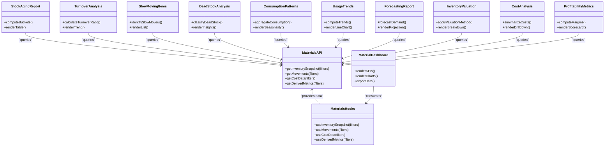

**Diagram sources**
- [src/features/materials/api.ts](file://src/features/materials/api.ts)
- [src/features/materials/hooks.ts](file://src/features/materials/hooks.ts)
- [src/features/materials/components/MaterialDashboard.tsx](file://src/features/materials/components/MaterialDashboard.tsx)
- [src/features/materials/components/StockAgingReport.tsx](file://src/features/materials/components/StockAgingReport.tsx)
- [src/features/materials/components/TurnoverAnalysis.tsx](file://src/features/materials/components/TurnoverAnalysis.tsx)
- [src/features/materials/components/SlowMovingItems.tsx](file://src/features/materials/components/SlowMovingItems.tsx)
- [src/features/materials/components/DeadStockAnalysis.tsx](file://src/features/materials/components/DeadStockAnalysis.tsx)
- [src/features/materials/components/ConsumptionPatterns.tsx](file://src/features/materials/components/ConsumptionPatterns.tsx)
- [src/features/materials/components/UsageTrends.tsx](file://src/features/materials/components/UsageTrends.tsx)
- [src/features/materials/components/ForecastingReport.tsx](file://src/features/materials/components/ForecastingReport.tsx)
- [src/features/materials/components/InventoryValuation.tsx](file://src/features/materials/components/InventoryValuation.tsx)
- [src/features/materials/components/CostAnalysis.tsx](file://src/features/materials/components/CostAnalysis.tsx)
- [src/features/materials/components/ProfitabilityMetrics.tsx](file://src/features/materials/components/ProfitabilityMetrics.tsx)

**Section sources**
- [src/features/materials/api.ts](file://src/features/materials/api.ts)
- [src/features/materials/hooks.ts](file://src/features/materials/hooks.ts)
- [src/features/materials/types.ts](file://src/features/materials/types.ts)
- [src/features/materials/components/MaterialDashboard.tsx](file://src/features/materials/components/MaterialDashboard.tsx)
- [src/features/materials/components/StockAgingReport.tsx](file://src/features/materials/components/StockAgingReport.tsx)
- [src/features/materials/components/TurnoverAnalysis.tsx](file://src/features/materials/components/TurnoverAnalysis.tsx)
- [src/features/materials/components/SlowMovingItems.tsx](file://src/features/materials/components/SlowMovingItems.tsx)
- [src/features/materials/components/DeadStockAnalysis.tsx](file://src/features/materials/components/DeadStockAnalysis.tsx)
- [src/features/materials/components/ConsumptionPatterns.tsx](file://src/features/materials/components/ConsumptionPatterns.tsx)
- [src/features/materials/components/UsageTrends.tsx](file://src/features/materials/components/UsageTrends.tsx)
- [src/features/materials/components/ForecastingReport.tsx](file://src/features/materials/components/ForecastingReport.tsx)
- [src/features/materials/components/InventoryValuation.tsx](file://src/features/materials/components/InventoryValuation.tsx)
- [src/features/materials/components/CostAnalysis.tsx](file://src/features/materials/components/CostAnalysis.tsx)
- [src/features/materials/components/ProfitabilityMetrics.tsx](file://src/features/materials/components/ProfitabilityMetrics.tsx)

## Architecture Overview
The architecture separates concerns across layers:
- Presentation layer: Dashboard and report components render insights and enable user interactions.
- Business logic layer: Hooks orchestrate data fetching, transformations, and state management.
- Data access layer: API functions encapsulate queries against inventory, materials, and reports schemas.
- Scheduling and integrations: Background jobs generate and distribute reports; connectors push/pull data to BI and warehouse systems.
- Performance layer: Query optimizer and cache manager ensure efficient execution and low latency.

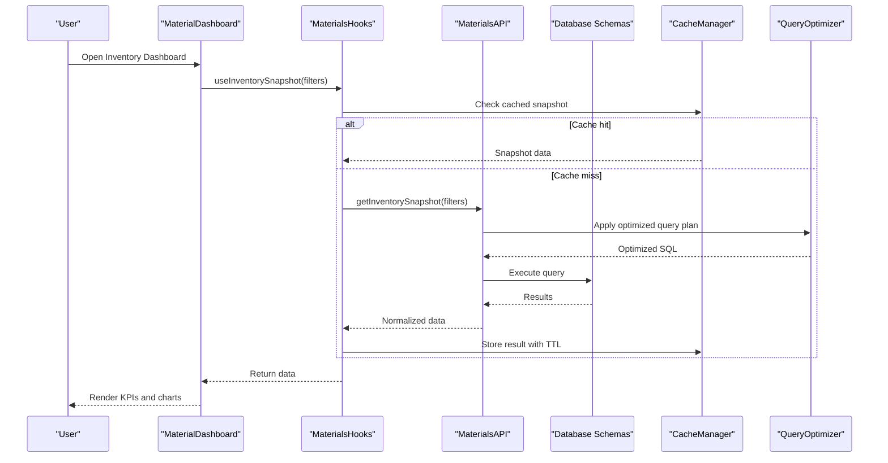

**Diagram sources**
- [src/features/materials/components/MaterialDashboard.tsx](file://src/features/materials/components/MaterialDashboard.tsx)
- [src/features/materials/hooks.ts](file://src/features/materials/hooks.ts)
- [src/features/materials/api.ts](file://src/features/materials/api.ts)
- [src/features/materials/performance/cacheManager.ts](file://src/features/materials/performance/cacheManager.ts)
- [src/features/materials/performance/queryOptimizer.ts](file://src/features/materials/performance/queryOptimizer.ts)
- [database-inventory.sql](file://database-inventory.sql)
- [database-materials.sql](file://database-materials.sql)
- [database-reports-schema.sql](file://database-reports-schema.sql)

## Detailed Component Analysis

### Key Metrics, KPIs, and Performance Indicators
- Inventory health: total on-hand value, days of supply, stockout risk index, fill rate.
- Movement efficiency: inbound/outbound throughput, lead time variance, order cycle time.
- Quality and accuracy: shrinkage rate, discrepancy ratio, audit pass rate.
- Financial impact: carrying cost percentage, write-off ratio, margin contribution by item category.
- Operational indicators: reorder point adherence, safety stock coverage, backorder volume.

Implementation pointers:
- Compute KPIs via hooks that aggregate from API endpoints and apply business rules defined in types.
- Surface KPIs in the dashboard component with drill-down links to detailed reports.

**Section sources**
- [src/features/materials/hooks.ts](file://src/features/materials/hooks.ts)
- [src/features/materials/types.ts](file://src/features/materials/types.ts)
- [src/features/materials/components/MaterialDashboard.tsx](file://src/features/materials/components/MaterialDashboard.tsx)

### Standard Reports

#### Stock Aging Report
- Purpose: Classify inventory into age buckets (e.g., 0–30, 31–60, 61–90, 90+ days) and highlight exposure.
- Logic: Aggregate receipt dates and current quantities per item/warehouse; compute bucket totals and values.
- Output: Tabular breakdown, heat map, and trend over time.

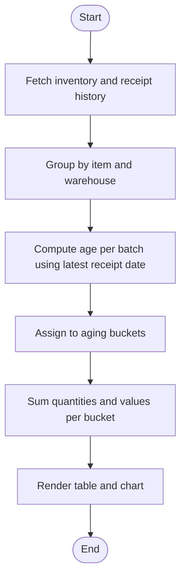

**Diagram sources**
- [src/features/materials/components/StockAgingReport.tsx](file://src/features/materials/components/StockAgingReport.tsx)
- [src/features/materials/api.ts](file://src/features/materials/api.ts)
- [database-inventory.sql](file://database-inventory.sql)

**Section sources**
- [src/features/materials/components/StockAgingReport.tsx](file://src/features/materials/components/StockAgingReport.tsx)
- [src/features/materials/api.ts](file://src/features/materials/api.ts)
- [database-inventory.sql](file://database-inventory.sql)

#### Turnover Ratios
- Purpose: Measure how quickly inventory converts to sales or consumption.
- Logic: Use cost of goods consumed over period divided by average inventory value; segment by category/warehouse.
- Output: Ratio series, benchmark comparison, and alerts when below thresholds.

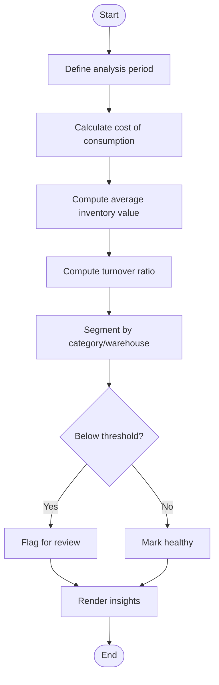

**Diagram sources**
- [src/features/materials/components/TurnoverAnalysis.tsx](file://src/features/materials/components/TurnoverAnalysis.tsx)
- [src/features/materials/api.ts](file://src/features/materials/api.ts)
- [database-materials.sql](file://database-materials.sql)

**Section sources**
- [src/features/materials/components/TurnoverAnalysis.tsx](file://src/features/materials/components/TurnoverAnalysis.tsx)
- [src/features/materials/api.ts](file://src/features/materials/api.ts)
- [database-materials.sql](file://database-materials.sql)

#### Slow-Moving Items
- Purpose: Identify items with low consumption velocity relative to thresholds.
- Logic: Compare recent consumption rates against historical averages; flag items below percentile cutoffs.
- Output: Ranked list with reasons and recommended actions (discount, bundle, return).

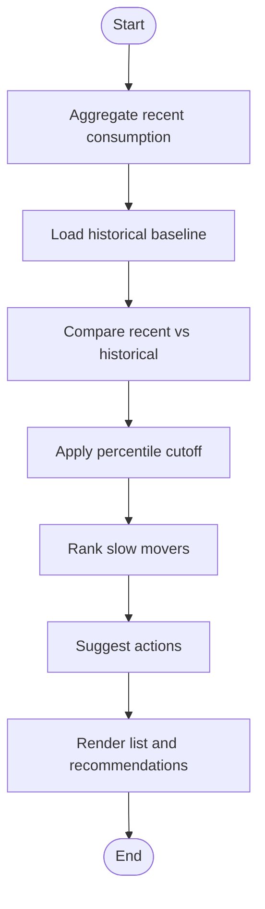

**Diagram sources**
- [src/features/materials/components/SlowMovingItems.tsx](file://src/features/materials/components/SlowMovingItems.tsx)
- [src/features/materials/api.ts](file://src/features/materials/api.ts)

**Section sources**
- [src/features/materials/components/SlowMovingItems.tsx](file://src/features/materials/components/SlowMovingItems.tsx)
- [src/features/materials/api.ts](file://src/features/materials/api.ts)

#### Dead Stock Analysis
- Purpose: Detect items with negligible activity over extended periods.
- Logic: Filter items with zero or near-zero consumption beyond a configured horizon; compute holding cost impact.
- Output: Actionable inventory reduction plan with financial implications.

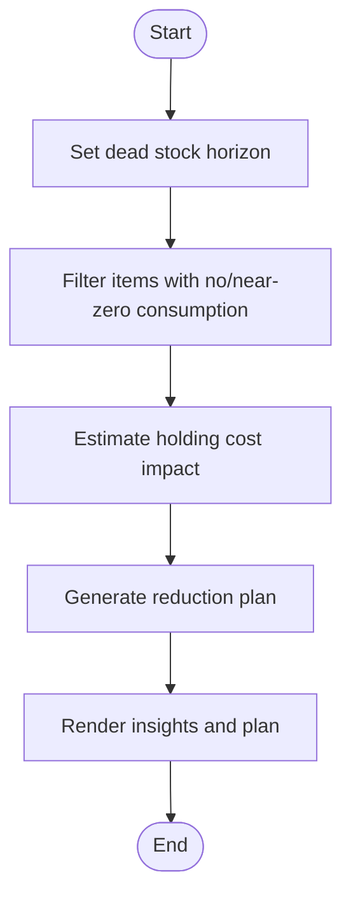

**Diagram sources**
- [src/features/materials/components/DeadStockAnalysis.tsx](file://src/features/materials/components/DeadStockAnalysis.tsx)
- [src/features/materials/api.ts](file://src/features/materials/api.ts)

**Section sources**
- [src/features/materials/components/DeadStockAnalysis.tsx](file://src/features/materials/components/DeadStockAnalysis.tsx)
- [src/features/materials/api.ts](file://src/features/materials/api.ts)

### Consumption Patterns and Usage Trends
- Consumption patterns: Seasonality, demand spikes, and category-level behavior.
- Usage trends: Time-series decomposition, moving averages, and anomaly detection.
- Outputs: Interactive charts, filters by project/warehouse, and export options.

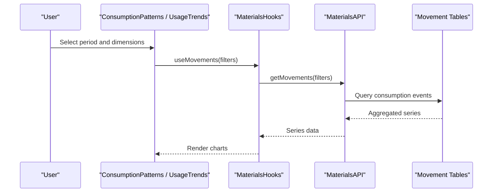

**Diagram sources**
- [src/features/materials/components/ConsumptionPatterns.tsx](file://src/features/materials/components/ConsumptionPatterns.tsx)
- [src/features/materials/components/UsageTrends.tsx](file://src/features/materials/components/UsageTrends.tsx)
- [src/features/materials/hooks.ts](file://src/features/materials/hooks.ts)
- [src/features/materials/api.ts](file://src/features/materials/api.ts)
- [database-materials.sql](file://database-materials.sql)

**Section sources**
- [src/features/materials/components/ConsumptionPatterns.tsx](file://src/features/materials/components/ConsumptionPatterns.tsx)
- [src/features/materials/components/UsageTrends.tsx](file://src/features/materials/components/UsageTrends.tsx)
- [src/features/materials/hooks.ts](file://src/features/materials/hooks.ts)
- [src/features/materials/api.ts](file://src/features/materials/api.ts)
- [database-materials.sql](file://database-materials.sql)

### Forecasting Reports
- Purpose: Predict future demand based on historical consumption and seasonality.
- Logic: Apply smoothing and trend models; incorporate planned projects and procurement cycles.
- Outputs: Forecasts with confidence intervals and reorder recommendations.

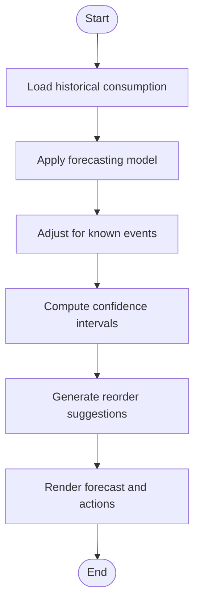

**Diagram sources**
- [src/features/materials/components/ForecastingReport.tsx](file://src/features/materials/components/ForecastingReport.tsx)
- [src/features/materials/api.ts](file://src/features/materials/api.ts)

**Section sources**
- [src/features/materials/components/ForecastingReport.tsx](file://src/features/materials/components/ForecastingReport.tsx)
- [src/features/materials/api.ts](file://src/features/materials/api.ts)

### Inventory Valuation, Cost Analysis, and Profitability Metrics
- Inventory valuation: Weighted average, FIFO/LIFO methods; valuation by location and project.
- Cost analysis: Purchase price variance, freight and overhead allocation, scrap/write-offs.
- Profitability metrics: Gross margin by item/category, contribution after carrying costs.

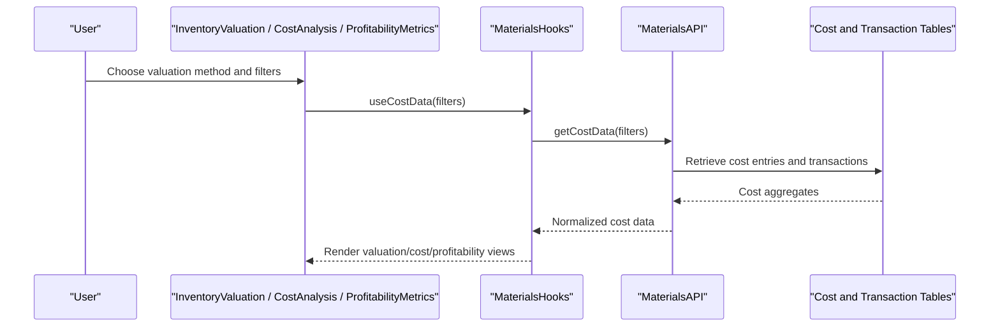

**Diagram sources**
- [src/features/materials/components/InventoryValuation.tsx](file://src/features/materials/components/InventoryValuation.tsx)
- [src/features/materials/components/CostAnalysis.tsx](file://src/features/materials/components/CostAnalysis.tsx)
- [src/features/materials/components/ProfitabilityMetrics.tsx](file://src/features/materials/components/ProfitabilityMetrics.tsx)
- [src/features/materials/hooks.ts](file://src/features/materials/hooks.ts)
- [src/features/materials/api.ts](file://src/features/materials/api.ts)
- [database-materials.sql](file://database-materials.sql)

**Section sources**
- [src/features/materials/components/InventoryValuation.tsx](file://src/features/materials/components/InventoryValuation.tsx)
- [src/features/materials/components/CostAnalysis.tsx](file://src/features/materials/components/CostAnalysis.tsx)
- [src/features/materials/components/ProfitabilityMetrics.tsx](file://src/features/materials/components/ProfitabilityMetrics.tsx)
- [src/features/materials/hooks.ts](file://src/features/materials/hooks.ts)
- [src/features/materials/api.ts](file://src/features/materials/api.ts)
- [database-materials.sql](file://database-materials.sql)

### Implementation Examples

#### Custom Report Generation
- Steps:
  - Define report parameters and filters in types.
  - Create an API endpoint to fetch raw data and compute derived fields.
  - Build a report component to visualize results and allow filtering.
  - Use the report generator utility to produce PDF/CSV outputs.

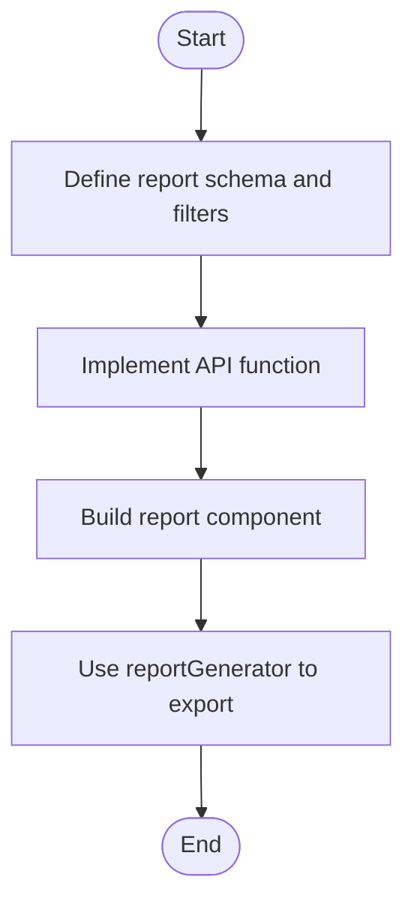

**Diagram sources**
- [src/features/materials/types.ts](file://src/features/materials/types.ts)
- [src/features/materials/api.ts](file://src/features/materials/api.ts)
- [src/features/materials/utils/reportGenerator.ts](file://src/features/materials/utils/reportGenerator.ts)

**Section sources**
- [src/features/materials/types.ts](file://src/features/materials/types.ts)
- [src/features/materials/api.ts](file://src/features/materials/api.ts)
- [src/features/materials/utils/reportGenerator.ts](file://src/features/materials/utils/reportGenerator.ts)

#### Dashboard Creation
- Steps:
  - Compose widgets using the dashboard builder utility.
  - Wire each widget to appropriate hooks and API calls.
  - Configure layout, refresh intervals, and permissions.

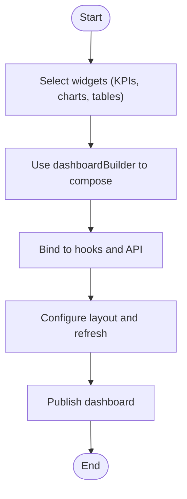

**Diagram sources**
- [src/features/materials/utils/dashboardBuilder.ts](file://src/features/materials/utils/dashboardBuilder.ts)
- [src/features/materials/hooks.ts](file://src/features/materials/hooks.ts)
- [src/features/materials/api.ts](file://src/features/materials/api.ts)

**Section sources**
- [src/features/materials/utils/dashboardBuilder.ts](file://src/features/materials/utils/dashboardBuilder.ts)
- [src/features/materials/hooks.ts](file://src/features/materials/hooks.ts)
- [src/features/materials/api.ts](file://src/features/materials/api.ts)

#### Export Functionality
- Formats: CSV, XLSX, PDF.
- Options: Include filters, headers, summaries, and page footers.
- Integration: Trigger from report components or scheduler.

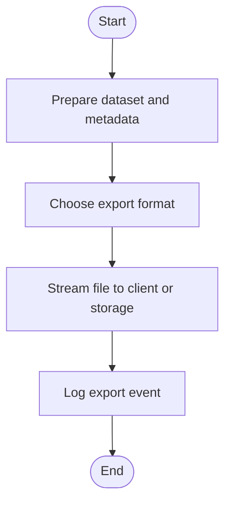

**Diagram sources**
- [src/features/materials/utils/exportUtils.ts](file://src/features/materials/utils/exportUtils.ts)

**Section sources**
- [src/features/materials/utils/exportUtils.ts](file://src/features/materials/utils/exportUtils.ts)

### Real-Time Reporting, Scheduled Generation, and Automated Distribution
- Real-time: Enable live updates via polling or streaming through hooks and cache invalidation.
- Scheduled: Use the scheduler to run reports at intervals (daily, weekly, monthly).
- Distribution: Email, Slack, or push to shared drives; attach generated files and summaries.

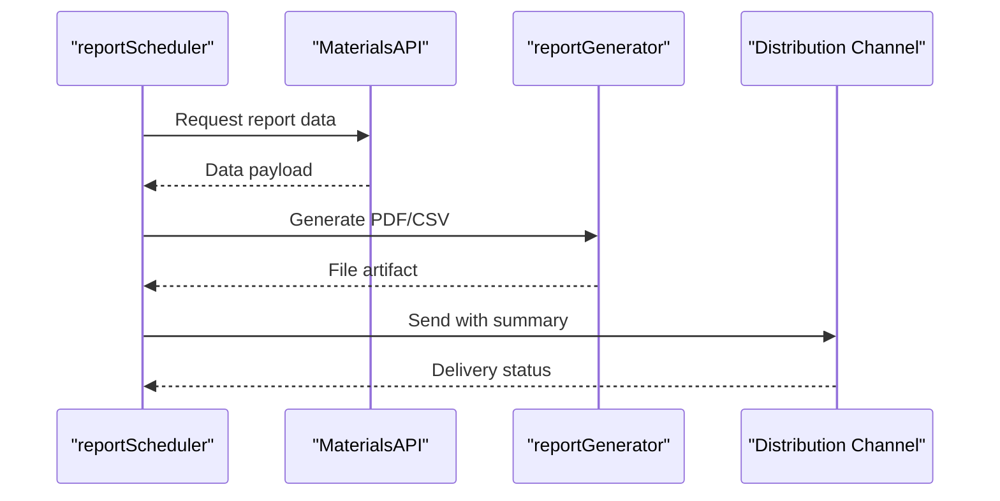

**Diagram sources**
- [src/features/materials/scheduler/reportScheduler.ts](file://src/features/materials/scheduler/reportScheduler.ts)
- [src/features/materials/api.ts](file://src/features/materials/api.ts)
- [src/features/materials/utils/reportGenerator.ts](file://src/features/materials/utils/reportGenerator.ts)

**Section sources**
- [src/features/materials/scheduler/reportScheduler.ts](file://src/features/materials/scheduler/reportScheduler.ts)
- [src/features/materials/utils/reportGenerator.ts](file://src/features/materials/utils/reportGenerator.ts)

### Integration with BI Tools, Data Warehousing, and External Analytics Platforms
- BI connectors: Push aggregated datasets to BI platforms for advanced modeling and self-service analytics.
- Data warehouse: Sync materialized views and fact tables for long-term retention and cross-domain analysis.
- External platforms: Integrate with analytics engines for ML-based forecasting and anomaly detection.

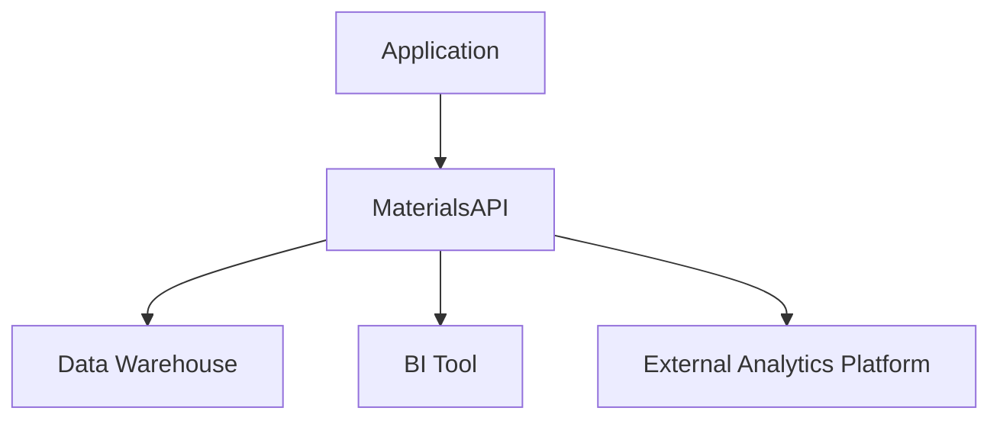

**Diagram sources**
- [src/features/materials/integration/biConnector.ts](file://src/features/materials/integration/biConnector.ts)
- [src/features/materials/integration/dataWarehouse.ts](file://src/features/materials/integration/dataWarehouse.ts)
- [src/features/materials/api.ts](file://src/features/materials/api.ts)

**Section sources**
- [src/features/materials/integration/biConnector.ts](file://src/features/materials/integration/biConnector.ts)
- [src/features/materials/integration/dataWarehouse.ts](file://src/features/materials/integration/dataWarehouse.ts)
- [src/features/materials/api.ts](file://src/features/materials/api.ts)

## Dependency Analysis
This section maps dependencies between core modules and external resources.

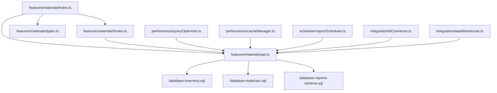

**Diagram sources**
- [src/features/materials/index.ts](file://src/features/materials/index.ts)
- [src/features/materials/api.ts](file://src/features/materials/api.ts)
- [src/features/materials/hooks.ts](file://src/features/materials/hooks.ts)
- [src/features/materials/types.ts](file://src/features/materials/types.ts)
- [database-inventory.sql](file://database-inventory.sql)
- [database-materials.sql](file://database-materials.sql)
- [database-reports-schema.sql](file://database-reports-schema.sql)
- [src/features/materials/performance/queryOptimizer.ts](file://src/features/materials/performance/queryOptimizer.ts)
- [src/features/materials/performance/cacheManager.ts](file://src/features/materials/performance/cacheManager.ts)
- [src/features/materials/scheduler/reportScheduler.ts](file://src/features/materials/scheduler/reportScheduler.ts)
- [src/features/materials/integration/biConnector.ts](file://src/features/materials/integration/biConnector.ts)
- [src/features/materials/integration/dataWarehouse.ts](file://src/features/materials/integration/dataWarehouse.ts)

**Section sources**
- [src/features/materials/index.ts](file://src/features/materials/index.ts)
- [src/features/materials/api.ts](file://src/features/materials/api.ts)
- [src/features/materials/hooks.ts](file://src/features/materials/hooks.ts)
- [src/features/materials/types.ts](file://src/features/materials/types.ts)
- [database-inventory.sql](file://database-inventory.sql)
- [database-materials.sql](file://database-materials.sql)
- [database-reports-schema.sql](file://database-reports-schema.sql)
- [src/features/materials/performance/queryOptimizer.ts](file://src/features/materials/performance/queryOptimizer.ts)
- [src/features/materials/performance/cacheManager.ts](file://src/features/materials/performance/cacheManager.ts)
- [src/features/materials/scheduler/reportScheduler.ts](file://src/features/materials/scheduler/reportScheduler.ts)
- [src/features/materials/integration/biConnector.ts](file://src/features/materials/integration/biConnector.ts)
- [src/features/materials/integration/dataWarehouse.ts](file://src/features/materials/integration/dataWarehouse.ts)

## Performance Considerations
- Query optimization:
  - Use indexes on frequently filtered columns (item_id, warehouse_id, transaction_date).
  - Materialize heavy aggregations for dashboards and schedule incremental refreshes.
  - Partition large tables by date ranges to improve scan performance.
- Caching strategy:
  - Implement short TTL for volatile metrics and longer TTL for static reference data.
  - Invalidate caches on write operations and bulk imports.
- Streaming and pagination:
  - Paginate large result sets and stream exports to avoid memory spikes.
- Concurrency control:
  - Limit concurrent heavy queries and queue background jobs for intensive computations.
- Monitoring:
  - Track query latency, cache hit ratios, and job durations; alert on anomalies.

[No sources needed since this section provides general guidance]

## Troubleshooting Guide
Common issues and resolutions:
- Stale data in dashboards:
  - Verify cache TTL and invalidation triggers; check scheduler logs for missed runs.
- Slow report rendering:
  - Inspect query plans; add missing indexes; reduce filter scope; enable pagination.
- Export failures:
  - Validate dataset size limits; handle encoding errors; retry transient network failures.
- BI sync errors:
  - Confirm credentials and connectivity; validate schema mappings; log transformation errors.

Operational checks:
- Review scheduler logs for successful completion and delivery confirmations.
- Monitor API error rates and response times for report endpoints.
- Ensure database migrations are applied and consistent across environments.

**Section sources**
- [src/features/materials/scheduler/reportScheduler.ts](file://src/features/materials/scheduler/reportScheduler.ts)
- [src/features/materials/performance/cacheManager.ts](file://src/features/materials/performance/cacheManager.ts)
- [src/features/materials/performance/queryOptimizer.ts](file://src/features/materials/performance/queryOptimizer.ts)
- [src/features/materials/utils/exportUtils.ts](file://src/features/materials/utils/exportUtils.ts)
- [src/features/materials/integration/biConnector.ts](file://src/features/materials/integration/biConnector.ts)
- [src/features/materials/integration/dataWarehouse.ts](file://src/features/materials/integration/dataWarehouse.ts)

## Conclusion
The Inventory Reporting and Analytics module provides a robust foundation for monitoring inventory health, optimizing operations, and driving financial insights. By combining well-structured components, efficient data access, scheduling, and integrations, teams can deliver actionable reports and dashboards at scale. Adopting the performance and operational practices outlined here will ensure reliability and responsiveness even with large datasets and complex analytical workloads.

[No sources needed since this section summarizes without analyzing specific files]

## Appendices

### Data Models Reference
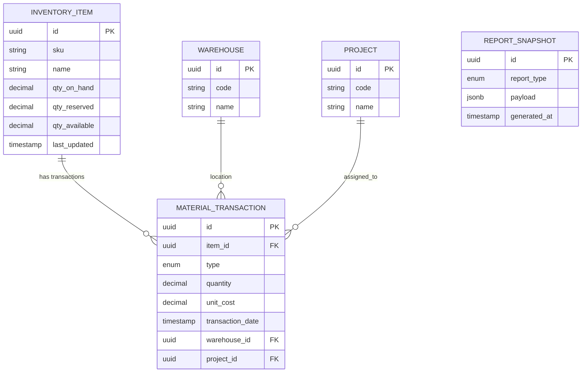

**Diagram sources**
- [database-inventory.sql](file://database-inventory.sql)
- [database-materials.sql](file://database-materials.sql)
- [database-reports-schema.sql](file://database-reports-schema.sql)