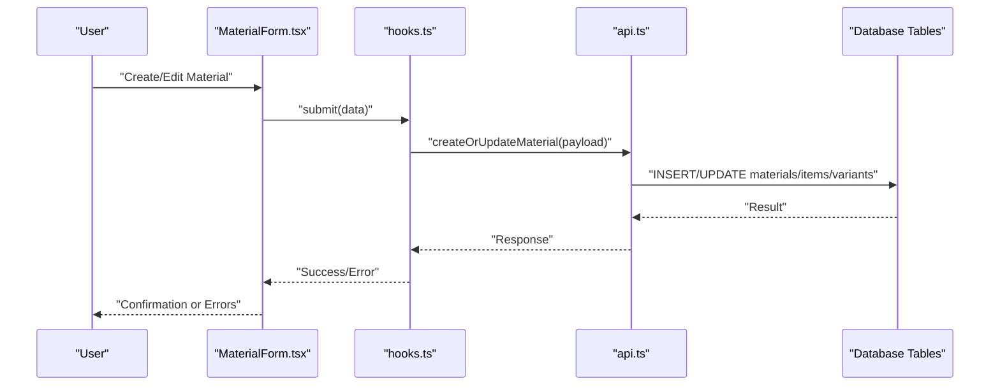
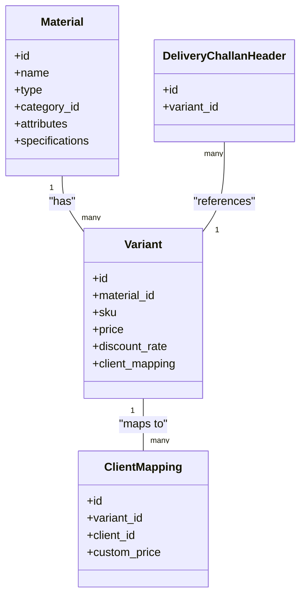
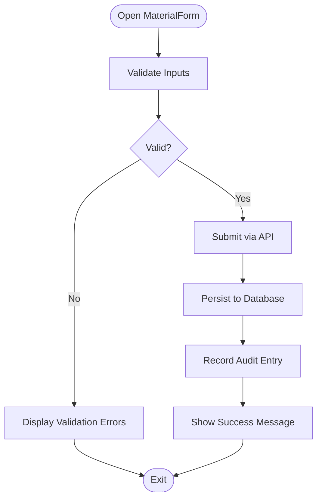
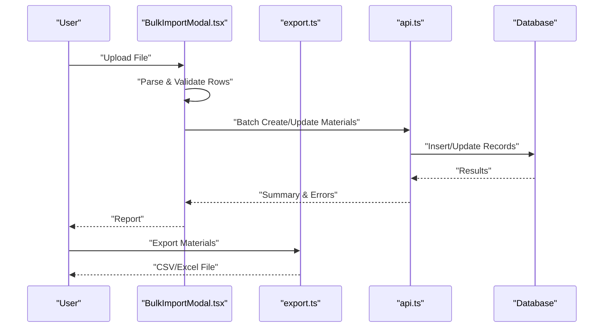
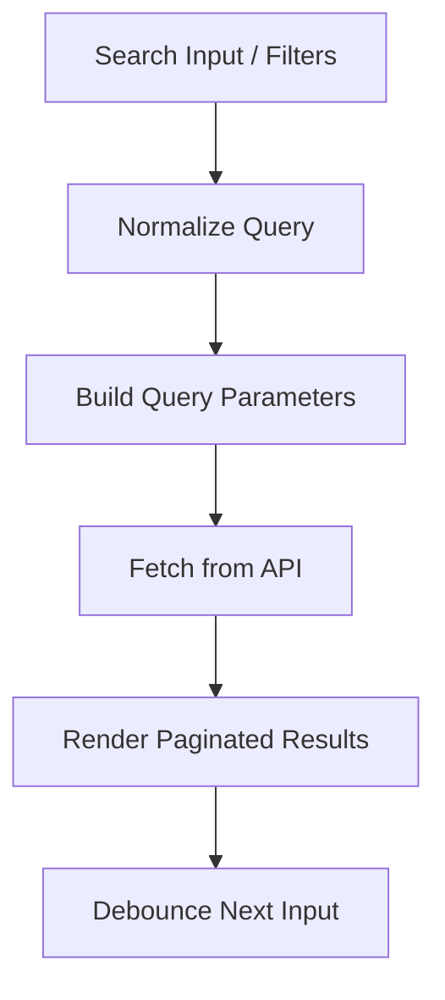
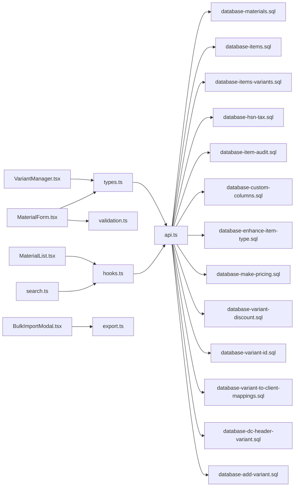

# Material Catalog Management

<cite>
**Referenced Files in This Document**
- [src/features/materials/types.ts](file://src/features/materials/types.ts)
- [src/features/materials/api.ts](file://src/features/materials/api.ts)
- [src/features/materials/hooks.ts](file://src/features/materials/hooks.ts)
- [src/features/materials/components/MaterialForm.tsx](file://src/features/materials/components/MaterialForm.tsx)
- [src/features/materials/components/MaterialList.tsx](file://src/features/materials/components/MaterialList.tsx)
- [src/features/materials/components/BulkImportModal.tsx](file://src/features/materials/components/BulkImportModal.tsx)
- [src/features/materials/components/VariantManager.tsx](file://src/features/materials/components/VariantManager.tsx)
- [src/features/materials/utils/validation.ts](file://src/features/materials/utils/validation.ts)
- [src/features/materials/utils/export.ts](file://src/features/materials/utils/export.ts)
- [src/features/materials/utils/search.ts](file://src/features/materials/utils/search.ts)
- [src/database/database-materials.sql](file://src/database/database-materials.sql)
- [src/database/database-items.sql](file://src/database/database-items.sql)
- [src/database/database-items-variants.sql](file://src/database/database-items-variants.sql)
- [src/database/database-hsn-tax.sql](file://src/database/database-hsn-tax.sql)
- [src/database/database-item-audit.sql](file://src/database/database-item-audit.sql)
- [src/database/database-add-columns-document-series.sql](file://src/database/database-add-columns-document-series.sql)
- [src/database/database-custom-columns.sql](file://src/database/database-custom-columns.sql)
- [src/database/database-enhance-item-type.sql](file://src/database/database-enhance-item-type.sql)
- [src/database/database-make-pricing.sql](file://src/database/database-make-pricing.sql)
- [src/database/database-variant-discount.sql](file://src/database/database-variant-discount.sql)
- [src/database/database-variant-id.sql](file://src/database/database-variant-id.sql)
- [src/database/database-variant-to-client-mappings.sql](file://src/database/database-variant-to-client-mappings.sql)
- [src/database/database-dc-header-variant.sql](file://src/database/database-dc-header-variant.sql)
- [src/database/database-add-variant.sql](file://src/database/database-add-variant.sql)
- [src/database/database-add-variant-to-client-mappings.sql](file://src/database/database-add-variant-to-client-mappings.sql)
- [src/database/database-variant-discount.sql](file://src/database/database-variant-discount.sql)
- [src/database/database-variant-id.sql](file://src/database/database-variant-id.sql)
- [src/database/database-variant-to-client-mappings.sql](file://src/database/database-variant-to-client-mappings.sql)
- [src/database/database-dc-header-variant.sql](file://src/database/database-dc-header-variant.sql)
- [src/database/database-add-variant.sql](file://src/database/database-add-variant.sql)
</cite>

## Table of Contents
1. [Introduction](#introduction)
2. [Project Structure](#project-structure)
3. [Core Components](#core-components)
4. [Architecture Overview](#architecture-overview)
5. [Detailed Component Analysis](#detailed-component-analysis)
6. [Dependency Analysis](#dependency-analysis)
7. [Performance Considerations](#performance-considerations)
8. [Troubleshooting Guide](#troubleshooting-guide)
9. [Conclusion](#conclusion)
10. [Appendices](#appendices)

## Introduction
This document explains the Material Catalog Management system, focusing on:
- Material entity structure and categorization
- Variant management and pricing models
- GST/HSN configuration and unit conversions
- Creation workflow, bulk import/export, search/filter
- Attributes, specifications, custom fields
- Vendor mappings integration
- Data validation rules, audit trails, and performance optimization for large catalogs

The goal is to provide both a conceptual overview and implementation details grounded in the codebase.

## Project Structure
Material catalog functionality is implemented across feature modules, hooks, utilities, and database migrations:
- Feature module: types, API client, hooks, components, and utilities
- Database schema: materials, items, variants, HSN/Tax, audit logs, custom columns, pricing, discounts, and related integrations
- UI pages and reusable components for listing, creation, variant management, and bulk operations

```mermaid
graph TB
subgraph "Feature: Materials"
Types["types.ts"]
API["api.ts"]
Hooks["hooks.ts"]
Form["components/MaterialForm.tsx"]
List["components/MaterialList.tsx"]
Import["components/BulkImportModal.tsx"]
Variants["components/VariantManager.tsx"]
Validation["utils/validation.ts"]
Export["utils/export.ts"]
Search["utils/search.ts"]
end
subgraph "Database Migrations"
DBMaterials["database-materials.sql"]
DBItems["database-items.sql"]
DBVariants["database-items-variants.sql"]
DBHsnTax["database-hsn-tax.sql"]
DBAudit["database-item-audit.sql"]
DBCustomCols["database-custom-columns.sql"]
DBItemType["database-enhance-item-type.sql"]
DBPricing["database-make-pricing.sql"]
DBVariantDiscount["database-variant-discount.sql"]
DBVariantId["database-variant-id.sql"]
DBVariantClientMap["database-variant-to-client-mappings.sql"]
DBCHeaderVariant["database-dc-header-variant.sql"]
DBAddVariant["database-add-variant.sql"]
end
Types --> API
Hooks --> API
Form --> Types
Form --> Validation
List --> Hooks
Import --> Export
Variants --> Types
Search --> Hooks
API --> DBMaterials
API --> DBItems
API --> DBVariants
API --> DBHsnTax
API --> DBAudit
API --> DBCustomCols
API --> DBItemType
API --> DBPricing
API --> DBVariantDiscount
API --> DBVariantId
API --> DBVariantClientMap
API --> DBCHeaderVariant
API --> DBAddVariant
```

**Diagram sources**
- [src/features/materials/types.ts](file://src/features/materials/types.ts)
- [src/features/materials/api.ts](file://src/features/materials/api.ts)
- [src/features/materials/hooks.ts](file://src/features/materials/hooks.ts)
- [src/features/materials/components/MaterialForm.tsx](file://src/features/materials/components/MaterialForm.tsx)
- [src/features/materials/components/MaterialList.tsx](file://src/features/materials/components/MaterialList.tsx)
- [src/features/materials/components/BulkImportModal.tsx](file://src/features/materials/components/BulkImportModal.tsx)
- [src/features/materials/components/VariantManager.tsx](file://src/features/materials/components/VariantManager.tsx)
- [src/features/materials/utils/validation.ts](file://src/features/materials/utils/validation.ts)
- [src/features/materials/utils/export.ts](file://src/features/materials/utils/export.ts)
- [src/features/materials/utils/search.ts](file://src/features/materials/utils/search.ts)
- [src/database/database-materials.sql](file://src/database/database-materials.sql)
- [src/database/database-items.sql](file://src/database/database-items.sql)
- [src/database/database-items-variants.sql](file://src/database/database-items-variants.sql)
- [src/database/database-hsn-tax.sql](file://src/database/database-hsn-tax.sql)
- [src/database/database-item-audit.sql](file://src/database/database-item-audit.sql)
- [src/database/database-custom-columns.sql](file://src/database/database-custom-columns.sql)
- [src/database/database-enhance-item-type.sql](file://src/database/database-enhance-item-type.sql)
- [src/database/database-make-pricing.sql](file://src/database/database-make-pricing.sql)
- [src/database/database-variant-discount.sql](file://src/database/database-variant-discount.sql)
- [src/database/database-variant-id.sql](file://src/database/database-variant-id.sql)
- [src/database/database-variant-to-client-mappings.sql](file://src/database/database-variant-to-client-mappings.sql)
- [src/database/database-dc-header-variant.sql](file://src/database/database-dc-header-variant.sql)
- [src/database/database-add-variant.sql](file://src/database/database-add-variant.sql)

**Section sources**
- [src/features/materials/types.ts](file://src/features/materials/types.ts)
- [src/features/materials/api.ts](file://src/features/materials/api.ts)
- [src/features/materials/hooks.ts](file://src/features/materials/hooks.ts)
- [src/features/materials/components/MaterialForm.tsx](file://src/features/materials/components/MaterialForm.tsx)
- [src/features/materials/components/MaterialList.tsx](file://src/features/materials/components/MaterialList.tsx)
- [src/features/materials/components/BulkImportModal.tsx](file://src/features/materials/components/BulkImportModal.tsx)
- [src/features/materials/components/VariantManager.tsx](file://src/features/materials/components/VariantManager.tsx)
- [src/features/materials/utils/validation.ts](file://src/features/materials/utils/validation.ts)
- [src/features/materials/utils/export.ts](file://src/features/materials/utils/export.ts)
- [src/features/materials/utils/search.ts](file://src/features/materials/utils/search.ts)
- [src/database/database-materials.sql](file://src/database/database-materials.sql)
- [src/database/database-items.sql](file://src/database/database-items.sql)
- [src/database/database-items-variants.sql](file://src/database/database-items-variants.sql)
- [src/database/database-hsn-tax.sql](file://src/database/database-hsn-tax.sql)
- [src/database/database-item-audit.sql](file://src/database/database-item-audit.sql)
- [src/database/database-custom-columns.sql](file://src/database/database-custom-columns.sql)
- [src/database/database-enhance-item-type.sql](file://src/database/database-enhance-item-type.sql)
- [src/database/database-make-pricing.sql](file://src/database/database-make-pricing.sql)
- [src/database/database-variant-discount.sql](file://src/database/database-variant-discount.sql)
- [src/database/database-variant-id.sql](file://src/database/database-variant-id.sql)
- [src/database/database-variant-to-client-mappings.sql](file://src/database/database-variant-to-client-mappings.sql)
- [src/database/database-dc-header-variant.sql](file://src/database/database-dc-header-variant.sql)
- [src/database/database-add-variant.sql](file://src/database/database-add-variant.sql)

## Core Components
- Types and schemas define material entities, categories, variants, pricing, tax, units, attributes, and custom fields.
- API layer provides CRUD, bulk import/export, search/filter, and variant-related endpoints.
- Hooks encapsulate data fetching, caching, mutations, and state synchronization.
- UI components implement forms, lists, bulk import modal, and variant manager.
- Utilities handle validation, export formatting, and search/filter logic.

Key responsibilities:
- MaterialForm: orchestrates creation/editing with validation and variant handling
- MaterialList: displays paginated results with filters and actions
- BulkImportModal: parses files, validates rows, and submits batched requests
- VariantManager: manages variant definitions, pricing, and discount mapping
- Validation: enforces business rules (e.g., required fields, numeric ranges, GST/HSN constraints)
- Export: serializes materials to CSV/Excel formats
- Search: implements multi-field filtering, fuzzy matching, and pagination

**Section sources**
- [src/features/materials/types.ts](file://src/features/materials/types.ts)
- [src/features/materials/api.ts](file://src/features/materials/api.ts)
- [src/features/materials/hooks.ts](file://src/features/materials/hooks.ts)
- [src/features/materials/components/MaterialForm.tsx](file://src/features/materials/components/MaterialForm.tsx)
- [src/features/materials/components/MaterialList.tsx](file://src/features/materials/components/MaterialList.tsx)
- [src/features/materials/components/BulkImportModal.tsx](file://src/features/materials/components/BulkImportModal.tsx)
- [src/features/materials/components/VariantManager.tsx](file://src/features/materials/components/VariantManager.tsx)
- [src/features/materials/utils/validation.ts](file://src/features/materials/utils/validation.ts)
- [src/features/materials/utils/export.ts](file://src/features/materials/utils/export.ts)
- [src/features/materials/utils/search.ts](file://src/features/materials/utils/search.ts)

## Architecture Overview
The system follows a layered architecture:
- Presentation Layer: React components for user interactions
- Business Logic Layer: Hooks and utilities orchestrate workflows
- Data Access Layer: API client calls backend services
- Persistence Layer: Database tables and migrations store catalog data

**Diagram sources**
- [src/features/materials/components/MaterialForm.tsx](file://src/features/materials/components/MaterialForm.tsx)
- [src/features/materials/hooks.ts](file://src/features/materials/hooks.ts)
- [src/features/materials/api.ts](file://src/features/materials/api.ts)
- [src/database/database-materials.sql](file://src/database/database-materials.sql)
- [src/database/database-items.sql](file://src/database/database-items.sql)
- [src/database/database-items-variants.sql](file://src/database/database-items-variants.sql)

## Detailed Component Analysis

### Material Entity Structure and Categorization
- Material entity includes core identification, description, type, category hierarchy, units, attributes, specifications, and metadata.
- Categories are hierarchical and support multiple levels; each material references its primary category and optional secondary tags.
- Type enhancements allow classification (e.g., raw, finished, consumable), influencing pricing and procurement behavior.

Implementation highlights:
- Types define structured shapes for materials, categories, and attributes
- Database migrations add item type enhancements and custom columns
- UI components render category trees and attribute editors

**Section sources**
- [src/features/materials/types.ts](file://src/features/materials/types.ts)
- [src/database/database-enhance-item-type.sql](file://src/database/database-enhance-item-type.sql)
- [src/database/database-custom-columns.sql](file://src/database/database-custom-columns.sql)
- [src/features/materials/components/MaterialForm.tsx](file://src/features/materials/components/MaterialForm.tsx)

### Variant Management
- Variants represent product differentiators such as size, color, weight, or dimensions.
- Each variant can have distinct pricing, discounts, and client-specific mappings.
- Variant IDs link documents (e.g., delivery challan headers) to specific variants.

Workflow:
- Define base material
- Create one or more variants with unique attributes
- Assign variant-level pricing and discounts
- Map variants to clients where applicable
- Use variant ID in downstream documents

**Diagram sources**
- [src/features/materials/types.ts](file://src/features/materials/types.ts)
- [src/database/database-items-variants.sql](file://src/database/database-items-variants.sql)
- [src/database/database-variant-discount.sql](file://src/database/database-variant-discount.sql)
- [src/database/database-variant-to-client-mappings.sql](file://src/database/database-variant-to-client-mappings.sql)
- [src/database/database-dc-header-variant.sql](file://src/database/database-dc-header-variant.sql)
- [src/database/database-add-variant.sql](file://src/database/database-add-variant.sql)

**Section sources**
- [src/features/materials/components/VariantManager.tsx](file://src/features/materials/components/VariantManager.tsx)
- [src/database/database-items-variants.sql](file://src/database/database-items-variants.sql)
- [src/database/database-variant-discount.sql](file://src/database/database-variant-discount.sql)
- [src/database/database-variant-to-client-mappings.sql](file://src/database/database-variant-to-client-mappings.sql)
- [src/database/database-dc-header-variant.sql](file://src/database/database-dc-header-variant.sql)
- [src/database/database-add-variant.sql](file://src/database/database-add-variant.sql)

### Pricing Models and GST Configurations
- Pricing supports base price, variant-specific overrides, and discount rates.
- GST/HSN configuration includes tax rates, HSN/SAC codes, and rounding rules.
- Pricing calculations consider currency, taxes, and discounts at line level.

Implementation details:
- Pricing table stores base and variant prices
- HSN/Tax migration adds tax-related columns and constraints
- API computes totals including GST based on configured rates

**Section sources**
- [src/database/database-make-pricing.sql](file://src/database/database-make-pricing.sql)
- [src/database/database-hsn-tax.sql](file://src/database/database-hsn-tax.sql)
- [src/features/materials/api.ts](file://src/features/materials/api.ts)

### Unit Conversions
- Units define measurement systems (e.g., meters, kilograms, pieces).
- Conversion factors enable consistent calculations across units.
- UI allows selecting units per material and converting quantities during entry.

**Section sources**
- [src/database/database-materials.sql](file://src/database/database-materials.sql)
- [src/features/materials/types.ts](file://src/features/materials/types.ts)

### Material Creation Workflow
End-to-end flow:
- User opens MaterialForm
- System validates inputs using validation utilities
- On submit, API creates or updates material and associated variants
- Audit trail records changes
- UI confirms success or shows errors

**Diagram sources**
- [src/features/materials/components/MaterialForm.tsx](file://src/features/materials/components/MaterialForm.tsx)
- [src/features/materials/utils/validation.ts](file://src/features/materials/utils/validation.ts)
- [src/features/materials/api.ts](file://src/features/materials/api.ts)
- [src/database/database-item-audit.sql](file://src/database/database-item-audit.sql)

**Section sources**
- [src/features/materials/components/MaterialForm.tsx](file://src/features/materials/components/MaterialForm.tsx)
- [src/features/materials/utils/validation.ts](file://src/features/materials/utils/validation.ts)
- [src/features/materials/api.ts](file://src/features/materials/api.ts)
- [src/database/database-item-audit.sql](file://src/database/database-item-audit.sql)

### Bulk Import/Export Capabilities
- BulkImportModal parses uploaded files, validates rows, and batches submissions.
- Export utility serializes materials into CSV/Excel for offline use.
- Error reporting highlights invalid rows and reasons.

**Diagram sources**
- [src/features/materials/components/BulkImportModal.tsx](file://src/features/materials/components/BulkImportModal.tsx)
- [src/features/materials/utils/export.ts](file://src/features/materials/utils/export.ts)
- [src/features/materials/api.ts](file://src/features/materials/api.ts)

**Section sources**
- [src/features/materials/components/BulkImportModal.tsx](file://src/features/materials/components/BulkImportModal.tsx)
- [src/features/materials/utils/export.ts](file://src/features/materials/utils/export.ts)
- [src/features/materials/api.ts](file://src/features/materials/api.ts)

### Search and Filter Functionality
- Multi-field search supports name, SKU, category, attributes, and tags.
- Filters include type, category tree, unit, and availability.
- Pagination and debounced input improve performance.

**Diagram sources**
- [src/features/materials/utils/search.ts](file://src/features/materials/utils/search.ts)
- [src/features/materials/hooks.ts](file://src/features/materials/hooks.ts)
- [src/features/materials/components/MaterialList.tsx](file://src/features/materials/components/MaterialList.tsx)

**Section sources**
- [src/features/materials/utils/search.ts](file://src/features/materials/utils/search.ts)
- [src/features/materials/hooks.ts](file://src/features/materials/hooks.ts)
- [src/features/materials/components/MaterialList.tsx](file://src/features/materials/components/MaterialList.tsx)

### Material Attributes, Specifications, and Custom Fields
- Attributes capture structured properties (e.g., length, width, thickness).
- Specifications hold free-form or semi-structured details.
- Custom columns allow dynamic extension without schema changes.

Implementation notes:
- Types define attribute key-value structures
- Custom columns migration enables flexible field storage
- Forms render dynamic editors based on attribute definitions

**Section sources**
- [src/features/materials/types.ts](file://src/features/materials/types.ts)
- [src/database/database-custom-columns.sql](file://src/database/database-custom-columns.sql)
- [src/features/materials/components/MaterialForm.tsx](file://src/features/materials/components/MaterialForm.tsx)

### Vendor Mappings Integration
- Vendor mappings associate materials with preferred suppliers and vendor SKUs.
- Variant-level mappings support supplier-specific pricing and lead times.
- Downstream procurement uses these mappings to generate purchase orders.

**Section sources**
- [src/features/materials/types.ts](file://src/features/materials/types.ts)
- [src/features/materials/api.ts](file://src/features/materials/api.ts)

### Data Validation Rules
- Required fields: name, type, category, unit, base price
- Numeric constraints: positive prices, valid conversion factors
- Tax constraints: valid HSN/SAC codes, applicable GST rates
- Variant uniqueness: SKU must be unique within material scope

Validation utilities enforce these rules before submission and display actionable errors.

**Section sources**
- [src/features/materials/utils/validation.ts](file://src/features/materials/utils/validation.ts)
- [src/database/database-hsn-tax.sql](file://src/database/database-hsn-tax.sql)

### Audit Trails
- All create/update/delete operations on materials and variants are logged.
- Audit entries capture actor, timestamp, and change summaries.
- Useful for compliance and troubleshooting.

**Section sources**
- [src/database/database-item-audit.sql](file://src/database/database-item-audit.sql)
- [src/features/materials/api.ts](file://src/features/materials/api.ts)

## Dependency Analysis
The following diagram illustrates dependencies between feature components and database migrations:

**Diagram sources**
- [src/features/materials/types.ts](file://src/features/materials/types.ts)
- [src/features/materials/api.ts](file://src/features/materials/api.ts)
- [src/features/materials/hooks.ts](file://src/features/materials/hooks.ts)
- [src/features/materials/components/MaterialForm.tsx](file://src/features/materials/components/MaterialForm.tsx)
- [src/features/materials/components/MaterialList.tsx](file://src/features/materials/components/MaterialList.tsx)
- [src/features/materials/components/BulkImportModal.tsx](file://src/features/materials/components/BulkImportModal.tsx)
- [src/features/materials/components/VariantManager.tsx](file://src/features/materials/components/VariantManager.tsx)
- [src/features/materials/utils/validation.ts](file://src/features/materials/utils/validation.ts)
- [src/features/materials/utils/export.ts](file://src/features/materials/utils/export.ts)
- [src/features/materials/utils/search.ts](file://src/features/materials/utils/search.ts)
- [src/database/database-materials.sql](file://src/database/database-materials.sql)
- [src/database/database-items.sql](file://src/database/database-items.sql)
- [src/database/database-items-variants.sql](file://src/database/database-items-variants.sql)
- [src/database/database-hsn-tax.sql](file://src/database/database-hsn-tax.sql)
- [src/database/database-item-audit.sql](file://src/database/database-item-audit.sql)
- [src/database/database-custom-columns.sql](file://src/database/database-custom-columns.sql)
- [src/database/database-enhance-item-type.sql](file://src/database/database-enhance-item-type.sql)
- [src/database/database-make-pricing.sql](file://src/database/database-make-pricing.sql)
- [src/database/database-variant-discount.sql](file://src/database/database-variant-discount.sql)
- [src/database/database-variant-id.sql](file://src/database/database-variant-id.sql)
- [src/database/database-variant-to-client-mappings.sql](file://src/database/database-variant-to-client-mappings.sql)
- [src/database/database-dc-header-variant.sql](file://src/database/database-dc-header-variant.sql)
- [src/database/database-add-variant.sql](file://src/database/database-add-variant.sql)

**Section sources**
- [src/features/materials/types.ts](file://src/features/materials/types.ts)
- [src/features/materials/api.ts](file://src/features/materials/api.ts)
- [src/features/materials/hooks.ts](file://src/features/materials/hooks.ts)
- [src/features/materials/components/MaterialForm.tsx](file://src/features/materials/components/MaterialForm.tsx)
- [src/features/materials/components/MaterialList.tsx](file://src/features/materials/components/MaterialList.tsx)
- [src/features/materials/components/BulkImportModal.tsx](file://src/features/materials/components/BulkImportModal.tsx)
- [src/features/materials/components/VariantManager.tsx](file://src/features/materials/components/VariantManager.tsx)
- [src/features/materials/utils/validation.ts](file://src/features/materials/utils/validation.ts)
- [src/features/materials/utils/export.ts](file://src/features/materials/utils/export.ts)
- [src/features/materials/utils/search.ts](file://src/features/materials/utils/search.ts)
- [src/database/database-materials.sql](file://src/database/database-materials.sql)
- [src/database/database-items.sql](file://src/database/database-items.sql)
- [src/database/database-items-variants.sql](file://src/database/database-items-variants.sql)
- [src/database/database-hsn-tax.sql](file://src/database/database-hsn-tax.sql)
- [src/database/database-item-audit.sql](file://src/database/database-item-audit.sql)
- [src/database/database-custom-columns.sql](file://src/database/database-custom-columns.sql)
- [src/database/database-enhance-item-type.sql](file://src/database/database-enhance-item-type.sql)
- [src/database/database-make-pricing.sql](file://src/database/database-make-pricing.sql)
- [src/database/database-variant-discount.sql](file://src/database/database-variant-discount.sql)
- [src/database/database-variant-id.sql](file://src/database/database-variant-id.sql)
- [src/database/database-variant-to-client-mappings.sql](file://src/database/database-variant-to-client-mappings.sql)
- [src/database/database-dc-header-variant.sql](file://src/database/database-dc-header-variant.sql)
- [src/database/database-add-variant.sql](file://src/database/database-add-variant.sql)

## Performance Considerations
- Use pagination and virtualized rendering for large catalogs
- Debounce search inputs to reduce API load
- Cache frequently accessed categories and units
- Batch imports to minimize round trips
- Index critical query fields (name, sku, category_id) in database
- Avoid heavy computations on the main thread; offload to workers if needed

[No sources needed since this section provides general guidance]

## Troubleshooting Guide
Common issues and resolutions:
- Validation failures: check required fields, numeric ranges, and GST/HSN constraints
- Duplicate SKUs: ensure uniqueness within material scope
- Variant mapping errors: verify variant IDs exist and are linked correctly
- Import errors: review row-level error reports and correct malformed data
- Audit discrepancies: inspect audit logs for actor and timestamps

**Section sources**
- [src/features/materials/utils/validation.ts](file://src/features/materials/utils/validation.ts)
- [src/database/database-item-audit.sql](file://src/database/database-item-audit.sql)
- [src/features/materials/components/BulkImportModal.tsx](file://src/features/materials/components/BulkImportModal.tsx)

## Conclusion
The Material Catalog Management system provides a robust foundation for managing materials, variants, pricing, and tax configurations. It supports scalable operations through bulk import/export, efficient search/filter, and comprehensive audit trails. By adhering to the documented workflows and leveraging the provided utilities, teams can maintain accurate catalogs and integrate seamlessly with procurement and sales processes.

[No sources needed since this section summarizes without analyzing specific files]

## Appendices

### Example: Setting Up Material Categories
- Define hierarchical categories in the admin panel
- Assign primary and secondary categories to materials
- Use category filters in MaterialList for quick navigation

**Section sources**
- [src/features/materials/types.ts](file://src/features/materials/types.ts)
- [src/features/materials/components/MaterialList.tsx](file://src/features/materials/components/MaterialList.tsx)

### Example: Managing Variants
- Create variants with distinct attributes and pricing
- Apply discounts and client mappings as needed
- Reference variant IDs in downstream documents

**Section sources**
- [src/features/materials/components/VariantManager.tsx](file://src/features/materials/components/VariantManager.tsx)
- [src/database/database-items-variants.sql](file://src/database/database-items-variants.sql)
- [src/database/database-variant-discount.sql](file://src/database/database-variant-discount.sql)
- [src/database/database-variant-to-client-mappings.sql](file://src/database/database-variant-to-client-mappings.sql)
- [src/database/database-dc-header-variant.sql](file://src/database/database-dc-header-variant.sql)

### Example: Integrating Vendor Mappings
- Link materials to vendors and set vendor SKUs
- Configure variant-level vendor pricing and lead times
- Use mappings in purchase order generation

**Section sources**
- [src/features/materials/types.ts](file://src/features/materials/types.ts)
- [src/features/materials/api.ts](file://src/features/materials/api.ts)