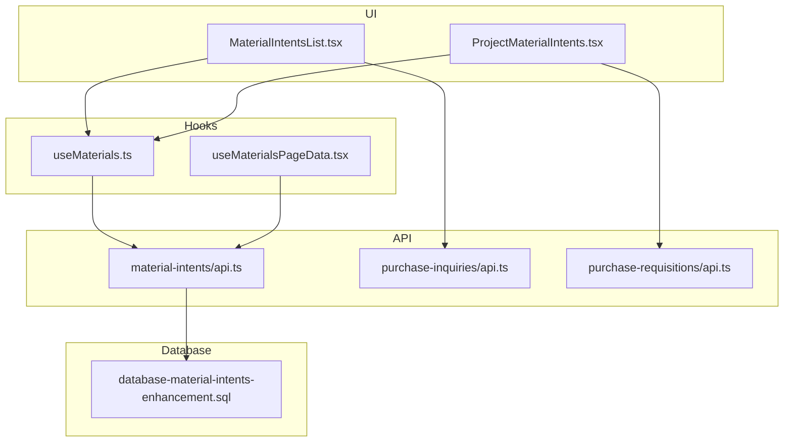
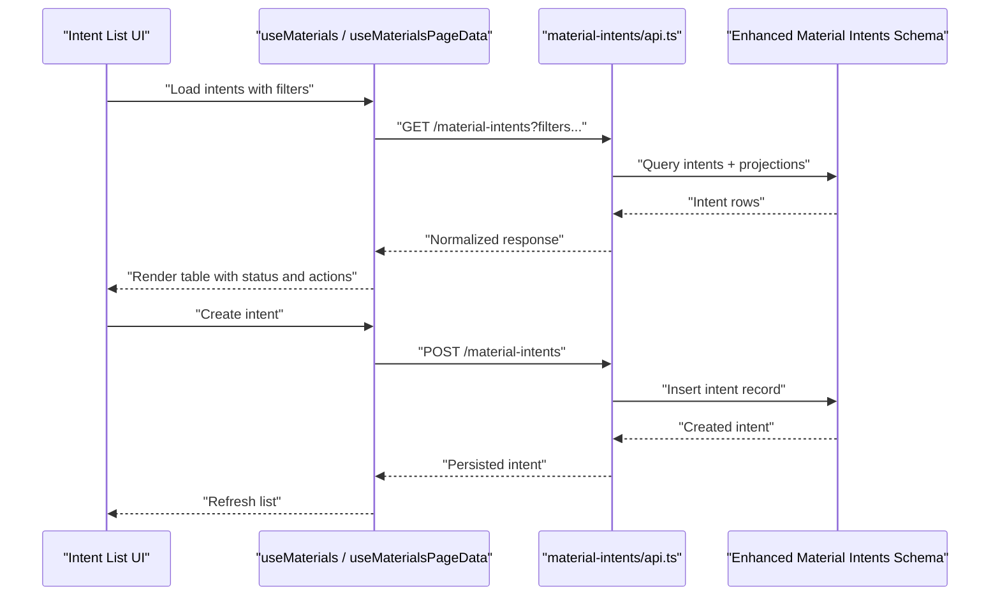
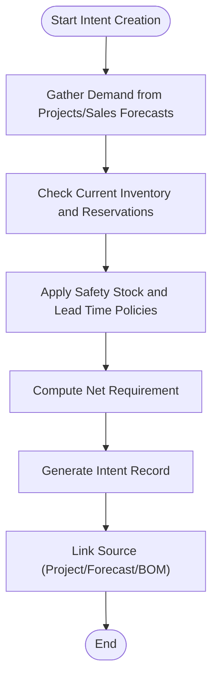
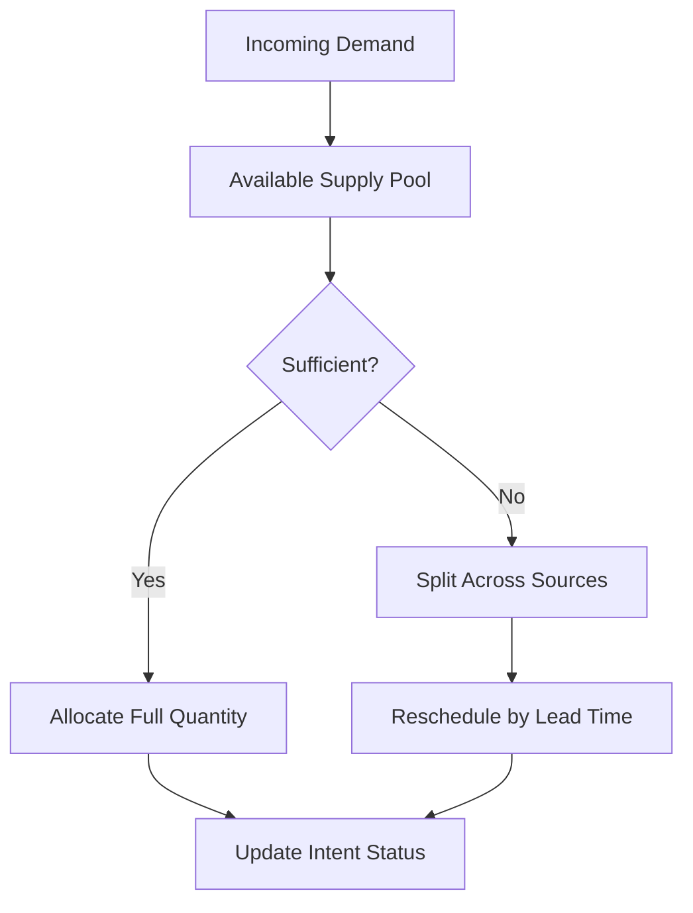
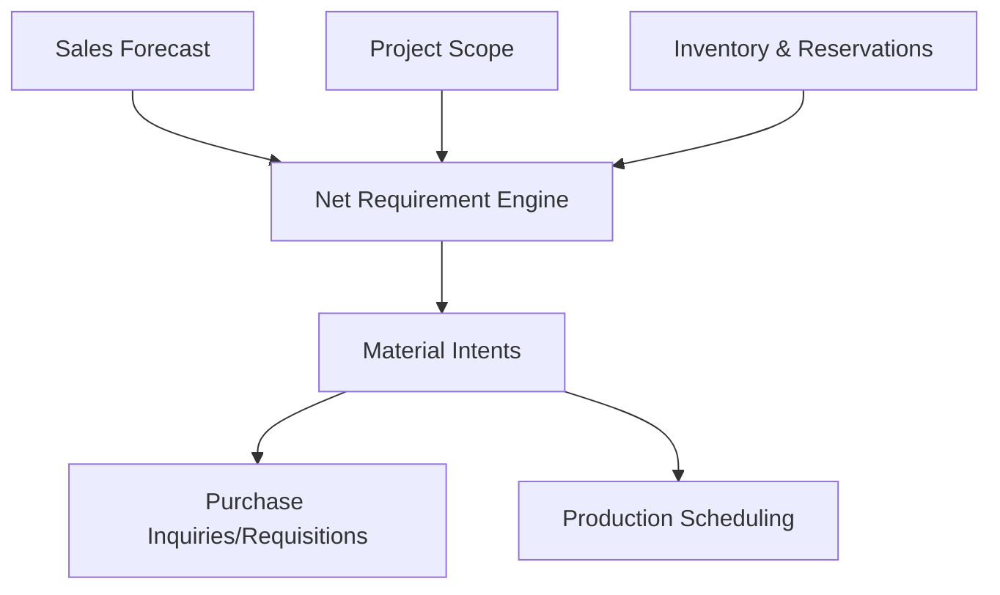
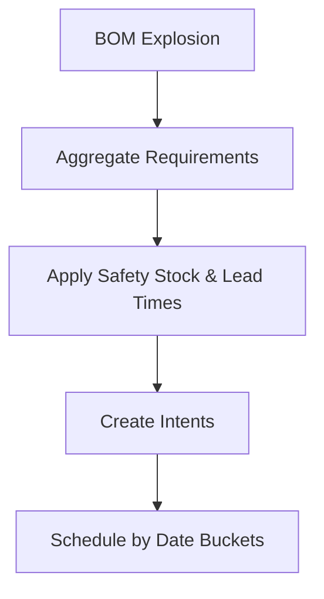
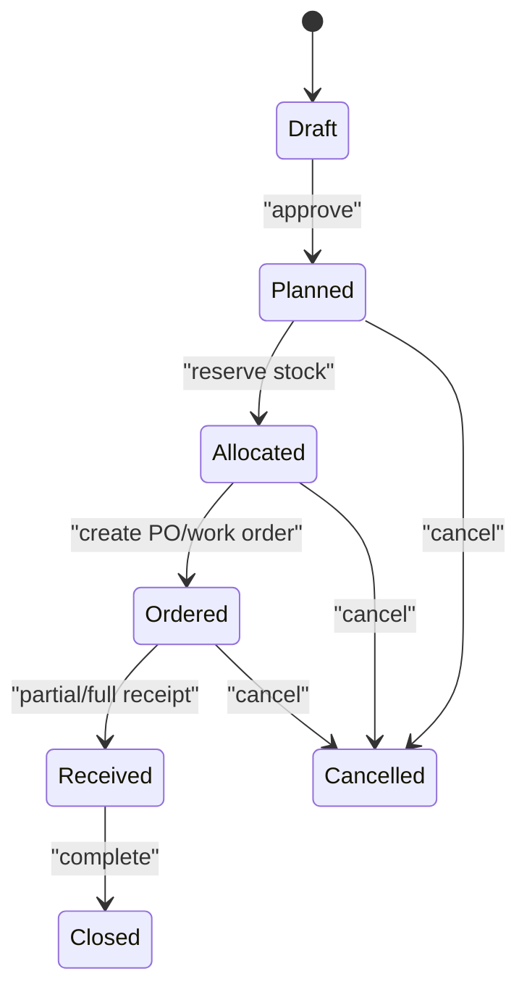
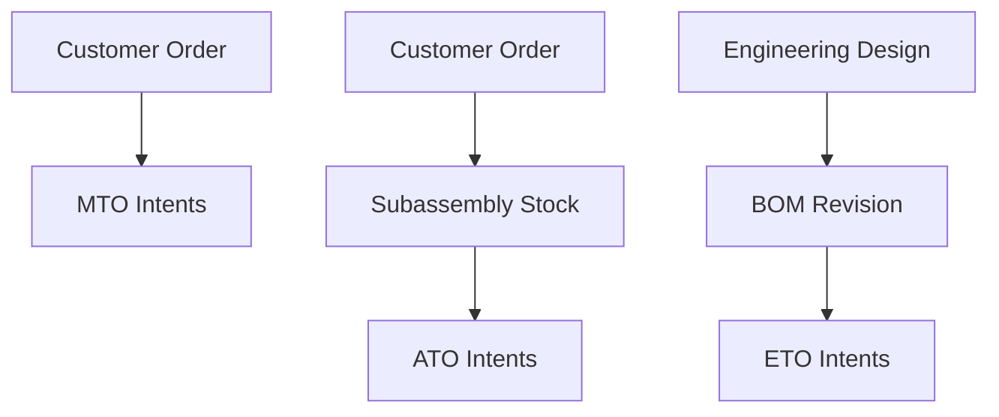
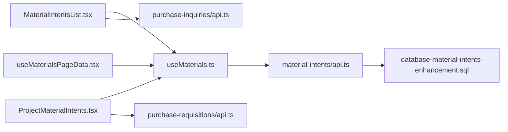

# Material Intents & Planning

<cite>
**Referenced Files in This Document**
- [material-intents/api.ts](file://src/material-intents/api.ts)
- [MaterialIntentsList.tsx](file://src/pages/MaterialIntentsList.tsx)
- [ProjectMaterialIntents.tsx](file://src/pages/ProjectMaterialIntents.tsx)
- [database-material-intents-enhancement.sql](file://src/database-material-intents-enhancement.sql)
- [useMaterials.ts](file://src/hooks/useMaterials.ts)
- [useMaterialsPageData.tsx](file://src/hooks/useMaterialsPageData.tsx)
- [MaterialUsageTracker.tsx](file://src/pages/MaterialUsageTracker.tsx)
- [MaterialInward.tsx](file://src/pages/MaterialInward.tsx)
- [MaterialOutward.tsx](file://src/pages/MaterialOutward.tsx)
- [api.ts (purchase-inquiries)](file://src/purchase-inquiries/api.ts)
- [api.ts (purchase-requisitions)](file://src/purchase-requisitions/api.ts)
</cite>

## Table of Contents
1. [Introduction](#introduction)
2. [Project Structure](#project-structure)
3. [Core Components](#core-components)
4. [Architecture Overview](#architecture-overview)
5. [Detailed Component Analysis](#detailed-component-analysis)
6. [Dependency Analysis](#dependency-analysis)
7. [Performance Considerations](#performance-considerations)
8. [Troubleshooting Guide](#troubleshooting-guide)
9. [Conclusion](#conclusion)
10. [Appendices](#appendices)

## Introduction
This document explains the Material Intents and Planning functionality, focusing on forward-looking material planning, reservation systems, demand forecasting, intent creation, allocation mechanisms, conflict resolution, and integrations with project planning, production scheduling, and sales forecasting. It also covers implementation examples for automatic intent generation based on BOM explosions, lead time calculations, and safety stock policies, along with intent status tracking, fulfillment monitoring, exception handling, advanced planning scenarios (make-to-order, assemble-to-order, engineer-to-order), and performance considerations for large-scale planning and real-time synchronization.

## Project Structure
The Material Intents feature spans UI pages, hooks, API clients, and database enhancements:
- UI pages: list views and project-specific views for intents
- Hooks: data fetching and page-level orchestration
- API client: typed endpoints for CRUD and planning operations
- Database schema: tables and constraints that persist intents and related planning data

**Diagram sources**
- [MaterialIntentsList.tsx](file://src/pages/MaterialIntentsList.tsx)
- [ProjectMaterialIntents.tsx](file://src/pages/ProjectMaterialIntents.tsx)
- [useMaterials.ts](file://src/hooks/useMaterials.ts)
- [useMaterialsPageData.tsx](file://src/hooks/useMaterialsPageData.tsx)
- [material-intents/api.ts](file://src/material-intents/api.ts)
- [api.ts (purchase-inquiries)](file://src/purchase-inquiries/api.ts)
- [api.ts (purchase-requisitions)](file://src/purchase-requisitions/api.ts)
- [database-material-intents-enhancement.sql](file://src/database-material-intents-enhancement.sql)

**Section sources**
- [MaterialIntentsList.tsx](file://src/pages/MaterialIntentsList.tsx)
- [ProjectMaterialIntents.tsx](file://src/pages/ProjectMaterialIntents.tsx)
- [useMaterials.ts](file://src/hooks/useMaterials.ts)
- [useMaterialsPageData.tsx](file://src/hooks/useMaterialsPageData.tsx)
- [material-intents/api.ts](file://src/material-intents/api.ts)
- [database-material-intents-enhancement.sql](file://src/database-material-intents-enhancement.sql)

## Core Components
- Intent List Page: Displays all material intents with filters and actions to create or adjust plans.
- Project-Specific Intent View: Shows intents scoped to a project, enabling project-driven planning and fulfillment tracking.
- Materials Hook: Centralized data access for materials and intents, including caching and refetch triggers.
- Page Data Hook: Orchestrates bulk reads, pagination, and derived metrics for the intent list view.
- API Client: Encapsulates HTTP calls for intent lifecycle operations and planning computations.
- Database Enhancements: Schema additions for intent records, statuses, reservations, and planning metadata.

Key responsibilities:
- Create, update, and delete material intents
- Compute planned quantities considering demand, inventory, and policy parameters
- Track intent status and link to procurement or production documents
- Provide APIs for downstream modules (purchasing, production) to consume planning outputs

**Section sources**
- [MaterialIntentsList.tsx](file://src/pages/MaterialIntentsList.tsx)
- [ProjectMaterialIntents.tsx](file://src/pages/ProjectMaterialIntents.tsx)
- [useMaterials.ts](file://src/hooks/useMaterials.ts)
- [useMaterialsPageData.tsx](file://src/hooks/useMaterialsPageData.tsx)
- [material-intents/api.ts](file://src/material-intents/api.ts)
- [database-material-intents-enhancement.sql](file://src/database-material-intents-enhancement.sql)

## Architecture Overview
The system follows a layered architecture:
- Presentation Layer: React pages render intent lists and project-specific views.
- Data Access Layer: Hooks manage state, caching, and request orchestration.
- Service Layer: API client defines typed endpoints and error handling.
- Persistence Layer: Database stores intents, reservations, and planning attributes.

**Diagram sources**
- [MaterialIntentsList.tsx](file://src/pages/MaterialIntentsList.tsx)
- [useMaterials.ts](file://src/hooks/useMaterials.ts)
- [useMaterialsPageData.tsx](file://src/hooks/useMaterialsPageData.tsx)
- [material-intents/api.ts](file://src/material-intents/api.ts)
- [database-material-intents-enhancement.sql](file://src/database-material-intents-enhancement.sql)

## Detailed Component Analysis

### Intent Creation Process
- Inputs: Demand sources (projects, sales forecasts), current inventory, safety stock, lead times, and BOM structures.
- Computation: Planned quantity = Net demand - Available inventory + Safety stock; adjusted by lot sizes and minimum order quantities.
- Output: New intent record with target date, source linkage, and suggested action (purchase or produce).

[No sources needed since this diagram shows conceptual workflow, not actual code structure]

### Allocation Mechanisms
- Reservation Model: Intents can reserve available stock against specific demands.
- Priority Rules: Higher-priority demands (e.g., committed orders) are allocated first.
- Conflict Resolution: When supply is insufficient, intents may be split across multiple suppliers or rescheduled based on lead time and priority.

[No sources needed since this diagram shows conceptual workflow, not actual code structure]

### Integration with Project Planning, Production Scheduling, and Sales Forecasting
- Project Planning: Project scopes drive item requirements; intents are linked to projects for traceability.
- Production Scheduling: For manufactured items, intents generate work orders or job cards aligned with capacity and lead times.
- Sales Forecasting: Forecasted demand feeds into net requirement calculations and safety stock buffers.

**Diagram sources**
- [api.ts (purchase-inquiries)](file://src/purchase-inquiries/api.ts)
- [api.ts (purchase-requisitions)](file://src/purchase-requisitions/api.ts)
- [material-intents/api.ts](file://src/material-intents/api.ts)

**Section sources**
- [MaterialIntentsList.tsx](file://src/pages/MaterialIntentsList.tsx)
- [ProjectMaterialIntents.tsx](file://src/pages/ProjectMaterialIntents.tsx)
- [useMaterials.ts](file://src/hooks/useMaterials.ts)
- [useMaterialsPageData.tsx](file://src/hooks/useMaterialsPageData.tsx)
- [material-intents/api.ts](file://src/material-intents/api.ts)
- [api.ts (purchase-inquiries)](file://src/purchase-inquiries/api.ts)
- [api.ts (purchase-requisitions)](file://src/purchase-requisitions/api.ts)

### Implementation Examples
- Automatic Intent Generation Based on BOM Explosions:
  - Traverse BOM hierarchy to compute component requirements per parent item.
  - Aggregate by item and time bucket, then apply safety stock and lead time offsets.
  - Create intents for each component with projected dates.
- Lead Time Calculations:
  - Offset planned dates by supplier or manufacturing lead times.
  - Adjust for weekends/holidays if configured.
- Safety Stock Policies:
  - Maintain buffer levels per item; increase when demand volatility is high.
  - Replenish when projected availability falls below threshold.

[No sources needed since this diagram shows conceptual workflow, not actual code structure]

### Intent Status Tracking and Fulfillment Monitoring
- Status Lifecycle: Draft → Planned → Allocated → Ordered/Produced → Received/Completed → Closed.
- Fulfillment Metrics: On-time delivery rate, fill rate, backorder volume, and variance vs forecast.
- Exception Handling: Alerts for late arrivals, partial receipts, quality holds, and shortages.

[No sources needed since this diagram shows conceptual workflow, not actual code structure]

### Advanced Planning Scenarios
- Make-to-Order (MTO):
  - Intents triggered by confirmed customer orders.
  - Production scheduling aligns with order due dates.
- Assemble-to-Order (ATO):
  - Subassemblies kept in stock; final assembly driven by orders.
  - Intents cover both components and final assembly tasks.
- Engineer-to-Order (ETO):
  - Engineering changes propagate through BOM revisions.
  - Intents updated dynamically as designs mature.

[No sources needed since this diagram shows conceptual workflow, not actual code structure]

## Dependency Analysis
- UI depends on hooks for data binding and actions.
- Hooks depend on the API client for network calls.
- API client depends on database schema for persistence.
- Downstream modules (purchasing, production) consume planning outputs via their own API clients.

**Diagram sources**
- [MaterialIntentsList.tsx](file://src/pages/MaterialIntentsList.tsx)
- [ProjectMaterialIntents.tsx](file://src/pages/ProjectMaterialIntents.tsx)
- [useMaterials.ts](file://src/hooks/useMaterials.ts)
- [useMaterialsPageData.tsx](file://src/hooks/useMaterialsPageData.tsx)
- [material-intents/api.ts](file://src/material-intents/api.ts)
- [database-material-intents-enhancement.sql](file://src/database-material-intents-enhancement.sql)
- [api.ts (purchase-inquiries)](file://src/purchase-inquiries/api.ts)
- [api.ts (purchase-requisitions)](file://src/purchase-requisitions/api.ts)

**Section sources**
- [MaterialIntentsList.tsx](file://src/pages/MaterialIntentsList.tsx)
- [ProjectMaterialIntents.tsx](file://src/pages/ProjectMaterialIntents.tsx)
- [useMaterials.ts](file://src/hooks/useMaterials.ts)
- [useMaterialsPageData.tsx](file://src/hooks/useMaterialsPageData.tsx)
- [material-intents/api.ts](file://src/material-intents/api.ts)
- [database-material-intents-enhancement.sql](file://src/database-material-intents-enhancement.sql)
- [api.ts (purchase-inquiries)](file://src/purchase-inquiries/api.ts)
- [api.ts (purchase-requisitions)](file://src/purchase-requisitions/api.ts)

## Performance Considerations
- Batch Operations: Use batched reads/writes for large planning runs to reduce round trips.
- Indexing: Ensure indexes on frequently filtered columns (item, project, date buckets, status).
- Pagination and Virtualization: Implement server-side pagination and virtualized rendering for large lists.
- Caching Strategy: Cache stable reference data (items, warehouses) and invalidate on updates.
- Concurrency Control: Use optimistic locking or version fields to prevent overwrites during concurrent edits.
- Real-Time Sync: Prefer incremental updates and change streams where possible; avoid full refreshes.

[No sources needed since this section provides general guidance]

## Troubleshooting Guide
Common issues and resolutions:
- Missing Intent Records: Verify API endpoint responses and database constraints; check RLS policies if applicable.
- Incorrect Quantities: Validate BOM explosion logic and safety stock parameters; review aggregation steps.
- Late Allocations: Inspect reservation priorities and lead time offsets; confirm supplier calendars.
- Duplicate Intents: Enforce idempotency keys and deduplication rules at the API layer.
- UI Stale Data: Ensure cache invalidation after mutations; trigger refetch on success callbacks.

Operational checks:
- Confirm API health and latency for planning endpoints.
- Monitor database query performance and index usage.
- Review logs for failed allocations or constraint violations.

**Section sources**
- [material-intents/api.ts](file://src/material-intents/api.ts)
- [database-material-intents-enhancement.sql](file://src/database-material-intents-enhancement.sql)

## Conclusion
The Material Intents and Planning subsystem provides a robust foundation for forward-looking material planning, reservation management, and demand forecasting. By integrating with project planning, production scheduling, and sales forecasting, it enables flexible strategies such as make-to-order, assemble-to-order, and engineer-to-order. Proper attention to performance, concurrency, and real-time synchronization ensures scalability and reliability in large-scale operations.

[No sources needed since this section summarizes without analyzing specific files]

## Appendices

### Related Pages and Utilities
- Material Usage Tracker: Monitors consumption against planned intents.
- Material Inward/Outward: Captures receipts and issues impacting availability and reservations.

**Section sources**
- [MaterialUsageTracker.tsx](file://src/pages/MaterialUsageTracker.tsx)
- [MaterialInward.tsx](file://src/pages/MaterialInward.tsx)
- [MaterialOutward.tsx](file://src/pages/MaterialOutward.tsx)