# Materials & Inventory Management

<cite>
**Referenced Files in This Document**
- [src/features/materials/index.ts](file://src/features/materials/index.ts)
- [src/hooks/useMaterials.ts](file://src/hooks/useMaterials.ts)
- [src/pages/MaterialsList.tsx](file://src/pages/MaterialsList.tsx)
- [src/pages/StockAdjustment.tsx](file://src/pages/StockAdjustment.tsx)
- [src/pages/StockTransfer.tsx](file://src/pages/StockTransfer.tsx)
- [src/pages/ReceiveMaterial.tsx](file://src/pages/ReceiveMaterial.tsx)
- [src/pages/MaterialInward.tsx](file://src/pages/MaterialInward.tsx)
- [src/pages/MaterialOutward.tsx](file://src/pages/MaterialOutward.tsx)
- [src/pages/QuickStockCheck.tsx](file://src/pages/QuickStockCheck.tsx)
- [src/pages/QuickStockCheckList.tsx](file://src/pages/QuickStockCheckList.tsx)
- [src/pages/ProjectMaterialDashboard.tsx](file://src/pages/ProjectMaterialDashboard.tsx)
- [src/pages/ProjectMaterialIntents.tsx](file://src/pages/ProjectMaterialIntents.tsx)
- [src/pages/ProjectMaterialList.tsx](file://src/pages/ProjectMaterialList.tsx)
- [src/api.ts](file://src/api.ts)
- [src/lib/supabase.ts](file://src/lib/supabase.ts)
- [src/database/database-materials.sql](file://src/database/database-materials.sql)
- [src/database/database-inventory.sql](file://src/database/database-inventory.sql)
- [src/database/database-warehouse-purpose.sql](file://src/database/database-warehouse-purpose.sql)
- [src/database/database-quick-stock-check.sql](file://src/database/database-quick-stock-check.sql)
- [src/database/database-material-intents-enhancement.sql](file://src/database/database-material-intents-enhancement.sql)
- [src/database/database-material-inward-update.sql](file://src/database/database-material-inward-update.sql)
- [src/database/database-items.sql](file://src/database/database-items.sql)
- [src/database/database-manufacturing.sql](file://src/database/database-manufacturing.sql)
- [src/database/database-purchase-module.sql](file://src/database/database-purchase-module.sql)
- [src/database/database-issue-site-reports.sql](file://src/database/database-issue-site-reports.sql)
- [src/database/database-supply-chain-audit-log.sql](file://src/database/database-supply-chain-audit-log.sql)
- [src/database/database-bom-setup.sql](file://src/database/database-bom-setup.sql)
- [src/database/database-complete.sql](file://src/database/database-complete.sql)
- [src/database/database-setup.sql](file://src/database/database-setup.sql)
- [src/database/database-tables.sql](file://src/database/database-tables.sql)
- [src/database/database-verify.sql](file://src/database/database-verify.sql)
- [src/database/add-hsn-sac-columns.sql](file://src/database/add-hsn-sac-columns.sql)
- [src/database/database-add-columns-document-series.sql](file://src/database/database-add-columns-document-series.sql)
- [src/database/database-document-series.sql](file://src/database/database-document-series.sql)
- [src/database/database-document-settings.sql](file://src/database/database-document-settings.sql)
- [src/database/database-fix-rls.sql](file://src/database/database-fix-rls.sql)
- [src/database/database-approvals.sql](file://src/database/database-approvals.sql)
- [src/database/database-approval-workflows-rls.sql](file://src/database/database-approval-workflows-rls.sql)
- [src/database/database-approval-workflows-fix-fk.sql](file://src/database/database-approval-workflows-fix-fk.sql)
- [src/database/database-terms-conditions-sample-fixed.sql](file://src/database/database-terms-conditions-sample-fixed.sql)
- [src/database/database-terms-conditions-simple-rls.sql](file://src/database/database-terms-conditions-simple-rls.sql)
- [src/database/database-terms-conditions-simple.sql](file://src/database/database-terms-conditions-simple.sql)
- [src/database/database-terms-conditions.sql](file://src/database/database-terms-conditions.sql)
- [src/database/database-unified-tasks.sql](file://src/database/database-unified-tasks.sql)
- [src/database/database-work-instruction.sql](file://src/database/database-work-instruction.sql)
- [src/database/database-variant-discount.sql](file://src/database/database-variant-discount.sql)
- [src/database/database-verify.sql](file://src/database/database-verify.sql)
- [src/database/database-warehouse-purpose.sql](file://src/database/database-warehouse-purpose.sql)
- [src/database/database-quick-stock-check.sql](file://src/database/database-quick-stock-check.sql)
- [src/database/database-material-intents-enhancement.sql](file://src/database/database-material-intents-enhancement.sql)
- [src/database/database-material-inward-update.sql](file://src/database/database-material-inward-update.sql)
- [src/database/database-items.sql](file://src/database/database-items.sql)
- [src/database/database-manufacturing.sql](file://src/database/database-manufacturing.sql)
- [src/database/database-purchase-module.sql](file://src/database/database-purchase-module.sql)
- [src/database/database-issue-site-reports.sql](file://src/database/database-issue-site-reports.sql)
- [src/database/database-supply-chain-audit-log.sql](file://src/database/database-supply-chain-audit-log.sql)
- [src/database/database-bom-setup.sql](file://src/database/database-bom-setup.sql)
- [src/database/database-complete.sql](file://src/database/database-complete.sql)
- [src/database/database-setup.sql](file://src/database/database-setup.sql)
- [src/database/database-tables.sql](file://src/database/database-tables.sql)
- [src/database/database-verify.sql](file://src/database/database-verify.sql)
</cite>

## Table of Contents
1. [Introduction](#introduction)
2. [Project Structure](#project-structure)
3. [Core Components](#core-components)
4. [Architecture Overview](#architecture-overview)
5. [Detailed Component Analysis](#detailed-component-analysis)
6. [Dependency Analysis](#dependency-analysis)
7. [Performance Considerations](#performance-considerations)
8. [Troubleshooting Guide](#troubleshooting-guide)
9. [Conclusion](#conclusion)
10. [Appendices](#appendices)

## Introduction
This document describes the Materials & Inventory Management system implemented in the web application. It covers material catalog management, real-time stock tracking, warehouse operations, procurement workflows, inventory valuation methods, batch and serial number tracking, multi-location stock management, material requisition, purchase order integration, goods receipt handling, stock adjustments, inter-warehouse transfers, automated reorder points, category customization, warehouse hierarchies, accounting integrations, and performance considerations for large inventories and concurrent updates.

## Project Structure
The materials and inventory features are organized under a feature-based structure with dedicated pages, hooks, API clients, and database migrations. Key areas include:
- Feature module entry point for materials
- UI pages for list views, stock adjustments, transfers, inward/outward movements, quick stock checks, and project-specific dashboards
- Hooks to fetch and manage materials data
- Database schema definitions and migrations for items, inventory, warehouses, purchase modules, manufacturing, and related audit logs

```mermaid
graph TB
subgraph "Feature Entry"
FMI["features/materials/index.ts"]
end
subgraph "UI Pages"
ML["pages/MaterialsList.tsx"]
SA["pages/StockAdjustment.tsx"]
ST["pages/StockTransfer.tsx"]
RM["pages/ReceiveMaterial.tsx"]
MI["pages/MaterialInward.tsx"]
MO["pages/MaterialOutward.tsx"]
QSC["pages/QuickStockCheck.tsx"]
QSCL["pages/QuickStockCheckList.tsx"]
PMD["pages/ProjectMaterialDashboard.tsx"]
PMI["pages/ProjectMaterialIntents.tsx"]
PML["pages/ProjectMaterialList.tsx"]
end
subgraph "Data Layer"
H["hooks/useMaterials.ts"]
A["api.ts"]
S["lib/supabase.ts"]
DBM["database/database-materials.sql"]
DBI["database/database-inventory.sql"]
DBW["database/database-warehouse-purpose.sql"]
DBQ["database/database-quick-stock-check.sql"]
DBINT["database/database-material-intents-enhancement.sql"]
DBINW["database/database-material-inward-update.sql"]
DBIT["database/database-items.sql"]
DBMF["database/database-manufacturing.sql"]
DBPUR["database/database-purchase-module.sql"]
DBISS["database/database-issue-site-reports.sql"]
DBAUD["database/database-supply-chain-audit-log.sql"]
DBBOM["database/database-bom-setup.sql"]
DBCOMP["database/database-complete.sql"]
DBSETUP["database/database-setup.sql"]
DBTABLES["database/database-tables.sql"]
DBVERIFY["database/database-verify.sql"]
end
FMI --> ML
FMI --> SA
FMI --> ST
FMI --> RM
FMI --> MI
FMI --> MO
FMI --> QSC
FMI --> QSCL
FMI --> PMD
FMI --> PMI
FMI --> PML
ML --> H
SA --> H
ST --> H
RM --> H
MI --> H
MO --> H
QSC --> H
QSCL --> H
PMD --> H
PMI --> H
PML --> H
H --> A
A --> S
A --> DBM
A --> DBI
A --> DBW
A --> DBQ
A --> DBINT
A --> DBINW
A --> DBIT
A --> DBMF
A --> DBPUR
A --> DBISS
A --> DBAUD
A --> DBBOM
A --> DBCOMP
A --> DBSETUP
A --> DBTABLES
A --> DBVERIFY
```

**Diagram sources**
- [src/features/materials/index.ts](file://src/features/materials/index.ts)
- [src/pages/MaterialsList.tsx](file://src/pages/MaterialsList.tsx)
- [src/pages/StockAdjustment.tsx](file://src/pages/StockAdjustment.tsx)
- [src/pages/StockTransfer.tsx](file://src/pages/StockTransfer.tsx)
- [src/pages/ReceiveMaterial.tsx](file://src/pages/ReceiveMaterial.tsx)
- [src/pages/MaterialInward.tsx](file://src/pages/MaterialInward.tsx)
- [src/pages/MaterialOutward.tsx](file://src/pages/MaterialOutward.tsx)
- [src/pages/QuickStockCheck.tsx](file://src/pages/QuickStockCheck.tsx)
- [src/pages/QuickStockCheckList.tsx](file://src/pages/QuickStockCheckList.tsx)
- [src/pages/ProjectMaterialDashboard.tsx](file://src/pages/ProjectMaterialDashboard.tsx)
- [src/pages/ProjectMaterialIntents.tsx](file://src/pages/ProjectMaterialIntents.tsx)
- [src/pages/ProjectMaterialList.tsx](file://src/pages/ProjectMaterialList.tsx)
- [src/hooks/useMaterials.ts](file://src/hooks/useMaterials.ts)
- [src/api.ts](file://src/api.ts)
- [src/lib/supabase.ts](file://src/lib/supabase.ts)
- [src/database/database-materials.sql](file://src/database/database-materials.sql)
- [src/database/database-inventory.sql](file://src/database/database-inventory.sql)
- [src/database/database-warehouse-purpose.sql](file://src/database/database-warehouse-purpose.sql)
- [src/database/database-quick-stock-check.sql](file://src/database/database-quick-stock-check.sql)
- [src/database/database-material-intents-enhancement.sql](file://src/database/database-material-intents-enhancement.sql)
- [src/database/database-material-inward-update.sql](file://src/database/database-material-inward-update.sql)
- [src/database/database-items.sql](file://src/database/database-items.sql)
- [src/database/database-manufacturing.sql](file://src/database/database-manufacturing.sql)
- [src/database/database-purchase-module.sql](file://src/database/database-purchase-module.sql)
- [src/database/database-issue-site-reports.sql](file://src/database/database-issue-site-reports.sql)
- [src/database/database-supply-chain-audit-log.sql](file://src/database/database-supply-chain-audit-log.sql)
- [src/database/database-bom-setup.sql](file://src/database/database-bom-setup.sql)
- [src/database/database-complete.sql](file://src/database/database-complete.sql)
- [src/database/database-setup.sql](file://src/database/database-setup.sql)
- [src/database/database-tables.sql](file://src/database/database-tables.sql)
- [src/database/database-verify.sql](file://src/database/database-verify.sql)

**Section sources**
- [src/features/materials/index.ts](file://src/features/materials/index.ts)
- [src/pages/MaterialsList.tsx](file://src/pages/MaterialsList.tsx)
- [src/hooks/useMaterials.ts](file://src/hooks/useMaterials.ts)
- [src/api.ts](file://src/api.ts)
- [src/lib/supabase.ts](file://src/lib/supabase.ts)
- [src/database/database-materials.sql](file://src/database/database-materials.sql)
- [src/database/database-inventory.sql](file://src/database/database-inventory.sql)
- [src/database/database-warehouse-purpose.sql](file://src/database/database-warehouse-purpose.sql)
- [src/database/database-quick-stock-check.sql](file://src/database/database-quick-stock-check.sql)
- [src/database/database-material-intents-enhancement.sql](file://src/database/database-material-intents-enhancement.sql)
- [src/database/database-material-inward-update.sql](file://src/database/database-material-inward-update.sql)
- [src/database/database-items.sql](file://src/database/database-items.sql)
- [src/database/database-manufacturing.sql](file://src/database/database-manufacturing.sql)
- [src/database/database-purchase-module.sql](file://src/database/database-purchase-module.sql)
- [src/database/database-issue-site-reports.sql](file://src/database/database-issue-site-reports.sql)
- [src/database/database-supply-chain-audit-log.sql](file://src/database/database-supply-chain-audit-log.sql)
- [src/database/database-bom-setup.sql](file://src/database/database-bom-setup.sql)
- [src/database/database-complete.sql](file://src/database/database-complete.sql)
- [src/database/database-setup.sql](file://src/database/database-setup.sql)
- [src/database/database-tables.sql](file://src/database/database-tables.sql)
- [src/database/database-verify.sql](file://src/database/database-verify.sql)

## Core Components
- Material Catalog Management: Centralized item master and categories, supporting variants and attributes used across procurement, manufacturing, and consumption.
- Real-Time Stock Tracking: Live visibility into on-hand quantities per location, with movement history and audit trails.
- Warehouse Operations: Inward receipts, outward issues, stock adjustments, and inter-warehouse transfers.
- Procurement Workflows: Purchase orders linked to material intents and goods receipts, with approvals and series numbering.
- Inventory Valuation: Methods configured via settings and applied during receipts and issues; integrated with accounting where applicable.
- Batch and Serial Number Tracking: Traceability fields and records for lot control and serialized items.
- Multi-Location Stock: Location-aware inventory with hierarchical warehouse support.
- Reorder Automation: Automated triggers based on min/max thresholds and usage patterns.
- Integrations: Accounting systems via export mappings and document series.

**Section sources**
- [src/pages/MaterialsList.tsx](file://src/pages/MaterialsList.tsx)
- [src/pages/StockAdjustment.tsx](file://src/pages/StockAdjustment.tsx)
- [src/pages/StockTransfer.tsx](file://src/pages/StockTransfer.tsx)
- [src/pages/ReceiveMaterial.tsx](file://src/pages/ReceiveMaterial.tsx)
- [src/pages/MaterialInward.tsx](file://src/pages/MaterialInward.tsx)
- [src/pages/MaterialOutward.tsx](file://src/pages/MaterialOutward.tsx)
- [src/pages/QuickStockCheck.tsx](file://src/pages/QuickStockCheck.tsx)
- [src/pages/QuickStockCheckList.tsx](file://src/pages/QuickStockCheckList.tsx)
- [src/pages/ProjectMaterialDashboard.tsx](file://src/pages/ProjectMaterialDashboard.tsx)
- [src/pages/ProjectMaterialIntents.tsx](file://src/pages/ProjectMaterialIntents.tsx)
- [src/pages/ProjectMaterialList.tsx](file://src/pages/ProjectMaterialList.tsx)
- [src/hooks/useMaterials.ts](file://src/hooks/useMaterials.ts)
- [src/api.ts](file://src/api.ts)
- [src/lib/supabase.ts](file://src/lib/supabase.ts)
- [src/database/database-materials.sql](file://src/database/database-materials.sql)
- [src/database/database-inventory.sql](file://src/database/database-inventory.sql)
- [src/database/database-warehouse-purpose.sql](file://src/database/database-warehouse-purpose.sql)
- [src/database/database-quick-stock-check.sql](file://src/database/database-quick-stock-check.sql)
- [src/database/database-material-intents-enhancement.sql](file://src/database/database-material-intents-enhancement.sql)
- [src/database/database-material-inward-update.sql](file://src/database/database-material-inward-update.sql)
- [src/database/database-items.sql](file://src/database/database-items.sql)
- [src/database/database-manufacturing.sql](file://src/database/database-manufacturing.sql)
- [src/database/database-purchase-module.sql](file://src/database/database-purchase-module.sql)
- [src/database/database-issue-site-reports.sql](file://src/database/database-issue-site-reports.sql)
- [src/database/database-supply-chain-audit-log.sql](file://src/database/database-supply-chain-audit-log.sql)
- [src/database/database-bom-setup.sql](file://src/database/database-bom-setup.sql)
- [src/database/database-complete.sql](file://src/database/database-complete.sql)
- [src/database/database-setup.sql](file://src/database/database-setup.sql)
- [src/database/database-tables.sql](file://src/database/database-tables.sql)
- [src/database/database-verify.sql](file://src/database/database-verify.sql)

## Architecture Overview
The system follows a layered architecture:
- Presentation layer: React pages for user interactions (listings, forms, dashboards).
- Data access layer: Hooks and API client encapsulating Supabase queries and RPC calls.
- Persistence layer: Relational database with tables for items, inventory, warehouses, purchase documents, manufacturing, and audit logs.

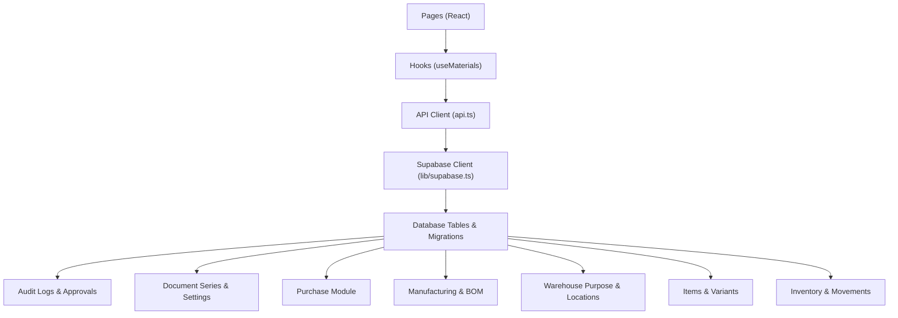

**Diagram sources**
- [src/pages/MaterialsList.tsx](file://src/pages/MaterialsList.tsx)
- [src/hooks/useMaterials.ts](file://src/hooks/useMaterials.ts)
- [src/api.ts](file://src/api.ts)
- [src/lib/supabase.ts](file://src/lib/supabase.ts)
- [src/database/database-materials.sql](file://src/database/database-materials.sql)
- [src/database/database-inventory.sql](file://src/database/database-inventory.sql)
- [src/database/database-warehouse-purpose.sql](file://src/database/database-warehouse-purpose.sql)
- [src/database/database-quick-stock-check.sql](file://src/database/database-quick-stock-check.sql)
- [src/database/database-material-intents-enhancement.sql](file://src/database/database-material-intents-enhancement.sql)
- [src/database/database-material-inward-update.sql](file://src/database/database-material-inward-update.sql)
- [src/database/database-items.sql](file://src/database/database-items.sql)
- [src/database/database-manufacturing.sql](file://src/database/database-manufacturing.sql)
- [src/database/database-purchase-module.sql](file://src/database/database-purchase-module.sql)
- [src/database/database-issue-site-reports.sql](file://src/database/database-issue-site-reports.sql)
- [src/database/database-supply-chain-audit-log.sql](file://src/database/database-supply-chain-audit-log.sql)
- [src/database/database-bom-setup.sql](file://src/database/database-bom-setup.sql)
- [src/database/database-complete.sql](file://src/database/database-complete.sql)
- [src/database/database-setup.sql](file://src/database/database-setup.sql)
- [src/database/database-tables.sql](file://src/database/database-tables.sql)
- [src/database/database-verify.sql](file://src/database/database-verify.sql)

## Detailed Component Analysis

### Material Catalog Management
- Item Master: Central entity defining materials, units, categories, variants, and attributes. Supports HSN/SAC codes and tax-related fields.
- Categories: Hierarchical classification enabling filtering and reporting.
- Variants: Attributes like size, color, or specification mapped to pricing and availability.
- Integration Points: Used by procurement, manufacturing, and consumption flows.

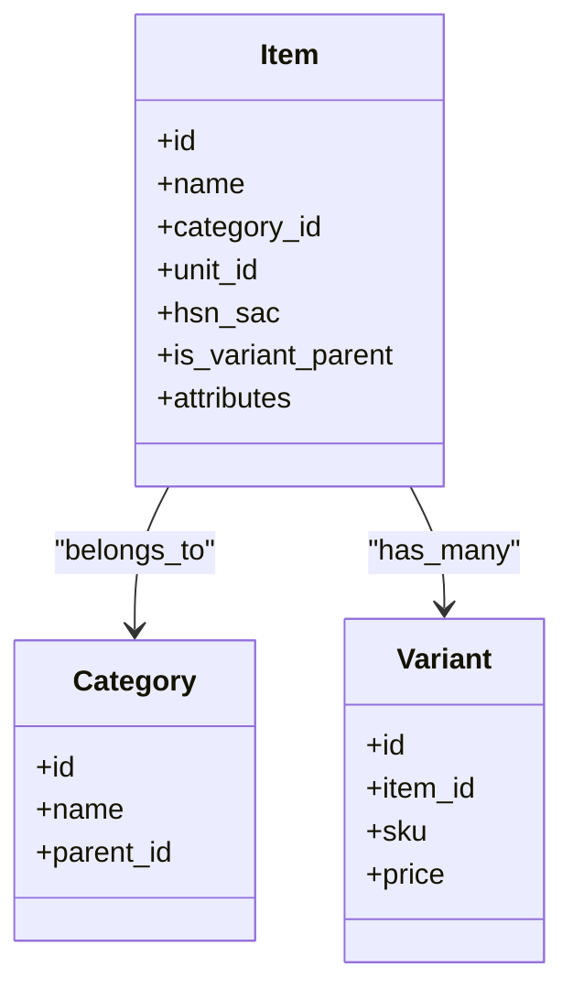

**Diagram sources**
- [src/database/database-items.sql](file://src/database/database-items.sql)
- [src/database/add-hsn-sac-columns.sql](file://src/database/add-hsn-sac-columns.sql)

**Section sources**
- [src/pages/MaterialsList.tsx](file://src/pages/MaterialsList.tsx)
- [src/database/database-items.sql](file://src/database/database-items.sql)
- [src/database/add-hsn-sac-columns.sql](file://src/database/add-hsn-sac-columns.sql)

### Real-Time Stock Tracking
- On-Hand Quantities: Aggregated per item and location with movement history.
- Movement Records: Inward, outward, adjustments, and transfers captured with timestamps and users.
- Quick Stock Checks: Rapid reconciliation tools with validation and audit logging.

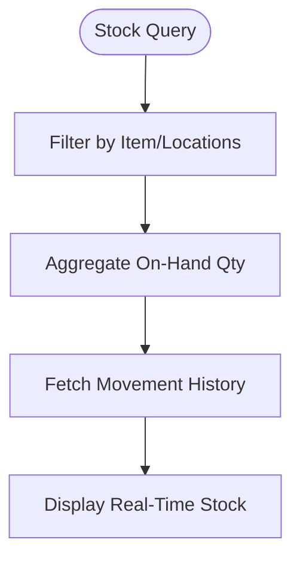

**Diagram sources**
- [src/pages/QuickStockCheck.tsx](file://src/pages/QuickStockCheck.tsx)
- [src/pages/QuickStockCheckList.tsx](file://src/pages/QuickStockCheckList.tsx)
- [src/database/database-quick-stock-check.sql](file://src/database/database-quick-stock-check.sql)
- [src/database/database-inventory.sql](file://src/database/database-inventory.sql)

**Section sources**
- [src/pages/QuickStockCheck.tsx](file://src/pages/QuickStockCheck.tsx)
- [src/pages/QuickStockCheckList.tsx](file://src/pages/QuickStockCheckList.tsx)
- [src/database/database-quick-stock-check.sql](file://src/database/database-quick-stock-check.sql)
- [src/database/database-inventory.sql](file://src/database/database-inventory.sql)

### Warehouse Operations
- Inward Receipts: Goods receipt processing against purchase orders or direct receipts, updating inventory and valuation.
- Outward Issues: Consumption or dispatch issuance with FIFO/LIFO/Average cost logic as configured.
- Stock Adjustments: Manual corrections with reason codes and approvals.
- Inter-Warehouse Transfers: Move orders with origin/destination locations and transit status.

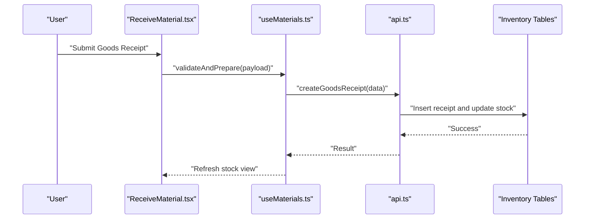

**Diagram sources**
- [src/pages/ReceiveMaterial.tsx](file://src/pages/ReceiveMaterial.tsx)
- [src/pages/MaterialInward.tsx](file://src/pages/MaterialInward.tsx)
- [src/hooks/useMaterials.ts](file://src/hooks/useMaterials.ts)
- [src/api.ts](file://src/api.ts)
- [src/database/database-material-inward-update.sql](file://src/database/database-material-inward-update.sql)
- [src/database/database-inventory.sql](file://src/database/database-inventory.sql)

**Section sources**
- [src/pages/ReceiveMaterial.tsx](file://src/pages/ReceiveMaterial.tsx)
- [src/pages/MaterialInward.tsx](file://src/pages/MaterialInward.tsx)
- [src/pages/MaterialOutward.tsx](file://src/pages/MaterialOutward.tsx)
- [src/pages/StockAdjustment.tsx](file://src/pages/StockAdjustment.tsx)
- [src/pages/StockTransfer.tsx](file://src/pages/StockTransfer.tsx)
- [src/hooks/useMaterials.ts](file://src/hooks/useMaterials.ts)
- [src/api.ts](file://src/api.ts)
- [src/database/database-material-inward-update.sql](file://src/database/database-material-inward-update.sql)
- [src/database/database-inventory.sql](file://src/database/database-inventory.sql)

### Procurement Workflows and Purchase Order Integration
- Material Intents: Pre-procurement planning tied to projects and tasks.
- Purchase Orders: Creation, approval, and linking to intents and receipts.
- Goods Receipt: Matching receipts to PO lines, updating stock and valuation.
- Document Series: Sequential numbering and settings for traceability.

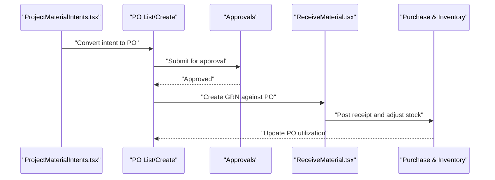

**Diagram sources**
- [src/pages/ProjectMaterialIntents.tsx](file://src/pages/ProjectMaterialIntents.tsx)
- [src/pages/ReceiveMaterial.tsx](file://src/pages/ReceiveMaterial.tsx)
- [src/database/database-material-intents-enhancement.sql](file://src/database/database-material-intents-enhancement.sql)
- [src/database/database-purchase-module.sql](file://src/database/database-purchase-module.sql)
- [src/database/database-material-inward-update.sql](file://src/database/database-material-inward-update.sql)
- [src/database/database-document-series.sql](file://src/database/database-document-series.sql)
- [src/database/database-document-settings.sql](file://src/database/database-document-settings.sql)
- [src/database/database-approvals.sql](file://src/database/database-approvals.sql)
- [src/database/database-approval-workflows-rls.sql](file://src/database/database-approval-workflows-rls.sql)
- [src/database/database-approval-workflows-fix-fk.sql](file://src/database/database-approval-workflows-fix-fk.sql)

**Section sources**
- [src/pages/ProjectMaterialIntents.tsx](file://src/pages/ProjectMaterialIntents.tsx)
- [src/pages/ReceiveMaterial.tsx](file://src/pages/ReceiveMaterial.tsx)
- [src/database/database-material-intents-enhancement.sql](file://src/database/database-material-intents-enhancement.sql)
- [src/database/database-purchase-module.sql](file://src/database/database-purchase-module.sql)
- [src/database/database-material-inward-update.sql](file://src/database/database-material-inward-update.sql)
- [src/database/database-document-series.sql](file://src/database/database-document-series.sql)
- [src/database/database-document-settings.sql](file://src/database/database-document-settings.sql)
- [src/database/database-approvals.sql](file://src/database/database-approvals.sql)
- [src/database/database-approval-workflows-rls.sql](file://src/database/database-approval-workflows-rls.sql)
- [src/database/database-approval-workflows-fix-fk.sql](file://src/database/database-approval-workflows-fix-fk.sql)

### Inventory Valuation Methods
- Supported Methods: Average cost, FIFO, LIFO, specific identification (as configured).
- Application Points: Applied at goods receipt posting and issue transactions.
- Reporting: Valuation reports reflect method changes and historical postings.

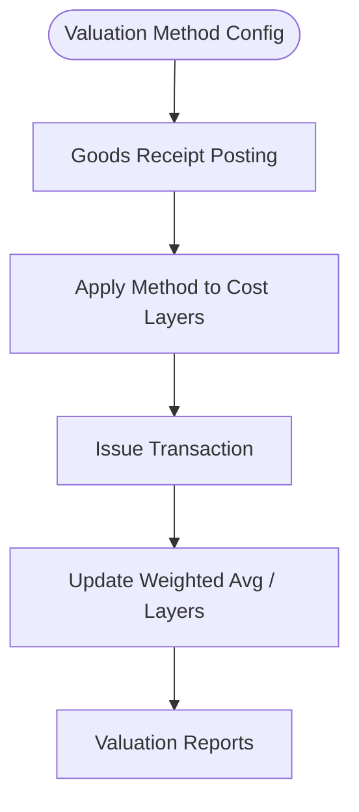

**Diagram sources**
- [src/database/database-inventory.sql](file://src/database/database-inventory.sql)
- [src/database/database-material-inward-update.sql](file://src/database/database-material-inward-update.sql)

**Section sources**
- [src/database/database-inventory.sql](file://src/database/database-inventory.sql)
- [src/database/database-material-inward-update.sql](file://src/database/database-material-inward-update.sql)

### Batch and Serial Number Tracking
- Batch Control: Lot numbers, manufacture/expiry dates, and supplier references.
- Serial Numbers: Unique identifiers for high-value or regulated items.
- Traceability: End-to-end lineage from receipt through issue/consumption.

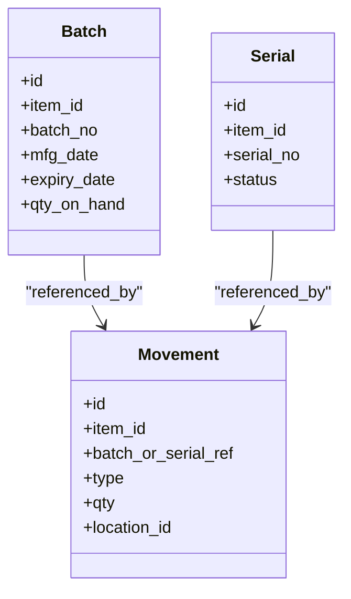

**Diagram sources**
- [src/database/database-inventory.sql](file://src/database/database-inventory.sql)
- [src/database/database-supply-chain-audit-log.sql](file://src/database/database-supply-chain-audit-log.sql)

**Section sources**
- [src/database/database-inventory.sql](file://src/database/database-inventory.sql)
- [src/database/database-supply-chain-audit-log.sql](file://src/database/database-supply-chain-audit-log.sql)

### Multi-Location Stock Management
- Warehouse Hierarchy: Parent-child relationships for complex site structures.
- Location-Aware Transactions: All movements specify source/destination locations.
- Consolidated Views: Dashboards aggregate across locations with drill-down.

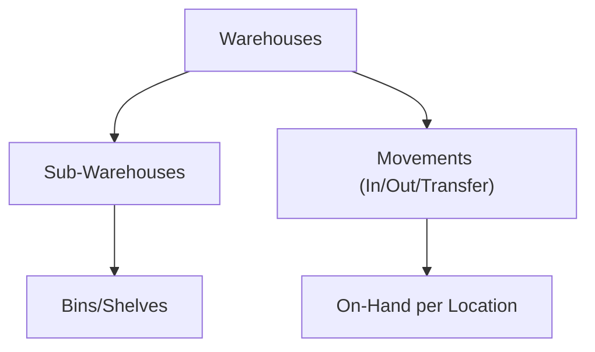

**Diagram sources**
- [src/database/database-warehouse-purpose.sql](file://src/database/database-warehouse-purpose.sql)
- [src/database/database-inventory.sql](file://src/database/database-inventory.sql)

**Section sources**
- [src/database/database-warehouse-purpose.sql](file://src/database/database-warehouse-purpose.sql)
- [src/database/database-inventory.sql](file://src/database/database-inventory.sql)

### Automated Reorder Points
- Thresholds: Min/max levels per item/location trigger alerts or auto-create intents/POs.
- Usage Patterns: Historical consumption informs dynamic reordering.
- Notifications: Alerts to planners and procurement teams.

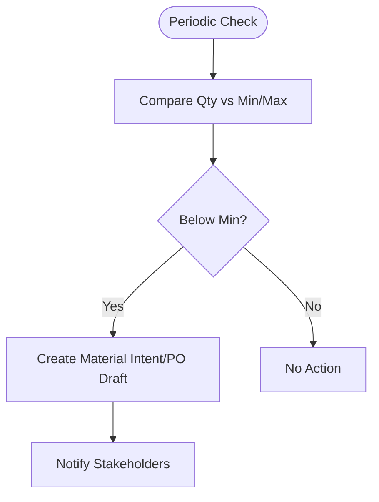

**Diagram sources**
- [src/database/database-material-intents-enhancement.sql](file://src/database/database-material-intents-enhancement.sql)
- [src/database/database-purchase-module.sql](file://src/database/database-purchase-module.sql)

**Section sources**
- [src/database/database-material-intents-enhancement.sql](file://src/database/database-material-intents-enhancement.sql)
- [src/database/database-purchase-module.sql](file://src/database/database-purchase-module.sql)

### Material Requisition Process
- Requisitions: Site or project teams request materials via intents or formal requisitions.
- Approvals: Workflow-driven approvals before conversion to POs.
- Linkage: Direct mapping to PO lines and subsequent receipts.

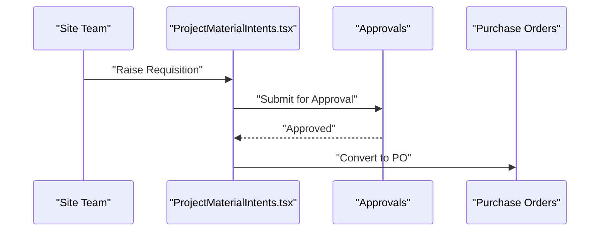

**Diagram sources**
- [src/pages/ProjectMaterialIntents.tsx](file://src/pages/ProjectMaterialIntents.tsx)
- [src/database/database-material-intents-enhancement.sql](file://src/database/database-material-intents-enhancement.sql)
- [src/database/database-approvals.sql](file://src/database/database-approvals.sql)
- [src/database/database-approval-workflows-rls.sql](file://src/database/database-approval-workflows-rls.sql)

**Section sources**
- [src/pages/ProjectMaterialIntents.tsx](file://src/pages/ProjectMaterialIntents.tsx)
- [src/database/database-material-intents-enhancement.sql](file://src/database/database-material-intents-enhancement.sql)
- [src/database/database-approvals.sql](file://src/database/database-approvals.sql)
- [src/database/database-approval-workflows-rls.sql](file://src/database/database-approval-workflows-rls.sql)

### Goods Receipt Handling
- Validation: Match against PO lines, validate batches/serials, and enforce limits.
- Posting: Update inventory layers, valuation, and audit logs.
- Exceptions: Partial receipts, overages, and quality holds.

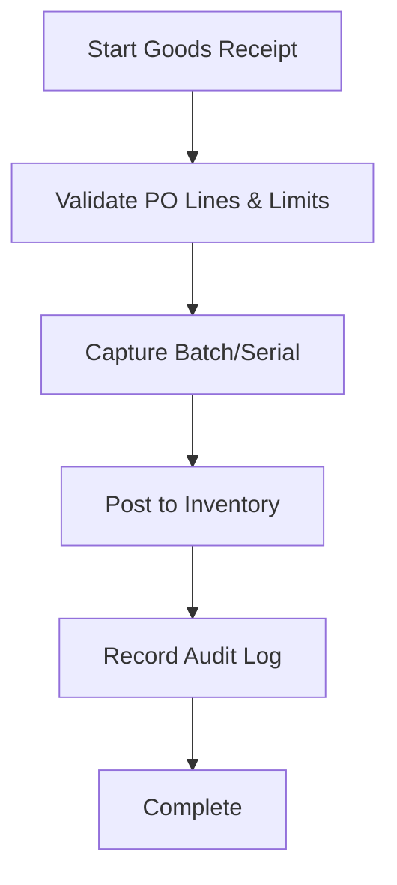

**Diagram sources**
- [src/pages/ReceiveMaterial.tsx](file://src/pages/ReceiveMaterial.tsx)
- [src/database/database-material-inward-update.sql](file://src/database/database-inventory.sql)
- [src/database/database-supply-chain-audit-log.sql](file://src/database/database-supply-chain-audit-log.sql)

**Section sources**
- [src/pages/ReceiveMaterial.tsx](file://src/pages/ReceiveMaterial.tsx)
- [src/database/database-material-inward-update.sql](file://src/database/database-inventory.sql)
- [src/database/database-supply-chain-audit-log.sql](file://src/database/database-supply-chain-audit-log.sql)

### Stock Adjustments and Transfers
- Adjustments: Corrective entries with reasons, approvals, and audit trails.
- Transfers: Origin/destination moves with transit states and confirmation steps.

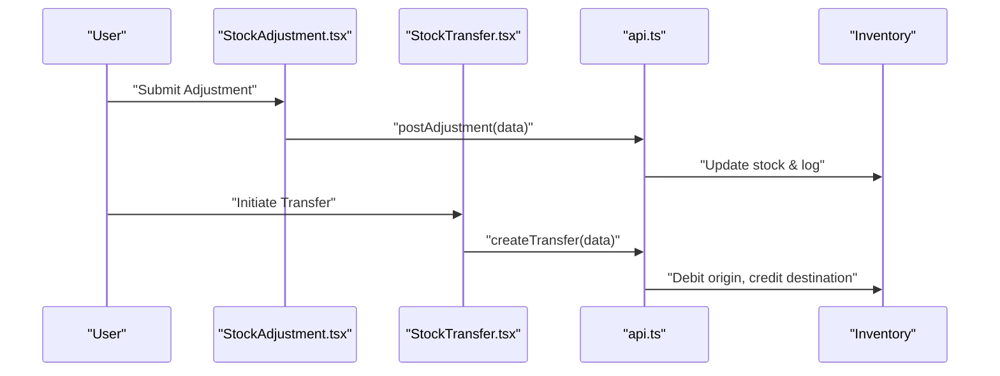

**Diagram sources**
- [src/pages/StockAdjustment.tsx](file://src/pages/StockAdjustment.tsx)
- [src/pages/StockTransfer.tsx](file://src/pages/StockTransfer.tsx)
- [src/api.ts](file://src/api.ts)
- [src/database/database-inventory.sql](file://src/database/database-inventory.sql)

**Section sources**
- [src/pages/StockAdjustment.tsx](file://src/pages/StockAdjustment.tsx)
- [src/pages/StockTransfer.tsx](file://src/pages/StockTransfer.tsx)
- [src/api.ts](file://src/api.ts)
- [src/database/database-inventory.sql](file://src/database/database-inventory.sql)

### Customizing Material Categories and Warehouse Hierarchies
- Categories: Define parent-child taxonomy, tags, and default attributes.
- Warehouses: Configure purpose, hierarchy, and bin-level organization.
- Settings: Global defaults for valuation, series, and approvals.

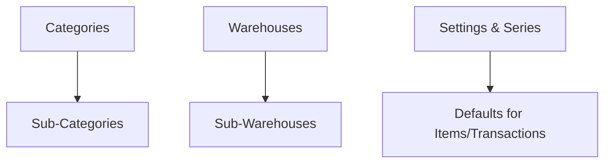

**Diagram sources**
- [src/database/database-items.sql](file://src/database/database-items.sql)
- [src/database/database-warehouse-purpose.sql](file://src/database/database-warehouse-purpose.sql)
- [src/database/database-document-series.sql](file://src/database/database-document-series.sql)
- [src/database/database-document-settings.sql](file://src/database/database-document-settings.sql)

**Section sources**
- [src/database/database-items.sql](file://src/database/database-items.sql)
- [src/database/database-warehouse-purpose.sql](file://src/database/database-warehouse-purpose.sql)
- [src/database/database-document-series.sql](file://src/database/database-document-series.sql)
- [src/database/database-document-settings.sql](file://src/database/database-document-settings.sql)

### Integrating with Accounting Systems
- Export Mappings: Map items, categories, and transactions to chart of accounts.
- Document Series: Ensure consistent numbering for invoices, receipts, and adjustments.
- Audit Trails: Provide reconcilable logs for external accounting systems.

```mermaid
graph TB
Acc["Accounting System"] <- --> Mapping["Export Mappings"]
Mapping --> Docs["Document Series & Settings"]
Docs --> Audit["Audit Logs"]
```

**Diagram sources**
- [src/database/database-document-series.sql](file://src/database/database-document-series.sql)
- [src/database/database-document-settings.sql](file://src/database/database-document-settings.sql)
- [src/database/database-supply-chain-audit-log.sql](file://src/database/database-supply-chain-audit-log.sql)

**Section sources**
- [src/database/database-document-series.sql](file://src/database/database-document-series.sql)
- [src/database/database-document-settings.sql](file://src/database/database-document-settings.sql)
- [src/database/database-supply-chain-audit-log.sql](file://src/database/database-supply-chain-audit-log.sql)

## Dependency Analysis
Key dependencies between components:
- Pages depend on hooks for data fetching and mutations.
- Hooks rely on the API client which uses Supabase for persistence.
- Database schemas define entities and constraints that govern behavior.
- Approvals and document series integrate across procurement and inventory flows.

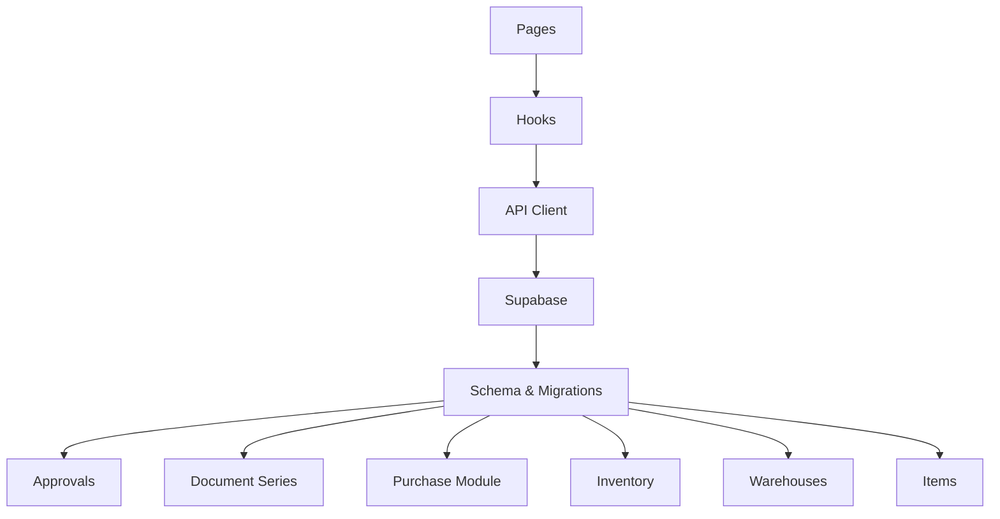

**Diagram sources**
- [src/pages/MaterialsList.tsx](file://src/pages/MaterialsList.tsx)
- [src/hooks/useMaterials.ts](file://src/hooks/useMaterials.ts)
- [src/api.ts](file://src/api.ts)
- [src/lib/supabase.ts](file://src/lib/supabase.ts)
- [src/database/database-materials.sql](file://src/database/database-materials.sql)
- [src/database/database-inventory.sql](file://src/database/database-inventory.sql)
- [src/database/database-warehouse-purpose.sql](file://src/database/database-warehouse-purpose.sql)
- [src/database/database-quick-stock-check.sql](file://src/database/database-quick-stock-check.sql)
- [src/database/database-material-intents-enhancement.sql](file://src/database/database-material-intents-enhancement.sql)
- [src/database/database-material-inward-update.sql](file://src/database/database-material-inward-update.sql)
- [src/database/database-items.sql](file://src/database/database-items.sql)
- [src/database/database-manufacturing.sql](file://src/database/database-manufacturing.sql)
- [src/database/database-purchase-module.sql](file://src/database/database-purchase-module.sql)
- [src/database/database-issue-site-reports.sql](file://src/database/database-issue-site-reports.sql)
- [src/database/database-supply-chain-audit-log.sql](file://src/database/database-supply-chain-audit-log.sql)
- [src/database/database-bom-setup.sql](file://src/database/database-bom-setup.sql)
- [src/database/database-complete.sql](file://src/database/database-complete.sql)
- [src/database/database-setup.sql](file://src/database/database-setup.sql)
- [src/database/database-tables.sql](file://src/database/database-tables.sql)
- [src/database/database-verify.sql](file://src/database/database-verify.sql)

**Section sources**
- [src/pages/MaterialsList.tsx](file://src/pages/MaterialsList.tsx)
- [src/hooks/useMaterials.ts](file://src/hooks/useMaterials.ts)
- [src/api.ts](file://src/api.ts)
- [src/lib/supabase.ts](file://src/lib/supabase.ts)
- [src/database/database-materials.sql](file://src/database/database-materials.sql)
- [src/database/database-inventory.sql](file://src/database/database-inventory.sql)
- [src/database/database-warehouse-purpose.sql](file://src/database/database-warehouse-purpose.sql)
- [src/database/database-quick-stock-check.sql](file://src/database/database-quick-stock-check.sql)
- [src/database/database-material-intents-enhancement.sql](file://src/database/database-material-intents-enhancement.sql)
- [src/database/database-material-inward-update.sql](file://src/database/database-material-inward-update.sql)
- [src/database/database-items.sql](file://src/database/database-items.sql)
- [src/database/database-manufacturing.sql](file://src/database/database-manufacturing.sql)
- [src/database/database-purchase-module.sql](file://src/database/database-purchase-module.sql)
- [src/database/database-issue-site-reports.sql](file://src/database/database-issue-site-reports.sql)
- [src/database/database-supply-chain-audit-log.sql](file://src/database/database-supply-chain-audit-log.sql)
- [src/database/database-bom-setup.sql](file://src/database/database-bom-setup.sql)
- [src/database/database-complete.sql](file://src/database/database-complete.sql)
- [src/database/database-setup.sql](file://src/database/database-setup.sql)
- [src/database/database-tables.sql](file://src/database/database-tables.sql)
- [src/database/database-verify.sql](file://src/database/database-verify.sql)

## Performance Considerations
- Indexing: Ensure indexes on frequently filtered columns (item_id, location_id, transaction_type, date).
- Pagination: Use server-side pagination for large lists and dashboards.
- Caching: Cache reference data (categories, warehouses) and slow-moving aggregates.
- Concurrency: Implement optimistic locking or row-level locks for stock updates to prevent race conditions.
- Batching: Batch writes for bulk adjustments and transfers.
- Queries: Optimize joins and avoid N+1 queries; use pre-aggregated views for reports.
- Network: Minimize payload sizes and leverage Supabase query optimizations.

[No sources needed since this section provides general guidance]

## Troubleshooting Guide
Common issues and resolutions:
- Negative Stock: Investigate movement ordering and concurrency; review audit logs for anomalies.
- Valuation Drift: Verify valuation method configuration and ensure consistent posting rules.
- Approval Blocks: Check workflow state and RLS policies preventing actions.
- Series Gaps: Inspect document series settings and conflicts.
- Sync Errors: Review Supabase connectivity and error logs; retry failed operations.

**Section sources**
- [src/database/database-supply-chain-audit-log.sql](file://src/database/database-supply-chain-audit-log.sql)
- [src/database/database-approvals.sql](file://src/database/database-approvals.sql)
- [src/database/database-approval-workflows-rls.sql](file://src/database/database-approval-workflows-rls.sql)
- [src/database/database-document-series.sql](file://src/database/database-document-series.sql)
- [src/database/database-document-settings.sql](file://src/database/database-document-settings.sql)
- [src/lib/supabase.ts](file://src/lib/supabase.ts)

## Conclusion
The Materials & Inventory Management system provides comprehensive capabilities for catalog management, real-time stock tracking, warehouse operations, procurement integration, valuation, traceability, and multi-location support. With robust approvals, document series, and audit logging, it ensures accuracy and compliance. Performance best practices and careful schema design enable scalability for large inventories and concurrent operations.

[No sources needed since this section summarizes without analyzing specific files]

## Appendices
- Example: Customizing Material Categories
  - Define parent-child categories and assign default attributes to streamline item creation.
  - Reference: [src/database/database-items.sql](file://src/database/database-items.sql)
- Example: Setting Up Warehouse Hierarchies
  - Configure warehouse purposes and nested structures to match organizational needs.
  - Reference: [src/database/database-warehouse-purpose.sql](file://src/database/database-warehouse-purpose.sql)
- Example: Integrating with Accounting Systems
  - Map items and transactions using document series and export settings; reconcile via audit logs.
  - References:
    - [src/database/database-document-series.sql](file://src/database/database-document-series.sql)
    - [src/database/database-document-settings.sql](file://src/database/database-document-settings.sql)
    - [src/database/database-supply-chain-audit-log.sql](file://src/database/database-supply-chain-audit-log.sql)

**Section sources**
- [src/database/database-items.sql](file://src/database/database-items.sql)
- [src/database/database-warehouse-purpose.sql](file://src/database/database-warehouse-purpose.sql)
- [src/database/database-document-series.sql](file://src/database/database-document-series.sql)
- [src/database/database-document-settings.sql](file://src/database/database-document-settings.sql)
- [src/database/database-supply-chain-audit-log.sql](file://src/database/database-supply-chain-audit-log.sql)