# Procurement & Purchase Orders

<cite>
**Referenced Files in This Document**
- [ProcurementList.tsx](file://src/pages/ProcurementList.tsx)
- [ProcurementDetail.tsx](file://src/pages/ProcurementDetail.tsx)
- [CreatePO.tsx](file://src/pages/CreatePO.tsx)
- [POList.tsx](file://src/pages/POList.tsx)
- [PODetails.tsx](file://src/pages/PODetails.tsx)
- [ReceiveMaterial.tsx](file://src/pages/ReceiveMaterial.tsx)
- [PurchaseModule.tsx](file://src/modules/Purchase/index.tsx)
- [purchase-api.ts](file://src/features/materials/purchase/api.ts)
- [purchase-hooks.ts](file://src/features/materials/purchase/hooks.ts)
- [purchase-types.ts](file://src/features/materials/purchase/types.ts)
- [database-purchase-module.sql](file://src/database-purchase-module.sql)
- [database-purchase-enhancements-v2.sql](file://src/database-purchase-enhancements-v2.sql)
- [database-po-payment-terms.sql](file://src/database-po-payment-terms.sql)
- [database-link-project-invoices-to-po.sql](file://src/database-link-project-invoices-to-po.sql)
- [useMaterials.ts](file://src/hooks/useMaterials.ts)
- [useWarehouses.ts](file://src/hooks/useWarehouses.ts)
- [useAuditLog.ts](file://src/hooks/useAuditLog.ts)
- [approval-workflow-engine.ts](file://src/approvals/workflow-engine.ts)
- [approval-settings-api.ts](file://src/approvals/settings-api.ts)
</cite>

## Table of Contents
1. [Introduction](#introduction)
2. [Project Structure](#project-structure)
3. [Core Components](#core-components)
4. [Architecture Overview](#architecture-overview)
5. [Detailed Component Analysis](#detailed-component-analysis)
6. [Dependency Analysis](#dependency-analysis)
7. [Performance Considerations](#performance-considerations)
8. [Troubleshooting Guide](#troubleshooting-guide)
9. [Conclusion](#conclusion)
10. [Appendices](#appendices)

## Introduction
This document explains the end-to-end Procurement and Purchase Order workflows implemented in the application, from requisition to payment. It covers approval workflows, budget controls, vendor selection, price negotiation, goods receipt matching, three-way matching (PO, receipt, invoice), discrepancy handling, automated PO generation based on reorder points, vendor performance tracking, contract management, integrations with supplier portals and EDI systems, accounting software integration, procurement analytics, spend analysis, cost optimization strategies, compliance requirements, audit trails, and regulatory reporting.

## Project Structure
The procurement functionality is primarily implemented under:
- Pages for user-facing flows: procurement list/detail, purchase order creation/listing/details, and material receiving
- Feature module for purchase domain logic, API calls, hooks, and types
- Database migrations defining core tables and relationships
- Approval workflow engine and settings for governance and controls
- Shared hooks for materials, warehouses, and audit logging

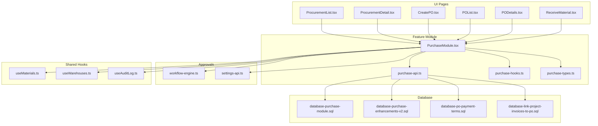

**Diagram sources**
- [ProcurementList.tsx](file://src/pages/ProcurementList.tsx)
- [ProcurementDetail.tsx](file://src/pages/ProcurementDetail.tsx)
- [CreatePO.tsx](file://src/pages/CreatePO.tsx)
- [POList.tsx](file://src/pages/POList.tsx)
- [PODetails.tsx](file://src/pages/PODetails.tsx)
- [ReceiveMaterial.tsx](file://src/pages/ReceiveMaterial.tsx)
- [PurchaseModule.tsx](file://src/modules/Purchase/index.tsx)
- [purchase-api.ts](file://src/features/materials/purchase/api.ts)
- [purchase-hooks.ts](file://src/features/materials/purchase/hooks.ts)
- [purchase-types.ts](file://src/features/materials/purchase/types.ts)
- [database-purchase-module.sql](file://src/database-purchase-module.sql)
- [database-purchase-enhancements-v2.sql](file://src/database-purchase-enhancements-v2.sql)
- [database-po-payment-terms.sql](file://src/database-po-payment-terms.sql)
- [database-link-project-invoices-to-po.sql](file://src/database-link-project-invoices-to-po.sql)
- [approval-workflow-engine.ts](file://src/approvals/workflow-engine.ts)
- [approval-settings-api.ts](file://src/approvals/settings-api.ts)
- [useMaterials.ts](file://src/hooks/useMaterials.ts)
- [useWarehouses.ts](file://src/hooks/useWarehouses.ts)
- [useAuditLog.ts](file://src/hooks/useAuditLog.ts)

**Section sources**
- [ProcurementList.tsx](file://src/pages/ProcurementList.tsx)
- [ProcurementDetail.tsx](file://src/pages/ProcurementDetail.tsx)
- [CreatePO.tsx](file://src/pages/CreatePO.tsx)
- [POList.tsx](file://src/pages/POList.tsx)
- [PODetails.tsx](file://src/pages/PODetails.tsx)
- [ReceiveMaterial.tsx](file://src/pages/ReceiveMaterial.tsx)
- [PurchaseModule.tsx](file://src/modules/Purchase/index.tsx)
- [purchase-api.ts](file://src/features/materials/purchase/api.ts)
- [purchase-hooks.ts](file://src/features/materials/purchase/hooks.ts)
- [purchase-types.ts](file://src/features/materials/purchase/types.ts)
- [database-purchase-module.sql](file://src/database-purchase-module.sql)
- [database-purchase-enhancements-v2.sql](file://src/database-purchase-enhancements-v2.sql)
- [database-po-payment-terms.sql](file://src/database-po-payment-terms.sql)
- [database-link-project-invoices-to-po.sql](file://src/database-link-project-invoices-to-po.sql)
- [approval-workflow-engine.ts](file://src/approvals/workflow-engine.ts)
- [approval-settings-api.ts](file://src/approvals/settings-api.ts)
- [useMaterials.ts](file://src/hooks/useMaterials.ts)
- [useWarehouses.ts](file://src/hooks/useWarehouses.ts)
- [useAuditLog.ts](file://src/hooks/useAuditLog.ts)

## Core Components
- Procurement List and Detail pages provide entry points to view and manage procurement requests and their lifecycle status.
- Purchase Order pages support creating, listing, and viewing detailed PO information including line items, pricing, and approvals.
- Material Receiving page captures goods receipts and links them to PO lines for subsequent matching.
- The Purchase feature module encapsulates API interactions, typed models, and reusable hooks for procurement operations.
- Database migrations define core entities such as purchase orders, items, vendors, receipts, invoices, and related metadata.
- Approval workflow engine and settings enforce multi-step approvals and policy-based routing.
- Shared hooks supply materials inventory data, warehouse context, and audit log access.

Key responsibilities:
- Orchestrate state transitions across requisition, approval, PO issuance, receipt, invoicing, and payment
- Enforce budget checks and approval thresholds
- Maintain audit trails for all changes
- Provide data for analytics and reporting

**Section sources**
- [ProcurementList.tsx](file://src/pages/ProcurementList.tsx)
- [ProcurementDetail.tsx](file://src/pages/ProcurementDetail.tsx)
- [CreatePO.tsx](file://src/pages/CreatePO.tsx)
- [POList.tsx](file://src/pages/POList.tsx)
- [PODetails.tsx](file://src/pages/PODetails.tsx)
- [ReceiveMaterial.tsx](file://src/pages/ReceiveMaterial.tsx)
- [PurchaseModule.tsx](file://src/modules/Purchase/index.tsx)
- [purchase-api.ts](file://src/features/materials/purchase/api.ts)
- [purchase-hooks.ts](file://src/features/materials/purchase/hooks.ts)
- [purchase-types.ts](file://src/features/materials/purchase/types.ts)
- [database-purchase-module.sql](file://src/database-purchase-module.sql)
- [database-purchase-enhancements-v2.sql](file://src/database-purchase-enhancements-v2.sql)
- [database-po-payment-terms.sql](file://src/database-po-payment-terms.sql)
- [database-link-project-invoices-to-po.sql](file://src/database-link-project-invoices-to-po.sql)
- [approval-workflow-engine.ts](file://src/approvals/workflow-engine.ts)
- [approval-settings-api.ts](file://src/approvals/settings-api.ts)
- [useMaterials.ts](file://src/hooks/useMaterials.ts)
- [useWarehouses.ts](file://src/hooks/useWarehouses.ts)
- [useAuditLog.ts](file://src/hooks/useAuditLog.ts)

## Architecture Overview
The procurement system follows a layered architecture:
- UI layer: React pages for user interactions
- Feature layer: Domain-specific APIs, hooks, and types
- Data layer: Database schema via migrations
- Governance layer: Approval workflows and settings
- Cross-cutting concerns: Audit logging, materials and warehouse context

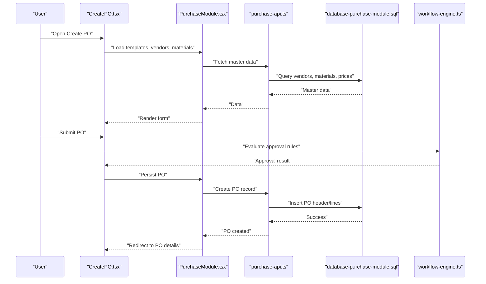

**Diagram sources**
- [CreatePO.tsx](file://src/pages/CreatePO.tsx)
- [PurchaseModule.tsx](file://src/modules/Purchase/index.tsx)
- [purchase-api.ts](file://src/features/materials/purchase/api.ts)
- [database-purchase-module.sql](file://src/database-purchase-module.sql)
- [approval-workflow-engine.ts](file://src/approvals/workflow-engine.ts)

## Detailed Component Analysis

### Procurement Lifecycle: Requisition to Payment
This section maps the end-to-end flow from initial request through payment, including approvals and budget controls.

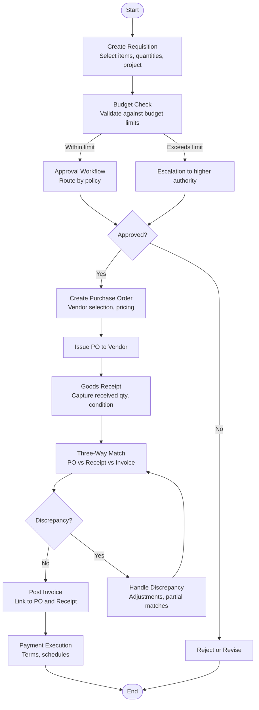

Implementation anchors:
- Requisition and procurement list/detail pages orchestrate initiation and visibility
- Approval workflow engine enforces policy-based routing and escalation
- Purchase order creation integrates vendor selection and pricing
- Goods receipt capture supports quantity and condition recording
- Three-way matching validates consistency before posting invoices
- Payment execution respects terms and schedules

**Section sources**
- [ProcurementList.tsx](file://src/pages/ProcurementList.tsx)
- [ProcurementDetail.tsx](file://src/pages/ProcurementDetail.tsx)
- [CreatePO.tsx](file://src/pages/CreatePO.tsx)
- [POList.tsx](file://src/pages/POList.tsx)
- [PODetails.tsx](file://src/pages/PODetails.tsx)
- [ReceiveMaterial.tsx](file://src/pages/ReceiveMaterial.tsx)
- [approval-workflow-engine.ts](file://src/approvals/workflow-engine.ts)
- [database-purchase-module.sql](file://src/database-purchase-module.sql)
- [database-purchase-enhancements-v2.sql](file://src/database-purchase-enhancements-v2.sql)
- [database-po-payment-terms.sql](file://src/database-po-payment-terms.sql)

### Purchase Order Creation, Vendor Selection, and Price Negotiation
- PO creation includes selecting vendors, negotiating prices, applying discounts, and setting delivery terms.
- Vendor selection leverages master data and historical performance metrics where available.
- Price negotiation records are captured to maintain transparency and auditability.

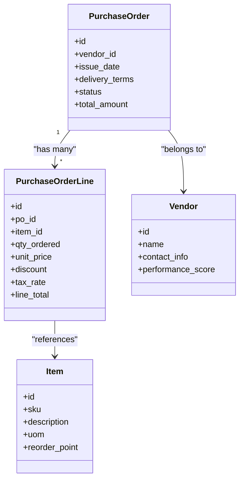

**Diagram sources**
- [CreatePO.tsx](file://src/pages/CreatePO.tsx)
- [PODetails.tsx](file://src/pages/PODetails.tsx)
- [purchase-types.ts](file://src/features/materials/purchase/types.ts)
- [database-purchase-module.sql](file://src/database-purchase-module.sql)

**Section sources**
- [CreatePO.tsx](file://src/pages/CreatePO.tsx)
- [PODetails.tsx](file://src/pages/PODetails.tsx)
- [purchase-types.ts](file://src/features/materials/purchase/types.ts)
- [database-purchase-module.sql](file://src/database-purchase-module.sql)

### Goods Receipt Matching and Three-Way Matching
- Goods receipt captures actual delivered quantities and conditions, linking back to PO lines.
- Three-way matching compares PO, receipt, and invoice to ensure accuracy before posting.
- Discrepancies trigger adjustments or exceptions for review.

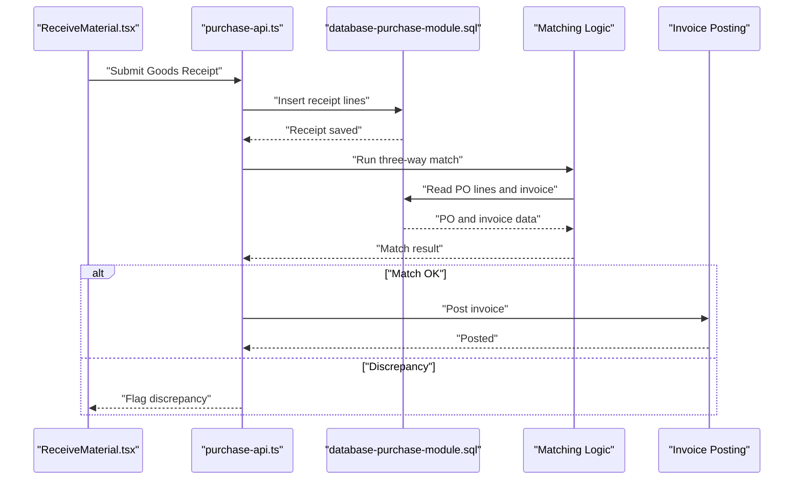

**Diagram sources**
- [ReceiveMaterial.tsx](file://src/pages/ReceiveMaterial.tsx)
- [purchase-api.ts](file://src/features/materials/purchase/api.ts)
- [database-purchase-module.sql](file://src/database-purchase-module.sql)

**Section sources**
- [ReceiveMaterial.tsx](file://src/pages/ReceiveMaterial.tsx)
- [purchase-api.ts](file://src/features/materials/purchase/api.ts)
- [database-purchase-module.sql](file://src/database-purchase-module.sql)

### Automated PO Generation Based on Reorder Points
- When item stock falls below reorder point, the system can auto-generate a draft PO.
- Automation uses current stock levels, reorder parameters, and preferred vendor pricing.

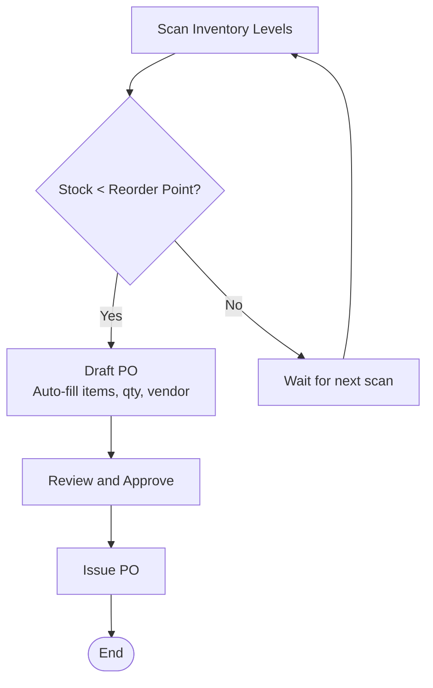

**Diagram sources**
- [useMaterials.ts](file://src/hooks/useMaterials.ts)
- [CreatePO.tsx](file://src/pages/CreatePO.tsx)
- [purchase-types.ts](file://src/features/materials/purchase/types.ts)
- [database-purchase-module.sql](file://src/database-purchase-module.sql)

**Section sources**
- [useMaterials.ts](file://src/hooks/useMaterials.ts)
- [CreatePO.tsx](file://src/pages/CreatePO.tsx)
- [purchase-types.ts](file://src/features/materials/purchase/types.ts)
- [database-purchase-module.sql](file://src/database-purchase-module.sql)

### Vendor Performance Tracking and Contract Management
- Vendor performance metrics include on-time delivery, quality acceptance rates, and price competitiveness.
- Contracts store agreed terms, pricing tiers, validity periods, and renewal dates.
- These data inform vendor selection and negotiation strategies.

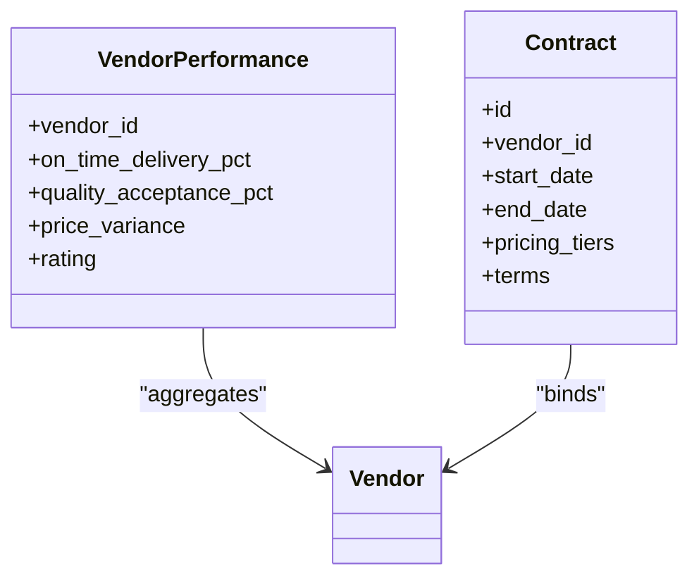

**Diagram sources**
- [purchase-types.ts](file://src/features/materials/purchase/types.ts)
- [database-purchase-module.sql](file://src/database-purchase-module.sql)

**Section sources**
- [purchase-types.ts](file://src/features/materials/purchase/types.ts)
- [database-purchase-module.sql](file://src/database-purchase-module.sql)

### Integration with Supplier Portals, EDI Systems, and Accounting Software
- Supplier portal integration enables electronic submission of quotes, acknowledgments, and invoices.
- EDI connectivity supports standardized document exchange (e.g., PO, ASN, invoice).
- Accounting software integration posts financial entries and reconciles payments.

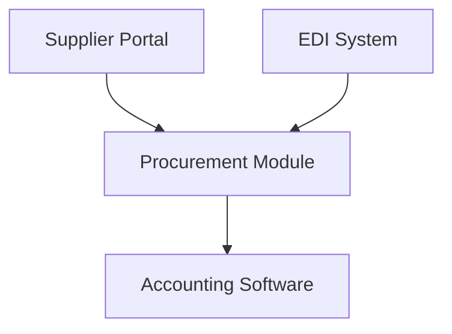

[No sources needed since this diagram shows conceptual integration patterns]

### Procurement Analytics, Spend Analysis, and Cost Optimization
- Analytics dashboards aggregate spend by category, vendor, and project.
- Spend analysis identifies outliers, consolidation opportunities, and renegotiation targets.
- Cost optimization strategies leverage vendor performance, contract pricing, and demand forecasting.

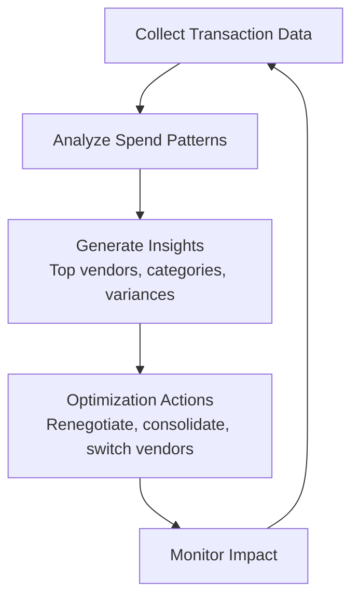

[No sources needed since this diagram shows conceptual analytics workflow]

### Compliance Requirements, Audit Trails, and Regulatory Reporting
- Audit logs capture who changed what and when across procurement documents.
- Compliance checks enforce policies, segregation of duties, and regulatory constraints.
- Regulatory reports summarize procurement activities for audits and statutory filings.

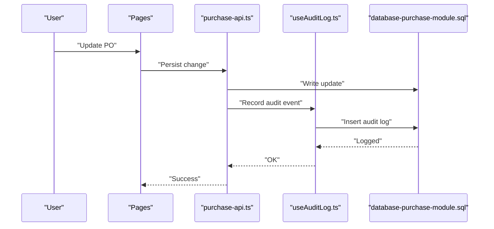

**Diagram sources**
- [useAuditLog.ts](file://src/hooks/useAuditLog.ts)
- [purchase-api.ts](file://src/features/materials/purchase/api.ts)
- [database-purchase-module.sql](file://src/database-purchase-module.sql)

**Section sources**
- [useAuditLog.ts](file://src/hooks/useAuditLog.ts)
- [purchase-api.ts](file://src/features/materials/purchase/api.ts)
- [database-purchase-module.sql](file://src/database-purchase-module.sql)

## Dependency Analysis
The procurement feature depends on shared modules for materials, warehouses, and approvals, and persists data via database migrations.

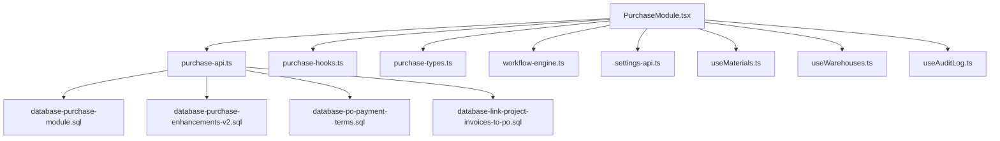

**Diagram sources**
- [PurchaseModule.tsx](file://src/modules/Purchase/index.tsx)
- [purchase-api.ts](file://src/features/materials/purchase/api.ts)
- [purchase-hooks.ts](file://src/features/materials/purchase/hooks.ts)
- [purchase-types.ts](file://src/features/materials/purchase/types.ts)
- [database-purchase-module.sql](file://src/database-purchase-module.sql)
- [database-purchase-enhancements-v2.sql](file://src/database-purchase-enhancements-v2.sql)
- [database-po-payment-terms.sql](file://src/database-po-payment-terms.sql)
- [database-link-project-invoices-to-po.sql](file://src/database-link-project-invoices-to-po.sql)
- [approval-workflow-engine.ts](file://src/approvals/workflow-engine.ts)
- [approval-settings-api.ts](file://src/approvals/settings-api.ts)
- [useMaterials.ts](file://src/hooks/useMaterials.ts)
- [useWarehouses.ts](file://src/hooks/useWarehouses.ts)
- [useAuditLog.ts](file://src/hooks/useAuditLog.ts)

**Section sources**
- [PurchaseModule.tsx](file://src/modules/Purchase/index.tsx)
- [purchase-api.ts](file://src/features/materials/purchase/api.ts)
- [purchase-hooks.ts](file://src/features/materials/purchase/hooks.ts)
- [purchase-types.ts](file://src/features/materials/purchase/types.ts)
- [database-purchase-module.sql](file://src/database-purchase-module.sql)
- [database-purchase-enhancements-v2.sql](file://src/database-purchase-enhancements-v2.sql)
- [database-po-payment-terms.sql](file://src/database-po-payment-terms.sql)
- [database-link-project-invoices-to-po.sql](file://src/database-link-project-invoices-to-po.sql)
- [approval-workflow-engine.ts](file://src/approvals/workflow-engine.ts)
- [approval-settings-api.ts](file://src/approvals/settings-api.ts)
- [useMaterials.ts](file://src/hooks/useMaterials.ts)
- [useWarehouses.ts](file://src/hooks/useWarehouses.ts)
- [useAuditLog.ts](file://src/hooks/useAuditLog.ts)

## Performance Considerations
- Batch operations for bulk PO creation and receipt processing reduce round-trips.
- Indexes on frequently queried columns (vendor_id, item_id, po_id) improve lookup performance.
- Pagination and filtering in lists prevent heavy payloads.
- Caching master data (vendors, items) minimizes repeated queries.
- Asynchronous audit logging avoids blocking critical transactions.

[No sources needed since this section provides general guidance]

## Troubleshooting Guide
Common issues and resolutions:
- Approval failures: Verify policy configuration and user roles; check workflow engine logs.
- Three-way mismatch: Inspect PO lines, receipt quantities, and invoice amounts; adjust or flag discrepancies.
- Budget exceeded: Confirm budget allocations and thresholds; escalate per policy.
- Missing audit entries: Ensure audit logging is enabled and permissions allow write access.

**Section sources**
- [approval-workflow-engine.ts](file://src/approvals/workflow-engine.ts)
- [approval-settings-api.ts](file://src/approvals/settings-api.ts)
- [useAuditLog.ts](file://src/hooks/useAuditLog.ts)

## Conclusion
The procurement and purchase order workflows integrate UI, feature logic, database schemas, and approval governance to deliver a robust end-to-end process. Key strengths include structured approvals, comprehensive audit trails, and clear matching mechanisms. Future enhancements should focus on advanced analytics, deeper integrations, and automation at scale.

[No sources needed since this section summarizes without analyzing specific files]

## Appendices

### Implementation Examples and Best Practices
- Automated PO generation: Configure reorder points and schedule periodic scans to create draft POs.
- Vendor selection: Use performance scores and contract pricing to rank vendors during selection.
- Discrepancy handling: Implement exception queues for mismatches requiring manual intervention.
- Compliance: Enforce role-based access and mandatory fields; retain immutable audit logs.

[No sources needed since this section provides general guidance]