# Stock Management & Tracking

<cite>
**Referenced Files in This Document**
- [StockAdjustment.tsx](file://src/pages/StockAdjustment.tsx)
- [StockTransfer.tsx](file://src/pages/StockTransfer.tsx)
- [QuickStockCheck.tsx](file://src/pages/QuickStockCheck.tsx)
- [QuickStockCheckList.tsx](file://src/pages/QuickStockCheckList.tsx)
- [MaterialInward.tsx](file://src/pages/MaterialInward.tsx)
- [MaterialOutward.tsx](file://src/pages/MaterialOutward.tsx)
- [MaterialsList.tsx](file://src/pages/MaterialsList.tsx)
- [useMaterials.ts](file://src/hooks/useMaterials.ts)
- [useWarehouses.ts](file://src/hooks/useWarehouses.ts)
- [database-inventory.sql](file://src/database-inventory.sql)
- [database-materials.sql](file://src/database-materials.sql)
- [database-setup.sql](file://src/database-setup.sql)
- [backfill-stock.js](file://scratch/backfill-stock.js)
- [check-stock.js](file://scratch/check-stock.js)
- [inspect-item-stock.js](file://scratch/inspect-item-stock.js)
- [material-intents/api.ts](file://src/material-intents/api.ts)
- [material-usage/api.ts](file://src/material-usage/api.ts)
- [credit-notes/stock-adjustment.ts](file://src/credit-notes/stock-adjustment.ts)
- [invoices/stock-deduction/index.ts](file://src/invoices/stock-deduction/index.ts)
</cite>

## Table of Contents
1. [Introduction](#introduction)
2. [Project Structure](#project-structure)
3. [Core Components](#core-components)
4. [Architecture Overview](#architecture-overview)
5. [Detailed Component Analysis](#detailed-component-analysis)
6. [Dependency Analysis](#dependency-analysis)
7. [Performance Considerations](#performance-considerations)
8. [Troubleshooting Guide](#troubleshooting-guide)
9. [Conclusion](#conclusion)
10. [Appendices](#appendices)

## Introduction
This document explains the Stock Management and Tracking functionality implemented in the application. It covers real-time stock level calculations, batch tracking, serial number management, stock adjustments, physical inventory counts, variance reporting, transaction history, valuation methods (FIFO, LIFO, weighted average), automated reorder point calculations, stock transfers between warehouses, reservations and allocation mechanisms, configuration options for stock policies and alert thresholds, and strategies for concurrent updates and data consistency across multiple locations.

## Project Structure
The stock management feature spans UI pages, hooks, database schemas, and utility scripts:
- Pages provide user workflows for inward/outward movements, adjustments, transfers, and quick checks.
- Hooks encapsulate data fetching and mutations for materials and warehouses.
- Database schema files define core tables and constraints for items, batches, serials, transactions, and warehouse stock.
- Utility scripts support backfills, audits, and diagnostics.

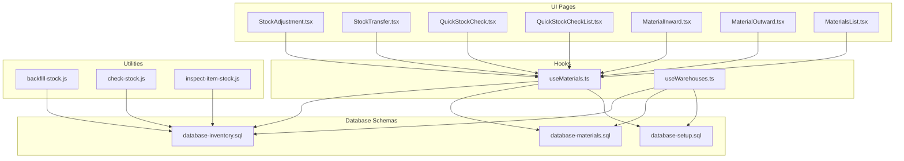

**Diagram sources**
- [StockAdjustment.tsx](file://src/pages/StockAdjustment.tsx)
- [StockTransfer.tsx](file://src/pages/StockTransfer.tsx)
- [QuickStockCheck.tsx](file://src/pages/QuickStockCheck.tsx)
- [QuickStockCheckList.tsx](file://src/pages/QuickStockCheckList.tsx)
- [MaterialInward.tsx](file://src/pages/MaterialInward.tsx)
- [MaterialOutward.tsx](file://src/pages/MaterialOutward.tsx)
- [MaterialsList.tsx](file://src/pages/MaterialsList.tsx)
- [useMaterials.ts](file://src/hooks/useMaterials.ts)
- [useWarehouses.ts](file://src/hooks/useWarehouses.ts)
- [database-inventory.sql](file://src/database-inventory.sql)
- [database-materials.sql](file://src/database-materials.sql)
- [database-setup.sql](file://src/database-setup.sql)
- [backfill-stock.js](file://scratch/backfill-stock.js)
- [check-stock.js](file://scratch/check-stock.js)
- [inspect-item-stock.js](file://scratch/inspect-item-stock.js)

**Section sources**
- [StockAdjustment.tsx](file://src/pages/StockAdjustment.tsx)
- [StockTransfer.tsx](file://src/pages/StockTransfer.tsx)
- [QuickStockCheck.tsx](file://src/pages/QuickStockCheck.tsx)
- [QuickStockCheckList.tsx](file://src/pages/QuickStockCheckList.tsx)
- [MaterialInward.tsx](file://src/pages/MaterialInward.tsx)
- [MaterialOutward.tsx](file://src/pages/MaterialOutward.tsx)
- [MaterialsList.tsx](file://src/pages/MaterialsList.tsx)
- [useMaterials.ts](file://src/hooks/useMaterials.ts)
- [useWarehouses.ts](file://src/hooks/useWarehouses.ts)
- [database-inventory.sql](file://src/database-inventory.sql)
- [database-materials.sql](file://src/database-materials.sql)
- [database-setup.sql](file://src/database-setup.sql)
- [backfill-stock.js](file://scratch/backfill-stock.js)
- [check-stock.js](file://scratch/check-stock.js)
- [inspect-item-stock.js](file://scratch/inspect-item-stock.js)

## Core Components
- Real-time stock levels: Computed from material transactions and current stock snapshots per item and warehouse.
- Batch tracking: Maintains per-batch quantities and attributes to enable FIFO/LIFO or custom selection rules.
- Serial number management: Tracks individual units with unique identifiers and linkage to transactions.
- Stock adjustments: Manual corrections with audit trails and reason codes.
- Physical inventory counts: Quick check flows to compare system vs. physical counts and generate variances.
- Transaction history: Immutable ledger of all stock movements with references to source documents.
- Valuation methods: FIFO, LIFO, weighted average applied at issuance or cost rollups.
- Reorder points: Automated calculations based on min/max levels and consumption rates.
- Transfers: Inter-warehouse movements with reservation and allocation steps.
- Reservations and allocations: Pre-reserve stock against orders or jobs before actual deduction.
- Configuration: Policies for rounding, negative stock allowance, lot/serial enforcement, and alert thresholds.

**Section sources**
- [database-inventory.sql](file://src/database-inventory.sql)
- [database-materials.sql](file://src/database-materials.sql)
- [database-setup.sql](file://src/database-setup.sql)
- [useMaterials.ts](file://src/hooks/useMaterials.ts)
- [useWarehouses.ts](file://src/hooks/useWarehouses.ts)

## Architecture Overview
The system follows a layered architecture:
- UI layer: Pages orchestrate user interactions for stock operations.
- Data access layer: Hooks fetch and mutate data via API/RPC calls backed by Supabase.
- Persistence layer: Relational schema enforces integrity for items, batches, serials, transactions, and stock balances.
- Utilities: Scripts assist with backfills, validation, and diagnostics.

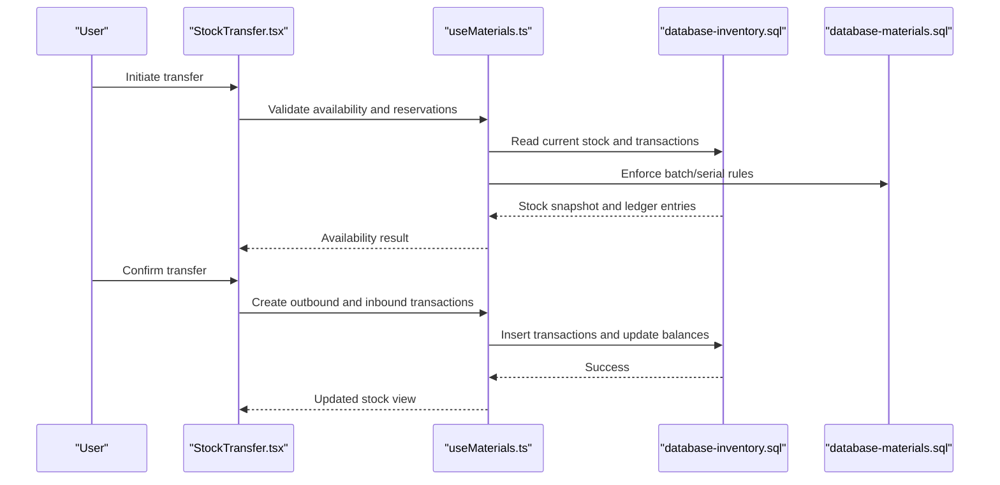

**Diagram sources**
- [StockTransfer.tsx](file://src/pages/StockTransfer.tsx)
- [useMaterials.ts](file://src/hooks/useMaterials.ts)
- [database-inventory.sql](file://src/database-inventory.sql)
- [database-materials.sql](file://src/database-materials.sql)

## Detailed Component Analysis

### Stock Adjustment Process
- Purpose: Correct stock discrepancies due to damage, loss, or administrative errors.
- Flow:
  - Select item and warehouse.
  - Enter adjustment quantity and reason code.
  - System validates policy (e.g., negative stock allowed).
  - Creates an adjustment transaction and updates balances.
  - Records audit trail with user and timestamp.

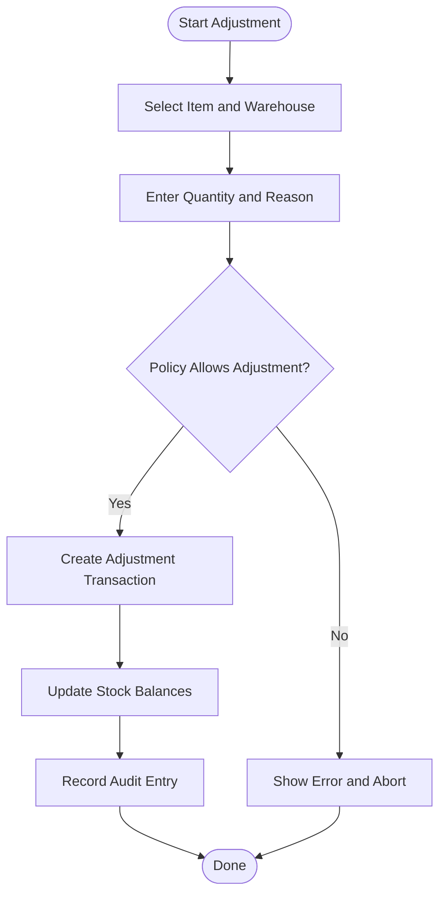

**Diagram sources**
- [StockAdjustment.tsx](file://src/pages/StockAdjustment.tsx)
- [database-inventory.sql](file://src/database-inventory.sql)
- [database-materials.sql](file://src/database-materials.sql)

**Section sources**
- [StockAdjustment.tsx](file://src/pages/StockAdjustment.tsx)
- [database-inventory.sql](file://src/database-inventory.sql)
- [database-materials.sql](file://src/database-materials.sql)

### Physical Inventory Counts and Variance Reporting
- Purpose: Compare system stock with physical counts and report variances.
- Flow:
  - Use Quick Stock Check to capture counts per item/warehouse.
  - System computes variance = physical - system.
  - Generate variance report and optionally create adjustment transactions.

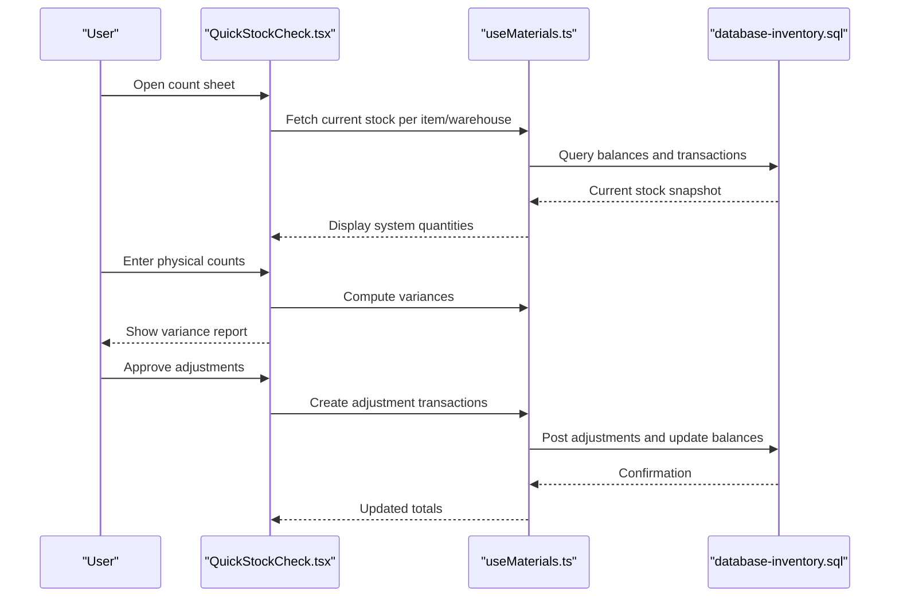

**Diagram sources**
- [QuickStockCheck.tsx](file://src/pages/QuickStockCheck.tsx)
- [QuickStockCheckList.tsx](file://src/pages/QuickStockCheckList.tsx)
- [useMaterials.ts](file://src/hooks/useMaterials.ts)
- [database-inventory.sql](file://src/database-inventory.sql)

**Section sources**
- [QuickStockCheck.tsx](file://src/pages/QuickStockCheck.tsx)
- [QuickStockCheckList.tsx](file://src/pages/QuickStockCheckList.tsx)
- [useMaterials.ts](file://src/hooks/useMaterials.ts)
- [database-inventory.sql](file://src/database-inventory.sql)

### Stock Transfers Between Warehouses
- Purpose: Move stock from one warehouse to another while preserving batch/serial traceability.
- Flow:
  - Select source and destination warehouses.
  - Choose item(s), batch(es), and/or serial numbers.
  - System reserves stock at source and creates outbound/inbound transactions.
  - Updates balances atomically.

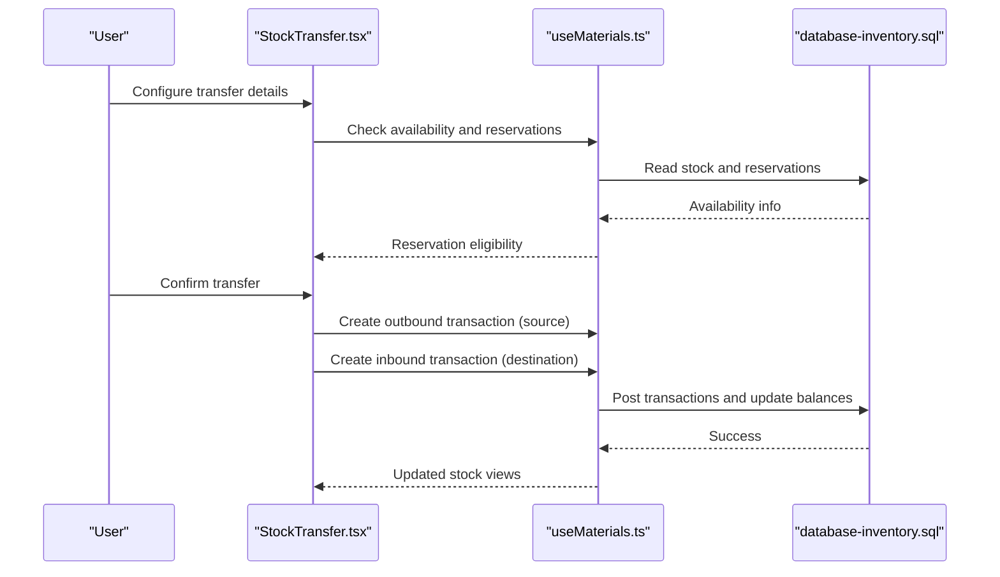

**Diagram sources**
- [StockTransfer.tsx](file://src/pages/StockTransfer.tsx)
- [useMaterials.ts](file://src/hooks/useMaterials.ts)
- [database-inventory.sql](file://src/database-inventory.sql)

**Section sources**
- [StockTransfer.tsx](file://src/pages/StockTransfer.tsx)
- [useMaterials.ts](file://src/hooks/useMaterials.ts)
- [database-inventory.sql](file://src/database-inventory.sql)

### Material Inward and Outward Operations
- Inward: Receive goods into stock, assign batches and serials, record costs for valuation.
- Outward: Issue goods against orders/jobs, apply valuation method, update balances.

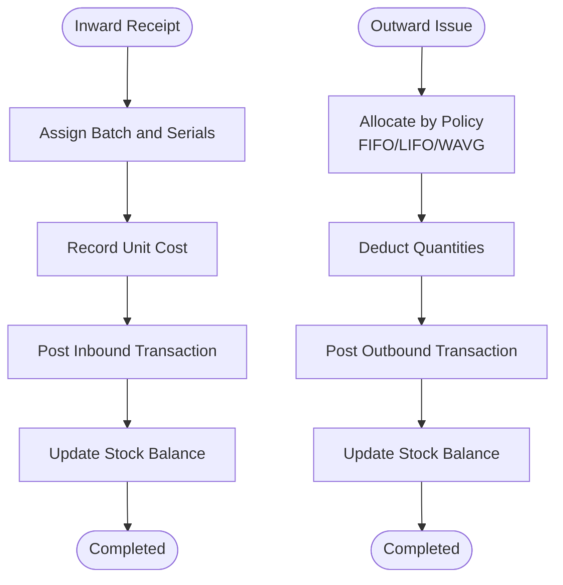

**Diagram sources**
- [MaterialInward.tsx](file://src/pages/MaterialInward.tsx)
- [MaterialOutward.tsx](file://src/pages/MaterialOutward.tsx)
- [database-inventory.sql](file://src/database-inventory.sql)
- [database-materials.sql](file://src/database-materials.sql)

**Section sources**
- [MaterialInward.tsx](file://src/pages/MaterialInward.tsx)
- [MaterialOutward.tsx](file://src/pages/MaterialOutward.tsx)
- [database-inventory.sql](file://src/database-inventory.sql)
- [database-materials.sql](file://src/database-materials.sql)

### Materials List and Real-Time Stock View
- Displays aggregated stock per item and warehouse.
- Supports filters by batch, serial, location, and status.
- Integrates with hooks for live updates.

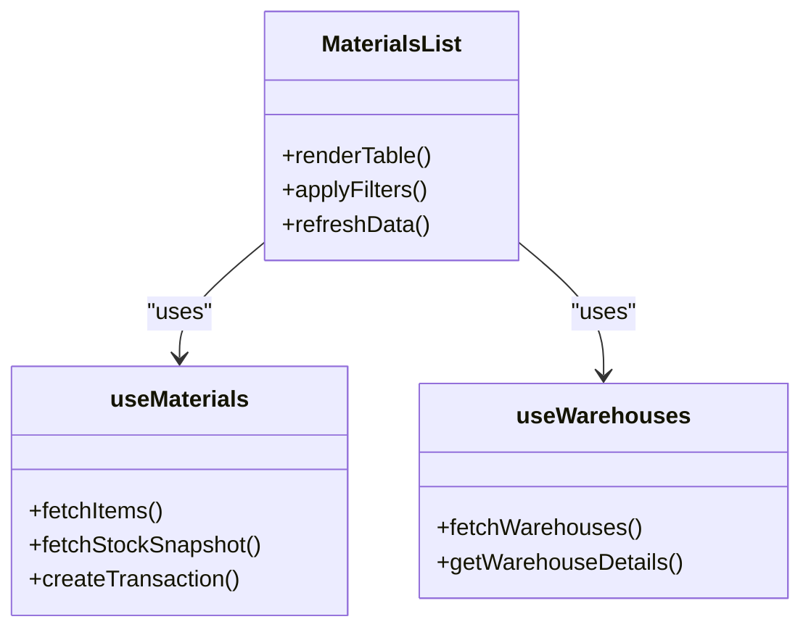

**Diagram sources**
- [MaterialsList.tsx](file://src/pages/MaterialsList.tsx)
- [useMaterials.ts](file://src/hooks/useMaterials.ts)
- [useWarehouses.ts](file://src/hooks/useWarehouses.ts)

**Section sources**
- [MaterialsList.tsx](file://src/pages/MaterialsList.tsx)
- [useMaterials.ts](file://src/hooks/useMaterials.ts)
- [useWarehouses.ts](file://src/hooks/useWarehouses.ts)

### Credit Notes Stock Adjustments
- Purpose: Reverse stock impacts from credit notes and ensure accurate balances.
- Flow:
  - Identify original outward transactions linked to credit note.
  - Create reversal transactions with appropriate valuation.
  - Update balances and maintain audit trail.

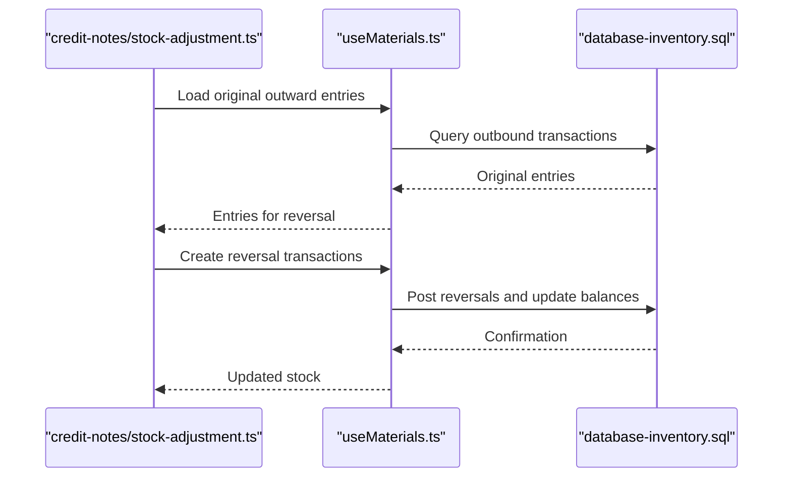

**Diagram sources**
- [credit-notes/stock-adjustment.ts](file://src/credit-notes/stock-adjustment.ts)
- [useMaterials.ts](file://src/hooks/useMaterials.ts)
- [database-inventory.sql](file://src/database-inventory.sql)

**Section sources**
- [credit-notes/stock-adjustment.ts](file://src/credit-notes/stock-adjustment.ts)
- [useMaterials.ts](file://src/hooks/useMaterials.ts)
- [database-inventory.sql](file://src/database-inventory.sql)

### Invoice Stock Deduction
- Purpose: Deduct stock when invoices are finalized, applying valuation rules.
- Flow:
  - Retrieve invoice lines and linked material intents.
  - Allocate stock per line using configured method.
  - Post outbound transactions and update balances.

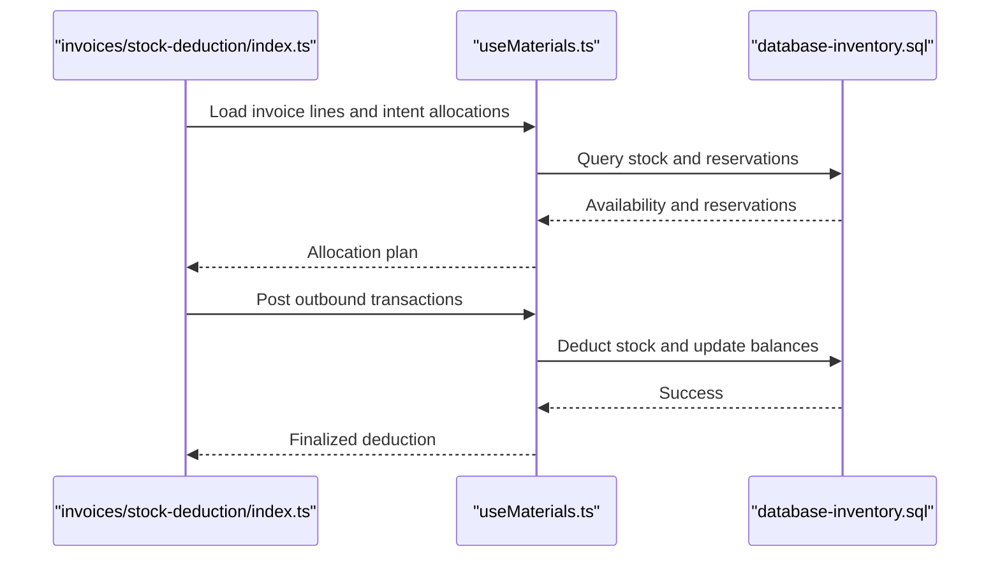

**Diagram sources**
- [invoices/stock-deduction/index.ts](file://src/invoices/stock-deduction/index.ts)
- [useMaterials.ts](file://src/hooks/useMaterials.ts)
- [database-inventory.sql](file://src/database-inventory.sql)

**Section sources**
- [invoices/stock-deduction/index.ts](file://src/invoices/stock-deduction/index.ts)
- [useMaterials.ts](file://src/hooks/useMaterials.ts)
- [database-inventory.sql](file://src/database-inventory.sql)

### Material Intents and Usage
- Material Intents: Pre-reserve stock for planned usage (e.g., job cards).
- Material Usage: Actual consumption postings that finalize reservations.

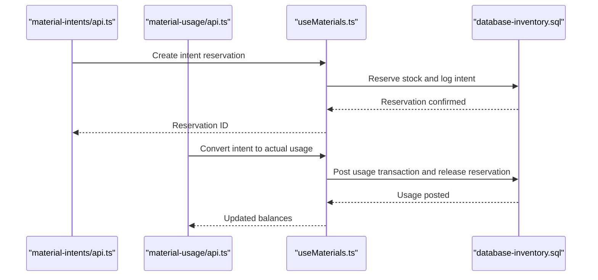

**Diagram sources**
- [material-intents/api.ts](file://src/material-intents/api.ts)
- [material-usage/api.ts](file://src/material-usage/api.ts)
- [useMaterials.ts](file://src/hooks/useMaterials.ts)
- [database-inventory.sql](file://src/database-inventory.sql)

**Section sources**
- [material-intents/api.ts](file://src/material-intents/api.ts)
- [material-usage/api.ts](file://src/material-usage/api.ts)
- [useMaterials.ts](file://src/hooks/useMaterials.ts)
- [database-inventory.sql](file://src/database-inventory.sql)

## Dependency Analysis
- UI components depend on hooks for data operations.
- Hooks depend on database schemas for constraints and queries.
- Utility scripts depend on schema definitions for backfills and audits.

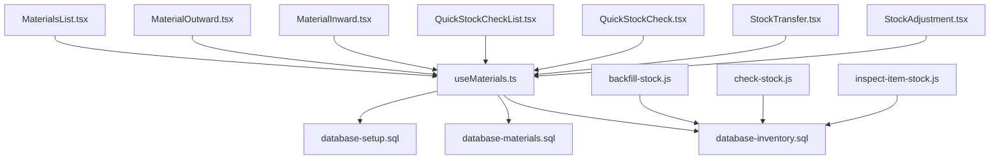

**Diagram sources**
- [StockAdjustment.tsx](file://src/pages/StockAdjustment.tsx)
- [StockTransfer.tsx](file://src/pages/StockTransfer.tsx)
- [QuickStockCheck.tsx](file://src/pages/QuickStockCheck.tsx)
- [QuickStockCheckList.tsx](file://src/pages/QuickStockCheckList.tsx)
- [MaterialInward.tsx](file://src/pages/MaterialInward.tsx)
- [MaterialOutward.tsx](file://src/pages/MaterialOutward.tsx)
- [MaterialsList.tsx](file://src/pages/MaterialsList.tsx)
- [useMaterials.ts](file://src/hooks/useMaterials.ts)
- [database-inventory.sql](file://src/database-inventory.sql)
- [database-materials.sql](file://src/database-materials.sql)
- [database-setup.sql](file://src/database-setup.sql)
- [backfill-stock.js](file://scratch/backfill-stock.js)
- [check-stock.js](file://scratch/check-stock.js)
- [inspect-item-stock.js](file://scratch/inspect-item-stock.js)

**Section sources**
- [useMaterials.ts](file://src/hooks/useMaterials.ts)
- [database-inventory.sql](file://src/database-inventory.sql)
- [database-materials.sql](file://src/database-materials.sql)
- [database-setup.sql](file://src/database-setup.sql)
- [backfill-stock.js](file://scratch/backfill-stock.js)
- [check-stock.js](file://scratch/check-stock.js)
- [inspect-item-stock.js](file://scratch/inspect-item-stock.js)

## Performance Considerations
- Prefer batched writes for multi-line adjustments and transfers to reduce round trips.
- Use optimistic locking on stock rows to avoid expensive row-level locks during high concurrency.
- Index frequently queried columns (item_id, warehouse_id, batch_no, serial_no) to speed up lookups.
- Cache read-only stock snapshots where appropriate and invalidate on write events.
- Partition large transaction tables by date ranges if volume grows significantly.

[No sources needed since this section provides general guidance]

## Troubleshooting Guide
Common issues and resolutions:
- Negative stock errors: Ensure policy allows negative stock or enforce pre-allocation/reservation.
- Batch/serial mismatch: Verify assignment rules and uniqueness constraints.
- Duplicate transactions: Check idempotency keys and deduplication logic.
- Stale reads: Refresh stock snapshots after mutations; handle conflicts gracefully.
- Backfill inconsistencies: Run diagnostic scripts to reconcile balances and correct anomalies.

**Section sources**
- [check-stock.js](file://scratch/check-stock.js)
- [inspect-item-stock.js](file://scratch/inspect-item-stock.js)
- [backfill-stock.js](file://scratch/backfill-stock.js)

## Conclusion
The stock management subsystem integrates UI workflows, robust hooks, and well-defined database schemas to deliver accurate, auditable, and scalable inventory control. By leveraging batch and serial tracking, configurable valuation methods, and reservation/allocation mechanisms, the system supports complex operational scenarios while maintaining data consistency and performance.

[No sources needed since this section summarizes without analyzing specific files]

## Appendices

### Configuration Options for Stock Policies
- Rounding rules: Define minimum order quantities and rounding increments.
- Negative stock allowance: Toggle whether deductions can exceed available stock.
- Lot/serial enforcement: Require batch and serial assignment for specific items.
- Alert thresholds: Set minimum/maximum stock levels and notification triggers.
- Valuation method: Choose FIFO, LIFO, or weighted average per item or globally.

**Section sources**
- [database-materials.sql](file://src/database-materials.sql)
- [database-setup.sql](file://src/database-setup.sql)

### Concurrent Updates and Optimistic Locking
- Use version/timestamp fields on stock rows to detect conflicts.
- On conflict, retry with updated values or prompt users to refresh and re-submit.
- Wrap related transactions in atomic operations to preserve balance invariants.

**Section sources**
- [database-inventory.sql](file://src/database-inventory.sql)
- [useMaterials.ts](file://src/hooks/useMaterials.ts)