# Warehouse Operations

<cite>
**Referenced Files in This Document**
- [useWarehouses.ts](file://src/hooks/useWarehouses.ts)
- [StockTransfer.tsx](file://src/pages/StockTransfer.tsx)
- [MaterialInward.tsx](file://src/pages/MaterialInward.tsx)
- [ReceiveMaterial.tsx](file://src/pages/ReceiveMaterial.tsx)
- [StockAdjustment.tsx](file://src/pages/StockAdjustment.tsx)
- [QuickStockCheck.tsx](file://src/pages/QuickStockCheck.tsx)
- [QuickStockCheckList.tsx](file://src/pages/QuickStockCheckList.tsx)
- [database-inventory.sql](file://src/database-inventory.sql)
- [database-materials.sql](file://src/database-materials.sql)
- [database-warehouse-purpose.sql](file://src/database-warehouse-purpose.sql)
- [api.ts](file://src/api.ts)
- [useMaterials.ts](file://src/hooks/useMaterials.ts)
- [useMaterialsPageData.tsx](file://src/hooks/useMaterialsPageData.tsx)
- [DCConsolidation.tsx](file://src/pages/DCConsolidation.tsx)
- [DateWiseConsolidation.tsx](file://src/pages/DateWiseConsolidation.tsx)
- [MaterialWiseConsolidation.tsx](file://src/pages/MaterialWiseConsolidation.tsx)
- [AuditLog.tsx](file://src/components/AuditLog.tsx)
- [useAuditLog.ts](file://src/hooks/useAuditLog.ts)
</cite>

## Table of Contents
1. [Introduction](#introduction)
2. [Project Structure](#project-structure)
3. [Core Components](#core-components)
4. [Architecture Overview](#architecture-overview)
5. [Detailed Component Analysis](#detailed-component-analysis)
6. [Dependency Analysis](#dependency-analysis)
7. [Performance Considerations](#performance-considerations)
8. [Troubleshooting Guide](#troubleshooting-guide)
9. [Conclusion](#conclusion)
10. [Appendices](#appendices)

## Introduction
This document describes the Warehouse Operations module as implemented in the application, focusing on warehouse hierarchy setup, location and bin management, capacity planning, goods receipt, putaway strategies, picking operations, transfers, inter-warehouse movements, consolidation procedures, integrations with barcode/RFID and automation systems, performance metrics and space optimization, and security controls including access permissions and audit requirements. The content is derived from the repository’s UI pages, hooks, API layer, and database schema files to provide a practical, code-grounded guide for operators and implementers.

## Project Structure
Warehouse-related functionality spans UI pages (for user workflows), hooks (for data fetching and state), API utilities (for backend calls), and SQL migrations (for data model definitions). Key areas include:
- Warehouse configuration and purpose settings
- Inventory and materials models
- Goods receipt and stock adjustments
- Stock transfers and consolidation
- Quick stock checks and audits

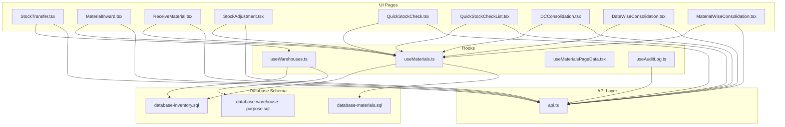

**Diagram sources**
- [StockTransfer.tsx](file://src/pages/StockTransfer.tsx)
- [MaterialInward.tsx](file://src/pages/MaterialInward.tsx)
- [ReceiveMaterial.tsx](file://src/pages/ReceiveMaterial.tsx)
- [StockAdjustment.tsx](file://src/pages/StockAdjustment.tsx)
- [QuickStockCheck.tsx](file://src/pages/QuickStockCheck.tsx)
- [QuickStockCheckList.tsx](file://src/pages/QuickStockCheckList.tsx)
- [DCConsolidation.tsx](file://src/pages/DCConsolidation.tsx)
- [DateWiseConsolidation.tsx](file://src/pages/DateWiseConsolidation.tsx)
- [MaterialWiseConsolidation.tsx](file://src/pages/MaterialWiseConsolidation.tsx)
- [useWarehouses.ts](file://src/hooks/useWarehouses.ts)
- [useMaterials.ts](file://src/hooks/useMaterials.ts)
- [useMaterialsPageData.tsx](file://src/hooks/useMaterialsPageData.tsx)
- [useAuditLog.ts](file://src/hooks/useAuditLog.ts)
- [api.ts](file://src/api.ts)
- [database-inventory.sql](file://src/database-inventory.sql)
- [database-materials.sql](file://src/database-materials.sql)
- [database-warehouse-purpose.sql](file://src/database-warehouse-purpose.sql)

**Section sources**
- [useWarehouses.ts](file://src/hooks/useWarehouses.ts)
- [StockTransfer.tsx](file://src/pages/StockTransfer.tsx)
- [MaterialInward.tsx](file://src/pages/MaterialInward.tsx)
- [ReceiveMaterial.tsx](file://src/pages/ReceiveMaterial.tsx)
- [StockAdjustment.tsx](file://src/pages/StockAdjustment.tsx)
- [QuickStockCheck.tsx](file://src/pages/QuickStockCheck.tsx)
- [QuickStockCheckList.tsx](file://src/pages/QuickStockCheckList.tsx)
- [DCConsolidation.tsx](file://src/pages/DCConsolidation.tsx)
- [DateWiseConsolidation.tsx](file://src/pages/DateWiseConsolidation.tsx)
- [MaterialWiseConsolidation.tsx](file://src/pages/MaterialWiseConsolidation.tsx)
- [api.ts](file://src/api.ts)
- [useMaterials.ts](file://src/hooks/useMaterials.ts)
- [useMaterialsPageData.tsx](file://src/hooks/useMaterialsPageData.tsx)
- [useAuditLog.ts](file://src/hooks/useAuditLog.ts)
- [database-inventory.sql](file://src/database-inventory.sql)
- [database-materials.sql](file://src/database-materials.sql)
- [database-warehouse-purpose.sql](file://src/database-warehouse-purpose.sql)

## Core Components
- Warehouse hierarchy and purpose:
  - Use the warehouse hook to load and manage warehouses and their attributes.
  - Configure warehouse purposes via dedicated settings to reflect operational roles (e.g., staging, bulk storage, cold room).
- Inventory and materials:
  - Material and inventory entities are modeled in schema files and consumed by material hooks and pages.
- Goods receipt and putaway:
  - Inward and receive pages support receiving items into locations/bins and updating stock levels.
- Transfers and consolidation:
  - Transfer page enables intra- and inter-warehouse moves; consolidation pages aggregate deliveries or materials for efficient handling.
- Audits and checks:
  - Quick stock check pages facilitate cycle counts and variance analysis; audit log provides traceability.

**Section sources**
- [useWarehouses.ts](file://src/hooks/useWarehouses.ts)
- [database-warehouse-purpose.sql](file://src/database-warehouse-purpose.sql)
- [database-materials.sql](file://src/database-materials.sql)
- [database-inventory.sql](file://src/database-inventory.sql)
- [MaterialInward.tsx](file://src/pages/MaterialInward.tsx)
- [ReceiveMaterial.tsx](file://src/pages/ReceiveMaterial.tsx)
- [StockTransfer.tsx](file://src/pages/StockTransfer.tsx)
- [DCConsolidation.tsx](file://src/pages/DCConsolidation.tsx)
- [DateWiseConsolidation.tsx](file://src/pages/DateWiseConsolidation.tsx)
- [MaterialWiseConsolidation.tsx](file://src/pages/MaterialWiseConsolidation.tsx)
- [QuickStockCheck.tsx](file://src/pages/QuickStockCheck.tsx)
- [QuickStockCheckList.tsx](file://src/pages/QuickStockCheckList.tsx)
- [useAuditLog.ts](file://src/hooks/useAuditLog.ts)

## Architecture Overview
The warehouse operations architecture follows a layered approach:
- UI pages orchestrate user workflows and present actionable screens.
- Hooks encapsulate data fetching, caching, and mutation logic.
- API layer abstracts backend calls.
- Database schema defines core entities and relationships.

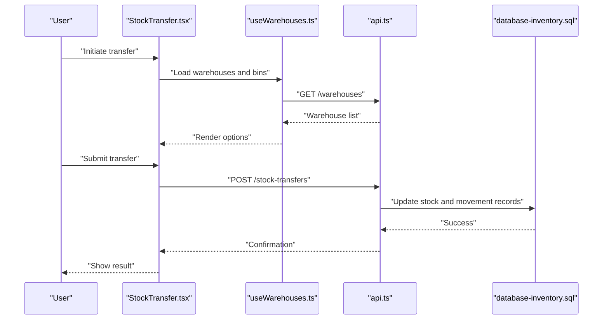

**Diagram sources**
- [StockTransfer.tsx](file://src/pages/StockTransfer.tsx)
- [useWarehouses.ts](file://src/hooks/useWarehouses.ts)
- [api.ts](file://src/api.ts)
- [database-inventory.sql](file://src/database-inventory.sql)

## Detailed Component Analysis

### Warehouse Hierarchy and Purpose Setup
- Hierarchical organization:
  - Warehouses can be grouped and filtered using the warehouse hook to build hierarchical views (site -> building -> floor -> zone).
- Purpose-driven configuration:
  - Warehouse purpose settings allow defining functional roles that influence workflow behavior (e.g., inbound-only, outbound-only, cross-dock).
- Implementation references:
  - Load and manage warehouses via the warehouse hook.
  - Configure purposes through the warehouse-purpose schema and related UI flows.

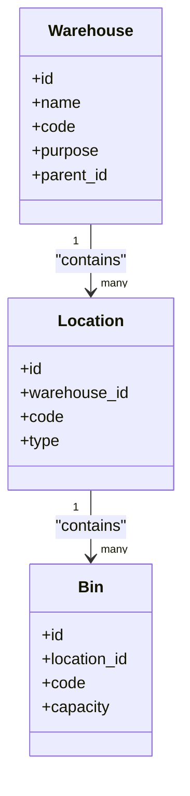

**Diagram sources**
- [useWarehouses.ts](file://src/hooks/useWarehouses.ts)
- [database-warehouse-purpose.sql](file://src/database-warehouse-purpose.sql)
- [database-inventory.sql](file://src/database-inventory.sql)

**Section sources**
- [useWarehouses.ts](file://src/hooks/useWarehouses.ts)
- [database-warehouse-purpose.sql](file://src/database-warehouse-purpose.sql)
- [database-inventory.sql](file://src/database-inventory.sql)

### Location Management and Capacity Planning
- Locations and bins:
  - Define physical locations within warehouses and assign bins with capacity constraints.
- Capacity planning:
  - Use bin capacities to plan putaway and avoid overfilling; enforce limits during goods receipt and putaway.
- Implementation references:
  - Inventory schema includes location and bin structures; capacity fields inform planning logic.

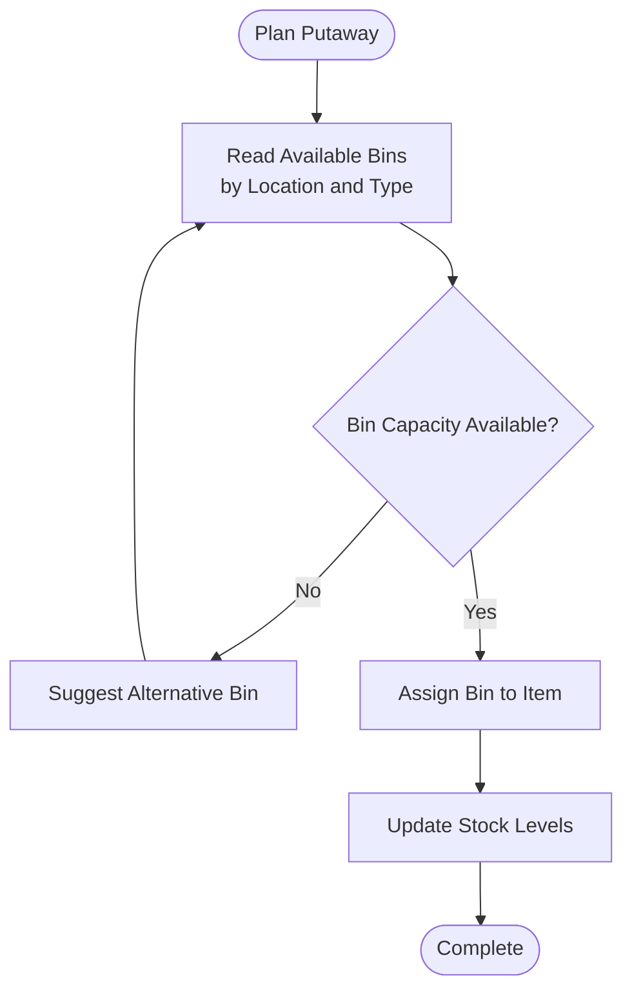

**Diagram sources**
- [database-inventory.sql](file://src/database-inventory.sql)
- [MaterialInward.tsx](file://src/pages/MaterialInward.tsx)

**Section sources**
- [database-inventory.sql](file://src/database-inventory.sql)
- [MaterialInward.tsx](file://src/pages/MaterialInward.tsx)

### Goods Receipt Processes and Putaway Strategies
- Goods receipt:
  - Receive materials against purchase orders or ad-hoc receipts; validate quantities and units.
- Putaway strategies:
  - Apply rules such as nearest available bin, zone-based placement, or FIFO-friendly stacking.
- Implementation references:
  - Material inward and receive pages capture receipts and update inventory.

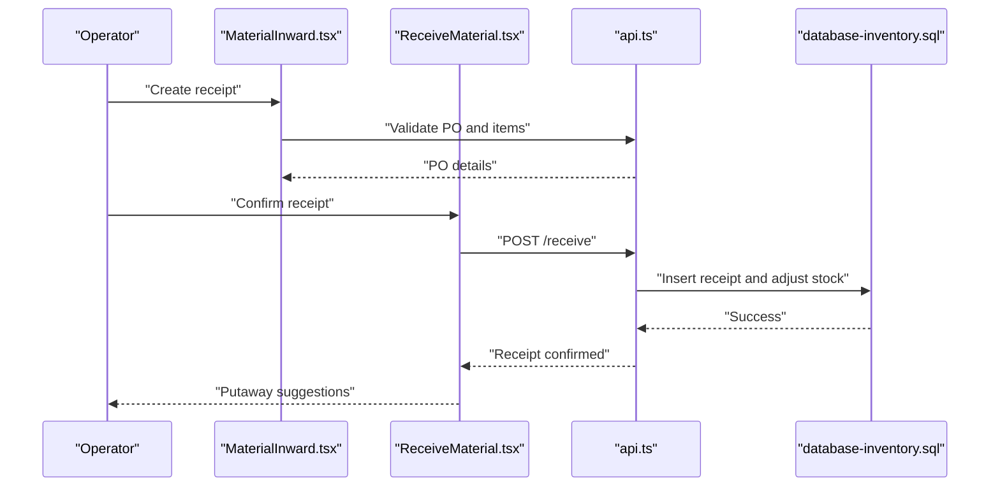

**Diagram sources**
- [MaterialInward.tsx](file://src/pages/MaterialInward.tsx)
- [ReceiveMaterial.tsx](file://src/pages/ReceiveMaterial.tsx)
- [api.ts](file://src/api.ts)
- [database-inventory.sql](file://src/database-inventory.sql)

**Section sources**
- [MaterialInward.tsx](file://src/pages/MaterialInward.tsx)
- [ReceiveMaterial.tsx](file://src/pages/ReceiveMaterial.tsx)
- [api.ts](file://src/api.ts)
- [database-inventory.sql](file://src/database-inventory.sql)

### Picking Operations
- Picking workflows:
  - Generate pick lists based on demand; confirm picks and deduct stock accordingly.
- Zone-based picking:
  - Organize pick routes by zones to reduce travel time and improve throughput.
- Implementation references:
  - Material pages and hooks provide item availability and stock balances used in picking.

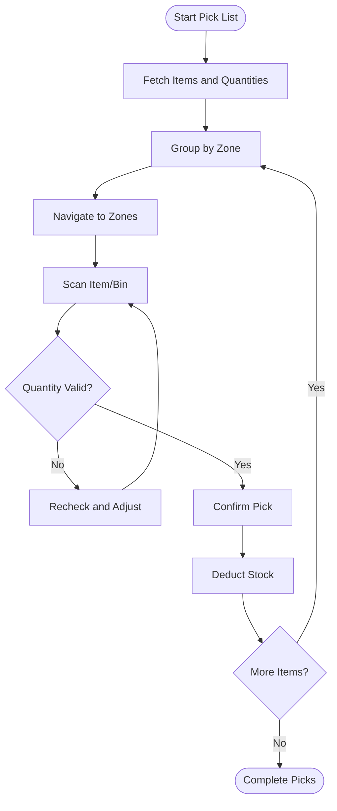

**Diagram sources**
- [useMaterials.ts](file://src/hooks/useMaterials.ts)
- [useMaterialsPageData.tsx](file://src/hooks/useMaterialsPageData.tsx)
- [database-materials.sql](file://src/database-materials.sql)

**Section sources**
- [useMaterials.ts](file://src/hooks/useMaterials.ts)
- [useMaterialsPageData.tsx](file://src/hooks/useMaterialsPageData.tsx)
- [database-materials.sql](file://src/database-materials.sql)

### Warehouse Transfer Workflows, Inter-Warehouse Movements, and Consolidation
- Transfers:
  - Initiate and execute stock transfers between locations and warehouses; track movement status.
- Inter-warehouse movements:
  - Move stock across warehouses with proper documentation and audit trails.
- Consolidation:
  - Aggregate deliveries or materials to optimize loading and reduce trips.
- Implementation references:
  - Transfer page orchestrates moves; consolidation pages group items by date or material.

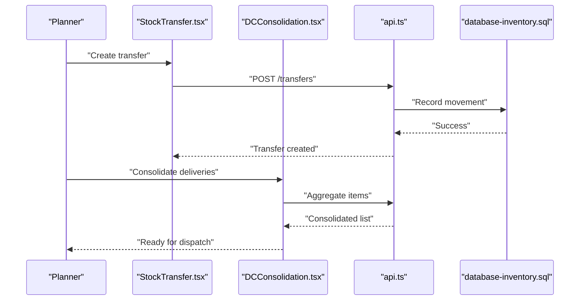

**Diagram sources**
- [StockTransfer.tsx](file://src/pages/StockTransfer.tsx)
- [DCConsolidation.tsx](file://src/pages/DCConsolidation.tsx)
- [DateWiseConsolidation.tsx](file://src/pages/DateWiseConsolidation.tsx)
- [MaterialWiseConsolidation.tsx](file://src/pages/MaterialWiseConsolidation.tsx)
- [api.ts](file://src/api.ts)
- [database-inventory.sql](file://src/database-inventory.sql)

**Section sources**
- [StockTransfer.tsx](file://src/pages/StockTransfer.tsx)
- [DCConsolidation.tsx](file://src/pages/DCConsolidation.tsx)
- [DateWiseConsolidation.tsx](file://src/pages/DateWiseConsolidation.tsx)
- [MaterialWiseConsolidation.tsx](file://src/pages/MaterialWiseConsolidation.tsx)
- [api.ts](file://src/api.ts)
- [database-inventory.sql](file://src/database-inventory.sql)

### Implementation Examples: Settings, Bin Management, and Zone-Based Organization
- Warehouse-specific settings:
  - Configure purposes and behaviors per warehouse to tailor workflows.
- Bin management:
  - Create and maintain bins with codes, types, and capacities; link to locations.
- Zone-based organization:
  - Group bins into zones to streamline putaway and picking routes.
- Implementation references:
  - Warehouse purpose schema and inventory schema define structure; UI pages use these models.

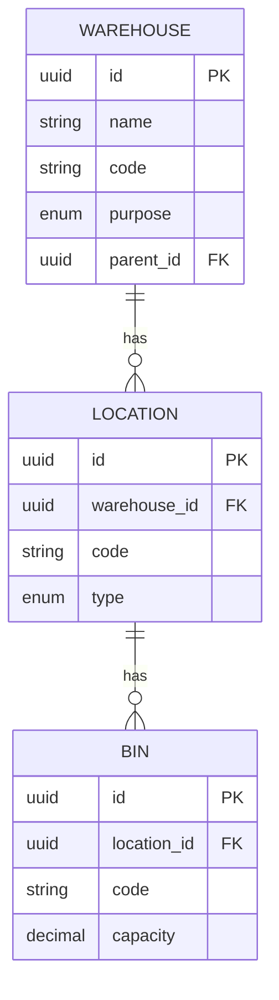

**Diagram sources**
- [database-warehouse-purpose.sql](file://src/database-warehouse-purpose.sql)
- [database-inventory.sql](file://src/database-inventory.sql)

**Section sources**
- [database-warehouse-purpose.sql](file://src/database-warehouse-purpose.sql)
- [database-inventory.sql](file://src/database-inventory.sql)

### Integration with Barcode Scanning, RFID Systems, and Automation Equipment
- Barcode scanning:
  - Use handheld scanners to scan item and bin barcodes during receipt, putaway, picking, and transfers.
- RFID integration:
  - Enable automatic detection of tagged items at dock doors or conveyors to trigger events.
- Automation equipment:
  - Integrate with conveyors, sorters, and AS/RS via APIs to automate movement and counting.
- Implementation guidance:
  - Ensure UI pages accept scanned inputs and pass them to API endpoints; backend validates and updates inventory.

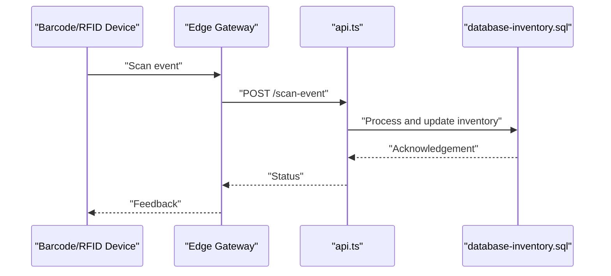

[No sources needed since this diagram shows conceptual workflow, not actual code structure]

### Performance Metrics, Utilization Reports, and Space Optimization
- Metrics:
  - Track turnover rates, fill ratios, pick accuracy, and receipt-to-shelf times.
- Utilization reports:
  - Analyze bin and location utilization to identify underused or overloaded areas.
- Space optimization:
  - Rebalance stock based on velocity; consolidate slow-moving items; adjust bin sizes.
- Implementation references:
  - Audit logs and stock adjustment pages support measurement and correction.

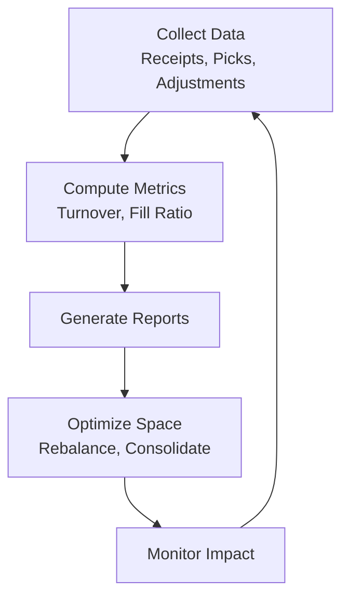

**Diagram sources**
- [useAuditLog.ts](file://src/hooks/useAuditLog.ts)
- [StockAdjustment.tsx](file://src/pages/StockAdjustment.tsx)

**Section sources**
- [useAuditLog.ts](file://src/hooks/useAuditLog.ts)
- [StockAdjustment.tsx](file://src/pages/StockAdjustment.tsx)

### Security Controls, Access Permissions, and Audit Requirements
- Access permissions:
  - Restrict warehouse operations based on roles and responsibilities.
- Audit requirements:
  - Maintain immutable logs for all inventory changes and movements.
- Implementation references:
  - Audit log hook and components provide visibility into changes; ensure RLS policies protect sensitive data.

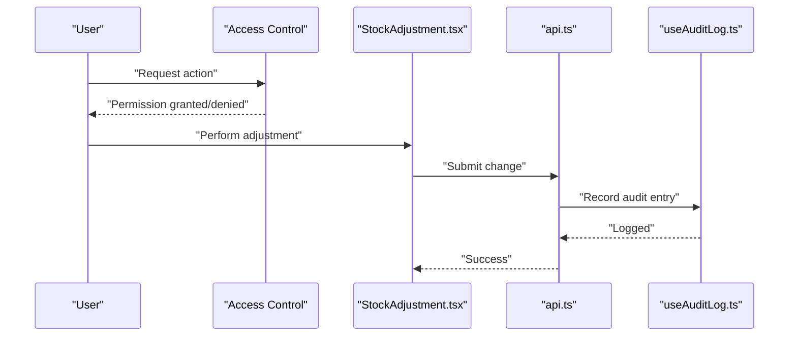

**Diagram sources**
- [StockAdjustment.tsx](file://src/pages/StockAdjustment.tsx)
- [api.ts](file://src/api.ts)
- [useAuditLog.ts](file://src/hooks/useAuditLog.ts)

**Section sources**
- [StockAdjustment.tsx](file://src/pages/StockAdjustment.tsx)
- [api.ts](file://src/api.ts)
- [useAuditLog.ts](file://src/hooks/useAuditLog.ts)

## Dependency Analysis
Warehouse operations depend on cohesive interactions between UI pages, hooks, API layer, and database schema. The following diagram highlights key dependencies:

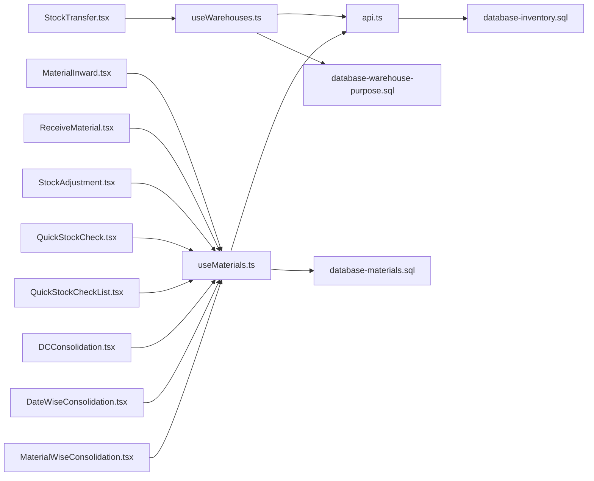

**Diagram sources**
- [StockTransfer.tsx](file://src/pages/StockTransfer.tsx)
- [MaterialInward.tsx](file://src/pages/MaterialInward.tsx)
- [ReceiveMaterial.tsx](file://src/pages/ReceiveMaterial.tsx)
- [StockAdjustment.tsx](file://src/pages/StockAdjustment.tsx)
- [QuickStockCheck.tsx](file://src/pages/QuickStockCheck.tsx)
- [QuickStockCheckList.tsx](file://src/pages/QuickStockCheckList.tsx)
- [DCConsolidation.tsx](file://src/pages/DCConsolidation.tsx)
- [DateWiseConsolidation.tsx](file://src/pages/DateWiseConsolidation.tsx)
- [MaterialWiseConsolidation.tsx](file://src/pages/MaterialWiseConsolidation.tsx)
- [useWarehouses.ts](file://src/hooks/useWarehouses.ts)
- [useMaterials.ts](file://src/hooks/useMaterials.ts)
- [api.ts](file://src/api.ts)
- [database-inventory.sql](file://src/database-inventory.sql)
- [database-materials.sql](file://src/database-materials.sql)
- [database-warehouse-purpose.sql](file://src/database-warehouse-purpose.sql)

**Section sources**
- [StockTransfer.tsx](file://src/pages/StockTransfer.tsx)
- [MaterialInward.tsx](file://src/pages/MaterialInward.tsx)
- [ReceiveMaterial.tsx](file://src/pages/ReceiveMaterial.tsx)
- [StockAdjustment.tsx](file://src/pages/StockAdjustment.tsx)
- [QuickStockCheck.tsx](file://src/pages/QuickStockCheck.tsx)
- [QuickStockCheckList.tsx](file://src/pages/QuickStockCheckList.tsx)
- [DCConsolidation.tsx](file://src/pages/DCConsolidation.tsx)
- [DateWiseConsolidation.tsx](file://src/pages/DateWiseConsolidation.tsx)
- [MaterialWiseConsolidation.tsx](file://src/pages/MaterialWiseConsolidation.tsx)
- [useWarehouses.ts](file://src/hooks/useWarehouses.ts)
- [useMaterials.ts](file://src/hooks/useMaterials.ts)
- [api.ts](file://src/api.ts)
- [database-inventory.sql](file://src/database-inventory.sql)
- [database-materials.sql](file://src/database-materials.sql)
- [database-warehouse-purpose.sql](file://src/database-warehouse-purpose.sql)

## Performance Considerations
- Batch operations:
  - Prefer batch updates for large transfers and consolidations to reduce round-trips.
- Indexing:
  - Ensure indexes on frequently queried columns (warehouse_id, location_id, item_id) to speed up lookups.
- Caching:
  - Cache static configurations (purposes, zones) and hot item catalogs to minimize latency.
- Concurrency:
  - Implement optimistic locking or versioning to prevent race conditions during concurrent picks and receipts.

[No sources needed since this section provides general guidance]

## Troubleshooting Guide
- Common issues:
  - Missing warehouse or location references: verify IDs and hierarchy.
  - Capacity exceeded errors: review bin capacities and adjust putaway rules.
  - Permission denied: check role assignments and RLS policies.
- Debugging steps:
  - Inspect audit logs for recent changes.
  - Validate API responses and error messages.
  - Cross-check stock balances before and after operations.

**Section sources**
- [useAuditLog.ts](file://src/hooks/useAuditLog.ts)
- [StockAdjustment.tsx](file://src/pages/StockAdjustment.tsx)
- [api.ts](file://src/api.ts)

## Conclusion
The Warehouse Operations module integrates UI workflows, data hooks, API services, and database schemas to support comprehensive warehouse management. By leveraging warehouse hierarchy, location and bin management, robust receipt and putaway processes, efficient picking, flexible transfers, and consolidation tools, organizations can achieve high operational efficiency. Integrating barcode/RFID and automation enhances accuracy and throughput, while metrics and audits drive continuous improvement and compliance.

## Appendices
- Example paths for further exploration:
  - Warehouse setup and purpose configuration: [useWarehouses.ts](file://src/hooks/useWarehouses.ts), [database-warehouse-purpose.sql](file://src/database-warehouse-purpose.sql)
  - Inventory and materials modeling: [database-inventory.sql](file://src/database-inventory.sql), [database-materials.sql](file://src/database-materials.sql)
  - Goods receipt and putaway: [MaterialInward.tsx](file://src/pages/MaterialInward.tsx), [ReceiveMaterial.tsx](file://src/pages/ReceiveMaterial.tsx)
  - Transfers and consolidation: [StockTransfer.tsx](file://src/pages/StockTransfer.tsx), [DCConsolidation.tsx](file://src/pages/DCConsolidation.tsx), [DateWiseConsolidation.tsx](file://src/pages/DateWiseConsolidation.tsx), [MaterialWiseConsolidation.tsx](file://src/pages/MaterialWiseConsolidation.tsx)
  - Audits and checks: [QuickStockCheck.tsx](file://src/pages/QuickStockCheck.tsx), [QuickStockCheckList.tsx](file://src/pages/QuickStockCheckList.tsx), [useAuditLog.ts](file://src/hooks/useAuditLog.ts)