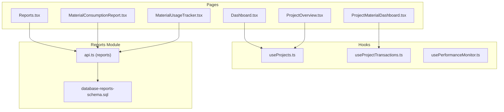
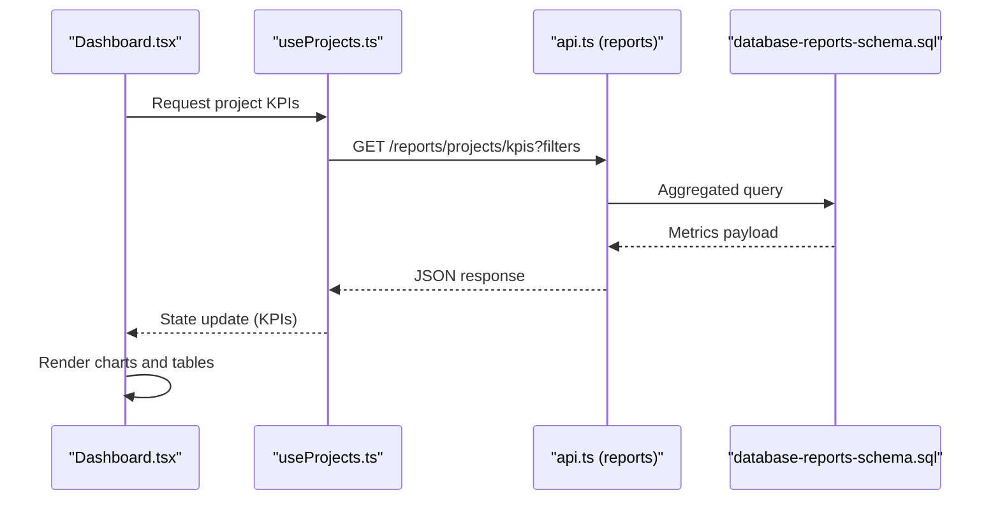
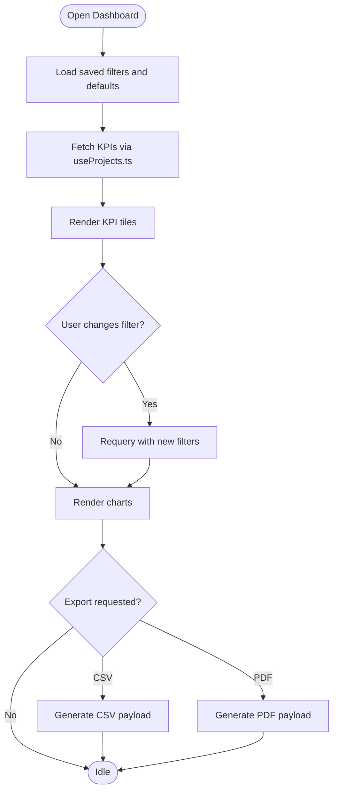
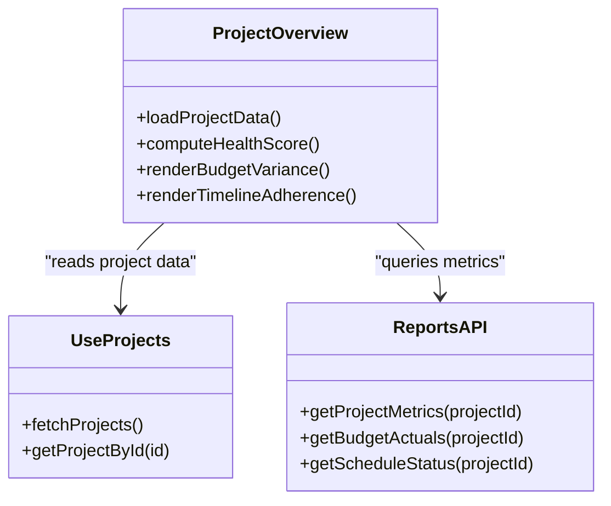
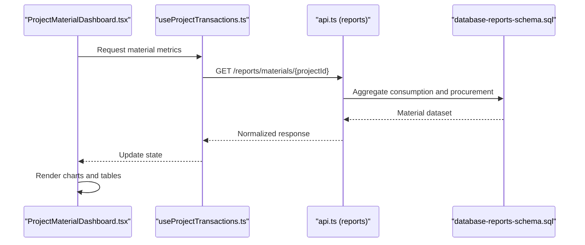
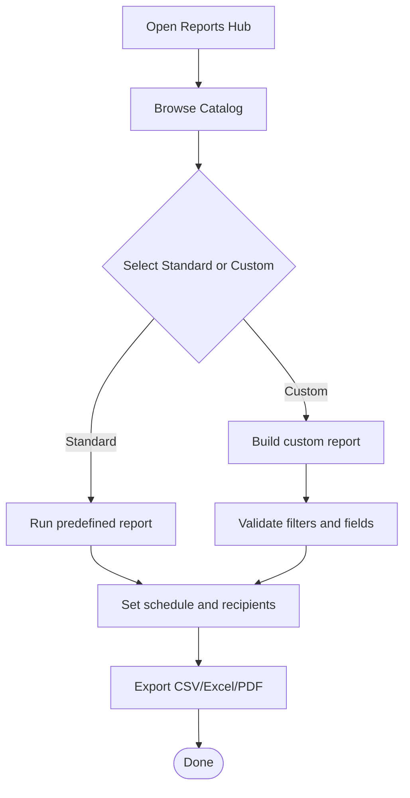
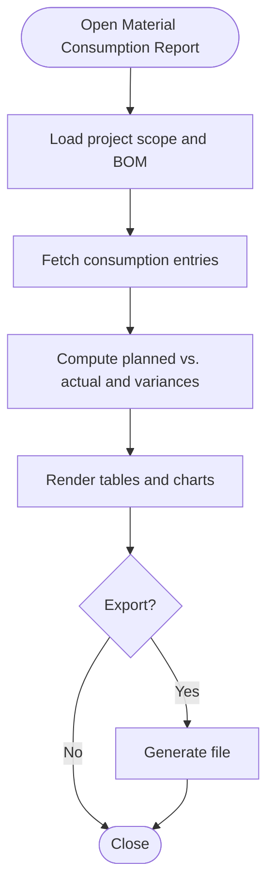
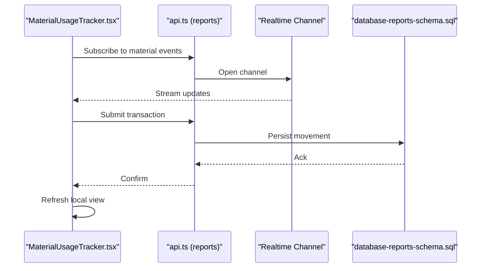
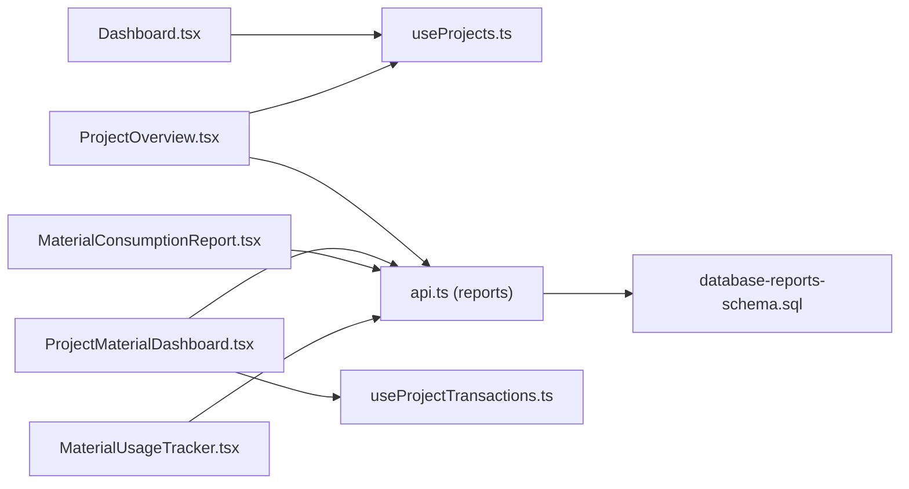

# Project Analytics & Reporting

<cite>
**Referenced Files in This Document**
- [Dashboard.tsx](file://src/pages/Dashboard.tsx)
- [ProjectOverview.tsx](file://src/pages/ProjectOverview.tsx)
- [ProjectMaterialDashboard.tsx](file://src/pages/ProjectMaterialDashboard.tsx)
- [Reports.tsx](file://src/pages/Reports.tsx)
- [MaterialConsumptionReport.tsx](file://src/pages/MaterialConsumptionReport.tsx)
- [MaterialUsageTracker.tsx](file://src/pages/MaterialUsageTracker.tsx)
- [useProjects.ts](file://src/hooks/useProjects.ts)
- [useProjectTransactions.ts](file://src/hooks/useProjectTransactions.ts)
- [usePerformanceMonitor.ts](file://src/hooks/usePerformanceMonitor.ts)
- [api.ts (reports)](file://src/reports/api.ts)
- [database-reports-schema.sql](file://src/database-reports-schema.sql)
</cite>

## Table of Contents
1. [Introduction](#introduction)
2. [Project Structure](#project-structure)
3. [Core Components](#core-components)
4. [Architecture Overview](#architecture-overview)
5. [Detailed Component Analysis](#detailed-component-analysis)
6. [Dependency Analysis](#dependency-analysis)
7. [Performance Considerations](#performance-considerations)
8. [Troubleshooting Guide](#troubleshooting-guide)
9. [Conclusion](#conclusion)
10. [Appendices](#appendices)

## Introduction
This document explains the Project Analytics and Reporting capabilities implemented in the application. It covers key performance indicators, dashboard customization, real-time monitoring, project health scoring, budget variance analysis, timeline adherence tracking, custom report creation, automated alerts, data export formats, API access for external BI tools, and visualization customization options. It also provides guidance on resource utilization analytics, productivity metrics, team performance evaluation, financial reporting integration, cost tracking, profitability analysis, predictive analytics, risk assessment tools, and decision support systems.

## Project Structure
Analytics and reporting features are primarily implemented under:
- Pages: Dashboard, Project overview, Material dashboards, Reports pages
- Hooks: Data fetching and state management for projects and transactions
- Reports module: API layer and schema definitions for reports
- Database schema: Report-related tables and indexes

**Diagram sources**
- [Dashboard.tsx](file://src/pages/Dashboard.tsx)
- [ProjectOverview.tsx](file://src/pages/ProjectOverview.tsx)
- [ProjectMaterialDashboard.tsx](file://src/pages/ProjectMaterialDashboard.tsx)
- [Reports.tsx](file://src/pages/Reports.tsx)
- [MaterialConsumptionReport.tsx](file://src/pages/MaterialConsumptionReport.tsx)
- [MaterialUsageTracker.tsx](file://src/pages/MaterialUsageTracker.tsx)
- [useProjects.ts](file://src/hooks/useProjects.ts)
- [useProjectTransactions.ts](file://src/hooks/useProjectTransactions.ts)
- [usePerformanceMonitor.ts](file://src/hooks/usePerformanceMonitor.ts)
- [api.ts (reports)](file://src/reports/api.ts)
- [database-reports-schema.sql](file://src/database-reports-schema.sql)

**Section sources**
- [Dashboard.tsx](file://src/pages/Dashboard.tsx)
- [ProjectOverview.tsx](file://src/pages/ProjectOverview.tsx)
- [ProjectMaterialDashboard.tsx](file://src/pages/ProjectMaterialDashboard.tsx)
- [Reports.tsx](file://src/pages/Reports.tsx)
- [MaterialConsumptionReport.tsx](file://src/pages/MaterialConsumptionReport.tsx)
- [MaterialUsageTracker.tsx](file://src/pages/MaterialUsageTracker.tsx)
- [useProjects.ts](file://src/hooks/useProjects.ts)
- [useProjectTransactions.ts](file://src/hooks/useProjectTransactions.ts)
- [usePerformanceMonitor.ts](file://src/hooks/usePerformanceMonitor.ts)
- [api.ts (reports)](file://src/reports/api.ts)
- [database-reports-schema.sql](file://src/database-reports-schema.sql)

## Core Components
- Dashboard: Central hub for KPIs, charts, and quick actions; supports filtering by organization, date range, and project status.
- Project Overview: Consolidates schedule, budget, risks, and milestones with drill-down to tasks and materials.
- Project Material Dashboard: Tracks material procurement, consumption, and waste against estimates.
- Reports Hub: Entry point for standard and custom reports, scheduling, and exports.
- Material Consumption Report: Detailed view of usage vs. planned quantities with variance analysis.
- Material Usage Tracker: Real-time logging and reconciliation of material movements.

Key implementation patterns:
- Data fetching via hooks that encapsulate API calls and caching.
- Modular report components that compose charts and tables.
- Centralized report schema and API endpoints for consistent data models.

**Section sources**
- [Dashboard.tsx](file://src/pages/Dashboard.tsx)
- [ProjectOverview.tsx](file://src/pages/ProjectOverview.tsx)
- [ProjectMaterialDashboard.tsx](file://src/pages/ProjectMaterialDashboard.tsx)
- [Reports.tsx](file://src/pages/Reports.tsx)
- [MaterialConsumptionReport.tsx](file://src/pages/MaterialConsumptionReport.tsx)
- [MaterialUsageTracker.tsx](file://src/pages/MaterialUsageTracker.tsx)
- [useProjects.ts](file://src/hooks/useProjects.ts)
- [useProjectTransactions.ts](file://src/hooks/useProjectTransactions.ts)
- [api.ts (reports)](file://src/reports/api.ts)
- [database-reports-schema.sql](file://src/database-reports-schema.sql)

## Architecture Overview
The analytics stack follows a layered architecture:
- Presentation Layer: React pages and reusable chart/table components.
- Data Access Layer: Hooks that call the reports API and manage local state.
- API Layer: Endpoints serving aggregated metrics, time series, and export payloads.
- Storage Layer: Report schemas and indexes optimized for analytical queries.

**Diagram sources**
- [Dashboard.tsx](file://src/pages/Dashboard.tsx)
- [useProjects.ts](file://src/hooks/useProjects.ts)
- [api.ts (reports)](file://src/reports/api.ts)
- [database-reports-schema.sql](file://src/database-reports-schema.sql)

## Detailed Component Analysis

### Dashboard
- Purpose: Provide at-a-glance insights across projects, budgets, schedules, and resources.
- Key Features:
  - KPI tiles (revenue, margin, schedule variance, risk index).
  - Time-series charts for progress and burn rate.
  - Filters for org, project, date range, and status.
  - Export to CSV/PDF from the page toolbar.
- Customization:
  - Widget layout persistence per user.
  - Theme and color scheme selection.
  - Drill-through to detailed pages.

**Diagram sources**
- [Dashboard.tsx](file://src/pages/Dashboard.tsx)
- [useProjects.ts](file://src/hooks/useProjects.ts)

**Section sources**
- [Dashboard.tsx](file://src/pages/Dashboard.tsx)
- [useProjects.ts](file://src/hooks/useProjects.ts)

### Project Overview
- Purpose: Consolidate project health, budget vs. actuals, timeline adherence, and risks.
- Health Scoring:
  - Composite score based on schedule variance, budget variance, quality issues, and risk exposure.
  - Weighted factors configurable per organization.
- Budget Variance:
  - Planned vs. committed vs. actual costs with trend lines.
- Timeline Adherence:
  - Milestone completion rates and critical path delays.

**Diagram sources**
- [ProjectOverview.tsx](file://src/pages/ProjectOverview.tsx)
- [useProjects.ts](file://src/hooks/useProjects.ts)
- [api.ts (reports)](file://src/reports/api.ts)

**Section sources**
- [ProjectOverview.tsx](file://src/pages/ProjectOverview.tsx)
- [useProjects.ts](file://src/hooks/useProjects.ts)
- [api.ts (reports)](file://src/reports/api.ts)

### Project Material Dashboard
- Purpose: Track material procurement, consumption, and waste against estimates.
- Features:
  - Procurement pipeline (PO, delivery, receipt).
  - Consumption vs. BOM with variance breakdown.
  - Waste and rework tracking.
- Integration:
  - Links to purchase orders, inward/outward logs, and site reports.

**Diagram sources**
- [ProjectMaterialDashboard.tsx](file://src/pages/ProjectMaterialDashboard.tsx)
- [useProjectTransactions.ts](file://src/hooks/useProjectTransactions.ts)
- [api.ts (reports)](file://src/reports/api.ts)
- [database-reports-schema.sql](file://src/database-reports-schema.sql)

**Section sources**
- [ProjectMaterialDashboard.tsx](file://src/pages/ProjectMaterialDashboard.tsx)
- [useProjectTransactions.ts](file://src/hooks/useProjectTransactions.ts)
- [api.ts (reports)](file://src/reports/api.ts)
- [database-reports-schema.sql](file://src/database-reports-schema.sql)

### Reports Hub
- Purpose: Central entry point for standard and custom reports.
- Capabilities:
  - Report catalog with metadata and tags.
  - Scheduling and subscription for recurring runs.
  - Export formats: CSV, Excel, PDF.
  - Shareable links and permissions.

**Diagram sources**
- [Reports.tsx](file://src/pages/Reports.tsx)
- [api.ts (reports)](file://src/reports/api.ts)

**Section sources**
- [Reports.tsx](file://src/pages/Reports.tsx)
- [api.ts (reports)](file://src/reports/api.ts)

### Material Consumption Report
- Purpose: Analyze consumption vs. planned quantities with variance explanations.
- Features:
  - Line-level variance with root cause tags.
  - Trend over time and by work package.
  - Export to CSV/Excel for deeper analysis.

**Diagram sources**
- [MaterialConsumptionReport.tsx](file://src/pages/MaterialConsumptionReport.tsx)
- [api.ts (reports)](file://src/reports/api.ts)

**Section sources**
- [MaterialConsumptionReport.tsx](file://src/pages/MaterialConsumptionReport.tsx)
- [api.ts (reports)](file://src/reports/api.ts)

### Material Usage Tracker
- Purpose: Real-time logging and reconciliation of material movements.
- Features:
  - Live updates for inbound/outbound transactions.
  - Alerts for anomalies (e.g., negative stock).
  - Audit trail and approvals workflow integration.

**Diagram sources**
- [MaterialUsageTracker.tsx](file://src/pages/MaterialUsageTracker.tsx)
- [api.ts (reports)](file://src/reports/api.ts)
- [database-reports-schema.sql](file://src/database-reports-schema.sql)

**Section sources**
- [MaterialUsageTracker.tsx](file://src/pages/MaterialUsageTracker.tsx)
- [api.ts (reports)](file://src/reports/api.ts)
- [database-reports-schema.sql](file://src/database-reports-schema.sql)

## Dependency Analysis
- Page-to-hook dependencies:
  - Dashboard depends on useProjects for KPIs and lists.
  - Project Overview depends on useProjects and reports API for metrics.
  - Material dashboards depend on useProjectTransactions and reports API.
- Hook-to-API dependencies:
  - Hooks encapsulate request lifecycle and cache invalidation.
  - Reports API aggregates data using the report schema.
- Schema dependencies:
  - Report tables and indexes optimize analytical queries.

**Diagram sources**
- [Dashboard.tsx](file://src/pages/Dashboard.tsx)
- [ProjectOverview.tsx](file://src/pages/ProjectOverview.tsx)
- [ProjectMaterialDashboard.tsx](file://src/pages/ProjectMaterialDashboard.tsx)
- [MaterialConsumptionReport.tsx](file://src/pages/MaterialConsumptionReport.tsx)
- [MaterialUsageTracker.tsx](file://src/pages/MaterialUsageTracker.tsx)
- [useProjects.ts](file://src/hooks/useProjects.ts)
- [useProjectTransactions.ts](file://src/hooks/useProjectTransactions.ts)
- [api.ts (reports)](file://src/reports/api.ts)
- [database-reports-schema.sql](file://src/database-reports-schema.sql)

**Section sources**
- [Dashboard.tsx](file://src/pages/Dashboard.tsx)
- [ProjectOverview.tsx](file://src/pages/ProjectOverview.tsx)
- [ProjectMaterialDashboard.tsx](file://src/pages/ProjectMaterialDashboard.tsx)
- [MaterialConsumptionReport.tsx](file://src/pages/MaterialConsumptionReport.tsx)
- [MaterialUsageTracker.tsx](file://src/pages/MaterialUsageTracker.tsx)
- [useProjects.ts](file://src/hooks/useProjects.ts)
- [useProjectTransactions.ts](file://src/hooks/useProjectTransactions.ts)
- [api.ts (reports)](file://src/reports/api.ts)
- [database-reports-schema.sql](file://src/database-reports-schema.sql)

## Performance Considerations
- Use pagination and server-side aggregation for large datasets.
- Cache frequently accessed KPIs and invalidate on relevant mutations.
- Prefer incremental refresh for live trackers and limit payload size.
- Index report tables on common filter columns (date ranges, project IDs).
- Debounce heavy computations and offload to background jobs when needed.

[No sources needed since this section provides general guidance]

## Troubleshooting Guide
- Real-time updates not appearing:
  - Verify channel subscriptions and network connectivity.
  - Check event emission and permission policies.
- Export failures:
  - Validate data completeness and formatting constraints.
  - Ensure required fields exist and are non-null.
- Slow report rendering:
  - Inspect query plans and add missing indexes.
  - Reduce chart series or enable virtualization for large tables.
- Incorrect health scores:
  - Review weights and thresholds configuration.
  - Validate input data consistency across modules.

**Section sources**
- [usePerformanceMonitor.ts](file://src/hooks/usePerformanceMonitor.ts)
- [api.ts (reports)](file://src/reports/api.ts)
- [database-reports-schema.sql](file://src/database-reports-schema.sql)

## Conclusion
The analytics and reporting subsystem provides comprehensive visibility into project performance, finances, and resources. With modular dashboards, robust APIs, and flexible export options, teams can monitor KPIs, analyze variances, and make informed decisions. Extensibility points allow adding predictive analytics, advanced risk assessments, and integrations with external BI tools.

[No sources needed since this section summarizes without analyzing specific files]

## Appendices

### Key Performance Indicators
- Schedule adherence: milestone completion vs. plan.
- Budget variance: planned vs. committed vs. actual costs.
- Resource utilization: hours logged vs. capacity.
- Quality metrics: defect density and rework rates.
- Risk index: weighted severity and probability.

[No sources needed since this section provides general guidance]

### Dashboard Customization
- Widget layout persistence per user.
- Theme and color schemes.
- Filter presets and saved views.
- Drill-through navigation to detail pages.

[No sources needed since this section provides general guidance]

### Real-Time Monitoring
- Live updates for material movements and task statuses.
- Event-driven notifications for threshold breaches.
- Presence awareness for collaborative editing.

**Section sources**
- [MaterialUsageTracker.tsx](file://src/pages/MaterialUsageTracker.tsx)
- [usePerformanceMonitor.ts](file://src/hooks/usePerformanceMonitor.ts)

### Project Health Scoring
- Composite formula combining schedule, budget, quality, and risk.
- Configurable weights per organization.
- Historical trend analysis and alerts.

**Section sources**
- [ProjectOverview.tsx](file://src/pages/ProjectOverview.tsx)

### Budget Variance Analysis
- Planned vs. committed vs. actual cost breakdown.
- Root cause tagging and roll-up by category.
- Forecasting based on current burn rate.

**Section sources**
- [ProjectOverview.tsx](file://src/pages/ProjectOverview.tsx)
- [api.ts (reports)](file://src/reports/api.ts)

### Timeline Adherence Tracking
- Milestone progress and critical path delays.
- Task completion rates and bottlenecks.
- What-if scenario simulation for rescheduling.

**Section sources**
- [ProjectOverview.tsx](file://src/pages/ProjectOverview.tsx)

### Custom Reports
- Drag-and-drop field selection and filters.
- Scheduled runs and email distribution.
- Versioning and sharing with role-based access.

**Section sources**
- [Reports.tsx](file://src/pages/Reports.tsx)
- [api.ts (reports)](file://src/reports/api.ts)

### Automated Alerts
- Threshold-based triggers for budget, schedule, and quality.
- Notification channels: in-app, email, and webhooks.
- Escalation rules and acknowledgment workflows.

**Section sources**
- [api.ts (reports)](file://src/reports/api.ts)

### Export Formats and External BI Integration
- Supported formats: CSV, Excel, PDF.
- API endpoints for programmatic access and scheduled exports.
- Webhook delivery for downstream systems.

**Section sources**
- [Reports.tsx](file://src/pages/Reports.tsx)
- [api.ts (reports)](file://src/reports/api.ts)

### Data Visualization Customization
- Chart types: line, bar, area, pie, scatter.
- Color palettes and accessibility themes.
- Interactive tooltips, legends, and cross-filtering.

**Section sources**
- [Dashboard.tsx](file://src/pages/Dashboard.tsx)
- [ProjectMaterialDashboard.tsx](file://src/pages/ProjectMaterialDashboard.tsx)

### Resource Utilization Analytics
- Hours logged vs. planned capacity.
- Skill-based allocation and utilization heatmaps.
- Overtime and idle time analysis.

**Section sources**
- [useProjects.ts](file://src/hooks/useProjects.ts)
- [api.ts (reports)](file://src/reports/api.ts)

### Productivity Metrics and Team Performance
- Throughput per team and individual contributor.
- Cycle time and lead time distributions.
- Peer review and approval turnaround times.

**Section sources**
- [api.ts (reports)](file://src/reports/api.ts)

### Financial Reporting Integration
- Cost centers and GL mapping.
- Profitability by project and work package.
- Revenue recognition and billing alignment.

**Section sources**
- [api.ts (reports)](file://src/reports/api.ts)
- [database-reports-schema.sql](file://src/database-reports-schema.sql)

### Predictive Analytics and Risk Assessment
- Forecasting based on historical trends.
- Monte Carlo simulations for schedule and cost.
- Risk registers with mitigation tracking.

**Section sources**
- [api.ts (reports)](file://src/reports/api.ts)

### Decision Support Systems
- Scenario comparison and impact analysis.
- Recommendation engines for resource reallocation.
- Executive summaries and board-ready visuals.

**Section sources**
- [Dashboard.tsx](file://src/pages/Dashboard.tsx)
- [ProjectOverview.tsx](file://src/pages/ProjectOverview.tsx)