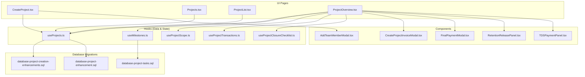
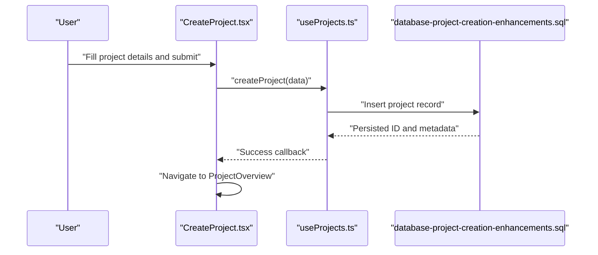
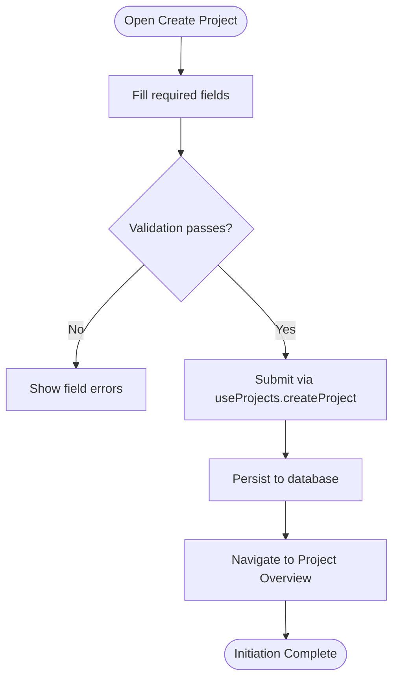
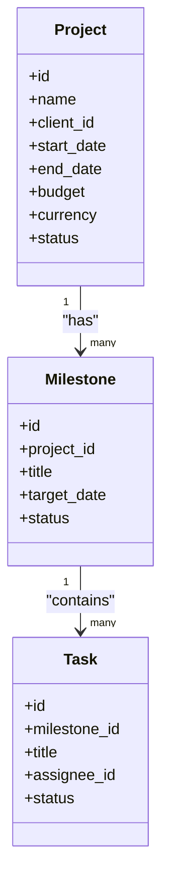
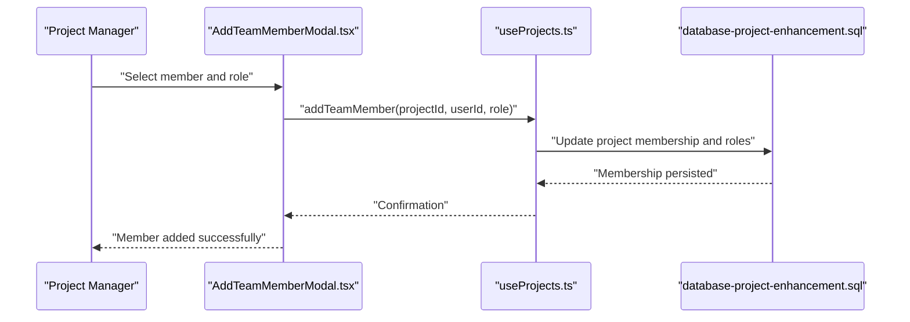
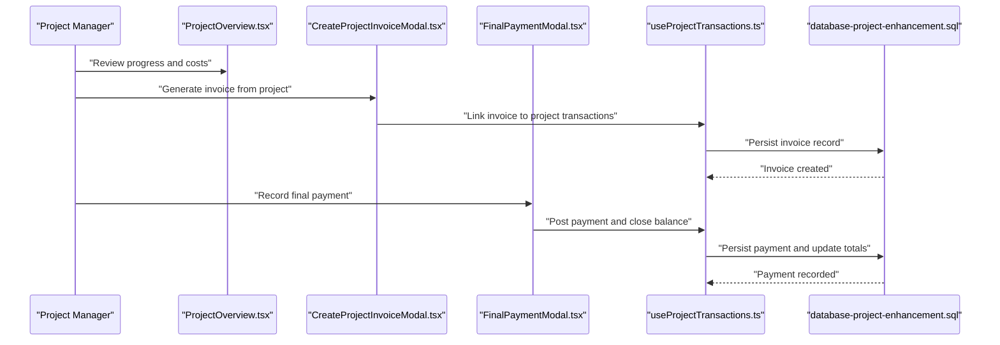
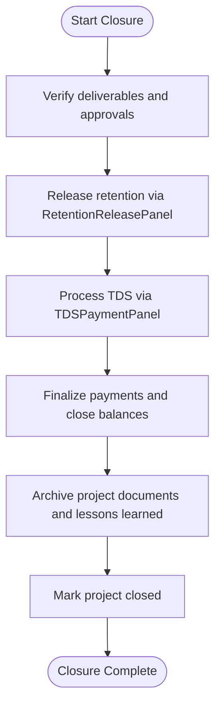
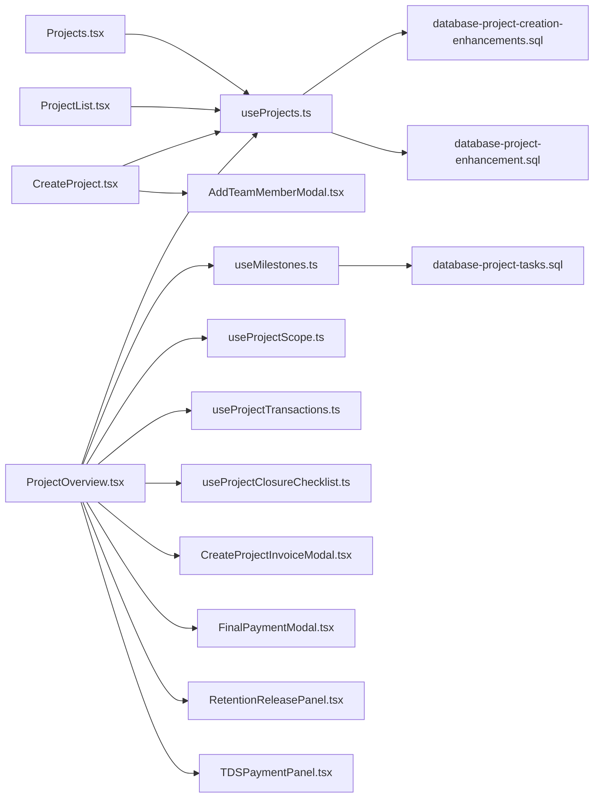

# Project Lifecycle Management

<cite>
**Referenced Files in This Document**
- [CreateProject.tsx](file://src/pages/CreateProject.tsx)
- [Projects.tsx](file://src/pages/Projects.tsx)
- [ProjectList.tsx](file://src/pages/ProjectList.tsx)
- [ProjectOverview.tsx](file://src/pages/ProjectOverview.tsx)
- [useProjects.ts](file://src/hooks/useProjects.ts)
- [useMilestones.ts](file://src/hooks/useMilestones.ts)
- [useProjectClosureChecklist.ts](file://src/hooks/useProjectClosureChecklist.ts)
- [useProjectScope.ts](file://src/hooks/useProjectScope.ts)
- [useProjectTransactions.ts](file://src/hooks/useProjectTransactions.ts)
- [database-project-creation-enhancements.sql](file://src/database-project-creation-enhancements.sql)
- [database-project-enhancement.sql](file://src/database-project-enhancement.sql)
- [database-project-tasks.sql](file://src/database-project-tasks.sql)
- [AddTeamMemberModal.tsx](file://src/components/AddTeamMemberModal.tsx)
- [CreateProjectInvoiceModal.tsx](file://src/components/CreateProjectInvoiceModal.tsx)
- [FinalPaymentModal.tsx](file://src/components/FinalPaymentModal.tsx)
- [retentionReleasePanel.tsx](file://src/components/RetentionReleasePanel.tsx)
- [tdsPaymentPanel.tsx](file://src/components/TDSPaymentPanel.tsx)
- [project-billing-help.md](file://public/help/project-billing/help.md)
</cite>

## Table of Contents
1. [Introduction](#introduction)
2. [Project Structure](#project-structure)
3. [Core Components](#core-components)
4. [Architecture Overview](#architecture-overview)
5. [Detailed Component Analysis](#detailed-component-analysis)
6. [Dependency Analysis](#dependency-analysis)
7. [Performance Considerations](#performance-considerations)
8. [Troubleshooting Guide](#troubleshooting-guide)
9. [Conclusion](#conclusion)
10. [Appendices](#appendices)

## Introduction
This document explains the end-to-end Project Lifecycle Management system implemented in the application. It covers initiation, planning, execution, monitoring, and closure phases with practical guidance on project creation workflows, template-based setup, configuration options, status management, milestone tracking, progress monitoring, team setup, roles and permissions, communication channels, templates and standard operating procedures, best practices by project type, closure processes, deliverable documentation, lessons learned capture, and integration with financial systems for budget tracking and resource allocation.

## Project Structure
The project lifecycle features are implemented across pages, hooks, components, and database migrations:
- Pages provide user-facing screens for creating projects, listing them, and viewing overviews.
- Hooks encapsulate data fetching and state logic for projects, milestones, scope, transactions, and closure checklists.
- Components implement UI flows for team management, billing, payments, retention, and TDS.
- Database migrations define schema enhancements for project creation, tasks, and related entities.

**Diagram sources**
- [CreateProject.tsx](file://src/pages/CreateProject.tsx)
- [Projects.tsx](file://src/pages/Projects.tsx)
- [ProjectList.tsx](file://src/pages/ProjectList.tsx)
- [ProjectOverview.tsx](file://src/pages/ProjectOverview.tsx)
- [useProjects.ts](file://src/hooks/useProjects.ts)
- [useMilestones.ts](file://src/hooks/useMilestones.ts)
- [useProjectScope.ts](file://src/hooks/useProjectScope.ts)
- [useProjectTransactions.ts](file://src/hooks/useProjectTransactions.ts)
- [useProjectClosureChecklist.ts](file://src/hooks/useProjectClosureChecklist.ts)
- [AddTeamMemberModal.tsx](file://src/components/AddTeamMemberModal.tsx)
- [CreateProjectInvoiceModal.tsx](file://src/components/CreateProjectInvoiceModal.tsx)
- [FinalPaymentModal.tsx](file://src/components/FinalPaymentModal.tsx)
- [RetentionReleasePanel.tsx](file://src/components/RetentionReleasePanel.tsx)
- [TDSPaymentPanel.tsx](file://src/components/TDSPaymentPanel.tsx)
- [database-project-creation-enhancements.sql](file://src/database-project-creation-enhancements.sql)
- [database-project-enhancement.sql](file://src/database-project-enhancement.sql)
- [database-project-tasks.sql](file://src/database-project-tasks.sql)

**Section sources**
- [CreateProject.tsx](file://src/pages/CreateProject.tsx)
- [Projects.tsx](file://src/pages/Projects.tsx)
- [ProjectList.tsx](file://src/pages/ProjectList.tsx)
- [ProjectOverview.tsx](file://src/pages/ProjectOverview.tsx)
- [useProjects.ts](file://src/hooks/useProjects.ts)
- [useMilestones.ts](file://src/hooks/useMilestones.ts)
- [useProjectScope.ts](file://src/hooks/useProjectScope.ts)
- [useProjectTransactions.ts](file://src/hooks/useProjectTransactions.ts)
- [useProjectClosureChecklist.ts](file://src/hooks/useProjectClosureChecklist.ts)
- [database-project-creation-enhancements.sql](file://src/database-project-creation-enhancements.sql)
- [database-project-enhancement.sql](file://src/database-project-enhancement.sql)
- [database-project-tasks.sql](file://src/database-project-tasks.sql)

## Core Components
- Project Creation Workflow: The Create Project page orchestrates form inputs, validation, and submission to create a new project record. It integrates with project hooks for persistence and subsequent navigation to the project overview.
- Project Listing and Navigation: Projects and Project List pages provide entry points to manage multiple projects, filter/search, and navigate into detailed views.
- Project Overview Dashboard: The overview aggregates key metrics, milestones, scope details, transactions, and actions such as invoicing, payments, retention release, and TDS handling.
- Team Management: Add Team Member modal supports inviting or adding users to a project with role assignment and permission scoping.
- Financial Integration: Invoicing, final payment, retention release, and TDS panels connect project activities to financial records and reporting.

**Section sources**
- [CreateProject.tsx](file://src/pages/CreateProject.tsx)
- [Projects.tsx](file://src/pages/Projects.tsx)
- [ProjectList.tsx](file://src/pages/ProjectList.tsx)
- [ProjectOverview.tsx](file://src/pages/ProjectOverview.tsx)
- [AddTeamMemberModal.tsx](file://src/components/AddTeamMemberModal.tsx)
- [CreateProjectInvoiceModal.tsx](file://src/components/CreateProjectInvoiceModal.tsx)
- [FinalPaymentModal.tsx](file://src/components/FinalPaymentModal.tsx)
- [RetentionReleasePanel.tsx](file://src/components/RetentionReleasePanel.tsx)
- [TDSPaymentPanel.tsx](file://src/components/TDSPaymentPanel.tsx)

## Architecture Overview
The lifecycle is driven by React pages that consume typed hooks for data operations. Data persistence is backed by database migrations defining project-related tables and relationships.

**Diagram sources**
- [CreateProject.tsx](file://src/pages/CreateProject.tsx)
- [useProjects.ts](file://src/hooks/useProjects.ts)
- [database-project-creation-enhancements.sql](file://src/database-project-creation-enhancements.sql)

## Detailed Component Analysis

### Project Initiation and Creation
- Purpose: Capture project definition, assign initial settings, and persist the project.
- Key Inputs: Project name, description, client association, start/end dates, budget, currency, and optional template selection.
- Validation: Required fields enforced before submission; date ranges validated; budget constraints checked.
- Post-Creation: Redirects to Project Overview for planning and execution.

**Diagram sources**
- [CreateProject.tsx](file://src/pages/CreateProject.tsx)
- [useProjects.ts](file://src/hooks/useProjects.ts)

**Section sources**
- [CreateProject.tsx](file://src/pages/CreateProject.tsx)
- [useProjects.ts](file://src/hooks/useProjects.ts)
- [database-project-creation-enhancements.sql](file://src/database-project-creation-enhancements.sql)

### Planning Phase: Scope, Milestones, and Tasks
- Scope Definition: Use Project Scope hook to define deliverables, boundaries, assumptions, and constraints.
- Milestone Tracking: Milestones hook manages target dates, dependencies, and completion status.
- Task Linkage: Project tasks migration provides structure for task items linked to milestones and scope.

**Diagram sources**
- [useMilestones.ts](file://src/hooks/useMilestones.ts)
- [database-project-tasks.sql](file://src/database-project-tasks.sql)

**Section sources**
- [useProjectScope.ts](file://src/hooks/useProjectScope.ts)
- [useMilestones.ts](file://src/hooks/useMilestones.ts)
- [database-project-tasks.sql](file://src/database-project-tasks.sql)

### Execution Phase: Team Setup, Roles, and Permissions
- Team Management: Add Team Member modal enables adding users to a project and assigning roles.
- Role-Based Access Control: RBAC ensures appropriate permissions for project actions based on assigned roles.
- Communication Channels: Integrated meeting and communication features support collaboration within the project context.

**Diagram sources**
- [AddTeamMemberModal.tsx](file://src/components/AddTeamMemberModal.tsx)
- [useProjects.ts](file://src/hooks/useProjects.ts)
- [database-project-enhancement.sql](file://src/database-project-enhancement.sql)

**Section sources**
- [AddTeamMemberModal.tsx](file://src/components/AddTeamMemberModal.tsx)
- [useProjects.ts](file://src/hooks/useProjects.ts)
- [database-project-enhancement.sql](file://src/database-project-enhancement.sql)

### Monitoring Phase: Progress, Transactions, and Billing
- Progress Monitoring: Overview dashboard aggregates milestone completion, task status, and scope adherence.
- Transaction Tracking: Project transactions hook captures costs, invoices, payments, and adjustments.
- Billing Integration: Create Project Invoice modal links project work to invoice generation; Final Payment modal closes out financial obligations.

**Diagram sources**
- [ProjectOverview.tsx](file://src/pages/ProjectOverview.tsx)
- [CreateProjectInvoiceModal.tsx](file://src/components/CreateProjectInvoiceModal.tsx)
- [FinalPaymentModal.tsx](file://src/components/FinalPaymentModal.tsx)
- [useProjectTransactions.ts](file://src/hooks/useProjectTransactions.ts)
- [database-project-enhancement.sql](file://src/database-project-enhancement.sql)

**Section sources**
- [ProjectOverview.tsx](file://src/pages/ProjectOverview.tsx)
- [CreateProjectInvoiceModal.tsx](file://src/components/CreateProjectInvoiceModal.tsx)
- [FinalPaymentModal.tsx](file://src/components/FinalPaymentModal.tsx)
- [useProjectTransactions.ts](file://src/hooks/useProjectTransactions.ts)
- [database-project-enhancement.sql](file://src/database-project-enhancement.sql)

### Closure Phase: Retention Release, TDS, and Lessons Learned
- Retention Release: Retention Release Panel facilitates releasing retained amounts upon milestone or project completion.
- TDS Handling: TDS Payment Panel manages tax deductions at source and compliance reporting.
- Closure Checklist: Project Closure Checklist hook guides completion of deliverables, approvals, and documentation.

**Diagram sources**
- [RetentionReleasePanel.tsx](file://src/components/RetentionReleasePanel.tsx)
- [TDSPaymentPanel.tsx](file://src/components/TDSPaymentPanel.tsx)
- [useProjectClosureChecklist.ts](file://src/hooks/useProjectClosureChecklist.ts)

**Section sources**
- [RetentionReleasePanel.tsx](file://src/components/RetentionReleasePanel.tsx)
- [TDSPaymentPanel.tsx](file://src/components/TDSPaymentPanel.tsx)
- [useProjectClosureChecklist.ts](file://src/hooks/useProjectClosureChecklist.ts)

### Templates and Standard Operating Procedures
- Template-Based Setup: Leverage predefined project templates to auto-populate scope, milestones, and tasks for common project types.
- SOPs: Establish standard operating procedures for initiation, planning, execution, monitoring, and closure to ensure consistency and quality.
- Best Practices: Tailor templates and SOPs to project types (e.g., construction, fabrication, manufacturing) to align with industry requirements.

[No sources needed since this section provides general guidance]

### Communication Channels
- Meetings and Notes: Use integrated meetings and communication features to log decisions, action items, and follow-ups tied to the project.
- Notifications: Configure notifications for milestone updates, task assignments, and financial events to keep stakeholders informed.

[No sources needed since this section provides general guidance]

## Dependency Analysis
The following diagram maps core dependencies between UI pages, hooks, components, and database migrations.

**Diagram sources**
- [CreateProject.tsx](file://src/pages/CreateProject.tsx)
- [Projects.tsx](file://src/pages/Projects.tsx)
- [ProjectList.tsx](file://src/pages/ProjectList.tsx)
- [ProjectOverview.tsx](file://src/pages/ProjectOverview.tsx)
- [useProjects.ts](file://src/hooks/useProjects.ts)
- [useMilestones.ts](file://src/hooks/useMilestones.ts)
- [useProjectScope.ts](file://src/hooks/useProjectScope.ts)
- [useProjectTransactions.ts](file://src/hooks/useProjectTransactions.ts)
- [useProjectClosureChecklist.ts](file://src/hooks/useProjectClosureChecklist.ts)
- [AddTeamMemberModal.tsx](file://src/components/AddTeamMemberModal.tsx)
- [CreateProjectInvoiceModal.tsx](file://src/components/CreateProjectInvoiceModal.tsx)
- [FinalPaymentModal.tsx](file://src/components/FinalPaymentModal.tsx)
- [RetentionReleasePanel.tsx](file://src/components/RetentionReleasePanel.tsx)
- [TDSPaymentPanel.tsx](file://src/components/TDSPaymentPanel.tsx)
- [database-project-creation-enhancements.sql](file://src/database-project-creation-enhancements.sql)
- [database-project-enhancement.sql](file://src/database-project-enhancement.sql)
- [database-project-tasks.sql](file://src/database-project-tasks.sql)

**Section sources**
- [CreateProject.tsx](file://src/pages/CreateProject.tsx)
- [Projects.tsx](file://src/pages/Projects.tsx)
- [ProjectList.tsx](file://src/pages/ProjectList.tsx)
- [ProjectOverview.tsx](file://src/pages/ProjectOverview.tsx)
- [useProjects.ts](file://src/hooks/useProjects.ts)
- [useMilestones.ts](file://src/hooks/useMilestones.ts)
- [useProjectScope.ts](file://src/hooks/useProjectScope.ts)
- [useProjectTransactions.ts](file://src/hooks/useProjectTransactions.ts)
- [useProjectClosureChecklist.ts](file://src/hooks/useProjectClosureChecklist.ts)
- [AddTeamMemberModal.tsx](file://src/components/AddTeamMemberModal.tsx)
- [CreateProjectInvoiceModal.tsx](file://src/components/CreateProjectInvoiceModal.tsx)
- [FinalPaymentModal.tsx](file://src/components/FinalPaymentModal.tsx)
- [RetentionReleasePanel.tsx](file://src/components/RetentionReleasePanel.tsx)
- [TDSPaymentPanel.tsx](file://src/components/TDSPaymentPanel.tsx)
- [database-project-creation-enhancements.sql](file://src/database-project-creation-enhancements.sql)
- [database-project-enhancement.sql](file://src/database-project-enhancement.sql)
- [database-project-tasks.sql](file://src/database-project-tasks.sql)

## Performance Considerations
- Efficient Data Fetching: Use hooks to batch requests and cache results where possible to reduce network overhead.
- Pagination and Filtering: Implement pagination and server-side filtering for large project lists and transaction histories.
- Optimistic Updates: Apply optimistic UI updates for non-critical actions to improve responsiveness, with rollback on failure.
- Indexing: Ensure database indexes on frequently queried columns (e.g., project_id, status, dates) to speed up lookups.

[No sources needed since this section provides general guidance]

## Troubleshooting Guide
- Project Creation Failures: Verify required fields, date ranges, and budget constraints; check error messages returned by the creation hook.
- Missing Milestones or Tasks: Confirm that milestone and task schemas are correctly applied via migrations; validate foreign key relationships.
- Billing Discrepancies: Review transaction logs and reconcile invoices and payments; ensure proper linkage between project and financial records.
- Permission Issues: Confirm user roles and permissions are set correctly when adding team members; verify RBAC rules for project actions.

**Section sources**
- [CreateProject.tsx](file://src/pages/CreateProject.tsx)
- [useProjects.ts](file://src/hooks/useProjects.ts)
- [useMilestones.ts](file://src/hooks/useMilestones.ts)
- [useProjectTransactions.ts](file://src/hooks/useProjectTransactions.ts)
- [database-project-creation-enhancements.sql](file://src/database-project-creation-enhancements.sql)
- [database-project-enhancement.sql](file://src/database-project-enhancement.sql)
- [database-project-tasks.sql](file://src/database-project-tasks.sql)

## Conclusion
The Project Lifecycle Management system provides a cohesive workflow from initiation through closure, integrating scope definition, milestone tracking, team collaboration, and financial operations. By leveraging structured templates, clear SOPs, and robust hooks and components, teams can execute projects efficiently while maintaining visibility and control over progress and costs.

[No sources needed since this section summarizes without analyzing specific files]

## Appendices

### Project Status Management
- Status States: Define states such as Draft, Active, On Hold, Completed, and Closed to reflect project progression.
- Transition Rules: Enforce valid transitions (e.g., Active to Completed only after milestones and deliverables are verified).
- Reporting: Use overview dashboards to visualize status distribution and trends.

[No sources needed since this section provides general guidance]

### Milestone Tracking and Progress Monitoring
- Milestone Attributes: Title, target date, dependencies, completion percentage, and responsible owner.
- Progress Metrics: Aggregate task completion rates, variance from target dates, and risk indicators.
- Alerts: Configure notifications for overdue milestones and critical path changes.

[No sources needed since this section provides general guidance]

### Examples: Setting Up Teams, Roles, and Permissions
- Team Setup: Use Add Team Member modal to invite users and assign roles (e.g., Project Manager, Engineer, Finance).
- Permissions: Map roles to actions (create, edit, approve, view) using RBAC policies.
- Communication: Assign default channels per role for streamlined collaboration.

**Section sources**
- [AddTeamMemberModal.tsx](file://src/components/AddTeamMemberModal.tsx)

### Project Templates and Best Practices
- Templates: Predefine scope elements, milestone structures, and task libraries for common project types.
- SOPs: Standardize initiation checklists, planning reviews, execution controls, monitoring cadences, and closure procedures.
- Best Practices: Align templates with industry standards and organizational governance.

[No sources needed since this section provides general guidance]

### Integration with Financial Systems
- Budget Tracking: Link budgets to projects and monitor actuals vs. planned spend via transactions.
- Resource Allocation: Track resource usage against budget thresholds and alert on overruns.
- Invoicing and Payments: Generate invoices from project milestones and record payments, including retention and TDS.

**Section sources**
- [CreateProjectInvoiceModal.tsx](file://src/components/CreateProjectInvoiceModal.tsx)
- [FinalPaymentModal.tsx](file://src/components/FinalPaymentModal.tsx)
- [useProjectTransactions.ts](file://src/hooks/useProjectTransactions.ts)
- [project-billing-help.md](file://public/help/project-billing/help.md)