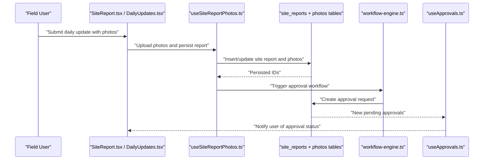
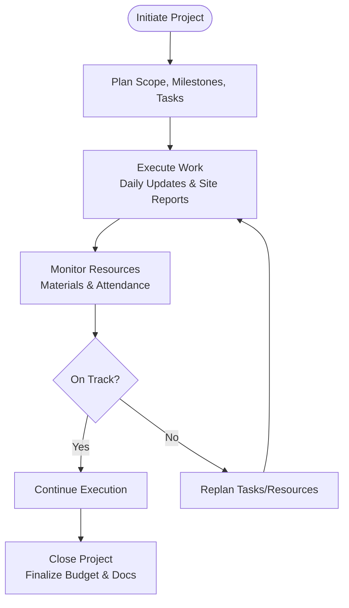
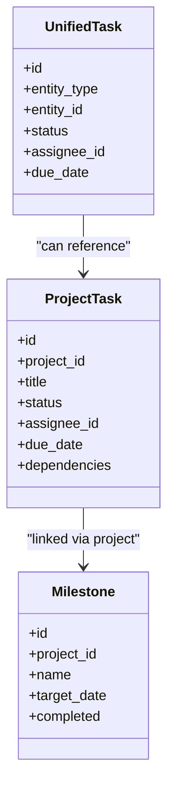
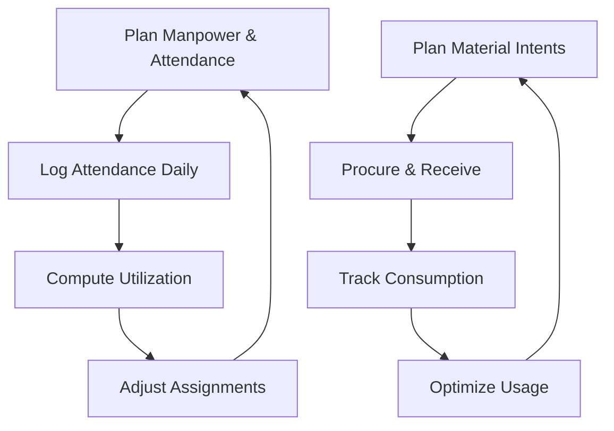
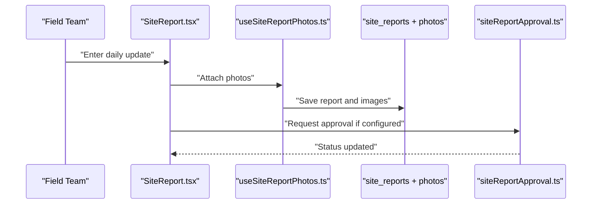
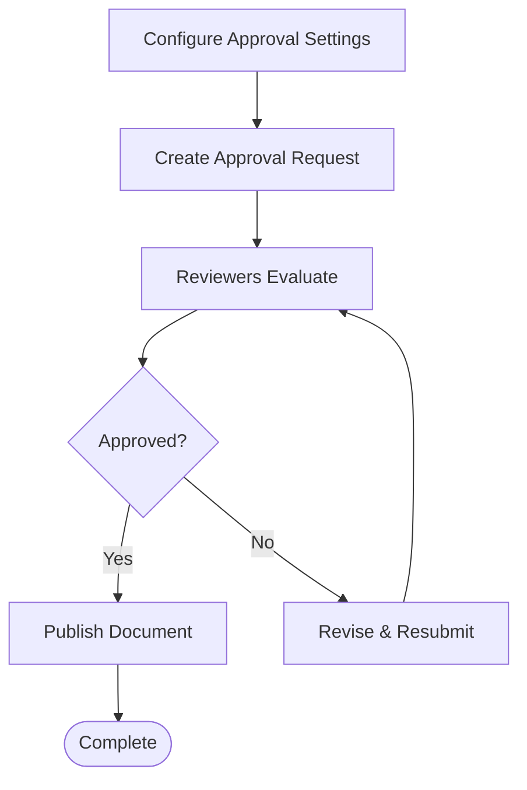
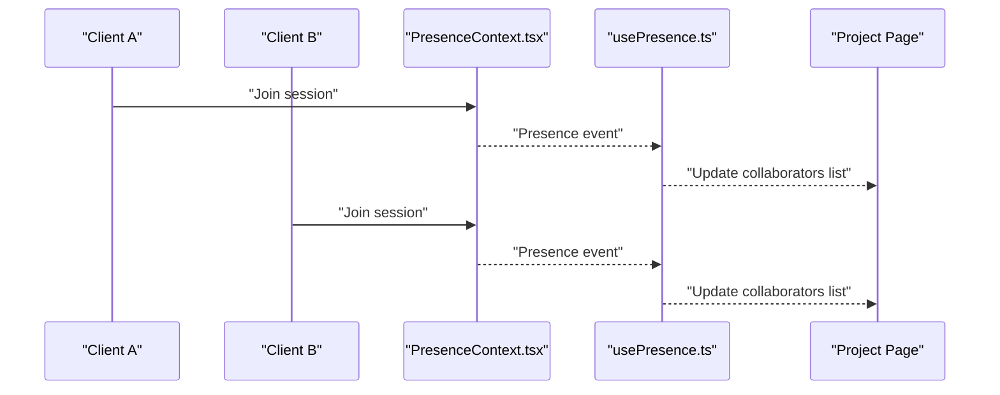
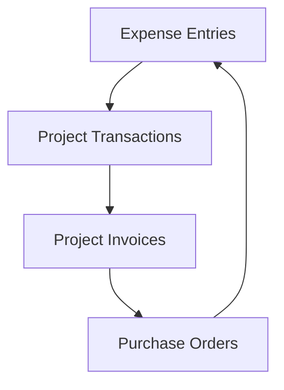
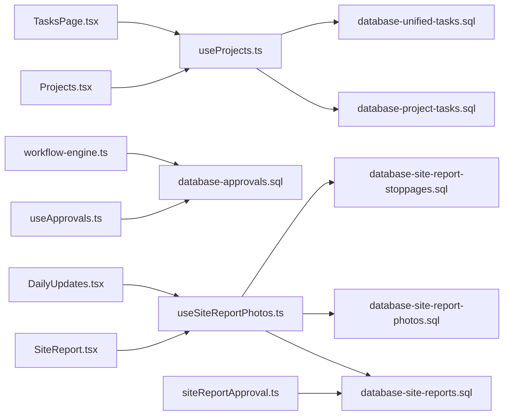

# Project Management

<cite>
**Referenced Files in This Document**
- [ProjectManagementInternal.tsx](file://src/pages/ProjectManagementInternal.tsx)
- [Projects.tsx](file://src/pages/Projects.tsx)
- [CreateProject.tsx](file://src/pages/CreateProject.tsx)
- [ProjectOverview.tsx](file://src/pages/ProjectOverview.tsx)
- [SiteReport.tsx](file://src/pages/SiteReport.tsx)
- [DailyUpdates.tsx](file://src/pages/DailyUpdates.tsx)
- [TasksPage.tsx](file://src/pages/TasksPage.tsx)
- [useProjects.ts](file://src/hooks/useProjects.ts)
- [useMilestones.ts](file://src/hooks/useMilestones.ts)
- [useManpower.ts](file://src/hooks/useManpower.ts)
- [useAttendance.ts](file://src/hooks/useAttendance.ts)
- [useSiteReportPhotos.ts](file://src/hooks/useSiteReportPhotos.ts)
- [usePresence.ts](file://src/hooks/usePresence.ts)
- [PresenceContext.tsx](file://src/contexts/PresenceContext.tsx)
- [site_reports.sql](file://site_reports.sql)
- [database-site-reports.sql](file://src/database/site-reports.sql)
- [database-site-report-photos.sql](file://src/database/site-report-photos.sql)
- [database-site-report-stoppages.sql](file://src/database/site-report-stoppages.sql)
- [database-project-tasks.sql](file://src/database/project-tasks.sql)
- [database-manpower-migration.sql](file://src/database/manpower-migration.sql)
- [database-attendance-planning.sql](file://sql/attendance_planning.sql)
- [database-unified-tasks.sql](file://src/database/unified-tasks.sql)
- [workflow-engine.ts](file://src/approvals/workflow-engine.ts)
- [siteReportApproval.ts](file://src/approvals/siteReportApproval.ts)
- [process-action.ts](file://src/api/approvals/process-action.ts)
- [create_approval_settings_table.sql](file://sql/create_approval_settings_table.sql)
- [database-approval-workflows-fix-fk.sql](file://src/database/database-approval-workflows-fix-fk.sql)
- [database-approval-workflows-rls.sql](file://src/database/database-approval-workflows-rls.sql)
- [database-approvals.sql](file://src/database/database-approvals.sql)
- [useApprovals.ts](file://src/hooks/useApprovals.ts)
- [ApprovalTable.tsx](file://src/components/ApprovalTable.tsx)
- [ApprovalSettings.tsx](file://src/components/ApprovalSettings.tsx)
- [ProjectMaterialDashboard.tsx](file://src/pages/ProjectMaterialDashboard.tsx)
- [ProjectMaterialList.tsx](file://src/pages/ProjectMaterialList.tsx)
- [ProjectMaterialIntents.tsx](file://src/pages/ProjectMaterialIntents.tsx)
- [MaterialConsumptionReport.tsx](file://src/pages/MaterialConsumptionReport.tsx)
- [useMaterials.ts](file://src/hooks/useMaterials.ts)
- [useExpenseEntries.ts](file://src/hooks/useExpenseEntries.ts)
- [useProjectTransactions.ts](file://src/hooks/useProjectTransactions.ts)
- [CreateProjectInvoiceModal.tsx](file://src/components/CreateProjectInvoiceModal.tsx)
- [link-project-invoices-to-po.sql](file://src/database/link-project-invoices-to-po.sql)
- [database-project-creation-enhancements.sql](file://src/database/database-project-creation-enhancements.sql)
- [TemplateSettings.tsx](file://src/pages/TemplateSettings.tsx)
- [templates/index.ts](file://src/templates/index.ts)
- [index.ts](file://src/app/routing/index.ts)
</cite>

## Table of Contents
1. Introduction
2. Project Structure
3. Core Components
4. Architecture Overview
5. Detailed Component Analysis
6. Dependency Analysis
7. Performance Considerations
8. Troubleshooting Guide
9. Conclusion

## Introduction
This document explains the end-to-end Project Management system, covering project lifecycle from initiation to closure, task management, resource allocation (manpower, equipment, materials), site reporting, approvals and workflows, collaboration and real-time updates, mobile accessibility for field teams, and reporting for performance, budget, and utilization. It maps features to concrete UI pages, hooks, database schemas, and approval integrations present in the codebase.

## Project Structure
The Project Management feature spans multiple pages, hooks, database migrations, and approval integrations:
- Pages: Project creation, listing, overview, tasks, site reports, daily updates, material dashboards, and templates.
- Hooks: Data access and state for projects, milestones, manpower, attendance, photos, presence, approvals, materials, expenses, and transactions.
- Database: Schemas for site reports, photos, stoppages, project tasks, manpower, attendance planning, unified tasks, and approvals.
- Approvals: Workflow engine, site report approval flow, settings, and API actions.

```mermaid
graph TB
subgraph "UI Pages"
PList["Projects.tsx"]
PCreate["CreateProject.tsx"]
POV["ProjectOverview.tsx"]
PTasks["TasksPage.tsx"]
PSite["SiteReport.tsx"]
PDaily["DailyUpdates.tsx"]
PMatDash["ProjectMaterialDashboard.tsx"]
PMatList["ProjectMaterialList.tsx"]
PMatIntent["ProjectMaterialIntents.tsx"]
PMatCons["MaterialConsumptionReport.tsx"]
PTmpl["TemplateSettings.tsx"]
end
subgraph "Hooks"
HProj["useProjects.ts"]
HMil["useMilestones.ts"]
HMan["useManpower.ts"]
HAtt["useAttendance.ts"]
HPhoto["useSiteReportPhotos.ts"]
HPres["usePresence.ts"]
HAppr["useApprovals.ts"]
HMat["useMaterials.ts"]
HExp["useExpenseEntries.ts"]
HTxn["useProjectTransactions.ts"]
end
subgraph "Database"
DBSR["database-site-reports.sql"]
DBSP["database-site-report-photos.sql"]
DBSS["database-site-report-stoppages.sql"]
DBPT["database-project-tasks.sql"]
DBUM["database-unified-tasks.sql"]
DBMP["database-manpower-migration.sql"]
DBAP["database-attendance-planning.sql"]
DBAPR["database-approvals.sql"]
end
subgraph "Approvals"
WF["workflow-engine.ts"]
SRW["siteReportApproval.ts"]
PA["process-action.ts"]
end
PList --> HProj
PCreate --> HProj
POV --> HProj
PTasks --> HProj
PSite --> HPhoto
PDaily --> HPhoto
PMatDash --> HMat
PMatList --> HMat
PMatIntent --> HMat
PMatCons --> HMat
PTmpl --> HProj
HProj --> DBPT
HProj --> DBUM
HPhoto --> DBSR
HPhoto --> DBSP
HPhoto --> DBSS
HMan --> DBMP
HAtt --> DBAP
HAppr --> DBAPR
WF --> DBAPR
SRW --> DBSR
PA --> DBAPR
```

**Diagram sources**
- [Projects.tsx](file://src/pages/Projects.tsx)
- [CreateProject.tsx](file://src/pages/CreateProject.tsx)
- [ProjectOverview.tsx](file://src/pages/ProjectOverview.tsx)
- [TasksPage.tsx](file://src/pages/TasksPage.tsx)
- [SiteReport.tsx](file://src/pages/SiteReport.tsx)
- [DailyUpdates.tsx](file://src/pages/DailyUpdates.tsx)
- [ProjectMaterialDashboard.tsx](file://src/pages/ProjectMaterialDashboard.tsx)
- [ProjectMaterialList.tsx](file://src/pages/ProjectMaterialList.tsx)
- [ProjectMaterialIntents.tsx](file://src/pages/ProjectMaterialIntents.tsx)
- [MaterialConsumptionReport.tsx](file://src/pages/MaterialConsumptionReport.tsx)
- [TemplateSettings.tsx](file://src/pages/TemplateSettings.tsx)
- [useProjects.ts](file://src/hooks/useProjects.ts)
- [useMilestones.ts](file://src/hooks/useMilestones.ts)
- [useManpower.ts](file://src/hooks/useManpower.ts)
- [useAttendance.ts](file://src/hooks/useAttendance.ts)
- [useSiteReportPhotos.ts](file://src/hooks/useSiteReportPhotos.ts)
- [useApprovals.ts](file://src/hooks/useApprovals.ts)
- [useMaterials.ts](file://src/hooks/useMaterials.ts)
- [useExpenseEntries.ts](file://src/hooks/useExpenseEntries.ts)
- [useProjectTransactions.ts](file://src/hooks/useProjectTransactions.ts)
- [database-site-reports.sql](file://src/database/site-reports.sql)
- [database-site-report-photos.sql](file://src/database/site-report-photos.sql)
- [database-site-report-stoppages.sql](file://src/database/site-report-stoppages.sql)
- [database-project-tasks.sql](file://src/database/project-tasks.sql)
- [database-unified-tasks.sql](file://src/database/unified-tasks.sql)
- [database-manpower-migration.sql](file://src/database/manpower-migration.sql)
- [database-attendance-planning.sql](file://sql/attendance_planning.sql)
- [database-approvals.sql](file://src/database/database-approvals.sql)
- [workflow-engine.ts](file://src/approvals/workflow-engine.ts)
- [siteReportApproval.ts](file://src/approvals/siteReportApproval.ts)
- [process-action.ts](file://src/api/approvals/process-action.ts)

**Section sources**
- [Projects.tsx](file://src/pages/Projects.tsx)
- [CreateProject.tsx](file://src/pages/CreateProject.tsx)
- [ProjectOverview.tsx](file://src/pages/ProjectOverview.tsx)
- [TasksPage.tsx](file://src/pages/TasksPage.tsx)
- [SiteReport.tsx](file://src/pages/SiteReport.tsx)
- [DailyUpdates.tsx](file://src/pages/DailyUpdates.tsx)
- [ProjectMaterialDashboard.tsx](file://src/pages/ProjectMaterialDashboard.tsx)
- [ProjectMaterialList.tsx](file://src/pages/ProjectMaterialList.tsx)
- [ProjectMaterialIntents.tsx](file://src/pages/ProjectMaterialIntents.tsx)
- [MaterialConsumptionReport.tsx](file://src/pages/MaterialConsumptionReport.tsx)
- [TemplateSettings.tsx](file://src/pages/TemplateSettings.tsx)
- [useProjects.ts](file://src/hooks/useProjects.ts)
- [useMilestones.ts](file://src/hooks/useMilestones.ts)
- [useManpower.ts](file://src/hooks/useManpower.ts)
- [useAttendance.ts](file://src/hooks/useAttendance.ts)
- [useSiteReportPhotos.ts](file://src/hooks/useSiteReportPhotos.ts)
- [useApprovals.ts](file://src/hooks/useApprovals.ts)
- [useMaterials.ts](file://src/hooks/useMaterials.ts)
- [useExpenseEntries.ts](file://src/hooks/useExpenseEntries.ts)
- [useProjectTransactions.ts](file://src/hooks/useProjectTransactions.ts)
- [database-site-reports.sql](file://src/database/site-reports.sql)
- [database-site-report-photos.sql](file://src/database/site-report-photos.sql)
- [database-site-report-stoppages.sql](file://src/database/site-report-stoppages.sql)
- [database-project-tasks.sql](file://src/database/project-tasks.sql)
- [database-unified-tasks.sql](file://src/database/unified-tasks.sql)
- [database-manpower-migration.sql](file://src/database/manpower-migration.sql)
- [database-attendance-planning.sql](file://sql/attendance_planning.sql)
- [database-approvals.sql](file://src/database/database-approvals.sql)
- [workflow-engine.ts](file://src/approvals/workflow-engine.ts)
- [siteReportApproval.ts](file://src/approvals/siteReportApproval.ts)
- [process-action.ts](file://src/api/approvals/process-action.ts)

## Core Components
- Project Lifecycle
  - Initiation: Create a new project via the project creation page; configure scope, milestones, and initial resources.
  - Planning: Define tasks, assignees, dependencies, and milestones; set up manpower and attendance plans.
  - Execution: Track daily progress through site reports and daily updates; log photos and stoppages.
  - Monitoring: Use dashboards and consumption reports to monitor material usage, manpower attendance, and project transactions.
  - Closure: Finalize deliverables, reconcile budgets, archive records, and generate closure reports.

- Task Management
  - Assignment and tracking are supported by project tasks and unified tasks schemas and UI.
  - Milestone management is provided via dedicated hooks and schema.

- Resource Allocation
  - Manpower: Manage workforce with manpower and attendance planning modules.
  - Equipment and Materials: Track procurement, consumption, and intent-based allocation across projects.

- Site Reports
  - Daily site reports include text updates, photo documentation, and stoppage logging.
  - Photos are stored and linked to reports.

- Approvals and Workflows
  - Configurable approval workflows govern documents such as site reports.
  - Settings and processing actions are available for multi-step approvals.

- Collaboration and Real-Time Updates
  - Presence context and hooks enable awareness of active users and live updates.

- Mobile Accessibility
  - Field-friendly pages (site reports, daily updates) support on-the-go data entry and photo capture.

- Reporting
  - Material consumption, manpower attendance, and project financial transactions provide performance and budget insights.

**Section sources**
- [CreateProject.tsx](file://src/pages/CreateProject.tsx)
- [ProjectOverview.tsx](file://src/pages/ProjectOverview.tsx)
- [TasksPage.tsx](file://src/pages/TasksPage.tsx)
- [useMilestones.ts](file://src/hooks/useMilestones.ts)
- [database-project-tasks.sql](file://src/database/project-tasks.sql)
- [database-unified-tasks.sql](file://src/database/unified-tasks.sql)
- [useManpower.ts](file://src/hooks/useManpower.ts)
- [useAttendance.ts](file://src/hooks/useAttendance.ts)
- [database-manpower-migration.sql](file://src/database/manpower-migration.sql)
- [database-attendance-planning.sql](file://sql/attendance_planning.sql)
- [SiteReport.tsx](file://src/pages/SiteReport.tsx)
- [DailyUpdates.tsx](file://src/pages/DailyUpdates.tsx)
- [useSiteReportPhotos.ts](file://src/hooks/useSiteReportPhotos.ts)
- [database-site-reports.sql](file://src/database/site-reports.sql)
- [database-site-report-photos.sql](file://src/database/site-report-photos.sql)
- [database-site-report-stoppages.sql](file://src/database/site-report-stoppages.sql)
- [workflow-engine.ts](file://src/approvals/workflow-engine.ts)
- [siteReportApproval.ts](file://src/approvals/siteReportApproval.ts)
- [process-action.ts](file://src/api/approvals/process-action.ts)
- [usePresence.ts](file://src/hooks/usePresence.ts)
- [PresenceContext.tsx](file://src/contexts/PresenceContext.tsx)
- [ProjectMaterialDashboard.tsx](file://src/pages/ProjectMaterialDashboard.tsx)
- [MaterialConsumptionReport.tsx](file://src/pages/MaterialConsumptionReport.tsx)
- [useMaterials.ts](file://src/hooks/useMaterials.ts)
- [useExpenseEntries.ts](file://src/hooks/useExpenseEntries.ts)
- [useProjectTransactions.ts](file://src/hooks/useProjectTransactions.ts)

## Architecture Overview
The system integrates UI pages with typed hooks that query and mutate Supabase-backed tables. Approval workflows orchestrate document states and notifications. Presence enables collaborative editing and live updates.

**Diagram sources**
- [SiteReport.tsx](file://src/pages/SiteReport.tsx)
- [DailyUpdates.tsx](file://src/pages/DailyUpdates.tsx)
- [useSiteReportPhotos.ts](file://src/hooks/useSiteReportPhotos.ts)
- [database-site-reports.sql](file://src/database/site-reports.sql)
- [database-site-report-photos.sql](file://src/database/site-report-photos.sql)
- [workflow-engine.ts](file://src/approvals/workflow-engine.ts)
- [useApprovals.ts](file://src/hooks/useApprovals.ts)

## Detailed Component Analysis

### Project Lifecycle and Templates
- Initiation and Planning
  - Project creation supports template-driven setup and milestone configuration.
  - Tasks and unified tasks define work breakdown and sequencing.
- Execution and Monitoring
  - Daily updates and site reports capture progress, issues, and evidence.
  - Material dashboards and consumption reports track resource usage.
- Closure
  - Financial reconciliation uses project transactions and invoice linkage.

[No sources needed since this diagram shows conceptual workflow, not actual code structure]

**Section sources**
- [CreateProject.tsx](file://src/pages/CreateProject.tsx)
- [TemplateSettings.tsx](file://src/pages/TemplateSettings.tsx)
- [database-project-tasks.sql](file://src/database/project-tasks.sql)
- [database-unified-tasks.sql](file://src/database/unified-tasks.sql)
- [SiteReport.tsx](file://src/pages/SiteReport.tsx)
- [DailyUpdates.tsx](file://src/pages/DailyUpdates.tsx)
- [ProjectMaterialDashboard.tsx](file://src/pages/ProjectMaterialDashboard.tsx)
- [MaterialConsumptionReport.tsx](file://src/pages/MaterialConsumptionReport.tsx)
- [useProjectTransactions.ts](file://src/hooks/useProjectTransactions.ts)
- [link-project-invoices-to-po.sql](file://src/database/link-project-invoices-to-po.sql)

### Task Management
- Features
  - Assign tasks to team members, track statuses, and manage dependencies.
  - Milestones mark key delivery points and can be tied to tasks.
- Implementation
  - Project tasks and unified tasks schemas provide relational structure.
  - Dedicated hooks surface data for UI components.

**Diagram sources**
- [database-project-tasks.sql](file://src/database/project-tasks.sql)
- [database-unified-tasks.sql](file://src/database/unified-tasks.sql)
- [useMilestones.ts](file://src/hooks/useMilestones.ts)

**Section sources**
- [TasksPage.tsx](file://src/pages/TasksPage.tsx)
- [database-project-tasks.sql](file://src/database/project-tasks.sql)
- [database-unified-tasks.sql](file://src/database/unified-tasks.sql)
- [useMilestones.ts](file://src/hooks/useMilestones.ts)

### Resource Allocation and Utilization
- Manpower
  - Manage workers, roles, and attendance planning.
  - Attendance logs feed utilization metrics.
- Equipment and Materials
  - Intent-based allocation links planned needs to actual consumption.
  - Dashboards visualize usage trends and variances.

**Diagram sources**
- [useManpower.ts](file://src/hooks/useManpower.ts)
- [useAttendance.ts](file://src/hooks/useAttendance.ts)
- [database-manpower-migration.sql](file://src/database/manpower-migration.sql)
- [database-attendance-planning.sql](file://sql/attendance_planning.sql)
- [ProjectMaterialIntents.tsx](file://src/pages/ProjectMaterialIntents.tsx)
- [ProjectMaterialList.tsx](file://src/pages/ProjectMaterialList.tsx)
- [ProjectMaterialDashboard.tsx](file://src/pages/ProjectMaterialDashboard.tsx)
- [MaterialConsumptionReport.tsx](file://src/pages/MaterialConsumptionReport.tsx)
- [useMaterials.ts](file://src/hooks/useMaterials.ts)

**Section sources**
- [useManpower.ts](file://src/hooks/useManpower.ts)
- [useAttendance.ts](file://src/hooks/useAttendance.ts)
- [database-manpower-migration.sql](file://src/database/manpower-migration.sql)
- [database-attendance-planning.sql](file://sql/attendance_planning.sql)
- [ProjectMaterialIntents.tsx](file://src/pages/ProjectMaterialIntents.tsx)
- [ProjectMaterialList.tsx](file://src/pages/ProjectMaterialList.tsx)
- [ProjectMaterialDashboard.tsx](file://src/pages/ProjectMaterialDashboard.tsx)
- [MaterialConsumptionReport.tsx](file://src/pages/MaterialConsumptionReport.tsx)
- [useMaterials.ts](file://src/hooks/useMaterials.ts)

### Site Reports and Photo Documentation
- Capabilities
  - Submit daily updates with narrative, photos, and stoppage details.
  - Photos are persisted and associated with reports.
- Approval Integration
  - Site reports can trigger approval workflows based on settings.

**Diagram sources**
- [SiteReport.tsx](file://src/pages/SiteReport.tsx)
- [DailyUpdates.tsx](file://src/pages/DailyUpdates.tsx)
- [useSiteReportPhotos.ts](file://src/hooks/useSiteReportPhotos.ts)
- [database-site-reports.sql](file://src/database/site-reports.sql)
- [database-site-report-photos.sql](file://src/database/site-report-photos.sql)
- [database-site-report-stoppages.sql](file://src/database/site-report-stoppages.sql)
- [siteReportApproval.ts](file://src/approvals/siteReportApproval.ts)

**Section sources**
- [SiteReport.tsx](file://src/pages/SiteReport.tsx)
- [DailyUpdates.tsx](file://src/pages/DailyUpdates.tsx)
- [useSiteReportPhotos.ts](file://src/hooks/useSiteReportPhotos.ts)
- [database-site-reports.sql](file://src/database/site-reports.sql)
- [database-site-report-photos.sql](file://src/database/site-report-photos.sql)
- [database-site-report-stoppages.sql](file://src/database/site-report-stoppages.sql)
- [siteReportApproval.ts](file://src/approvals/siteReportApproval.ts)

### Approvals and Workflows
- Configuration
  - Approval settings allow defining rules and reviewers.
- Processing
  - Workflow engine orchestrates transitions and notifications.
  - API action endpoint handles approve/reject operations.

**Diagram sources**
- [create_approval_settings_table.sql](file://sql/create_approval_settings_table.sql)
- [database-approvals.sql](file://src/database/database-approvals.sql)
- [workflow-engine.ts](file://src/approvals/workflow-engine.ts)
- [process-action.ts](file://src/api/approvals/process-action.ts)
- [useApprovals.ts](file://src/hooks/useApprovals.ts)
- [ApprovalTable.tsx](file://src/components/ApprovalTable.tsx)
- [ApprovalSettings.tsx](file://src/components/ApprovalSettings.tsx)

**Section sources**
- [create_approval_settings_table.sql](file://sql/create_approval_settings_table.sql)
- [database-approvals.sql](file://src/database/database-approvals.sql)
- [database-approval-workflows-fix-fk.sql](file://src/database/database-approval-workflows-fix-fk.sql)
- [database-approval-workflows-rls.sql](file://src/database/database-approval-workflows-rls.sql)
- [workflow-engine.ts](file://src/approvals/workflow-engine.ts)
- [process-action.ts](file://src/api/approvals/process-action.ts)
- [useApprovals.ts](file://src/hooks/useApprovals.ts)
- [ApprovalTable.tsx](file://src/components/ApprovalTable.tsx)
- [ApprovalSettings.tsx](file://src/components/ApprovalSettings.tsx)

### Collaboration and Real-Time Updates
- Presence
  - Presence context tracks active users and sessions.
  - Hooks subscribe to presence events to reflect live changes.
- Application
  - UI components react to presence to show who is viewing/editing.

**Diagram sources**
- [PresenceContext.tsx](file://src/contexts/PresenceContext.tsx)
- [usePresence.ts](file://src/hooks/usePresence.ts)

**Section sources**
- [PresenceContext.tsx](file://src/contexts/PresenceContext.tsx)
- [usePresence.ts](file://src/hooks/usePresence.ts)

### Mobile Accessibility for Field Teams
- Field-Friendly Interfaces
  - Site reports and daily updates are designed for quick input and photo capture.
- Offline Considerations
  - Ensure robust error handling and retry logic for uploads and submissions.

[No sources needed since this section provides general guidance]

### Integrating with Financial Systems
- Project Transactions and Invoicing
  - Link project invoices to purchase orders and track expenditures.
  - Expense entries and transaction hooks consolidate financial data.
- Customization
  - Template settings and module registry support tailored financial views.

**Diagram sources**
- [useExpenseEntries.ts](file://src/hooks/useExpenseEntries.ts)
- [useProjectTransactions.ts](file://src/hooks/useProjectTransactions.ts)
- [CreateProjectInvoiceModal.tsx](file://src/components/CreateProjectInvoiceModal.tsx)
- [link-project-invoices-to-po.sql](file://src/database/link-project-invoices-to-po.sql)

**Section sources**
- [useExpenseEntries.ts](file://src/hooks/useExpenseEntries.ts)
- [useProjectTransactions.ts](file://src/hooks/useProjectTransactions.ts)
- [CreateProjectInvoiceModal.tsx](file://src/components/CreateProjectInvoiceModal.tsx)
- [link-project-invoices-to-po.sql](file://src/database/link-project-invoices-to-po.sql)

### Customizing Project Templates
- Template Settings
  - Configure default fields, milestones, and task structures per project type.
- Module Registry
  - Enable or disable features and tailor the project workspace.

**Section sources**
- [TemplateSettings.tsx](file://src/pages/TemplateSettings.tsx)
- [index.ts](file://src/app/routing/index.ts)

## Dependency Analysis
Key dependencies between UI, hooks, database, and approvals:

**Diagram sources**
- [Projects.tsx](file://src/pages/Projects.tsx)
- [TasksPage.tsx](file://src/pages/TasksPage.tsx)
- [SiteReport.tsx](file://src/pages/SiteReport.tsx)
- [DailyUpdates.tsx](file://src/pages/DailyUpdates.tsx)
- [useProjects.ts](file://src/hooks/useProjects.ts)
- [useSiteReportPhotos.ts](file://src/hooks/useSiteReportPhotos.ts)
- [useApprovals.ts](file://src/hooks/useApprovals.ts)
- [database-project-tasks.sql](file://src/database/project-tasks.sql)
- [database-unified-tasks.sql](file://src/database/unified-tasks.sql)
- [database-site-reports.sql](file://src/database/site-reports.sql)
- [database-site-report-photos.sql](file://src/database/site-report-photos.sql)
- [database-site-report-stoppages.sql](file://src/database/site-report-stoppages.sql)
- [database-approvals.sql](file://src/database/database-approvals.sql)
- [workflow-engine.ts](file://src/approvals/workflow-engine.ts)
- [siteReportApproval.ts](file://src/approvals/siteReportApproval.ts)

**Section sources**
- [Projects.tsx](file://src/pages/Projects.tsx)
- [TasksPage.tsx](file://src/pages/TasksPage.tsx)
- [SiteReport.tsx](file://src/pages/SiteReport.tsx)
- [DailyUpdates.tsx](file://src/pages/DailyUpdates.tsx)
- [useProjects.ts](file://src/hooks/useProjects.ts)
- [useSiteReportPhotos.ts](file://src/hooks/useSiteReportPhotos.ts)
- [useApprovals.ts](file://src/hooks/useApprovals.ts)
- [database-project-tasks.sql](file://src/database/project-tasks.sql)
- [database-unified-tasks.sql](file://src/database/unified-tasks.sql)
- [database-site-reports.sql](file://src/database/site-reports.sql)
- [database-site-report-photos.sql](file://src/database/site-report-photos.sql)
- [database-site-report-stoppages.sql](file://src/database/site-report-stoppages.sql)
- [database-approvals.sql](file://src/database/database-approvals.sql)
- [workflow-engine.ts](file://src/approvals/workflow-engine.ts)
- [siteReportApproval.ts](file://src/approvals/siteReportApproval.ts)

## Performance Considerations
- Batch operations for large datasets (e.g., bulk photo uploads).
- Pagination and virtualization for heavy lists (tasks, materials).
- Efficient queries and indexes in database schemas.
- Debounced search and filters in task and material pages.
- Minimize re-renders using memoization and stable references in hooks.

[No sources needed since this section provides general guidance]

## Troubleshooting Guide
- Approval Issues
  - Verify approval settings and RLS policies.
  - Check workflow transitions and reviewer assignments.
- Site Report Upload Failures
  - Validate photo storage permissions and file size limits.
  - Inspect network errors and retry strategies.
- Task and Milestone Sync
  - Confirm foreign keys and referential integrity in task schemas.
- Financial Reconciliation
  - Ensure invoices link correctly to purchase orders and project transactions.

**Section sources**
- [create_approval_settings_table.sql](file://sql/create_approval_settings_table.sql)
- [database-approval-workflows-rls.sql](file://src/database/database-approval-workflows-rls.sql)
- [database-approvals.sql](file://src/database/database-approvals.sql)
- [database-site-report-photos.sql](file://src/database/site-report-photos.sql)
- [database-project-tasks.sql](file://src/database/project-tasks.sql)
- [link-project-invoices-to-po.sql](file://src/database/link-project-invoices-to-po.sql)

## Conclusion
The Project Management system provides a comprehensive toolkit spanning project lifecycle management, task and milestone control, resource allocation, site reporting, approvals, collaboration, and financial integration. Its modular architecture—combining UI pages, typed hooks, robust database schemas, and configurable workflows—supports customization, scalability, and field usability. By leveraging templates, approval settings, and reporting dashboards, teams can streamline execution, maintain visibility, and drive continuous improvement across projects.