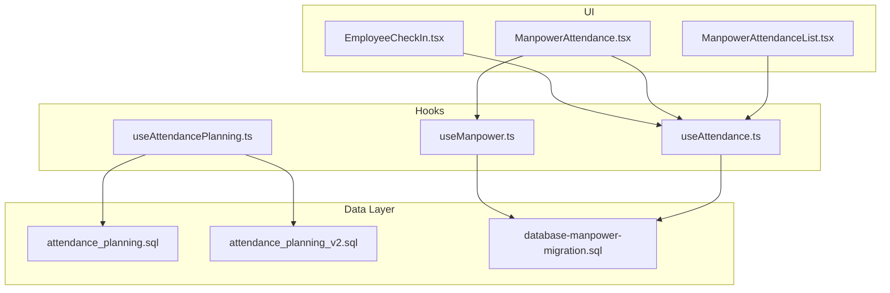
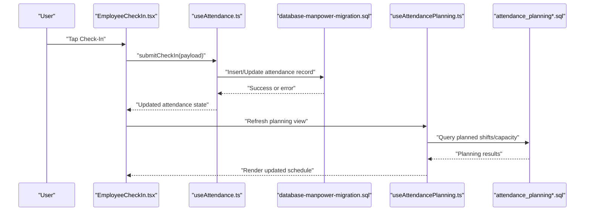
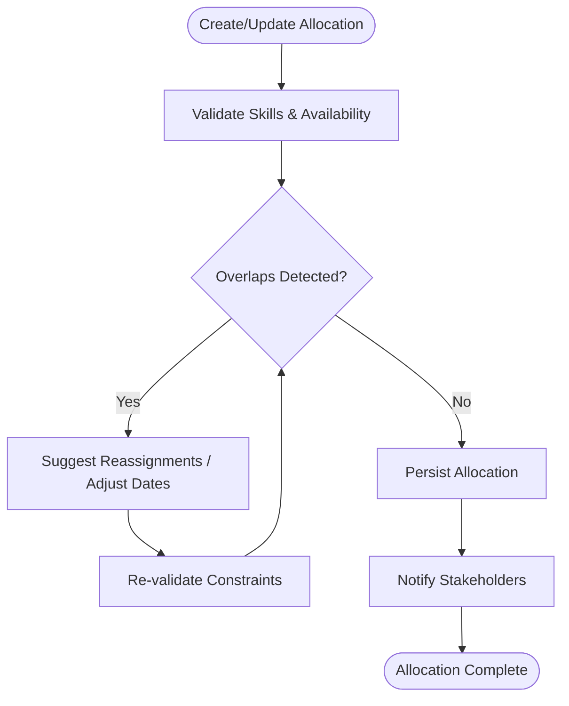
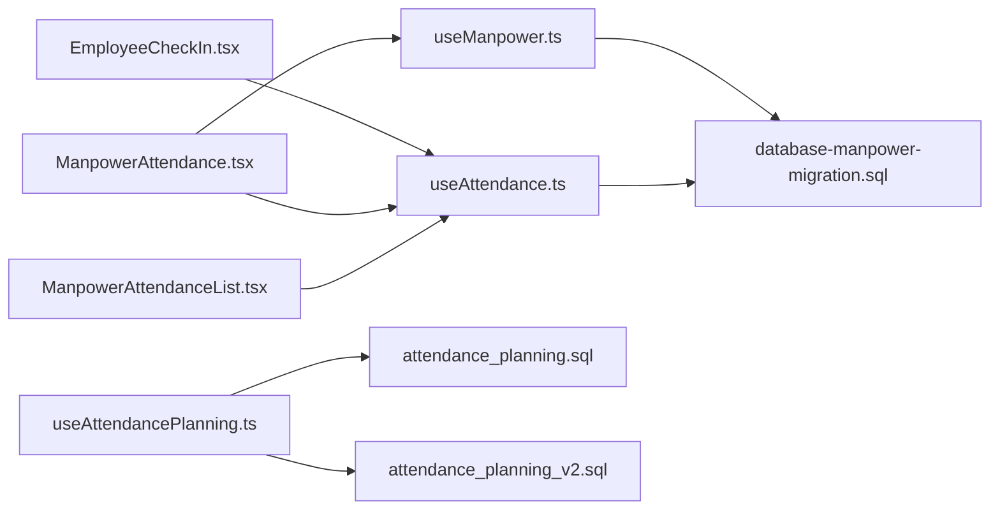

# Manpower Allocation & Scheduling

<cite>
**Referenced Files in This Document**
- [useManpower.ts](file://src/hooks/useManpower.ts)
- [useAttendance.ts](file://src/hooks/useAttendance.ts)
- [useAttendancePlanning.ts](file://src/hooks/useAttendancePlanning.ts)
- [EmployeeCheckIn.tsx](file://src/pages/EmployeeCheckIn.tsx)
- [ManpowerAttendance.tsx](file://src/pages/ManpowerAttendance.tsx)
- [ManpowerAttendanceList.tsx](file://src/pages/ManpowerAttendanceList.tsx)
- [attendance_planning.sql](file://sql/attendance_planning.sql)
- [attendance_planning_v2.sql](file://sql/attendance_planning_v2.sql)
- [database-manpower-migration.sql](file://src/database-manpower-migration.sql)
</cite>

## Table of Contents
1. [Introduction](#introduction)
2. [Project Structure](#project-structure)
3. [Core Components](#core-components)
4. [Architecture Overview](#architecture-overview)
5. [Detailed Component Analysis](#detailed-component-analysis)
6. [Dependency Analysis](#dependency-analysis)
7. [Performance Considerations](#performance-considerations)
8. [Troubleshooting Guide](#troubleshooting-guide)
9. [Conclusion](#conclusion)
10. [Appendices](#appendices)

## Introduction
This document explains the manpower allocation and scheduling functionality implemented in the application. It covers employee assignment to projects, skill-based resource matching, availability tracking, attendance integration for allocation decisions, overtime management, labor cost calculations, workforce schedule creation, shift rotation handling, temporary vs permanent staff allocations, conflict detection and resolution with project tasks, mobile check-in/check-out integration, real-time attendance updates, and compliance reporting. The content is grounded in the repository’s hooks, pages, and SQL migrations that implement these capabilities.

## Project Structure
The manpower and scheduling features are primarily implemented through:
- React hooks for data access and business logic orchestration
- Pages for user-facing workflows (check-in/out, attendance views)
- SQL migrations defining schemas and planning utilities

**Diagram sources**
- [EmployeeCheckIn.tsx](file://src/pages/EmployeeCheckIn.tsx)
- [ManpowerAttendance.tsx](file://src/pages/ManpowerAttendance.tsx)
- [ManpowerAttendanceList.tsx](file://src/pages/ManpowerAttendanceList.tsx)
- [useManpower.ts](file://src/hooks/useManpower.ts)
- [useAttendance.ts](file://src/hooks/useAttendance.ts)
- [useAttendancePlanning.ts](file://src/hooks/useAttendancePlanning.ts)
- [attendance_planning.sql](file://sql/attendance_planning.sql)
- [attendance_planning_v2.sql](file://sql/attendance_planning_v2.sql)
- [database-manpower-migration.sql](file://src/database-manpower-migration.sql)

**Section sources**
- [useManpower.ts](file://src/hooks/useManpower.ts)
- [useAttendance.ts](file://src/hooks/useAttendance.ts)
- [useAttendancePlanning.ts](file://src/hooks/useAttendancePlanning.ts)
- [EmployeeCheckIn.tsx](file://src/pages/EmployeeCheckIn.tsx)
- [ManpowerAttendance.tsx](file://src/pages/ManpowerAttendance.tsx)
- [ManpowerAttendanceList.tsx](file://src/pages/ManpowerAttendanceList.tsx)
- [attendance_planning.sql](file://sql/attendance_planning.sql)
- [attendance_planning_v2.sql](file://sql/attendance_planning_v2.sql)
- [database-manpower-migration.sql](file://src/database-manpower-migration.sql)

## Core Components
- useManpower hook: Centralizes manpower-related queries and mutations, including employee lists, assignments, and availability.
- useAttendance hook: Provides attendance records, check-in/out operations, and derived metrics such as hours worked and overtime.
- useAttendancePlanning hook: Encapsulates planning-specific logic, including capacity planning, shift templates, and conflict checks.
- EmployeeCheckIn page: Mobile-friendly interface for employees to clock in/out and view current status.
- ManpowerAttendance page: Dashboard for managers to view daily/weekly attendance, allocations, and exceptions.
- ManpowerAttendanceList page: Tabular view with filters, export, and drill-down into individual records.
- SQL migrations: Define tables and functions for manpower, attendance, and planning; include indexes and constraints for performance and integrity.

Key responsibilities:
- Data fetching and caching via hooks
- Validation and constraint enforcement at UI and DB layers
- Real-time updates using presence-aware patterns where applicable
- Reporting and exports from list views

**Section sources**
- [useManpower.ts](file://src/hooks/useManpower.ts)
- [useAttendance.ts](file://src/hooks/useAttendance.ts)
- [useAttendancePlanning.ts](file://src/hooks/useAttendancePlanning.ts)
- [EmployeeCheckIn.tsx](file://src/pages/EmployeeCheckIn.tsx)
- [ManpowerAttendance.tsx](file://src/pages/ManpowerAttendance.tsx)
- [ManpowerAttendanceList.tsx](file://src/pages/ManpowerAttendanceList.tsx)
- [attendance_planning.sql](file://sql/attendance_planning.sql)
- [attendance_planning_v2.sql](file://sql/attendance_planning_v2.sql)
- [database-manpower-migration.sql](file://src/database-manpower-migration.sql)

## Architecture Overview
The system follows a layered architecture:
- Presentation layer: Pages render schedules, attendance, and check-in flows.
- Logic layer: Hooks encapsulate domain logic, API calls, and state management.
- Persistence layer: Database schema and migrations define entities and constraints.

**Diagram sources**
- [EmployeeCheckIn.tsx](file://src/pages/EmployeeCheckIn.tsx)
- [useAttendance.ts](file://src/hooks/useAttendance.ts)
- [useAttendancePlanning.ts](file://src/hooks/useAttendancePlanning.ts)
- [database-manpower-migration.sql](file://src/database-manpower-migration.sql)
- [attendance_planning.sql](file://sql/attendance_planning.sql)
- [attendance_planning_v2.sql](file://sql/attendance_planning_v2.sql)

## Detailed Component Analysis

### Employee Assignment to Projects
- Employees are assigned to projects through allocations managed by the manpower hook. Assignments can be filtered by project, date range, and role/skill tags.
- Skill-based matching leverages employee skill profiles and required skills on project tasks to suggest optimal candidates.
- Availability is computed from planned shifts, leave requests, and historical attendance.

Implementation highlights:
- Use manpower hook to fetch assignments and update them via mutation endpoints.
- Validate overlaps and capacity limits before confirming assignments.
- Persist changes and refresh dependent views.

**Section sources**
- [useManpower.ts](file://src/hooks/useManpower.ts)
- [database-manpower-migration.sql](file://src/database-manpower-migration.sql)

### Skill-Based Resource Matching
- Matching algorithm considers:
  - Required skills per task/project
  - Employee skill levels and certifications
  - Current workload and planned availability
  - Cost rates and contract type (temporary/permanent)
- Suggestions are ranked by fit score and availability.

Operational flow:
- Load project/task requirements
- Query candidate pool with skill filters
- Compute fit scores and rank
- Present recommendations to planners

**Section sources**
- [useManpower.ts](file://src/hooks/useManpower.ts)
- [useAttendancePlanning.ts](file://src/hooks/useAttendancePlanning.ts)

### Availability Tracking
- Availability is derived from:
  - Planned shifts and templates
  - Leave balances and approvals
  - Actual attendance (check-in/out)
  - Overtime caps and labor rules
- Real-time updates reflect latest check-ins and plan adjustments.

**Section sources**
- [useAttendance.ts](file://src/hooks/useAttendance.ts)
- [useAttendancePlanning.ts](file://src/hooks/useAttendancePlanning.ts)
- [attendance_planning.sql](file://sql/attendance_planning.sql)
- [attendance_planning_v2.sql](file://sql/attendance_planning_v2.sql)

### Attendance Integration with Allocation Decisions
- Allocations consider current attendance to avoid over-allocation.
- When an employee clocks in/out, the planner recalculates available capacity and flags potential conflicts.
- Managers can adjust plans based on live attendance signals.

**Section sources**
- [useAttendance.ts](file://src/hooks/useAttendance.ts)
- [useAttendancePlanning.ts](file://src/hooks/useAttendancePlanning.ts)

### Overtime Management
- Overtime is calculated from actual hours beyond standard workday thresholds.
- Rules include maximum daily/weekly overtime, premium rates, and approval workflows.
- Alerts are raised when overtime exceeds policy limits.

**Section sources**
- [useAttendance.ts](file://src/hooks/useAttendance.ts)
- [database-manpower-migration.sql](file://src/database-manpower-migration.sql)

### Labor Cost Calculations
- Labor cost aggregates:
  - Base hours × hourly rate
  - Overtime hours × overtime multiplier
  - Allowances and deductions
- Costs roll up to project/task level for budgeting and reporting.

**Section sources**
- [useManpower.ts](file://src/hooks/useManpower.ts)
- [useAttendance.ts](file://src/hooks/useAttendance.ts)

### Creating Workforce Schedules
- Planners create weekly/daily schedules using shift templates and capacity targets.
- The planning hook validates feasibility against availability and constraints.
- Changes propagate to attendance dashboards and check-in screens.

**Section sources**
- [useAttendancePlanning.ts](file://src/hooks/useAttendancePlanning.ts)
- [ManpowerAttendance.tsx](file://src/pages/ManpowerAttendance.tsx)

### Handling Shift Rotations
- Rotation patterns (e.g., day/night cycles) are modeled as templates.
- The system auto-generates recurring shifts while respecting rest periods and legal limits.
- Exceptions can be overridden per employee or team.

**Section sources**
- [useAttendancePlanning.ts](file://src/hooks/useAttendancePlanning.ts)
- [attendance_planning_v2.sql](file://sql/attendance_planning_v2.sql)

### Temporary vs Permanent Staff Allocations
- Contract type influences:
  - Availability windows
  - Cost rates and overtime policies
  - Compliance constraints (e.g., max duration)
- UI distinguishes contract types and enforces relevant rules.

**Section sources**
- [useManpower.ts](file://src/hooks/useManpower.ts)
- [database-manpower-migration.sql](file://src/database-manpower-migration.sql)

### Relationship Between Manpower Allocation and Project Task Assignments
- Allocations link employees to projects/tasks with start/end dates and roles.
- Automatic conflict detection prevents double-booking and ensures skill coverage.
- Resolutions include reassignment suggestions and capacity alerts.

**Diagram sources**
- [useManpower.ts](file://src/hooks/useManpower.ts)
- [useAttendancePlanning.ts](file://src/hooks/useAttendancePlanning.ts)

**Section sources**
- [useManpower.ts](file://src/hooks/useManpower.ts)
- [useAttendancePlanning.ts](file://src/hooks/useAttendancePlanning.ts)

### Mobile Check-in/Check-out Integration
- The check-in page supports geolocation, device info, and quick actions for clock-in/out.
- Attendance hook submits events and updates local state immediately.
- Offline resilience includes retry queues and conflict resolution upon sync.

**Section sources**
- [EmployeeCheckIn.tsx](file://src/pages/EmployeeCheckIn.tsx)
- [useAttendance.ts](file://src/hooks/useAttendance.ts)

### Real-time Attendance Updates
- Attendance dashboards refresh automatically when new check-ins occur.
- Presence-aware patterns ensure consistent views across users.
- Planner views recalculate capacity and highlight anomalies.

**Section sources**
- [ManpowerAttendance.tsx](file://src/pages/ManpowerAttendance.tsx)
- [useAttendance.ts](file://src/hooks/useAttendance.ts)

### Compliance Reporting
- Reports cover:
  - Hours worked, overtime, and absences
  - Policy violations and exceptions
  - Labor cost summaries by project/task
- Exports support CSV/PDF formats for audits.

**Section sources**
- [ManpowerAttendanceList.tsx](file://src/pages/ManpowerAttendanceList.tsx)
- [useAttendance.ts](file://src/hooks/useAttendance.ts)

## Dependency Analysis
The following diagram shows key dependencies among components and data layers.

**Diagram sources**
- [EmployeeCheckIn.tsx](file://src/pages/EmployeeCheckIn.tsx)
- [ManpowerAttendance.tsx](file://src/pages/ManpowerAttendance.tsx)
- [ManpowerAttendanceList.tsx](file://src/pages/ManpowerAttendanceList.tsx)
- [useManpower.ts](file://src/hooks/useManpower.ts)
- [useAttendance.ts](file://src/hooks/useAttendance.ts)
- [useAttendancePlanning.ts](file://src/hooks/useAttendancePlanning.ts)
- [database-manpower-migration.sql](file://src/database-manpower-migration.sql)
- [attendance_planning.sql](file://sql/attendance_planning.sql)
- [attendance_planning_v2.sql](file://sql/attendance_planning_v2.sql)

**Section sources**
- [useManpower.ts](file://src/hooks/useManpower.ts)
- [useAttendance.ts](file://src/hooks/useAttendance.ts)
- [useAttendancePlanning.ts](file://src/hooks/useAttendancePlanning.ts)
- [EmployeeCheckIn.tsx](file://src/pages/EmployeeCheckIn.tsx)
- [ManpowerAttendance.tsx](file://src/pages/ManpowerAttendance.tsx)
- [ManpowerAttendanceList.tsx](file://src/pages/ManpowerAttendanceList.tsx)
- [database-manpower-migration.sql](file://src/database-manpower-migration.sql)
- [attendance_planning.sql](file://sql/attendance_planning.sql)
- [attendance_planning_v2.sql](file://sql/attendance_planning_v2.sql)

## Performance Considerations
- Indexes on frequently queried columns (employee_id, project_id, date ranges) improve lookup speed.
- Batch operations for bulk schedule generation reduce round trips.
- Pagination and virtualization for large attendance lists enhance rendering performance.
- Caching strategies minimize redundant computations for planning and cost roll-ups.

[No sources needed since this section provides general guidance]

## Troubleshooting Guide
Common issues and resolutions:
- Duplicate check-ins: Ensure idempotent submission and server-side deduplication.
- Over-allocation errors: Review skill and availability constraints; adjust plans or reassign resources.
- Overtime policy violations: Verify policy configuration and cap enforcement logic.
- Sync failures: Inspect network retries and conflict resolution logs.

**Section sources**
- [useAttendance.ts](file://src/hooks/useAttendance.ts)
- [useAttendancePlanning.ts](file://src/hooks/useAttendancePlanning.ts)

## Conclusion
The manpower allocation and scheduling module integrates employee assignments, skill-based matching, availability tracking, and attendance-driven planning. It supports robust overtime and cost calculations, shift rotations, and compliance reporting. The modular design with clear separation between UI, hooks, and database layers enables maintainability and scalability.

[No sources needed since this section summarizes without analyzing specific files]

## Appendices

### Example Workflows

#### Create a Weekly Schedule
- Select project and required roles
- Choose shift templates and rotation pattern
- Validate capacity and resolve conflicts
- Publish schedule and notify teams

**Section sources**
- [useAttendancePlanning.ts](file://src/hooks/useAttendancePlanning.ts)
- [ManpowerAttendance.tsx](file://src/pages/ManpowerAttendance.tsx)

#### Handle Shift Rotation
- Define rotation cycle and rest intervals
- Auto-generate recurring shifts
- Override exceptions per employee
- Monitor compliance and adjust as needed

**Section sources**
- [useAttendancePlanning.ts](file://src/hooks/useAttendancePlanning.ts)
- [attendance_planning_v2.sql](file://sql/attendance_planning_v2.sql)

#### Manage Temporary vs Permanent Staff
- Set contract type and associated rules
- Enforce availability windows and cost rates
- Track duration limits and renewal approvals

**Section sources**
- [useManpower.ts](file://src/hooks/useManpower.ts)
- [database-manpower-migration.sql](file://src/database-manpower-migration.sql)