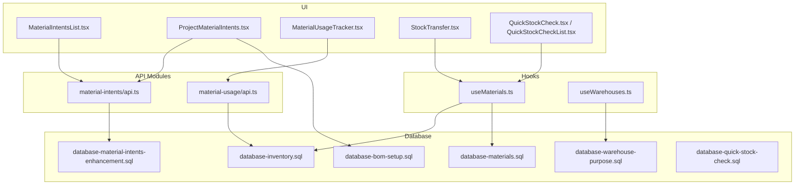
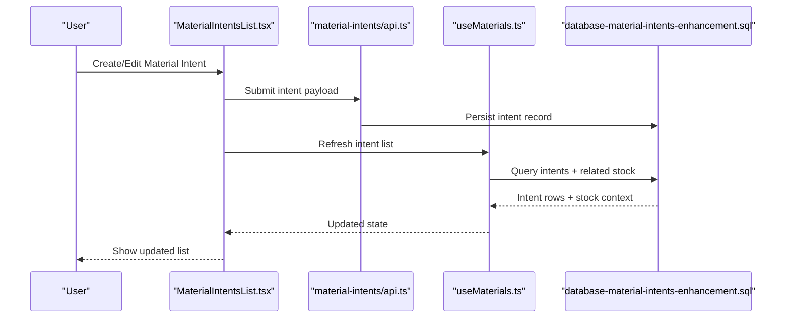
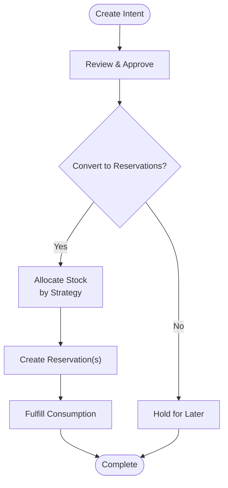
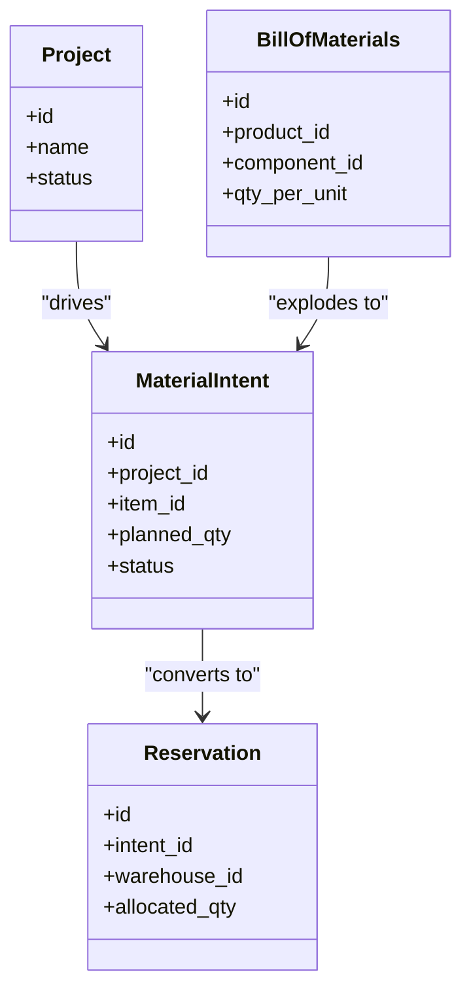
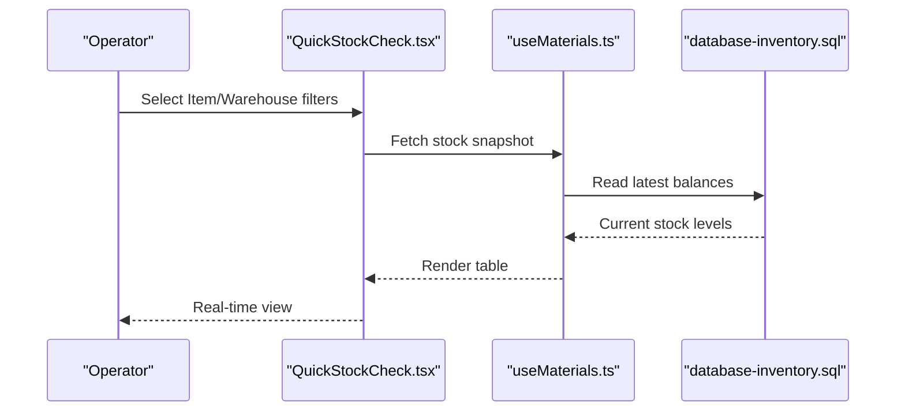
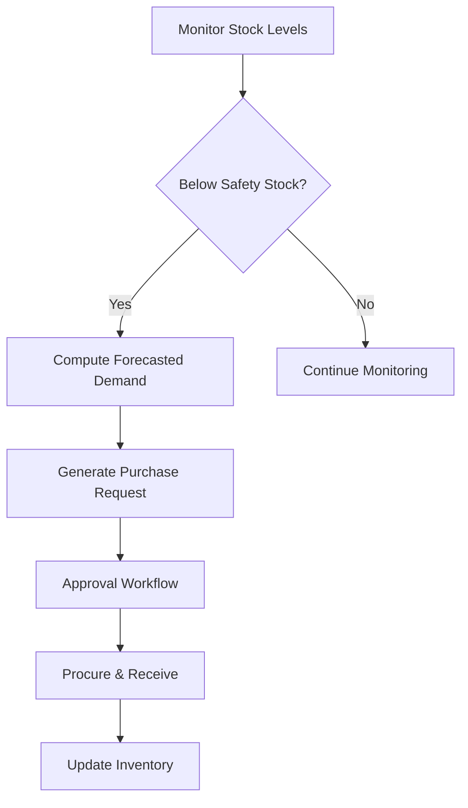
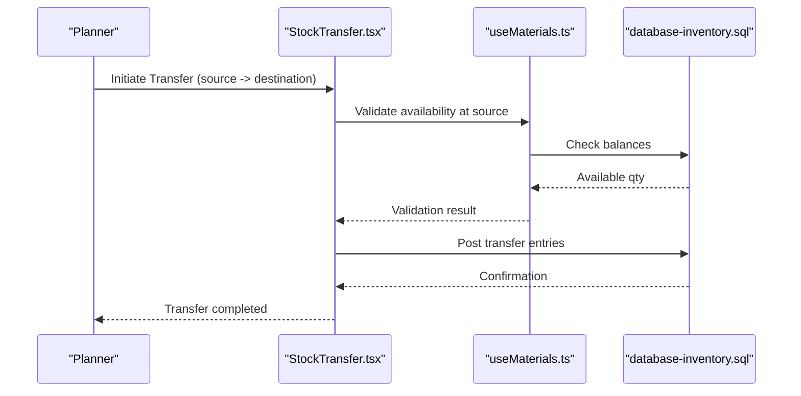
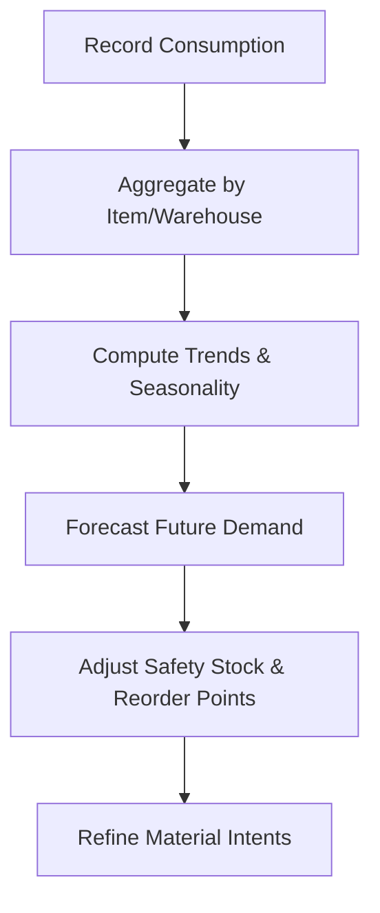
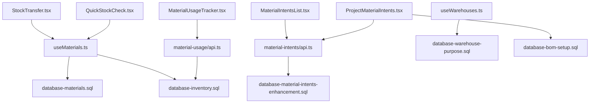

# Material Reservation & Stock Planning

<cite>
**Referenced Files in This Document**
- [material-intents/api.ts](file://src/material-intents/api.ts)
- [material-usage/api.ts](file://src/material-usage/api.ts)
- [pages/MaterialIntentsList.tsx](file://src/pages/MaterialIntentsList.tsx)
- [pages/ProjectMaterialIntents.tsx](file://src/pages/ProjectMaterialIntents.tsx)
- [pages/MaterialUsageTracker.tsx](file://src/pages/MaterialUsageTracker.tsx)
- [pages/StockTransfer.tsx](file://src/pages/StockTransfer.tsx)
- [pages/QuickStockCheck.tsx](file://src/pages/QuickStockCheck.tsx)
- [pages/QuickStockCheckList.tsx](file://src/pages/QuickStockCheckList.tsx)
- [hooks/useMaterials.ts](file://src/hooks/useMaterials.ts)
- [hooks/useWarehouses.ts](file://src/hooks/useWarehouses.ts)
- [database/database-material-intents-enhancement.sql](file://src/database/database-material-intents-enhancement.sql)
- [database/database-inventory.sql](file://src/database/database-inventory.sql)
- [database/database-materials.sql](file://src/database/database-materials.sql)
- [database/database-bom-setup.sql](file://src/database/database-bom-setup.sql)
- [database/database-warehouse-purpose.sql](file://src/database/database-warehouse-purpose.sql)
- [database/database-quick-stock-check.sql](file://src/database/database-quick-stock-check.sql)
</cite>

## Table of Contents
1. [Introduction](#introduction)
2. [Project Structure](#project-structure)
3. [Core Components](#core-components)
4. [Architecture Overview](#architecture-overview)
5. [Detailed Component Analysis](#detailed-component-analysis)
6. [Dependency Analysis](#dependency-analysis)
7. [Performance Considerations](#performance-considerations)
8. [Troubleshooting Guide](#troubleshooting-guide)
9. [Conclusion](#conclusion)
10. [Appendices](#appendices)

## Introduction
This document explains the material reservation and stock planning capabilities implemented in the application. It covers forward-looking material planning via material intents, end-to-end reservation workflows, and stock allocation strategies across warehouses. It also details warehouse inventory integration, real-time stock monitoring, automated replenishment triggers, BOM integration with project requirements, consumption forecasting, stock transfer workflows, inter-warehouse movements, and inventory optimization strategies.

## Project Structure
The feature spans UI pages, hooks for data access, API modules for material intents and usage, and database migrations that define core tables and indexes. The key areas are:
- Material Intents: Define future needs and plan reservations against projects or general demand.
- Material Usage: Track actual consumption to inform forecasts and replenishment.
- Inventory and Warehouses: Maintain stock levels, locations, and movement history.
- Quick Stock Check: Provide fast visibility into current stock by item and warehouse.
- Stock Transfer: Move stock between warehouses and update balances atomically.

**Diagram sources**
- [pages/MaterialIntentsList.tsx](file://src/pages/MaterialIntentsList.tsx)
- [pages/ProjectMaterialIntents.tsx](file://src/pages/ProjectMaterialIntents.tsx)
- [pages/MaterialUsageTracker.tsx](file://src/pages/MaterialUsageTracker.tsx)
- [pages/StockTransfer.tsx](file://src/pages/StockTransfer.tsx)
- [pages/QuickStockCheck.tsx](file://src/pages/QuickStockCheck.tsx)
- [pages/QuickStockCheckList.tsx](file://src/pages/QuickStockCheckList.tsx)
- [hooks/useMaterials.ts](file://src/hooks/useMaterials.ts)
- [hooks/useWarehouses.ts](file://src/hooks/useWarehouses.ts)
- [material-intents/api.ts](file://src/material-intents/api.ts)
- [material-usage/api.ts](file://src/material-usage/api.ts)
- [database/database-material-intents-enhancement.sql](file://src/database/database-material-intents-enhancement.sql)
- [database/database-inventory.sql](file://src/database/database-inventory.sql)
- [database/database-materials.sql](file://src/database/database-materials.sql)
- [database/database-bom-setup.sql](file://src/database/database-bom-setup.sql)
- [database/database-warehouse-purpose.sql](file://src/database/database-warehouse-purpose.sql)
- [database/database-quick-stock-check.sql](file://src/database/database-quick-stock-check.sql)

**Section sources**
- [material-intents/api.ts](file://src/material-intents/api.ts)
- [material-usage/api.ts](file://src/material-usage/api.ts)
- [pages/MaterialIntentsList.tsx](file://src/pages/MaterialIntentsList.tsx)
- [pages/ProjectMaterialIntents.tsx](file://src/pages/ProjectMaterialIntents.tsx)
- [pages/MaterialUsageTracker.tsx](file://src/pages/MaterialUsageTracker.tsx)
- [pages/StockTransfer.tsx](file://src/pages/StockTransfer.tsx)
- [pages/QuickStockCheck.tsx](file://src/pages/QuickStockCheck.tsx)
- [pages/QuickStockCheckList.tsx](file://src/pages/QuickStockCheckList.tsx)
- [hooks/useMaterials.ts](file://src/hooks/useMaterials.ts)
- [hooks/useWarehouses.ts](file://src/hooks/useWarehouses.ts)
- [database/database-material-intents-enhancement.sql](file://src/database/database-material-intents-enhancement.sql)
- [database/database-inventory.sql](file://src/database/database-inventory.sql)
- [database/database-materials.sql](file://src/database/database-materials.sql)
- [database/database-bom-setup.sql](file://src/database/database-bom-setup.sql)
- [database/database-warehouse-purpose.sql](file://src/database/database-warehouse-purpose.sql)
- [database/database-quick-stock-check.sql](file://src/database/database-quick-stock-check.sql)

## Core Components
- Material Intents: Capture planned future demand (by project or general), enabling proactive procurement and allocation.
- Material Usage: Records actual consumption to refine forecasts and drive replenishment signals.
- Inventory and Warehouse Management: Tracks on-hand quantities per item and location, supports transfers and adjustments.
- Quick Stock Check: Provides immediate visibility into available stock across warehouses.
- Stock Transfer: Orchestrates inter-warehouse movements with consistent balance updates.

Key responsibilities:
- Intent lifecycle: create, review, approve, convert to reservations, and fulfill.
- Allocation strategy: reserve against available stock considering safety stock and priority.
- Replenishment triggers: auto-generate purchase requests when projected availability falls below thresholds.
- Forecasting: use historical usage and BOM-driven requirements to predict future needs.

**Section sources**
- [material-intents/api.ts](file://src/material-intents/api.ts)
- [material-usage/api.ts](file://src/material-usage/api.ts)
- [hooks/useMaterials.ts](file://src/hooks/useMaterials.ts)
- [hooks/useWarehouses.ts](file://src/hooks/useWarehouses.ts)
- [database/database-material-intents-enhancement.sql](file://src/database/database-material-intents-enhancement.sql)
- [database/database-inventory.sql](file://src/database/database-inventory.sql)
- [database/database-materials.sql](file://src/database/database-materials.sql)
- [database/database-bom-setup.sql](file://src/database/database-bom-setup.sql)
- [database/database-warehouse-purpose.sql](file://src/database/database-warehouse-purpose.sql)

## Architecture Overview
The system integrates UI components with typed API modules and persistent storage. Data flows from user actions through hooks and API endpoints to database tables, ensuring consistency and auditability.

**Diagram sources**
- [pages/MaterialIntentsList.tsx](file://src/pages/MaterialIntentsList.tsx)
- [material-intents/api.ts](file://src/material-intents/api.ts)
- [hooks/useMaterials.ts](file://src/hooks/useMaterials.ts)
- [database/database-material-intents-enhancement.sql](file://src/database/database-material-intents-enhancement.sql)

## Detailed Component Analysis

### Material Intents and Reservations
Material intents represent forward-looking demand. They can be created at a global level or linked to specific projects. Once approved, intents can be converted into reservations that allocate stock against available supply.

Key concepts:
- Intent types: project-linked vs general demand.
- Status flow: draft -> reviewed -> approved -> reserved -> fulfilled/cancelled.
- Conversion: one intent may split into multiple reservations if stock is distributed across warehouses.

**Diagram sources**
- [pages/MaterialIntentsList.tsx](file://src/pages/MaterialIntentsList.tsx)
- [material-intents/api.ts](file://src/material-intents/api.ts)
- [database/database-material-intents-enhancement.sql](file://src/database/database-material-intents-enhancement.sql)

Practical examples:
- Creating a material reservation:
  - Create an intent for the required item and quantity.
  - Approve the intent.
  - Convert to reservations; the system allocates stock based on strategy and safety stock rules.
  - Confirm fulfillment upon consumption.

- Setting safety stock levels:
  - Configure safety stock per item and warehouse to prevent over-allocation and ensure buffer availability.

- Managing multi-warehouse allocations:
  - When converting intents, distribute reservations across warehouses according to capacity, proximity, and priority.

**Section sources**
- [pages/MaterialIntentsList.tsx](file://src/pages/MaterialIntentsList.tsx)
- [material-intents/api.ts](file://src/material-intents/api.ts)
- [database/database-material-intents-enhancement.sql](file://src/database/database-material-intents-enhancement.sql)

### Project Requirements and BOM Integration
Project-driven planning uses BOM structures to explode requirements into component-level material intents. This ensures accurate forecasting aligned with project milestones.

**Diagram sources**
- [database/database-bom-setup.sql](file://src/database/database-bom-setup.sql)
- [database/database-material-intents-enhancement.sql](file://src/database/database-material-intents-enhancement.sql)

Operational guidance:
- Link BOM items to projects to auto-generate material intents for components.
- Use consumption forecasting to adjust planned quantities based on historical usage patterns.
- Align reservation timing with project schedules to avoid early locking of scarce resources.

**Section sources**
- [database/database-bom-setup.sql](file://src/database/database-bom-setup.sql)
- [database/database-material-intents-enhancement.sql](file://src/database/database-material-intents-enhancement.sql)

### Warehouse Inventory Integration and Real-Time Monitoring
Inventory tracking provides real-time visibility into stock levels per item and warehouse. The quick stock check feature offers rapid queries to support operational decisions.

**Diagram sources**
- [pages/QuickStockCheck.tsx](file://src/pages/QuickStockCheck.tsx)
- [hooks/useMaterials.ts](file://src/hooks/useMaterials.ts)
- [database/database-inventory.sql](file://src/database/database-inventory.sql)

Best practices:
- Use periodic refresh intervals for near-real-time dashboards.
- Cache frequently accessed item-warehouse combinations to reduce load.
- Surface alerts when stock approaches safety stock thresholds.

**Section sources**
- [pages/QuickStockCheck.tsx](file://src/pages/QuickStockCheck.tsx)
- [pages/QuickStockCheckList.tsx](file://src/pages/QuickStockCheckList.tsx)
- [hooks/useMaterials.ts](file://src/hooks/useMaterials.ts)
- [database/database-inventory.sql](file://src/database/database-inventory.sql)
- [database/database-quick-stock-check.sql](file://src/database/database-quick-stock-check.sql)

### Automated Replenishment Triggers
Replenishment automation converts low-stock signals into actionable purchase requests. Triggers consider safety stock, lead times, and forecasted consumption.

Implementation notes:
- Define safety stock parameters per item and warehouse.
- Use consumption history and BOM-driven projections to estimate demand.
- Integrate approval workflows before issuing purchase requests.

**Diagram sources**
- [database/database-material-intents-enhancement.sql](file://src/database/database-material-intents-enhancement.sql)
- [database/database-inventory.sql](file://src/database/database-inventory.sql)
- [database/database-bom-setup.sql](file://src/database/database-bom-setup.sql)

**Section sources**
- [database/database-material-intents-enhancement.sql](file://src/database/database-material-intents-enhancement.sql)
- [database/database-inventory.sql](file://src/database/database-inventory.sql)
- [database/database-bom-setup.sql](file://src/database/database-bom-setup.sql)

### Stock Transfer Workflows and Inter-Warehouse Movements
Stock transfers move inventory between warehouses while maintaining accurate balances and audit trails.

Guidelines:
- Enforce non-negative balances at source during validation.
- Record transfer lines with timestamps and responsible users.
- Support partial transfers and split shipments across multiple destinations.

**Diagram sources**
- [pages/StockTransfer.tsx](file://src/pages/StockTransfer.tsx)
- [hooks/useMaterials.ts](file://src/hooks/useMaterials.ts)
- [database/database-inventory.sql](file://src/database/database-inventory.sql)

**Section sources**
- [pages/StockTransfer.tsx](file://src/pages/StockTransfer.tsx)
- [hooks/useMaterials.ts](file://src/hooks/useMaterials.ts)
- [database/database-inventory.sql](file://src/database/database-inventory.sql)

### Consumption Forecasting and Material Usage Tracking
Actual consumption informs future planning. The usage tracker records outflows and aggregates trends to improve forecast accuracy.

**Diagram sources**
- [pages/MaterialUsageTracker.tsx](file://src/pages/MaterialUsageTracker.tsx)
- [material-usage/api.ts](file://src/material-usage/api.ts)
- [database/database-inventory.sql](file://src/database/database-inventory.sql)

**Section sources**
- [pages/MaterialUsageTracker.tsx](file://src/pages/MaterialUsageTracker.tsx)
- [material-usage/api.ts](file://src/material-usage/api.ts)
- [database/database-inventory.sql](file://src/database/database-inventory.sql)

### Multi-Warehouse Allocation Strategies
Allocation strategies determine how reservations are distributed across warehouses. Common strategies include:
- First-available-by-location: allocate from nearest or highest-priority warehouse.
- Proportional distribution: split across warehouses proportionally to capacity.
- Priority-based: honor pre-defined warehouse priorities and constraints.

Operational considerations:
- Respect safety stock buffers at each warehouse.
- Account for transit time and receiving lead times.
- Log allocation decisions for traceability and audits.

**Section sources**
- [database/database-material-intents-enhancement.sql](file://src/database/database-material-intents-enhancement.sql)
- [database/database-warehouse-purpose.sql](file://src/database/database-warehouse-purpose.sql)

## Dependency Analysis
The following diagram shows dependencies among UI, hooks, API modules, and database layers for material planning and inventory management.

**Diagram sources**
- [pages/MaterialIntentsList.tsx](file://src/pages/MaterialIntentsList.tsx)
- [pages/ProjectMaterialIntents.tsx](file://src/pages/ProjectMaterialIntents.tsx)
- [pages/MaterialUsageTracker.tsx](file://src/pages/MaterialUsageTracker.tsx)
- [pages/StockTransfer.tsx](file://src/pages/StockTransfer.tsx)
- [pages/QuickStockCheck.tsx](file://src/pages/QuickStockCheck.tsx)
- [hooks/useMaterials.ts](file://src/hooks/useMaterials.ts)
- [hooks/useWarehouses.ts](file://src/hooks/useWarehouses.ts)
- [material-intents/api.ts](file://src/material-intents/api.ts)
- [material-usage/api.ts](file://src/material-usage/api.ts)
- [database/database-inventory.sql](file://src/database/database-inventory.sql)
- [database/database-materials.sql](file://src/database/database-materials.sql)
- [database/database-warehouse-purpose.sql](file://src/database/database-warehouse-purpose.sql)
- [database/database-material-intents-enhancement.sql](file://src/database/database-material-intents-enhancement.sql)
- [database/database-bom-setup.sql](file://src/database/database-bom-setup.sql)

**Section sources**
- [pages/MaterialIntentsList.tsx](file://src/pages/MaterialIntentsList.tsx)
- [pages/ProjectMaterialIntents.tsx](file://src/pages/ProjectMaterialIntents.tsx)
- [pages/MaterialUsageTracker.tsx](file://src/pages/MaterialUsageTracker.tsx)
- [pages/StockTransfer.tsx](file://src/pages/StockTransfer.tsx)
- [pages/QuickStockCheck.tsx](file://src/pages/QuickStockCheck.tsx)
- [hooks/useMaterials.ts](file://src/hooks/useMaterials.ts)
- [hooks/useWarehouses.ts](file://src/hooks/useWarehouses.ts)
- [material-intents/api.ts](file://src/material-intents/api.ts)
- [material-usage/api.ts](file://src/material-usage/api.ts)
- [database/database-inventory.sql](file://src/database/database-inventory.sql)
- [database/database-materials.sql](file://src/database/database-materials.sql)
- [database/database-warehouse-purpose.sql](file://src/database/database-warehouse-purpose.sql)
- [database/database-material-intents-enhancement.sql](file://src/database/database-material-intents-enhancement.sql)
- [database/database-bom-setup.sql](file://src/database/database-bom-setup.sql)

## Performance Considerations
- Batch operations: group multiple reservation creations or transfers to minimize round trips.
- Indexing: ensure indexes on item, warehouse, and date fields for frequent queries.
- Pagination: implement server-side pagination for large lists of intents and usage records.
- Caching: cache read-heavy views like quick stock checks with short TTLs.
- Concurrency control: apply optimistic concurrency or row-level locks to prevent double allocation.

[No sources needed since this section provides general guidance]

## Troubleshooting Guide
Common issues and resolutions:
- Negative stock after transfer: validate source availability before posting; enforce non-negative constraints.
- Duplicate reservations: deduplicate intent conversions using idempotency keys or unique constraints.
- Slow stock queries: add composite indexes on item and warehouse; paginate results.
- Inconsistent safety stock alerts: verify threshold calculations and ensure timely refresh cycles.
- BOM explosion mismatches: confirm unit conversions and component mappings; reconcile with actual consumption.

**Section sources**
- [pages/StockTransfer.tsx](file://src/pages/StockTransfer.tsx)
- [pages/QuickStockCheck.tsx](file://src/pages/QuickStockCheck.tsx)
- [hooks/useMaterials.ts](file://src/hooks/useMaterials.ts)
- [database/database-inventory.sql](file://src/database/database-inventory.sql)
- [database/database-material-intents-enhancement.sql](file://src/database/database-material-intents-enhancement.sql)
- [database/database-bom-setup.sql](file://src/database/database-bom-setup.sql)

## Conclusion
The material reservation and stock planning features provide a robust foundation for forward-looking planning, precise reservations, and efficient inventory management. By integrating material intents, usage tracking, BOM-driven forecasting, and multi-warehouse allocation strategies, the system enables proactive replenishment and optimized stock levels. Continuous monitoring and automation further enhance reliability and responsiveness across operations.

[No sources needed since this section summarizes without analyzing specific files]

## Appendices

### Example Workflows

- Creating a material reservation:
  - Create a material intent for the required item and quantity.
  - Approve the intent.
  - Convert to reservations; the system allocates stock based on strategy and safety stock rules.
  - Confirm fulfillment upon consumption.

- Setting up safety stock levels:
  - Configure safety stock per item and warehouse to prevent over-allocation and ensure buffer availability.

- Managing multi-warehouse allocations:
  - When converting intents, distribute reservations across warehouses according to capacity, proximity, and priority.

- Stock transfer workflow:
  - Initiate a transfer from source to destination.
  - Validate availability at source.
  - Post transfer entries and confirm completion.

- BOM integration example:
  - Link BOM items to projects to auto-generate material intents for components.
  - Use consumption forecasting to adjust planned quantities based on historical usage patterns.

[No sources needed since this section provides conceptual examples]