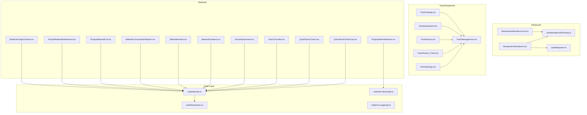
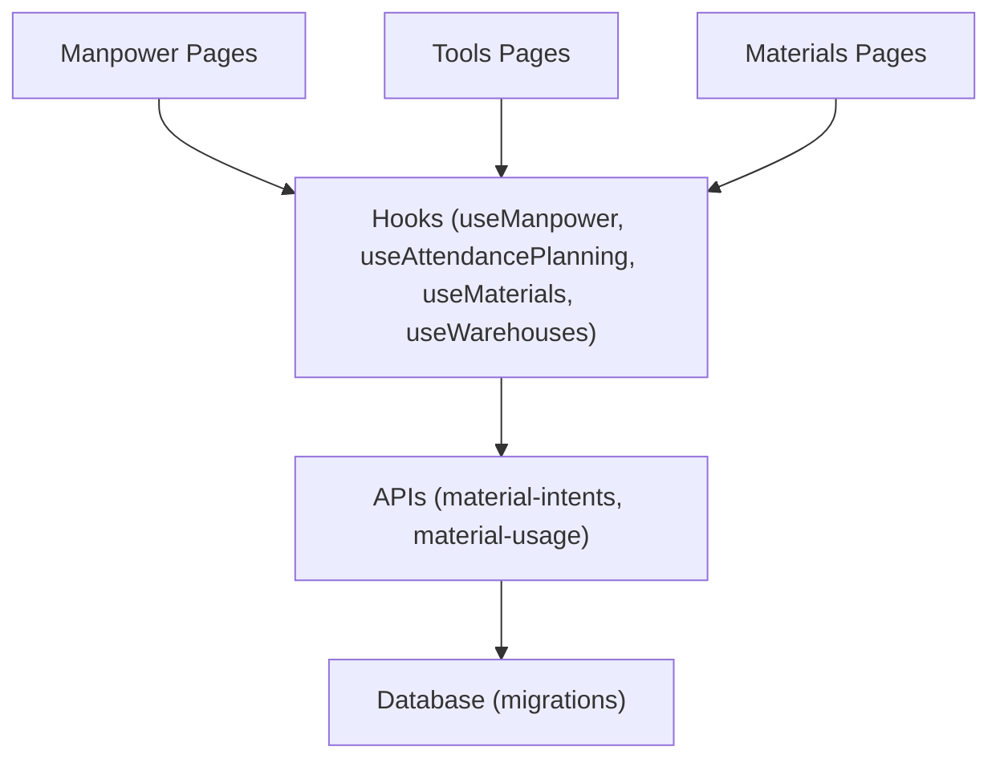
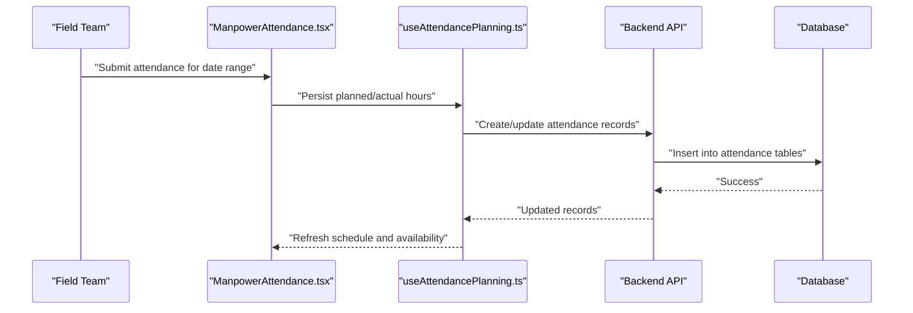
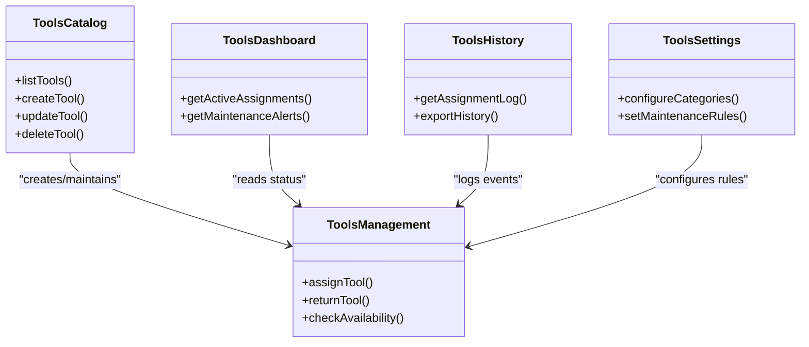
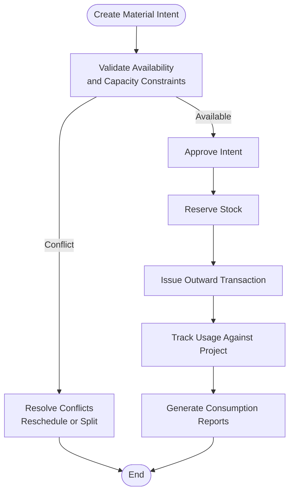
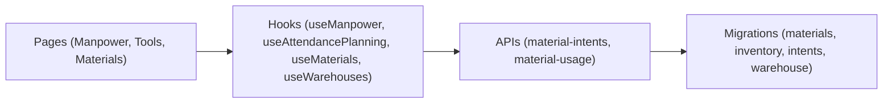
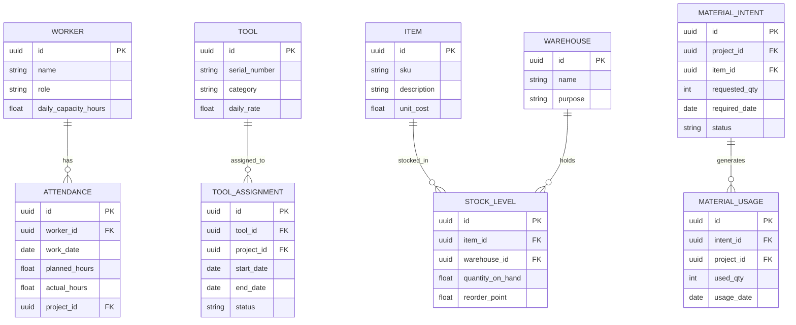

# Resource Allocation & Tracking

<cite>
**Referenced Files in This Document**
- [useManpower.ts](file://src/hooks/useManpower.ts)
- [ManpowerAttendance.tsx](file://src/pages/ManpowerAttendance.tsx)
- [ManpowerAttendanceList.tsx](file://src/pages/ManpowerAttendanceList.tsx)
- [useAttendancePlanning.ts](file://src/hooks/useAttendancePlanning.ts)
- [attendance_planning.sql](file://sql/attendance_planning.sql)
- [attendance_planning_v2.sql](file://sql/attendance_planning_v2.sql)
- [database-manpower-migration.sql](file://src/database-manpower-migration.sql)
- [ToolsCatalog.tsx](file://src/pages/ToolsCatalog.tsx)
- [ToolsDashboard.tsx](file://src/pages/ToolsDashboard.tsx)
- [ToolsHistory.tsx](file://src/pages/ToolsHistory.tsx)
- [ToolsManagement.tsx](file://src/pages/ToolsManagement.tsx)
- [ToolsSettings.tsx](file://src/pages/ToolsSettings.tsx)
- [ToolsHistory_Fixed.tsx](file://src/pages/ToolsHistory_Fixed.tsx)
- [MaterialUsageTracker.tsx](file://src/pages/MaterialUsageTracker.tsx)
- [ProjectMaterialDashboard.tsx](file://src/pages/ProjectMaterialDashboard.tsx)
- [ProjectMaterialIntents.tsx](file://src/pages/ProjectMaterialIntents.tsx)
- [ProjectMaterialList.tsx](file://src/pages/ProjectMaterialList.tsx)
- [MaterialConsumptionReport.tsx](file://src/pages/MaterialConsumptionReport.tsx)
- [MaterialInward.tsx](file://src/pages/MaterialInward.tsx)
- [MaterialOutward.tsx](file://src/pages/MaterialOutward.tsx)
- [StockAdjustment.tsx](file://src/pages/StockAdjustment.tsx)
- [StockTransfer.tsx](file://src/pages/StockTransfer.tsx)
- [QuickStockCheck.tsx](file://src/pages/QuickStockCheck.tsx)
- [QuickStockCheckList.tsx](file://src/pages/QuickStockCheckList.tsx)
- [useMaterials.ts](file://src/hooks/useMaterials.ts)
- [useWarehouses.ts](file://src/hooks/useWarehouses.ts)
- [material-intents/api.ts](file://src/material-intents/api.ts)
- [material-usage/api.ts](file://src/material-usage/api.ts)
- [database-materials.sql](file://src/database-materials.sql)
- [database-inventory.sql](file://src/database-inventory.sql)
- [database-material-intents-enhancement.sql](file://src/database-material-intents-enhancement.sql)
- [database-material-inward-update.sql](file://src/database-material-inward-update.sql)
- [database-warehouse-purpose.sql](file://src/database-warehouse-purpose.sql)
- [database-quick-stock-check.sql](file://src/database-quick-stock-check.sql)
- [database-complete.sql](file://src/database-complete.sql)
- [database-setup.sql](file://src/database-setup.sql)
- [database-tables.sql](file://src/database-tables.sql)
- [supabase/table-design26.md](file://tabledesign26.md)
</cite>

## Table of Contents
1. [Introduction](#introduction)
2. [Project Structure](#project-structure)
3. [Core Components](#core-components)
4. [Architecture Overview](#architecture-overview)
5. [Detailed Component Analysis](#detailed-component-analysis)
6. [Dependency Analysis](#dependency-analysis)
7. [Performance Considerations](#performance-considerations)
8. [Troubleshooting Guide](#troubleshooting-guide)
9. [Conclusion](#conclusion)
10. [Appendices](#appendices)

## Introduction
This document explains the Resource Allocation and Tracking functionality implemented across manpower, equipment (tools), and materials. It covers:
- Manpower allocation and attendance planning
- Equipment scheduling and maintenance tracking
- Material reservation via intent-based workflows
- Utilization tracking, availability calendars, and conflict resolution
- Capacity constraints and optimization strategies
- Warehouse integration, stock monitoring, and replenishment triggers
- Cost tracking, billing linkage, and profitability analysis
- Mobile access for field teams and real-time synchronization patterns

The goal is to provide a comprehensive guide for setting up resource pools, defining capacity constraints, optimizing distribution across projects, and generating utilization reports.

## Project Structure
Resource-related features are organized by domain with clear separation between UI pages, hooks/data access, and database migrations:
- Manpower: Attendance pages and planning hooks
- Tools/Equipment: Catalog, dashboard, history, management, settings
- Materials: Usage tracker, project dashboards, inward/outward flows, stock adjustments/transfers, quick checks
- Data layer: Hooks and API modules for materials and intents; SQL migrations for schemas and enhancements

**Diagram sources**
- [ManpowerAttendance.tsx](file://src/pages/ManpowerAttendance.tsx)
- [ManpowerAttendanceList.tsx](file://src/pages/ManpowerAttendanceList.tsx)
- [useAttendancePlanning.ts](file://src/hooks/useAttendancePlanning.ts)
- [useManpower.ts](file://src/hooks/useManpower.ts)
- [ToolsCatalog.tsx](file://src/pages/ToolsCatalog.tsx)
- [ToolsDashboard.tsx](file://src/pages/ToolsDashboard.tsx)
- [ToolsHistory.tsx](file://src/pages/ToolsHistory.tsx)
- [ToolsManagement.tsx](file://src/pages/ToolsManagement.tsx)
- [ToolsSettings.tsx](file://src/pages/ToolsSettings.tsx)
- [ToolsHistory_Fixed.tsx](file://src/pages/ToolsHistory_Fixed.tsx)
- [MaterialUsageTracker.tsx](file://src/pages/MaterialUsageTracker.tsx)
- [ProjectMaterialDashboard.tsx](file://src/pages/ProjectMaterialDashboard.tsx)
- [ProjectMaterialIntents.tsx](file://src/pages/ProjectMaterialIntents.tsx)
- [ProjectMaterialList.tsx](file://src/pages/ProjectMaterialList.tsx)
- [MaterialConsumptionReport.tsx](file://src/pages/MaterialConsumptionReport.tsx)
- [MaterialInward.tsx](file://src/pages/MaterialInward.tsx)
- [MaterialOutward.tsx](file://src/pages/MaterialOutward.tsx)
- [StockAdjustment.tsx](file://src/pages/StockAdjustment.tsx)
- [StockTransfer.tsx](file://src/pages/StockTransfer.tsx)
- [QuickStockCheck.tsx](file://src/pages/QuickStockCheck.tsx)
- [QuickStockCheckList.tsx](file://src/pages/QuickStockCheckList.tsx)
- [useMaterials.ts](file://src/hooks/useMaterials.ts)
- [useWarehouses.ts](file://src/hooks/useWarehouses.ts)
- [material-intents/api.ts](file://src/material-intents/api.ts)
- [material-usage/api.ts](file://src/material-usage/api.ts)

**Section sources**
- [ManpowerAttendance.tsx](file://src/pages/ManpowerAttendance.tsx)
- [ManpowerAttendanceList.tsx](file://src/pages/ManpowerAttendanceList.tsx)
- [useAttendancePlanning.ts](file://src/hooks/useAttendancePlanning.ts)
- [useManpower.ts](file://src/hooks/useManpower.ts)
- [ToolsCatalog.tsx](file://src/pages/ToolsCatalog.tsx)
- [ToolsDashboard.tsx](file://src/pages/ToolsDashboard.tsx)
- [ToolsHistory.tsx](file://src/pages/ToolsHistory.tsx)
- [ToolsManagement.tsx](file://src/pages/ToolsManagement.tsx)
- [ToolsSettings.tsx](file://src/pages/ToolsSettings.tsx)
- [ToolsHistory_Fixed.tsx](file://src/pages/ToolsHistory_Fixed.tsx)
- [MaterialUsageTracker.tsx](file://src/pages/MaterialUsageTracker.tsx)
- [ProjectMaterialDashboard.tsx](file://src/pages/ProjectMaterialDashboard.tsx)
- [ProjectMaterialIntents.tsx](file://src/pages/ProjectMaterialIntents.tsx)
- [ProjectMaterialList.tsx](file://src/pages/ProjectMaterialList.tsx)
- [MaterialConsumptionReport.tsx](file://src/pages/MaterialConsumptionReport.tsx)
- [MaterialInward.tsx](file://src/pages/MaterialInward.tsx)
- [MaterialOutward.tsx](file://src/pages/MaterialOutward.tsx)
- [StockAdjustment.tsx](file://src/pages/StockAdjustment.tsx)
- [StockTransfer.tsx](file://src/pages/StockTransfer.tsx)
- [QuickStockCheck.tsx](file://src/pages/QuickStockCheck.tsx)
- [QuickStockCheckList.tsx](file://src/pages/QuickStockCheckList.tsx)
- [useMaterials.ts](file://src/hooks/useMaterials.ts)
- [useWarehouses.ts](file://src/hooks/useWarehouses.ts)
- [material-intents/api.ts](file://src/material-intents/api.ts)
- [material-usage/api.ts](file://src/material-usage/api.ts)

## Core Components
- Manpower Allocation and Planning
  - Attendance capture and list views
  - Planning hooks for scheduling and availability
  - Migration scripts for manpower schema
- Tools/Equipment Management
  - Catalog, dashboard, history, management, and settings
  - History variants for improved reporting
- Materials Reservation and Usage
  - Intent-based reservations linked to projects
  - Inward/outward flows, stock adjustments, transfers
  - Quick stock checks and consumption reports
  - Project-level material dashboards and lists
- Data Access
  - Hooks for materials and warehouses
  - APIs for material intents and usage

Key responsibilities:
- Define resource pools (workers, tools, materials)
- Track allocations and usage over time
- Enforce capacity constraints and resolve conflicts
- Provide utilization and cost insights
- Support mobile-friendly interfaces and real-time updates

**Section sources**
- [useManpower.ts](file://src/hooks/useManpower.ts)
- [ManpowerAttendance.tsx](file://src/pages/ManpowerAttendance.tsx)
- [ManpowerAttendanceList.tsx](file://src/pages/ManpowerAttendanceList.tsx)
- [useAttendancePlanning.ts](file://src/hooks/useAttendancePlanning.ts)
- [database-manpower-migration.sql](file://src/database-manpower-migration.sql)
- [ToolsCatalog.tsx](file://src/pages/ToolsCatalog.tsx)
- [ToolsDashboard.tsx](file://src/pages/ToolsDashboard.tsx)
- [ToolsHistory.tsx](file://src/pages/ToolsHistory.tsx)
- [ToolsManagement.tsx](file://src/pages/ToolsManagement.tsx)
- [ToolsSettings.tsx](file://src/pages/ToolsSettings.tsx)
- [ToolsHistory_Fixed.tsx](file://src/pages/ToolsHistory_Fixed.tsx)
- [MaterialUsageTracker.tsx](file://src/pages/MaterialUsageTracker.tsx)
- [ProjectMaterialDashboard.tsx](file://src/pages/ProjectMaterialDashboard.tsx)
- [ProjectMaterialIntents.tsx](file://src/pages/ProjectMaterialIntents.tsx)
- [ProjectMaterialList.tsx](file://src/pages/ProjectMaterialList.tsx)
- [MaterialConsumptionReport.tsx](file://src/pages/MaterialConsumptionReport.tsx)
- [MaterialInward.tsx](file://src/pages/MaterialInward.tsx)
- [MaterialOutward.tsx](file://src/pages/MaterialOutward.tsx)
- [StockAdjustment.tsx](file://src/pages/StockAdjustment.tsx)
- [StockTransfer.tsx](file://src/pages/StockTransfer.tsx)
- [QuickStockCheck.tsx](file://src/pages/QuickStockCheck.tsx)
- [QuickStockCheckList.tsx](file://src/pages/QuickStockCheckList.tsx)
- [useMaterials.ts](file://src/hooks/useMaterials.ts)
- [useWarehouses.ts](file://src/hooks/useWarehouses.ts)
- [material-intents/api.ts](file://src/material-intents/api.ts)
- [material-usage/api.ts](file://src/material-usage/api.ts)

## Architecture Overview
The system follows a layered architecture:
- Presentation layer: React pages for each resource type
- Data access layer: Hooks and API modules
- Persistence layer: Database tables and migrations
- Cross-cutting: Real-time sync via presence-aware hooks and polling intervals

**Diagram sources**
- [ManpowerAttendance.tsx](file://src/pages/ManpowerAttendance.tsx)
- [ManpowerAttendanceList.tsx](file://src/pages/ManpowerAttendanceList.tsx)
- [useAttendancePlanning.ts](file://src/hooks/useAttendancePlanning.ts)
- [useManpower.ts](file://src/hooks/useManpower.ts)
- [ToolsCatalog.tsx](file://src/pages/ToolsCatalog.tsx)
- [ToolsDashboard.tsx](file://src/pages/ToolsDashboard.tsx)
- [ToolsHistory.tsx](file://src/pages/ToolsHistory.tsx)
- [ToolsManagement.tsx](file://src/pages/ToolsManagement.tsx)
- [ToolsSettings.tsx](file://src/pages/ToolsSettings.tsx)
- [ToolsHistory_Fixed.tsx](file://src/pages/ToolsHistory_Fixed.tsx)
- [MaterialUsageTracker.tsx](file://src/pages/MaterialUsageTracker.tsx)
- [ProjectMaterialDashboard.tsx](file://src/pages/ProjectMaterialDashboard.tsx)
- [ProjectMaterialIntents.tsx](file://src/pages/ProjectMaterialIntents.tsx)
- [ProjectMaterialList.tsx](file://src/pages/ProjectMaterialList.tsx)
- [MaterialConsumptionReport.tsx](file://src/pages/MaterialConsumptionReport.tsx)
- [MaterialInward.tsx](file://src/pages/MaterialInward.tsx)
- [MaterialOutward.tsx](file://src/pages/MaterialOutward.tsx)
- [StockAdjustment.tsx](file://src/pages/StockAdjustment.tsx)
- [StockTransfer.tsx](file://src/pages/StockTransfer.tsx)
- [QuickStockCheck.tsx](file://src/pages/QuickStockCheck.tsx)
- [QuickStockCheckList.tsx](file://src/pages/QuickStockCheckList.tsx)
- [useMaterials.ts](file://src/hooks/useMaterials.ts)
- [useWarehouses.ts](file://src/hooks/useWarehouses.ts)
- [material-intents/api.ts](file://src/material-intents/api.ts)
- [material-usage/api.ts](file://src/material-usage/api.ts)

## Detailed Component Analysis

### Manpower Allocation and Attendance Planning
- Purpose: Capture daily attendance, plan workforce availability, and track utilization against projects.
- Key elements:
  - Attendance entry and list views
  - Planning hook for scheduling and availability
  - Manpower data access hook
  - Schema migrations for attendance and planning

**Diagram sources**
- [ManpowerAttendance.tsx](file://src/pages/ManpowerAttendance.tsx)
- [useAttendancePlanning.ts](file://src/hooks/useAttendancePlanning.ts)
- [attendance_planning.sql](file://sql/attendance_planning.sql)
- [attendance_planning_v2.sql](file://sql/attendance_planning_v2.sql)
- [database-manpower-migration.sql](file://src/database-manpower-migration.sql)

Capacity constraints and conflict resolution:
- Define per-worker daily capacity (hours or shifts)
- Check overlapping assignments within the same period
- Flag conflicts and suggest alternative slots
- Enforce minimum rest periods and skill requirements

Availability calendar:
- Aggregate planned vs actual hours
- Visualize free/busy windows
- Filter by project, team, or role

Utilization tracking:
- Compute utilization ratios per worker and team
- Compare planned vs delivered hours
- Export summaries for payroll and performance reviews

Mobile access and real-time sync:
- Use presence-aware hooks and periodic refresh
- Offline-friendly forms with queued submissions
- Conflict detection before committing changes

Examples:
- Set up a worker pool with roles and capacities
- Plan weekly schedules and validate overlaps
- Generate utilization reports by project

**Section sources**
- [ManpowerAttendance.tsx](file://src/pages/ManpowerAttendance.tsx)
- [ManpowerAttendanceList.tsx](file://src/pages/ManpowerAttendanceList.tsx)
- [useAttendancePlanning.ts](file://src/hooks/useAttendancePlanning.ts)
- [useManpower.ts](file://src/hooks/useManpower.ts)
- [attendance_planning.sql](file://sql/attendance_planning.sql)
- [attendance_planning_v2.sql](file://sql/attendance_planning_v2.sql)
- [database-manpower-migration.sql](file://src/database-manpower-migration.sql)

### Tools/Equipment Scheduling and Maintenance
- Purpose: Manage tool catalogs, track assignments, and maintain histories for equipment.
- Key elements:
  - Catalog and management pages
  - Dashboard for overview and alerts
  - History views for auditability
  - Settings for categories and statuses

**Diagram sources**
- [ToolsCatalog.tsx](file://src/pages/ToolsCatalog.tsx)
- [ToolsManagement.tsx](file://src/pages/ToolsManagement.tsx)
- [ToolsDashboard.tsx](file://src/pages/ToolsDashboard.tsx)
- [ToolsHistory.tsx](file://src/pages/ToolsHistory.tsx)
- [ToolsHistory_Fixed.tsx](file://src/pages/ToolsHistory_Fixed.tsx)
- [ToolsSettings.tsx](file://src/pages/ToolsSettings.tsx)

Scheduling and availability:
- Define tool types, serial numbers, and locations
- Reserve tools for specific dates and projects
- Prevent double-booking through validation

Maintenance scheduling:
- Configure maintenance intervals and tasks
- Trigger alerts when due
- Record service logs and downtime

Utilization reporting:
- Track assignment duration and frequency
- Identify underused or overused assets
- Optimize fleet size based on demand

Cost tracking and billing:
- Assign hourly/daily rates per tool
- Link usage to projects for cost allocation
- Integrate with invoicing for billable equipment

Mobile access:
- Scan QR/barcodes for check-in/out
- Submit maintenance notes offline
- Sync when connectivity resumes

**Section sources**
- [ToolsCatalog.tsx](file://src/pages/ToolsCatalog.tsx)
- [ToolsManagement.tsx](file://src/pages/ToolsManagement.tsx)
- [ToolsDashboard.tsx](file://src/pages/ToolsDashboard.tsx)
- [ToolsHistory.tsx](file://src/pages/ToolsHistory.tsx)
- [ToolsHistory_Fixed.tsx](file://src/pages/ToolsHistory_Fixed.tsx)
- [ToolsSettings.tsx](file://src/pages/ToolsSettings.tsx)

### Materials Reservation, Inventory, and Usage
- Purpose: Enable intent-based reservations, manage inventory flows, and analyze consumption.
- Key elements:
  - Intent creation and approval workflow
  - Inward/outward transactions
  - Stock adjustments and transfers
  - Quick stock checks and consumption reports
  - Project-level dashboards and lists

**Diagram sources**
- [ProjectMaterialIntents.tsx](file://src/pages/ProjectMaterialIntents.tsx)
- [material-intents/api.ts](file://src/material-intents/api.ts)
- [MaterialOutward.tsx](file://src/pages/MaterialOutward.tsx)
- [MaterialUsageTracker.tsx](file://src/pages/MaterialUsageTracker.tsx)
- [MaterialConsumptionReport.tsx](file://src/pages/MaterialConsumptionReport.tsx)

Reservation and conflict resolution:
- Intent captures requested items, quantities, and dates
- Availability checks prevent over-allocation
- Conflict resolution supports rescheduling or partial fulfillment

Inventory integration:
- Inward receipts increase stock levels
- Outward issues decrease stock and link to projects
- Adjustments correct discrepancies
- Transfers move stock between warehouses

Stock monitoring and replenishment:
- Monitor current stock levels and trends
- Set reorder points and thresholds
- Automated triggers to create purchase requests or alerts

Warehouse management:
- Multi-warehouse support with purpose definitions
- Location-based picking and staging
- Audit trails for all movements

Utilization and profitability:
- Track material usage per project and phase
- Calculate cost of goods consumed
- Integrate with billing for accurate revenue recognition

Mobile access:
- Barcode scanning for inbound/outbound
- Offline-capable forms with sync queues
- Real-time visibility for site teams

**Section sources**
- [ProjectMaterialIntents.tsx](file://src/pages/ProjectMaterialIntents.tsx)
- [MaterialUsageTracker.tsx](file://src/pages/MaterialUsageTracker.tsx)
- [ProjectMaterialDashboard.tsx](file://src/pages/ProjectMaterialDashboard.tsx)
- [ProjectMaterialList.tsx](file://src/pages/ProjectMaterialList.tsx)
- [MaterialConsumptionReport.tsx](file://src/pages/MaterialConsumptionReport.tsx)
- [MaterialInward.tsx](file://src/pages/MaterialInward.tsx)
- [MaterialOutward.tsx](file://src/pages/MaterialOutward.tsx)
- [StockAdjustment.tsx](file://src/pages/StockAdjustment.tsx)
- [StockTransfer.tsx](file://src/pages/StockTransfer.tsx)
- [QuickStockCheck.tsx](file://src/pages/QuickStockCheck.tsx)
- [QuickStockCheckList.tsx](file://src/pages/QuickStockCheckList.tsx)
- [useMaterials.ts](file://src/hooks/useMaterials.ts)
- [useWarehouses.ts](file://src/hooks/useWarehouses.ts)
- [material-intents/api.ts](file://src/material-intents/api.ts)
- [material-usage/api.ts](file://src/material-usage/api.ts)
- [database-materials.sql](file://src/database-materials.sql)
- [database-inventory.sql](file://src/database-inventory.sql)
- [database-material-intents-enhancement.sql](file://src/database-material-intents-enhancement.sql)
- [database-material-inward-update.sql](file://src/database-material-inward-update.sql)
- [database-warehouse-purpose.sql](file://src/database-warehouse-purpose.sql)
- [database-quick-stock-check.sql](file://src/database-quick-stock-check.sql)

## Dependency Analysis
Inter-module dependencies:
- UI pages depend on hooks for data operations
- Hooks depend on API modules for persistence
- API modules interact with database tables defined in migrations
- Cross-cutting concerns like presence and real-time updates enhance responsiveness

**Diagram sources**
- [ManpowerAttendance.tsx](file://src/pages/ManpowerAttendance.tsx)
- [ManpowerAttendanceList.tsx](file://src/pages/ManpowerAttendanceList.tsx)
- [useAttendancePlanning.ts](file://src/hooks/useAttendancePlanning.ts)
- [useManpower.ts](file://src/hooks/useManpower.ts)
- [ToolsCatalog.tsx](file://src/pages/ToolsCatalog.tsx)
- [ToolsDashboard.tsx](file://src/pages/ToolsDashboard.tsx)
- [ToolsHistory.tsx](file://src/pages/ToolsHistory.tsx)
- [ToolsManagement.tsx](file://src/pages/ToolsManagement.tsx)
- [ToolsSettings.tsx](file://src/pages/ToolsSettings.tsx)
- [ToolsHistory_Fixed.tsx](file://src/pages/ToolsHistory_Fixed.tsx)
- [MaterialUsageTracker.tsx](file://src/pages/MaterialUsageTracker.tsx)
- [ProjectMaterialDashboard.tsx](file://src/pages/ProjectMaterialDashboard.tsx)
- [ProjectMaterialIntents.tsx](file://src/pages/ProjectMaterialIntents.tsx)
- [ProjectMaterialList.tsx](file://src/pages/ProjectMaterialList.tsx)
- [MaterialConsumptionReport.tsx](file://src/pages/MaterialConsumptionReport.tsx)
- [MaterialInward.tsx](file://src/pages/MaterialInward.tsx)
- [MaterialOutward.tsx](file://src/pages/MaterialOutward.tsx)
- [StockAdjustment.tsx](file://src/pages/StockAdjustment.tsx)
- [StockTransfer.tsx](file://src/pages/StockTransfer.tsx)
- [QuickStockCheck.tsx](file://src/pages/QuickStockCheck.tsx)
- [QuickStockCheckList.tsx](file://src/pages/QuickStockCheckList.tsx)
- [useMaterials.ts](file://src/hooks/useMaterials.ts)
- [useWarehouses.ts](file://src/hooks/useWarehouses.ts)
- [material-intents/api.ts](file://src/material-intents/api.ts)
- [material-usage/api.ts](file://src/material-usage/api.ts)
- [database-materials.sql](file://src/database-materials.sql)
- [database-inventory.sql](file://src/database-inventory.sql)
- [database-material-intents-enhancement.sql](file://src/database-material-intents-enhancement.sql)
- [database-material-inward-update.sql](file://src/database-material-inward-update.sql)
- [database-warehouse-purpose.sql](file://src/database-warehouse-purpose.sql)
- [database-quick-stock-check.sql](file://src/database-quick-stock-check.sql)

**Section sources**
- [useManpower.ts](file://src/hooks/useManpower.ts)
- [useAttendancePlanning.ts](file://src/hooks/useAttendancePlanning.ts)
- [useMaterials.ts](file://src/hooks/useMaterials.ts)
- [useWarehouses.ts](file://src/hooks/useWarehouses.ts)
- [material-intents/api.ts](file://src/material-intents/api.ts)
- [material-usage/api.ts](file://src/material-usage/api.ts)
- [database-materials.sql](file://src/database-materials.sql)
- [database-inventory.sql](file://src/database-inventory.sql)
- [database-material-intents-enhancement.sql](file://src/database-material-intents-enhancement.sql)
- [database-material-inward-update.sql](file://src/database-material-inward-update.sql)
- [database-warehouse-purpose.sql](file://src/database-warehouse-purpose.sql)
- [database-quick-stock-check.sql](file://src/database-quick-stock-check.sql)

## Performance Considerations
- Batch operations for bulk updates (e.g., attendance imports, stock adjustments)
- Pagination and virtualization for large datasets (e.g., material lists, tool histories)
- Caching strategies for read-heavy queries (e.g., catalog lookups, availability calendars)
- Optimistic UI updates with rollback on failure
- Efficient indexing on frequently queried fields (dates, project IDs, item SKUs)
- Debounced search and filtering in material and tool catalogs
- Background jobs for report generation and reconciliation

[No sources needed since this section provides general guidance]

## Troubleshooting Guide
Common issues and resolutions:
- Duplicate reservations or over-allocations
  - Validate availability before committing
  - Implement idempotent operations and conflict checks
- Inventory mismatches
  - Reconcile inward/outward entries
  - Use stock adjustment workflows with approvals
- Missing maintenance records
  - Enforce mandatory fields for tool lifecycle events
  - Periodic audits and automated reminders
- Slow loading times
  - Add indexes and optimize queries
  - Reduce payload sizes with selective fields
- Offline sync failures
  - Queue local changes and retry with backoff
  - Provide user feedback and manual retry options

**Section sources**
- [ProjectMaterialIntents.tsx](file://src/pages/ProjectMaterialIntents.tsx)
- [MaterialOutward.tsx](file://src/pages/MaterialOutward.tsx)
- [StockAdjustment.tsx](file://src/pages/StockAdjustment.tsx)
- [ToolsHistory.tsx](file://src/pages/ToolsHistory.tsx)
- [ToolsHistory_Fixed.tsx](file://src/pages/ToolsHistory_Fixed.tsx)

## Conclusion
The Resource Allocation and Tracking module integrates manpower planning, equipment management, and material reservation into a cohesive system. By leveraging intent-based workflows, robust inventory controls, and utilization reporting, organizations can optimize resource distribution, reduce conflicts, and improve profitability. Mobile-friendly interfaces and real-time synchronization ensure field teams remain productive and informed.

[No sources needed since this section summarizes without analyzing specific files]

## Appendices

### Setup Examples
- Manpower
  - Define worker profiles with roles and capacities
  - Create weekly plans and validate overlaps
  - Generate utilization reports by project
- Tools/Equipment
  - Populate catalog with categories and maintenance rules
  - Assign tools to projects and track history
  - Schedule preventive maintenance and monitor alerts
- Materials
  - Configure warehouses and item masters
  - Create material intents and approve reservations
  - Process inward/outward transactions and adjust stock
  - Run consumption reports and set reorder points

**Section sources**
- [useManpower.ts](file://src/hooks/useManpower.ts)
- [useAttendancePlanning.ts](file://src/hooks/useAttendancePlanning.ts)
- [ToolsCatalog.tsx](file://src/pages/ToolsCatalog.tsx)
- [ToolsManagement.tsx](file://src/pages/ToolsManagement.tsx)
- [ToolsSettings.tsx](file://src/pages/ToolsSettings.tsx)
- [ProjectMaterialIntents.tsx](file://src/pages/ProjectMaterialIntents.tsx)
- [MaterialInward.tsx](file://src/pages/MaterialInward.tsx)
- [MaterialOutward.tsx](file://src/pages/MaterialOutward.tsx)
- [StockAdjustment.tsx](file://src/pages/StockAdjustment.tsx)
- [QuickStockCheck.tsx](file://src/pages/QuickStockCheck.tsx)
- [MaterialConsumptionReport.tsx](file://src/pages/MaterialConsumptionReport.tsx)

### Data Models Overview
High-level entities involved in resource allocation and tracking:
- Workers and attendance records
- Tools and assignment logs
- Items, warehouses, and stock levels
- Material intents and usage entries

**Diagram sources**
- [database-manpower-migration.sql](file://src/database-manpower-migration.sql)
- [attendance_planning.sql](file://sql/attendance_planning.sql)
- [attendance_planning_v2.sql](file://sql/attendance_planning_v2.sql)
- [database-materials.sql](file://src/database-materials.sql)
- [database-inventory.sql](file://src/database-inventory.sql)
- [database-material-intents-enhancement.sql](file://src/database-material-intents-enhancement.sql)
- [database-material-inward-update.sql](file://src/database-material-inward-update.sql)
- [database-warehouse-purpose.sql](file://src/database-warehouse-purpose.sql)
- [database-quick-stock-check.sql](file://src/database-quick-stock-check.sql)