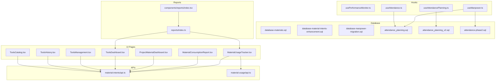
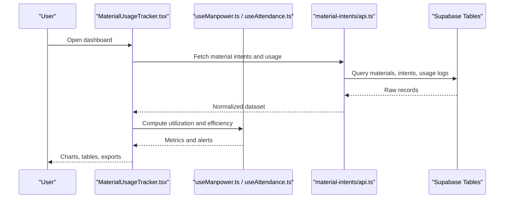
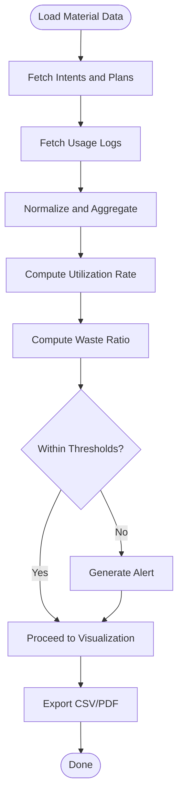
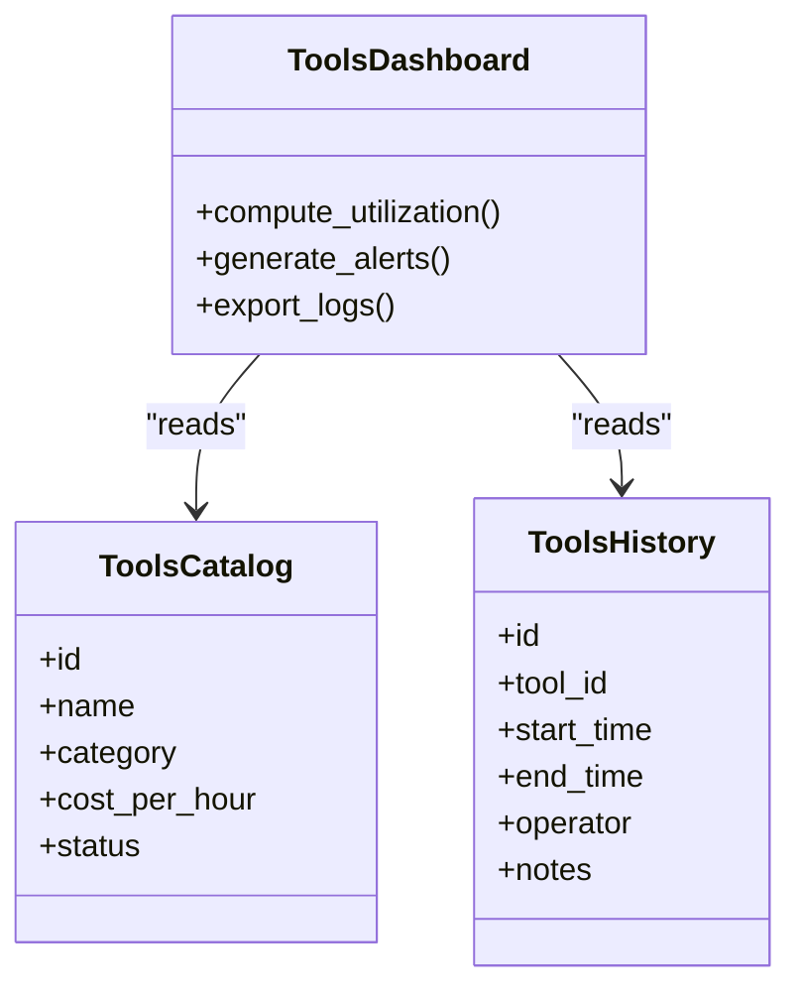
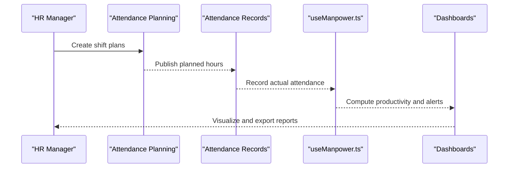
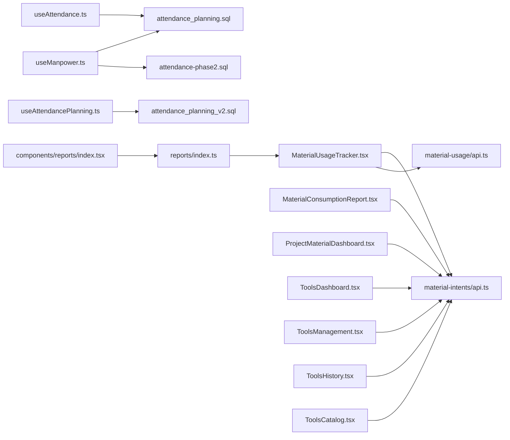

# Resource Utilization Tracking & Analytics

<cite>
**Referenced Files in This Document**
- [MaterialUsageTracker.tsx](file://src/pages/MaterialUsageTracker.tsx)
- [MaterialConsumptionReport.tsx](file://src/pages/MaterialConsumptionReport.tsx)
- [ProjectMaterialDashboard.tsx](file://src/pages/ProjectMaterialDashboard.tsx)
- [usePerformanceMonitor.ts](file://src/hooks/usePerformanceMonitor.ts)
- [api.ts](file://src/material-intents/api.ts)
- [api.ts](file://src/material-usage/api.ts)
- [database-material-intents-enhancement.sql](file://src/database-material-intents-enhancement.sql)
- [database-materials.sql](file://src/database-materials.sql)
- [database-manpower-migration.sql](file://src/database-manpower-migration.sql)
- [ToolsDashboard.tsx](file://src/pages/ToolsDashboard.tsx)
- [ToolsManagement.tsx](file://src/pages/ToolsManagement.tsx)
- [ToolsHistory.tsx](file://src/pages/ToolsHistory.tsx)
- [ToolsCatalog.tsx](file://src/pages/ToolsCatalog.tsx)
- [useManpower.ts](file://src/hooks/useManpower.ts)
- [useAttendance.ts](file://src/hooks/useAttendance.ts)
- [useAttendancePlanning.ts](file://src/hooks/useAttendancePlanning.ts)
- [attendance_planning.sql](file://sql/attendance_planning.sql)
- [attendance_planning_v2.sql](file://sql/attendance_planning_v2.sql)
- [attendance-phase2.sql](file://sql/attendance-phase2.sql)
- [reports/index.ts](file://src/reports/index.ts)
- [components/reports/index.tsx](file://src/components/reports/index.tsx)
</cite>

## Table of Contents
1. [Introduction](#introduction)
2. [Project Structure](#project-structure)
3. [Core Components](#core-components)
4. [Architecture Overview](#architecture-overview)
5. [Detailed Component Analysis](#detailed-component-analysis)
6. [Dependency Analysis](#dependency-analysis)
7. [Performance Considerations](#performance-considerations)
8. [Troubleshooting Guide](#troubleshooting-guide)
9. [Conclusion](#conclusion)
10. [Appendices](#appendices)

## Introduction
This document explains how resource utilization tracking and analytics are implemented across materials, tools/equipment, and manpower. It covers performance metrics collection, utilization rate calculations, efficiency analysis, dashboard visualization, custom report generation, trend analysis, thresholds/alerting, export capabilities, and integration points with financial systems for cost allocation, billing automation, and budget variance analysis. The goal is to provide both a high-level understanding and actionable guidance for setting up thresholds, generating profitability reports, identifying underutilized resources, and exporting data for external reporting tools.

## Project Structure
The resource utilization feature spans UI pages, hooks, APIs, and database migrations:
- Pages: Material usage tracker, consumption report, project material dashboard, tools dashboards and history, manpower attendance and planning.
- Hooks: Performance monitoring, manpower, attendance, and attendance planning.
- APIs: Material intents and material usage endpoints.
- Database: Tables and migrations for materials, tool catalogs, manpower, and attendance planning.
- Reports: Report index and components for aggregation and export.

**Diagram sources**
- [MaterialUsageTracker.tsx](file://src/pages/MaterialUsageTracker.tsx)
- [MaterialConsumptionReport.tsx](file://src/pages/MaterialConsumptionReport.tsx)
- [ProjectMaterialDashboard.tsx](file://src/pages/ProjectMaterialDashboard.tsx)
- [ToolsDashboard.tsx](file://src/pages/ToolsDashboard.tsx)
- [ToolsManagement.tsx](file://src/pages/ToolsManagement.tsx)
- [ToolsHistory.tsx](file://src/pages/ToolsHistory.tsx)
- [ToolsCatalog.tsx](file://src/pages/ToolsCatalog.tsx)
- [usePerformanceMonitor.ts](file://src/hooks/usePerformanceMonitor.ts)
- [useManpower.ts](file://src/hooks/useManpower.ts)
- [useAttendance.ts](file://src/hooks/useAttendance.ts)
- [useAttendancePlanning.ts](file://src/hooks/useAttendancePlanning.ts)
- [api.ts](file://src/material-intents/api.ts)
- [api.ts](file://src/material-usage/api.ts)
- [database-materials.sql](file://src/database-materials.sql)
- [database-material-intents-enhancement.sql](file://src/database-material-intents-enhancement.sql)
- [database-manpower-migration.sql](file://src/database-manpower-migration.sql)
- [attendance_planning.sql](file://sql/attendance_planning.sql)
- [attendance_planning_v2.sql](file://sql/attendance_planning_v2.sql)
- [attendance-phase2.sql](file://sql/attendance-phase2.sql)
- [reports/index.ts](file://src/reports/index.ts)
- [components/reports/index.tsx](file://src/components/reports/index.tsx)

**Section sources**
- [MaterialUsageTracker.tsx](file://src/pages/MaterialUsageTracker.tsx)
- [MaterialConsumptionReport.tsx](file://src/pages/MaterialConsumptionReport.tsx)
- [ProjectMaterialDashboard.tsx](file://src/pages/ProjectMaterialDashboard.tsx)
- [ToolsDashboard.tsx](file://src/pages/ToolsDashboard.tsx)
- [ToolsManagement.tsx](file://src/pages/ToolsManagement.tsx)
- [ToolsHistory.tsx](file://src/pages/ToolsHistory.tsx)
- [ToolsCatalog.tsx](file://src/pages/ToolsCatalog.tsx)
- [usePerformanceMonitor.ts](file://src/hooks/usePerformanceMonitor.ts)
- [useManpower.ts](file://src/hooks/useManpower.ts)
- [useAttendance.ts](file://src/hooks/useAttendance.ts)
- [useAttendancePlanning.ts](file://src/hooks/useAttendancePlanning.ts)
- [api.ts](file://src/material-intents/api.ts)
- [api.ts](file://src/material-usage/api.ts)
- [database-materials.sql](file://src/database-materials.sql)
- [database-material-intents-enhancement.sql](file://src/database-material-intents-enhancement.sql)
- [database-manpower-migration.sql](file://src/database-manpower-migration.sql)
- [attendance_planning.sql](file://sql/attendance_planning.sql)
- [attendance_planning_v2.sql](file://sql/attendance_planning_v2.sql)
- [attendance-phase2.sql](file://sql/attendance-phase2.sql)
- [reports/index.ts](file://src/reports/index.ts)
- [components/reports/index.tsx](file://src/components/reports/index.tsx)

## Core Components
- Material Usage Tracker: Captures planned vs actual material consumption per project and item, supports filtering by date range, project, and item type. Provides utilization rates and variance indicators.
- Material Consumption Report: Aggregates consumption over time, computes efficiency metrics (e.g., waste ratio), and supports export to CSV/PDF.
- Project Material Dashboard: High-level view of utilization across projects, highlighting underutilized or overconsumed items and trends.
- Tools Dashboards and History: Tracks tool availability, usage hours, maintenance status, and utilization percentage; includes catalog management and historical logs.
- Manpower Attendance and Planning: Records attendance, planned vs actual hours, and productivity ratios; integrates with attendance planning tables.
- Performance Monitor Hook: Collects client-side performance metrics (render times, network latency) to correlate with operational utilization.

Key responsibilities:
- Data ingestion from APIs and database tables.
- Calculation of utilization rates and efficiency metrics.
- Visualization via charts and tables.
- Export and alerting integrations.

**Section sources**
- [MaterialUsageTracker.tsx](file://src/pages/MaterialUsageTracker.tsx)
- [MaterialConsumptionReport.tsx](file://src/pages/MaterialConsumptionReport.tsx)
- [ProjectMaterialDashboard.tsx](file://src/pages/ProjectMaterialDashboard.tsx)
- [ToolsDashboard.tsx](file://src/pages/ToolsDashboard.tsx)
- [ToolsManagement.tsx](file://src/pages/ToolsManagement.tsx)
- [ToolsHistory.tsx](file://src/pages/ToolsHistory.tsx)
- [ToolsCatalog.tsx](file://src/pages/ToolsCatalog.tsx)
- [useManpower.ts](file://src/hooks/useManpower.ts)
- [useAttendance.ts](file://src/hooks/useAttendance.ts)
- [useAttendancePlanning.ts](file://src/hooks/useAttendancePlanning.ts)
- [usePerformanceMonitor.ts](file://src/hooks/usePerformanceMonitor.ts)

## Architecture Overview
The system follows a layered architecture:
- Presentation Layer: React pages render dashboards and reports.
- Business Logic Layer: Hooks compute metrics and orchestrate data flows.
- Integration Layer: API modules call backend endpoints for material intents and usage.
- Persistence Layer: Supabase tables store materials, intents, usage logs, tools, manpower, and attendance planning.

**Diagram sources**
- [MaterialUsageTracker.tsx](file://src/pages/MaterialUsageTracker.tsx)
- [useManpower.ts](file://src/hooks/useManpower.ts)
- [useAttendance.ts](file://src/hooks/useAttendance.ts)
- [api.ts](file://src/material-intents/api.ts)
- [database-materials.sql](file://src/database-materials.sql)
- [database-material-intents-enhancement.sql](file://src/database-material-intents-enhancement.sql)

## Detailed Component Analysis

### Materials Utilization
- Data Sources:
  - Materials table and enhancements for intent tracking.
  - Material intents API for planned quantities and allocations.
  - Material usage API for actual consumption logs.
- Metrics:
  - Planned vs Actual consumption.
  - Utilization Rate = Actual / Planned.
  - Waste Ratio = (Actual - Effective Use) / Actual.
  - Variance = Planned - Actual.
- Visualization:
  - Bar charts for planned vs actual.
  - Trend lines for consumption over time.
  - Heatmaps for item/project combinations.
- Thresholds and Alerts:
  - Configurable thresholds for utilization and waste ratio.
  - Alert triggers when utilization < threshold or waste > threshold.
- Export:
  - CSV/PDF export for consumption reports.

**Diagram sources**
- [MaterialUsageTracker.tsx](file://src/pages/MaterialUsageTracker.tsx)
- [MaterialConsumptionReport.tsx](file://src/pages/MaterialConsumptionReport.tsx)
- [api.ts](file://src/material-intents/api.ts)
- [api.ts](file://src/material-usage/api.ts)
- [database-materials.sql](file://src/database-materials.sql)
- [database-material-intents-enhancement.sql](file://src/database-material-intents-enhancement.sql)

**Section sources**
- [MaterialUsageTracker.tsx](file://src/pages/MaterialUsageTracker.tsx)
- [MaterialConsumptionReport.tsx](file://src/pages/MaterialConsumptionReport.tsx)
- [api.ts](file://src/material-intents/api.ts)
- [api.ts](file://src/material-usage/api.ts)
- [database-materials.sql](file://src/database-materials.sql)
- [database-material-intents-enhancement.sql](file://src/database-material-intents-enhancement.sql)

### Tools and Equipment Utilization
- Data Sources:
  - Tools catalog and management pages.
  - Tools history for usage logs and maintenance events.
- Metrics:
  - Utilization Percentage = Active Hours / Available Hours.
  - Downtime Ratio = Maintenance Hours / Total Hours.
  - Cost per Hour based on depreciation and operating costs.
- Visualization:
  - Gantt-like timelines for usage.
  - Availability calendar.
  - Efficiency scorecards.
- Thresholds and Alerts:
  - Underutilization alerts when utilization < configured threshold.
  - Maintenance overdue alerts.
- Export:
  - Usage logs and maintenance history export.

**Diagram sources**
- [ToolsCatalog.tsx](file://src/pages/ToolsCatalog.tsx)
- [ToolsHistory.tsx](file://src/pages/ToolsHistory.tsx)
- [ToolsDashboard.tsx](file://src/pages/ToolsDashboard.tsx)
- [ToolsManagement.tsx](file://src/pages/ToolsManagement.tsx)

**Section sources**
- [ToolsCatalog.tsx](file://src/pages/ToolsCatalog.tsx)
- [ToolsHistory.tsx](file://src/pages/ToolsHistory.tsx)
- [ToolsDashboard.tsx](file://src/pages/ToolsDashboard.tsx)
- [ToolsManagement.tsx](file://src/pages/ToolsManagement.tsx)

### Manpower Utilization
- Data Sources:
  - Attendance records and planning tables.
  - Manpower hook for aggregated data.
- Metrics:
  - Planned vs Actual Hours.
  - Productivity Ratio = Output Units / Actual Hours.
  - Overtime Ratio = Overtime Hours / Total Hours.
- Visualization:
  - Daily/weekly attendance heatmaps.
  - Planned vs Actual hour bars.
  - Productivity trends.
- Thresholds and Alerts:
  - Underutilization when Actual Hours < Planned * threshold.
  - Overwork alerts when overtime exceeds limits.
- Export:
  - Attendance summaries and productivity reports.

**Diagram sources**
- [useManpower.ts](file://src/hooks/useManpower.ts)
- [useAttendance.ts](file://src/hooks/useAttendance.ts)
- [useAttendancePlanning.ts](file://src/hooks/useAttendancePlanning.ts)
- [attendance_planning.sql](file://sql/attendance_planning.sql)
- [attendance_planning_v2.sql](file://sql/attendance_planning_v2.sql)
- [attendance-phase2.sql](file://sql/attendance-phase2.sql)

**Section sources**
- [useManpower.ts](file://src/hooks/useManpower.ts)
- [useAttendance.ts](file://src/hooks/useAttendance.ts)
- [useAttendancePlanning.ts](file://src/hooks/useAttendancePlanning.ts)
- [attendance_planning.sql](file://sql/attendance_planning.sql)
- [attendance_planning_v2.sql](file://sql/attendance_planning_v2.sql)
- [attendance-phase2.sql](file://sql/attendance-phase2.sql)

### Performance Monitoring Integration
- Purpose: Correlate operational utilization with application performance.
- Metrics: Render times, network latency, error rates.
- Integration: Hook collects metrics and exposes them to dashboards for correlation analysis.

**Section sources**
- [usePerformanceMonitor.ts](file://src/hooks/usePerformanceMonitor.ts)

## Dependency Analysis
- UI pages depend on hooks for business logic and APIs for data access.
- APIs depend on database schemas for materials, intents, usage logs, tools, manpower, and attendance.
- Reports aggregate data from multiple sources and support export.

**Diagram sources**
- [MaterialUsageTracker.tsx](file://src/pages/MaterialUsageTracker.tsx)
- [MaterialConsumptionReport.tsx](file://src/pages/MaterialConsumptionReport.tsx)
- [ProjectMaterialDashboard.tsx](file://src/pages/ProjectMaterialDashboard.tsx)
- [ToolsDashboard.tsx](file://src/pages/ToolsDashboard.tsx)
- [ToolsManagement.tsx](file://src/pages/ToolsManagement.tsx)
- [ToolsHistory.tsx](file://src/pages/ToolsHistory.tsx)
- [ToolsCatalog.tsx](file://src/pages/ToolsCatalog.tsx)
- [useManpower.ts](file://src/hooks/useManpower.ts)
- [useAttendance.ts](file://src/hooks/useAttendance.ts)
- [useAttendancePlanning.ts](file://src/hooks/useAttendancePlanning.ts)
- [api.ts](file://src/material-intents/api.ts)
- [api.ts](file://src/material-usage/api.ts)
- [attendance_planning.sql](file://sql/attendance_planning.sql)
- [attendance_planning_v2.sql](file://sql/attendance_planning_v2.sql)
- [attendance-phase2.sql](file://sql/attendance-phase2.sql)
- [reports/index.ts](file://src/reports/index.ts)
- [components/reports/index.tsx](file://src/components/reports/index.tsx)

**Section sources**
- [MaterialUsageTracker.tsx](file://src/pages/MaterialUsageTracker.tsx)
- [MaterialConsumptionReport.tsx](file://src/pages/MaterialConsumptionReport.tsx)
- [ProjectMaterialDashboard.tsx](file://src/pages/ProjectMaterialDashboard.tsx)
- [ToolsDashboard.tsx](file://src/pages/ToolsDashboard.tsx)
- [ToolsManagement.tsx](file://src/pages/ToolsManagement.tsx)
- [ToolsHistory.tsx](file://src/pages/ToolsHistory.tsx)
- [ToolsCatalog.tsx](file://src/pages/ToolsCatalog.tsx)
- [useManpower.ts](file://src/hooks/useManpower.ts)
- [useAttendance.ts](file://src/hooks/useAttendance.ts)
- [useAttendancePlanning.ts](file://src/hooks/useAttendancePlanning.ts)
- [api.ts](file://src/material-intents/api.ts)
- [api.ts](file://src/material-usage/api.ts)
- [attendance_planning.sql](file://sql/attendance_planning.sql)
- [attendance_planning_v2.sql](file://sql/attendance_planning_v2.sql)
- [attendance-phase2.sql](file://sql/attendance-phase2.sql)
- [reports/index.ts](file://src/reports/index.ts)
- [components/reports/index.tsx](file://src/components/reports/index.tsx)

## Performance Considerations
- Batch queries for large datasets to reduce network overhead.
- Cache frequently accessed aggregates at the API layer.
- Use pagination and virtualization for heavy tables.
- Optimize chart rendering by downsampling time-series data.
- Implement debounced filters to avoid excessive re-renders.

[No sources needed since this section provides general guidance]

## Troubleshooting Guide
Common issues and resolutions:
- Missing data in dashboards: Verify API responses and database schema alignment.
- Incorrect utilization rates: Validate planned vs actual fields and ensure consistent units.
- Alert noise: Adjust thresholds and implement cooldown periods.
- Export failures: Check file size limits and encoding settings.

**Section sources**
- [MaterialUsageTracker.tsx](file://src/pages/MaterialUsageTracker.tsx)
- [MaterialConsumptionReport.tsx](file://src/pages/MaterialConsumptionReport.tsx)
- [ToolsDashboard.tsx](file://src/pages/ToolsDashboard.tsx)
- [useManpower.ts](file://src/hooks/useManpower.ts)

## Conclusion
The resource utilization tracking and analytics system provides comprehensive coverage across materials, tools, and manpower. It combines robust data ingestion, metric computation, visualization, and export capabilities. With configurable thresholds and alerting, it enables proactive management of underutilized resources and supports financial integrations for cost allocation and billing automation.

[No sources needed since this section summarizes without analyzing specific files]

## Appendices

### Examples and Best Practices
- Setting Utilization Thresholds:
  - Define minimum utilization percentages per resource type.
  - Configure waste ratio thresholds for materials.
  - Set overtime limits for manpower.
- Generating Profitability Reports:
  - Combine utilization metrics with cost data.
  - Calculate revenue per utilized unit and margin analysis.
- Identifying Underutilized Resources:
  - Filter by low utilization and long idle periods.
  - Cross-reference with maintenance schedules and demand forecasts.
- Integrating with Financial Systems:
  - Map resource costs to accounting codes.
  - Automate billing based on actual usage logs.
  - Perform budget variance analysis by comparing planned vs actual costs.
- Real-time Monitoring and Alerting:
  - Stream updates for live dashboards.
  - Trigger notifications via email/SMS when thresholds breach.
- Export Capabilities:
  - Support CSV, PDF, and JSON formats.
  - Schedule periodic exports for external reporting tools.

[No sources needed since this section provides general guidance]