# Tools & Equipment Management

<cite>
**Referenced Files in This Document**
- [ToolsCatalog.tsx](file://src/pages/ToolsCatalog.tsx)
- [ToolsDashboard.tsx](file://src/pages/ToolsDashboard.tsx)
- [ToolsHistory.tsx](file://src/pages/ToolsHistory.tsx)
- [ToolsManagement.tsx](file://src/pages/ToolsManagement.tsx)
- [ToolsSettings.tsx](file://src/pages/ToolsSettings.tsx)
- [ClassicToolsDeliveryChallanTemplate.tsx](file://src/pages/ClassicToolsDeliveryChallanTemplate.tsx)
- [useMaterials.ts](file://src/hooks/useMaterials.ts)
- [useWarehouses.ts](file://src/hooks/useWarehouses.ts)
- [database-add-equipment-no-fault.sql](file://src/database-add-equipment-no-fault.sql)
- [supabase-tables.sql](file://supabase-tables.sql)
</cite>

## Table of Contents
1. [Introduction](#introduction)
2. [Project Structure](#project-structure)
3. [Core Components](#core-components)
4. [Architecture Overview](#architecture-overview)
5. [Detailed Component Analysis](#detailed-component-analysis)
6. [Dependency Analysis](#dependency-analysis)
7. [Performance Considerations](#performance-considerations)
8. [Troubleshooting Guide](#troubleshooting-guide)
9. [Conclusion](#conclusion)
10. [Appendices](#appendices)

## Introduction
This document describes the tools and equipment management system implemented in the web application. It covers tool catalog creation, maintenance scheduling, utilization tracking, reservation workflows, checkout/checkin processes, condition monitoring, project allocations, automated alerts for overdue returns, depreciation calculations, mobile access for field teams, barcode scanning capabilities, and real-time availability across multiple locations. The goal is to provide both a high-level overview and detailed implementation guidance for developers and operators.

## Project Structure
The tools and equipment module is primarily implemented as React pages under src/pages, with supporting hooks and database migrations. Key files include:
- Pages for catalog, dashboard, history, management, and settings
- A delivery challan template for tools
- Hooks for materials and warehouses integration
- Database schema and migration scripts

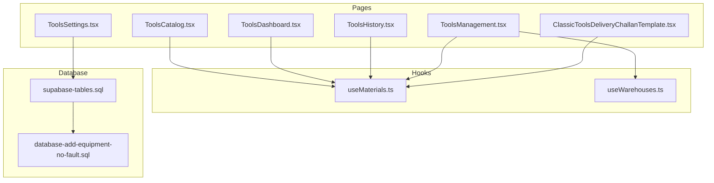

**Diagram sources**
- [ToolsCatalog.tsx](file://src/pages/ToolsCatalog.tsx)
- [ToolsDashboard.tsx](file://src/pages/ToolsDashboard.tsx)
- [ToolsHistory.tsx](file://src/pages/ToolsHistory.tsx)
- [ToolsManagement.tsx](file://src/pages/ToolsManagement.tsx)
- [ToolsSettings.tsx](file://src/pages/ToolsSettings.tsx)
- [ClassicToolsDeliveryChallanTemplate.tsx](file://src/pages/ClassicToolsDeliveryChallanTemplate.tsx)
- [useMaterials.ts](file://src/hooks/useMaterials.ts)
- [useWarehouses.ts](file://src/hooks/useWarehouses.ts)
- [supabase-tables.sql](file://supabase-tables.sql)
- [database-add-equipment-no-fault.sql](file://src/database-add-equipment-no-fault.sql)

**Section sources**
- [ToolsCatalog.tsx](file://src/pages/ToolsCatalog.tsx)
- [ToolsDashboard.tsx](file://src/pages/ToolsDashboard.tsx)
- [ToolsHistory.tsx](file://src/pages/ToolsHistory.tsx)
- [ToolsManagement.tsx](file://src/pages/ToolsManagement.tsx)
- [ToolsSettings.tsx](file://src/pages/ToolsSettings.tsx)
- [ClassicToolsDeliveryChallanTemplate.tsx](file://src/pages/ClassicToolsDeliveryChallanTemplate.tsx)
- [useMaterials.ts](file://src/hooks/useMaterials.ts)
- [useWarehouses.ts](file://src/hooks/useWarehouses.ts)
- [supabase-tables.sql](file://supabase-tables.sql)
- [database-add-equipment-no-fault.sql](file://src/database-add-equipment-no-fault.sql)

## Core Components
- Tool Catalog: Create and maintain tool records, categories, serial numbers, barcodes, purchase details, and initial condition.
- Dashboard: Real-time availability, utilization metrics, upcoming maintenance, and overdue alerts.
- History: Audit trail of checkouts, checkins, repairs, maintenance, and status changes.
- Management: Reservation workflow, checkout/checkin operations, location transfers, and condition updates.
- Settings: Categories, maintenance intervals, depreciation rules, alert thresholds, and barcode configuration.
- Delivery Challan Template: Printable record for physical handover at site.

Key integrations:
- Materials and warehouses via hooks for unified inventory context.
- Database schema for equipment tables and audit fields.

**Section sources**
- [ToolsCatalog.tsx](file://src/pages/ToolsCatalog.tsx)
- [ToolsDashboard.tsx](file://src/pages/ToolsDashboard.tsx)
- [ToolsHistory.tsx](file://src/pages/ToolsHistory.tsx)
- [ToolsManagement.tsx](file://src/pages/ToolsManagement.tsx)
- [ToolsSettings.tsx](file://src/pages/ToolsSettings.tsx)
- [ClassicToolsDeliveryChallanTemplate.tsx](file://src/pages/ClassicToolsDeliveryChallanTemplate.tsx)
- [useMaterials.ts](file://src/hooks/useMaterials.ts)
- [useWarehouses.ts](file://src/hooks/useWarehouses.ts)
- [supabase-tables.sql](file://supabase-tables.sql)

## Architecture Overview
The system follows a page-driven architecture with shared hooks for data access and a relational backend. Pages orchestrate user flows; hooks encapsulate API calls and caching; migrations define persistent structures.

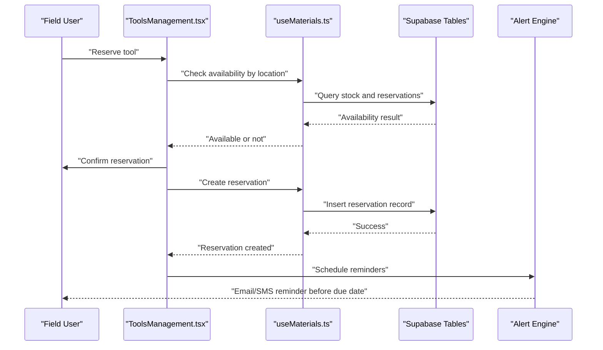

**Diagram sources**
- [ToolsManagement.tsx](file://src/pages/ToolsManagement.tsx)
- [useMaterials.ts](file://src/hooks/useMaterials.ts)
- [supabase-tables.sql](file://supabase-tables.sql)

## Detailed Component Analysis

### Tool Catalog Creation and Maintenance
- Purpose: Define equipment master data including categories, identifiers (serial number, barcode), acquisition cost, warranty, and initial condition.
- Features:
  - Category hierarchy and attributes
  - Barcode generation and assignment
  - Purchase and vendor linkage
  - Depreciation parameters (method, useful life, salvage value)
  - Maintenance templates (interval type, frequency, responsible party)
- Data model highlights:
  - Equipment table with category, barcode, purchase info, depreciation fields
  - Maintenance schedule linked to equipment
  - Condition codes and statuses

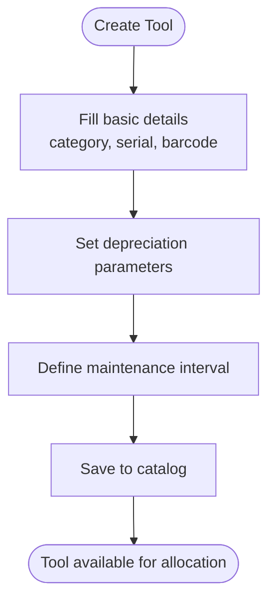

**Diagram sources**
- [ToolsCatalog.tsx](file://src/pages/ToolsCatalog.tsx)
- [ToolsSettings.tsx](file://src/pages/ToolsSettings.tsx)
- [supabase-tables.sql](file://supabase-tables.sql)

**Section sources**
- [ToolsCatalog.tsx](file://src/pages/ToolsCatalog.tsx)
- [ToolsSettings.tsx](file://src/pages/ToolsSettings.tsx)
- [supabase-tables.sql](file://supabase-tables.sql)

### Utilization Tracking and History
- Purpose: Track usage events, durations, and outcomes to compute utilization rates and support audits.
- Features:
  - Checkout/checkin timestamps
  - Assigned project and user
  - Usage notes and photos
  - Aggregated utilization dashboards
- History view:
  - Chronological log of all lifecycle events
  - Filters by tool, project, user, date range

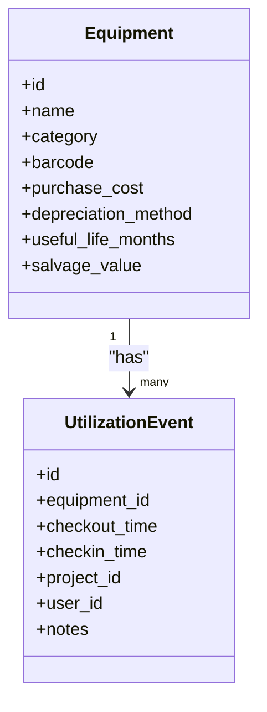

**Diagram sources**
- [ToolsHistory.tsx](file://src/pages/ToolsHistory.tsx)
- [supabase-tables.sql](file://supabase-tables.sql)

**Section sources**
- [ToolsHistory.tsx](file://src/pages/ToolsHistory.tsx)
- [supabase-tables.sql](file://supabase-tables.sql)

### Reservation Workflow and Checkout/Checkin
- Reservation:
  - Check real-time availability considering existing reservations and active checkouts
  - Reserve for a time window with reminders
- Checkout:
  - Validate reservation and conditions
  - Record checkout metadata (location, project, user)
  - Generate delivery challan if needed
- Checkin:
  - Inspect condition, update status
  - Close reservation and utilization event
  - Trigger maintenance checks if required

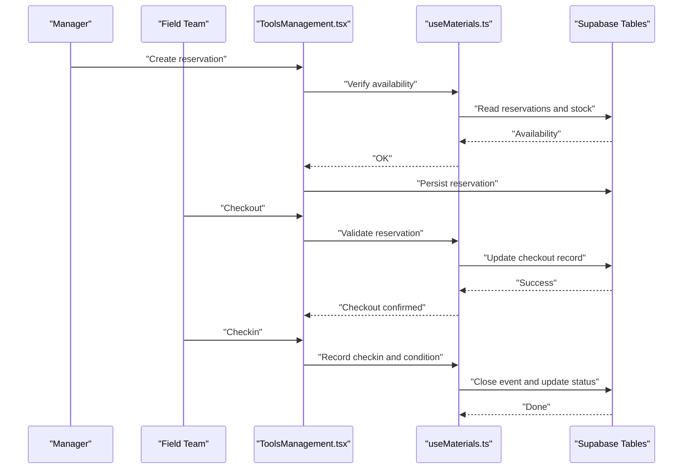

**Diagram sources**
- [ToolsManagement.tsx](file://src/pages/ToolsManagement.tsx)
- [useMaterials.ts](file://src/hooks/useMaterials.ts)
- [supabase-tables.sql](file://supabase-tables.sql)

**Section sources**
- [ToolsManagement.tsx](file://src/pages/ToolsManagement.tsx)
- [useMaterials.ts](file://src/hooks/useMaterials.ts)
- [supabase-tables.sql](file://supabase-tables.sql)

### Condition Monitoring and Maintenance Scheduling
- Condition monitoring:
  - Predefined condition states (e.g., good, fair, poor, out-of-service)
  - Optional fault tagging and repair linkage
- Maintenance scheduling:
  - Interval-based schedules (time or usage hours)
  - Automated tasks and reminders
  - Repair history integrated with condition updates

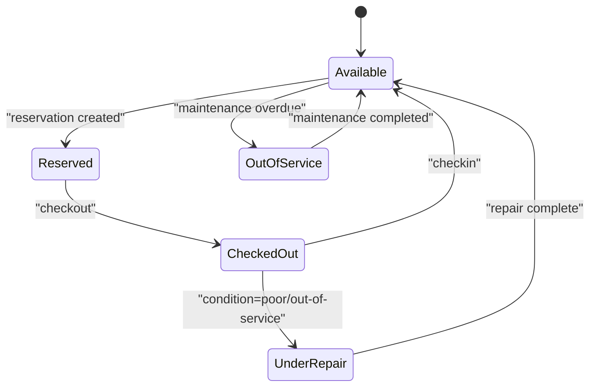

**Diagram sources**
- [ToolsManagement.tsx](file://src/pages/ToolsManagement.tsx)
- [database-add-equipment-no-fault.sql](file://src/database-add-equipment-no-fault.sql)
- [supabase-tables.sql](file://supabase-tables.sql)

**Section sources**
- [ToolsManagement.tsx](file://src/pages/ToolsManagement.tsx)
- [database-add-equipment-no-fault.sql](file://src/database-add-equipment-no-fault.sql)
- [supabase-tables.sql](file://supabase-tables.sql)

### Project Allocations and Delivery Challan
- Link tools to projects for accountability and cost tracking.
- Generate a delivery challan for physical handover, capturing tool list, quantities, and signatures.

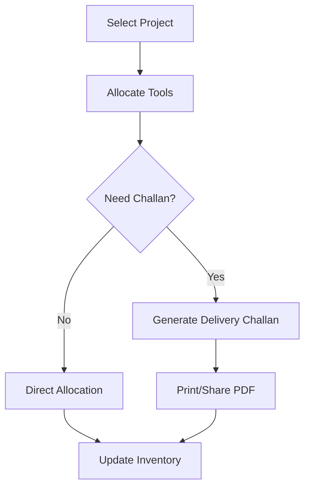

**Diagram sources**
- [ToolsManagement.tsx](file://src/pages/ToolsManagement.tsx)
- [ClassicToolsDeliveryChallanTemplate.tsx](file://src/pages/ClassicToolsDeliveryChallanTemplate.tsx)

**Section sources**
- [ToolsManagement.tsx](file://src/pages/ToolsManagement.tsx)
- [ClassicToolsDeliveryChallanTemplate.tsx](file://src/pages/ClassicToolsDeliveryChallanTemplate.tsx)

### Automated Alerts for Overdue Returns
- Triggers:
  - Approaching due date reminders
  - Overdue return notifications
  - Maintenance due warnings
- Channels:
  - In-app notifications
  - Email/SMS (configurable)

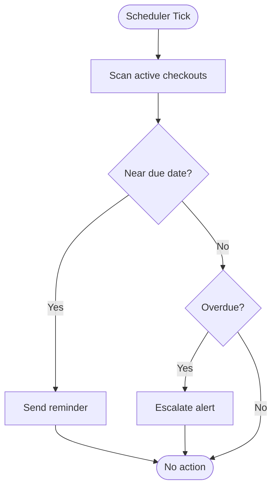

[No diagram sources since this is conceptual logic]

**Section sources**
- [ToolsDashboard.tsx](file://src/pages/ToolsDashboard.tsx)
- [ToolsManagement.tsx](file://src/pages/ToolsManagement.tsx)

### Depreciation Calculations
- Methods:
  - Straight-line over useful life
  - Units-of-production based on usage hours
- Inputs:
  - Acquisition cost, salvage value, useful life, usage logs
- Outputs:
  - Book value per period
  - Accumulated depreciation reports

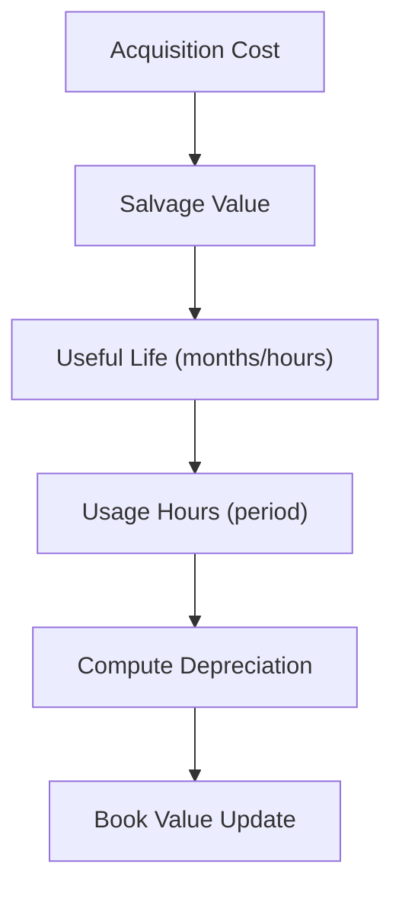

**Diagram sources**
- [ToolsSettings.tsx](file://src/pages/ToolsSettings.tsx)
- [supabase-tables.sql](file://supabase-tables.sql)

**Section sources**
- [ToolsSettings.tsx](file://src/pages/ToolsSettings.tsx)
- [supabase-tables.sql](file://supabase-tables.sql)

### Mobile Access, Barcode Scanning, and Multi-location Availability
- Mobile access:
  - Responsive UI for field teams
  - Offline-friendly forms where applicable
- Barcode scanning:
  - Camera-based scanning to auto-populate tool details
  - Bulk scan for quick checkouts/checkins
- Multi-location availability:
  - Warehouse and site-level stock views
  - Transfer requests and approvals

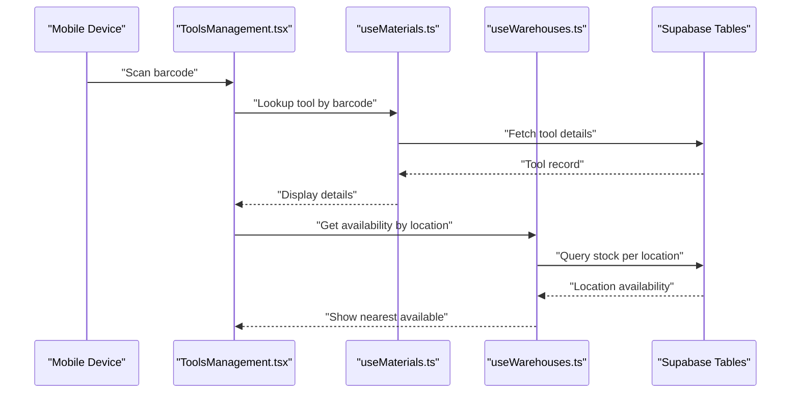

**Diagram sources**
- [ToolsManagement.tsx](file://src/pages/ToolsManagement.tsx)
- [useMaterials.ts](file://src/hooks/useMaterials.ts)
- [useWarehouses.ts](file://src/hooks/useWarehouses.ts)
- [supabase-tables.sql](file://supabase-tables.sql)

**Section sources**
- [ToolsManagement.tsx](file://src/pages/ToolsManagement.tsx)
- [useMaterials.ts](file://src/hooks/useMaterials.ts)
- [useWarehouses.ts](file://src/hooks/useWarehouses.ts)
- [supabase-tables.sql](file://supabase-tables.sql)

## Dependency Analysis
- Page components depend on hooks for data operations.
- Hooks depend on Supabase tables defined in migrations.
- Settings influence behavior across pages (categories, intervals, depreciation).
- Delivery challan template depends on materials data.

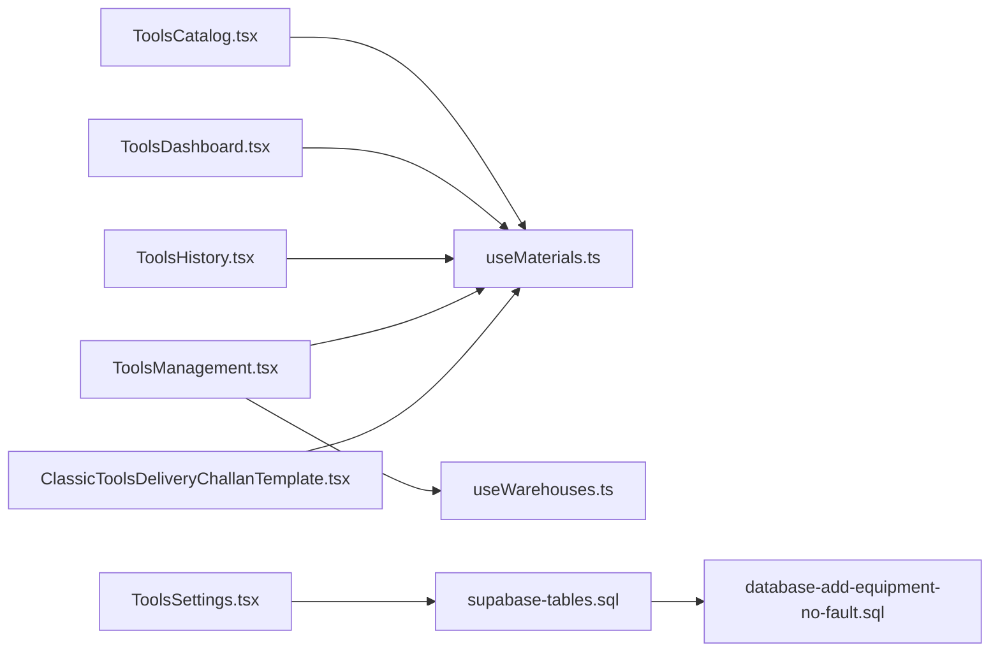

**Diagram sources**
- [ToolsCatalog.tsx](file://src/pages/ToolsCatalog.tsx)
- [ToolsDashboard.tsx](file://src/pages/ToolsDashboard.tsx)
- [ToolsHistory.tsx](file://src/pages/ToolsHistory.tsx)
- [ToolsManagement.tsx](file://src/pages/ToolsManagement.tsx)
- [ToolsSettings.tsx](file://src/pages/ToolsSettings.tsx)
- [ClassicToolsDeliveryChallanTemplate.tsx](file://src/pages/ClassicToolsDeliveryChallanTemplate.tsx)
- [useMaterials.ts](file://src/hooks/useMaterials.ts)
- [useWarehouses.ts](file://src/hooks/useWarehouses.ts)
- [supabase-tables.sql](file://supabase-tables.sql)
- [database-add-equipment-no-fault.sql](file://src/database-add-equipment-no-fault.sql)

**Section sources**
- [ToolsCatalog.tsx](file://src/pages/ToolsCatalog.tsx)
- [ToolsDashboard.tsx](file://src/pages/ToolsDashboard.tsx)
- [ToolsHistory.tsx](file://src/pages/ToolsHistory.tsx)
- [ToolsManagement.tsx](file://src/pages/ToolsManagement.tsx)
- [ToolsSettings.tsx](file://src/pages/ToolsSettings.tsx)
- [ClassicToolsDeliveryChallanTemplate.tsx](file://src/pages/ClassicToolsDeliveryChallanTemplate.tsx)
- [useMaterials.ts](file://src/hooks/useMaterials.ts)
- [useWarehouses.ts](file://src/hooks/useWarehouses.ts)
- [supabase-tables.sql](file://supabase-tables.sql)
- [database-add-equipment-no-fault.sql](file://src/database-add-equipment-no-fault.sql)

## Performance Considerations
- Use pagination and filtering in lists to reduce payload sizes.
- Cache frequent reads (tool details, categories) and invalidate on writes.
- Batch operations for bulk checkouts/checkins.
- Index frequently queried columns (barcode, project_id, location_id).
- Defer heavy computations (depreciation) to background jobs.

[No sources needed since this section provides general guidance]

## Troubleshooting Guide
Common issues and resolutions:
- Barcode not found:
  - Verify barcode uniqueness and correct encoding
  - Ensure tool exists in catalog
- Reservation conflicts:
  - Check overlapping reservations and active checkouts
  - Adjust time windows or release conflicting reservations
- Overdue alerts not firing:
  - Confirm scheduler runs and thresholds are configured
  - Validate notification channels and user contacts
- Condition stuck in repair:
  - Review repair completion steps and status transitions
  - Reassign maintenance tasks if necessary

**Section sources**
- [ToolsManagement.tsx](file://src/pages/ToolsManagement.tsx)
- [ToolsDashboard.tsx](file://src/pages/ToolsDashboard.tsx)
- [ToolsHistory.tsx](file://src/pages/ToolsHistory.tsx)

## Conclusion
The tools and equipment management system provides end-to-end control over tool lifecycles from cataloging through utilization, maintenance, and disposition. With robust reservation and checkout/checkin workflows, condition monitoring, project integration, and multi-location visibility, it supports efficient field operations and accurate accounting. Extensibility points include additional depreciation methods, advanced analytics, and deeper ERP integrations.

[No sources needed since this section summarizes without analyzing specific files]

## Appendices

### Examples and Setup Guides
- Setting up equipment categories:
  - Define categories and attributes in settings
  - Assign default maintenance intervals and depreciation parameters
- Defining maintenance intervals:
  - Choose time-based or usage-based triggers
  - Configure responsible parties and escalation rules
- Tracking repair histories:
  - Log faults, actions, parts used, and outcomes
  - Link repairs to condition updates and maintenance schedules
- Barcode scanning setup:
  - Enable camera permissions
  - Map scanned values to tool identifiers
- Real-time availability across locations:
  - Configure warehouse/site mappings
  - Enable live stock sync and transfer approvals

**Section sources**
- [ToolsSettings.tsx](file://src/pages/ToolsSettings.tsx)
- [ToolsManagement.tsx](file://src/pages/ToolsManagement.tsx)
- [supabase-tables.sql](file://supabase-tables.sql)