# Site Reports & Documentation

<cite>
**Referenced Files in This Document**
- [SiteReport.tsx](file://src/pages/SiteReport.tsx)
- [SiteReportPhotoUploader.tsx](file://src/components/SiteReportPhotoUploader.tsx)
- [useSiteReportPhotos.ts](file://src/hooks/useSiteReportPhotos.ts)
- [useStoppages.ts](file://src/hooks/useStoppages.ts)
- [database-site-reports.sql](file://src/database-site-reports.sql)
- [database-site-report-photos.sql](file://src/database-site-report-photos.sql)
- [database-site-report-stoppages.sql](file://src/database-site-report-stoppages.sql)
- [database-site-report-approval.sql](file://src/database-site-report-approval.sql)
- [siteReportApproval.ts](file://src/approvals/siteReportApproval.ts)
- [useAuditLog.ts](file://src/hooks/useAuditLog.ts)
- [database-item-audit.sql](file://src/database-item-audit.sql)
- [usePerformanceMonitor.ts](file://src/hooks/usePerformanceMonitor.ts)
- [api/parse-document.ts](file://api/parse-document.ts)
- [lib/meeting-pdf-generator.ts](file://src/lib/meeting-pdf-generator.ts)
- [hooks/use-whatsapp-share.ts](file://src/hooks/use-whatsapp-share.ts)
- [pages/reports/index.tsx](file://src/pages/reports/index.tsx)
</cite>

## Table of Contents
1. [Introduction](#introduction)
2. [Project Structure](#project-structure)
3. [Core Components](#core-components)
4. [Architecture Overview](#architecture-overview)
5. [Detailed Component Analysis](#detailed-component-analysis)
6. [Dependency Analysis](#dependency-analysis)
7. [Performance Considerations](#performance-considerations)
8. [Troubleshooting Guide](#troubleshooting-guide)
9. [Conclusion](#conclusion)
10. [Appendices](#appendices)

## Introduction
This document explains the Site Reports and Documentation system, focusing on daily site reporting workflows, photo documentation, progress tracking, stoppage reporting, incident logging, safety compliance tracking, template customization, automated notifications, compliance documents, offline data collection, mobile usage, synchronization, stakeholder communication, sharing, audit trails, quality assurance integration, inspection checklists, regulatory compliance, analytics, trend analysis, and performance metrics. The content is grounded in the repository’s implementation details and database schema to ensure accuracy and traceability.

## Project Structure
The Site Reports feature spans UI pages, hooks for data access, approval workflows, PDF generation utilities, and database migrations that define the underlying data model. Key areas include:
- Site report entry and management page
- Photo upload component and associated hook
- Stoppage tracking hook and related schema
- Approval workflow for site reports
- Audit log and performance monitoring hooks
- PDF generation and document parsing utilities
- Reporting dashboard index

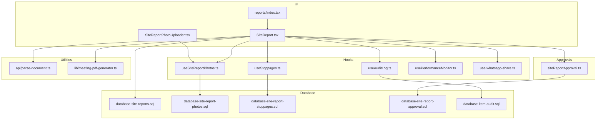

**Diagram sources**
- [SiteReport.tsx](file://src/pages/SiteReport.tsx)
- [SiteReportPhotoUploader.tsx](file://src/components/SiteReportPhotoUploader.tsx)
- [useSiteReportPhotos.ts](file://src/hooks/useSiteReportPhotos.ts)
- [useStoppages.ts](file://src/hooks/useStoppages.ts)
- [siteReportApproval.ts](file://src/approvals/siteReportApproval.ts)
- [useAuditLog.ts](file://src/hooks/useAuditLog.ts)
- [usePerformanceMonitor.ts](file://src/hooks/usePerformanceMonitor.ts)
- [api/parse-document.ts](file://api/parse-document.ts)
- [lib/meeting-pdf-generator.ts](file://src/lib/meeting-pdf-generator.ts)
- [hooks/use-whatsapp-share.ts](file://src/hooks/use-whatsapp-share.ts)
- [pages/reports/index.tsx](file://src/pages/reports/index.tsx)
- [database-site-reports.sql](file://src/database-site-reports.sql)
- [database-site-report-photos.sql](file://src/database-site-report-photos.sql)
- [database-site-report-stoppages.sql](file://src/database-site-report-stoppages.sql)
- [database-site-report-approval.sql](file://src/database-site-report-approval.sql)
- [database-item-audit.sql](file://src/database-item-audit.sql)

**Section sources**
- [SiteReport.tsx](file://src/pages/SiteReport.tsx)
- [SiteReportPhotoUploader.tsx](file://src/components/SiteReportPhotoUploader.tsx)
- [useSiteReportPhotos.ts](file://src/hooks/useSiteReportPhotos.ts)
- [useStoppages.ts](file://src/hooks/useStoppages.ts)
- [siteReportApproval.ts](file://src/approvals/siteReportApproval.ts)
- [useAuditLog.ts](file://src/hooks/useAuditLog.ts)
- [usePerformanceMonitor.ts](file://src/hooks/usePerformanceMonitor.ts)
- [api/parse-document.ts](file://api/parse-document.ts)
- [lib/meeting-pdf-generator.ts](file://src/lib/meeting-pdf-generator.ts)
- [hooks/use-whatsapp-share.ts](file://src/hooks/use-whatsapp-share.ts)
- [pages/reports/index.tsx](file://src/pages/reports/index.tsx)
- [database-site-reports.sql](file://src/database-site-reports.sql)
- [database-site-report-photos.sql](file://src/database-site-report-photos.sql)
- [database-site-report-stoppages.sql](file://src/database-site-report-stoppages.sql)
- [database-site-report-approval.sql](file://src/database-site-report-approval.sql)
- [database-item-audit.sql](file://src/database-item-audit.sql)

## Core Components
- Site Report Entry Page: Central hub for creating and managing daily site reports, including progress notes, photos, and stoppages. It integrates with photo upload, stoppage tracking, approvals, and audit logging.
- Photo Upload Component: Handles image capture/upload, preview, compression, and association with a site report.
- Stoppage Tracking Hook: Provides CRUD operations and state management for work stoppages linked to site reports.
- Approval Workflow: Orchestrates review and approval states for site reports, ensuring governance before publication or distribution.
- Audit Log Hook: Records immutable changes to key entities for compliance and traceability.
- Performance Monitor Hook: Captures timing and error metrics for critical user actions.
- PDF Generation Utility: Produces printable and shareable documents from structured data.
- Document Parser API: Parses uploaded documents (e.g., images/PDFs) into extractable text/metadata for enrichment.
- WhatsApp Share Hook: Enables quick sharing of summaries or links via WhatsApp.
- Reports Index: Aggregates and navigates to various reporting views, including site reports.

**Section sources**
- [SiteReport.tsx](file://src/pages/SiteReport.tsx)
- [SiteReportPhotoUploader.tsx](file://src/components/SiteReportPhotoUploader.tsx)
- [useSiteReportPhotos.ts](file://src/hooks/useSiteReportPhotos.ts)
- [useStoppages.ts](file://src/hooks/useStoppages.ts)
- [siteReportApproval.ts](file://src/approvals/siteReportApproval.ts)
- [useAuditLog.ts](file://src/hooks/useAuditLog.ts)
- [usePerformanceMonitor.ts](file://src/hooks/usePerformanceMonitor.ts)
- [lib/meeting-pdf-generator.ts](file://src/lib/meeting-pdf-generator.ts)
- [api/parse-document.ts](file://api/parse-document.ts)
- [hooks/use-whatsapp-share.ts](file://src/hooks/use-whatsapp-share.ts)
- [pages/reports/index.tsx](file://src/pages/reports/index.tsx)

## Architecture Overview
The system follows a layered architecture:
- Presentation Layer: React components and pages for user interactions.
- Data Access Layer: Hooks encapsulating API calls and state management.
- Business Logic Layer: Approval workflows and processing utilities.
- Persistence Layer: Database schemas and migrations defining entities and relationships.
- Integration Layer: PDF generation, document parsing, and external sharing.

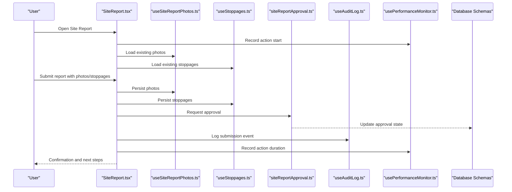

**Diagram sources**
- [SiteReport.tsx](file://src/pages/SiteReport.tsx)
- [useSiteReportPhotos.ts](file://src/hooks/useSiteReportPhotos.ts)
- [useStoppages.ts](file://src/hooks/useStoppages.ts)
- [siteReportApproval.ts](file://src/approvals/siteReportApproval.ts)
- [useAuditLog.ts](file://src/hooks/useAuditLog.ts)
- [usePerformanceMonitor.ts](file://src/hooks/usePerformanceMonitor.ts)
- [database-site-reports.sql](file://src/database-site-reports.sql)
- [database-site-report-photos.sql](file://src/database-site-report-photos.sql)
- [database-site-report-stoppages.sql](file://src/database-site-report-stoppages.sql)
- [database-site-report-approval.sql](file://src/database-site-report-approval.sql)

## Detailed Component Analysis

### Daily Site Reporting Workflow
- Creation and editing of daily site reports with fields for progress notes, weather, manpower, equipment, materials, and general observations.
- Association of multiple photos per report.
- Linking one or more stoppages to the report.
- Submission triggers approval workflow and audit logging.
- Optional export to PDF and sharing via WhatsApp.

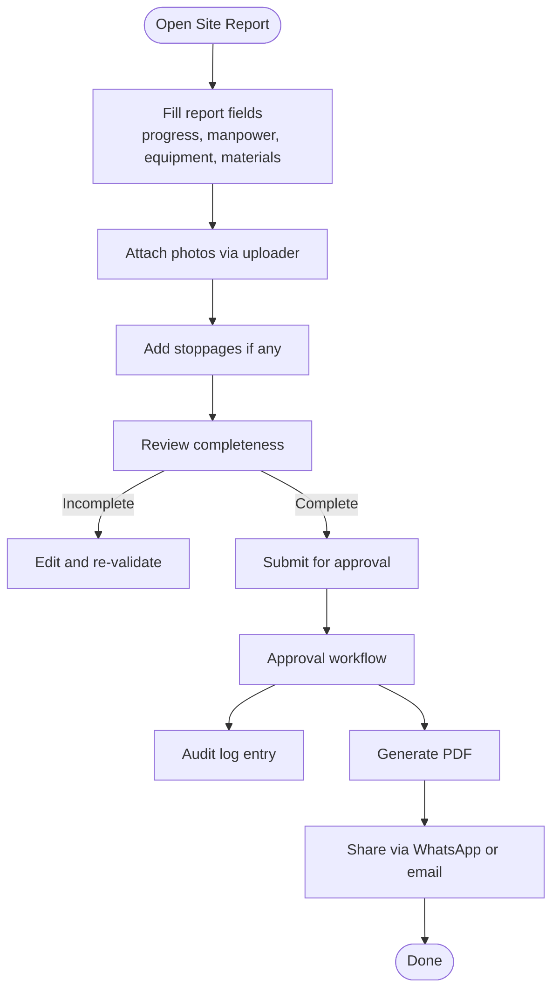

**Diagram sources**
- [SiteReport.tsx](file://src/pages/SiteReport.tsx)
- [SiteReportPhotoUploader.tsx](file://src/components/SiteReportPhotoUploader.tsx)
- [useSiteReportPhotos.ts](file://src/hooks/useSiteReportPhotos.ts)
- [useStoppages.ts](file://src/hooks/useStoppages.ts)
- [siteReportApproval.ts](file://src/approvals/siteReportApproval.ts)
- [useAuditLog.ts](file://src/hooks/useAuditLog.ts)
- [lib/meeting-pdf-generator.ts](file://src/lib/meeting-pdf-generator.ts)
- [hooks/use-whatsapp-share.ts](file://src/hooks/use-whatsapp-share.ts)

**Section sources**
- [SiteReport.tsx](file://src/pages/SiteReport.tsx)
- [SiteReportPhotoUploader.tsx](file://src/components/SiteReportPhotoUploader.tsx)
- [useSiteReportPhotos.ts](file://src/hooks/useSiteReportPhotos.ts)
- [useStoppages.ts](file://src/hooks/useStoppages.ts)
- [siteReportApproval.ts](file://src/approvals/siteReportApproval.ts)
- [useAuditLog.ts](file://src/hooks/useAuditLog.ts)
- [lib/meeting-pdf-generator.ts](file://src/lib/meeting-pdf-generator.ts)
- [hooks/use-whatsapp-share.ts](file://src/hooks/use-whatsapp-share.ts)

### Photo Documentation
- Capture or upload images directly from device cameras or file picker.
- Preview thumbnails with optional cropping/compression.
- Associate images with specific site reports and maintain metadata (timestamps, geolocation if available).
- Persist images through the photo hook and storage layer.

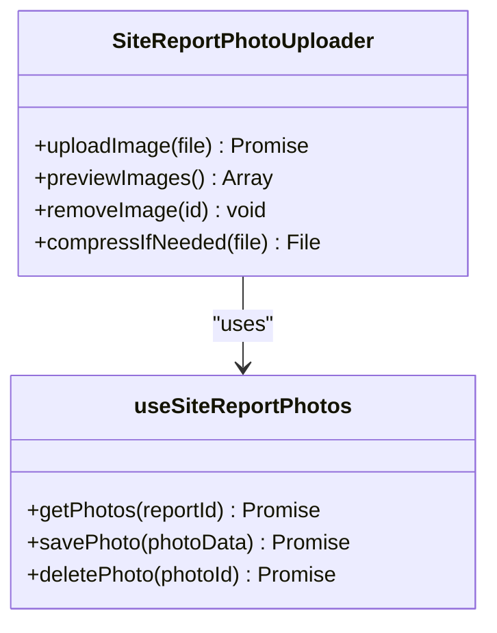

**Diagram sources**
- [SiteReportPhotoUploader.tsx](file://src/components/SiteReportPhotoUploader.tsx)
- [useSiteReportPhotos.ts](file://src/hooks/useSiteReportPhotos.ts)
- [database-site-report-photos.sql](file://src/database-site-report-photos.sql)

**Section sources**
- [SiteReportPhotoUploader.tsx](file://src/components/SiteReportPhotoUploader.tsx)
- [useSiteReportPhotos.ts](file://src/hooks/useSiteReportPhotos.ts)
- [database-site-report-photos.sql](file://src/database-site-report-photos.sql)

### Progress Tracking Features
- Track daily progress by linking activities, milestones, and completion percentages.
- Aggregate progress across days to visualize trends.
- Integrate with stoppages to adjust effective progress calculations.

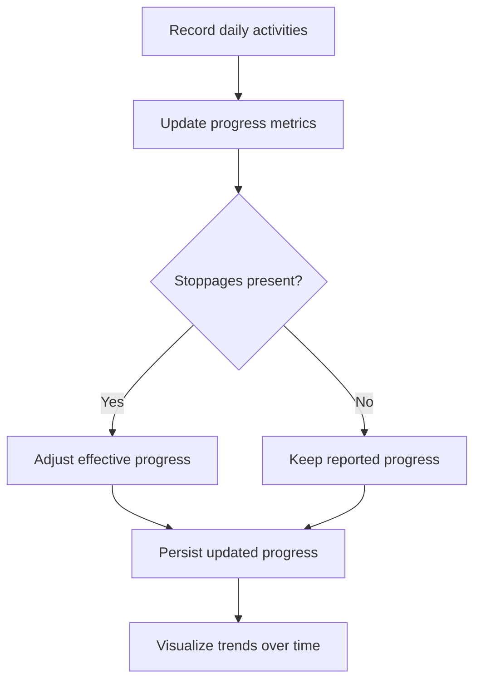

[No sources needed since this diagram shows conceptual workflow, not actual code structure]

### Stoppage Reporting
- Create stoppage entries with cause, duration, impact, and remediation notes.
- Link stoppages to specific site reports for context.
- Support planned vs unplanned classification and restart scheduling.

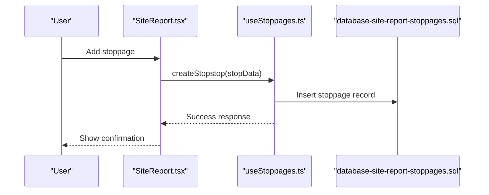

**Diagram sources**
- [SiteReport.tsx](file://src/pages/SiteReport.tsx)
- [useStoppages.ts](file://src/hooks/useStoppages.ts)
- [database-site-report-stoppages.sql](file://src/database-site-report-stoppages.sql)

**Section sources**
- [useStoppages.ts](file://src/hooks/useStoppages.ts)
- [database-site-report-stoppages.sql](file://src/database-site-report-stoppages.sql)

### Incident Logging and Safety Compliance Tracking
- Use site reports to log incidents, near-misses, and safety observations.
- Tag entries with severity, location, and responsible parties.
- Maintain compliance records and generate compliance documents upon request.

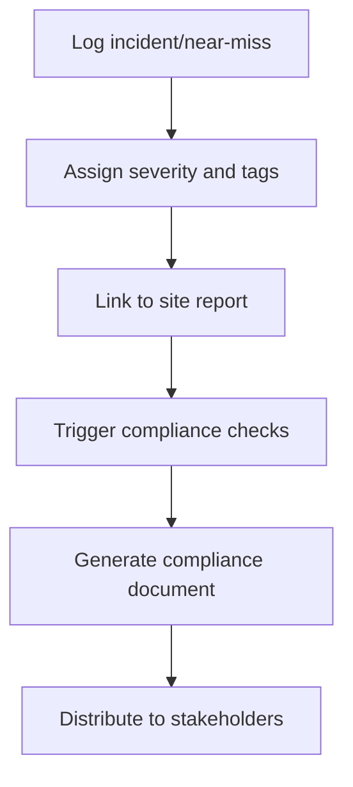

[No sources needed since this diagram shows conceptual workflow, not actual code structure]

### Customizing Report Templates
- Leverage PDF generation utilities to build templates tailored to organizational needs.
- Customize headers, footers, sections, and branding elements.
- Parameterize dynamic fields such as project name, date, author, and attachments.

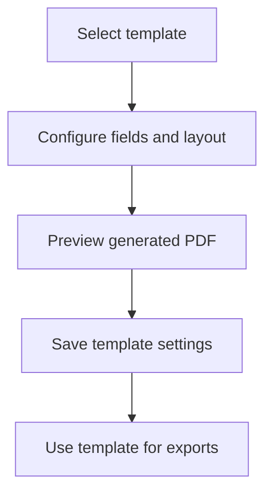

**Section sources**
- [lib/meeting-pdf-generator.ts](file://src/lib/meeting-pdf-generator.ts)

### Automated Notifications
- Configure notification rules based on report submissions, approvals, and stoppages.
- Trigger alerts via email or messaging channels when thresholds are met.
- Integrate with WhatsApp sharing for rapid dissemination.

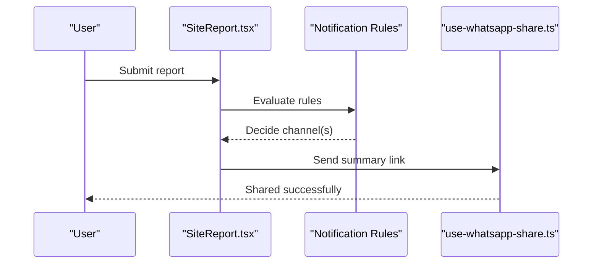

**Diagram sources**
- [SiteReport.tsx](file://src/pages/SiteReport.tsx)
- [hooks/use-whatsapp-share.ts](file://src/hooks/use-whatsapp-share.ts)

**Section sources**
- [hooks/use-whatsapp-share.ts](file://src/hooks/use-whatsapp-share.ts)

### Generating Compliance Documents
- Compile relevant site report data, photos, and stoppages into a compliance-ready PDF.
- Include timestamps, signatures, and version control metadata.
- Archive generated documents for audit purposes.

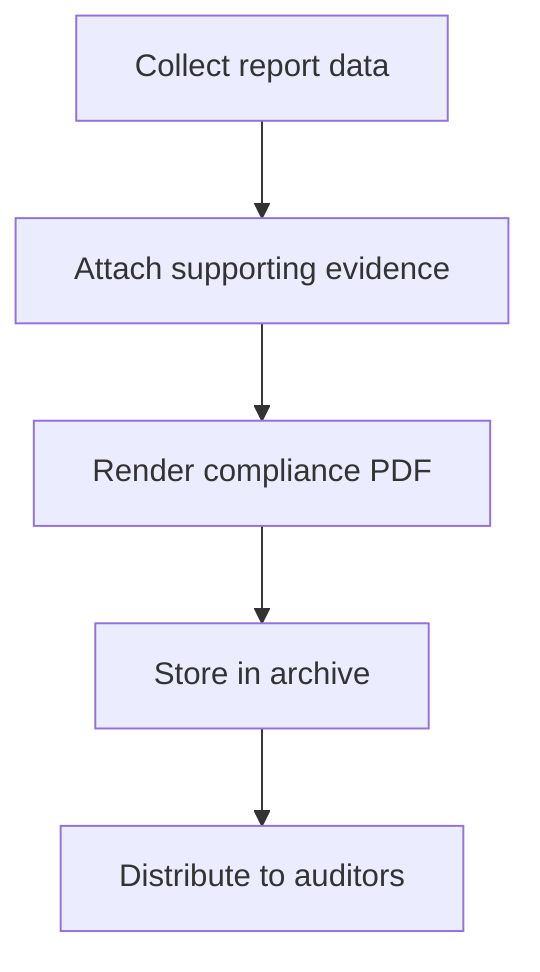

**Section sources**
- [lib/meeting-pdf-generator.ts](file://src/lib/meeting-pdf-generator.ts)

### Offline Data Collection and Mobile Usage
- Enable form inputs and photo capture on mobile devices.
- Cache draft submissions locally until connectivity is restored.
- Sync pending items to the server when online.

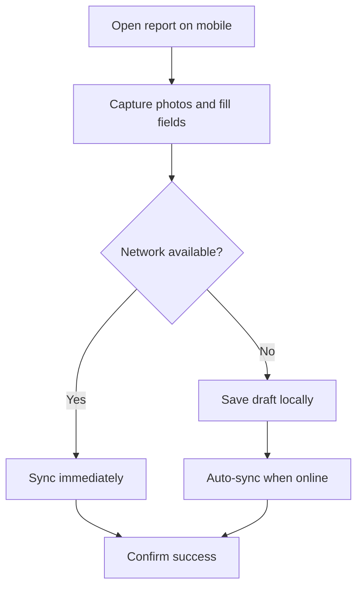

[No sources needed since this diagram shows conceptual workflow, not actual code structure]

### Data Synchronization
- Ensure consistency between local drafts and server records.
- Handle conflicts by prioritizing latest edits and preserving audit trails.
- Provide manual sync controls for power users.

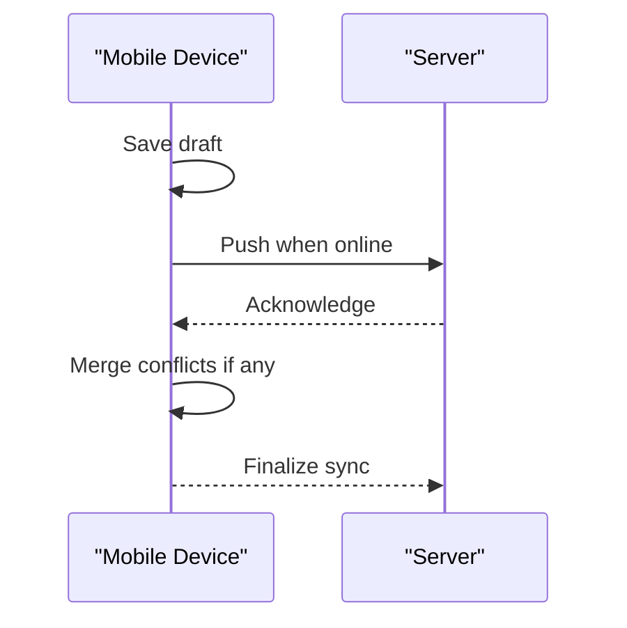

[No sources needed since this diagram shows conceptual workflow, not actual code structure]

### Stakeholder Communication and Report Sharing
- Share concise summaries and full reports via WhatsApp or other channels.
- Control visibility and permissions for shared content.
- Maintain a history of shared documents and recipients.

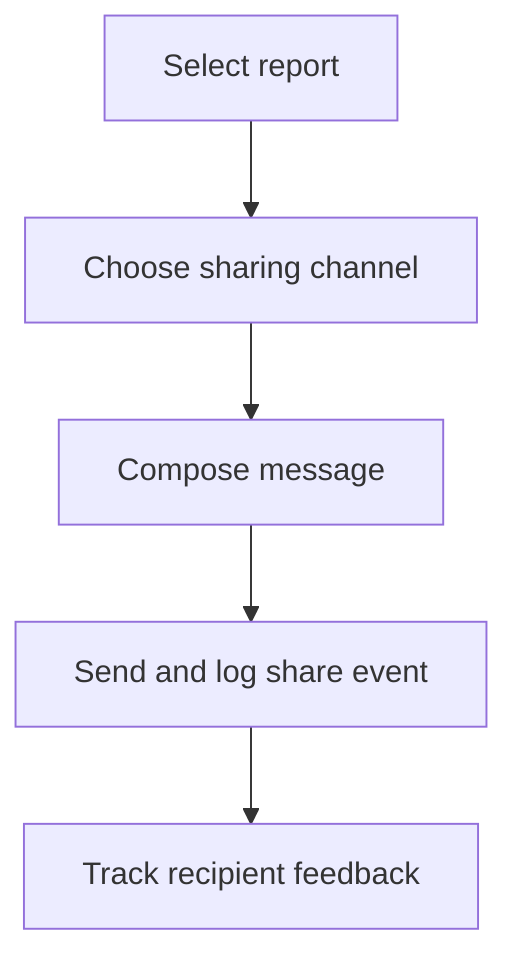

**Section sources**
- [hooks/use-whatsapp-share.ts](file://src/hooks/use-whatsapp-share.ts)

### Audit Trail Maintenance
- Record all significant actions (create, update, approve, delete) with timestamps and actor identities.
- Store immutable logs for compliance and dispute resolution.
- Provide queryable audit history for reviewers and auditors.

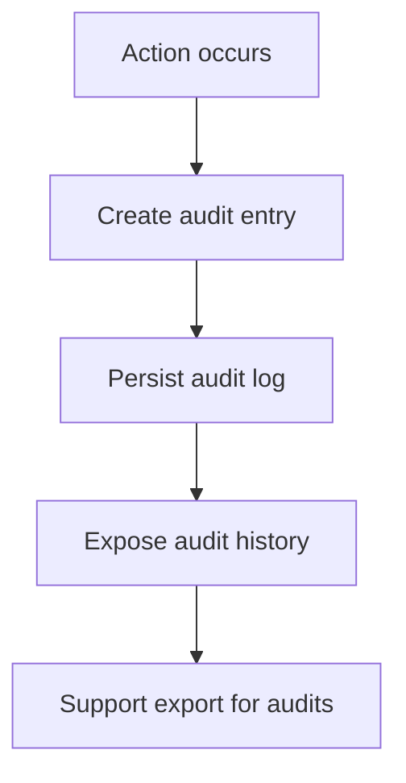

**Diagram sources**
- [useAuditLog.ts](file://src/hooks/useAuditLog.ts)
- [database-item-audit.sql](file://src/database-item-audit.sql)

**Section sources**
- [useAuditLog.ts](file://src/hooks/useAuditLog.ts)
- [database-item-audit.sql](file://src/database-item-audit.sql)

### Integration with Quality Assurance Processes
- Embed inspection checklists within site reports to standardize QA steps.
- Require checklist completion before final submission.
- Generate QA certificates or compliance statements from completed checklists.

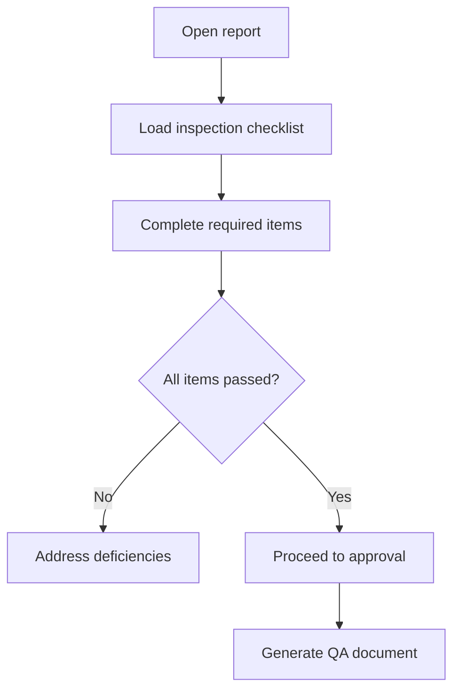

[No sources needed since this diagram shows conceptual workflow, not actual code structure]

### Regulatory Compliance Requirements
- Align report fields and approvals with regulatory standards.
- Preserve evidence and chain-of-custody for inspections and incidents.
- Produce standardized compliance packages for regulators.

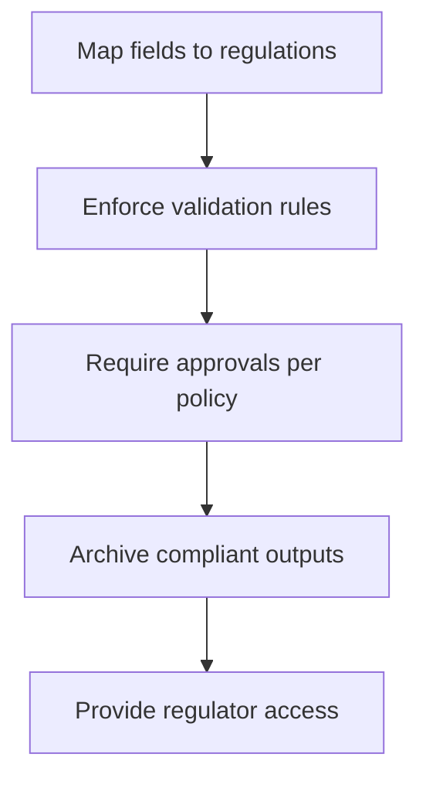

[No sources needed since this diagram shows conceptual workflow, not actual code structure]

### Reporting Analytics, Trend Analysis, and Performance Metrics
- Aggregate daily progress, stoppages, and incidents to identify trends.
- Compute KPIs such as average stoppage duration, incident frequency, and compliance rates.
- Use performance monitoring to track user action latency and error rates.

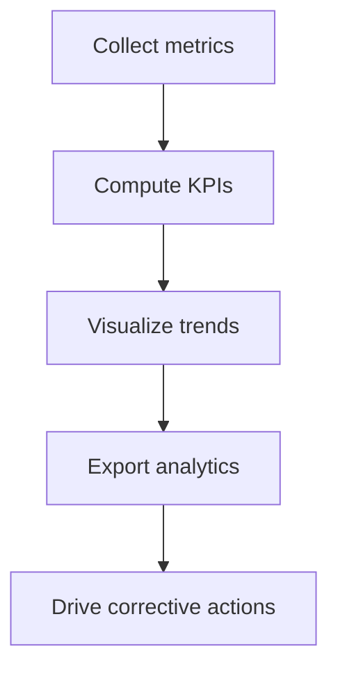

**Section sources**
- [usePerformanceMonitor.ts](file://src/hooks/usePerformanceMonitor.ts)
- [pages/reports/index.tsx](file://src/pages/reports/index.tsx)

## Dependency Analysis
The following diagram illustrates key dependencies among components, hooks, and database schemas involved in site reporting.

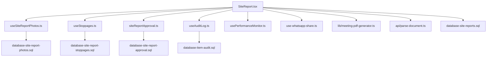

**Diagram sources**
- [SiteReport.tsx](file://src/pages/SiteReport.tsx)
- [useSiteReportPhotos.ts](file://src/hooks/useSiteReportPhotos.ts)
- [useStoppages.ts](file://src/hooks/useStoppages.ts)
- [siteReportApproval.ts](file://src/approvals/siteReportApproval.ts)
- [useAuditLog.ts](file://src/hooks/useAuditLog.ts)
- [usePerformanceMonitor.ts](file://src/hooks/usePerformanceMonitor.ts)
- [hooks/use-whatsapp-share.ts](file://src/hooks/use-whatsapp-share.ts)
- [lib/meeting-pdf-generator.ts](file://src/lib/meeting-pdf-generator.ts)
- [api/parse-document.ts](file://api/parse-document.ts)
- [database-site-reports.sql](file://src/database-site-reports.sql)
- [database-site-report-photos.sql](file://src/database-site-report-photos.sql)
- [database-site-report-stoppages.sql](file://src/database-site-report-stoppages.sql)
- [database-site-report-approval.sql](file://src/database-site-report-approval.sql)
- [database-item-audit.sql](file://src/database-item-audit.sql)

**Section sources**
- [SiteReport.tsx](file://src/pages/SiteReport.tsx)
- [useSiteReportPhotos.ts](file://src/hooks/useSiteReportPhotos.ts)
- [useStoppages.ts](file://src/hooks/useStoppages.ts)
- [siteReportApproval.ts](file://src/approvals/siteReportApproval.ts)
- [useAuditLog.ts](file://src/hooks/useAuditLog.ts)
- [usePerformanceMonitor.ts](file://src/hooks/usePerformanceMonitor.ts)
- [hooks/use-whatsapp-share.ts](file://src/hooks/use-whatsapp-share.ts)
- [lib/meeting-pdf-generator.ts](file://src/lib/meeting-pdf-generator.ts)
- [api/parse-document.ts](file://api/parse-document.ts)
- [database-site-reports.sql](file://src/database-site-reports.sql)
- [database-site-report-photos.sql](file://src/database-site-report-photos.sql)
- [database-site-report-stoppages.sql](file://src/database-site-report-stoppages.sql)
- [database-site-report-approval.sql](file://src/database-site-report-approval.sql)
- [database-item-audit.sql](file://src/database-item-audit.sql)

## Performance Considerations
- Optimize photo uploads with compression and chunked transfers to reduce bandwidth and improve responsiveness.
- Implement pagination and lazy loading for large photo galleries and stoppage lists.
- Use performance monitoring hooks to detect slow operations and prioritize optimizations.
- Cache frequently accessed report metadata to minimize repeated queries.
- Batch write operations where possible to reduce database round-trips.

[No sources needed since this section provides general guidance]

## Troubleshooting Guide
Common issues and resolutions:
- Photo upload failures: Verify file size limits, MIME types, and network connectivity; retry with compression enabled.
- Stoppage save errors: Check required fields and referential integrity; ensure the parent site report exists.
- Approval workflow stuck: Confirm user permissions and workflow configuration; review audit logs for blockers.
- Audit log gaps: Validate logging hooks are invoked on all mutation paths; inspect database constraints.
- PDF generation errors: Inspect template variables and asset availability; validate rendering pipeline.
- WhatsApp sharing failures: Ensure app installation and deep-link parameters are correct; fallback to copy-to-clipboard.

**Section sources**
- [useSiteReportPhotos.ts](file://src/hooks/useSiteReportPhotos.ts)
- [useStoppages.ts](file://src/hooks/useStoppages.ts)
- [siteReportApproval.ts](file://src/approvals/siteReportApproval.ts)
- [useAuditLog.ts](file://src/hooks/useAuditLog.ts)
- [lib/meeting-pdf-generator.ts](file://src/lib/meeting-pdf-generator.ts)
- [hooks/use-whatsapp-share.ts](file://src/hooks/use-whatsapp-share.ts)

## Conclusion
The Site Reports and Documentation system provides a comprehensive solution for daily reporting, photo documentation, progress tracking, stoppage management, incident logging, safety compliance, and stakeholder communication. With robust approval workflows, audit trails, PDF generation, and analytics, it supports both operational efficiency and regulatory compliance. Extensibility points allow template customization, automated notifications, and integration with QA processes.

## Appendices

### Data Model Overview
Key entities and relationships underpinning site reports, photos, stoppages, approvals, and audit logs.

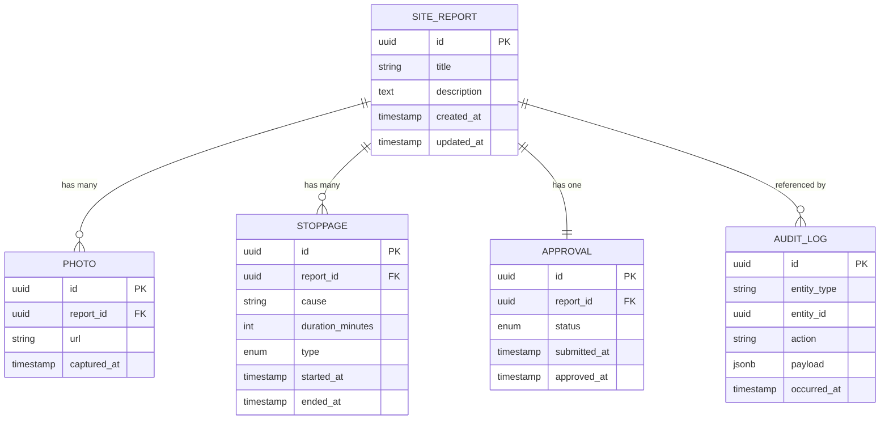

**Diagram sources**
- [database-site-reports.sql](file://src/database-site-reports.sql)
- [database-site-report-photos.sql](file://src/database-site-report-photos.sql)
- [database-site-report-stoppages.sql](file://src/database-site-report-stoppages.sql)
- [database-site-report-approval.sql](file://src/database-site-report-approval.sql)
- [database-item-audit.sql](file://src/database-item-audit.sql)