# Task Management System

<cite>
**Referenced Files in This Document**
- [TasksPage.tsx](file://src/pages/TasksPage.tsx)
- [TodoList.tsx](file://src/pages/TodoList.tsx)
- [useTaskSearch.ts](file://src/hooks/useTaskSearch.ts)
- [database-project-tasks.sql](file://src/database-project-tasks.sql)
- [database-unified-tasks.sql](file://src/database-unified-tasks.sql)
- [database-tasks-fix.sql](file://src/database-tasks-fix.sql)
- [database-tasks-migration.sql](file://src/database-tasks-migration.sql)
- [components/tasks/index.ts](file://src/components/tasks/index.ts)
- [components/tasks/kanban-board.tsx](file://src/components/tasks/kanban-board.tsx)
- [components/tasks/list-view.tsx](file://src/components/tasks/list-view.tsx)
- [components/tasks/calendar-view.tsx](file://src/components/tasks/calendar-view.tsx)
- [components/tasks/gantt-chart.tsx](file://src/components/tasks/gantt-chart.tsx)
- [components/tasks/task-form.tsx](file://src/components/tasks/task-form.tsx)
- [components/tasks/task-card.tsx](file://src/components/tasks/task-card.tsx)
- [components/tasks/task-assignment.tsx](file://src/components/tasks/task-assignment.tsx)
- [components/tasks/task-dependencies.tsx](file://src/components/tasks/task-dependencies.tsx)
- [components/tasks/task-priority.tsx](file://src/components/tasks/task-priority.tsx)
- [components/tasks/task-deadline.tsx](file://src/components/tasks/task-deadline.tsx)
- [components/tasks/task-template.tsx](file://src/components/tasks/task-template.tsx)
- [components/tasks/notification-rules.tsx](file://src/components/tasks/notification-rules.tsx)
- [components/tasks/team-collaboration.tsx](file://src/components/tasks/team-collaboration.tsx)
- [components/tasks/real-time-updates.tsx](file://src/components/tasks/real-time-updates.tsx)
- [components/tasks/mobile-accessibility.tsx](file://src/components/tasks/mobile-accessibility.tsx)
- [components/tasks/task-reporting.tsx](file://src/components/tasks/task-reporting.tsx)
- [components/tasks/progress-tracking.tsx](file://src/components/tasks/progress-tracking.tsx)
- [components/tasks/performance-analytics.tsx](file://src/components/tasks/performance-analytics.tsx)
- [components/tasks/milestone-integration.tsx](file://src/components/tasks/milestone-integration.tsx)
- [components/tasks/resource-allocation.tsx](file://src/components/tasks/resource-allocation.tsx)
- [components/tasks/time-tracking.tsx](file://src/components/tasks/time-tracking.tsx)
</cite>

## Table of Contents
1. [Introduction](#introduction)
2. [Project Structure](#project-structure)
3. [Core Components](#core-components)
4. [Architecture Overview](#architecture-overview)
5. [Detailed Component Analysis](#detailed-component-analysis)
6. [Dependency Analysis](#dependency-analysis)
7. [Performance Considerations](#performance-considerations)
8. [Troubleshooting Guide](#troubleshooting-guide)
9. [Conclusion](#conclusion)
10. [Appendices](#appendices)

## Introduction
This document explains the Task Management System with a focus on task creation, assignment, and workflow automation. It covers all major view modes (Kanban board, list view, calendar view, Gantt chart), dependencies, priority management, deadline tracking, templates, automated assignments, notification rules, collaboration features, real-time updates, mobile accessibility, reporting, progress tracking, performance analytics, and integrations with milestones, resource allocation, and time tracking systems.

## Project Structure
The Task Management System is implemented as a set of React components under src/components/tasks, with page-level entry points in src/pages and data layer definitions in SQL migrations under src. A dedicated hook provides search capabilities for tasks.

```mermaid
graph TB
subgraph "Pages"
TP["TasksPage.tsx"]
TL["TodoList.tsx"]
end
subgraph "Components"
KB["Kanban Board"]
LV["List View"]
CV["Calendar View"]
GG["Gantt Chart"]
TF["Task Form"]
TC["Task Card"]
TA["Task Assignment"]
TD["Task Dependencies"]
TPri["Task Priority"]
TDL["Task Deadline"]
TT["Task Template"]
NR["Notification Rules"]
COL["Team Collaboration"]
RT["Real-time Updates"]
MOB["Mobile Accessibility"]
REP["Task Reporting"]
PT["Progress Tracking"]
PA["Performance Analytics"]
MI["Milestone Integration"]
RA["Resource Allocation"]
TTk["Time Tracking"]
end
subgraph "Hooks"
TS["useTaskSearch.ts"]
end
subgraph "Data Layer"
DPT["database-project-tasks.sql"]
DUT["database-unified-tasks.sql"]
DTF["database-tasks-fix.sql"]
DTM["database-tasks-migration.sql"]
end
TP --> KB
TP --> LV
TP --> CV
TP --> GG
TP --> TF
TP --> TA
TP --> TD
TP --> TPri
TP --> TDL
TP --> TT
TP --> NR
TP --> COL
TP --> RT
TP --> MOB
TP --> REP
TP --> PT
TP --> PA
TP --> MI
TP --> RA
TP --> TTk
TL --> TS
KB --> TS
LV --> TS
CV --> TS
GG --> TS
TF --> DPT
TA --> DUT
TD --> DTF
TPri --> DTM
TDL --> DPT
TT --> DUT
NR --> DTF
COL --> DTM
RT --> DPT
MOB --> DUT
REP --> DTF
PT --> DTM
PA --> DPT
MI --> DUT
RA --> DTF
TTk --> DTM
```

**Diagram sources**
- [TasksPage.tsx](file://src/pages/TasksPage.tsx)
- [TodoList.tsx](file://src/pages/TodoList.tsx)
- [useTaskSearch.ts](file://src/hooks/useTaskSearch.ts)
- [database-project-tasks.sql](file://src/database-project-tasks.sql)
- [database-unified-tasks.sql](file://src/database-unified-tasks.sql)
- [database-tasks-fix.sql](file://src/database-tasks-fix.sql)
- [database-tasks-migration.sql](file://src/database-tasks-migration.sql)
- [components/tasks/kanban-board.tsx](file://src/components/tasks/kanban-board.tsx)
- [components/tasks/list-view.tsx](file://src/components/tasks/list-view.tsx)
- [components/tasks/calendar-view.tsx](file://src/components/tasks/calendar-view.tsx)
- [components/tasks/gantt-chart.tsx](file://src/components/tasks/gantt-chart.tsx)
- [components/tasks/task-form.tsx](file://src/components/tasks/task-form.tsx)
- [components/tasks/task-assignment.tsx](file://src/components/tasks/task-assignment.tsx)
- [components/tasks/task-dependencies.tsx](file://src/components/tasks/task-dependencies.tsx)
- [components/tasks/task-priority.tsx](file://src/components/tasks/task-priority.tsx)
- [components/tasks/task-deadline.tsx](file://src/components/tasks/task-deadline.tsx)
- [components/tasks/task-template.tsx](file://src/components/tasks/task-template.tsx)
- [components/tasks/notification-rules.tsx](file://src/components/tasks/notification-rules.tsx)
- [components/tasks/team-collaboration.tsx](file://src/components/tasks/team-collaboration.tsx)
- [components/tasks/real-time-updates.tsx](file://src/components/tasks/real-time-updates.tsx)
- [components/tasks/mobile-accessibility.tsx](file://src/components/tasks/mobile-accessibility.tsx)
- [components/tasks/task-reporting.tsx](file://src/components/tasks/task-reporting.tsx)
- [components/tasks/progress-tracking.tsx](file://src/components/tasks/progress-tracking.tsx)
- [components/tasks/performance-analytics.tsx](file://src/components/tasks/performance-analytics.tsx)
- [components/tasks/milestone-integration.tsx](file://src/components/tasks/milestone-integration.tsx)
- [components/tasks/resource-allocation.tsx](file://src/components/tasks/resource-allocation.tsx)
- [components/tasks/time-tracking.tsx](file://src/components/tasks/time-tracking.tsx)

**Section sources**
- [TasksPage.tsx](file://src/pages/TasksPage.tsx)
- [TodoList.tsx](file://src/pages/TodoList.tsx)
- [useTaskSearch.ts](file://src/hooks/useTaskSearch.ts)
- [database-project-tasks.sql](file://src/database-project-tasks.sql)
- [database-unified-tasks.sql](file://src/database-unified-tasks.sql)
- [database-tasks-fix.sql](file://src/database-tasks-fix.sql)
- [database-tasks-migration.sql](file://src/database-tasks-migration.sql)

## Core Components
- TasksPage: Orchestrates views and features for task management.
- TodoList: Provides a focused to-do experience with search integration.
- useTaskSearch: Centralized search hook used across views.
- Data Migrations: Define schema and constraints for tasks, dependencies, deadlines, priorities, and related entities.

Key responsibilities:
- Routing and layout for multiple views.
- Composing feature components (templates, notifications, collaboration).
- Integrating search and filtering.
- Connecting UI to database schema via hooks and forms.

**Section sources**
- [TasksPage.tsx](file://src/pages/TasksPage.tsx)
- [TodoList.tsx](file://src/pages/TodoList.tsx)
- [useTaskSearch.ts](file://src/hooks/useTaskSearch.ts)
- [database-project-tasks.sql](file://src/database-project-tasks.sql)
- [database-unified-tasks.sql](file://src/database-unified-tasks.sql)
- [database-tasks-fix.sql](file://src/database-tasks-fix.sql)
- [database-tasks-migration.sql](file://src/database-tasks-migration.sql)

## Architecture Overview
The system follows a component-driven architecture with clear separation between UI views, feature modules, and data layer. Views consume shared components and hooks; forms and interactions persist changes to the database through defined schemas.

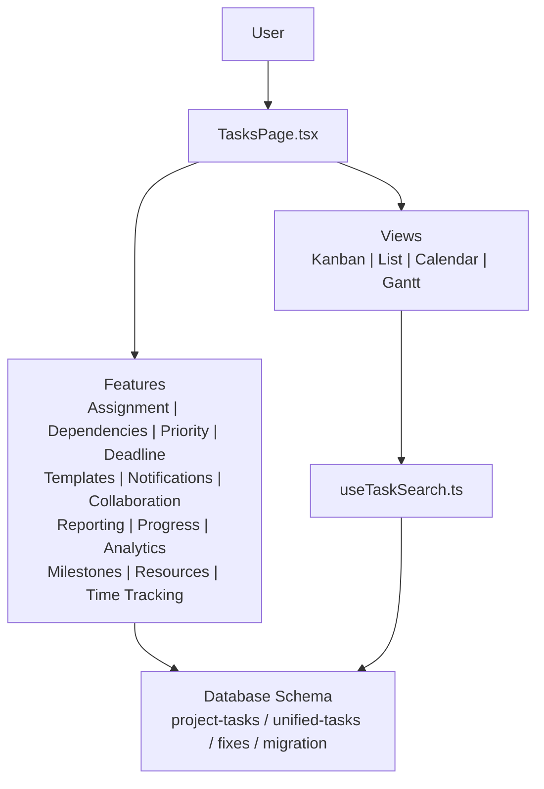

[No sources needed since this diagram shows conceptual workflow, not actual code structure]

## Detailed Component Analysis

### Task Creation and Assignment
- TaskForm: Guided creation flow with validation, field mapping, and persistence.
- TaskAssignment: Assignees selection, role-based visibility, and bulk assignment options.
- Database contracts ensure referential integrity for assignees and ownership.

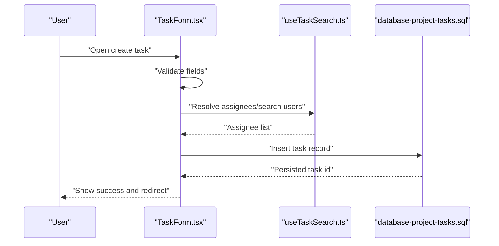

**Diagram sources**
- [components/tasks/task-form.tsx](file://src/components/tasks/task-form.tsx)
- [useTaskSearch.ts](file://src/hooks/useTaskSearch.ts)
- [database-project-tasks.sql](file://src/database-project-tasks.sql)

**Section sources**
- [components/tasks/task-form.tsx](file://src/components/tasks/task-form.tsx)
- [components/tasks/task-assignment.tsx](file://src/components/tasks/task-assignment.tsx)
- [database-project-tasks.sql](file://src/database-project-tasks.sql)

### Workflow Automation
- NotificationRules: Configure triggers (status change, due date near, assignment) and channels.
- TeamCollaboration: Comments, mentions, and activity feed tied to tasks.
- RealTimeUpdates: Live sync of status, comments, and assignments.

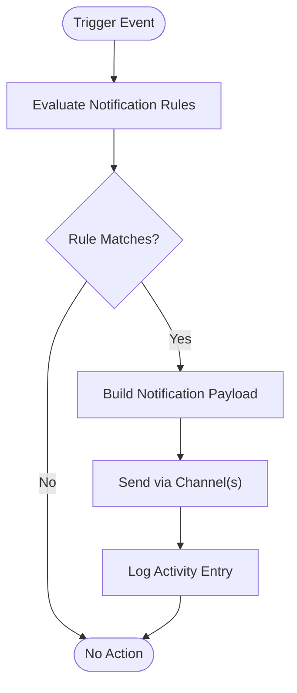

**Diagram sources**
- [components/tasks/notification-rules.tsx](file://src/components/tasks/notification-rules.tsx)
- [components/tasks/team-collaboration.tsx](file://src/components/tasks/team-collaboration.tsx)
- [components/tasks/real-time-updates.tsx](file://src/components/tasks/real-time-updates.tsx)

**Section sources**
- [components/tasks/notification-rules.tsx](file://src/components/tasks/notification-rules.tsx)
- [components/tasks/team-collaboration.tsx](file://src/components/tasks/team-collaboration.tsx)
- [components/tasks/real-time-updates.tsx](file://src/components/tasks/real-time-updates.tsx)

### View Modes

#### Kanban Board
- Drag-and-drop columns by status.
- Inline editing and quick actions from cards.
- Filters and search integrated with useTaskSearch.

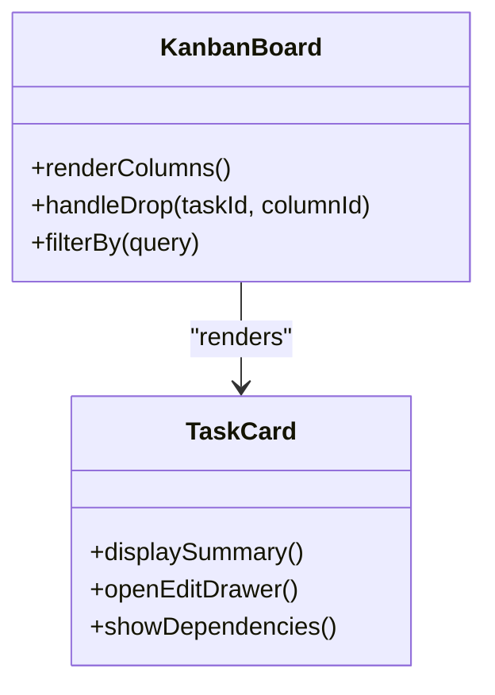

**Diagram sources**
- [components/tasks/kanban-board.tsx](file://src/components/tasks/kanban-board.tsx)
- [components/tasks/task-card.tsx](file://src/components/tasks/task-card.tsx)
- [useTaskSearch.ts](file://src/hooks/useTaskSearch.ts)

**Section sources**
- [components/tasks/kanban-board.tsx](file://src/components/tasks/kanban-board.tsx)
- [components/tasks/task-card.tsx](file://src/components/tasks/task-card.tsx)
- [useTaskSearch.ts](file://src/hooks/useTaskSearch.ts)

#### List View
- Sortable, filterable table with inline edits.
- Bulk operations (assign, move, mark complete).
- Export and pagination support.

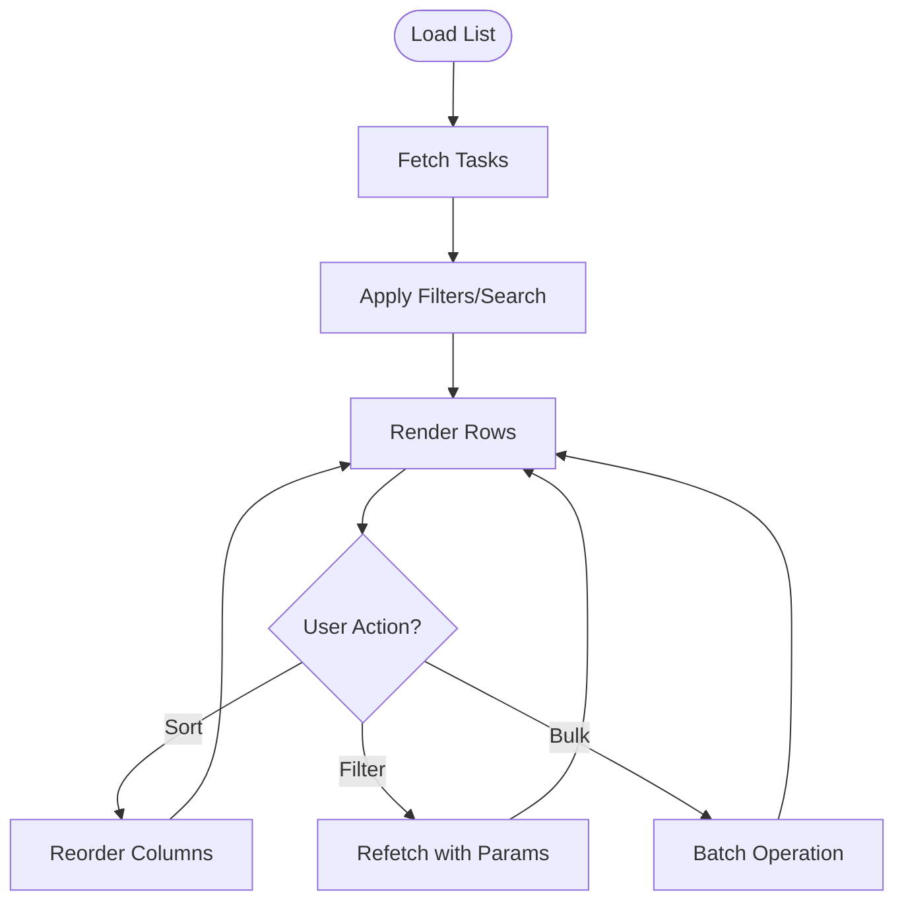

**Diagram sources**
- [components/tasks/list-view.tsx](file://src/components/tasks/list-view.tsx)
- [useTaskSearch.ts](file://src/hooks/useTaskSearch.ts)

**Section sources**
- [components/tasks/list-view.tsx](file://src/components/tasks/list-view.tsx)
- [useTaskSearch.ts](file://src/hooks/useTaskSearch.ts)

#### Calendar View
- Day/week/month views with task placement by deadline.
- Quick add and drag-to-reschedule.
- Overdue highlighting and color coding by priority.

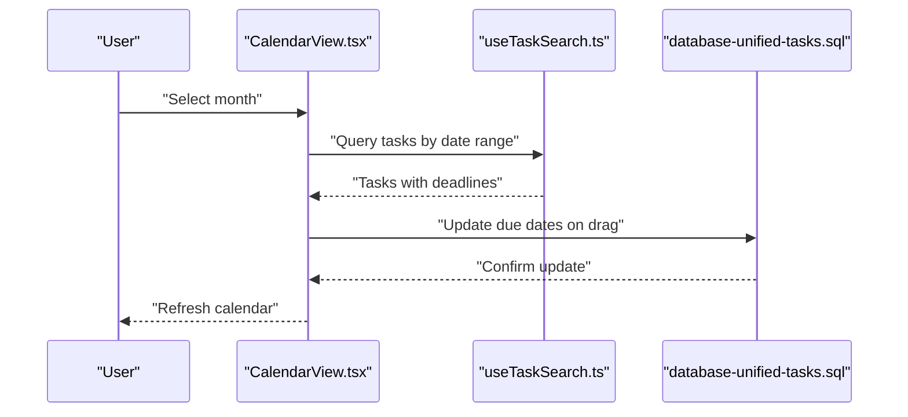

**Diagram sources**
- [components/tasks/calendar-view.tsx](file://src/components/tasks/calendar-view.tsx)
- [useTaskSearch.ts](file://src/hooks/useTaskSearch.ts)
- [database-unified-tasks.sql](file://src/database-unified-tasks.sql)

**Section sources**
- [components/tasks/calendar-view.tsx](file://src/components/tasks/calendar-view.tsx)
- [useTaskSearch.ts](file://src/hooks/useTaskSearch.ts)
- [database-unified-tasks.sql](file://src/database-unified-tasks.sql)

#### Gantt Chart
- Timeline visualization with dependency lines.
- Critical path indicators and milestone markers.
- Zoom controls and export to image/PDF.

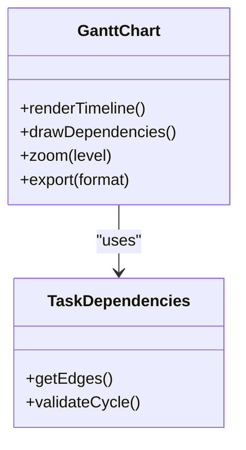

**Diagram sources**
- [components/tasks/gantt-chart.tsx](file://src/components/tasks/gantt-chart.tsx)
- [components/tasks/task-dependencies.tsx](file://src/components/tasks/task-dependencies.tsx)

**Section sources**
- [components/tasks/gantt-chart.tsx](file://src/components/tasks/gantt-chart.tsx)
- [components/tasks/task-dependencies.tsx](file://src/components/tasks/task-dependencies.tsx)

### Task Dependencies, Priority, and Deadlines
- TaskDependencies: Manage predecessor/successor relationships and cycle detection.
- TaskPriority: Enumerated levels with visual badges and sorting.
- TaskDeadline: Due date handling, reminders, and overdue logic.

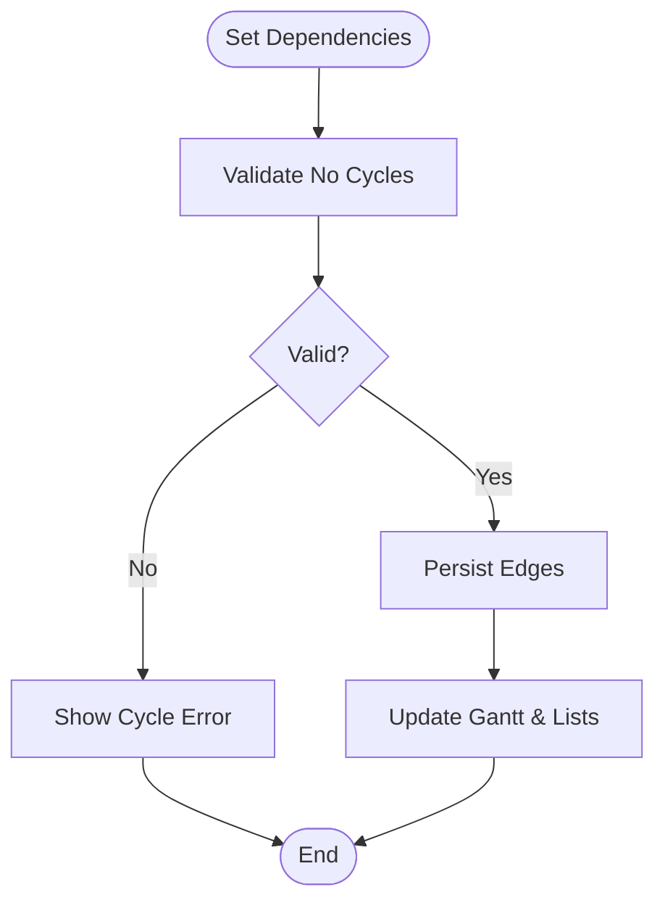

**Diagram sources**
- [components/tasks/task-dependencies.tsx](file://src/components/tasks/task-dependencies.tsx)
- [components/tasks/gantt-chart.tsx](file://src/components/tasks/gantt-chart.tsx)

**Section sources**
- [components/tasks/task-dependencies.tsx](file://src/components/tasks/task-dependencies.tsx)
- [components/tasks/task-priority.tsx](file://src/components/tasks/task-priority.tsx)
- [components/tasks/task-deadline.tsx](file://src/components/tasks/task-deadline.tsx)
- [database-tasks-fix.sql](file://src/database-tasks-fix.sql)
- [database-tasks-migration.sql](file://src/database-tasks-migration.sql)

### Templates, Automated Assignments, and Notification Rules
- TaskTemplate: Save reusable structures (fields, assignees, dependencies).
- AutomatedAssignments: Rule-based assignment based on tags, workload, or roles.
- NotificationRules: Trigger-based alerts for status changes, deadlines, and mentions.

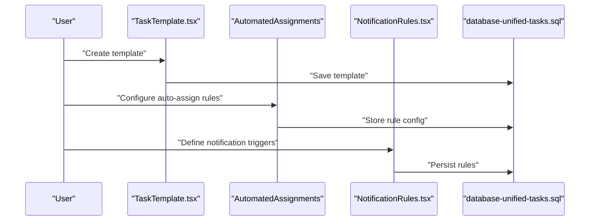

**Diagram sources**
- [components/tasks/task-template.tsx](file://src/components/tasks/task-template.tsx)
- [components/tasks/notification-rules.tsx](file://src/components/tasks/notification-rules.tsx)
- [database-unified-tasks.sql](file://src/database-unified-tasks.sql)

**Section sources**
- [components/tasks/task-template.tsx](file://src/components/tasks/task-template.tsx)
- [components/tasks/notification-rules.tsx](file://src/components/tasks/notification-rules.tsx)
- [database-unified-tasks.sql](file://src/database-unified-tasks.sql)

### Team Collaboration, Real-time Updates, and Mobile Accessibility
- TeamCollaboration: Comments, @mentions, and activity timeline.
- RealTimeUpdates: Live synchronization of changes across clients.
- MobileAccessibility: Responsive layouts, touch-friendly controls, and offline hints.

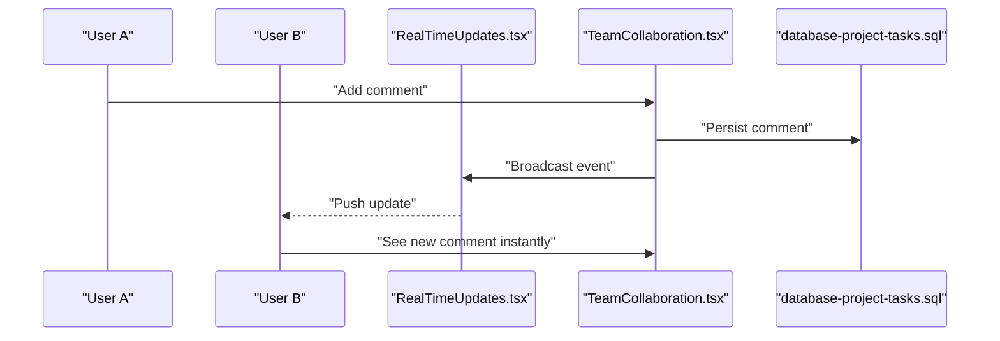

**Diagram sources**
- [components/tasks/team-collaboration.tsx](file://src/components/tasks/team-collaboration.tsx)
- [components/tasks/real-time-updates.tsx](file://src/components/tasks/real-time-updates.tsx)
- [database-project-tasks.sql](file://src/database-project-tasks.sql)

**Section sources**
- [components/tasks/team-collaboration.tsx](file://src/components/tasks/team-collaboration.tsx)
- [components/tasks/real-time-updates.tsx](file://src/components/tasks/real-time-updates.tsx)
- [components/tasks/mobile-accessibility.tsx](file://src/components/tasks/mobile-accessibility.tsx)

### Reporting, Progress Tracking, and Performance Analytics
- TaskReporting: Aggregated metrics, completion rates, and bottlenecks.
- ProgressTracking: Percent complete, stage transitions, and burn-down visuals.
- PerformanceAnalytics: Throughput, lead time, and team productivity insights.

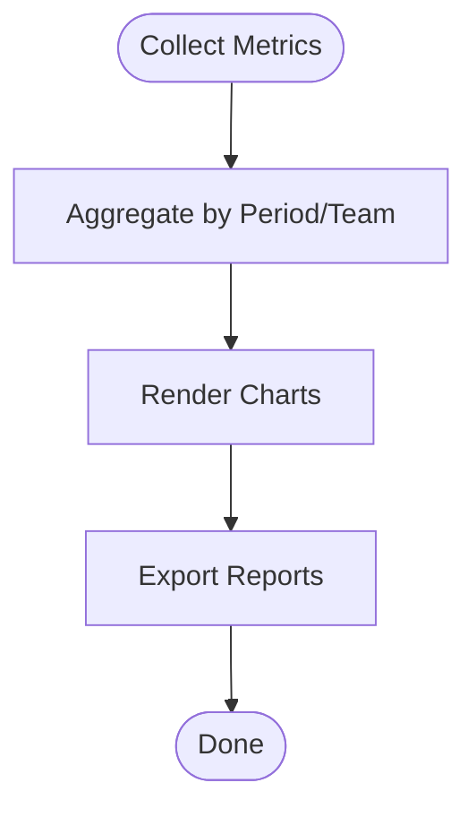

**Diagram sources**
- [components/tasks/task-reporting.tsx](file://src/components/tasks/task-reporting.tsx)
- [components/tasks/progress-tracking.tsx](file://src/components/tasks/progress-tracking.tsx)
- [components/tasks/performance-analytics.tsx](file://src/components/tasks/performance-analytics.tsx)

**Section sources**
- [components/tasks/task-reporting.tsx](file://src/components/tasks/task-reporting.tsx)
- [components/tasks/progress-tracking.tsx](file://src/components/tasks/progress-tracking.tsx)
- [components/tasks/performance-analytics.tsx](file://src/components/tasks/performance-analytics.tsx)

### Integrations: Milestones, Resource Allocation, and Time Tracking
- MilestoneIntegration: Link tasks to project milestones and track milestone health.
- ResourceAllocation: Capacity planning, workload balancing, and availability checks.
- TimeTracking: Log effort against tasks and reconcile with budgets.

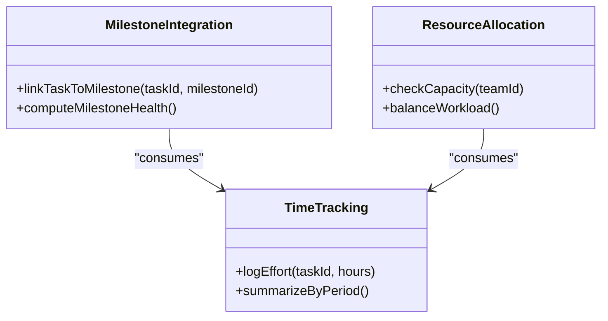

**Diagram sources**
- [components/tasks/milestone-integration.tsx](file://src/components/tasks/milestone-integration.tsx)
- [components/tasks/resource-allocation.tsx](file://src/components/tasks/resource-allocation.tsx)
- [components/tasks/time-tracking.tsx](file://src/components/tasks/time-tracking.tsx)

**Section sources**
- [components/tasks/milestone-integration.tsx](file://src/components/tasks/milestone-integration.tsx)
- [components/tasks/resource-allocation.tsx](file://src/components/tasks/resource-allocation.tsx)
- [components/tasks/time-tracking.tsx](file://src/components/tasks/time-tracking.tsx)

## Dependency Analysis
The following diagram highlights key module relationships and data dependencies.

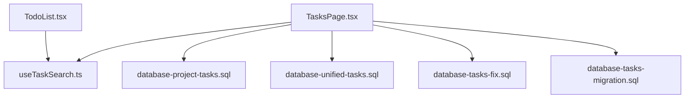

**Diagram sources**
- [TasksPage.tsx](file://src/pages/TasksPage.tsx)
- [TodoList.tsx](file://src/pages/TodoList.tsx)
- [useTaskSearch.ts](file://src/hooks/useTaskSearch.ts)
- [database-project-tasks.sql](file://src/database-project-tasks.sql)
- [database-unified-tasks.sql](file://src/database-unified-tasks.sql)
- [database-tasks-fix.sql](file://src/database-tasks-fix.sql)
- [database-tasks-migration.sql](file://src/database-tasks-migration.sql)

**Section sources**
- [TasksPage.tsx](file://src/pages/TasksPage.tsx)
- [TodoList.tsx](file://src/pages/TodoList.tsx)
- [useTaskSearch.ts](file://src/hooks/useTaskSearch.ts)
- [database-project-tasks.sql](file://src/database-project-tasks.sql)
- [database-unified-tasks.sql](file://src/database-unified-tasks.sql)
- [database-tasks-fix.sql](file://src/database-tasks-fix.sql)
- [database-tasks-migration.sql](file://src/database-tasks-migration.sql)

## Performance Considerations
- Prefer server-side filtering and pagination for large datasets.
- Debounce search inputs and batch updates where possible.
- Use virtualization for long lists and heavy tables.
- Cache frequent queries and invalidate on mutations.
- Optimize Gantt rendering by lazy-loading segments and limiting visible windows.

[No sources needed since this section provides general guidance]

## Troubleshooting Guide
Common issues and resolutions:
- Duplicate or orphaned dependencies: Validate cycles and remove invalid edges before saving.
- Missing assignees: Ensure user lookup returns results and fallbacks are handled.
- Stale calendar events: Refresh after drag-and-drop and confirm persisted due dates.
- Notification delays: Verify trigger conditions and channel connectivity.
- Mobile rendering glitches: Test responsive breakpoints and touch targets.

**Section sources**
- [components/tasks/task-dependencies.tsx](file://src/components/tasks/task-dependencies.tsx)
- [components/tasks/calendar-view.tsx](file://src/components/tasks/calendar-view.tsx)
- [components/tasks/notification-rules.tsx](file://src/components/tasks/notification-rules.tsx)
- [components/tasks/mobile-accessibility.tsx](file://src/components/tasks/mobile-accessibility.tsx)

## Conclusion
The Task Management System provides a comprehensive suite of features for creating, assigning, and automating tasks across multiple views. With robust dependency management, prioritization, deadline tracking, templates, notifications, collaboration tools, real-time updates, and mobile support, it enables teams to plan effectively and execute efficiently. Integrated reporting, progress tracking, and analytics offer actionable insights, while milestone, resource, and time tracking integrations align daily work with broader project goals.

[No sources needed since this section summarizes without analyzing specific files]

## Appendices

### Examples and How-To Guides

- Creating a Task Template
  - Open the template manager, define default fields, assignees, and dependencies, then save for reuse.
  - Reference: [components/tasks/task-template.tsx](file://src/components/tasks/task-template.tsx)

- Setting Up Automated Assignments
  - Create rules based on tags, roles, or workload thresholds; apply them to new tasks or updates.
  - Reference: [components/tasks/notification-rules.tsx](file://src/components/tasks/notification-rules.tsx)

- Configuring Notification Rules
  - Choose triggers (status change, due date proximity, mentions), select channels, and test delivery.
  - Reference: [components/tasks/notification-rules.tsx](file://src/components/tasks/notification-rules.tsx)

- Using the Kanban Board
  - Drag tasks between columns to update status; use filters and search to focus on subsets.
  - Reference: [components/tasks/kanban-board.tsx](file://src/components/tasks/kanban-board.tsx)

- Working in List View
  - Sort columns, apply filters, perform bulk actions, and export results.
  - Reference: [components/tasks/list-view.tsx](file://src/components/tasks/list-view.tsx)

- Planning with Calendar View
  - Place tasks by deadline, drag to reschedule, and review overdue items.
  - Reference: [components/tasks/calendar-view.tsx](file://src/components/tasks/calendar-view.tsx)

- Visualizing with Gantt Chart
  - Inspect timelines, dependency lines, and critical path; zoom and export as needed.
  - Reference: [components/tasks/gantt-chart.tsx](file://src/components/tasks/gantt-chart.tsx)

- Managing Dependencies
  - Add predecessors/successors, validate for cycles, and keep plans consistent.
  - Reference: [components/tasks/task-dependencies.tsx](file://src/components/tasks/task-dependencies.tsx)

- Prioritizing and Tracking Deadlines
  - Set priority levels and due dates; leverage reminders and overdue flags.
  - Reference: [components/tasks/task-priority.tsx](file://src/components/tasks/task-priority.tsx), [components/tasks/task-deadline.tsx](file://src/components/tasks/task-deadline.tsx)

- Collaborating in Real Time
  - Comment, mention teammates, and see live updates across devices.
  - Reference: [components/tasks/team-collaboration.tsx](file://src/components/tasks/team-collaboration.tsx), [components/tasks/real-time-updates.tsx](file://src/components/tasks/real-time-updates.tsx)

- Accessing on Mobile
  - Use responsive layouts, touch-friendly controls, and offline hints.
  - Reference: [components/tasks/mobile-accessibility.tsx](file://src/components/tasks/mobile-accessibility.tsx)

- Generating Reports and Tracking Progress
  - Review completion rates, bottlenecks, and burn-down charts; export summaries.
  - Reference: [components/tasks/task-reporting.tsx](file://src/components/tasks/task-reporting.tsx), [components/tasks/progress-tracking.tsx](file://src/components/tasks/progress-tracking.tsx)

- Analyzing Performance
  - Measure throughput, lead times, and team productivity trends.
  - Reference: [components/tasks/performance-analytics.tsx](file://src/components/tasks/performance-analytics.tsx)

- Integrating with Milestones, Resources, and Time
  - Link tasks to milestones, balance workloads, and log effort for reconciliation.
  - Reference: [components/tasks/milestone-integration.tsx](file://src/components/tasks/milestone-integration.tsx), [components/tasks/resource-allocation.tsx](file://src/components/tasks/resource-allocation.tsx), [components/tasks/time-tracking.tsx](file://src/components/tasks/time-tracking.tsx)