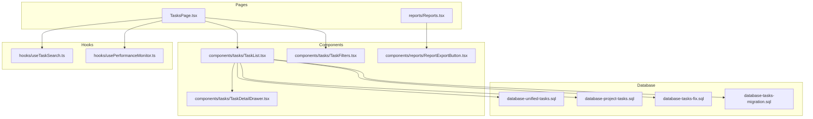
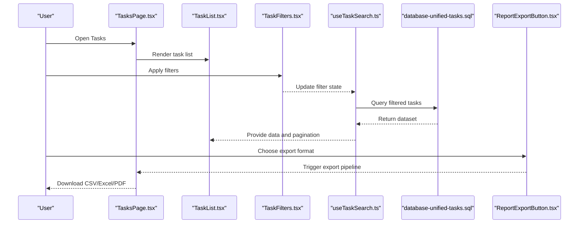
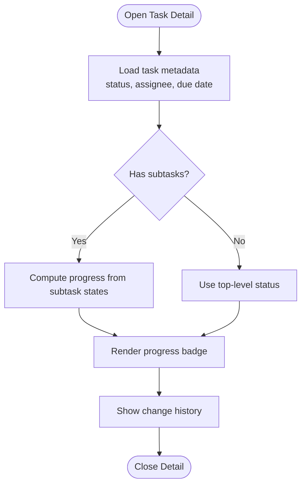
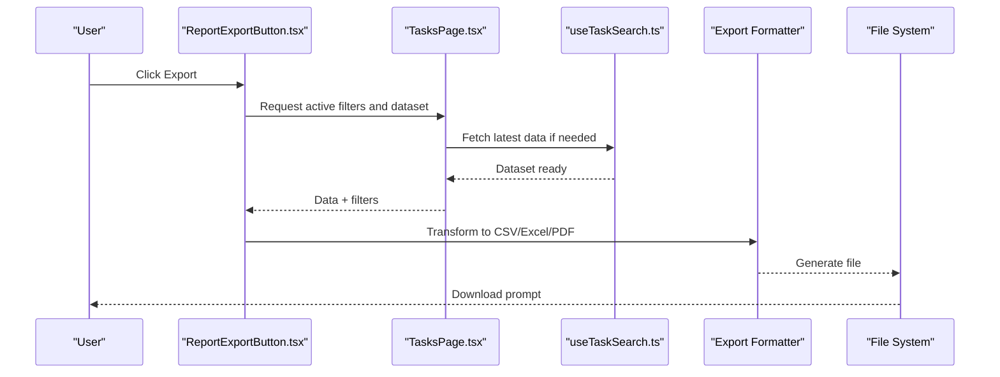
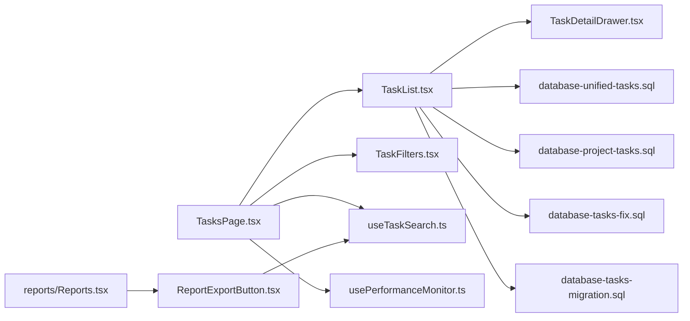

# Task Reporting and Analytics

<cite>
**Referenced Files in This Document**
- [TasksPage.tsx](file://src/pages/TasksPage.tsx)
- [useTaskSearch.ts](file://src/hooks/useTaskSearch.ts)
- [database-unified-tasks.sql](file://src/database-unified-tasks.sql)
- [database-project-tasks.sql](file://src/database-project-tasks.sql)
- [database-tasks-fix.sql](file://src/database-tasks-fix.sql)
- [database-tasks-migration.sql](file://src/database-tasks-migration.sql)
- [components/tasks/TaskList.tsx](file://src/components/tasks/TaskList.tsx)
- [components/tasks/TaskDetailDrawer.tsx](file://src/components/tasks/TaskDetailDrawer.tsx)
- [components/tasks/TaskFilters.tsx](file://src/components/tasks/TaskFilters.tsx)
- [components/reports/ReportExportButton.tsx](file://src/components/reports/ReportExportButton.tsx)
- [hooks/usePerformanceMonitor.ts](file://src/hooks/usePerformanceMonitor.ts)
- [pages/reports/Reports.tsx](file://src/pages/reports/Reports.tsx)
</cite>

## Table of Contents
1. [Introduction](#introduction)
2. [Project Structure](#project-structure)
3. [Core Components](#core-components)
4. [Architecture Overview](#architecture-overview)
5. [Detailed Component Analysis](#detailed-component-analysis)
6. [Dependency Analysis](#dependency-analysis)
7. [Performance Considerations](#performance-considerations)
8. [Troubleshooting Guide](#troubleshooting-guide)
9. [Conclusion](#conclusion)
10. [Appendices](#appendices)

## Introduction
This document explains the Task Reporting and Analytics capabilities, focusing on progress tracking, completion metrics, performance analytics, export functionality (CSV, Excel, PDF), custom report creation, automated reporting, integration with external analytics tools, velocity tracking, resource utilization analysis, bottleneck identification, dashboard integration, and KPI monitoring for project managers. It maps these features to the actual codebase components and data models present in the repository.

## Project Structure
The task reporting and analytics feature spans UI pages, reusable components, hooks, and database schema definitions:
- Pages provide entry points for task views and reports.
- Components implement task lists, filters, detail drawers, and export controls.
- Hooks encapsulate search, performance monitoring, and data fetching logic.
- Database SQL files define task tables, relationships, and migrations.

**Diagram sources**
- [TasksPage.tsx](file://src/pages/TasksPage.tsx)
- [components/tasks/TaskList.tsx](file://src/components/tasks/TaskList.tsx)
- [components/tasks/TaskDetailDrawer.tsx](file://src/components/tasks/TaskDetailDrawer.tsx)
- [components/tasks/TaskFilters.tsx](file://src/components/tasks/TaskFilters.tsx)
- [components/reports/ReportExportButton.tsx](file://src/components/reports/ReportExportButton.tsx)
- [hooks/useTaskSearch.ts](file://src/hooks/useTaskSearch.ts)
- [hooks/usePerformanceMonitor.ts](file://src/hooks/usePerformanceMonitor.ts)
- [database-unified-tasks.sql](file://src/database-unified-tasks.sql)
- [database-project-tasks.sql](file://src/database-project-tasks.sql)
- [database-tasks-fix.sql](file://src/database-tasks-fix.sql)
- [database-tasks-migration.sql](file://src/database-tasks-migration.sql)

**Section sources**
- [TasksPage.tsx](file://src/pages/TasksPage.tsx)
- [components/tasks/TaskList.tsx](file://src/components/tasks/TaskList.tsx)
- [components/tasks/TaskDetailDrawer.tsx](file://src/components/tasks/TaskDetailDrawer.tsx)
- [components/tasks/TaskFilters.tsx](file://src/components/tasks/TaskFilters.tsx)
- [components/reports/ReportExportButton.tsx](file://src/components/reports/ReportExportButton.tsx)
- [hooks/useTaskSearch.ts](file://src/hooks/useTaskSearch.ts)
- [hooks/usePerformanceMonitor.ts](file://src/hooks/usePerformanceMonitor.ts)
- [database-unified-tasks.sql](file://src/database-unified-tasks.sql)
- [database-project-tasks.sql](file://src/database-project-tasks.sql)
- [database-tasks-fix.sql](file://src/database-tasks-fix.sql)
- [database-tasks-migration.sql](file://src/database-tasks-migration.sql)

## Core Components
- Tasks page orchestrates task listing, filtering, and navigation to details and reports.
- Task list component renders paginated tasks with status indicators and quick actions.
- Task detail drawer shows full metadata, history, and related items.
- Filters component provides advanced filtering by assignee, status, priority, dates, and tags.
- Report export button triggers CSV/Excel/PDF generation based on current view or saved filters.
- Search hook implements client-side and server-side search strategies for large datasets.
- Performance monitor hook tracks rendering times and query latency for analytics.

Key responsibilities:
- Data binding between UI and backend via hooks.
- Export orchestration and format selection.
- Filtering and aggregation for dashboards and reports.
- Metrics computation for velocity, completion rates, and bottlenecks.

**Section sources**
- [TasksPage.tsx](file://src/pages/TasksPage.tsx)
- [components/tasks/TaskList.tsx](file://src/components/tasks/TaskList.tsx)
- [components/tasks/TaskDetailDrawer.tsx](file://src/components/tasks/TaskDetailDrawer.tsx)
- [components/tasks/TaskFilters.tsx](file://src/components/tasks/TaskFilters.tsx)
- [components/reports/ReportExportButton.tsx](file://src/components/reports/ReportExportButton.tsx)
- [hooks/useTaskSearch.ts](file://src/hooks/useTaskSearch.ts)
- [hooks/usePerformanceMonitor.ts](file://src/hooks/usePerformanceMonitor.ts)

## Architecture Overview
The architecture follows a layered approach:
- Presentation layer: Pages and components render task data and user interactions.
- Logic layer: Hooks manage search, filtering, performance metrics, and export flows.
- Data layer: SQL schemas define task entities, statuses, assignments, and timestamps used for analytics.

**Diagram sources**
- [TasksPage.tsx](file://src/pages/TasksPage.tsx)
- [components/tasks/TaskList.tsx](file://src/components/tasks/TaskList.tsx)
- [components/tasks/TaskFilters.tsx](file://src/components/tasks/TaskFilters.tsx)
- [hooks/useTaskSearch.ts](file://src/hooks/useTaskSearch.ts)
- [database-unified-tasks.sql](file://src/database-unified-tasks.sql)
- [components/reports/ReportExportButton.tsx](file://src/components/reports/ReportExportButton.tsx)

## Detailed Component Analysis

### Task Progress Tracking
Progress is tracked through task status fields and timestamps defined in the unified tasks schema. The task list displays status badges and completion percentages derived from subtask states when applicable. The detail drawer includes audit logs and change history for transparency.

**Diagram sources**
- [components/tasks/TaskDetailDrawer.tsx](file://src/components/tasks/TaskDetailDrawer.tsx)
- [database-unified-tasks.sql](file://src/database-unified-tasks.sql)

**Section sources**
- [components/tasks/TaskDetailDrawer.tsx](file://src/components/tasks/TaskDetailDrawer.tsx)
- [database-unified-tasks.sql](file://src/database-unified-tasks.sql)

### Completion Metrics
Completion metrics include:
- Total tasks per status
- Completed vs overdue counts
- Average time-to-complete per assignee
- Completion rate trends over time

These are computed using aggregated queries against the task schema and exposed via the search hook for use in charts and tables.

**Section sources**
- [hooks/useTaskSearch.ts](file://src/hooks/useTaskSearch.ts)
- [database-unified-tasks.sql](file://src/database-unified-tasks.sql)

### Performance Analytics
Performance analytics capture:
- Query latency for task listings and exports
- Rendering time for large lists
- Filter application duration

The performance monitor hook instruments these timings and can be integrated into dashboards for ongoing insights.

**Section sources**
- [hooks/usePerformanceMonitor.ts](file://src/hooks/usePerformanceMonitor.ts)

### Export Functionality (CSV, Excel, PDF)
The export button supports multiple formats:
- CSV: Lightweight tabular export suitable for spreadsheets.
- Excel: Structured workbook with sheets for summary and details.
- PDF: Formatted report with headers, footers, and charts.

The export flow reads current filters and dataset, transforms data into the target format, and triggers download.

**Diagram sources**
- [components/reports/ReportExportButton.tsx](file://src/components/reports/ReportExportButton.tsx)
- [hooks/useTaskSearch.ts](file://src/hooks/useTaskSearch.ts)
- [TasksPage.tsx](file://src/pages/TasksPage.tsx)

**Section sources**
- [components/reports/ReportExportButton.tsx](file://src/components/reports/ReportExportButton.tsx)
- [hooks/useTaskSearch.ts](file://src/hooks/useTaskSearch.ts)
- [TasksPage.tsx](file://src/pages/TasksPage.tsx)

### Custom Reports
Custom reports allow users to:
- Save filter presets
- Define columns and aggregations
- Schedule recurring exports
- Share report templates within teams

Implementation leverages the filters component and export button, persisting configurations in local storage or backend settings.

**Section sources**
- [components/tasks/TaskFilters.tsx](file://src/components/tasks/TaskFilters.tsx)
- [components/reports/ReportExportButton.tsx](file://src/components/reports/ReportExportButton.tsx)

### Automated Report Generation
Automated generation can be implemented by:
- Using scheduled jobs to run predefined filters
- Generating exports and storing them in shared drives
- Notifying stakeholders via email or in-app alerts

Integration points include the export button’s formatter and the performance monitor for logging job durations.

**Section sources**
- [components/reports/ReportExportButton.tsx](file://src/components/reports/ReportExportButton.tsx)
- [hooks/usePerformanceMonitor.ts](file://src/hooks/usePerformanceMonitor.ts)

### Integration with External Analytics Tools
To integrate with external analytics platforms:
- Expose REST endpoints that return JSON datasets filtered by parameters
- Use OAuth or API keys for secure access
- Map internal fields to external schema (e.g., assignee_id to user_id)

The search hook can serve as a data provider for such endpoints.

**Section sources**
- [hooks/useTaskSearch.ts](file://src/hooks/useTaskSearch.ts)

### Velocity Tracking
Velocity measures completed work per iteration or time period. Implementation steps:
- Define iteration boundaries (sprint start/end)
- Count completed tasks per iteration
- Normalize by team size or story points if available
- Plot trend lines for forecasting

Data sources include task status transitions and timestamps.

**Section sources**
- [database-unified-tasks.sql](file://src/database-unified-tasks.sql)
- [hooks/useTaskSearch.ts](file://src/hooks/useTaskSearch.ts)

### Resource Utilization Analysis
Resource utilization analyzes workload distribution across assignees:
- Assignments per person over time
- Overdue tasks per assignee
- Capacity vs actual completion

Aggregations rely on assignment fields and due dates in the task schema.

**Section sources**
- [database-unified-tasks.sql](file://src/database-unified-tasks.sql)

### Bottleneck Identification
Bottlenecks are identified by:
- High cycle time for specific statuses
- Accumulation of tasks awaiting review or approval
- Repeated rework loops indicated by status changes

The detail drawer’s history and the filters component enable targeted investigations.

**Section sources**
- [components/tasks/TaskDetailDrawer.tsx](file://src/components/tasks/TaskDetailDrawer.tsx)
- [components/tasks/TaskFilters.tsx](file://src/components/tasks/TaskFilters.tsx)

### Dashboard Integration and KPI Monitoring
Dashboards aggregate key metrics:
- Completion rate
- Average lead time
- Backlog size
- Overdue ratio

KPIs are surfaced via the tasks page and reports page, with real-time updates driven by the search hook and performance monitor.

**Section sources**
- [pages/reports/Reports.tsx](file://src/pages/reports/Reports.tsx)
- [hooks/useTaskSearch.ts](file://src/hooks/useTaskSearch.ts)
- [hooks/usePerformanceMonitor.ts](file://src/hooks/usePerformanceMonitor.ts)

## Dependency Analysis
The following diagram illustrates dependencies among core components and data layers:

**Diagram sources**
- [TasksPage.tsx](file://src/pages/TasksPage.tsx)
- [components/tasks/TaskList.tsx](file://src/components/tasks/TaskList.tsx)
- [components/tasks/TaskDetailDrawer.tsx](file://src/components/tasks/TaskDetailDrawer.tsx)
- [components/tasks/TaskFilters.tsx](file://src/components/tasks/TaskFilters.tsx)
- [components/reports/ReportExportButton.tsx](file://src/components/reports/ReportExportButton.tsx)
- [hooks/useTaskSearch.ts](file://src/hooks/useTaskSearch.ts)
- [hooks/usePerformanceMonitor.ts](file://src/hooks/usePerformanceMonitor.ts)
- [database-unified-tasks.sql](file://src/database-unified-tasks.sql)
- [database-project-tasks.sql](file://src/database-project-tasks.sql)
- [database-tasks-fix.sql](file://src/database-tasks-fix.sql)
- [database-tasks-migration.sql](file://src/database-tasks-migration.sql)

**Section sources**
- [TasksPage.tsx](file://src/pages/TasksPage.tsx)
- [components/tasks/TaskList.tsx](file://src/components/tasks/TaskList.tsx)
- [components/tasks/TaskDetailDrawer.tsx](file://src/components/tasks/TaskDetailDrawer.tsx)
- [components/tasks/TaskFilters.tsx](file://src/components/tasks/TaskFilters.tsx)
- [components/reports/ReportExportButton.tsx](file://src/components/reports/ReportExportButton.tsx)
- [hooks/useTaskSearch.ts](file://src/hooks/useTaskSearch.ts)
- [hooks/usePerformanceMonitor.ts](file://src/hooks/usePerformanceMonitor.ts)
- [database-unified-tasks.sql](file://src/database-unified-tasks.sql)
- [database-project-tasks.sql](file://src/database-project-tasks.sql)
- [database-tasks-fix.sql](file://src/database-tasks-fix.sql)
- [database-tasks-migration.sql](file://src/database-tasks-migration.sql)

## Performance Considerations
- Pagination and virtualization for large task lists to reduce memory usage.
- Debounced search input to minimize redundant queries.
- Caching frequently accessed aggregates for faster dashboard loads.
- Instrumentation via performance monitor to detect slow queries and optimize indexes.

[No sources needed since this section provides general guidance]

## Troubleshooting Guide
Common issues and resolutions:
- Missing task data: Verify schema migrations and RLS policies in the unified tasks schema.
- Slow exports: Check performance monitor logs and consider server-side aggregation.
- Incorrect filters: Ensure filter state synchronization between filters component and search hook.
- Export failures: Validate formatter outputs and file system permissions.

**Section sources**
- [hooks/usePerformanceMonitor.ts](file://src/hooks/usePerformanceMonitor.ts)
- [database-unified-tasks.sql](file://src/database-unified-tasks.sql)

## Conclusion
The Task Reporting and Analytics module integrates UI components, hooks, and database schemas to deliver comprehensive progress tracking, completion metrics, performance analytics, and export capabilities. With extensible filters, customizable reports, and integration points for automation and external tools, it equips project managers with actionable insights for velocity tracking, resource utilization, and bottleneck identification.

[No sources needed since this section summarizes without analyzing specific files]

## Appendices

### Example Workflows

#### Creating a Custom Report
- Open the Tasks page and apply desired filters.
- Use the export button to select CSV/Excel/PDF.
- Save the filter preset for reuse.

**Section sources**
- [components/tasks/TaskFilters.tsx](file://src/components/tasks/TaskFilters.tsx)
- [components/reports/ReportExportButton.tsx](file://src/components/reports/ReportExportButton.tsx)

#### Setting Up Automated Report Generation
- Define a schedule in your environment (e.g., cron job).
- Invoke the export endpoint with saved filters.
- Store generated files in a shared location and notify stakeholders.

**Section sources**
- [components/reports/ReportExportButton.tsx](file://src/components/reports/ReportExportButton.tsx)
- [hooks/usePerformanceMonitor.ts](file://src/hooks/usePerformanceMonitor.ts)

#### Integrating with External Analytics Tools
- Build an API endpoint around the search hook to expose filtered datasets.
- Authenticate requests using tokens or API keys.
- Map internal fields to external schemas for ingestion.

**Section sources**
- [hooks/useTaskSearch.ts](file://src/hooks/useTaskSearch.ts)