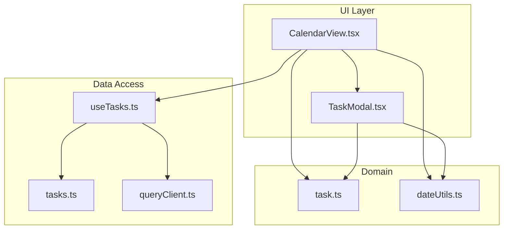
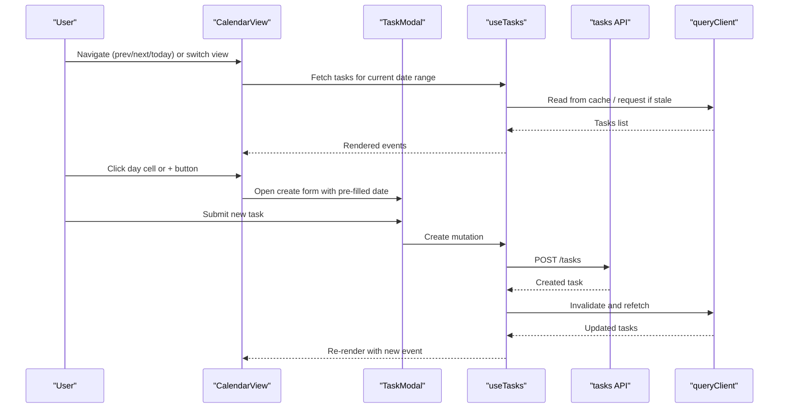
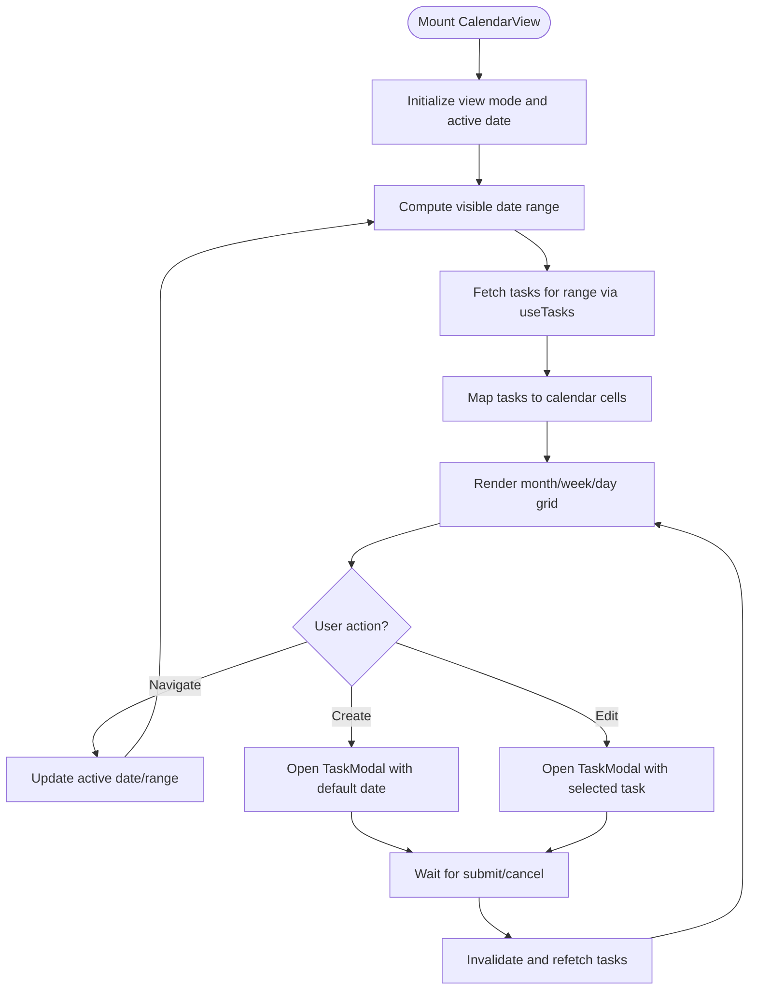
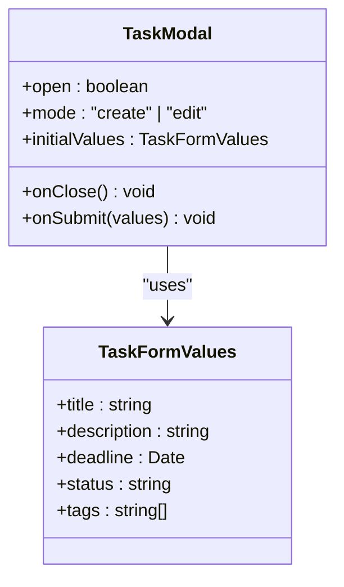
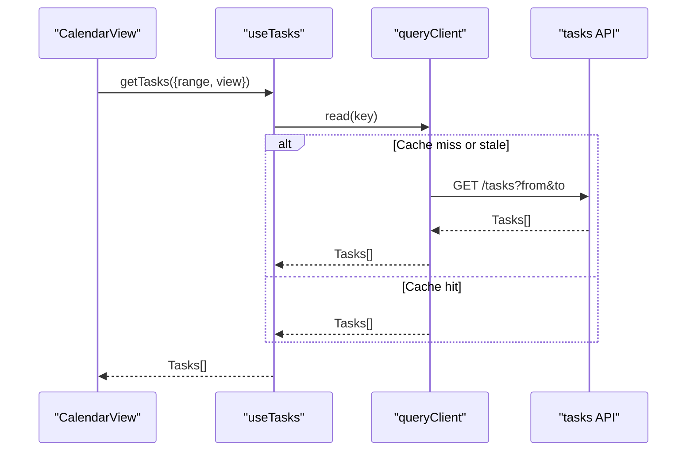
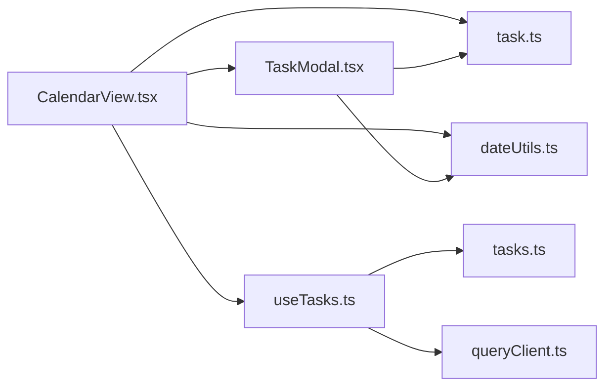

# Calendar View

<cite>
**Referenced Files in This Document**
- [src/components/tasks/CalendarView.tsx](file://src/components/tasks/CalendarView.tsx)
- [src/components/tasks/TaskModal.tsx](file://src/components/tasks/TaskModal.tsx)
- [src/hooks/useTasks.ts](file://src/hooks/useTasks.ts)
- [src/api/tasks.ts](file://src/api/tasks.ts)
- [src/types/task.ts](file://src/types/task.ts)
- [src/utils/dateUtils.ts](file://src/utils/dateUtils.ts)
- [src/config/queryClient.ts](file://src/config/queryClient.ts)
</cite>

## Table of Contents
1. [Introduction](#introduction)
2. [Project Structure](#project-structure)
3. [Core Components](#core-components)
4. [Architecture Overview](#architecture-overview)
5. [Detailed Component Analysis](#detailed-component-analysis)
6. [Dependency Analysis](#dependency-analysis)
7. [Performance Considerations](#performance-considerations)
8. [Troubleshooting Guide](#troubleshooting-guide)
9. [Conclusion](#conclusion)
10. [Appendices](#appendices)

## Introduction
This document explains the Calendar view component that visualizes tasks on a date-based calendar, supports month/week/day views, and enables deadline management. It covers navigation, event rendering, user interactions for creating and editing tasks directly from the calendar, customization options (appearance and date formats), and integration points with external calendars.

## Project Structure
The Calendar view is implemented as a React component within the tasks module. It composes reusable UI primitives, hooks for data access, and utilities for date handling. The key files are:
- CalendarView: main calendar UI and interaction orchestration
- TaskModal: create/edit task modal used by the calendar
- useTasks: hook to fetch and mutate tasks
- tasks API: server-side endpoints for CRUD operations
- types: shared TypeScript definitions for tasks and dates
- dateUtils: formatting and parsing helpers
- queryClient: TanStack Query configuration for caching and refetching

**Diagram sources**
- [src/components/tasks/CalendarView.tsx](file://src/components/tasks/CalendarView.tsx)
- [src/components/tasks/TaskModal.tsx](file://src/components/tasks/TaskModal.tsx)
- [src/hooks/useTasks.ts](file://src/hooks/useTasks.ts)
- [src/api/tasks.ts](file://src/api/tasks.ts)
- [src/config/queryClient.ts](file://src/config/queryClient.ts)
- [src/types/task.ts](file://src/types/task.ts)
- [src/utils/dateUtils.ts](file://src/utils/dateUtils.ts)

**Section sources**
- [src/components/tasks/CalendarView.tsx](file://src/components/tasks/CalendarView.tsx)
- [src/components/tasks/TaskModal.tsx](file://src/components/tasks/TaskModal.tsx)
- [src/hooks/useTasks.ts](file://src/hooks/useTasks.ts)
- [src/api/tasks.ts](file://src/api/tasks.ts)
- [src/types/task.ts](file://src/types/task.ts)
- [src/utils/dateUtils.ts](file://src/utils/dateUtils.ts)
- [src/config/queryClient.ts](file://src/config/queryClient.ts)

## Core Components
- CalendarView
  - Renders the calendar grid for month/week/day views
  - Handles navigation (prev/next/today) and view switching
  - Displays task events on appropriate dates
  - Opens TaskModal for create/edit actions
  - Delegates date formatting and range calculations to dateUtils
- TaskModal
  - Create and edit forms bound to task fields
  - Validates inputs and triggers mutations via useTasks
  - Supports setting deadlines and recurring patterns if applicable
- useTasks
  - Provides queries for fetching tasks filtered by date ranges
  - Exposes mutations for create/update/delete
  - Integrates with TanStack Query for caching and background updates
- tasks API
  - Defines REST or RPC endpoints for task CRUD
- types
  - Shared interfaces for Task, DateRange, ViewMode, etc.
- dateUtils
  - Formatting, parsing, and range computation helpers
- queryClient
  - Global cache settings, retry policies, and default options

**Section sources**
- [src/components/tasks/CalendarView.tsx](file://src/components/tasks/CalendarView.tsx)
- [src/components/tasks/TaskModal.tsx](file://src/components/tasks/TaskModal.tsx)
- [src/hooks/useTasks.ts](file://src/hooks/useTasks.ts)
- [src/api/tasks.ts](file://src/api/tasks.ts)
- [src/types/task.ts](file://src/types/task.ts)
- [src/utils/dateUtils.ts](file://src/utils/dateUtils.ts)
- [src/config/queryClient.ts](file://src/config/queryClient.ts)

## Architecture Overview
The Calendar view follows a layered architecture:
- Presentation layer: CalendarView and TaskModal render UI and capture user interactions
- Business logic layer: useTasks encapsulates data fetching and mutations
- Data layer: tasks API communicates with the backend
- Domain layer: types define contracts; dateUtils provides pure functions for date operations
- Infrastructure layer: queryClient configures caching and network behavior

**Diagram sources**
- [src/components/tasks/CalendarView.tsx](file://src/components/tasks/CalendarView.tsx)
- [src/components/tasks/TaskModal.tsx](file://src/components/tasks/TaskModal.tsx)
- [src/hooks/useTasks.ts](file://src/hooks/useTasks.ts)
- [src/api/tasks.ts](file://src/api/tasks.ts)
- [src/config/queryClient.ts](file://src/config/queryClient.ts)

## Detailed Component Analysis

### CalendarView
Responsibilities:
- Manage view state (month/week/day) and active date range
- Compute visible days and map tasks to cells
- Provide keyboard and mouse navigation
- Trigger TaskModal for creation and editing
- Apply appearance customizations (colors, density, labels)

Key behaviors:
- Navigation: prev/next/today buttons update the active date and recompute the range
- Rendering: maps tasks to calendar cells based on start/end dates
- Interactions: click-to-create on empty cells; click-to-edit on existing events
- Customization: props for theme tokens, label formats, and visibility toggles

**Diagram sources**
- [src/components/tasks/CalendarView.tsx](file://src/components/tasks/CalendarView.tsx)
- [src/hooks/useTasks.ts](file://src/hooks/useTasks.ts)
- [src/components/tasks/TaskModal.tsx](file://src/components/tasks/TaskModal.tsx)

**Section sources**
- [src/components/tasks/CalendarView.tsx](file://src/components/tasks/CalendarView.tsx)

### TaskModal
Responsibilities:
- Present create/edit forms for tasks
- Validate required fields (title, deadline, optional recurrence)
- Trigger mutations through useTasks
- Close and notify parent to refresh

Key behaviors:
- Pre-fill defaults when opened from a specific date
- Enforce business rules (e.g., deadline cannot be before start)
- Show success/error feedback using global notifications

**Diagram sources**
- [src/components/tasks/TaskModal.tsx](file://src/components/tasks/TaskModal.tsx)
- [src/types/task.ts](file://src/types/task.ts)

**Section sources**
- [src/components/tasks/TaskModal.tsx](file://src/components/tasks/TaskModal.tsx)
- [src/types/task.ts](file://src/types/task.ts)

### useTasks Hook
Responsibilities:
- Provide queries for tasks scoped to a date range
- Expose mutations for create/update/delete
- Integrate with queryClient for caching and automatic refetches

Key behaviors:
- Builds query keys including view mode and date range
- Invalidates queries after mutations to keep UI consistent
- Supports optimistic updates where appropriate

**Diagram sources**
- [src/hooks/useTasks.ts](file://src/hooks/useTasks.ts)
- [src/config/queryClient.ts](file://src/config/queryClient.ts)
- [src/api/tasks.ts](file://src/api/tasks.ts)

**Section sources**
- [src/hooks/useTasks.ts](file://src/hooks/useTasks.ts)
- [src/config/queryClient.ts](file://src/config/queryClient.ts)
- [src/api/tasks.ts](file://src/api/tasks.ts)

### Date Utilities and Types
Responsibilities:
- Format and parse dates consistently across views
- Compute week boundaries, month grids, and day slots
- Define shared types for tasks and calendar state

Key behaviors:
- Centralized locale-aware formatting
- Pure functions for date math to avoid side effects
- Strong typing to prevent runtime errors

**Section sources**
- [src/utils/dateUtils.ts](file://src/utils/dateUtils.ts)
- [src/types/task.ts](file://src/types/task.ts)

## Dependency Analysis
High-level dependencies:
- CalendarView depends on TaskModal, useTasks, dateUtils, and types
- useTasks depends on tasks API and queryClient
- TaskModal depends on types and dateUtils
- All components rely on queryClient for caching and refetch strategies

**Diagram sources**
- [src/components/tasks/CalendarView.tsx](file://src/components/tasks/CalendarView.tsx)
- [src/components/tasks/TaskModal.tsx](file://src/components/tasks/TaskModal.tsx)
- [src/hooks/useTasks.ts](file://src/hooks/useTasks.ts)
- [src/api/tasks.ts](file://src/api/tasks.ts)
- [src/config/queryClient.ts](file://src/config/queryClient.ts)
- [src/types/task.ts](file://src/types/task.ts)
- [src/utils/dateUtils.ts](file://src/utils/dateUtils.ts)

**Section sources**
- [src/components/tasks/CalendarView.tsx](file://src/components/tasks/CalendarView.tsx)
- [src/components/tasks/TaskModal.tsx](file://src/components/tasks/TaskModal.tsx)
- [src/hooks/useTasks.ts](file://src/hooks/useTasks.ts)
- [src/api/tasks.ts](file://src/api/tasks.ts)
- [src/config/queryClient.ts](file://src/config/queryClient.ts)
- [src/types/task.ts](file://src/types/task.ts)
- [src/utils/dateUtils.ts](file://src/utils/dateUtils.ts)

## Performance Considerations
- Virtualization: For large datasets, consider virtualizing calendar rows/columns to reduce DOM size
- Memoization: Memoize computed ranges and event mappings to avoid unnecessary recalculations
- Batching mutations: Group multiple updates to minimize network requests
- Pagination: If supported by the API, paginate tasks by date range to limit payload sizes
- Debounce navigation: Debounce rapid prev/next clicks to prevent excessive refetches
- Caching strategy: Tune queryClient’s staleTime and gcTime to balance freshness and performance

[No sources needed since this section provides general guidance]

## Troubleshooting Guide
Common issues and resolutions:
- Events not appearing
  - Verify date range passed to useTasks matches the intended view
  - Check query invalidation after mutations
  - Ensure date formatting aligns with backend expectations
- Modal does not close after save
  - Confirm onSubmit handler calls onClose and triggers refetch
  - Inspect error states and toast notifications
- Incorrect date display
  - Validate locale and format strings in dateUtils
  - Ensure timezone conversions are handled consistently
- Slow navigation
  - Add debouncing to navigation handlers
  - Review queryClient settings and consider increasing staleTime

**Section sources**
- [src/hooks/useTasks.ts](file://src/hooks/useTasks.ts)
- [src/components/tasks/TaskModal.tsx](file://src/components/tasks/TaskModal.tsx)
- [src/utils/dateUtils.ts](file://src/utils/dateUtils.ts)
- [src/config/queryClient.ts](file://src/config/queryClient.ts)

## Conclusion
The Calendar view integrates cleanly with the tasks domain, providing an intuitive interface for date-based visualization and deadline management. Its modular design separates concerns between UI, data access, and utilities, enabling customization and extensibility. With proper caching, memoization, and validation, it delivers responsive performance and a smooth user experience.

[No sources needed since this section summarizes without analyzing specific files]

## Appendices

### Customization Examples
- Appearance
  - Theme tokens: override colors for events, headers, and accents via CSS variables or theme provider
  - Density: adjust row height and font size for compact or spacious layouts
  - Labels: customize weekday/month names and tooltips
- Date Formats
  - Configure locale-aware formats in dateUtils
  - Support multiple timezones if required by users
- External Calendar Integration
  - Export events to iCal by generating .ics payloads from tasks
  - Import external events by mapping remote fields to local Task type
  - Sync bi-directionally via scheduled jobs or webhooks

[No sources needed since this section provides general guidance]