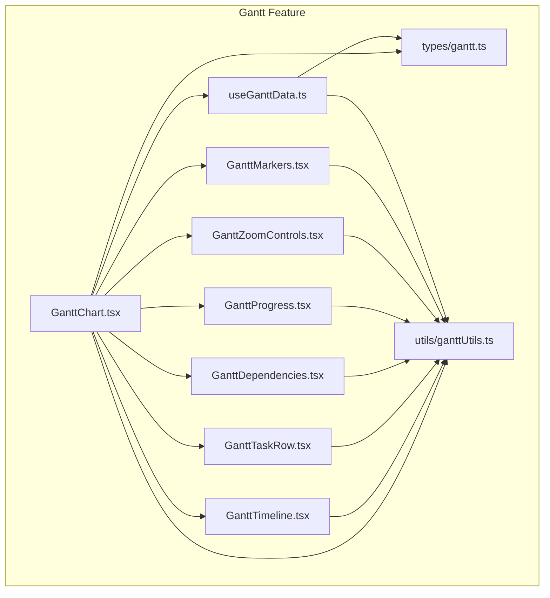
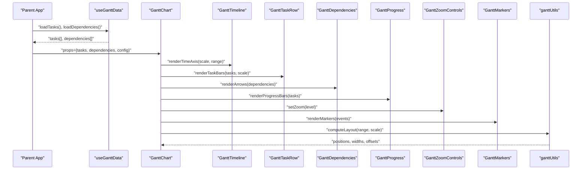
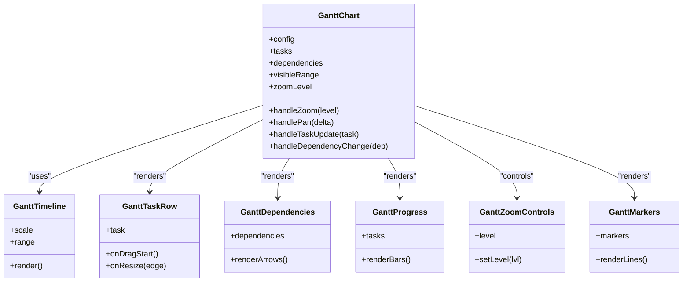
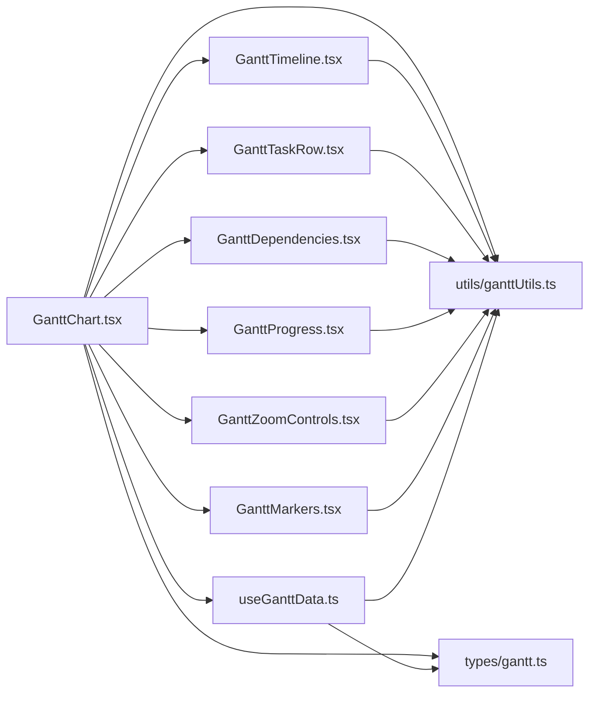

# Gantt Chart Visualization

<cite>
**Referenced Files in This Document**
- [src/components/tasks/GanttChart.tsx](file://src/components/tasks/GanttChart.tsx)
- [src/components/tasks/GanttTimeline.tsx](file://src/components/tasks/GanttTimeline.tsx)
- [src/components/tasks/GanttTaskRow.tsx](file://src/components/tasks/GanttTaskRow.tsx)
- [src/components/tasks/GanttDependencies.tsx](file://src/components/tasks/GanttDependencies.tsx)
- [src/components/tasks/GanttProgress.tsx](file://src/components/tasks/GanttProgress.tsx)
- [src/components/tasks/GanttZoomControls.tsx](file://src/components/tasks/GanttZoomControls.tsx)
- [src/components/tasks/GanttMarkers.tsx](file://src/components/tasks/GanttMarkers.tsx)
- [src/hooks/useGanttData.ts](file://src/hooks/useGanttData.ts)
- [src/types/gantt.ts](file://src/types/gantt.ts)
- [src/utils/ganttUtils.ts](file://src/utils/ganttUtils.ts)
</cite>

## Table of Contents
1. [Introduction](#introduction)
2. [Project Structure](#project-structure)
3. [Core Components](#core-components)
4. [Architecture Overview](#architecture-overview)
5. [Detailed Component Analysis](#detailed-component-analysis)
6. [Dependency Analysis](#dependency-analysis)
7. [Performance Considerations](#performance-considerations)
8. [Troubleshooting Guide](#troubleshooting-guide)
9. [Conclusion](#conclusion)
10. [Appendices](#appendices)

## Introduction
This document provides comprehensive documentation for the Gantt chart component suite used to visualize project timelines, manage task dependencies, track progress, and allocate resources. It explains timeline rendering, scaling and zoom controls, interactive manipulation features, and configuration options for appearance, dependency mapping, and custom markers. The goal is to enable both developers and product teams to implement, customize, and troubleshoot the Gantt visualization effectively.

## Project Structure
The Gantt feature is organized into focused components, hooks, types, and utilities:
- Components: Timeline rendering, task rows, dependencies, progress bars, zoom controls, and markers
- Hooks: Data fetching and state management for tasks and dependencies
- Types: Shared interfaces for tasks, dependencies, and chart configuration
- Utilities: Date math, layout calculations, and helper functions

**Diagram sources**
- [src/components/tasks/GanttChart.tsx](file://src/components/tasks/GanttChart.tsx)
- [src/components/tasks/GanttTimeline.tsx](file://src/components/tasks/GanttTimeline.tsx)
- [src/components/tasks/GanttTaskRow.tsx](file://src/components/tasks/GanttTaskRow.tsx)
- [src/components/tasks/GanttDependencies.tsx](file://src/components/tasks/GanttDependencies.tsx)
- [src/components/tasks/GanttProgress.tsx](file://src/components/tasks/GanttProgress.tsx)
- [src/components/tasks/GanttZoomControls.tsx](file://src/components/tasks/GanttZoomControls.tsx)
- [src/components/tasks/GanttMarkers.tsx](file://src/components/tasks/GanttMarkers.tsx)
- [src/hooks/useGanttData.ts](file://src/hooks/useGanttData.ts)
- [src/types/gantt.ts](file://src/types/gantt.ts)
- [src/utils/ganttUtils.ts](file://src/utils/ganttUtils.ts)

**Section sources**
- [src/components/tasks/GanttChart.tsx](file://src/components/tasks/GanttChart.tsx)
- [src/hooks/useGanttData.ts](file://src/hooks/useGanttData.ts)
- [src/types/gantt.ts](file://src/types/gantt.ts)
- [src/utils/ganttUtils.ts](file://src/utils/ganttUtils.ts)

## Core Components
- GanttChart: Orchestrates data loading, view state (zoom/scroll), and composes child components for timeline, tasks, dependencies, progress, markers, and controls.
- GanttTimeline: Renders the time axis with configurable scales (day/week/month), grid lines, and scroll synchronization.
- GanttTaskRow: Displays individual tasks as horizontal bars with labels, grouping, and drag-to-resize or move interactions.
- GanttDependencies: Draws dependency arrows between tasks based on defined relationships.
- GanttProgress: Visualizes completion percentage per task and aggregates overall progress.
- GanttZoomControls: Provides UI for zoom levels and keyboard/mouse wheel zooming.
- GanttMarkers: Adds vertical markers for milestones, today line, holidays, or custom events.

Key responsibilities:
- Data binding via useGanttData hook
- Layout computation via ganttUtils
- Type safety via shared types
- Interactivity through event handlers and controlled state

**Section sources**
- [src/components/tasks/GanttChart.tsx](file://src/components/tasks/GanttChart.tsx)
- [src/components/tasks/GanttTimeline.tsx](file://src/components/tasks/GanttTimeline.tsx)
- [src/components/tasks/GanttTaskRow.tsx](file://src/components/tasks/GanttTaskRow.tsx)
- [src/components/tasks/GanttDependencies.tsx](file://src/components/tasks/GanttDependencies.tsx)
- [src/components/tasks/GanttProgress.tsx](file://src/components/tasks/GanttProgress.tsx)
- [src/components/tasks/GanttZoomControls.tsx](file://src/components/tasks/GanttZoomControls.tsx)
- [src/components/tasks/GanttMarkers.tsx](file://src/components/tasks/GanttMarkers.tsx)
- [src/hooks/useGanttData.ts](file://src/hooks/useGanttData.ts)
- [src/types/gantt.ts](file://src/types/gantt.ts)
- [src/utils/ganttUtils.ts](file://src/utils/ganttUtils.ts)

## Architecture Overview
The Gantt system follows a unidirectional data flow:
- Data layer: useGanttData fetches and normalizes tasks and dependencies
- View layer: GanttChart composes specialized components
- Utilities: ganttUtils computes positions, durations, and intersections
- Types: gantt.ts defines contracts for inputs and outputs

**Diagram sources**
- [src/hooks/useGanttData.ts](file://src/hooks/useGanttData.ts)
- [src/components/tasks/GanttChart.tsx](file://src/components/tasks/GanttChart.tsx)
- [src/components/tasks/GanttTimeline.tsx](file://src/components/tasks/GanttTimeline.tsx)
- [src/components/tasks/GanttTaskRow.tsx](file://src/components/tasks/GanttTaskRow.tsx)
- [src/components/tasks/GanttDependencies.tsx](file://src/components/tasks/GanttDependencies.tsx)
- [src/components/tasks/GanttProgress.tsx](file://src/components/tasks/GanttProgress.tsx)
- [src/components/tasks/GanttZoomControls.tsx](file://src/components/tasks/GanttZoomControls.tsx)
- [src/components/tasks/GanttMarkers.tsx](file://src/components/tasks/GanttMarkers.tsx)
- [src/utils/ganttUtils.ts](file://src/utils/ganttUtils.ts)

## Detailed Component Analysis

### GanttChart
Responsibilities:
- Compose all subcomponents
- Manage view state (zoom level, visible date range, scroll position)
- Provide context for interactivity (dragging, resizing, selection)
- Handle user actions that mutate tasks and dependencies

Configuration highlights:
- Appearance: theme tokens, bar colors, font sizes, row height
- Behavior: enable/disable dragging, resizing, dependency editing
- Data: initial tasks, dependencies, and optional resource assignments

Interactions:
- Mouse/touch drag to pan horizontally
- Scroll wheel or buttons to zoom
- Click to select, double-click to edit
- Drag edges to resize duration
- Drag body to move start/end dates

**Section sources**
- [src/components/tasks/GanttChart.tsx](file://src/components/tasks/GanttChart.tsx)
- [src/types/gantt.ts](file://src/types/gantt.ts)
- [src/utils/ganttUtils.ts](file://src/utils/ganttUtils.ts)

#### Class Diagram

**Diagram sources**
- [src/components/tasks/GanttChart.tsx](file://src/components/tasks/GanttChart.tsx)
- [src/components/tasks/GanttTimeline.tsx](file://src/components/tasks/GanttTimeline.tsx)
- [src/components/tasks/GanttTaskRow.tsx](file://src/components/tasks/GanttTaskRow.tsx)
- [src/components/tasks/GanttDependencies.tsx](file://src/components/tasks/GanttDependencies.tsx)
- [src/components/tasks/GanttProgress.tsx](file://src/components/tasks/GanttProgress.tsx)
- [src/components/tasks/GanttZoomControls.tsx](file://src/components/tasks/GanttZoomControls.tsx)
- [src/components/tasks/GanttMarkers.tsx](file://src/components/tasks/GanttMarkers.tsx)

### GanttTimeline
Features:
- Scales: day, week, month
- Grid lines and labels aligned to scale
- Synced scrolling with task area
- Optional weekend/holiday shading

Complexity considerations:
- Label generation is O(n) over visible days
- Debounced re-renders on scroll to maintain performance

**Section sources**
- [src/components/tasks/GanttTimeline.tsx](file://src/components/tasks/GanttTimeline.tsx)
- [src/utils/ganttUtils.ts](file://src/utils/ganttUtils.ts)

### GanttTaskRow
Features:
- Horizontal bars positioned by start/end dates
- Labels, color coding by status/resource
- Drag to move, drag edges to resize
- Keyboard navigation and accessibility attributes

Edge cases:
- Clamping to min/max project dates
- Preventing overlap unless allowed by rules

**Section sources**
- [src/components/tasks/GanttTaskRow.tsx](file://src/components/tasks/GanttTaskRow.tsx)
- [src/utils/ganttUtils.ts](file://src/utils/ganttUtils.ts)

### GanttDependencies
Features:
- Dependency types: finish-to-start, start-to-start, etc.
- Bezier curves connecting tasks
- Validation to prevent cycles

Rendering logic:
- Compute source/target endpoints
- Resolve overlaps and crossings
- Animate on updates

**Section sources**
- [src/components/tasks/GanttDependencies.tsx](file://src/components/tasks/GanttDependencies.tsx)
- [src/utils/ganttUtils.ts](file://src/utils/ganttUtils.ts)

### GanttProgress
Features:
- Per-task progress overlay
- Aggregated project progress indicator
- Color thresholds for on-track, at-risk, overdue

Updates:
- Real-time sync when tasks update
- Smooth transitions on progress changes

**Section sources**
- [src/components/tasks/GanttProgress.tsx](file://src/components/tasks/GanttProgress.tsx)
- [src/utils/ganttUtils.ts](file://src/utils/ganttUtils.ts)

### GanttZoomControls
Features:
- Preset zoom levels (Day/Week/Month)
- Mouse wheel zoom centered on cursor
- Keyboard shortcuts (+/-)

State:
- Controlled by parent GanttChart
- Emits events for persistence

**Section sources**
- [src/components/tasks/GanttZoomControls.tsx](file://src/components/tasks/GanttZoomControls.tsx)
- [src/components/tasks/GanttChart.tsx](file://src/components/tasks/GanttChart.tsx)

### GanttMarkers
Features:
- Today line
- Milestones and custom events
- Holiday shading
- Configurable label and tooltip

Extensibility:
- Pluggable marker providers
- Custom renderers per marker type

**Section sources**
- [src/components/tasks/GanttMarkers.tsx](file://src/components/tasks/GanttMarkers.tsx)
- [src/utils/ganttUtils.ts](file://src/utils/ganttUtils.ts)

### Data and Utilities
- useGanttData: Fetches tasks and dependencies, normalizes schema, handles errors and retries
- ganttUtils: Date arithmetic, pixel-to-date conversion, intersection detection, layout helpers
- types/gantt: Task, Dependency, Marker, Config interfaces

**Section sources**
- [src/hooks/useGanttData.ts](file://src/hooks/useGanttData.ts)
- [src/utils/ganttUtils.ts](file://src/utils/ganttUtils.ts)
- [src/types/gantt.ts](file://src/types/gantt.ts)

## Dependency Analysis
The following diagram shows how components depend on each other and shared modules:

**Diagram sources**
- [src/components/tasks/GanttChart.tsx](file://src/components/tasks/GanttChart.tsx)
- [src/components/tasks/GanttTimeline.tsx](file://src/components/tasks/GanttTimeline.tsx)
- [src/components/tasks/GanttTaskRow.tsx](file://src/components/tasks/GanttTaskRow.tsx)
- [src/components/tasks/GanttDependencies.tsx](file://src/components/tasks/GanttDependencies.tsx)
- [src/components/tasks/GanttProgress.tsx](file://src/components/tasks/GanttProgress.tsx)
- [src/components/tasks/GanttZoomControls.tsx](file://src/components/tasks/GanttZoomControls.tsx)
- [src/components/tasks/GanttMarkers.tsx](file://src/components/tasks/GanttMarkers.tsx)
- [src/hooks/useGanttData.ts](file://src/hooks/useGanttData.ts)
- [src/types/gantt.ts](file://src/types/gantt.ts)
- [src/utils/ganttUtils.ts](file://src/utils/ganttUtils.ts)

**Section sources**
- [src/components/tasks/GanttChart.tsx](file://src/components/tasks/GanttChart.tsx)
- [src/hooks/useGanttData.ts](file://src/hooks/useGanttData.ts)
- [src/types/gantt.ts](file://src/types/gantt.ts)
- [src/utils/ganttUtils.ts](file://src/utils/ganttUtils.ts)

## Performance Considerations
- Virtualization: For large datasets, consider virtualizing task rows to reduce DOM size.
- Memoization: Memoize computed layouts and heavy computations in ganttUtils.
- Debounce: Debounce scroll and resize handlers to avoid excessive re-renders.
- Batch updates: Coalesce multiple task updates before re-rendering.
- Canvas/SVG: For very large projects, switch dependency drawing to canvas or optimized SVG paths.
- Memory: Dispose of event listeners and timers on unmount.

[No sources needed since this section provides general guidance]

## Troubleshooting Guide
Common issues and resolutions:
- Tasks not visible: Ensure start/end dates are within the visible range; check scale and zoom settings.
- Dependency arrows misaligned: Verify task IDs and dependency references; confirm layout recalculation after updates.
- Progress not updating: Confirm task progress fields are updated and reactivity is wired correctly.
- Zoom jitter: Debounce wheel events and stabilize center point during zoom.
- Markers not showing: Validate marker dates and timezone handling; ensure markers are enabled in config.

Error handling patterns:
- Network failures in useGanttData should surface retry and fallback states.
- Invalid dependency graphs should be detected and reported early.

**Section sources**
- [src/hooks/useGanttData.ts](file://src/hooks/useGanttData.ts)
- [src/components/tasks/GanttDependencies.tsx](file://src/components/tasks/GanttDependencies.tsx)
- [src/components/tasks/GanttProgress.tsx](file://src/components/tasks/GanttProgress.tsx)
- [src/components/tasks/GanttZoomControls.tsx](file://src/components/tasks/GanttZoomControls.tsx)
- [src/components/tasks/GanttMarkers.tsx](file://src/components/tasks/GanttMarkers.tsx)

## Conclusion
The Gantt chart module provides a robust, extensible timeline visualization with strong separation of concerns. Its modular architecture enables easy customization of appearance, behavior, and data integration. By leveraging the provided hooks, types, and utilities, teams can rapidly implement advanced scheduling features such as dependency management, progress tracking, and resource allocation while maintaining performance and usability.

[No sources needed since this section summarizes without analyzing specific files]

## Appendices

### Configuration Examples
- Configure chart appearance: Set theme tokens, bar colors, fonts, and row heights via the chart config object.
- Set up task dependencies: Define dependency records linking task IDs and relationship types.
- Implement custom timeline markers: Provide an array of marker objects with date, label, and renderer overrides.

For concrete examples, refer to:
- [src/components/tasks/GanttChart.tsx](file://src/components/tasks/GanttChart.tsx)
- [src/types/gantt.ts](file://src/types/gantt.ts)
- [src/components/tasks/GanttMarkers.tsx](file://src/components/tasks/GanttMarkers.tsx)

### Interactive Controls Reference
- Pan: Click and drag horizontally
- Zoom: Mouse wheel or control panel
- Edit task: Double-click to open editor
- Resize: Drag left/right edges
- Move: Drag task body

See:
- [src/components/tasks/GanttTaskRow.tsx](file://src/components/tasks/GanttTaskRow.tsx)
- [src/components/tasks/GanttZoomControls.tsx](file://src/components/tasks/GanttZoomControls.tsx)