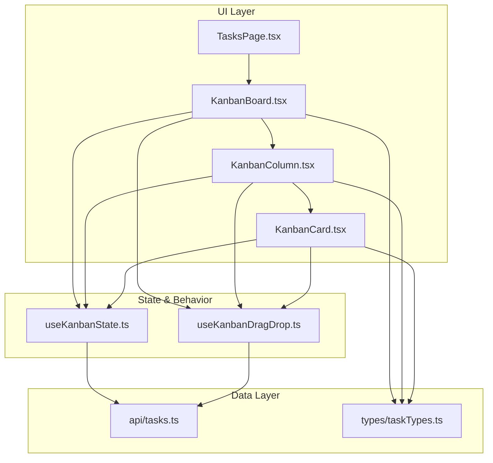
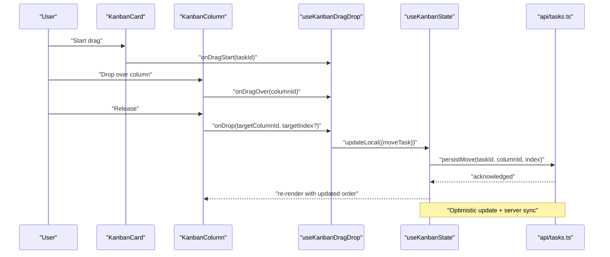
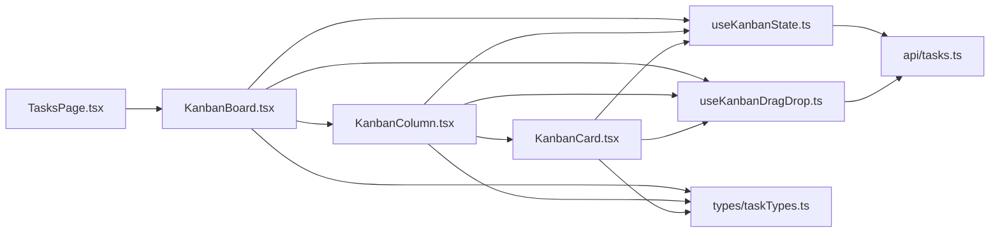

# Kanban Board View

<cite>
**Referenced Files in This Document**
- [src/components/tasks/KanbanBoard.tsx](file://src/components/tasks/KanbanBoard.tsx)
- [src/components/tasks/KanbanColumn.tsx](file://src/components/tasks/KanbanColumn.tsx)
- [src/components/tasks/KanbanCard.tsx](file://src/components/tasks/KanbanCard.tsx)
- [src/hooks/useKanbanState.ts](file://src/hooks/useKanbanState.ts)
- [src/hooks/useKanbanDragDrop.ts](file://src/hooks/useKanbanDragDrop.ts)
- [src/api/tasks.ts](file://src/api/tasks.ts)
- [src/types/taskTypes.ts](file://src/types/taskTypes.ts)
- [src/pages/TasksPage.tsx](file://src/pages/TasksPage.tsx)
</cite>

## Table of Contents
1. [Introduction](#introduction)
2. [Project Structure](#project-structure)
3. [Core Components](#core-components)
4. [Architecture Overview](#architecture-overview)
5. [Detailed Component Analysis](#detailed-component-analysis)
6. [Dependency Analysis](#dependency-analysis)
7. [Performance Considerations](#performance-considerations)
8. [Troubleshooting Guide](#troubleshooting-guide)
9. [Conclusion](#conclusion)

## Introduction
This document explains the Kanban Board view component, focusing on:
- Drag-and-drop implementation for moving tasks between columns and within columns
- Column configuration and task card rendering
- Board state management and real-time updates
- User interaction patterns
- Customization examples for columns, cards, and drop zones
- Performance optimization for large boards
- Touch device support

The goal is to help developers understand how the board works end-to-end and how to extend it safely and efficiently.

## Project Structure
The Kanban feature is organized into focused components, hooks, API integration, and types:
- Components:
  - Board container and layout
  - Column renderer with drop zone behavior
  - Task card renderer with actions and metadata
- Hooks:
  - State management for columns and tasks
  - Drag-and-drop orchestration (pointer events, reordering, cross-column moves)
- API:
  - Endpoints for fetching, updating, and syncing task changes
- Types:
  - Shared interfaces for tasks, columns, and board state
- Page:
  - Entry point that wires data loading, persistence, and UI

**Diagram sources**
- [src/pages/TasksPage.tsx](file://src/pages/TasksPage.tsx)
- [src/components/tasks/KanbanBoard.tsx](file://src/components/tasks/KanbanBoard.tsx)
- [src/components/tasks/KanbanColumn.tsx](file://src/components/tasks/KanbanColumn.tsx)
- [src/components/tasks/KanbanCard.tsx](file://src/components/tasks/KanbanCard.tsx)
- [src/hooks/useKanbanState.ts](file://src/hooks/useKanbanState.ts)
- [src/hooks/useKanbanDragDrop.ts](file://src/hooks/useKanbanDragDrop.ts)
- [src/api/tasks.ts](file://src/api/tasks.ts)
- [src/types/taskTypes.ts](file://src/types/taskTypes.ts)

**Section sources**
- [src/pages/TasksPage.tsx](file://src/pages/TasksPage.tsx)
- [src/components/tasks/KanbanBoard.tsx](file://src/components/tasks/KanbanBoard.tsx)
- [src/components/tasks/KanbanColumn.tsx](file://src/components/tasks/KanbanColumn.tsx)
- [src/components/tasks/KanbanCard.tsx](file://src/components/tasks/KanbanCard.tsx)
- [src/hooks/useKanbanState.ts](file://src/hooks/useKanbanState.ts)
- [src/hooks/useKanbanDragDrop.ts](file://src/hooks/useKanbanDragDrop.ts)
- [src/api/tasks.ts](file://src/api/tasks.ts)
- [src/types/taskTypes.ts](file://src/types/taskTypes.ts)

## Core Components
- KanbanBoard
  - Renders the full board layout, manages column order, and coordinates drag-and-drop context.
  - Subscribes to board state and persists changes via API calls.
- KanbanColumn
  - Represents a single column with a header and a list of task cards.
  - Implements drop zone behavior for receiving tasks from other columns or within the same column.
- KanbanCard
  - Displays task details and actions (e.g., open detail, edit).
  - Draggable element that participates in reorder and cross-column moves.

Key responsibilities:
- Rendering: Columns and cards are pure presentational layers driven by state.
- Interaction: Drag start/move/end handled by the drag-and-drop hook; columns expose drop targets.
- Persistence: State changes trigger optimistic updates followed by server sync.

**Section sources**
- [src/components/tasks/KanbanBoard.tsx](file://src/components/tasks/KanbanBoard.tsx)
- [src/components/tasks/KanbanColumn.tsx](file://src/components/tasks/KanbanColumn.tsx)
- [src/components/tasks/KanbanCard.tsx](file://src/components/tasks/KanbanCard.tsx)

## Architecture Overview
The board follows a unidirectional data flow:
- UI triggers interactions (drag, drop, click).
- The drag-and-drop hook computes new positions and updates local state optimistically.
- The state hook persists changes to the server and reconciles any conflicts.
- Real-time updates (if enabled) keep multiple users in sync.

**Diagram sources**
- [src/components/tasks/KanbanCard.tsx](file://src/components/tasks/KanbanCard.tsx)
- [src/components/tasks/KanbanColumn.tsx](file://src/components/tasks/KanbanColumn.tsx)
- [src/hooks/useKanbanDragDrop.ts](file://src/hooks/useKanbanDragDrop.ts)
- [src/hooks/useKanbanState.ts](file://src/hooks/useKanbanState.ts)
- [src/api/tasks.ts](file://src/api/tasks.ts)

## Detailed Component Analysis

### KanbanBoard
Responsibilities:
- Provides board-level props (columns, tasks, handlers).
- Coordinates drag-and-drop context across columns.
- Handles global keyboard shortcuts and accessibility attributes.

Implementation highlights:
- Uses a state hook to hold columns and tasks.
- Delegates drag operations to a dedicated hook.
- Renders a horizontal scrollable area with one KanbanColumn per column definition.

Customization points:
- Pass custom column definitions to control headers, visibility, and allowed statuses.
- Provide custom render functions for column headers and footers if needed.

**Section sources**
- [src/components/tasks/KanbanBoard.tsx](file://src/components/tasks/KanbanBoard.tsx)
- [src/hooks/useKanbanState.ts](file://src/hooks/useKanbanState.ts)
- [src/hooks/useKanbanDragDrop.ts](file://src/hooks/useKanbanDragDrop.ts)

### KanbanColumn
Responsibilities:
- Renders the column header and a list of task cards.
- Exposes drop zone behavior for both intra-column reordering and inter-column moves.
- Highlights when a task is being dragged over it.

Implementation highlights:
- Accepts a set of tasks filtered by column id.
- Integrates with the drag-and-drop hook to compute insertion indices.
- Supports empty states and “add task” affordances.

Customization points:
- Provide custom column header/footer components.
- Configure which tasks can be dropped here (status guards).
- Customize drop zone visuals via provided callbacks.

**Section sources**
- [src/components/tasks/KanbanColumn.tsx](file://src/components/tasks/KanbanColumn.tsx)
- [src/hooks/useKanbanDragDrop.ts](file://src/hooks/useKanbanDragDrop.ts)

### KanbanCard
Responsibilities:
- Displays task title, description, assignee, due date, and tags.
- Initiates drag operations and exposes action buttons.

Implementation highlights:
- Wraps content in a draggable surface.
- Emits drag events consumed by the drag-and-drop hook.
- Provides focus management and ARIA attributes for accessibility.

Customization points:
- Supply a custom card renderer to show domain-specific fields.
- Add inline actions (e.g., quick status change) that also persist via the state hook.

**Section sources**
- [src/components/tasks/KanbanCard.tsx](file://src/components/tasks/KanbanCard.tsx)
- [src/hooks/useKanbanDragDrop.ts](file://src/hooks/useKanbanDragDrop.ts)

### State Management: useKanbanState
Responsibilities:
- Holds columns and tasks in memory.
- Applies optimistic updates for move/reorder operations.
- Persists changes to the server and handles rollbacks on failure.
- Optionally subscribes to real-time channels for live updates.

Key behaviors:
- Optimistic updates ensure smooth UX while requests are in flight.
- Conflict resolution strategies (last-write-wins or server-driven reconciliation).
- Batched updates to reduce network chatter during rapid drags.

Real-time updates:
- If enabled, incoming remote changes merge into local state without disrupting active drags.
- Visual indicators may show pending vs. synced states.

**Section sources**
- [src/hooks/useKanbanState.ts](file://src/hooks/useKanbanState.ts)
- [src/api/tasks.ts](file://src/api/tasks.ts)

### Drag-and-Drop: useKanbanDragDrop
Responsibilities:
- Normalizes pointer events for mouse and touch.
- Tracks the dragged task, source column, and target column/index.
- Computes insertion positions and emits drop results.

Algorithm overview:
- On drag start: capture source task and initial position.
- On drag over: determine nearest valid drop target using bounding boxes and thresholds.
- On drop: calculate final column and index, then dispatch an update through the state hook.

Touch support:
- Uses pointer events to unify mouse and touch.
- Prevents default scrolling during long presses and provides haptic feedback where available.

Accessibility:
- Keyboard navigation supports moving tasks via arrow keys and Enter/Space to confirm drops.
- Focus management ensures screen readers announce current drag context.

**Section sources**
- [src/hooks/useKanbanDragDrop.ts](file://src/hooks/useKanbanDragDrop.ts)

### Data Model: types/taskTypes.ts
Defines shared interfaces for:
- Task entity (id, title, description, status/columnId, order, metadata).
- Column definition (id, title, color, visibility flags).
- Board state shape (columns array, tasks map/list).

These types ensure consistent contracts across components, hooks, and API calls.

**Section sources**
- [src/types/taskTypes.ts](file://src/types/taskTypes.ts)

### Integration: TasksPage
Entry point that:
- Loads board data (columns and tasks) from the API.
- Wires up the board components and hooks.
- Handles page-level settings (filters, permissions).

**Section sources**
- [src/pages/TasksPage.tsx](file://src/pages/TasksPage.tsx)

## Dependency Analysis
High-level dependencies:
- UI components depend on hooks for behavior and state.
- Hooks depend on API layer for persistence and real-time subscriptions.
- All modules share types for consistency.

**Diagram sources**
- [src/pages/TasksPage.tsx](file://src/pages/TasksPage.tsx)
- [src/components/tasks/KanbanBoard.tsx](file://src/components/tasks/KanbanBoard.tsx)
- [src/components/tasks/KanbanColumn.tsx](file://src/components/tasks/KanbanColumn.tsx)
- [src/components/tasks/KanbanCard.tsx](file://src/components/tasks/KanbanCard.tsx)
- [src/hooks/useKanbanState.ts](file://src/hooks/useKanbanState.ts)
- [src/hooks/useKanbanDragDrop.ts](file://src/hooks/useKanbanDragDrop.ts)
- [src/api/tasks.ts](file://src/api/tasks.ts)
- [src/types/taskTypes.ts](file://src/types/taskTypes.ts)

**Section sources**
- [src/components/tasks/KanbanBoard.tsx](file://src/components/tasks/KanbanBoard.tsx)
- [src/components/tasks/KanbanColumn.tsx](file://src/components/tasks/KanbanColumn.tsx)
- [src/components/tasks/KanbanCard.tsx](file://src/components/tasks/KanbanCard.tsx)
- [src/hooks/useKanbanState.ts](file://src/hooks/useKanbanState.ts)
- [src/hooks/useKanbanDragDrop.ts](file://src/hooks/useKanbanDragDrop.ts)
- [src/api/tasks.ts](file://src/api/tasks.ts)
- [src/types/taskTypes.ts](file://src/types/taskTypes.ts)
- [src/pages/TasksPage.tsx](file://src/pages/TasksPage.tsx)

## Performance Considerations
For large boards with many columns and tasks:
- Virtualization: Render only visible cards within each column to reduce DOM size.
- Memoization: Memoize expensive computations (e.g., filtering tasks by column) and stable references for props.
- Batching updates: Debounce or batch rapid reorder operations before sending to the server.
- Efficient diffs: Keep stable ids and minimize re-renders by avoiding unnecessary object recreation.
- Image/media optimization: Lazy-load images and compress thumbnails.
- Network efficiency: Use pagination or infinite scroll for very large datasets; prefer delta updates.

[No sources needed since this section provides general guidance]

## Troubleshooting Guide
Common issues and resolutions:
- Drag not starting on touch devices
  - Ensure pointer events are used and default touch behaviors are prevented during drag.
- Drop target not detected
  - Verify drop zone hit areas and event propagation; check that drag-over listeners are attached.
- State desync after refresh
  - Confirm optimistic updates are rolled back on error and that server responses reconcile correctly.
- Flickering during drag
  - Stabilize references and avoid recreating arrays/objects inside render paths.
- Accessibility problems
  - Confirm focus management and ARIA roles for draggable items and drop zones.

**Section sources**
- [src/hooks/useKanbanDragDrop.ts](file://src/hooks/useKanbanDragDrop.ts)
- [src/hooks/useKanbanState.ts](file://src/hooks/useKanbanState.ts)

## Conclusion
The Kanban Board view combines clear separation of concerns—components for rendering, hooks for behavior and state, and an API layer for persistence—with robust drag-and-drop, real-time synchronization, and customization points. By following the patterns outlined here, you can extend columns, customize cards, implement custom drop zones, and optimize performance for large boards while maintaining a responsive and accessible user experience.