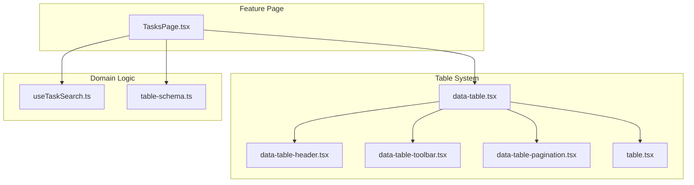
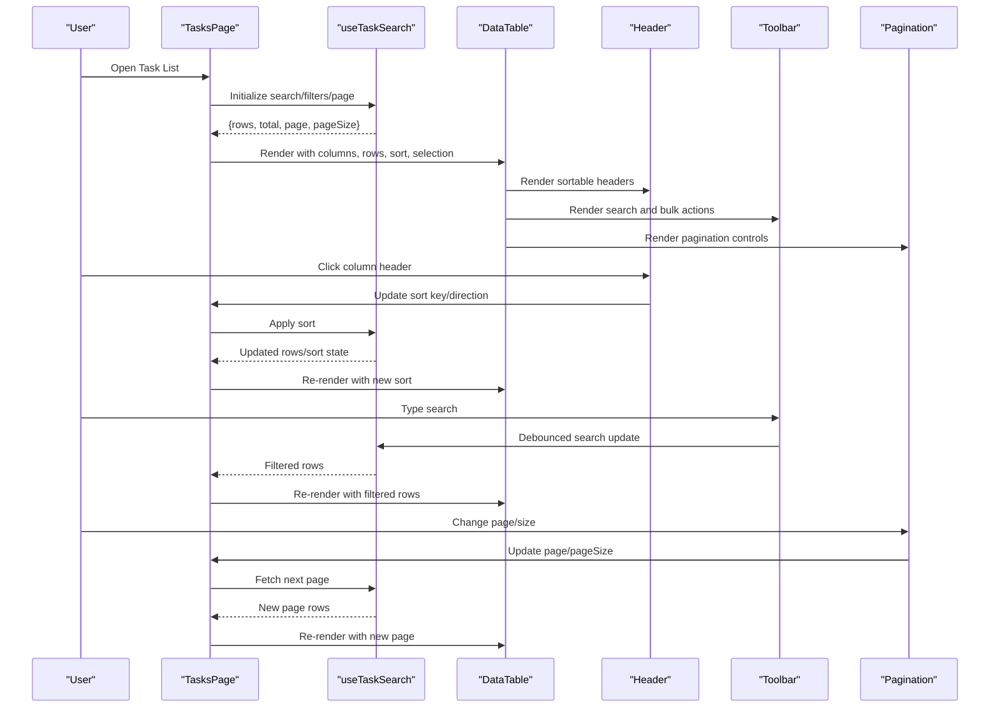
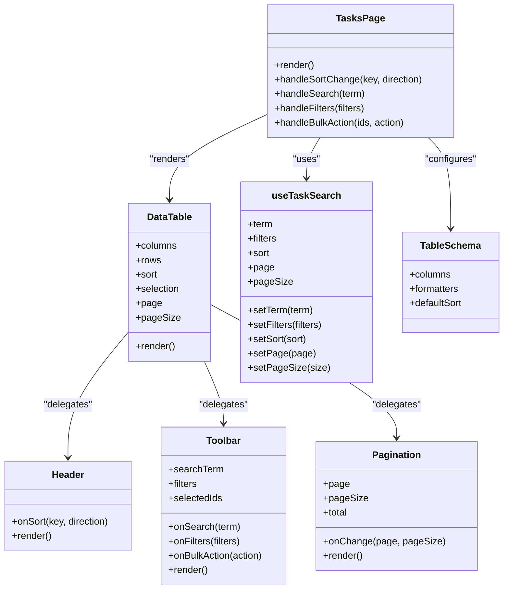
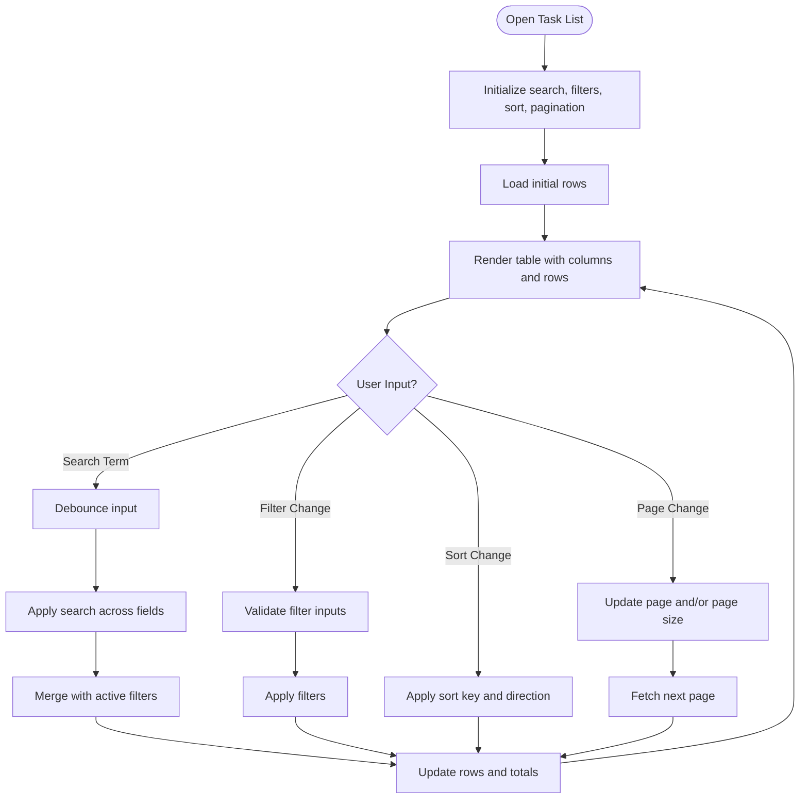
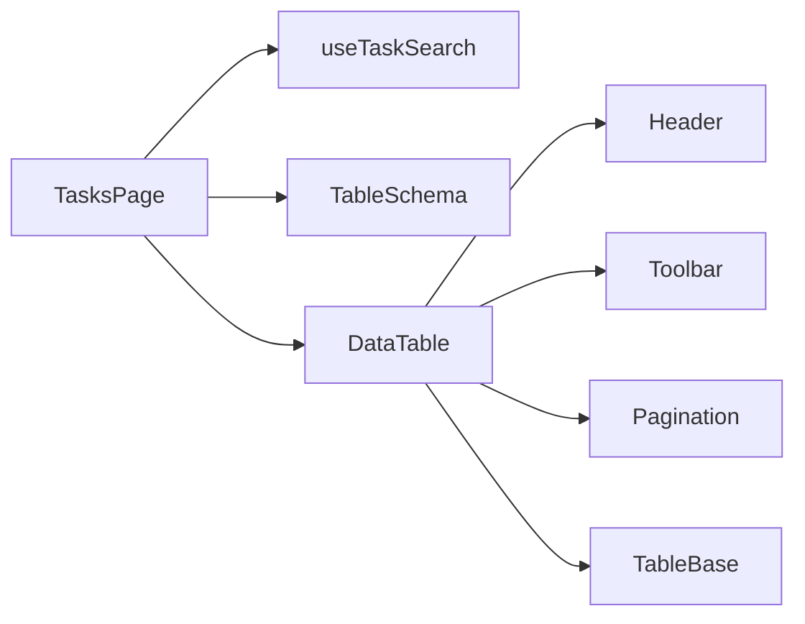

# List View Component

<cite>
**Referenced Files in This Document**
- [TasksPage.tsx](file://src/pages/TasksPage.tsx)
- [useTaskSearch.ts](file://src/hooks/useTaskSearch.ts)
- [table-schema.ts](file://src/lib/table-schema.ts)
- [data-table.tsx](file://table-system/components/ui/table/data-table.tsx)
- [data-table-header.tsx](file://table-system/components/ui/table/data-table-header.tsx)
- [data-table-toolbar.tsx](file://table-system/components/ui/table/data-table-toolbar.tsx)
- [data-table-pagination.tsx](file://table-system/components/ui/table/data-table-pagination.tsx)
- [table.tsx](file://table-system/components/ui/table/table.tsx)
</cite>

## Table of Contents
1. [Introduction](#introduction)
2. [Project Structure](#project-structure)
3. [Core Components](#core-components)
4. [Architecture Overview](#architecture-overview)
5. [Detailed Component Analysis](#detailed-component-analysis)
6. [Dependency Analysis](#dependency-analysis)
7. [Performance Considerations](#performance-considerations)
8. [Troubleshooting Guide](#troubleshooting-guide)
9. [Conclusion](#conclusion)

## Introduction
This document provides comprehensive documentation for the Task List view component, focusing on its table-based layout implementation, sorting and filtering capabilities, pagination handling, and bulk operations. It also covers data binding patterns, column configuration options, responsive design considerations, examples of customizing list columns, implementing advanced filters, and optimizing performance for large datasets.

The Task List is implemented as a feature page that composes reusable table primitives from the shared table system. The page integrates search and filtering via a dedicated hook, while the table UI components provide consistent rendering, toolbar controls, header actions, and pagination.

## Project Structure
The Task List view is composed of:
- A page-level component that wires up data fetching, search, and state
- Shared table UI primitives for rendering, headers, toolbar, and pagination
- A schema utility for defining table columns and behaviors
- A search hook to manage query parameters and debounced input

**Diagram sources**
- [TasksPage.tsx](file://src/pages/TasksPage.tsx)
- [data-table.tsx](file://table-system/components/ui/table/data-table.tsx)
- [data-table-header.tsx](file://table-system/components/ui/table/data-table-header.tsx)
- [data-table-toolbar.tsx](file://table-system/components/ui/table/data-table-toolbar.tsx)
- [data-table-pagination.tsx](file://table-system/components/ui/table/data-table-pagination.tsx)
- [table.tsx](file://table-system/components/ui/table/table.tsx)
- [useTaskSearch.ts](file://src/hooks/useTaskSearch.ts)
- [table-schema.ts](file://src/lib/table-schema.ts)

**Section sources**
- [TasksPage.tsx](file://src/pages/TasksPage.tsx)
- [data-table.tsx](file://table-system/components/ui/table/data-table.tsx)
- [data-table-header.tsx](file://table-system/components/ui/table/data-table-header.tsx)
- [data-table-toolbar.tsx](file://table-system/components/ui/table/data-table-toolbar.tsx)
- [data-table-pagination.tsx](file://table-system/components/ui/table/data-table-pagination.tsx)
- [table.tsx](file://table-system/components/ui/table/table.tsx)
- [useTaskSearch.ts](file://src/hooks/useTaskSearch.ts)
- [table-schema.ts](file://src/lib/table-schema.ts)

## Core Components
- TasksPage: Orchestrates task data, search/filter state, and renders the table with toolbar and pagination. It binds user interactions (search input, sort changes, page changes) to URL/query state and passes derived data to the table.
- DataTable: Generic table container that accepts columns, rows, sorting, selection, and pagination props. It renders the table body, header, and delegates toolbar and pagination to child components.
- Header: Renders sortable column headers and exposes per-column sort toggles.
- Toolbar: Provides global search input, filter controls, and bulk action buttons when items are selected.
- Pagination: Displays current page info and allows changing page size or navigating pages.
- Table Base: Low-level table wrapper providing semantic HTML structure and accessibility attributes.
- useTaskSearch: Manages search term, filters, and pagination state; debounces input and updates query parameters.
- table-schema: Defines column metadata, formatters, and sort keys used by the table.

Key responsibilities:
- Data binding: TasksPage maps domain entities to row objects consumed by the table.
- Sorting: Column definitions include sort keys; header toggles update sort state.
- Filtering: Global search and optional advanced filters are applied before rendering.
- Pagination: Controlled by page index and page size; integrated with toolbar and pagination UI.
- Bulk operations: Selection state drives bulk action availability and callbacks.

**Section sources**
- [TasksPage.tsx](file://src/pages/TasksPage.tsx)
- [data-table.tsx](file://table-system/components/ui/table/data-table.tsx)
- [data-table-header.tsx](file://table-system/components/ui/table/data-table-header.tsx)
- [data-table-toolbar.tsx](file://table-system/components/ui/table/data-table-toolbar.tsx)
- [data-table-pagination.tsx](file://table-system/components/ui/table/data-table-pagination.tsx)
- [table.tsx](file://table-system/components/ui/table/table.tsx)
- [useTaskSearch.ts](file://src/hooks/useTaskSearch.ts)
- [table-schema.ts](file://src/lib/table-schema.ts)

## Architecture Overview
The Task List follows a layered architecture:
- Presentation layer: TasksPage composes table primitives and manages local UI state.
- Domain layer: useTaskSearch encapsulates search/filter/pagination logic and query synchronization.
- Infrastructure layer: table-schema defines column behavior and formatting.

**Diagram sources**
- [TasksPage.tsx](file://src/pages/TasksPage.tsx)
- [useTaskSearch.ts](file://src/hooks/useTaskSearch.ts)
- [data-table.tsx](file://table-system/components/ui/table/data-table.tsx)
- [data-table-header.tsx](file://table-system/components/ui/table/data-table-header.tsx)
- [data-table-toolbar.tsx](file://table-system/components/ui/table/data-table-toolbar.tsx)
- [data-table-pagination.tsx](file://table-system/components/ui/table/data-table-pagination.tsx)

## Detailed Component Analysis

### TasksPage
Responsibilities:
- Initializes and persists search, filters, sort, and pagination state.
- Subscribes to data source and derives rows for display.
- Wires toolbar events (search, filters, bulk actions) and pagination events.
- Configures columns using table-schema definitions.

Data binding pattern:
- Rows are mapped from domain entities to table row shape expected by DataTable.
- Column definitions reference field names and formatters defined in table-schema.

Sorting and filtering:
- Sort state is updated via header click handlers and passed down to the table.
- Search input is debounced through useTaskSearch to avoid excessive re-renders.

Bulk operations:
- Selection state is maintained at the page level and exposed to toolbar for bulk actions.
- Bulk action callbacks operate on selected IDs and trigger appropriate side effects.

Responsive design:
- Uses table primitives that adapt to screen sizes; column visibility can be toggled based on breakpoints if needed.

**Section sources**
- [TasksPage.tsx](file://src/pages/TasksPage.tsx)
- [useTaskSearch.ts](file://src/hooks/useTaskSearch.ts)
- [table-schema.ts](file://src/lib/table-schema.ts)

### DataTable and Table Primitives
Responsibilities:
- DataTable orchestrates rendering of header, body, toolbar, and pagination.
- Header supports per-column sorting and optional column menus.
- Toolbar hosts global search, filters, and bulk actions.
- Pagination provides page navigation and page size selection.
- Table base ensures semantic markup and accessibility.

Column configuration:
- Columns define label, accessor, formatter, sortable flag, width, and visibility.
- Formatters transform raw values into display strings or JSX elements.

Selection and bulk actions:
- Row selection is managed via checkbox columns and selection state.
- Bulk actions are enabled when one or more rows are selected.

**Section sources**
- [data-table.tsx](file://table-system/components/ui/table/data-table.tsx)
- [data-table-header.tsx](file://table-system/components/ui/table/data-table-header.tsx)
- [data-table-toolbar.tsx](file://table-system/components/ui/table/data-table-toolbar.tsx)
- [data-table-pagination.tsx](file://table-system/components/ui/table/data-table-pagination.tsx)
- [table.tsx](file://table-system/components/ui/table/table.tsx)

### useTaskSearch
Responsibilities:
- Maintains search term, filters, sort, and pagination state.
- Debounces search input to reduce re-renders and network calls.
- Syncs state with URL query parameters for shareable links and browser history.
- Emits updated rows and metadata to the page component.

Advanced filters:
- Supports multi-field filters such as status, assignee, date range, and priority.
- Combines filters with search term using logical AND/OR as configured.

**Section sources**
- [useTaskSearch.ts](file://src/hooks/useTaskSearch.ts)

### table-schema
Responsibilities:
- Centralizes column definitions for tasks including labels, accessors, and formatters.
- Declares sort keys and default sort order.
- Provides reusable formatters for dates, statuses, and counts.

Customization:
- Add/remove columns by editing schema entries.
- Override formatters for specialized displays.

**Section sources**
- [table-schema.ts](file://src/lib/table-schema.ts)

### Class Diagram

**Diagram sources**
- [TasksPage.tsx](file://src/pages/TasksPage.tsx)
- [data-table.tsx](file://table-system/components/ui/table/data-table.tsx)
- [data-table-header.tsx](file://table-system/components/ui/table/data-table-header.tsx)
- [data-table-toolbar.tsx](file://table-system/components/ui/table/data-table-toolbar.tsx)
- [data-table-pagination.tsx](file://table-system/components/ui/table/data-table-pagination.tsx)
- [useTaskSearch.ts](file://src/hooks/useTaskSearch.ts)
- [table-schema.ts](file://src/lib/table-schema.ts)

### Flowchart: Advanced Filters

**Diagram sources**
- [useTaskSearch.ts](file://src/hooks/useTaskSearch.ts)
- [data-table.tsx](file://table-system/components/ui/table/data-table.tsx)
- [data-table-toolbar.tsx](file://table-system/components/ui/table/data-table-toolbar.tsx)
- [data-table-pagination.tsx](file://table-system/components/ui/table/data-table-pagination.tsx)

## Dependency Analysis
- TasksPage depends on useTaskSearch for state management and data derivation.
- DataTable depends on Header, Toolbar, and Pagination for modular rendering.
- TableSchema provides column definitions consumed by both TasksPage and DataTable.
- All table primitives rely on shared table base for consistent structure and accessibility.

**Diagram sources**
- [TasksPage.tsx](file://src/pages/TasksPage.tsx)
- [useTaskSearch.ts](file://src/hooks/useTaskSearch.ts)
- [table-schema.ts](file://src/lib/table-schema.ts)
- [data-table.tsx](file://table-system/components/ui/table/data-table.tsx)
- [data-table-header.tsx](file://table-system/components/ui/table/data-table-header.tsx)
- [data-table-toolbar.tsx](file://table-system/components/ui/table/data-table-toolbar.tsx)
- [data-table-pagination.tsx](file://table-system/components/ui/table/data-table-pagination.tsx)
- [table.tsx](file://table-system/components/ui/table/table.tsx)

**Section sources**
- [TasksPage.tsx](file://src/pages/TasksPage.tsx)
- [useTaskSearch.ts](file://src/hooks/useTaskSearch.ts)
- [table-schema.ts](file://src/lib/table-schema.ts)
- [data-table.tsx](file://table-system/components/ui/table/data-table.tsx)
- [data-table-header.tsx](file://table-system/components/ui/table/data-table-header.tsx)
- [data-table-toolbar.tsx](file://table-system/components/ui/table/data-table-toolbar.tsx)
- [data-table-pagination.tsx](file://table-system/components/ui/table/data-table-pagination.tsx)
- [table.tsx](file://table-system/components/ui/table/table.tsx)

## Performance Considerations
- Debounce search input to minimize re-renders and unnecessary computations.
- Use controlled pagination to limit dataset size per render.
- Memoize expensive formatters and computed columns where possible.
- Avoid heavy operations in render paths; offload to hooks or utilities.
- Prefer server-side sorting and filtering for very large datasets when feasible.
- Keep column definitions static to prevent unnecessary re-renders due to prop churn.

[No sources needed since this section provides general guidance]

## Troubleshooting Guide
Common issues and resolutions:
- Search not updating: Ensure debounce delay is configured and state is propagated to the table.
- Sort not applying: Verify sort keys match column definitions and sort state is persisted.
- Pagination mismatch: Confirm page index and page size are synchronized with data source.
- Bulk actions disabled: Check selection state and ensure selected IDs are non-empty.
- Column not visible: Review column visibility flags and responsive breakpoints.

**Section sources**
- [useTaskSearch.ts](file://src/hooks/useTaskSearch.ts)
- [data-table.tsx](file://table-system/components/ui/table/data-table.tsx)
- [data-table-toolbar.tsx](file://table-system/components/ui/table/data-table-toolbar.tsx)
- [data-table-pagination.tsx](file://table-system/components/ui/table/data-table-pagination.tsx)

## Conclusion
The Task List view leverages a modular table system to deliver a robust, configurable, and performant list experience. By centralizing column definitions and search/filter logic, it enables easy customization and scaling. Adhering to the recommended patterns for data binding, sorting, filtering, pagination, and bulk operations ensures a consistent and maintainable implementation.

[No sources needed since this section summarizes without analyzing specific files]