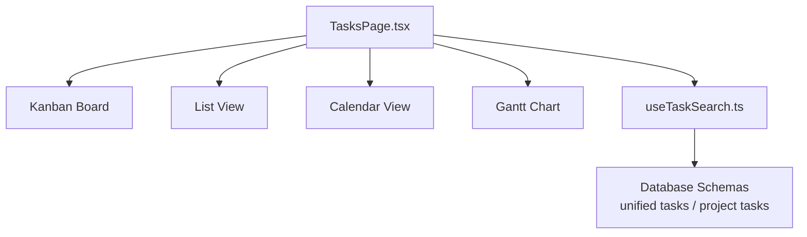
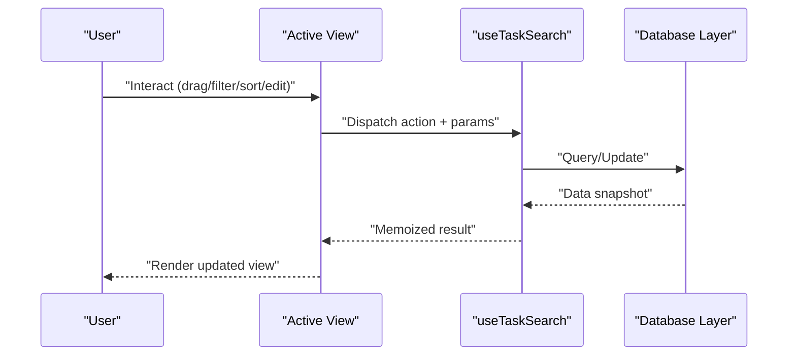
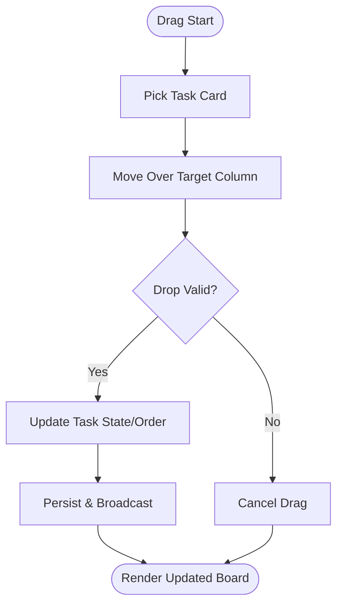
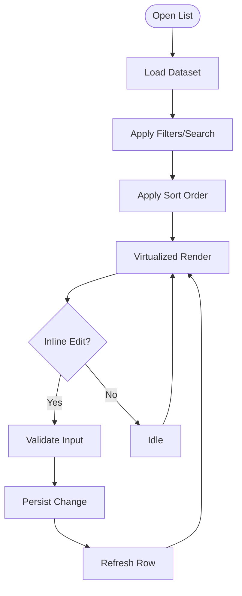
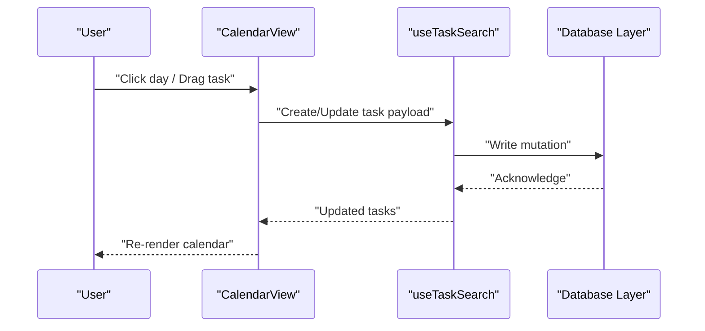
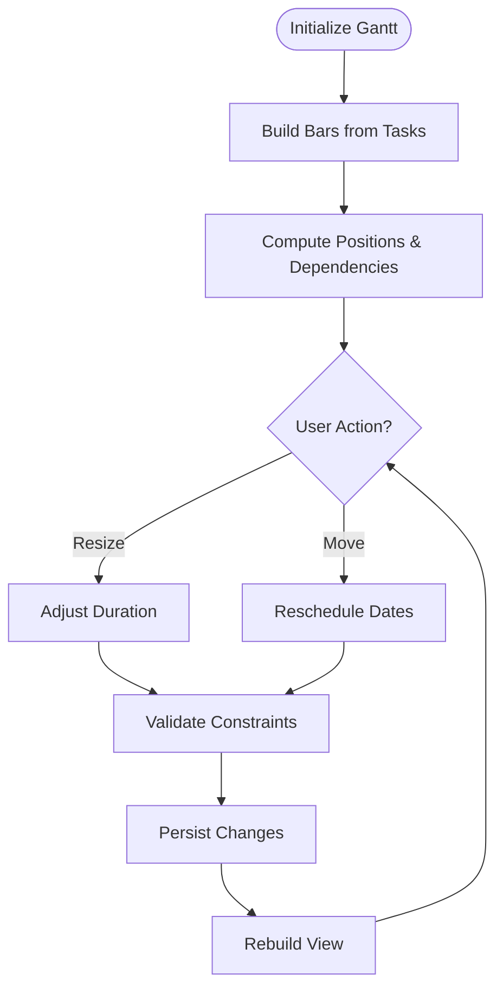
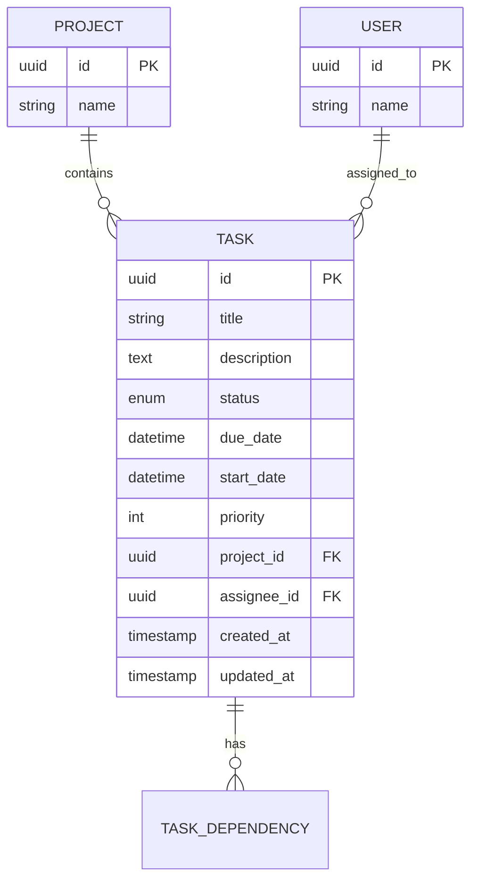
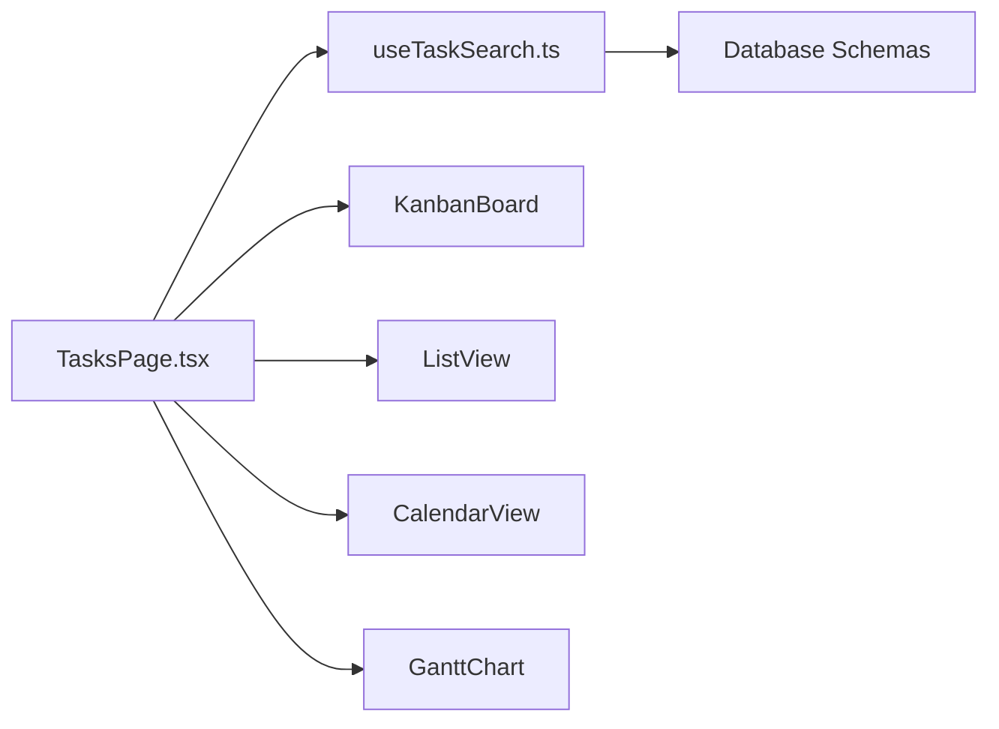

# Task Views and Visualizations

<cite>
**Referenced Files in This Document**
- [TasksPage.tsx](file://src/pages/TasksPage.tsx)
- [useTaskSearch.ts](file://src/hooks/useTaskSearch.ts)
- [database-unified-tasks.sql](file://src/database-unified-tasks.sql)
- [database-project-tasks.sql](file://src/database-project-tasks.sql)
- [database-tasks-fix.sql](file://src/database-tasks-fix.sql)
- [database-tasks-migration.sql](file://src/database-tasks-migration.sql)
</cite>

## Table of Contents
1. [Introduction](#introduction)
2. [Project Structure](#project-structure)
3. [Core Components](#core-components)
4. [Architecture Overview](#architecture-overview)
5. [Detailed Component Analysis](#detailed-component-analysis)
6. [Dependency Analysis](#dependency-analysis)
7. [Performance Considerations](#performance-considerations)
8. [Troubleshooting Guide](#troubleshooting-guide)
9. [Conclusion](#conclusion)

## Introduction
This document describes the Task Views and Visualizations system, focusing on multiple display modes: Kanban board with drag-and-drop, list view with sorting and filtering, calendar view for deadline management, and Gantt chart for project timeline visualization. It explains component architecture, data binding patterns, user interaction flows, customization options (columns and filters), responsive design considerations, performance optimization techniques for large datasets, and real-time synchronization strategies across views.

## Project Structure
The task views are implemented as a cohesive set of components and hooks that share a unified data model and state layer. The primary entry point is a page-level component that orchestrates view switching, while reusable subcomponents implement each view mode. A dedicated hook centralizes search, filter, sort, and pagination logic. Database schemas define the canonical task entity and relationships to projects and users.

**Diagram sources**
- [TasksPage.tsx](file://src/pages/TasksPage.tsx)
- [useTaskSearch.ts](file://src/hooks/useTaskSearch.ts)
- [database-unified-tasks.sql](file://src/database-unified-tasks.sql)
- [database-project-tasks.sql](file://src/database-project-tasks.sql)

**Section sources**
- [TasksPage.tsx](file://src/pages/TasksPage.tsx)
- [useTaskSearch.ts](file://src/hooks/useTaskSearch.ts)
- [database-unified-tasks.sql](file://src/database-unified-tasks.sql)
- [database-project-tasks.sql](file://src/database-project-tasks.sql)

## Core Components
- TasksPage: Orchestrates view selection, global filters, and shared state; renders the active view container.
- KanbanBoard: Displays columns (e.g., status buckets) and draggable task cards; supports drop zones and column reordering.
- ListView: Renders a sortable, filterable table with virtualization for large lists; includes toolbar controls and column configuration.
- CalendarView: Shows tasks on a monthly/weekly grid with deadline highlighting and quick-edit actions.
- GanttChart: Visualizes task timelines with dependencies, milestones, and zoom levels; supports drag-to-resize and pan.
- useTaskSearch: Centralized hook providing search, filter, sort, pagination, and caching for all views.

Key responsibilities:
- Data binding: All views consume a single source of truth via the hook and context/state provider.
- Interaction flows: Drag-and-drop in Kanban, inline edits in List/Calendar/Gantt, and cross-view updates through shared state.
- Customization: Column definitions, filter presets, and layout toggles are configurable at runtime.

**Section sources**
- [TasksPage.tsx](file://src/pages/TasksPage.tsx)
- [useTaskSearch.ts](file://src/hooks/useTaskSearch.ts)

## Architecture Overview
The system follows a unidirectional data flow pattern:
- UI components dispatch actions (filter, sort, drag, edit).
- useTaskSearch normalizes inputs, applies transformations, and returns memoized results.
- Views render based on the normalized dataset.
- Persistence and sync occur via database-backed APIs and optional real-time subscriptions.

**Diagram sources**
- [TasksPage.tsx](file://src/pages/TasksPage.tsx)
- [useTaskSearch.ts](file://src/hooks/useTaskSearch.ts)
- [database-unified-tasks.sql](file://src/database-unified-tasks.sql)

## Detailed Component Analysis

### Kanban Board
- Columns represent task states or custom buckets defined by configuration.
- Each card shows key fields (title, assignee, priority, due date) and supports inline editing.
- Drag-and-drop moves tasks between columns and within a column’s order.
- Real-time updates reflect changes from other users when enabled.

**Diagram sources**
- [TasksPage.tsx](file://src/pages/TasksPage.tsx)
- [useTaskSearch.ts](file://src/hooks/useTaskSearch.ts)

**Section sources**
- [TasksPage.tsx](file://src/pages/TasksPage.tsx)
- [useTaskSearch.ts](file://src/hooks/useTaskSearch.ts)

### List View
- Sortable columns with multi-column ordering and stable keys for performance.
- Filter bar supports text search, field filters, and saved presets.
- Virtualized rendering for large datasets to maintain smooth scrolling.
- Inline cell editing with validation and undo support.

**Diagram sources**
- [TasksPage.tsx](file://src/pages/TasksPage.tsx)
- [useTaskSearch.ts](file://src/hooks/useTaskSearch.ts)

**Section sources**
- [TasksPage.tsx](file://src/pages/TasksPage.tsx)
- [useTaskSearch.ts](file://src/hooks/useTaskSearch.ts)

### Calendar View
- Monthly and weekly modes with deadline highlighting and overdue indicators.
- Click-to-create and click-to-edit workflows.
- Drag tasks to reschedule dates directly on the calendar.
- Aggregates tasks by assignee or project for focused planning.

**Diagram sources**
- [TasksPage.tsx](file://src/pages/TasksPage.tsx)
- [useTaskSearch.ts](file://src/hooks/useTaskSearch.ts)

**Section sources**
- [TasksPage.tsx](file://src/pages/TasksPage.tsx)
- [useTaskSearch.ts](file://src/hooks/useTaskSearch.ts)

### Gantt Chart
- Timeline bars represent start/end dates with dependency lines.
- Zoom levels (day/week/month) and horizontal panning.
- Drag edges to adjust duration; drag bars to reschedule.
- Milestones and summary rows for high-level overviews.

**Diagram sources**
- [TasksPage.tsx](file://src/pages/TasksPage.tsx)
- [useTaskSearch.ts](file://src/hooks/useTaskSearch.ts)

**Section sources**
- [TasksPage.tsx](file://src/pages/TasksPage.tsx)
- [useTaskSearch.ts](file://src/hooks/useTaskSearch.ts)

### Data Model and Schema Alignment
The task entity and related structures are defined in database schemas, ensuring consistency across views and persistence layers.

**Diagram sources**
- [database-unified-tasks.sql](file://src/database-unified-tasks.sql)
- [database-project-tasks.sql](file://src/database-project-tasks.sql)
- [database-tasks-fix.sql](file://src/database-tasks-fix.sql)
- [database-tasks-migration.sql](file://src/database-tasks-migration.sql)

**Section sources**
- [database-unified-tasks.sql](file://src/database-unified-tasks.sql)
- [database-project-tasks.sql](file://src/database-project-tasks.sql)
- [database-tasks-fix.sql](file://src/database-tasks-fix.sql)
- [database-tasks-migration.sql](file://src/database-tasks-migration.sql)

## Dependency Analysis
- TasksPage depends on view components and the shared hook.
- useTaskSearch encapsulates query logic and memoization, reducing redundant computations.
- Views depend on the normalized dataset returned by the hook; they do not directly access persistence.
- Database schemas provide the contract for entities and relationships used by the application.

**Diagram sources**
- [TasksPage.tsx](file://src/pages/TasksPage.tsx)
- [useTaskSearch.ts](file://src/hooks/useTaskSearch.ts)
- [database-unified-tasks.sql](file://src/database-unified-tasks.sql)

**Section sources**
- [TasksPage.tsx](file://src/pages/TasksPage.tsx)
- [useTaskSearch.ts](file://src/hooks/useTaskSearch.ts)
- [database-unified-tasks.sql](file://src/database-unified-tasks.sql)

## Performance Considerations
- Virtualization: Use windowed/virtualized lists and Gantt segments to avoid rendering thousands of nodes.
- Memoization: Cache filtered/sorted results and derived views to prevent recomputation on minor state changes.
- Pagination/Lazy Loading: Load initial pages and fetch more on demand for large datasets.
- Debounced Search: Throttle input events to reduce query frequency.
- Efficient Updates: Coalesce mutations and batch updates where possible.
- Indexing: Ensure database indexes on frequently filtered/sorted columns (status, due_date, assignee_id, project_id).
- Rendering Optimization: Stable keys, minimal re-renders, and avoiding unnecessary prop changes.
- Real-time Sync: Use presence-aware subscriptions with optimistic updates and conflict resolution strategies.

[No sources needed since this section provides general guidance]

## Troubleshooting Guide
Common issues and resolutions:
- Stale data after edits: Verify that mutations trigger refetches or optimistic updates; ensure cache invalidation paths are correct.
- Slow list rendering: Confirm virtualization is enabled and row heights are predictable; check for heavy per-row computations.
- Drag-and-drop anomalies: Validate drop targets and constraints; ensure unique IDs and stable ordering keys.
- Calendar misalignment: Normalize timezone handling and date boundaries; verify due_date/start_date consistency.
- Gantt overlap errors: Enforce dependency constraints and validate date ranges before persisting.
- Filter/sort inconsistencies: Inspect normalization steps in the hook; ensure deterministic sort comparators.

**Section sources**
- [useTaskSearch.ts](file://src/hooks/useTaskSearch.ts)
- [TasksPage.tsx](file://src/pages/TasksPage.tsx)

## Conclusion
The Task Views and Visualizations system provides a flexible, performant, and synchronized experience across Kanban, List, Calendar, and Gantt modes. By centralizing data operations in a dedicated hook and aligning with well-defined database schemas, the system ensures consistent behavior, easy customization, and scalability. Adopting the recommended performance and synchronization practices will further enhance responsiveness and reliability for large teams and complex projects.