# Task Workflow and State Management

<cite>
**Referenced Files in This Document**
- [TasksPage.tsx](file://src/pages/TasksPage.tsx)
- [useTaskSearch.ts](file://src/hooks/useTaskSearch.ts)
- [database-project-tasks.sql](file://src/database-project-tasks.sql)
- [database-unified-tasks.sql](file://src/database-unified-tasks.sql)
- [database-tasks-fix.sql](file://src/database-tasks-fix.sql)
- [database-tasks-migration.sql](file://src/database-tasks-migration.sql)
- [components/tasks/index.tsx](file://src/components/tasks/index.tsx)
- [components/tasks/TaskCard.tsx](file://src/components/tasks/TaskCard.tsx)
- [components/tasks/TaskList.tsx](file://src/components/tasks/TaskList.tsx)
- [components/tasks/TaskDetailDrawer.tsx](file://src/components/tasks/TaskDetailDrawer.tsx)
- [components/tasks/TaskAssignmentModal.tsx](file://src/components/tasks/TaskAssignmentModal.tsx)
- [components/tasks/TaskStatusSelector.tsx](file://src/components/tasks/TaskStatusSelector.tsx)
- [components/tasks/TaskDependencyManager.tsx](file://src/components/tasks/TaskDependencyManager.tsx)
- [components/tasks/TaskApprovalWorkflow.tsx](file://src/components/tasks/TaskApprovalWorkflow.tsx)
- [components/tasks/TaskAuditLog.tsx](file://src/components/tasks/TaskAuditLog.tsx)
- [hooks/useNextActions.ts](file://src/hooks/useNextActions.ts)
- [lib/quotation-workflow.ts](file://src/lib/quotation-workflow.ts)
</cite>

## Table of Contents
1. [Introduction](#introduction)
2. [Project Structure](#project-structure)
3. [Core Components](#core-components)
4. [Architecture Overview](#architecture-overview)
5. [Detailed Component Analysis](#detailed-component-analysis)
6. [Dependency Analysis](#dependency-analysis)
7. [Performance Considerations](#performance-considerations)
8. [Troubleshooting Guide](#troubleshooting-guide)
9. [Conclusion](#conclusion)

## Introduction
This document explains the Task Workflow and State Management system, focusing on task lifecycle states, status transitions, workflow automation rules, creation and assignment mechanisms, approval workflows, custom state definitions, business rules for transitions, concurrent update handling, dependencies and blocking relationships, automated notifications, error handling, rollback mechanisms, and audit trail maintenance. It is designed to be accessible to both technical and non-technical readers while providing code-level references where applicable.

## Project Structure
The task workflow spans UI components, hooks, and database migrations:
- Pages and routing: Tasks page entry point
- UI components: Task list, card, detail drawer, assignment modal, status selector, dependency manager, approval workflow, audit log
- Hooks: Search and next actions
- Database: Schema and migrations for tasks, unified tasks, fixes, and migration scripts

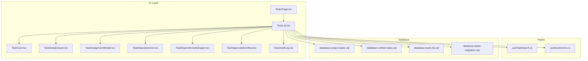

**Diagram sources**
- [TasksPage.tsx](file://src/pages/TasksPage.tsx)
- [components/tasks/TaskList.tsx](file://src/components/tasks/TaskList.tsx)
- [components/tasks/TaskCard.tsx](file://src/components/tasks/TaskCard.tsx)
- [components/tasks/TaskDetailDrawer.tsx](file://src/components/tasks/TaskDetailDrawer.tsx)
- [components/tasks/TaskAssignmentModal.tsx](file://src/components/tasks/TaskAssignmentModal.tsx)
- [components/tasks/TaskStatusSelector.tsx](file://src/components/tasks/TaskStatusSelector.tsx)
- [components/tasks/TaskDependencyManager.tsx](file://src/components/tasks/TaskDependencyManager.tsx)
- [components/tasks/TaskApprovalWorkflow.tsx](file://src/components/tasks/TaskApprovalWorkflow.tsx)
- [components/tasks/TaskAuditLog.tsx](file://src/components/tasks/TaskAuditLog.tsx)
- [hooks/useTaskSearch.ts](file://src/hooks/useTaskSearch.ts)
- [hooks/useNextActions.ts](file://src/hooks/useNextActions.ts)
- [database-project-tasks.sql](file://src/database-project-tasks.sql)
- [database-unified-tasks.sql](file://src/database-unified-tasks.sql)
- [database-tasks-fix.sql](file://src/database-tasks-fix.sql)
- [database-tasks-migration.sql](file://src/database-tasks-migration.sql)

**Section sources**
- [TasksPage.tsx](file://src/pages/TasksPage.tsx)
- [components/tasks/TaskList.tsx](file://src/components/tasks/TaskList.tsx)
- [hooks/useTaskSearch.ts](file://src/hooks/useTaskSearch.ts)
- [database-project-tasks.sql](file://src/database-project-tasks.sql)
- [database-unified-tasks.sql](file://src/database-unified-tasks.sql)
- [database-tasks-fix.sql](file://src/database-tasks-fix.sql)
- [database-tasks-migration.sql](file://src/database-tasks-migration.sql)

## Core Components
- TasksPage: Entry point that orchestrates task listing, search, filters, and navigation to details or assignments.
- TaskList: Renders paginated lists with filters and bulk actions; integrates with useTaskSearch and useNextActions.
- TaskCard: Displays a compact view of a task including status, assignee, due date, and quick actions.
- TaskDetailDrawer: Full task context with metadata, history, approvals, and operations.
- TaskAssignmentModal: Assigns or reassigns tasks with validation and conflict checks.
- TaskStatusSelector: Presents allowed transitions based on current state and business rules.
- TaskDependencyManager: Manages predecessor/successor relationships and blocking logic.
- TaskApprovalWorkflow: Configures and executes multi-step approvals tied to state transitions.
- TaskAuditLog: Immutable record of all task mutations for compliance and debugging.

Key responsibilities:
- State management: Local optimistic updates with server reconciliation
- Validation: Business rules enforced before transitions
- Notifications: Automated alerts on key events (assignment, status change, approvals)
- Auditability: Every mutation recorded with actor, timestamp, and reason

**Section sources**
- [TasksPage.tsx](file://src/pages/TasksPage.tsx)
- [components/tasks/TaskList.tsx](file://src/components/tasks/TaskList.tsx)
- [components/tasks/TaskCard.tsx](file://src/components/tasks/TaskCard.tsx)
- [components/tasks/TaskDetailDrawer.tsx](file://src/components/tasks/TaskDetailDrawer.tsx)
- [components/tasks/TaskAssignmentModal.tsx](file://src/components/tasks/TaskAssignmentModal.tsx)
- [components/tasks/TaskStatusSelector.tsx](file://src/components/tasks/TaskStatusSelector.tsx)
- [components/tasks/TaskDependencyManager.tsx](file://src/components/tasks/TaskDependencyManager.tsx)
- [components/tasks/TaskApprovalWorkflow.tsx](file://src/components/tasks/TaskApprovalWorkflow.tsx)
- [components/tasks/TaskAuditLog.tsx](file://src/components/tasks/TaskAuditLog.tsx)
- [hooks/useTaskSearch.ts](file://src/hooks/useTaskSearch.ts)
- [hooks/useNextActions.ts](file://src/hooks/useNextActions.ts)

## Architecture Overview
The system follows a layered architecture:
- Presentation layer: React components render task data and capture user intents
- Logic layer: Hooks implement search, filtering, and next-action computation
- Persistence layer: Database schema defines entities and constraints; migrations evolve structure
- Workflow engine: Approval and transition rules are applied before persistence

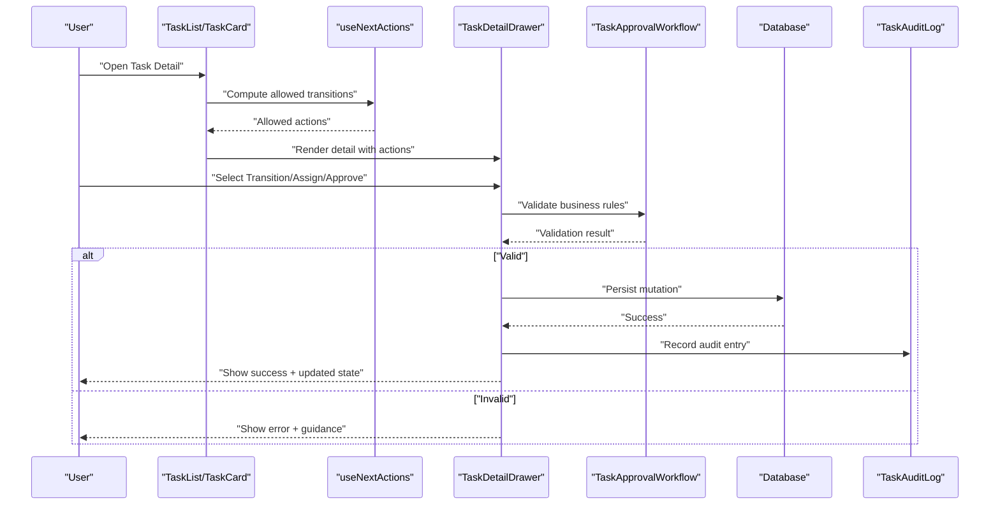

**Diagram sources**
- [components/tasks/TaskList.tsx](file://src/components/tasks/TaskList.tsx)
- [components/tasks/TaskCard.tsx](file://src/components/tasks/TaskCard.tsx)
- [components/tasks/TaskDetailDrawer.tsx](file://src/components/tasks/TaskDetailDrawer.tsx)
- [hooks/useNextActions.ts](file://src/hooks/useNextActions.ts)
- [components/tasks/TaskApprovalWorkflow.tsx](file://src/components/tasks/TaskApprovalWorkflow.tsx)
- [components/tasks/TaskAuditLog.tsx](file://src/components/tasks/TaskAuditLog.tsx)
- [database-project-tasks.sql](file://src/database-project-tasks.sql)

## Detailed Component Analysis

### Task Lifecycle States and Transitions
- Typical states include Draft, Assigned, In Progress, Review, Approved, Completed, Cancelled.
- Allowed transitions are governed by business rules and optional approval steps.
- The next-actions hook computes permitted transitions based on current state, role, and dependencies.

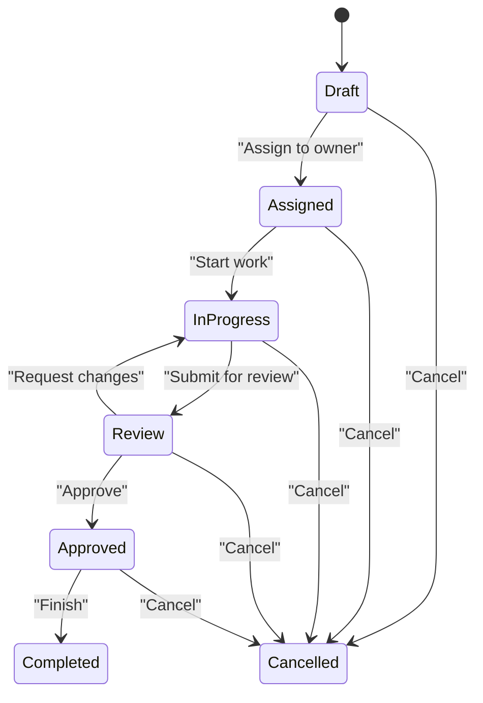

**Diagram sources**
- [hooks/useNextActions.ts](file://src/hooks/useNextActions.ts)
- [components/tasks/TaskStatusSelector.tsx](file://src/components/tasks/TaskStatusSelector.tsx)
- [database-project-tasks.sql](file://src/database-project-tasks.sql)

**Section sources**
- [hooks/useNextActions.ts](file://src/hooks/useNextActions.ts)
- [components/tasks/TaskStatusSelector.tsx](file://src/components/tasks/TaskStatusSelector.tsx)
- [database-project-tasks.sql](file://src/database-project-tasks.sql)

### Task Creation Process
- Creation flow initializes a task in Draft with default fields and permissions.
- Optional pre-fill from templates or related documents.
- Immediate audit entry created upon creation.

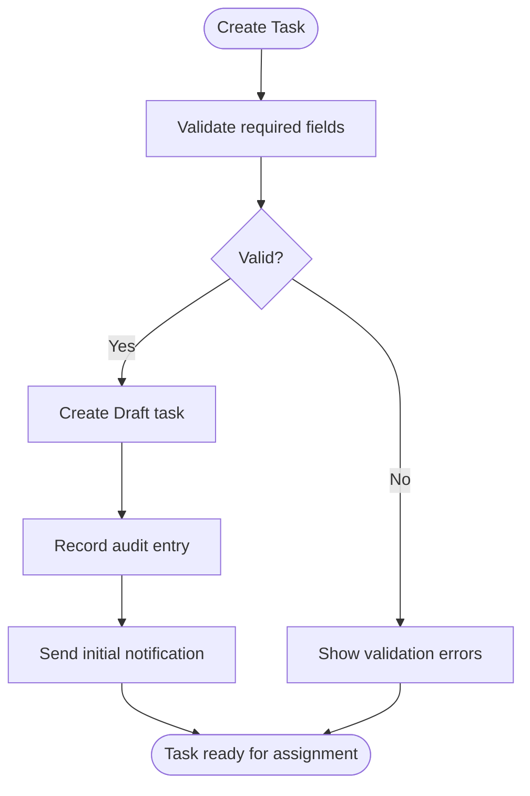

**Diagram sources**
- [components/tasks/TaskDetailDrawer.tsx](file://src/components/tasks/TaskDetailDrawer.tsx)
- [components/tasks/TaskAuditLog.tsx](file://src/components/tasks/TaskAuditLog.tsx)
- [database-project-tasks.sql](file://src/database-project-tasks.sql)

**Section sources**
- [components/tasks/TaskDetailDrawer.tsx](file://src/components/tasks/TaskDetailDrawer.tsx)
- [components/tasks/TaskAuditLog.tsx](file://src/components/tasks/TaskAuditLog.tsx)
- [database-project-tasks.sql](file://src/database-project-tasks.sql)

### Assignment Mechanisms
- Assignment validates ownership, capacity, and conflicts.
- Supports reassignment with change reasons and notifications.
- Enforces role-based permissions for who can assign.

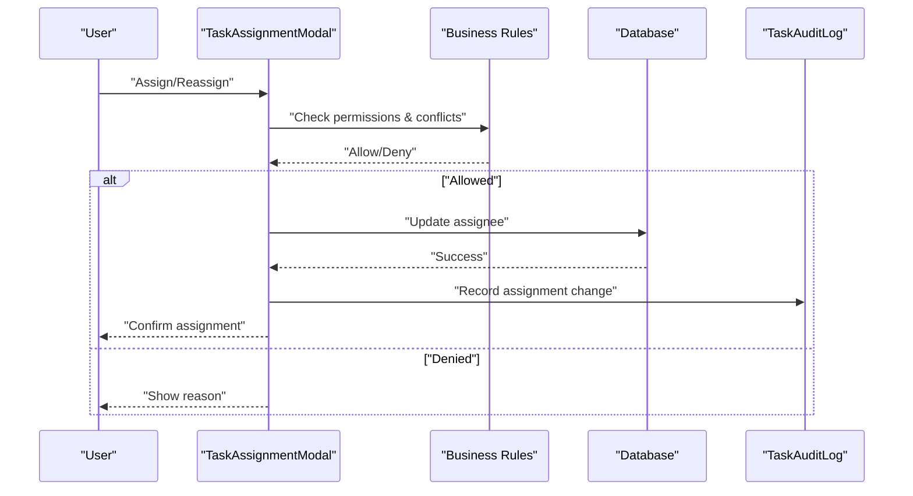

**Diagram sources**
- [components/tasks/TaskAssignmentModal.tsx](file://src/components/tasks/TaskAssignmentModal.tsx)
- [components/tasks/TaskAuditLog.tsx](file://src/components/tasks/TaskAuditLog.tsx)
- [database-project-tasks.sql](file://src/database-project-tasks.sql)

**Section sources**
- [components/tasks/TaskAssignmentModal.tsx](file://src/components/tasks/TaskAssignmentModal.tsx)
- [components/tasks/TaskAuditLog.tsx](file://src/components/tasks/TaskAuditLog.tsx)
- [database-project-tasks.sql](file://src/database-project-tasks.sql)

### Approval Workflows
- Approvals can be single or multi-step, configurable per task type or project.
- Approval gates enforce transitions (e.g., Review to Approved).
- Rejection routes back to prior state with comments.

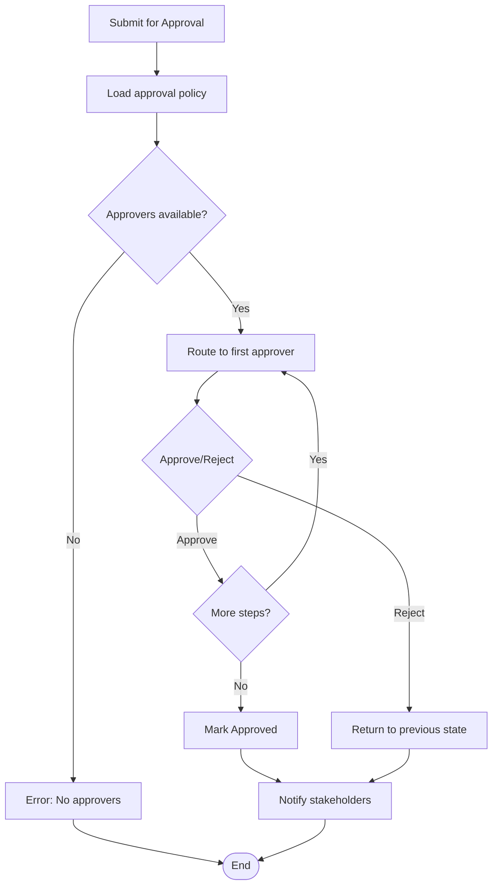

**Diagram sources**
- [components/tasks/TaskApprovalWorkflow.tsx](file://src/components/tasks/TaskApprovalWorkflow.tsx)
- [database-project-tasks.sql](file://src/database-project-tasks.sql)

**Section sources**
- [components/tasks/TaskApprovalWorkflow.tsx](file://src/components/tasks/TaskApprovalWorkflow.tsx)
- [database-project-tasks.sql](file://src/database-project-tasks.sql)

### Dependencies and Blocking Relationships
- Predecessors block successors until completion or explicit override.
- Dependency manager enforces consistency and prevents invalid cycles.
- Visual indicators show blocked tasks and suggested resolutions.

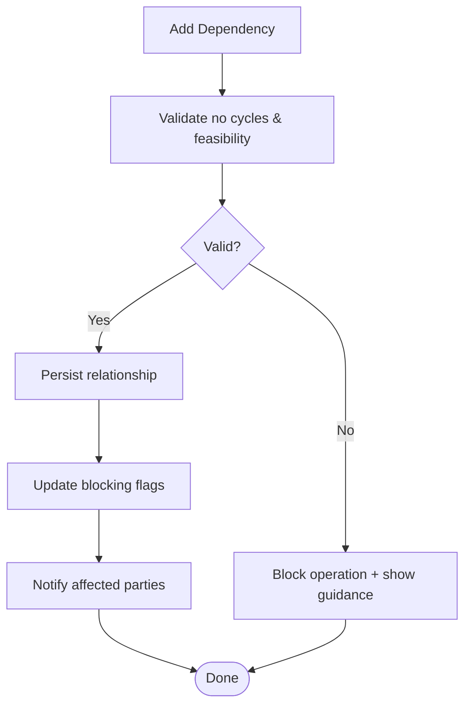

**Diagram sources**
- [components/tasks/TaskDependencyManager.tsx](file://src/components/tasks/TaskDependencyManager.tsx)
- [database-project-tasks.sql](file://src/database-project-tasks.sql)

**Section sources**
- [components/tasks/TaskDependencyManager.tsx](file://src/components/tasks/TaskDependencyManager.tsx)
- [database-project-tasks.sql](file://src/database-project-tasks.sql)

### Custom Task States and Business Rules
- Define new states via configuration and ensure they integrate with transitions and UI.
- Implement business rules in the next-actions hook and validation layers.
- Example patterns:
  - Require minimum duration before transitioning out of In Progress
  - Restrict transitions based on user roles or project phase
  - Conditional approvals depending on task priority or value

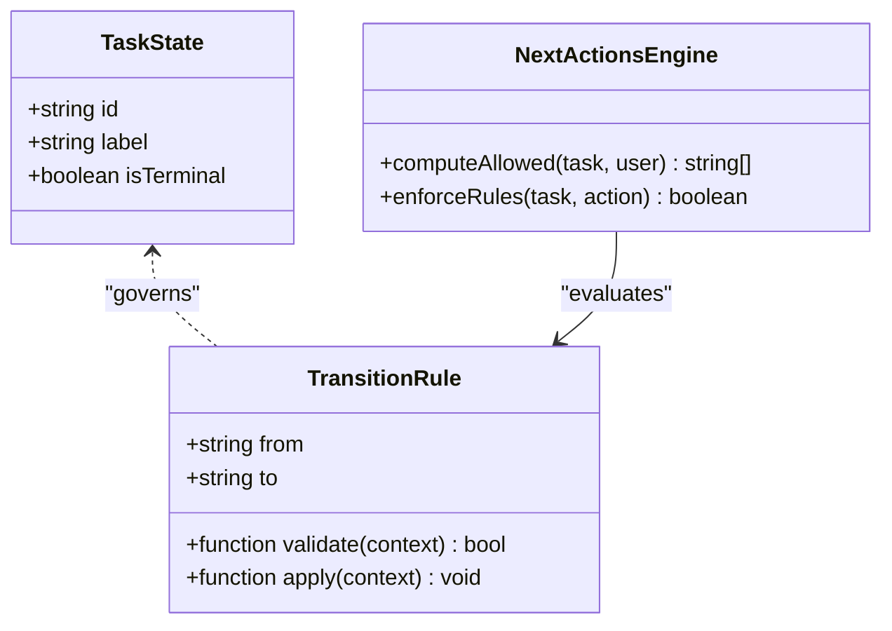

**Diagram sources**
- [hooks/useNextActions.ts](file://src/hooks/useNextActions.ts)
- [components/tasks/TaskStatusSelector.tsx](file://src/components/tasks/TaskStatusSelector.tsx)

**Section sources**
- [hooks/useNextActions.ts](file://src/hooks/useNextActions.ts)
- [components/tasks/TaskStatusSelector.tsx](file://src/components/tasks/TaskStatusSelector.tsx)

### Handling Concurrent Updates
- Optimistic UI updates provide immediate feedback.
- Server-side versioning or timestamps prevent lost updates.
- Conflict resolution strategies:
  - Last-write-wins with clear audit trails
  - Merge strategies for non-conflicting fields
  - Prompt users when critical fields conflict

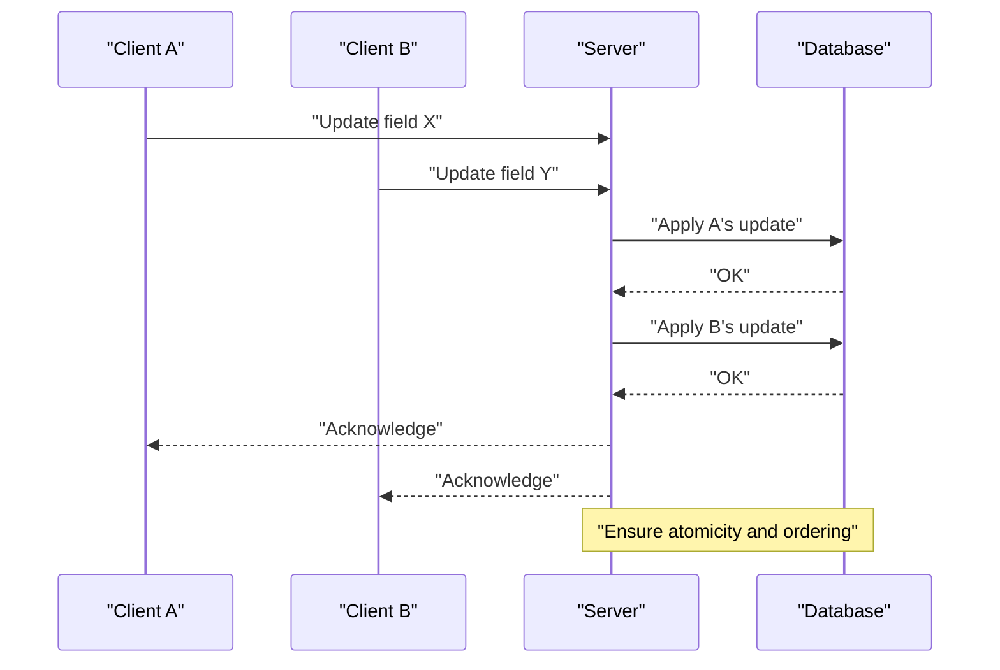

[No sources needed since this diagram shows conceptual concurrency handling]

### Automated Notifications
- Triggered on assignment, status changes, approvals, and dependency updates.
- Channels may include in-app notifications, email, or external integrations.
- Notification policies are configurable per organization.

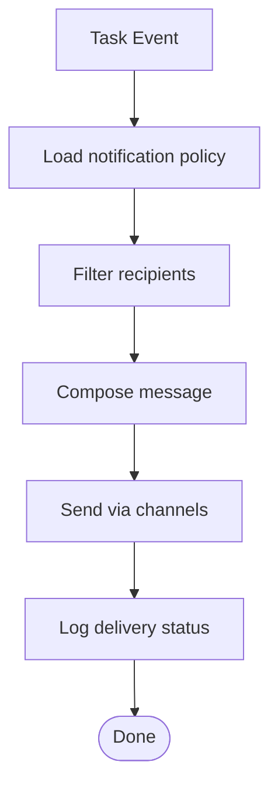

[No sources needed since this diagram shows conceptual notification flow]

### Error Handling and Rollback
- Validation failures return actionable errors to the UI.
- On server errors, revert optimistic changes and surface retry options.
- For partial failures in multi-step operations, roll back completed steps and preserve audit entries.

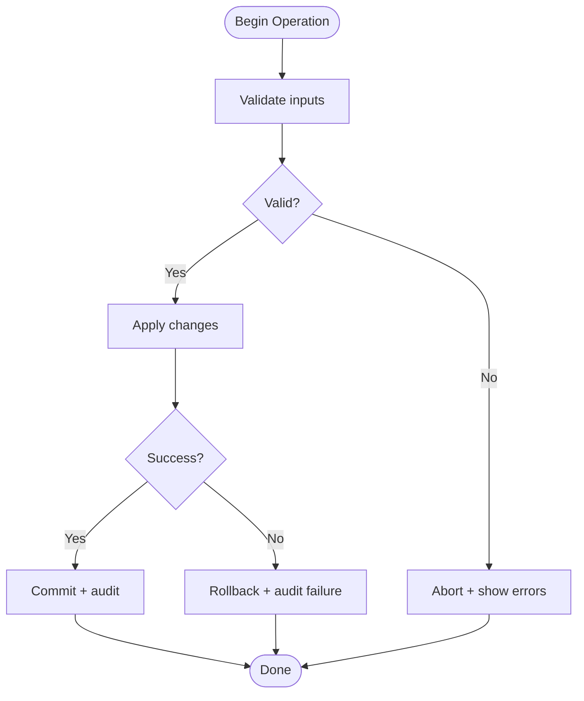

[No sources needed since this diagram shows conceptual error handling]

### Audit Trail Maintenance
- Every mutation records actor, timestamp, old/new values, and reason.
- Immutable append-only storage ensures compliance.
- UI provides filtered views and export capabilities.

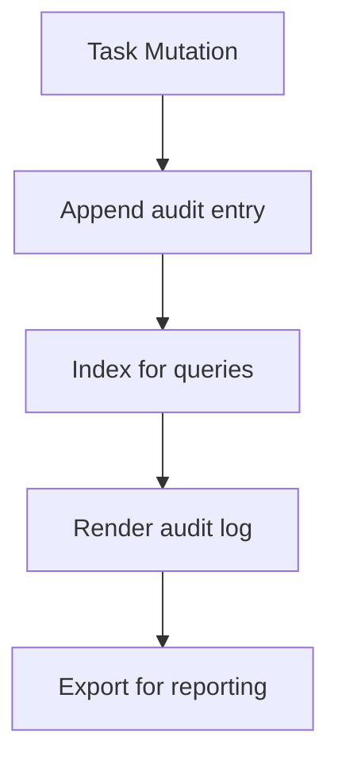

**Diagram sources**
- [components/tasks/TaskAuditLog.tsx](file://src/components/tasks/TaskAuditLog.tsx)
- [database-project-tasks.sql](file://src/database-project-tasks.sql)

**Section sources**
- [components/tasks/TaskAuditLog.tsx](file://src/components/tasks/TaskAuditLog.tsx)
- [database-project-tasks.sql](file://src/database-project-tasks.sql)

## Dependency Analysis
The following diagram maps core dependencies among UI, hooks, and database artifacts:

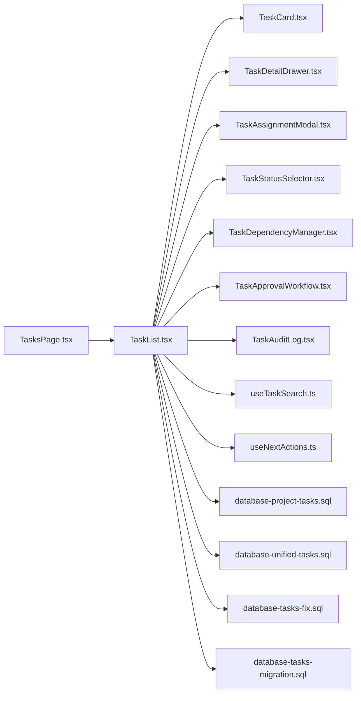

**Diagram sources**
- [TasksPage.tsx](file://src/pages/TasksPage.tsx)
- [components/tasks/TaskList.tsx](file://src/components/tasks/TaskList.tsx)
- [components/tasks/TaskCard.tsx](file://src/components/tasks/TaskCard.tsx)
- [components/tasks/TaskDetailDrawer.tsx](file://src/components/tasks/TaskDetailDrawer.tsx)
- [components/tasks/TaskAssignmentModal.tsx](file://src/components/tasks/TaskAssignmentModal.tsx)
- [components/tasks/TaskStatusSelector.tsx](file://src/components/tasks/TaskStatusSelector.tsx)
- [components/tasks/TaskDependencyManager.tsx](file://src/components/tasks/TaskDependencyManager.tsx)
- [components/tasks/TaskApprovalWorkflow.tsx](file://src/components/tasks/TaskApprovalWorkflow.tsx)
- [components/tasks/TaskAuditLog.tsx](file://src/components/tasks/TaskAuditLog.tsx)
- [hooks/useTaskSearch.ts](file://src/hooks/useTaskSearch.ts)
- [hooks/useNextActions.ts](file://src/hooks/useNextActions.ts)
- [database-project-tasks.sql](file://src/database-project-tasks.sql)
- [database-unified-tasks.sql](file://src/database-unified-tasks.sql)
- [database-tasks-fix.sql](file://src/database-tasks-fix.sql)
- [database-tasks-migration.sql](file://src/database-tasks-migration.sql)

**Section sources**
- [TasksPage.tsx](file://src/pages/TasksPage.tsx)
- [components/tasks/TaskList.tsx](file://src/components/tasks/TaskList.tsx)
- [hooks/useTaskSearch.ts](file://src/hooks/useTaskSearch.ts)
- [hooks/useNextActions.ts](file://src/hooks/useNextActions.ts)
- [database-project-tasks.sql](file://src/database-project-tasks.sql)
- [database-unified-tasks.sql](file://src/database-unified-tasks.sql)
- [database-tasks-fix.sql](file://src/database-tasks-fix.sql)
- [database-tasks-migration.sql](file://src/database-tasks-migration.sql)

## Performance Considerations
- Use pagination and virtualization for large task lists.
- Debounce search input and leverage server-side filtering.
- Cache computed next actions and approval policies client-side with invalidation on relevant updates.
- Batch mutations where possible to reduce network overhead.
- Optimize database queries with appropriate indexes on frequently filtered columns (status, assignee, project_id).

[No sources needed since this section provides general guidance]

## Troubleshooting Guide
Common issues and remedies:
- Invalid transitions: Verify business rules and user permissions; check next-actions output.
- Missing approvers: Ensure approval policies are configured and approvers exist.
- Dependency cycles: Detect and break cycles using dependency validation utilities.
- Concurrent conflicts: Inspect audit logs to identify conflicting updates; reconcile with last-write-wins or merge strategy.
- Notification failures: Check notification policy and channel configurations; review delivery logs.

**Section sources**
- [hooks/useNextActions.ts](file://src/hooks/useNextActions.ts)
- [components/tasks/TaskApprovalWorkflow.tsx](file://src/components/tasks/TaskApprovalWorkflow.tsx)
- [components/tasks/TaskDependencyManager.tsx](file://src/components/tasks/TaskDependencyManager.tsx)
- [components/tasks/TaskAuditLog.tsx](file://src/components/tasks/TaskAuditLog.tsx)

## Conclusion
The Task Workflow and State Management system provides a robust foundation for managing tasks across their lifecycle. By combining well-defined states, configurable transitions, approval workflows, dependency controls, and comprehensive auditing, it supports complex operational needs while remaining extensible for custom states and business rules. Proper attention to concurrency, performance, and error handling ensures reliability and scalability.