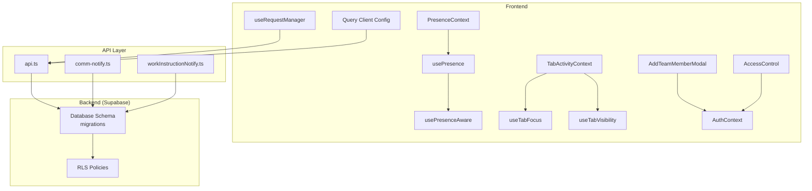
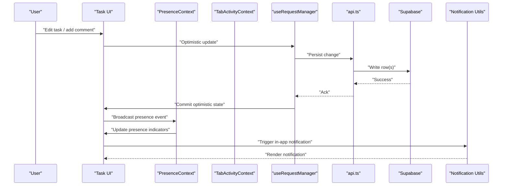
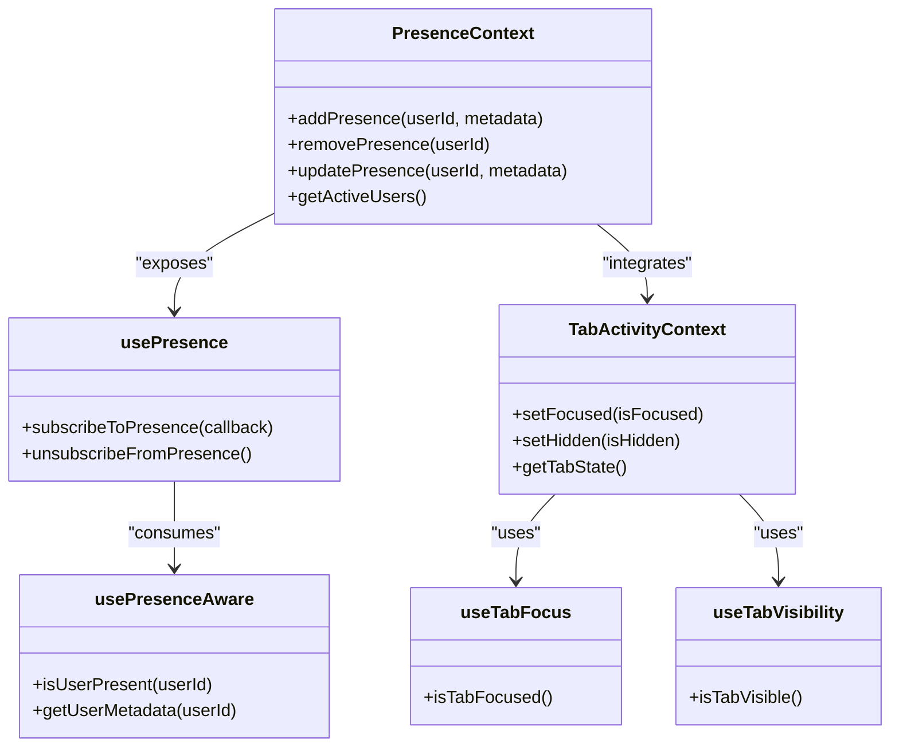
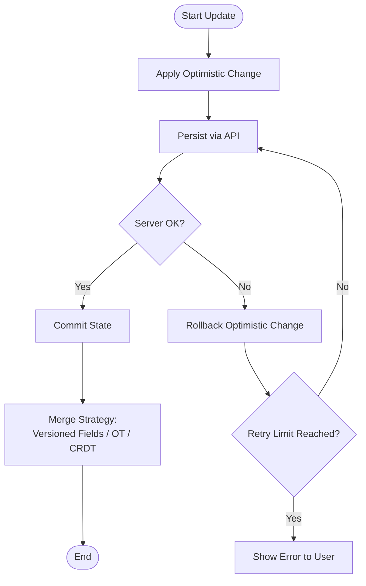
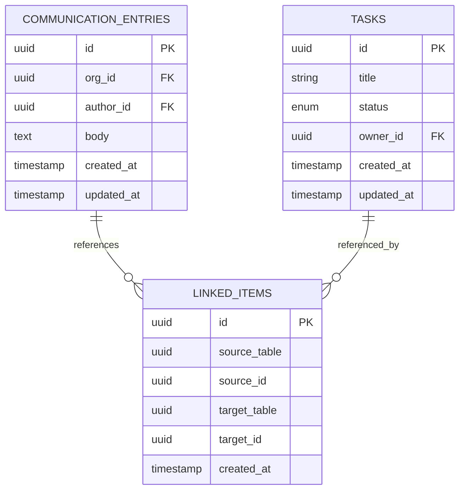
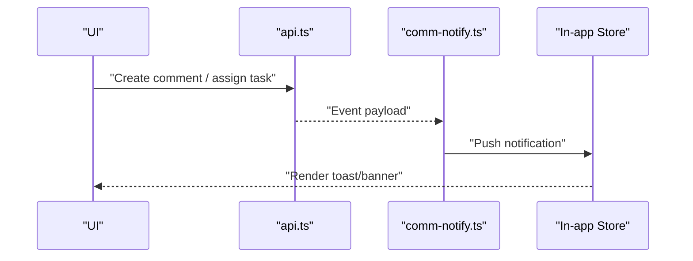
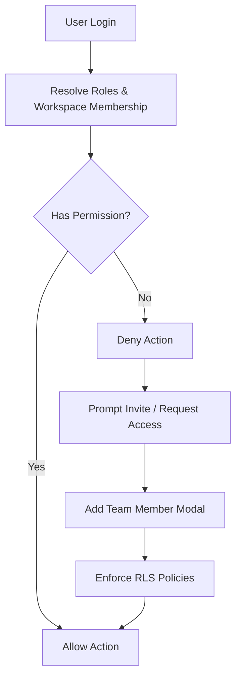
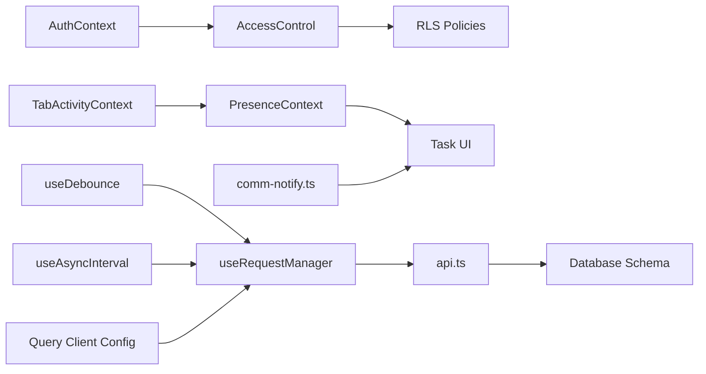

# Team Collaboration and Real-time Features

<cite>
**Referenced Files in This Document**
- [PresenceContext.tsx](file://src/contexts/PresenceContext.tsx)
- [usePresence.ts](file://src/hooks/usePresence.ts)
- [usePresenceAware.ts](file://src/hooks/usePresenceAware.ts)
- [PresenceAwareExample.tsx](file://src/examples/PresenceAwareExample.tsx)
- [TabActivityContext.tsx](file://src/hooks/TabActivityContext.tsx)
- [useTabFocus.ts](file://src/hooks/useTabFocus.ts)
- [useTabVisibility.ts](file://src/hooks/useTabVisibility.ts)
- [AddTeamMemberModal.tsx](file://src/components/AddTeamMemberModal.tsx)
- [AccessControl.tsx](file://src/pages/AccessControl.tsx)
- [AuthContext.tsx](file://src/contexts/AuthContext.tsx)
- [api.ts](file://src/api.ts)
- [supabase.ts](file://src/supabase.ts)
- [database-complete.sql](file://src/database-complete.sql)
- [database-setup.sql](file://src/database-setup.sql)
- [database-communication-sla.sql](file://src/database-communication-sla.sql)
- [database-meetings-mom.sql](file://src/database-meetings-mom.sql)
- [database-project-tasks.sql](file://src/database-project-tasks.sql)
- [database-unified-tasks.sql](file://src/database-unified-tasks.sql)
- [database-communication-assignee.sql](file://src/database-communication-assignee.sql)
- [database-communication-storage.sql](file://src/database-communication-storage.sql)
- [database-communication-tier2.sql](file://src/database-communication-tier2.sql)
- [database-approval-workflows-rls.sql](file://src/database-approval-workflows-rls.sql)
- [database-fix-rls.sql](file://src/database-fix-rls.sql)
- [database-terms-conditions-simple-rls.sql](file://src/database-terms-conditions-simple-rls.sql)
- [database-communication-linked-items.sql](file://src/database-communication-linked-items.sql)
- [client_communication_entries.sql](file://sql/client_communication_entries.sql)
- [client_communication_fixed.sql](file://sql/client_communication_fixed.sql)
- [client_communication_linked_items.sql](file://sql/client_communication_linked_items.sql)
- [comm-notify.ts](file://api/comm-notify.ts)
- [workInstructionNotify.ts](file://src/lib/workInstructionNotify.ts)
- [useRequestManager.ts](file://src/hooks/useRequestManager.ts)
- [useDebounce.ts](file://src/hooks/useDebounce.ts)
- [useAsyncInterval.ts](file://src/hooks/useAsyncInterval.ts)
- [queryClient.ts](file://src/queryClient.ts)
- [config/queryClient.ts](file://src/config/queryClient.ts)
</cite>

## Table of Contents
1. [Introduction](#introduction)
2. [Project Structure](#project-structure)
3. [Core Components](#core-components)
4. [Architecture Overview](#architecture-overview)
5. [Detailed Component Analysis](#detailed-component-analysis)
6. [Dependency Analysis](#dependency-analysis)
7. [Performance Considerations](#performance-considerations)
8. [Troubleshooting Guide](#troubleshooting-guide)
9. [Conclusion](#conclusion)
10. [Appendices](#appendices)

## Introduction
This document explains the team collaboration and real-time features implemented in the task management system. It covers presence awareness, real-time updates, conflict resolution strategies, collaborative editing patterns, comment systems, notifications, permissions and shared workspaces, mobile collaboration, offline support, and synchronization strategies for distributed teams. The goal is to provide both a high-level understanding and actionable guidance for developers integrating or extending these capabilities.

## Project Structure
Collaboration-related functionality spans contexts, hooks, components, API utilities, database migrations, and configuration files:
- Presence and activity: contexts and hooks that track user presence and tab focus/visibility
- Permissions and access control: pages and contexts handling authentication and role-based access
- Notifications and comments: API endpoints and database schemas for communication entries and linked items
- Real-time sync and request management: hooks and query client configuration for optimistic updates and background refresh
- Database schema: SQL migrations defining tables, relationships, and RLS policies for secure collaboration

**Diagram sources**
- [PresenceContext.tsx](file://src/contexts/PresenceContext.tsx)
- [usePresence.ts](file://src/hooks/usePresence.ts)
- [usePresenceAware.ts](file://src/hooks/usePresenceAware.ts)
- [TabActivityContext.tsx](file://src/hooks/TabActivityContext.tsx)
- [useTabFocus.ts](file://src/hooks/useTabFocus.ts)
- [useTabVisibility.ts](file://src/hooks/useTabVisibility.ts)
- [AddTeamMemberModal.tsx](file://src/components/AddTeamMemberModal.tsx)
- [AccessControl.tsx](file://src/pages/AccessControl.tsx)
- [AuthContext.tsx](file://src/contexts/AuthContext.tsx)
- [api.ts](file://src/api.ts)
- [comm-notify.ts](file://api/comm-notify.ts)
- [workInstructionNotify.ts](file://src/lib/workInstructionNotify.ts)
- [queryClient.ts](file://src/queryClient.ts)
- [config/queryClient.ts](file://src/config/queryClient.ts)
- [database-complete.sql](file://src/database-complete.sql)
- [database-setup.sql](file://src/database-setup.sql)
- [database-approval-workflows-rls.sql](file://src/database-approval-workflows-rls.sql)
- [database-fix-rls.sql](file://src/database-fix-rls.sql)
- [database-terms-conditions-simple-rls.sql](file://src/database-terms-conditions-simple-rls.sql)

**Section sources**
- [PresenceContext.tsx](file://src/contexts/PresenceContext.tsx)
- [usePresence.ts](file://src/hooks/usePresence.ts)
- [usePresenceAware.ts](file://src/hooks/usePresenceAware.ts)
- [TabActivityContext.tsx](file://src/hooks/TabActivityContext.tsx)
- [useTabFocus.ts](file://src/hooks/useTabFocus.ts)
- [useTabVisibility.ts](file://src/hooks/useTabVisibility.ts)
- [AddTeamMemberModal.tsx](file://src/components/AddTeamMemberModal.tsx)
- [AccessControl.tsx](file://src/pages/AccessControl.tsx)
- [AuthContext.tsx](file://src/contexts/AuthContext.tsx)
- [api.ts](file://src/api.ts)
- [comm-notify.ts](file://api/comm-notify.ts)
- [workInstructionNotify.ts](file://src/lib/workInstructionNotify.ts)
- [queryClient.ts](file://src/queryClient.ts)
- [config/queryClient.ts](file://src/config/queryClient.ts)
- [database-complete.sql](file://src/database-complete.sql)
- [database-setup.sql](file://src/database-setup.sql)
- [database-approval-workflows-rls.sql](file://src/database-approval-workflows-rls.sql)
- [database-fix-rls.sql](file://src/database-fix-rls.sql)
- [database-terms-conditions-simple-rls.sql](file://src/database-terms-conditions-simple-rls.sql)

## Core Components
- Presence Awareness System
  - Provides a global context for tracking active users and their sessions
  - Exposes hooks to subscribe to presence changes and render live indicators
  - Integrates with tab focus/visibility to infer user activity states
- Real-time Task Updates
  - Uses optimistic UI updates with background reconciliation via request manager and query client
  - Debounces writes and batches operations to reduce network churn
- Collaborative Editing Patterns
  - Encourages operation-based or CRDT-style merges at the application layer
  - Leverages timestamps and version fields to resolve conflicts deterministically
- Comment Systems
  - Stores comments and threaded replies with linkage to tasks and related entities
  - Supports attachments and mentions through linked item references
- Notification Mechanisms
  - In-app notifications triggered by events such as assignments, mentions, and status changes
  - Optional push/email integrations via notification utilities
- Permissions and Shared Workspaces
  - Role-based access control enforced via RLS policies on backend tables
  - Frontend guards prevent unauthorized actions based on current user roles
- Mobile Collaboration and Offline Support
  - Optimistic updates ensure smooth UX while offline
  - Background sync reconciles changes when connectivity resumes

**Section sources**
- [PresenceContext.tsx](file://src/contexts/PresenceContext.tsx)
- [usePresence.ts](file://src/hooks/usePresence.ts)
- [usePresenceAware.ts](file://src/hooks/usePresenceAware.ts)
- [TabActivityContext.tsx](file://src/hooks/TabActivityContext.tsx)
- [useTabFocus.ts](file://src/hooks/useTabFocus.ts)
- [useTabVisibility.ts](file://src/hooks/useTabVisibility.ts)
- [useRequestManager.ts](file://src/hooks/useRequestManager.ts)
- [useDebounce.ts](file://src/hooks/useDebounce.ts)
- [useAsyncInterval.ts](file://src/hooks/useAsyncInterval.ts)
- [queryClient.ts](file://src/queryClient.ts)
- [config/queryClient.ts](file://src/config/queryClient.ts)
- [database-communication-sla.sql](file://src/database-communication-sla.sql)
- [database-meetings-mom.sql](file://src/database-meetings-mom.sql)
- [database-project-tasks.sql](file://src/database-project-tasks.sql)
- [database-unified-tasks.sql](file://src/database-unified-tasks.sql)
- [database-communication-assignee.sql](file://src/database-communication-assignee.sql)
- [database-communication-storage.sql](file://src/database-communication-storage.sql)
- [database-communication-tier2.sql](file://src/database-communication-tier2.sql)
- [database-approval-workflows-rls.sql](file://src/database-approval-workflows-rls.sql)
- [database-fix-rls.sql](file://src/database-fix-rls.sql)
- [database-terms-conditions-simple-rls.sql](file://src/database-terms-conditions-simple-rls.sql)
- [database-communication-linked-items.sql](file://src/database-communication-linked-items.sql)
- [client_communication_entries.sql](file://sql/client_communication_entries.sql)
- [client_communication_fixed.sql](file://sql/client_communication_fixed.sql)
- [client_communication_linked_items.sql](file://sql/client_communication_linked_items.sql)
- [comm-notify.ts](file://api/comm-notify.ts)
- [workInstructionNotify.ts](file://src/lib/workInstructionNotify.ts)

## Architecture Overview
The collaboration architecture combines frontend state management, real-time signaling, and backend enforcement:
- Frontend contexts expose presence and activity signals
- Hooks subscribe to presence and tab visibility to update UI
- Request manager orchestrates optimistic updates and retries
- Query client config centralizes caching, invalidation, and background refetching
- API layer calls Supabase RPC/functions and persists data
- Database schema defines collaboration entities and RLS policies enforce per-user/workspace access

**Diagram sources**
- [PresenceContext.tsx](file://src/contexts/PresenceContext.tsx)
- [TabActivityContext.tsx](file://src/hooks/TabActivityContext.tsx)
- [useRequestManager.ts](file://src/hooks/useRequestManager.ts)
- [api.ts](file://src/api.ts)
- [database-complete.sql](file://src/database-complete.sql)
- [database-setup.sql](file://src/database-setup.sql)
- [comm-notify.ts](file://api/comm-notify.ts)

## Detailed Component Analysis

### Presence Awareness System
The presence system tracks active users and their session states across tabs and devices. It integrates with tab focus and visibility to infer activity and maintain lightweight heartbeats.

**Diagram sources**
- [PresenceContext.tsx](file://src/contexts/PresenceContext.tsx)
- [usePresence.ts](file://src/hooks/usePresence.ts)
- [usePresenceAware.ts](file://src/hooks/usePresenceAware.ts)
- [TabActivityContext.tsx](file://src/hooks/TabActivityContext.tsx)
- [useTabFocus.ts](file://src/hooks/useTabFocus.ts)
- [useTabVisibility.ts](file://src/hooks/useTabVisibility.ts)

**Section sources**
- [PresenceContext.tsx](file://src/contexts/PresenceContext.tsx)
- [usePresence.ts](file://src/hooks/usePresence.ts)
- [usePresenceAware.ts](file://src/hooks/usePresenceAware.ts)
- [TabActivityContext.tsx](file://src/hooks/TabActivityContext.tsx)
- [useTabFocus.ts](file://src/hooks/useTabFocus.ts)
- [useTabVisibility.ts](file://src/hooks/useTabVisibility.ts)

### Real-time Task Updates and Conflict Resolution
Real-time updates rely on optimistic UI and background reconciliation. Conflicts are resolved using deterministic strategies such as last-write-wins with versioning or operational transforms.

**Diagram sources**
- [useRequestManager.ts](file://src/hooks/useRequestManager.ts)
- [useDebounce.ts](file://src/hooks/useDebounce.ts)
- [useAsyncInterval.ts](file://src/hooks/useAsyncInterval.ts)
- [queryClient.ts](file://src/queryClient.ts)
- [config/queryClient.ts](file://src/config/queryClient.ts)
- [database-unified-tasks.sql](file://src/database-unified-tasks.sql)
- [database-project-tasks.sql](file://src/database-project-tasks.sql)

**Section sources**
- [useRequestManager.ts](file://src/hooks/useRequestManager.ts)
- [useDebounce.ts](file://src/hooks/useDebounce.ts)
- [useAsyncInterval.ts](file://src/hooks/useAsyncInterval.ts)
- [queryClient.ts](file://src/queryClient.ts)
- [config/queryClient.ts](file://src/config/queryClient.ts)
- [database-unified-tasks.sql](file://src/database-unified-tasks.sql)
- [database-project-tasks.sql](file://src/database-project-tasks.sql)

### Collaborative Editing Features
Collaborative editing leverages:
- Versioned records to detect concurrent edits
- Operation queues to serialize conflicting changes
- Lightweight diffs to minimize payload size
- Undo/redo stacks scoped to user sessions

Implementation tips:
- Maintain an edit history table for auditability
- Use timestamps and user IDs to attribute changes
- Apply merge rules consistently across all editors

**Section sources**
- [database-unified-tasks.sql](file://src/database-unified-tasks.sql)
- [database-project-tasks.sql](file://src/database-project-tasks.sql)
- [useRequestManager.ts](file://src/hooks/useRequestManager.ts)
- [useDebounce.ts](file://src/hooks/useDebounce.ts)

### Comment Systems and Linked Items
Comments are stored with strong associations to tasks and other entities. Linked items enable cross-referencing between communications and project artifacts.

Key aspects:
- Threaded replies and mention support
- Attachment storage integration
- SLA tracking for response times
- Tiered escalation workflows

**Diagram sources**
- [client_communication_entries.sql](file://sql/client_communication_entries.sql)
- [client_communication_fixed.sql](file://sql/client_communication_fixed.sql)
- [client_communication_linked_items.sql](file://sql/client_communication_linked_items.sql)
- [database-communication-linked-items.sql](file://src/database-communication-linked-items.sql)
- [database-communication-assignee.sql](file://src/database-communication-assignee.sql)
- [database-communication-storage.sql](file://src/database-communication-storage.sql)
- [database-communication-tier2.sql](file://src/database-communication-tier2.sql)
- [database-communication-sla.sql](file://src/database-communication-sla.sql)

**Section sources**
- [client_communication_entries.sql](file://sql/client_communication_entries.sql)
- [client_communication_fixed.sql](file://sql/client_communication_fixed.sql)
- [client_communication_linked_items.sql](file://sql/client_communication_linked_items.sql)
- [database-communication-linked-items.sql](file://src/database-communication-linked-items.sql)
- [database-communication-assignee.sql](file://src/database-communication-assignee.sql)
- [database-communication-storage.sql](file://src/database-communication-storage.sql)
- [database-communication-tier2.sql](file://src/database-communication-tier2.sql)
- [database-communication-sla.sql](file://src/database-communication-sla.sql)

### Notification Mechanisms
Notifications are triggered by key events and delivered in-app, with optional external channels.

**Diagram sources**
- [api.ts](file://src/api.ts)
- [comm-notify.ts](file://api/comm-notify.ts)
- [workInstructionNotify.ts](file://src/lib/workInstructionNotify.ts)

**Section sources**
- [api.ts](file://src/api.ts)
- [comm-notify.ts](file://api/comm-notify.ts)
- [workInstructionNotify.ts](file://src/lib/workInstructionNotify.ts)

### Permissions and Shared Workspaces
Role-based access control ensures only authorized users can perform actions within shared workspaces.

- Frontend guards check current user roles before rendering controls
- Backend RLS policies restrict row-level access by organization and membership
- Invitation flows allow adding team members securely

**Diagram sources**
- [AccessControl.tsx](file://src/pages/AccessControl.tsx)
- [AddTeamMemberModal.tsx](file://src/components/AddTeamMemberModal.tsx)
- [AuthContext.tsx](file://src/contexts/AuthContext.tsx)
- [database-approval-workflows-rls.sql](file://src/database-approval-workflows-rls.sql)
- [database-fix-rls.sql](file://src/database-fix-rls.sql)
- [database-terms-conditions-simple-rls.sql](file://src/database-terms-conditions-simple-rls.sql)

**Section sources**
- [AccessControl.tsx](file://src/pages/AccessControl.tsx)
- [AddTeamMemberModal.tsx](file://src/components/AddTeamMemberModal.tsx)
- [AuthContext.tsx](file://src/contexts/AuthContext.tsx)
- [database-approval-workflows-rls.sql](file://src/database-approval-workflows-rls.sql)
- [database-fix-rls.sql](file://src/database-fix-rls.sql)
- [database-terms-conditions-simple-rls.sql](file://src/database-terms-conditions-simple-rls.sql)

### Mobile Collaboration and Offline Support
Mobile-first design ensures robust collaboration under intermittent connectivity:
- Optimistic updates keep UI responsive
- Background sync reconciles changes when online
- Debounced writes reduce bandwidth usage
- Presence heartbeats adapt to low-power modes

**Section sources**
- [useRequestManager.ts](file://src/hooks/useRequestManager.ts)
- [useDebounce.ts](file://src/hooks/useDebounce.ts)
- [useAsyncInterval.ts](file://src/hooks/useAsyncInterval.ts)
- [queryClient.ts](file://src/queryClient.ts)
- [config/queryClient.ts](file://src/config/queryClient.ts)

## Dependency Analysis
The collaboration subsystem depends on:
- Contexts for global state (presence, auth)
- Hooks for behavior composition (request management, debouncing, intervals)
- API layer for persistence and notifications
- Database schema and RLS policies for security and consistency

**Diagram sources**
- [AuthContext.tsx](file://src/contexts/AuthContext.tsx)
- [AccessControl.tsx](file://src/pages/AccessControl.tsx)
- [PresenceContext.tsx](file://src/contexts/PresenceContext.tsx)
- [TabActivityContext.tsx](file://src/hooks/TabActivityContext.tsx)
- [useRequestManager.ts](file://src/hooks/useRequestManager.ts)
- [useDebounce.ts](file://src/hooks/useDebounce.ts)
- [useAsyncInterval.ts](file://src/hooks/useAsyncInterval.ts)
- [queryClient.ts](file://src/queryClient.ts)
- [config/queryClient.ts](file://src/config/queryClient.ts)
- [api.ts](file://src/api.ts)
- [database-complete.sql](file://src/database-complete.sql)
- [database-setup.sql](file://src/database-setup.sql)
- [database-approval-workflows-rls.sql](file://src/database-approval-workflows-rls.sql)
- [database-fix-rls.sql](file://src/database-fix-rls.sql)
- [database-terms-conditions-simple-rls.sql](file://src/database-terms-conditions-simple-rls.sql)
- [comm-notify.ts](file://api/comm-notify.ts)

**Section sources**
- [AuthContext.tsx](file://src/contexts/AuthContext.tsx)
- [AccessControl.tsx](file://src/pages/AccessControl.tsx)
- [PresenceContext.tsx](file://src/contexts/PresenceContext.tsx)
- [TabActivityContext.tsx](file://src/hooks/TabActivityContext.tsx)
- [useRequestManager.ts](file://src/hooks/useRequestManager.ts)
- [useDebounce.ts](file://src/hooks/useDebounce.ts)
- [useAsyncInterval.ts](file://src/hooks/useAsyncInterval.ts)
- [queryClient.ts](file://src/queryClient.ts)
- [config/queryClient.ts](file://src/config/queryClient.ts)
- [api.ts](file://src/api.ts)
- [database-complete.sql](file://src/database-complete.sql)
- [database-setup.sql](file://src/database-setup.sql)
- [database-approval-workflows-rls.sql](file://src/database-approval-workflows-rls.sql)
- [database-fix-rls.sql](file://src/database-fix-rls.sql)
- [database-terms-conditions-simple-rls.sql](file://src/database-terms-conditions-simple-rls.sql)
- [comm-notify.ts](file://api/comm-notify.ts)

## Performance Considerations
- Debounce frequent writes to reduce server load
- Batch updates where possible to minimize round trips
- Use presence heartbeats sparingly; adjust interval based on device capability
- Prefer optimistic updates with quick rollback paths
- Cache aggressively and invalidate selectively using query client configuration
- Monitor network conditions and adapt retry/backoff strategies

[No sources needed since this section provides general guidance]

## Troubleshooting Guide
Common issues and resolutions:
- Presence not updating: verify tab focus/visibility hooks and heartbeat intervals
- Duplicate notifications: ensure deduplication keys and idempotent handlers
- Sync conflicts: review version fields and merge strategy; inspect error logs from request manager
- Permission errors: confirm RLS policies align with workspace membership and roles
- Offline failures: validate retry logic and queue persistence

**Section sources**
- [usePresenceAware.ts](file://src/hooks/usePresenceAware.ts)
- [useTabFocus.ts](file://src/hooks/useTabFocus.ts)
- [useTabVisibility.ts](file://src/hooks/useTabVisibility.ts)
- [useRequestManager.ts](file://src/hooks/useRequestManager.ts)
- [database-approval-workflows-rls.sql](file://src/database-approval-workflows-rls.sql)
- [database-fix-rls.sql](file://src/database-fix-rls.sql)

## Conclusion
The collaboration and real-time features combine presence awareness, optimistic updates, robust permissioning, and scalable database design. By following the patterns outlined here—versioned records, careful merging, and disciplined caching—you can deliver a responsive, consistent experience for distributed teams across devices and connection qualities.

[No sources needed since this section summarizes without analyzing specific files]

## Appendices

### Examples and References
- Example usage of presence-aware components:
  - [PresenceAwareExample.tsx](file://src/examples/PresenceAwareExample.tsx)

**Section sources**
- [PresenceAwareExample.tsx](file://src/examples/PresenceAwareExample.tsx)