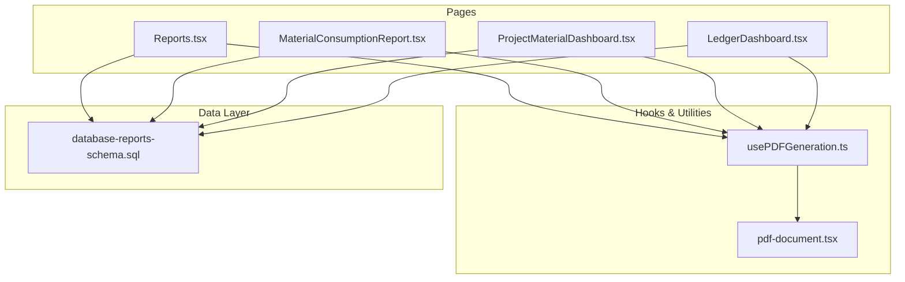
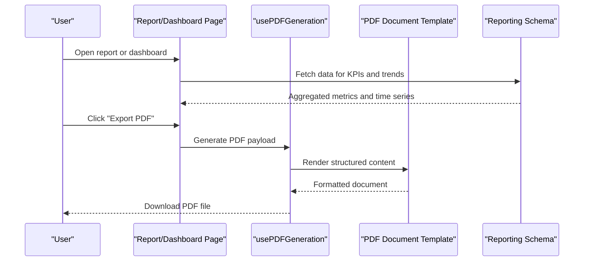
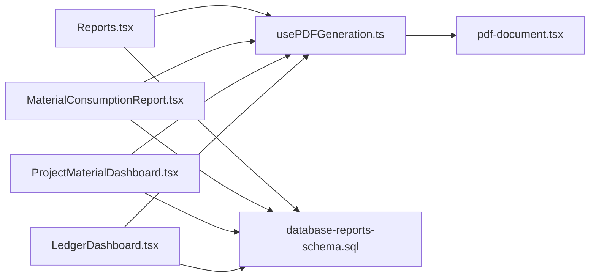

# Reporting & Analytics

<cite>
**Referenced Files in This Document**
- [Reports.tsx](file://src/pages/Reports.tsx)
- [MaterialConsumptionReport.tsx](file://src/pages/MaterialConsumptionReport.tsx)
- [ProjectMaterialDashboard.tsx](file://src/pages/ProjectMaterialDashboard.tsx)
- [LedgerDashboard.tsx](file://src/ledger/LedgerDashboard.tsx)
- [usePDFGeneration.ts](file://src/hooks/usePDFGeneration.ts)
- [pdf-document.tsx](file://src/invoices/pdf-document.tsx)
- [database-reports-schema.sql](file://src/database-reports-schema.sql)
</cite>

## Table of Contents
1. [Introduction](#introduction)
2. [Project Structure](#project-structure)
3. [Core Components](#core-components)
4. [Architecture Overview](#architecture-overview)
5. [Detailed Component Analysis](#detailed-component-analysis)
6. [Dependency Analysis](#dependency-analysis)
7. [Performance Considerations](#performance-considerations)
8. [Troubleshooting Guide](#troubleshooting-guide)
9. [Conclusion](#conclusion)
10. [Appendices](#appendices)

## Introduction
This document describes the Reporting & Analytics system, focusing on:
- Business intelligence dashboards for financial performance, inventory status, project progress, and operational metrics
- Custom report builder and ad-hoc analysis capabilities
- Export functionality (Excel, PDF, CSV)
- Real-time dashboards with KPIs and trend analysis
- Examples for creating custom reports, building interactive charts, and scheduling automated delivery
- Data visualization best practices, performance optimization for large datasets, and mobile-responsive viewing
- Reporting engine architecture and extensibility points for custom report development

## Project Structure
The reporting features are implemented across pages, hooks, and database schema files. The key areas include:
- Pages that host dashboards and standard reports
- Hooks and utilities for PDF generation and data handling
- Database schema definitions for reporting tables

**Diagram sources**
- [Reports.tsx](file://src/pages/Reports.tsx)
- [MaterialConsumptionReport.tsx](file://src/pages/MaterialConsumptionReport.tsx)
- [ProjectMaterialDashboard.tsx](file://src/pages/ProjectMaterialDashboard.tsx)
- [LedgerDashboard.tsx](file://src/ledger/LedgerDashboard.tsx)
- [usePDFGeneration.ts](file://src/hooks/usePDFGeneration.ts)
- [pdf-document.tsx](file://src/invoices/pdf-document.tsx)
- [database-reports-schema.sql](file://src/database-reports-schema.sql)

**Section sources**
- [Reports.tsx](file://src/pages/Reports.tsx)
- [MaterialConsumptionReport.tsx](file://src/pages/MaterialConsumptionReport.tsx)
- [ProjectMaterialDashboard.tsx](file://src/pages/ProjectMaterialDashboard.tsx)
- [LedgerDashboard.tsx](file://src/ledger/LedgerDashboard.tsx)
- [usePDFGeneration.ts](file://src/hooks/usePDFGeneration.ts)
- [pdf-document.tsx](file://src/invoices/pdf-document.tsx)
- [database-reports-schema.sql](file://src/database-reports-schema.sql)

## Core Components
- Reports hub page: Central navigation to available reports and dashboards
- Material consumption report: Standard report focused on material usage tracking
- Project material dashboard: Project-centric view of material-related metrics
- Ledger dashboard: Financial overview and related analytics
- PDF generation hook: Reusable utility for exporting content to PDF
- PDF document template: Structured layout used by PDF exports

These components collectively provide:
- Standard reports for financial performance, inventory status, project progress, and operational metrics
- Export capabilities via PDF generation
- Foundations for extending into Excel and CSV exports

**Section sources**
- [Reports.tsx](file://src/pages/Reports.tsx)
- [MaterialConsumptionReport.tsx](file://src/pages/MaterialConsumptionReport.tsx)
- [ProjectMaterialDashboard.tsx](file://src/pages/ProjectMaterialDashboard.tsx)
- [LedgerDashboard.tsx](file://src/ledger/LedgerDashboard.tsx)
- [usePDFGeneration.ts](file://src/hooks/usePDFGeneration.ts)
- [pdf-document.tsx](file://src/invoices/pdf-document.tsx)

## Architecture Overview
The reporting system follows a layered approach:
- Presentation layer: Pages render dashboards and reports
- Service/utilities layer: Hooks and utilities handle export logic and formatting
- Data layer: Schema defines reporting tables and structures

**Diagram sources**
- [Reports.tsx](file://src/pages/Reports.tsx)
- [usePDFGeneration.ts](file://src/hooks/usePDFGeneration.ts)
- [pdf-document.tsx](file://src/invoices/pdf-document.tsx)
- [database-reports-schema.sql](file://src/database-reports-schema.sql)

## Detailed Component Analysis

### Reports Hub
Purpose:
- Entry point to all reports and dashboards
- Provides quick access to standard reports and custom builders

Key responsibilities:
- Routing to specific report pages
- Displaying summary tiles and recent activity
- Triggering exports from the hub

Extensibility:
- Add new report links and actions
- Integrate additional export formats

**Section sources**
- [Reports.tsx](file://src/pages/Reports.tsx)

### Material Consumption Report
Purpose:
- Tracks material usage across projects and operations
- Supports filtering by date range, project, and item categories

Key responsibilities:
- Querying consumption data
- Rendering tabular summaries and totals
- Exporting results to PDF

Customization:
- Add filters for warehouses, vendors, or cost centers
- Include variance vs. planned consumption

**Section sources**
- [MaterialConsumptionReport.tsx](file://src/pages/MaterialConsumptionReport.tsx)

### Project Material Dashboard
Purpose:
- Consolidates material-related KPIs per project
- Visualizes trends and bottlenecks

Key responsibilities:
- Aggregating project-level metrics
- Presenting charts and trend lines
- Enabling drill-down to detailed records

Real-time aspects:
- Refresh intervals for live updates
- Optimized queries for large datasets

**Section sources**
- [ProjectMaterialDashboard.tsx](file://src/pages/ProjectMaterialDashboard.tsx)

### Ledger Dashboard
Purpose:
- Financial performance overview including balances, transactions, and summaries
- Operational metrics tied to ledger entries

Key responsibilities:
- Summarizing financial data
- Highlighting variances and anomalies
- Providing export options for audit trails

**Section sources**
- [LedgerDashboard.tsx](file://src/ledger/LedgerDashboard.tsx)

### PDF Generation Hook
Purpose:
- Encapsulates PDF export logic
- Coordinates data preparation and rendering

Key responsibilities:
- Formatting data for PDF templates
- Managing pagination and headers/footers
- Handling errors during generation

Integration:
- Used by multiple report pages
- Can be extended for Excel/CSV by adding converters

**Section sources**
- [usePDFGeneration.ts](file://src/hooks/usePDFGeneration.ts)
- [pdf-document.tsx](file://src/invoices/pdf-document.tsx)

### Reporting Schema
Purpose:
- Defines tables and structures supporting reporting queries
- Ensures consistent data models for dashboards and exports

Key responsibilities:
- Storing aggregated metrics and snapshots
- Supporting time-series analysis
- Enabling efficient joins and aggregations

**Section sources**
- [database-reports-schema.sql](file://src/database-reports-schema.sql)

## Dependency Analysis
The following diagram shows how pages depend on hooks and templates, and how they interact with the reporting schema.

**Diagram sources**
- [Reports.tsx](file://src/pages/Reports.tsx)
- [MaterialConsumptionReport.tsx](file://src/pages/MaterialConsumptionReport.tsx)
- [ProjectMaterialDashboard.tsx](file://src/pages/ProjectMaterialDashboard.tsx)
- [LedgerDashboard.tsx](file://src/ledger/LedgerDashboard.tsx)
- [usePDFGeneration.ts](file://src/hooks/usePDFGeneration.ts)
- [pdf-document.tsx](file://src/invoices/pdf-document.tsx)
- [database-reports-schema.sql](file://src/database-reports-schema.sql)

**Section sources**
- [Reports.tsx](file://src/pages/Reports.tsx)
- [MaterialConsumptionReport.tsx](file://src/pages/MaterialConsumptionReport.tsx)
- [ProjectMaterialDashboard.tsx](file://src/pages/ProjectMaterialDashboard.tsx)
- [LedgerDashboard.tsx](file://src/ledger/LedgerDashboard.tsx)
- [usePDFGeneration.ts](file://src/hooks/usePDFGeneration.ts)
- [pdf-document.tsx](file://src/invoices/pdf-document.tsx)
- [database-reports-schema.sql](file://src/database-reports-schema.sql)

## Performance Considerations
- Prefer server-side aggregation and precomputed snapshots for large datasets
- Use pagination and virtualization for heavy tables
- Cache frequently accessed KPIs and reduce redundant queries
- Optimize indexes on reporting schema columns used in filters and joins
- Limit chart series size; aggregate at coarser granularity when needed
- Defer non-critical exports until after primary render completes

[No sources needed since this section provides general guidance]

## Troubleshooting Guide
Common issues and resolutions:
- PDF export fails due to missing data: Ensure required filters are set and data is loaded before export
- Slow dashboard load times: Check query complexity and add appropriate indexes
- Inconsistent totals: Validate aggregation logic against source tables
- Mobile display problems: Use responsive layouts and avoid fixed-width charts

**Section sources**
- [usePDFGeneration.ts](file://src/hooks/usePDFGeneration.ts)
- [pdf-document.tsx](file://src/invoices/pdf-document.tsx)

## Conclusion
The Reporting & Analytics system provides a solid foundation for dashboards, standard reports, and exports. With clear separation between presentation, utilities, and data layers, it supports extensibility for custom reports, additional export formats, and real-time analytics. Following the recommended best practices ensures scalability, reliability, and a great user experience across devices.

[No sources needed since this section summarizes without analyzing specific files]

## Appendices

### Standard Reports Catalog
- Financial performance: Revenue, costs, margins, and cash flow summaries
- Inventory status: Stock levels, turnover, and aging
- Project progress: Milestones, resource utilization, and material consumption
- Operational metrics: Throughput, delays, and efficiency indicators

[No sources needed since this section provides general guidance]

### Export Formats
- PDF: Supported via the PDF generation hook and document template
- Excel: Extend the hook with spreadsheet conversion utilities
- CSV: Add a simple converter to output tabular data

[No sources needed since this section provides general guidance]

### Creating Custom Reports
Steps:
- Define the report’s purpose and KPIs
- Create or extend the reporting schema if needed
- Build a page component to fetch and present data
- Integrate the PDF generation hook for exports
- Add filters and drill-downs for interactivity

[No sources needed since this section provides general guidance]

### Building Interactive Charts
Guidelines:
- Choose appropriate chart types for the data story
- Provide tooltips, legends, and cross-filtering
- Aggregate data client-side only when necessary
- Ensure accessibility and keyboard navigation

[No sources needed since this section provides general guidance]

### Scheduling Automated Report Delivery
Approach:
- Implement a background job scheduler
- Generate reports using existing hooks/templates
- Deliver via email or store in a shared location
- Log execution status and errors

[No sources needed since this section provides general guidance]

### Data Visualization Best Practices
- Keep visuals simple and focused
- Use consistent color schemes and labels
- Show context (targets, benchmarks)
- Avoid clutter and excessive detail

[No sources needed since this section provides general guidance]

### Mobile-Responsive Viewing
- Use fluid layouts and adaptive grids
- Simplify charts on small screens
- Enable swipe gestures for carousels and tabs
- Test touch interactions thoroughly

[No sources needed since this section provides general guidance]