# Approval Workflows

<cite>
**Referenced Files in This Document**
- [workflow-engine.ts](file://src/approvals/workflow-engine.ts)
- [notifications.ts](file://src/approvals/notifications.ts)
- [integration.ts](file://src/approvals/integration.ts)
- [settings-api.ts](file://src/approvals/settings-api.ts)
- [siteReportApproval.ts](file://src/approvals/siteReportApproval.ts)
- [api.ts](file://src/approvals/api.ts)
- [process-action.ts](file://api/approvals/process-action.ts)
- [AmendmentApprovalPanel.tsx](file://src/components/AmendmentApprovalPanel.tsx)
- [ApprovalDetailDrawer.tsx](file://src/components/ApprovalDetailDrawer.tsx)
- [ApprovalDetailsSidebar.tsx](file://src/components/ApprovalDetailsSidebar.tsx)
- [ApprovalSettings.tsx](file://src/components/ApprovalSettings.tsx)
- [ApprovalTable.tsx](file://src/components/ApprovalTable.tsx)
- [useApprovals.ts](file://src/hooks/useApprovals.ts)
- [Approvals.tsx](file://src/pages/Approvals.tsx)
- [ApprovalSettings.tsx](file://src/pages/ApprovalSettings.tsx)
- [database-approval-workflows-fix-fk.sql](file://src/database-approval-workflows-fix-fk.sql)
- [database-approval-workflows-rls.sql](file://src/database-approval-workflows-rls.sql)
- [database-approval.sql](file://src/database-approval.sql)
- [database-approvals-edge-cases.sql](file://src/database-approvals-edge-cases.sql)
- [create_approval_settings_table.sql](file://sql/create_approval_settings_table.sql)
- [phase1_approvals_denorm.sql](file://sql/phase1_approvals_denorm.sql)
- [phase1_backfill_approval_metadata.sql](file://sql/phase1_backfill_approval_metadata.sql)
</cite>

## Table of Contents
1. [Introduction](#introduction)
2. [Project Structure](#project-structure)
3. [Core Components](#core-components)
4. [Architecture Overview](#architecture-overview)
5. [Detailed Component Analysis](#detailed-component-analysis)
6. [Dependency Analysis](#dependency-analysis)
7. [Performance Considerations](#performance-considerations)
8. [Troubleshooting Guide](#troubleshooting-guide)
9. [Conclusion](#conclusion)
10. [Appendices](#appendices)

## Introduction
This document explains the Approval Workflows system, covering multi-stage approvals, the workflow engine architecture, role-based permissions, request lifecycle, notifications, audit trail, amendment approval panel, settings configuration, bulk operations, state management, email and external integrations, conditional logic, security, performance for large queues, and mobile-friendly interfaces. It is designed to be accessible to both technical and non-technical readers while providing precise references to implementation files.

## Project Structure
The Approval Workflows feature spans serverless API endpoints, a workflow engine, notification services, UI components, hooks, pages, and database migrations. The structure separates concerns:
- API layer: HTTP endpoints for processing actions and fetching data
- Workflow engine: Core state machine and routing logic
- Notifications: Email and channel dispatching
- Integrations: External systems (e.g., ERP or messaging)
- Settings: Configuration APIs and UI
- UI: Panels, drawers, tables, and pages
- Hooks: Client-side data access and caching
- Database: Schema, RLS policies, indexes, and backfills

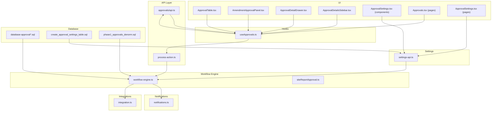

**Diagram sources**
- [process-action.ts](file://api/approvals/process-action.ts)
- [api.ts](file://src/approvals/api.ts)
- [workflow-engine.ts](file://src/approvals/workflow-engine.ts)
- [siteReportApproval.ts](file://src/approvals/siteReportApproval.ts)
- [notifications.ts](file://src/approvals/notifications.ts)
- [integration.ts](file://src/approvals/integration.ts)
- [settings-api.ts](file://src/approvals/settings-api.ts)
- [ApprovalTable.tsx](file://src/components/ApprovalTable.tsx)
- [AmendmentApprovalPanel.tsx](file://src/components/AmendmentApprovalPanel.tsx)
- [ApprovalDetailDrawer.tsx](file://src/components/ApprovalDetailDrawer.tsx)
- [ApprovalDetailsSidebar.tsx](file://src/components/ApprovalDetailsSidebar.tsx)
- [ApprovalSettings.tsx](file://src/components/ApprovalSettings.tsx)
- [Approvals.tsx](file://src/pages/Approvals.tsx)
- [ApprovalSettings.tsx](file://src/pages/ApprovalSettings.tsx)
- [useApprovals.ts](file://src/hooks/useApprovals.ts)
- [database-approval.sql](file://src/database-approval.sql)
- [create_approval_settings_table.sql](file://sql/create_approval_settings_table.sql)
- [phase1_approvals_denorm.sql](file://sql/phase1_approvals_denorm.sql)

**Section sources**
- [workflow-engine.ts](file://src/approvals/workflow-engine.ts)
- [notifications.ts](file://src/approvals/notifications.ts)
- [integration.ts](file://src/approvals/integration.ts)
- [settings-api.ts](file://src/approvals/settings-api.ts)
- [siteReportApproval.ts](file://src/approvals/siteReportApproval.ts)
- [api.ts](file://src/approvals/api.ts)
- [process-action.ts](file://api/approvals/process-action.ts)
- [AmendmentApprovalPanel.tsx](file://src/components/AmendmentApprovalPanel.tsx)
- [ApprovalDetailDrawer.tsx](file://src/components/ApprovalDetailDrawer.tsx)
- [ApprovalDetailsSidebar.tsx](file://src/components/ApprovalDetailsSidebar.tsx)
- [ApprovalSettings.tsx](file://src/components/ApprovalSettings.tsx)
- [ApprovalTable.tsx](file://src/components/ApprovalTable.tsx)
- [useApprovals.ts](file://src/hooks/useApprovals.ts)
- [Approvals.tsx](file://src/pages/Approvals.tsx)
- [ApprovalSettings.tsx](file://src/pages/ApprovalSettings.tsx)
- [database-approval-workflows-fix-fk.sql](file://src/database-approval-workflows-fix-fk.sql)
- [database-approval-workflows-rls.sql](file://src/database-approval-workflows-rls.sql)
- [database-approval.sql](file://src/database-approval.sql)
- [database-approvals-edge-cases.sql](file://src/database-approvals-edge-cases.sql)
- [create_approval_settings_table.sql](file://sql/create_approval_settings_table.sql)
- [phase1_approvals_denorm.sql](file://sql/phase1_approvals_denorm.sql)
- [phase1_backfill_approval_metadata.sql](file://sql/phase1_backfill_approval_metadata.sql)

## Core Components
- Workflow Engine: Implements the state machine that transitions approval requests through stages based on rules, roles, and conditions. It orchestrates notifications and external integrations upon state changes.
- Notifications: Handles email and other channels, templating, retry/backoff, and delivery status tracking.
- Integration: Provides adapters for external systems (e.g., ERP, messaging), with pluggable connectors and error handling.
- Settings API: CRUD for approval configurations, including stage definitions, approver assignments, thresholds, and escalation rules.
- Site Report Approval: Specialized workflow for site reports, including photo attachments and child records.
- API Endpoints: Serverless functions for processing actions (approve/reject/escalate) and querying approval lists.
- UI Components: Tables, panels, drawers, and settings screens for viewing and acting on approvals.
- Hooks: React hooks for data fetching, caching, optimistic updates, and real-time polling.
- Database: Schema, constraints, RLS policies, indexes, denormalization, and backfills for performance and correctness.

**Section sources**
- [workflow-engine.ts](file://src/approvals/workflow-engine.ts)
- [notifications.ts](file://src/approvals/notifications.ts)
- [integration.ts](file://src/approvals/integration.ts)
- [settings-api.ts](file://src/approvals/settings-api.ts)
- [siteReportApproval.ts](file://src/approvals/siteReportApproval.ts)
- [api.ts](file://src/approvals/api.ts)
- [process-action.ts](file://api/approvals/process-action.ts)
- [AmendmentApprovalPanel.tsx](file://src/components/AmendmentApprovalPanel.tsx)
- [ApprovalDetailDrawer.tsx](file://src/components/ApprovalDetailDrawer.tsx)
- [ApprovalDetailsSidebar.tsx](file://src/components/ApprovalDetailsSidebar.tsx)
- [ApprovalSettings.tsx](file://src/components/ApprovalSettings.tsx)
- [ApprovalTable.tsx](file://src/components/ApprovalTable.tsx)
- [useApprovals.ts](file://src/hooks/useApprovals.ts)
- [Approvals.tsx](file://src/pages/Approvals.tsx)
- [ApprovalSettings.tsx](file://src/pages/ApprovalSettings.tsx)
- [database-approval-workflows-fix-fk.sql](file://src/database-approval-workflows-fix-fk.sql)
- [database-approval-workflows-rls.sql](file://src/database-approval-workflows-rls.sql)
- [database-approval.sql](file://src/database-approval.sql)
- [database-approvals-edge-cases.sql](file://src/database-approvals-edge-cases.sql)
- [create_approval_settings_table.sql](file://sql/create_approval_settings_table.sql)
- [phase1_approvals_denorm.sql](file://sql/phase1_approvals_denorm.sql)
- [phase1_backfill_approval_metadata.sql](file://sql/phase1_backfill_approval_metadata.sql)

## Architecture Overview
The Approval Workflows system follows a layered architecture:
- Presentation: Pages and components render approval lists, details, and settings.
- Data Access: Hooks abstract API calls and manage caching/polling.
- API: Stateless endpoints validate inputs, enforce RBAC, and delegate to the workflow engine.
- Workflow Engine: Central state machine applying rules, computing next steps, and triggering side effects.
- Notifications & Integrations: Pluggable channels for emails and external systems.
- Persistence: Relational schema with RLS policies, indexes, and denormalized views for performance.

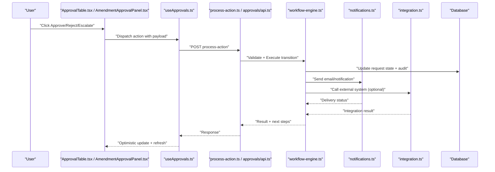

**Diagram sources**
- [process-action.ts](file://api/approvals/process-action.ts)
- [api.ts](file://src/approvals/api.ts)
- [workflow-engine.ts](file://src/approvals/workflow-engine.ts)
- [notifications.ts](file://src/approvals/notifications.ts)
- [integration.ts](file://src/approvals/integration.ts)
- [useApprovals.ts](file://src/hooks/useApprovals.ts)
- [ApprovalTable.tsx](file://src/components/ApprovalTable.tsx)
- [AmendmentApprovalPanel.tsx](file://src/components/AmendmentApprovalPanel.tsx)

## Detailed Component Analysis

### Workflow Engine
The workflow engine defines states, transitions, and business rules. It computes next approvers, enforces thresholds, handles escalations, and emits events for notifications and integrations.

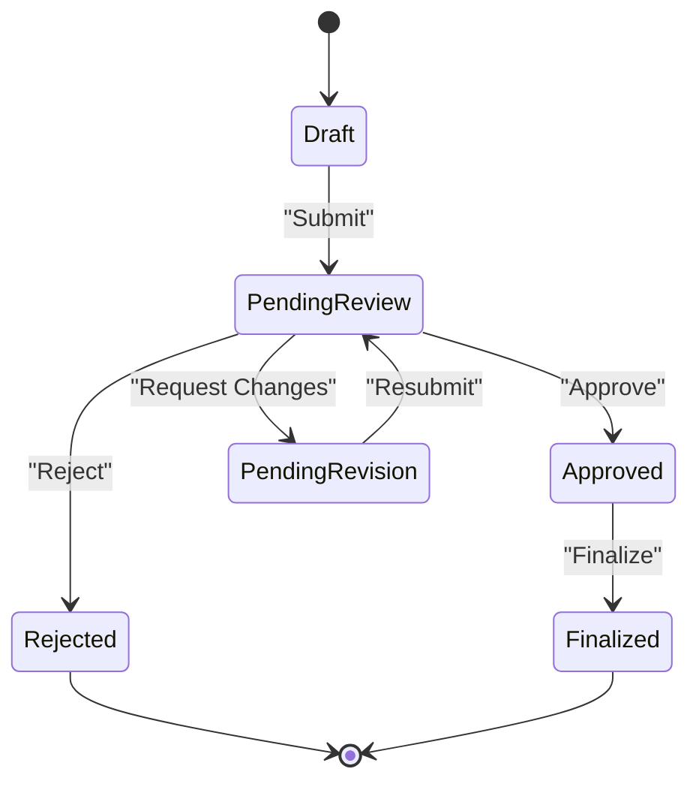

Key responsibilities:
- State validation and transition guards
- Role-based approver resolution
- Conditional branching based on entity attributes
- Audit logging and event emission
- Retry and idempotency for durability

**Section sources**
- [workflow-engine.ts](file://src/approvals/workflow-engine.ts)
- [siteReportApproval.ts](file://src/approvals/siteReportApproval.ts)
- [database-approval.sql](file://src/database-approval.sql)
- [database-approvals-edge-cases.sql](file://src/database-approvals-edge-cases.sql)

### Notification System
Handles email templates, recipient resolution, retries, and delivery tracking. Supports multiple channels via an adapter pattern.

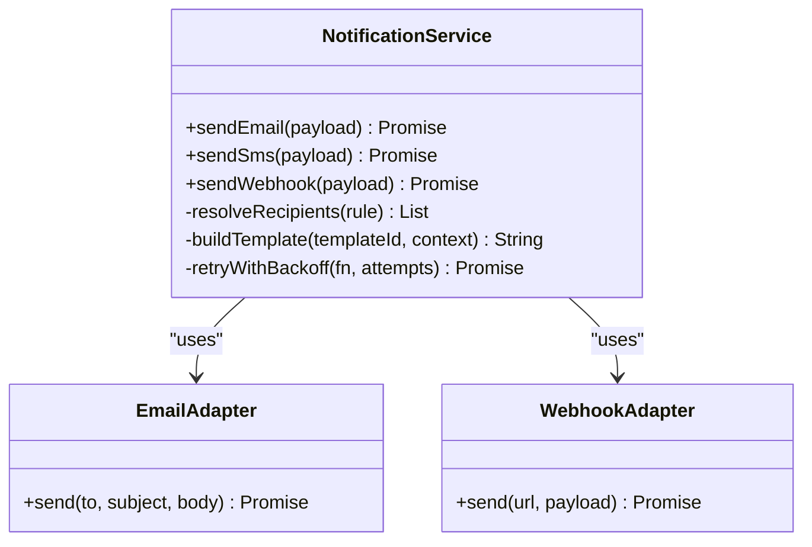

Best practices:
- Template variables for dynamic content
- Idempotent sends with deduplication keys
- Dead-letter queue for failed deliveries
- Rate limiting and throttling

**Section sources**
- [notifications.ts](file://src/approvals/notifications.ts)

### External Integrations
Pluggable adapters for ERP, messaging, and other systems. Encapsulates authentication, retries, and error mapping.

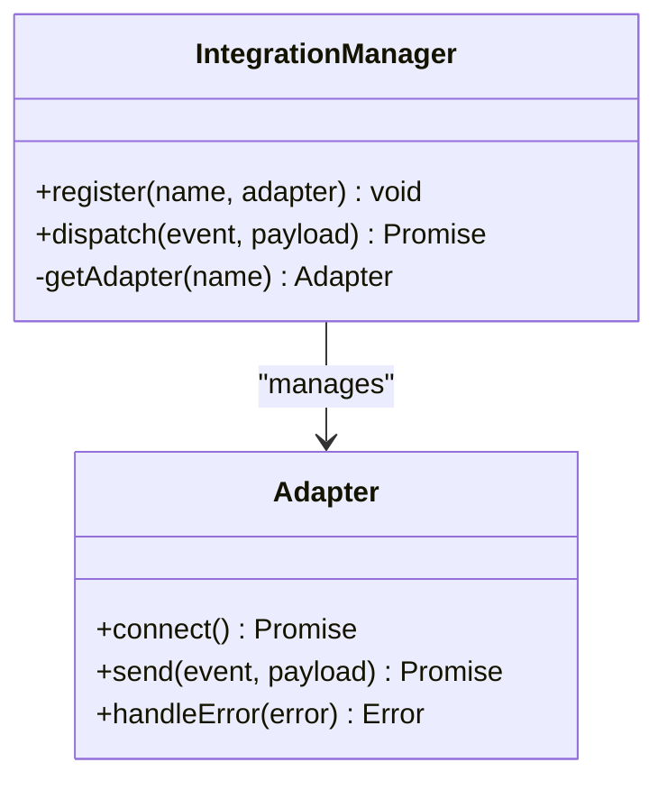

Examples:
- ERP sync on finalization
- Slack/Teams webhook on status change
- SSO callback integration

**Section sources**
- [integration.ts](file://src/approvals/integration.ts)

### Approval Settings Configuration
Defines stage templates, approver rules, thresholds, escalation paths, and default behaviors. Exposed via API and configured through UI.

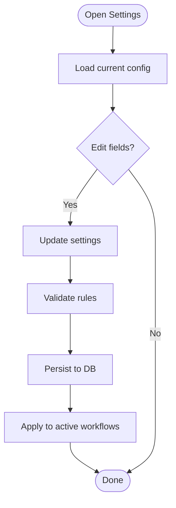

Configuration items include:
- Stage definitions and order
- Role/department-based approver selection
- Thresholds by amount/risk
- Escalation timers and fallback approvers
- Conditional branches (e.g., vendor type, project size)

**Section sources**
- [settings-api.ts](file://src/approvals/settings-api.ts)
- [ApprovalSettings.tsx](file://src/components/ApprovalSettings.tsx)
- [ApprovalSettings.tsx](file://src/pages/ApprovalSettings.tsx)
- [create_approval_settings_table.sql](file://sql/create_approval_settings_table.sql)

### Amendment Approval Panel
A dedicated UI for reviewing and approving amendments, showing diffs, attachments, and history.

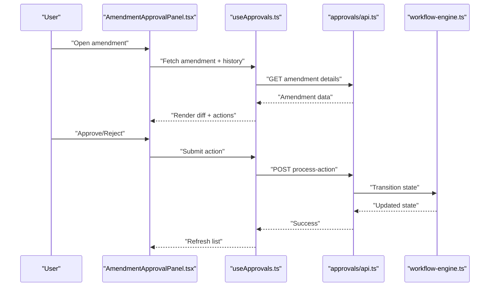

**Section sources**
- [AmendmentApprovalPanel.tsx](file://src/components/AmendmentApprovalPanel.tsx)
- [useApprovals.ts](file://src/hooks/useApprovals.ts)
- [api.ts](file://src/approvals/api.ts)
- [process-action.ts](file://api/approvals/process-action.ts)
- [workflow-engine.ts](file://src/approvals/workflow-engine.ts)

### Approval Detail Views
Drawers and sidebars provide contextual details, comments, attachments, and audit trails.

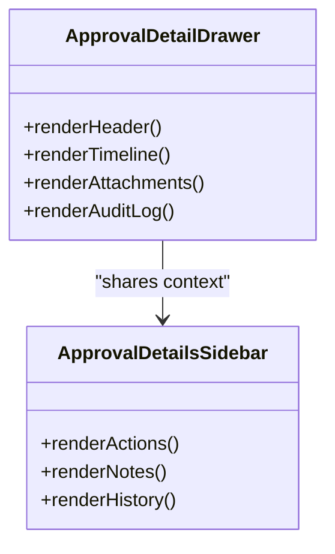

**Section sources**
- [ApprovalDetailDrawer.tsx](file://src/components/ApprovalDetailDrawer.tsx)
- [ApprovalDetailsSidebar.tsx](file://src/components/ApprovalDetailsSidebar.tsx)

### Approval Table and Bulk Operations
Lists approvals with filters, sorting, and bulk actions (approve/reject/escalate). Optimized for large datasets using virtualization and pagination.

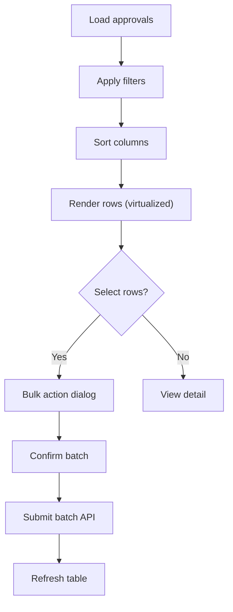

**Section sources**
- [ApprovalTable.tsx](file://src/components/ApprovalTable.tsx)
- [useApprovals.ts](file://src/hooks/useApprovals.ts)
- [api.ts](file://src/approvals/api.ts)

### Request Lifecycle and Audit Trail
End-to-end lifecycle from creation to finalization, with immutable audit entries capturing who did what and when.

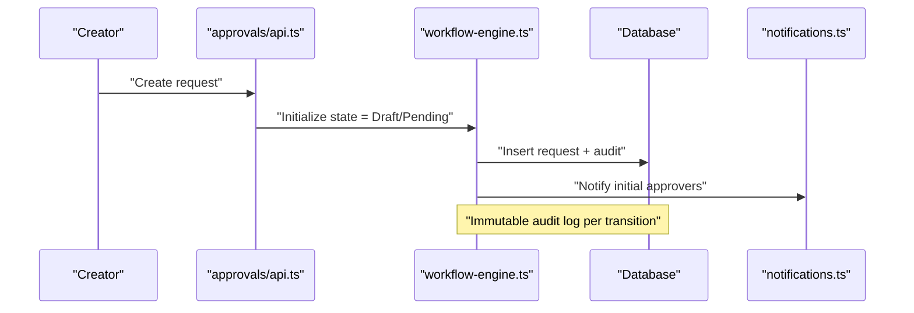

**Section sources**
- [api.ts](file://src/approvals/api.ts)
- [workflow-engine.ts](file://src/approvals/workflow-engine.ts)
- [database-approval.sql](file://src/database-approval.sql)
- [phase1_backfill_approval_metadata.sql](file://sql/phase1_backfill_approval_metadata.sql)

### Role-Based Permissions
RBAC ensures only authorized users can act on approvals. Policies are enforced at API and database layers.

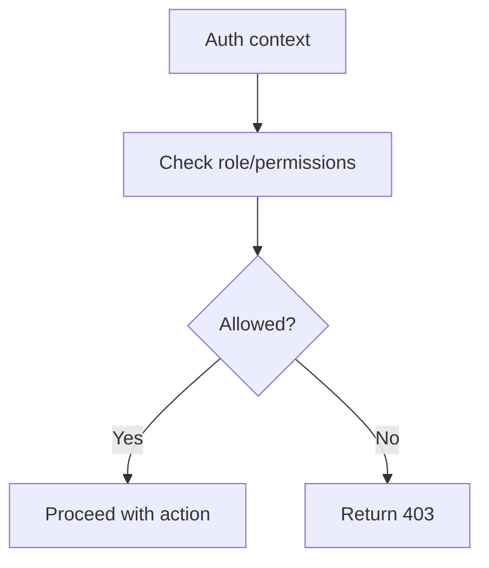

**Section sources**
- [process-action.ts](file://api/approvals/process-action.ts)
- [database-approval-workflows-rls.sql](file://src/database-approval-workflows-rls.sql)
- [database-approval-workflows-fix-fk.sql](file://src/database-approval-workflows-fix-fk.sql)

### Mobile Approval Interfaces
Responsive design and touch-friendly interactions ensure approvals can be performed on mobile devices. Key considerations:
- Collapsible panels and swipe gestures
- Large tap targets and clear CTAs
- Offline-safe drafts and retry queues
- Optimized images and lazy loading

[No sources needed since this section provides general guidance]

## Dependency Analysis
The system exhibits clear separation between UI, hooks, API, engine, and persistence. Dependencies are mostly unidirectional, reducing coupling.

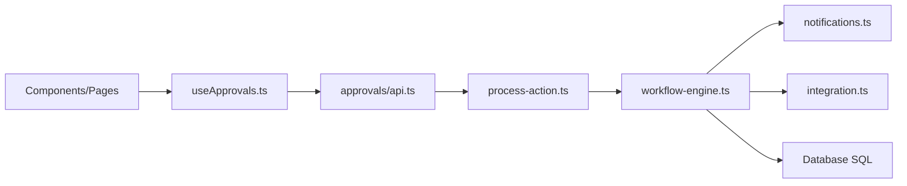

Potential circular dependencies are avoided by keeping the engine free of UI concerns and isolating notifications/integrations behind adapters.

**Diagram sources**
- [useApprovals.ts](file://src/hooks/useApprovals.ts)
- [api.ts](file://src/approvals/api.ts)
- [process-action.ts](file://api/approvals/process-action.ts)
- [workflow-engine.ts](file://src/approvals/workflow-engine.ts)
- [notifications.ts](file://src/approvals/notifications.ts)
- [integration.ts](file://src/approvals/integration.ts)
- [database-approval.sql](file://src/database-approval.sql)

**Section sources**
- [useApprovals.ts](file://src/hooks/useApprovals.ts)
- [api.ts](file://src/approvals/api.ts)
- [process-action.ts](file://api/approvals/process-action.ts)
- [workflow-engine.ts](file://src/approvals/workflow-engine.ts)
- [notifications.ts](file://src/approvals/notifications.ts)
- [integration.ts](file://src/approvals/integration.ts)
- [database-approval.sql](file://src/database-approval.sql)

## Performance Considerations
- Database indexing: Ensure indexed columns for frequent filters (status, org_id, created_at).
- Denormalization: Use denormalized views for reporting and dashboards to reduce joins.
- Pagination and virtualization: Implement server-side pagination and client-side virtualization for large tables.
- Caching: Cache read-heavy queries with TTL; invalidate on state changes.
- Batch operations: Support bulk approve/reject to minimize round trips.
- Backpressure: Throttle notifications and external calls with queues and retries.
- Image optimization: Compress and lazy-load attachments.

[No sources needed since this section provides general guidance]

## Troubleshooting Guide
Common issues and resolutions:
- Stuck approvals: Check audit logs for failed transitions; verify RBAC and settings.
- Missing notifications: Inspect delivery logs and retry queues; validate templates and recipients.
- Slow lists: Review indexes and query plans; enable pagination and filters.
- Integration failures: Inspect adapter logs and credentials; implement dead-letter queues.
- Inconsistent state: Verify idempotency keys and transaction boundaries.

**Section sources**
- [database-approvals-edge-cases.sql](file://src/database-approvals-edge-cases.sql)
- [notifications.ts](file://src/approvals/notifications.ts)
- [integration.ts](file://src/approvals/integration.ts)

## Conclusion
The Approval Workflows system provides a robust, extensible foundation for multi-stage approvals with strong security, performance, and usability. By leveraging a clear architecture, pluggable notifications and integrations, and comprehensive settings, teams can tailor workflows to their needs while maintaining auditability and reliability.

[No sources needed since this section summarizes without analyzing specific files]

## Appendices

### Example: Configuring Custom Approval Workflows
- Define stages and assign roles/departments
- Set thresholds and conditional branches
- Configure escalation timers and fallback approvers
- Test with sample data and validate audit trail

**Section sources**
- [settings-api.ts](file://src/approvals/settings-api.ts)
- [ApprovalSettings.tsx](file://src/components/ApprovalSettings.tsx)
- [create_approval_settings_table.sql](file://sql/create_approval_settings_table.sql)

### Example: Extending Notification Channels
- Implement a new adapter (e.g., SMS, chat)
- Register it in the notification service
- Map workflow events to channel payloads
- Add delivery tracking and retries

**Section sources**
- [notifications.ts](file://src/approvals/notifications.ts)
- [integration.ts](file://src/approvals/integration.ts)

### Example: Implementing Conditional Approval Logic
- Add conditions in settings (amount, risk, department)
- Extend the workflow engine’s decision tree
- Validate conditions during transitions
- Log condition outcomes in audit trail

**Section sources**
- [workflow-engine.ts](file://src/approvals/workflow-engine.ts)
- [siteReportApproval.ts](file://src/approvals/siteReportApproval.ts)
- [database-approval.sql](file://src/database-approval.sql)

### Security Considerations
- Enforce RBAC at API and database levels (RLS)
- Validate all inputs and sanitize outputs
- Use idempotency keys for actions
- Encrypt sensitive data and restrict access to attachments
- Monitor and alert on anomalous activity

**Section sources**
- [database-approval-workflows-rls.sql](file://src/database-approval-workflows-rls.sql)
- [process-action.ts](file://api/approvals/process-action.ts)

### Performance Optimization for Large Queues
- Queue-based processing for notifications and integrations
- Background jobs for heavy tasks (PDF generation, exports)
- Connection pooling and query optimization
- Caching strategies and cache invalidation policies

[No sources needed since this section provides general guidance]

### Mobile Approval Interfaces
- Responsive layouts and touch-friendly controls
- Swipe actions and confirmation dialogs
- Offline support with local drafts and sync
- Accessibility best practices (contrast, labels, keyboard nav)

[No sources needed since this section provides general guidance]