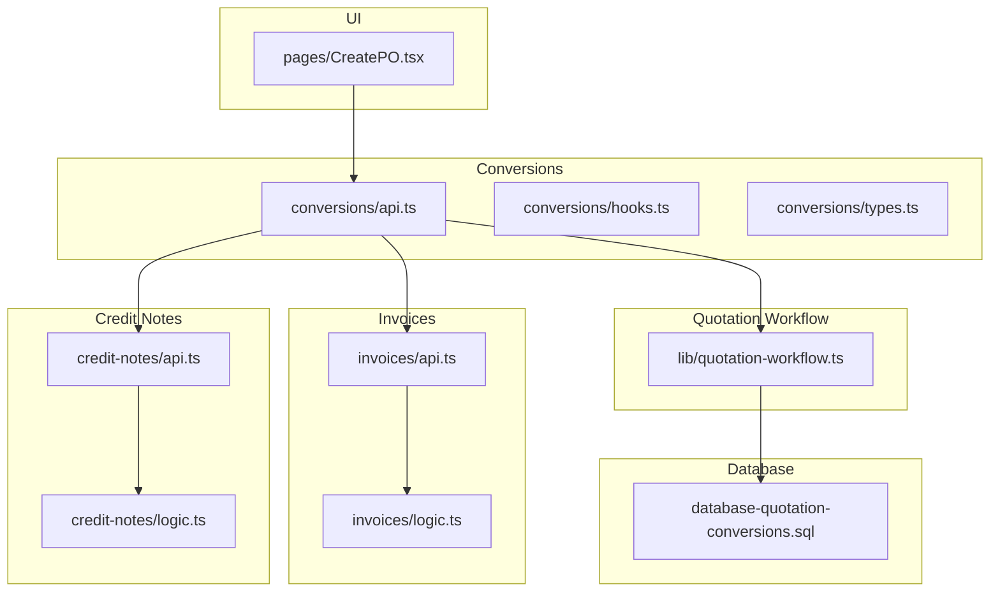
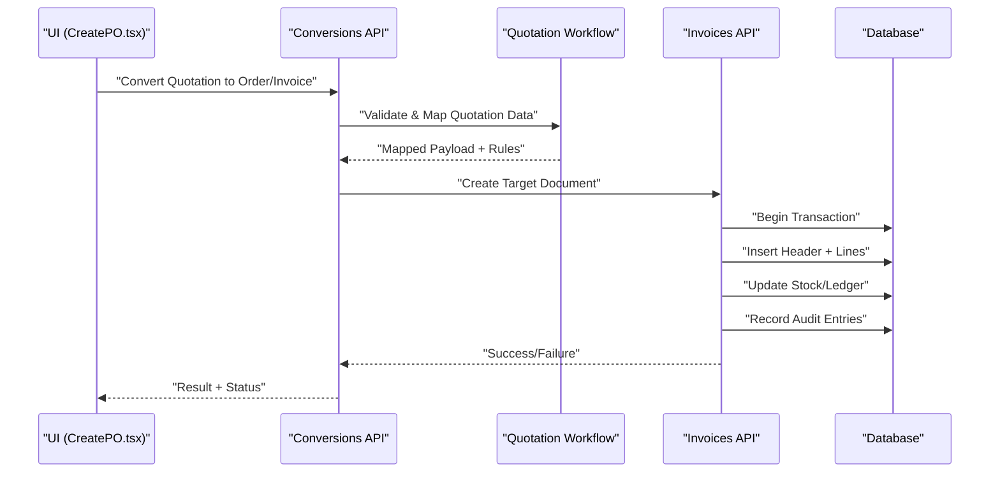
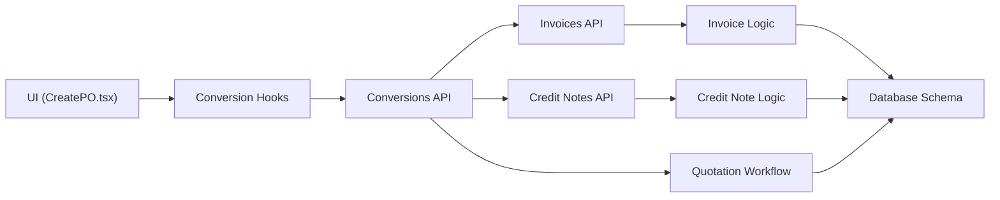

# Conversion Pipeline

<cite>
**Referenced Files in This Document**
- [src/conversions/api.ts](file://src/conversions/api.ts)
- [src/conversions/hooks.ts](file://src/conversions/hooks.ts)
- [src/conversions/types.ts](file://src/conversions/types.ts)
- [src/lib/quotation-workflow.ts](file://src/lib/quotation-workflow.ts)
- [src/invoices/api.ts](file://src/invoices/api.ts)
- [src/invoices/logic.ts](file://src/invoices/logic.ts)
- [src/credit-notes/api.ts](file://src/credit-notes/api.ts)
- [src/credit-notes/logic.ts](file://src/credit-notes/logic.ts)
- [src/pages/CreatePO.tsx](file://src/pages/CreatePO.tsx)
- [src/database/database-quotation-conversions.sql](file://src/database/database-quotation-conversions.sql)
</cite>

## Table of Contents
1. [Introduction](#introduction)
2. [Project Structure](#project-structure)
3. [Core Components](#core-components)
4. [Architecture Overview](#architecture-overview)
5. [Detailed Component Analysis](#detailed-component-analysis)
6. [Dependency Analysis](#dependency-analysis)
7. [Performance Considerations](#performance-considerations)
8. [Troubleshooting Guide](#troubleshooting-guide)
9. [Conclusion](#conclusion)
10. [Appendices](#appendices)

## Introduction
This document explains the Conversion Pipeline that transforms quotations into orders, invoices, and credit notes. It covers end-to-end workflows, data transformation rules, API endpoints, type definitions, hook implementations, audit trail maintenance, and extensibility patterns for adding new document types or customizing conversion logic. It also addresses data integrity constraints, rollback mechanisms, and performance optimization for bulk conversions.

## Project Structure
The Conversion Pipeline is implemented across several modules:
- Conversions module: shared types, hooks, and API utilities for conversion operations
- Quotation workflow library: business rules and mapping logic for quotation-driven conversions
- Invoices module: invoice creation from quotations/orders with validation and stock handling
- Credit Notes module: credit note generation and reversal flows
- Database schema: tables and constraints supporting quotation conversions and audit trails
- UI entry points: pages such as CreatePO to initiate purchase order creation from quotations

**Diagram sources**
- [src/conversions/api.ts](file://src/conversions/api.ts)
- [src/conversions/hooks.ts](file://src/conversions/hooks.ts)
- [src/conversions/types.ts](file://src/conversions/types.ts)
- [src/lib/quotation-workflow.ts](file://src/lib/quotation-workflow.ts)
- [src/invoices/api.ts](file://src/invoices/api.ts)
- [src/invoices/logic.ts](file://src/invoices/logic.ts)
- [src/credit-notes/api.ts](file://src/credit-notes/api.ts)
- [src/credit-notes/logic.ts](file://src/credit-notes/logic.ts)
- [src/database/database-quotation-conversions.sql](file://src/database/database-quotation-conversions.sql)
- [src/pages/CreatePO.tsx](file://src/pages/CreatePO.tsx)

**Section sources**
- [src/conversions/api.ts](file://src/conversions/api.ts)
- [src/conversions/hooks.ts](file://src/conversions/hooks.ts)
- [src/conversions/types.ts](file://src/conversions/types.ts)
- [src/lib/quotation-workflow.ts](file://src/lib/quotation-workflow.ts)
- [src/invoices/api.ts](file://src/invoices/api.ts)
- [src/invoices/logic.ts](file://src/invoices/logic.ts)
- [src/credit-notes/api.ts](file://src/credit-notes/api.ts)
- [src/credit-notes/logic.ts](file://src/credit-notes/logic.ts)
- [src/database/database-quotation-conversions.sql](file://src/database/database-quotation-conversions.sql)
- [src/pages/CreatePO.tsx](file://src/pages/CreatePO.tsx)

## Core Components
- Conversion Types: Centralized type definitions for quotation items, target documents (orders/invoices), and conversion metadata
- Conversion Hooks: React hooks encapsulating state, validation, and mutation calls for conversion workflows
- Conversion API: Endpoints and helpers for initiating conversions, creating target documents, and managing lifecycle events
- Quotation Workflow: Business rule engine for mapping quotation data to target schemas, enforcing validations, and generating audit entries
- Invoice Logic: Validation, pricing/tax calculations, stock deduction, and invoice creation
- Credit Note Logic: Reversal rules, partial/full credit processing, and linkage to original invoices
- Database Schema: Tables and constraints ensuring referential integrity and auditability

Key responsibilities:
- Data mapping between quotation lines and target document lines
- Enforcing business rules (e.g., availability, pricing consistency, tax alignment)
- Maintaining audit trails for all conversion actions
- Providing hooks for UI integration and error handling
- Supporting bulk operations with transactional guarantees

**Section sources**
- [src/conversions/types.ts](file://src/conversions/types.ts)
- [src/conversions/hooks.ts](file://src/conversions/hooks.ts)
- [src/conversions/api.ts](file://src/conversions/api.ts)
- [src/lib/quotation-workflow.ts](file://src/lib/quotation-workflow.ts)
- [src/invoices/logic.ts](file://src/invoices/logic.ts)
- [src/credit-notes/logic.ts](file://src/credit-notes/logic.ts)
- [src/database/database-quotation-conversions.sql](file://src/database/database-quotation-conversions.sql)

## Architecture Overview
The Conversion Pipeline orchestrates a sequence of steps:
1. User initiates conversion from a quotation via UI
2. Conversion API validates inputs and invokes workflow rules
3. Data mapping transforms quotation items into target document structures
4. Target document creation occurs within a transaction
5. Audit entries are recorded for traceability
6. Post-processing updates related entities (stock, ledgers, series numbers)

**Diagram sources**
- [src/pages/CreatePO.tsx](file://src/pages/CreatePO.tsx)
- [src/conversions/api.ts](file://src/conversions/api.ts)
- [src/lib/quotation-workflow.ts](file://src/lib/quotation-workflow.ts)
- [src/invoices/api.ts](file://src/invoices/api.ts)
- [src/database/database-quotation-conversions.sql](file://src/database/database-quotation-conversions.sql)

## Detailed Component Analysis

### Conversion Types and Data Models
Centralized type definitions ensure consistent data shapes across the pipeline:
- Quotation item model: identifiers, quantities, rates, taxes, discounts, line-level metadata
- Target document models: order/invoice headers and lines, currency, tax totals, status
- Conversion metadata: source IDs, timestamps, user context, audit flags

Complexity considerations:
- Mapping functions should be O(n) over quotation lines
- Aggregations for totals must avoid redundant recalculations
- Type guards prevent invalid payloads from entering downstream stages

**Section sources**
- [src/conversions/types.ts](file://src/conversions/types.ts)

### Conversion Hooks
Hooks encapsulate:
- State management for conversion progress and errors
- Validation callbacks before submission
- Mutation wrappers around API calls
- Retry and rollback strategies on failure

Usage patterns:
- Use hooks in forms to trigger conversions
- Handle success/failure states to update UI
- Integrate audit logging via hook callbacks

**Section sources**
- [src/conversions/hooks.ts](file://src/conversions/hooks.ts)

### Conversion API Endpoints
Endpoints exposed by the conversions API:
- Convert quotation to order: validates input, maps data, creates order header and lines
- Convert quotation to invoice: applies invoicing rules, calculates totals, records stock deductions
- Bulk convert: processes multiple quotations atomically with transactional boundaries
- Status and audit queries: retrieve conversion results and audit logs

Error handling:
- Input validation errors return structured messages
- Business rule violations halt conversion and log details
- Partial failures trigger rollback and notify caller

**Section sources**
- [src/conversions/api.ts](file://src/conversions/api.ts)

### Quotation Workflow Engine
The workflow engine enforces business rules and performs data mapping:
- Validates quotation status and eligibility for conversion
- Applies pricing and tax rules consistently
- Maps quotation lines to target document lines with transformations
- Generates audit entries for each step

Optimization opportunities:
- Cache frequently accessed reference data (tax rates, discount profiles)
- Batch database writes to reduce round-trips
- Defer non-critical computations until after successful persistence

**Section sources**
- [src/lib/quotation-workflow.ts](file://src/lib/quotation-workflow.ts)

### Invoice Generation
Invoice creation involves:
- Validating mapped payload against invoice schema
- Calculating totals, taxes, and discounts
- Deducting stock for available items
- Recording ledger entries and audit trails

Validation rules:
- Ensure referenced items exist and are active
- Verify customer and warehouse assignments
- Confirm payment terms and currency consistency

Stock handling:
- Reserve or deduct inventory based on policy
- Handle backorders and partial fulfillment scenarios

**Section sources**
- [src/invoices/api.ts](file://src/invoices/api.ts)
- [src/invoices/logic.ts](file://src/invoices/logic.ts)

### Credit Note Processing
Credit note logic supports:
- Full or partial reversals of invoices
- Linkage to original invoice for traceability
- Adjustments to stock and ledger balances
- Audit logging for compliance

Processing flow:
- Validate credit reason and amount limits
- Generate credit note header and lines
- Update financial records and issue notifications

**Section sources**
- [src/credit-notes/api.ts](file://src/credit-notes/api.ts)
- [src/credit-notes/logic.ts](file://src/credit-notes/logic.ts)

### Purchase Order Creation from Quotations
The UI page for creating purchase orders integrates with the conversion API:
- Presents quotation selection and preview
- Initiates conversion to purchase order
- Displays success/failure feedback and audit links

Implementation highlights:
- Uses conversion hooks for state and mutations
- Calls conversion API with validated payload
- Handles errors and retries gracefully

**Section sources**
- [src/pages/CreatePO.tsx](file://src/pages/CreatePO.tsx)
- [src/conversions/api.ts](file://src/conversions/api.ts)

### Database Schema and Constraints
The quotation conversions schema ensures:
- Referential integrity between quotation and target documents
- Audit fields for tracking changes and users
- Indexes for performance on common queries

Constraints:
- Unique series numbers per document type
- Foreign keys linking lines to headers and references
- Check constraints for valid statuses and amounts

**Section sources**
- [src/database/database-quotation-conversions.sql](file://src/database/database-quotation-conversions.sql)

## Dependency Analysis
The Conversion Pipeline has clear layering and dependencies:
- UI depends on conversion hooks and API
- Conversion API depends on workflow engine and target APIs
- Target APIs depend on database schema and business logic modules

Potential circular dependencies:
- Avoid direct imports between invoice and credit note modules; use shared types and services
- Keep workflow engine free of UI-specific code

External integrations:
- Database transactions for atomicity
- Audit logging subsystem for compliance
- Notification services for status updates

**Diagram sources**
- [src/pages/CreatePO.tsx](file://src/pages/CreatePO.tsx)
- [src/conversions/hooks.ts](file://src/conversions/hooks.ts)
- [src/conversions/api.ts](file://src/conversions/api.ts)
- [src/lib/quotation-workflow.ts](file://src/lib/quotation-workflow.ts)
- [src/invoices/api.ts](file://src/invoices/api.ts)
- [src/invoices/logic.ts](file://src/invoices/logic.ts)
- [src/credit-notes/api.ts](file://src/credit-notes/api.ts)
- [src/credit-notes/logic.ts](file://src/credit-notes/logic.ts)
- [src/database/database-quotation-conversions.sql](file://src/database/database-quotation-conversions.sql)

**Section sources**
- [src/conversions/api.ts](file://src/conversions/api.ts)
- [src/conversions/hooks.ts](file://src/conversions/hooks.ts)
- [src/lib/quotation-workflow.ts](file://src/lib/quotation-workflow.ts)
- [src/invoices/api.ts](file://src/invoices/api.ts)
- [src/invoices/logic.ts](file://src/invoices/logic.ts)
- [src/credit-notes/api.ts](file://src/credit-notes/api.ts)
- [src/credit-notes/logic.ts](file://src/credit-notes/logic.ts)
- [src/database/database-quotation-conversions.sql](file://src/database/database-quotation-conversions.sql)

## Performance Considerations
- Batch operations: Group multiple conversions into single transactions to reduce overhead
- Lazy loading: Load only necessary quotation data for conversion previews
- Caching: Cache reference data like tax rates and discount profiles
- Indexing: Ensure proper indexes on foreign keys and frequently queried columns
- Async processing: Offload heavy computations to background jobs when possible
- Memory management: Stream large datasets instead of loading entire payloads into memory

[No sources needed since this section provides general guidance]

## Troubleshooting Guide
Common issues and resolutions:
- Validation failures: Check input payloads against schema definitions and business rules
- Transaction rollbacks: Inspect audit logs for failed steps and underlying errors
- Stock discrepancies: Verify reservation policies and concurrent access controls
- Performance bottlenecks: Monitor query execution plans and optimize indexes

Debugging tips:
- Enable detailed logging for conversion steps
- Use audit trail queries to trace data changes
- Validate reference data consistency before conversions

**Section sources**
- [src/conversions/api.ts](file://src/conversions/api.ts)
- [src/lib/quotation-workflow.ts](file://src/lib/quotation-workflow.ts)
- [src/database/database-quotation-conversions.sql](file://src/database/database-quotation-conversions.sql)

## Conclusion
The Conversion Pipeline provides a robust, extensible framework for transforming quotations into orders, invoices, and credit notes. By centralizing types, hooks, and APIs while enforcing business rules through a dedicated workflow engine, it ensures data integrity, auditability, and performance. Extensibility patterns allow organizations to add new document types and customize conversion logic without disrupting existing flows.

[No sources needed since this section summarizes without analyzing specific files]

## Appendices

### Extending Conversion Workflows
To add support for a new document type:
- Define new types in the conversions types module
- Implement mapping logic in the quotation workflow engine
- Add API endpoints in the conversions API
- Integrate with target document creation logic
- Update UI components to expose conversion options

### Customizing Conversion Logic
Customization points:
- Hook implementations for pre/post conversion actions
- Workflow rule extensions for domain-specific validations
- Audit trail customization for compliance requirements
- Notification templates for status updates

### Data Integrity Constraints
Key constraints to maintain:
- Unique series numbering per document type
- Referential integrity between headers and lines
- Consistent currency and tax calculations
- Atomic transactions for multi-step operations

### Rollback Mechanisms
Rollback strategies:
- Transactional boundaries around all write operations
- Audit logging before and after each step
- Compensation actions for partial successes
- Error propagation to caller with detailed context

### Performance Optimization for Bulk Conversions
Best practices:
- Process conversions in batches with configurable sizes
- Use connection pooling and prepared statements
- Parallelize independent operations where safe
- Monitor and tune database queries regularly

[No sources needed since this section provides general guidance]