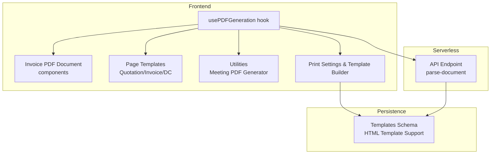
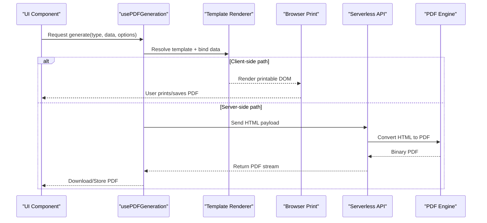
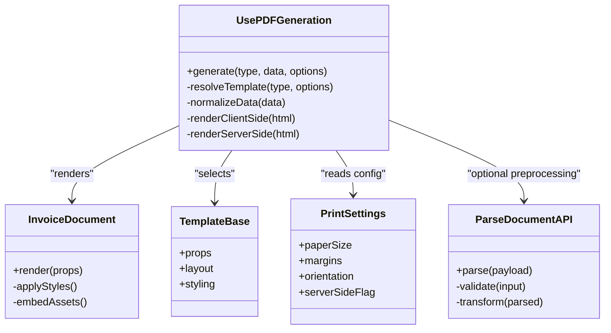

# Document Generation

<cite>
**Referenced Files in This Document**
- [usePDFGeneration.ts](file://src/hooks/usePDFGeneration.ts)
- [pdf-document.tsx](file://src/invoices/pdf-document.tsx)
- [pdf.tsx](file://src/invoices/pdf.tsx)
- [pdf-types.ts](file://src/invoices/pdf-types.ts)
- [grid-minimal-invoice-document.tsx](file://src/invoices/grid-minimal-invoice-document.tsx)
- [pro-grid-invoice-document.tsx](file://src/invoices/pro-grid-invoice-document.tsx)
- [InvoiceA4Template.tsx](file://src/pages/InvoiceA4Template.tsx)
- [ClassicQuotationTemplate.tsx](file://src/pages/ClassicQuotationTemplate.tsx)
- [ProfessionalTemplate.tsx](file://src/pages/ProfessionalTemplate.tsx)
- [QuotationTallyTemplate.tsx](file://src/pages/QuotationTallyTemplate.tsx)
- [ClassicToolsDeliveryChallanTemplate.tsx](file://src/pages/ClassicToolsDeliveryChallanTemplate.tsx)
- [meeting-pdf-generator.ts](file://src/lib/meeting-pdf-generator.ts)
- [pdf-enhancements.ts](file://src/approvals/pdf-enhancements.ts)
- [PrintSettings.tsx](file://src/pages/PrintSettings.tsx)
- [PrintTemplateBuilder.tsx](file://src/pages/PrintTemplateBuilder.tsx)
- [database-add-html-template-support.sql](file://src/database-add-html-template-support.sql)
- [database-add-professional-template.sql](file://src/database-add-professional-template.sql)
- [database-add-classic-template.sql](file://src/database-add-classic-template.sql)
- [database-add-zoho-template.sql](file://src/database-add-zoho-template.sql)
- [api/parse-document.ts](file://api/parse-document.ts)
</cite>

## Table of Contents
1. [Introduction](#introduction)
2. [Project Structure](#project-structure)
3. [Core Components](#core-components)
4. [Architecture Overview](#architecture-overview)
5. [Detailed Component Analysis](#detailed-component-analysis)
6. [Dependency Analysis](#dependency-analysis)
7. [Performance Considerations](#performance-considerations)
8. [Troubleshooting Guide](#troubleshooting-guide)
9. [Conclusion](#conclusion)
10. [Appendices](#appendices)

## Introduction
This document explains the Document Generation system with a focus on PDF generation, template rendering, and export capabilities. It covers supported document types (quotations, invoices, purchase orders, reports), formatting requirements, composition and data binding, styling and asset embedding, server-side versus client-side generation strategies, memory management, batch processing, extensibility for custom generators, cloud printing integration, performance optimization, error handling, and accessibility compliance.

## Project Structure
The document generation features are implemented primarily in the frontend React application with supporting utilities and database schema migrations for templates. Key areas include:
- Hooks and orchestration for PDF generation
- Invoice-specific PDF components and type definitions
- Reusable page-level templates for quotations, invoices, delivery challans, and professional layouts
- Utilities for meeting minutes PDF generation and approval-related enhancements
- Print settings and template builder UIs
- Database migrations that add HTML template support and predefined templates
- A serverless API endpoint for parsing documents

**Diagram sources**
- [usePDFGeneration.ts](file://src/hooks/usePDFGeneration.ts)
- [pdf-document.tsx](file://src/invoices/pdf-document.tsx)
- [pdf.tsx](file://src/invoices/pdf.tsx)
- [pdf-types.ts](file://src/invoices/pdf-types.ts)
- [InvoiceA4Template.tsx](file://src/pages/InvoiceA4Template.tsx)
- [ClassicQuotationTemplate.tsx](file://src/pages/ClassicQuotationTemplate.tsx)
- [ProfessionalTemplate.tsx](file://src/pages/ProfessionalTemplate.tsx)
- [QuotationTallyTemplate.tsx](file://src/pages/QuotationTallyTemplate.tsx)
- [ClassicToolsDeliveryChallanTemplate.tsx](file://src/pages/ClassicToolsDeliveryChallanTemplate.tsx)
- [meeting-pdf-generator.ts](file://src/lib/meeting-pdf-generator.ts)
- [PrintSettings.tsx](file://src/pages/PrintSettings.tsx)
- [PrintTemplateBuilder.tsx](file://src/pages/PrintTemplateBuilder.tsx)
- [database-add-html-template-support.sql](file://src/database-add-html-template-support.sql)
- [database-add-professional-template.sql](file://src/database-add-professional-template.sql)
- [database-add-classic-template.sql](file://src/database-add-classic-template.sql)
- [database-add-zoho-template.sql](file://src/database-add-zoho-template.sql)
- [api/parse-document.ts](file://api/parse-document.ts)

**Section sources**
- [usePDFGeneration.ts](file://src/hooks/usePDFGeneration.ts)
- [pdf-document.tsx](file://src/invoices/pdf-document.tsx)
- [pdf.tsx](file://src/invoices/pdf.tsx)
- [pdf-types.ts](file://src/invoices/pdf-types.ts)
- [InvoiceA4Template.tsx](file://src/pages/InvoiceA4Template.tsx)
- [ClassicQuotationTemplate.tsx](file://src/pages/ClassicQuotationTemplate.tsx)
- [ProfessionalTemplate.tsx](file://src/pages/ProfessionalTemplate.tsx)
- [QuotationTallyTemplate.tsx](file://src/pages/QuotationTallyTemplate.tsx)
- [ClassicToolsDeliveryChallanTemplate.tsx](file://src/pages/ClassicToolsDeliveryChallanTemplate.tsx)
- [meeting-pdf-generator.ts](file://src/lib/meeting-pdf-generator.ts)
- [PrintSettings.tsx](file://src/pages/PrintSettings.tsx)
- [PrintTemplateBuilder.tsx](file://src/pages/PrintTemplateBuilder.tsx)
- [database-add-html-template-support.sql](file://src/database-add-html-template-support.sql)
- [database-add-professional-template.sql](file://src/database-add-professional-template.sql)
- [database-add-classic-template.sql](file://src/database-add-classic-template.sql)
- [database-add-zoho-template.sql](file://src/database-add-zoho-template.sql)
- [api/parse-document.ts](file://api/parse-document.ts)

## Core Components
- PDF orchestration hook: Centralizes configuration, template selection, data preparation, and invocation of rendering/export flows.
- Invoice PDF components: Typed models and renderers for invoice documents, including grid-based minimal and pro variants.
- Page-level templates: Reusable React components for Quotation, Invoice, Delivery Challan, and Professional layouts.
- Utilities: Specialized generators such as Meeting Minutes PDF and Approval PDF enhancements.
- Print settings and template builder: UI to configure print options and manage templates.
- Serverless API: Endpoint to parse incoming documents into structured data for downstream processing.

Key responsibilities:
- Data binding: Map domain objects to template placeholders or component props.
- Styling application: Apply theme, typography, and layout styles consistently across templates.
- Asset embedding: Inline images and fonts where necessary; reference external assets via URLs when appropriate.
- Export paths: Provide both client-side browser print/PDF and server-side conversion options.

**Section sources**
- [usePDFGeneration.ts](file://src/hooks/usePDFGeneration.ts)
- [pdf-types.ts](file://src/invoices/pdf-types.ts)
- [pdf-document.tsx](file://src/invoices/pdf-document.tsx)
- [pdf.tsx](file://src/invoices/pdf.tsx)
- [grid-minimal-invoice-document.tsx](file://src/invoices/grid-minimal-invoice-document.tsx)
- [pro-grid-invoice-document.tsx](file://src/invoices/pro-grid-invoice-document.tsx)
- [InvoiceA4Template.tsx](file://src/pages/InvoiceA4Template.tsx)
- [ClassicQuotationTemplate.tsx](file://src/pages/ClassicQuotationTemplate.tsx)
- [ProfessionalTemplate.tsx](file://src/pages/ProfessionalTemplate.tsx)
- [QuotationTallyTemplate.tsx](file://src/pages/QuotationTallyTemplate.tsx)
- [ClassicToolsDeliveryChallanTemplate.tsx](file://src/pages/ClassicToolsDeliveryChallanTemplate.tsx)
- [meeting-pdf-generator.ts](file://src/lib/meeting-pdf-generator.ts)
- [pdf-enhancements.ts](file://src/approvals/pdf-enhancements.ts)
- [PrintSettings.tsx](file://src/pages/PrintSettings.tsx)
- [PrintTemplateBuilder.tsx](file://src/pages/PrintTemplateBuilder.tsx)
- [api/parse-document.ts](file://api/parse-document.ts)

## Architecture Overview
The system supports two primary generation strategies:
- Client-side generation: Uses the browser’s print-to-PDF capability by rendering React templates into a printable DOM and invoking window.print() or equivalent APIs.
- Server-side generation: Converts HTML to PDF using a headless browser or PDF engine invoked from a serverless function or backend service.

**Diagram sources**
- [usePDFGeneration.ts](file://src/hooks/usePDFGeneration.ts)
- [InvoiceA4Template.tsx](file://src/pages/InvoiceA4Template.tsx)
- [ClassicQuotationTemplate.tsx](file://src/pages/ClassicQuotationTemplate.tsx)
- [api/parse-document.ts](file://api/parse-document.ts)

## Detailed Component Analysis

### PDF Orchestration Hook
Responsibilities:
- Select template based on document type and user preferences.
- Prepare and normalize input data for consistent binding.
- Choose client-side vs server-side pipeline based on environment and options.
- Manage progress, errors, and cancellation signals.
- Coordinate asset loading and caching for images/fonts.

Implementation highlights:
- Configuration object includes template ID, output format, and flags for server-side rendering.
- Data normalization ensures required fields exist before rendering.
- Error boundaries capture rendering failures and provide fallbacks.

**Section sources**
- [usePDFGeneration.ts](file://src/hooks/usePDFGeneration.ts)

### Invoice PDF Components
Types and contracts:
- Strongly typed interfaces define invoice headers, line items, totals, taxes, and metadata.
- Minimal and pro grid variants offer different visual densities and feature sets.

Rendering flow:
- The renderer composes header/footer sections, item tables, and summary blocks.
- Styles are applied via CSS classes and inline styles for precise control.
- Images (logos, stamps) are embedded or referenced via URLs.

Extensibility:
- New invoice layouts can be added by implementing a new document component conforming to the shared types.

**Section sources**
- [pdf-types.ts](file://src/invoices/pdf-types.ts)
- [pdf-document.tsx](file://src/invoices/pdf-document.tsx)
- [pdf.tsx](file://src/invoices/pdf.tsx)
- [grid-minimal-invoice-document.tsx](file://src/invoices/grid-minimal-invoice-document.tsx)
- [pro-grid-invoice-document.tsx](file://src/invoices/pro-grid-invoice-document.tsx)

### Page-Level Templates
Supported document types and typical formatting requirements:
- Quotations: Company branding, quotation number/date, validity period, terms, itemized pricing, tax breakdown, signatures.
- Invoices: Invoice number/date, due date, billing/shipping addresses, payment terms, line items, taxes, totals, bank details.
- Purchase Orders: PO number/date, vendor details, delivery instructions, item specs, quantities, prices, acceptance clauses.
- Reports: Title, date range, filters, tabular data, charts/images, footnotes.

Available templates:
- Classic Quotation Template
- Professional Template
- Invoice A4 Template
- Quotation Tally Template
- Classic Tools Delivery Challan Template

These templates encapsulate layout, typography, spacing, and content sections. They accept normalized data and apply consistent styling.

**Section sources**
- [ClassicQuotationTemplate.tsx](file://src/pages/ClassicQuotationTemplate.tsx)
- [ProfessionalTemplate.tsx](file://src/pages/ProfessionalTemplate.tsx)
- [InvoiceA4Template.tsx](file://src/pages/InvoiceA4Template.tsx)
- [QuotationTallyTemplate.tsx](file://src/pages/QuotationTallyTemplate.tsx)
- [ClassicToolsDeliveryChallanTemplate.tsx](file://src/pages/ClassicToolsDeliveryChallanTemplate.tsx)

### Utilities and Enhancements
- Meeting Minutes PDF generator: Produces structured minutes with attendees, decisions, and action items.
- Approval PDF enhancements: Adds approval metadata, timestamps, and signatory blocks to generated documents.

**Section sources**
- [meeting-pdf-generator.ts](file://src/lib/meeting-pdf-generator.ts)
- [pdf-enhancements.ts](file://src/approvals/pdf-enhancements.ts)

### Print Settings and Template Builder
- Print Settings: Configure default paper size, margins, orientation, and whether to use server-side rendering.
- Template Builder: Visual editor to create or modify HTML/CSS templates, preview outputs, and publish versions.

Integration points:
- Persisted templates are stored via database schema additions for HTML template support and predefined templates.

**Section sources**
- [PrintSettings.tsx](file://src/pages/PrintSettings.tsx)
- [PrintTemplateBuilder.tsx](file://src/pages/PrintTemplateBuilder.tsx)
- [database-add-html-template-support.sql](file://src/database-add-html-template-support.sql)
- [database-add-professional-template.sql](file://src/database-add-professional-template.sql)
- [database-add-classic-template.sql](file://src/database-add-classic-template.sql)
- [database-add-zoho-template.sql](file://src/database-add-zoho-template.sql)

### Serverless Parsing Endpoint
Purpose:
- Accept raw document payloads (e.g., CSV, JSON, or HTML fragments).
- Validate and transform inputs into normalized structures consumable by templates.
- Return parsed results or errors for upstream consumers.

Usage patterns:
- Import parsers for specific formats.
- Integrate with UI flows to allow users to upload and convert documents into standard formats before generation.

**Section sources**
- [api/parse-document.ts](file://api/parse-document.ts)

## Dependency Analysis
High-level relationships among core modules:

**Diagram sources**
- [usePDFGeneration.ts](file://src/hooks/usePDFGeneration.ts)
- [pdf-document.tsx](file://src/invoices/pdf-document.tsx)
- [pdf.tsx](file://src/invoices/pdf.tsx)
- [pdf-types.ts](file://src/invoices/pdf-types.ts)
- [PrintSettings.tsx](file://src/pages/PrintSettings.tsx)
- [api/parse-document.ts](file://api/parse-document.ts)

**Section sources**
- [usePDFGeneration.ts](file://src/hooks/usePDFGeneration.ts)
- [pdf-document.tsx](file://src/invoices/pdf-document.tsx)
- [pdf.tsx](file://src/invoices/pdf.tsx)
- [pdf-types.ts](file://src/invoices/pdf-types.ts)
- [PrintSettings.tsx](file://src/pages/PrintSettings.tsx)
- [api/parse-document.ts](file://api/parse-document.ts)

## Performance Considerations
- Prefer server-side rendering for large documents to offload heavy DOM operations from the browser.
- Defer image loading and lazy-load assets within templates to reduce initial render time.
- Cache frequently used templates and precompiled assets to avoid repeated fetches.
- Use pagination or chunking for very long lists in report templates.
- Minimize CSS complexity and avoid expensive layout thrashing during print.
- For batch processing, queue jobs and process them asynchronously to prevent UI blocking.

[No sources needed since this section provides general guidance]

## Troubleshooting Guide
Common issues and resolutions:
- Missing required fields: Ensure data normalization validates all mandatory properties before rendering.
- Image not found: Verify asset URLs are accessible and CORS is configured if cross-origin.
- Print layout breaks: Adjust CSS print media rules and test across browsers.
- Server-side conversion failures: Check network timeouts, available memory, and PDF engine logs.
- Accessibility problems: Add semantic headings, alt text for images, and proper table captions.

Operational checks:
- Confirm template IDs match persisted versions.
- Validate print settings (paper size, margins) align with target printers.
- Inspect API responses from the parsing endpoint for malformed payloads.

**Section sources**
- [usePDFGeneration.ts](file://src/hooks/usePDFGeneration.ts)
- [PrintSettings.tsx](file://src/pages/PrintSettings.tsx)
- [api/parse-document.ts](file://api/parse-document.ts)

## Conclusion
The Document Generation system combines flexible React-based templates with robust orchestration to support multiple document types and export strategies. By separating concerns between data binding, styling, and rendering, it enables easy extension and maintenance. Adopting server-side rendering for heavy workloads, optimizing assets, and ensuring accessibility yields reliable, high-quality PDF outputs suitable for business workflows.

[No sources needed since this section summarizes without analyzing specific files]

## Appendices

### Supported Document Types and Formatting Requirements
- Quotations: Include quotation identifiers, dates, validity, terms, itemized pricing, taxes, and signature blocks.
- Invoices: Include invoice identifiers, billing/shipping info, payment terms, line items, taxes, totals, and banking details.
- Purchase Orders: Include PO identifiers, vendor information, delivery instructions, specifications, quantities, prices, and acceptance clauses.
- Reports: Include titles, date ranges, filters, tabular data, optional charts/images, and footnotes.

[No sources needed since this section provides general guidance]

### Creating Custom Document Generators
Steps:
- Define a new template component conforming to shared types and layout conventions.
- Register the template with the generator hook under a unique ID.
- Implement any specialized data normalization or asset embedding logic.
- Test with sample datasets and validate print output across devices.

**Section sources**
- [pdf-types.ts](file://src/invoices/pdf-types.ts)
- [usePDFGeneration.ts](file://src/hooks/usePDFGeneration.ts)
- [InvoiceA4Template.tsx](file://src/pages/InvoiceA4Template.tsx)

### Extending Existing Templates
Approaches:
- Fork an existing template and override specific sections (header, footer, totals).
- Use composition to inject additional rows or columns into item tables.
- Maintain versioned templates via the template builder and persist changes through the schema.

**Section sources**
- [PrintTemplateBuilder.tsx](file://src/pages/PrintTemplateBuilder.tsx)
- [database-add-html-template-support.sql](file://src/database-add-html-template-support.sql)

### Integrating with Cloud Printing Services
Options:
- Use the serverless API to send HTML to a cloud PDF service (e.g., AWS Lambda + Puppeteer, Google Cloud Functions + Chromium).
- Stream the resulting PDF back to the client for download or store in a bucket and share via URL.
- Handle retries and exponential backoff for transient failures.

[No sources needed since this section provides general guidance]

### Memory Management and Batch Processing
Guidelines:
- Release references to large DOM trees after export.
- Process batches sequentially or with limited concurrency to cap memory usage.
- Monitor heap usage and adjust worker pools accordingly.

[No sources needed since this section provides general guidance]

### Accessibility Compliance
Recommendations:
- Use semantic HTML elements (headings, lists, tables with captions).
- Provide alt text for images and descriptive labels for controls.
- Ensure sufficient color contrast and keyboard navigability for interactive previews.
- Validate PDF tags and structure when generating server-side.

[No sources needed since this section provides general guidance]