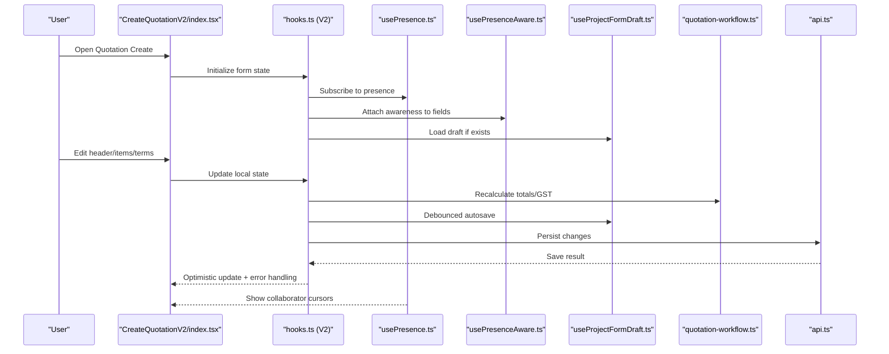
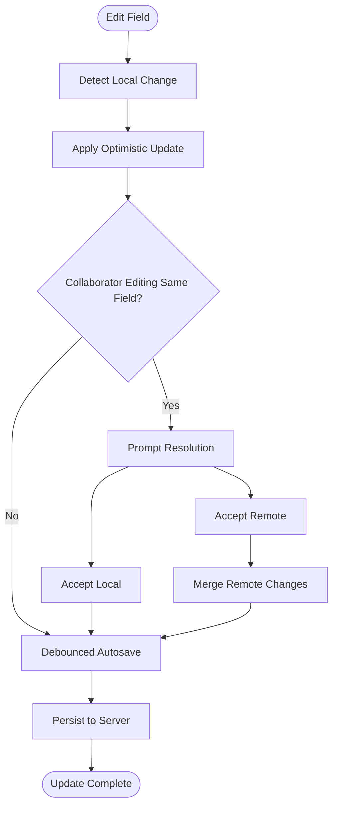
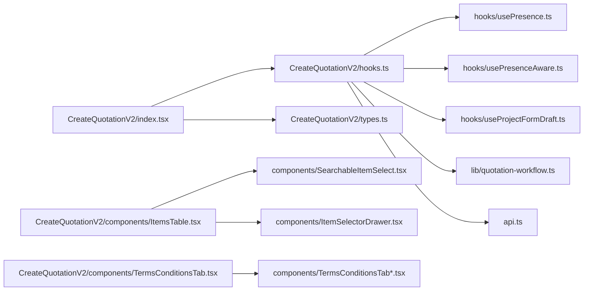

# Quotation Creation

<cite>
**Referenced Files in This Document**
- [CreateQuotation.tsx](file://src/pages/CreateQuotation.tsx)
- [CreateQuotationV2.tsx](file://src/pages/CreateQuotationV2.tsx)
- [CreateQuotation/index.tsx](file://src/pages/CreateQuotation/index.tsx)
- [CreateQuotationV2/index.tsx](file://src/pages/CreateQuotationV2/index.tsx)
- [CreateQuotation/types.ts](file://src/pages/CreateQuotation/types.ts)
- [CreateQuotationV2/types.ts](file://src/pages/CreateQuotationV2/types.ts)
- [CreateQuotation/hooks.ts](file://src/pages/CreateQuotation/hooks.ts)
- [CreateQuotationV2/hooks.ts](file://src/pages/CreateQuotationV2/hooks.ts)
- [CreateQuotation/components/QuotationHeaderForm.tsx](file://src/pages/CreateQuotation/components/QuotationHeaderForm.tsx)
- [CreateQuotationV2/components/QuotationHeaderForm.tsx](file://src/pages/CreateQuotationV2/components/QuotationHeaderForm.tsx)
- [CreateQuotation/components/ItemsTable.tsx](file://src/pages/CreateQuotation/components/ItemsTable.tsx)
- [CreateQuotationV2/components/ItemsTable.tsx](file://src/pages/CreateQuotationV2/components/ItemsTable.tsx)
- [CreateQuotation/components/ItemSelectorDrawer.tsx](file://src/pages/CreateQuotation/components/ItemSelectorDrawer.tsx)
- [CreateQuotationV2/components/ItemSelectorDrawer.tsx](file://src/pages/CreateQuotationV2/components/ItemSelectorDrawer.tsx)
- [CreateQuotation/components/TermsConditionsTab.tsx](file://src/pages/CreateQuotation/components/TermsConditionsTab.tsx)
- [CreateQuotationV2/components/TermsConditionsTab.tsx](file://src/pages/CreateQuotationV2/components/TermsConditionsTab.tsx)
- [hooks/usePresence.ts](file://src/hooks/usePresence.ts)
- [hooks/usePresenceAware.ts](file://src/hooks/usePresenceAware.ts)
- [hooks/useDebounce.ts](file://src/hooks/useDebounce.ts)
- [hooks/useProjectFormDraft.ts](file://src/hooks/useProjectFormDraft.ts)
- [lib/quotation-workflow.ts](file://src/lib/quotation-workflow.ts)
- [components/SearchableItemSelect.tsx](file://src/components/SearchableItemSelect.tsx)
- [components/ItemSelectorDrawer.tsx](file://src/components/ItemSelectorDrawer.tsx)
- [components/TermsConditionsTab.tsx](file://src/components/TermsConditionsTab.tsx)
- [components/TermsConditionsTabSafe.tsx](file://src/components/TermsConditionsTabSafe.tsx)
- [components/TermsConditionsTabSimple.tsx](file://src/components/TermsConditionsTabSimple.tsx)
- [api.ts](file://src/api.ts)
- [database-quotation.sql](file://src/database-quotation.sql)
- [database-add-organisation-id-quotation-header.sql](file://src/database-add-organisation-id-quotation-header.sql)
- [database-add-subtotal.sql](file://src/database-add-subtotal.sql)
- [database-add-hsn-tax.sql](file://src/database-add-hsn-tax.sql)
- [database-add-client-discount-profile.sql](file://src/database-add-client-discount-profile.sql)
</cite>

## Table of Contents
1. [Introduction](#introduction)
2. [Project Structure](#project-structure)
3. [Core Components](#core-components)
4. [Architecture Overview](#architecture-overview)
5. [Detailed Component Analysis](#detailed-component-analysis)
6. [Dependency Analysis](#dependency-analysis)
7. [Performance Considerations](#performance-considerations)
8. [Troubleshooting Guide](#troubleshooting-guide)
9. [Conclusion](#conclusion)
10. [Appendices](#appendices)

## Introduction
This document explains the Quotation Creation system, focusing on the dynamic quotation building interface, item selection and pricing logic, real-time calculations, autosave behavior, header form configuration, items table operations, presence awareness for concurrent editing, and conflict resolution strategies. It also provides guidance for customization, integration with inventory systems, performance optimization for large quotations, data validation strategies, and mobile responsiveness considerations.

## Project Structure
The Quotation Creation feature is implemented across two primary pages: a legacy page and a modernized V2 page. Each page encapsulates its own types, hooks, and components to support independent evolution. Shared UI primitives and utilities are reused from common component directories.

```mermaid
graph TB
subgraph "Pages"
A["pages/CreateQuotation.tsx"]
B["pages/CreateQuotationV2.tsx"]
C["pages/CreateQuotation/index.tsx"]
D["pages/CreateQuotationV2/index.tsx"]
end
subgraph "CreateQuotation Module"
E["types.ts"]
F["hooks.ts"]
G["components/QuotationHeaderForm.tsx"]
H["components/ItemsTable.tsx"]
I["components/ItemSelectorDrawer.tsx"]
J["components/TermsConditionsTab.tsx"]
end
subgraph "CreateQuotationV2 Module"
K["types.ts"]
L["hooks.ts"]
M["components/QuotationHeaderForm.tsx"]
N["components/ItemsTable.tsx"]
O["components/ItemSelectorDrawer.tsx"]
P["components/TermsConditionsTab.tsx"]
end
subgraph "Shared"
Q["components/SearchableItemSelect.tsx"]
R["components/ItemSelectorDrawer.tsx"]
S["components/TermsConditionsTab*.tsx"]
T["hooks/usePresence.ts"]
U["hooks/usePresenceAware.ts"]
V["hooks/useDebounce.ts"]
W["hooks/useProjectFormDraft.ts"]
X["lib/quotation-workflow.ts"]
Y["api.ts"]
end
A --> C
B --> D
C --> E
C --> F
C --> G
C --> H
C --> I
C --> J
D --> K
D --> L
D --> M
D --> N
D --> O
D --> P
H --> Q
N --> Q
I --> R
O --> R
G --> S
M --> S
F --> T
L --> T
F --> U
L --> U
F --> V
L --> V
F --> W
L --> W
F --> X
L --> X
F --> Y
L --> Y
```

**Diagram sources**
- [CreateQuotation.tsx](file://src/pages/CreateQuotation.tsx)
- [CreateQuotationV2.tsx](file://src/pages/CreateQuotationV2.tsx)
- [CreateQuotation/index.tsx](file://src/pages/CreateQuotation/index.tsx)
- [CreateQuotationV2/index.tsx](file://src/pages/CreateQuotationV2/index.tsx)
- [CreateQuotation/types.ts](file://src/pages/CreateQuotation/types.ts)
- [CreateQuotationV2/types.ts](file://src/pages/CreateQuotationV2/types.ts)
- [CreateQuotation/hooks.ts](file://src/pages/CreateQuotation/hooks.ts)
- [CreateQuotationV2/hooks.ts](file://src/pages/CreateQuotationV2/hooks.ts)
- [CreateQuotation/components/QuotationHeaderForm.tsx](file://src/pages/CreateQuotation/components/QuotationHeaderForm.tsx)
- [CreateQuotationV2/components/QuotationHeaderForm.tsx](file://src/pages/CreateQuotationV2/components/QuotationHeaderForm.tsx)
- [CreateQuotation/components/ItemsTable.tsx](file://src/pages/CreateQuotation/components/ItemsTable.tsx)
- [CreateQuotationV2/components/ItemsTable.tsx](file://src/pages/CreateQuotationV2/components/ItemsTable.tsx)
- [CreateQuotation/components/ItemSelectorDrawer.tsx](file://src/pages/CreateQuotation/components/ItemSelectorDrawer.tsx)
- [CreateQuotationV2/components/ItemSelectorDrawer.tsx](file://src/pages/CreateQuotationV2/components/ItemSelectorDrawer.tsx)
- [CreateQuotation/components/TermsConditionsTab.tsx](file://src/pages/CreateQuotation/components/TermsConditionsTab.tsx)
- [CreateQuotationV2/components/TermsConditionsTab.tsx](file://src/pages/CreateQuotationV2/components/TermsConditionsTab.tsx)
- [hooks/usePresence.ts](file://src/hooks/usePresence.ts)
- [hooks/usePresenceAware.ts](file://src/hooks/usePresenceAware.ts)
- [hooks/useDebounce.ts](file://src/hooks/useDebounce.ts)
- [hooks/useProjectFormDraft.ts](file://src/hooks/useProjectFormDraft.ts)
- [lib/quotation-workflow.ts](file://src/lib/quotation-workflow.ts)
- [components/SearchableItemSelect.tsx](file://src/components/SearchableItemSelect.tsx)
- [components/ItemSelectorDrawer.tsx](file://src/components/ItemSelectorDrawer.tsx)
- [components/TermsConditionsTab.tsx](file://src/components/TermsConditionsTab.tsx)
- [components/TermsConditionsTabSafe.tsx](file://src/components/TermsConditionsTabSafe.tsx)
- [components/TermsConditionsTabSimple.tsx](file://src/components/TermsConditionsTabSimple.tsx)
- [api.ts](file://src/api.ts)

**Section sources**
- [CreateQuotation.tsx](file://src/pages/CreateQuotation.tsx)
- [CreateQuotationV2.tsx](file://src/pages/CreateQuotationV2.tsx)
- [CreateQuotation/index.tsx](file://src/pages/CreateQuotation/index.tsx)
- [CreateQuotationV2/index.tsx](file://src/pages/CreateQuotationV2/index.tsx)

## Core Components
- Dynamic Quotation Builder: The main page orchestrates state, persistence, and rendering of header, items, and terms sections. It integrates presence awareness and autosave via shared hooks.
- Header Form: Captures client details, project information, and terms configuration. It supports validation and debounced persistence.
- Items Table: Manages material selection, quantity updates, pricing, discounts, and GST computations. It uses search/select drawers and reusable item selectors.
- Terms Tab: Provides editable terms and conditions content with safe rendering options.

Key responsibilities:
- State management for header fields, line items, totals, and tax breakdowns.
- Real-time recalculation when quantities, rates, or discounts change.
- Autosave with optimistic updates and conflict handling.
- Presence indicators for collaborators editing the same quotation.

**Section sources**
- [CreateQuotation/index.tsx](file://src/pages/CreateQuotation/index.tsx)
- [CreateQuotationV2/index.tsx](file://src/pages/CreateQuotationV2/index.tsx)
- [CreateQuotation/components/QuotationHeaderForm.tsx](file://src/pages/CreateQuotation/components/QuotationHeaderForm.tsx)
- [CreateQuotationV2/components/QuotationHeaderForm.tsx](file://src/pages/CreateQuotationV2/components/QuotationHeaderForm.tsx)
- [CreateQuotation/components/ItemsTable.tsx](file://src/pages/CreateQuotation/components/ItemsTable.tsx)
- [CreateQuotationV2/components/ItemsTable.tsx](file://src/pages/CreateQuotationV2/components/ItemsTable.tsx)
- [CreateQuotation/components/TermsConditionsTab.tsx](file://src/pages/CreateQuotation/components/TermsConditionsTab.tsx)
- [CreateQuotationV2/components/TermsConditionsTab.tsx](file://src/pages/CreateQuotationV2/components/TermsConditionsTab.tsx)

## Architecture Overview
The Quotation Creation flow combines UI components with shared hooks for presence, autosave, and workflow orchestration. Data persists to the backend via API calls, while local state drives real-time calculations.

**Diagram sources**
- [CreateQuotationV2/index.tsx](file://src/pages/CreateQuotationV2/index.tsx)
- [CreateQuotationV2/hooks.ts](file://src/pages/CreateQuotationV2/hooks.ts)
- [hooks/usePresence.ts](file://src/hooks/usePresence.ts)
- [hooks/usePresenceAware.ts](file://src/hooks/usePresenceAware.ts)
- [hooks/useProjectFormDraft.ts](file://src/hooks/useProjectFormDraft.ts)
- [lib/quotation-workflow.ts](file://src/lib/quotation-workflow.ts)
- [api.ts](file://src/api.ts)

## Detailed Component Analysis

### Header Form: Client Details, Project Info, Terms Configuration
Responsibilities:
- Capture client selection and contact info.
- Capture project metadata and identifiers.
- Configure terms and conditions references.
- Validate required fields and provide user feedback.
- Integrate with autosave and presence-aware editing.

Implementation highlights:
- Uses controlled inputs bound to form state.
- Debounces writes to reduce server load.
- Displays presence indicators for active collaborators.
- Supports conditional fields based on organization settings.

Customization examples:
- Add new header fields by extending the form schema and persisting them via autosave hooks.
- Swap terms tab implementation by replacing the terms component reference.

**Section sources**
- [CreateQuotation/components/QuotationHeaderForm.tsx](file://src/pages/CreateQuotation/components/QuotationHeaderForm.tsx)
- [CreateQuotationV2/components/QuotationHeaderForm.tsx](file://src/pages/CreateQuotationV2/components/QuotationHeaderForm.tsx)
- [hooks/useDebounce.ts](file://src/hooks/useDebounce.ts)
- [hooks/usePresence.ts](file://src/hooks/usePresence.ts)
- [hooks/usePresenceAware.ts](file://src/hooks/usePresenceAware.ts)
- [hooks/useProjectFormDraft.ts](file://src/hooks/useProjectFormDraft.ts)

### Items Table: Material Selection, Quantity Management, Pricing, GST
Responsibilities:
- Provide an interactive table for adding, editing, and removing line items.
- Support item search and selection via drawer or inline selector.
- Manage quantity increments, unit conversions, and availability checks.
- Compute per-line totals, discounts, and GST amounts.
- Aggregate subtotal, tax, and grand total in real time.

Pricing and GST logic:
- Per-line calculation: base price × quantity − discount → taxable amount; apply applicable GST rate to compute tax; sum to get line total.
- Aggregation: sum of line totals minus any header-level adjustments yields final totals.
- GST handling: configurable tax rates per item or derived from item master; supports multiple tax slabs and rounding rules.

Data flows:
- Item selection triggers rate fetch and default tax mapping.
- Quantity or rate edits trigger recalculations and autosave.
- Inventory integrations can adjust available stock and suggest alternatives.

Mobile responsiveness:
- Table switches to stacked cards or scrollable rows on small screens.
- Touch-friendly controls for quantity and actions.

**Section sources**
- [CreateQuotation/components/ItemsTable.tsx](file://src/pages/CreateQuotation/components/ItemsTable.tsx)
- [CreateQuotationV2/components/ItemsTable.tsx](file://src/pages/CreateQuotationV2/components/ItemsTable.tsx)
- [components/SearchableItemSelect.tsx](file://src/components/SearchableItemSelect.tsx)
- [components/ItemSelectorDrawer.tsx](file://src/components/ItemSelectorDrawer.tsx)
- [lib/quotation-workflow.ts](file://src/lib/quotation-workflow.ts)

### Item Selector Drawer and Searchable Select
Responsibilities:
- Offer fast search and filtering for materials.
- Display key attributes (code, description, unit, price).
- Allow bulk add or single add into the items table.

Integration points:
- Connects to item catalog APIs.
- Emits selected items back to the parent table for insertion.

**Section sources**
- [CreateQuotation/components/ItemSelectorDrawer.tsx](file://src/pages/CreateQuotation/components/ItemSelectorDrawer.tsx)
- [CreateQuotationV2/components/ItemSelectorDrawer.tsx](file://src/pages/CreateQuotationV2/components/ItemSelectorDrawer.tsx)
- [components/SearchableItemSelect.tsx](file://src/components/SearchableItemSelect.tsx)
- [components/ItemSelectorDrawer.tsx](file://src/components/ItemSelectorDrawer.tsx)

### Terms and Conditions Tab
Responsibilities:
- Render and edit terms content safely.
- Provide variants for simple or safe HTML rendering.
- Persist terms alongside the quotation.

Customization:
- Replace with custom terms editor or template-driven content.

**Section sources**
- [CreateQuotation/components/TermsConditionsTab.tsx](file://src/pages/CreateQuotation/components/TermsConditionsTab.tsx)
- [CreateQuotationV2/components/TermsConditionsTab.tsx](file://src/pages/CreateQuotationV2/components/TermsConditionsTab.tsx)
- [components/TermsConditionsTab.tsx](file://src/components/TermsConditionsTab.tsx)
- [components/TermsConditionsTabSafe.tsx](file://src/components/TermsConditionsTabSafe.tsx)
- [components/TermsConditionsTabSimple.tsx](file://src/components/TermsConditionsTabSimple.tsx)

### Presence Awareness and Concurrent Editing
Presence system:
- Tracks active users and their cursor positions within the quotation.
- Highlights conflicting edits and shows live indicators.

Conflict resolution:
- Last-write-wins with optimistic updates.
- Field-level awareness prevents overwriting concurrent edits without user confirmation.
- Autosave batches changes to minimize contention.

**Diagram sources**
- [hooks/usePresence.ts](file://src/hooks/usePresence.ts)
- [hooks/usePresenceAware.ts](file://src/hooks/usePresenceAware.ts)
- [hooks/useDebounce.ts](file://src/hooks/useDebounce.ts)
- [hooks/useProjectFormDraft.ts](file://src/hooks/useProjectFormDraft.ts)

**Section sources**
- [hooks/usePresence.ts](file://src/hooks/usePresence.ts)
- [hooks/usePresenceAware.ts](file://src/hooks/usePresenceAware.ts)
- [hooks/useDebounce.ts](file://src/hooks/useDebounce.ts)
- [hooks/useProjectFormDraft.ts](file://src/hooks/useProjectFormDraft.ts)

### Autosave Functionality
Behavior:
- Debounced autosave for header and items changes.
- Draft loading on page entry to resume work.
- Error boundaries around save operations with retry prompts.

Configuration:
- Adjust debounce interval based on network latency and user experience goals.
- Toggle autosave off for sensitive environments.

**Section sources**
- [hooks/useProjectFormDraft.ts](file://src/hooks/useProjectFormDraft.ts)
- [hooks/useDebounce.ts](file://src/hooks/useDebounce.ts)

### Calculation Engine and GST Handling
Calculation pipeline:
- Input changes propagate through a deterministic calculation layer.
- Tax computation applies configured GST rates and rounding rules.
- Totals aggregate across lines and header adjustments.

Extensibility:
- Hook into calculation events to inject custom fees or discounts.
- Override tax rules per client or project context.

**Section sources**
- [lib/quotation-workflow.ts](file://src/lib/quotation-workflow.ts)
- [CreateQuotationV2/hooks.ts](file://src/pages/CreateQuotationV2/hooks.ts)
- [CreateQuotation/hooks.ts](file://src/pages/CreateQuotation/hooks.ts)

## Dependency Analysis
High-level dependencies:
- Pages depend on module-specific hooks and components.
- Hooks rely on shared presence, awareness, draft, and workflow modules.
- Components reuse shared UI primitives for item selection and terms rendering.
- API layer handles persistence and retrieval.

**Diagram sources**
- [CreateQuotationV2/index.tsx](file://src/pages/CreateQuotationV2/index.tsx)
- [CreateQuotationV2/hooks.ts](file://src/pages/CreateQuotationV2/hooks.ts)
- [CreateQuotationV2/types.ts](file://src/pages/CreateQuotationV2/types.ts)
- [CreateQuotationV2/components/ItemsTable.tsx](file://src/pages/CreateQuotationV2/components/ItemsTable.tsx)
- [CreateQuotationV2/components/TermsConditionsTab.tsx](file://src/pages/CreateQuotationV2/components/TermsConditionsTab.tsx)
- [hooks/usePresence.ts](file://src/hooks/usePresence.ts)
- [hooks/usePresenceAware.ts](file://src/hooks/usePresenceAware.ts)
- [hooks/useProjectFormDraft.ts](file://src/hooks/useProjectFormDraft.ts)
- [lib/quotation-workflow.ts](file://src/lib/quotation-workflow.ts)
- [api.ts](file://src/api.ts)
- [components/SearchableItemSelect.tsx](file://src/components/SearchableItemSelect.tsx)
- [components/ItemSelectorDrawer.tsx](file://src/components/ItemSelectorDrawer.tsx)
- [components/TermsConditionsTab.tsx](file://src/components/TermsConditionsTab.tsx)
- [components/TermsConditionsTabSafe.tsx](file://src/components/TermsConditionsTabSafe.tsx)
- [components/TermsConditionsTabSimple.tsx](file://src/components/TermsConditionsTabSimple.tsx)

**Section sources**
- [CreateQuotationV2/index.tsx](file://src/pages/CreateQuotationV2/index.tsx)
- [CreateQuotationV2/hooks.ts](file://src/pages/CreateQuotationV2/hooks.ts)
- [CreateQuotationV2/components/ItemsTable.tsx](file://src/pages/CreateQuotationV2/components/ItemsTable.tsx)
- [CreateQuotationV2/components/TermsConditionsTab.tsx](file://src/pages/CreateQuotationV2/components/TermsConditionsTab.tsx)
- [hooks/usePresence.ts](file://src/hooks/usePresence.ts)
- [hooks/usePresenceAware.ts](file://src/hooks/usePresenceAware.ts)
- [hooks/useProjectFormDraft.ts](file://src/hooks/useProjectFormDraft.ts)
- [lib/quotation-workflow.ts](file://src/lib/quotation-workflow.ts)
- [api.ts](file://src/api.ts)

## Performance Considerations
- Virtualization: For large quotations, consider virtualizing the items table to render only visible rows.
- Debouncing: Tune autosave intervals to balance responsiveness and server load.
- Memoization: Memoize computed totals and filtered item lists to avoid unnecessary recalculations.
- Batched Updates: Group multiple item edits before triggering recalculation and persistence.
- Pagination/Lazy Loading: If integrating with external catalogs, paginate results and cache recent selections.
- Image Optimization: Avoid heavy assets in item previews; use thumbnails or lazy-load images.

[No sources needed since this section provides general guidance]

## Troubleshooting Guide
Common issues and resolutions:
- Autosave failures: Check network connectivity, review error boundaries, and ensure retry prompts are shown. Verify that drafts are loaded correctly on page entry.
- Stale totals: Ensure calculation hooks are invoked after all dependent fields update. Confirm rounding and tax rules are applied consistently.
- Presence conflicts: Review awareness flags and resolution prompts. Validate that last-write-wins semantics do not overwrite critical edits unintentionally.
- Mobile layout problems: Inspect responsive breakpoints and ensure touch targets meet accessibility standards.

Validation strategies:
- Enforce required header fields before enabling submit actions.
- Validate item quantities and units against catalog constraints.
- Cross-check GST rates with configured tax profiles.

**Section sources**
- [hooks/useProjectFormDraft.ts](file://src/hooks/useProjectFormDraft.ts)
- [hooks/usePresenceAware.ts](file://src/hooks/usePresenceAware.ts)
- [lib/quotation-workflow.ts](file://src/lib/quotation-workflow.ts)

## Conclusion
The Quotation Creation system provides a robust, extensible foundation for building quotations with dynamic interfaces, real-time calculations, and collaborative editing. Its modular architecture separates concerns between UI, state, presence, and persistence, enabling customization and scaling. By applying the recommended performance optimizations, validation strategies, and mobile-first design principles, teams can deliver a smooth and reliable user experience even for complex quotations.

[No sources needed since this section summarizes without analyzing specific files]

## Appendices

### Customization Examples
- Customize quotation forms: Extend header schemas and add new fields; integrate with autosave hooks to persist changes.
- Extend calculation logic: Hook into the calculation pipeline to add surcharges, promotions, or custom taxes.
- Integrate with inventory systems: Use item selectors to query inventory APIs, enforce availability, and suggest substitutes.

**Section sources**
- [CreateQuotationV2/hooks.ts](file://src/pages/CreateQuotationV2/hooks.ts)
- [CreateQuotation/hooks.ts](file://src/pages/CreateQuotation/hooks.ts)
- [lib/quotation-workflow.ts](file://src/lib/quotation-workflow.ts)
- [components/SearchableItemSelect.tsx](file://src/components/SearchableItemSelect.tsx)
- [components/ItemSelectorDrawer.tsx](file://src/components/ItemSelectorDrawer.tsx)

### Data Model References
Relevant database migrations inform field availability and relationships used by the UI:
- Quotation core schema and revisions.
- Organization scoping for quotation headers.
- Subtotals and tax columns for accurate reporting.
- HSN/TAX fields for compliance.
- Client discount profiles for pricing personalization.

**Section sources**
- [database-quotation.sql](file://src/database-quotation.sql)
- [database-add-organisation-id-quotation-header.sql](file://src/database-add-organisation-id-quotation-header.sql)
- [database-add-subtotal.sql](file://src/database-add-subtotal.sql)
- [database-add-hsn-tax.sql](file://src/database-add-hsn-tax.sql)
- [database-add-client-discount-profile.sql](file://src/database-add-client-discount-profile.sql)