# Sales & Quotation Management

<cite>
**Referenced Files in This Document**
- [CreateQuotation.tsx](file://src/pages/CreateQuotation.tsx)
- [CreateQuotationV2.tsx](file://src/pages/CreateQuotationV2.tsx)
- [QuotationList.tsx](file://src/pages/QuotationList.tsx)
- [QuotationView.tsx](file://src/pages/QuotationView.tsx)
- [ClassicQuotationTemplate.tsx](file://src/pages/ClassicQuotationTemplate.tsx)
- [ProfessionalTemplate.tsx](file://src/pages/ProfessionalTemplate.tsx)
- [InvoiceA4Template.tsx](file://src/pages/InvoiceA4Template.tsx)
- [quotation-workflow.ts](file://src/lib/quotation-workflow.ts)
- [api.ts (conversions)](file://src/conversions/api.ts)
- [hooks.ts (conversions)](file://src/conversions/hooks.ts)
- [types.ts (conversions)](file://src/conversions/types.ts)
- [usePDFGeneration.ts](file://src/hooks/usePDFGeneration.ts)
- [pdf-document.tsx (invoices)](file://src/invoices/pdf-document.tsx)
- [pdf.tsx (invoices)](file://src/invoices/pdf.tsx)
- [ApprovalSettings.tsx](file://src/components/ApprovalSettings.tsx)
- [ApprovalTable.tsx](file://src/components/ApprovalTable.tsx)
- [ApprovalDetailDrawer.tsx](file://src/components/ApprovalDetailDrawer.tsx)
- [workflow-engine.ts](file://src/approvals/workflow-engine.ts)
- [api.ts (approvals)](file://src/approvals/api.ts)
- [integration.ts (approvals)](file://src/approvals/integration.ts)
- [PresenceContext.tsx](file://src/hooks/PresenceContext.tsx)
- [usePresence.ts](file://src/hooks/usePresence.ts)
- [usePresenceAware.ts](file://src/hooks/usePresenceAware.ts)
- [PresenceAwareExample.tsx](file://src/examples/PresenceAwareExample.tsx)
- [database-quotation.sql](file://src/database-quotation.sql)
- [database-quotation-conversions.sql](file://src/database-quotation-conversions.sql)
- [database-quotation-revisions.sql](file://src/database-quotation-revisions.sql)
- [database-templates.sql](file://src/database-templates.sql)
- [database-approval.sql](file://src/database-approval.sql)
- [database-approvals-edge-cases.sql](file://src/database-approvals-edge-cases.sql)
- [QuickQuoteSettings.tsx](file://src/pages/QuickQuoteSettings.tsx)
- [TemplateSettings.tsx](file://src/pages/TemplateSettings.tsx)
</cite>

## Table of Contents
1. [Introduction](#introduction)
2. [Project Structure](#project-structure)
3. [Core Components](#core-components)
4. [Architecture Overview](#architecture-overview)
5. [Detailed Component Analysis](#detailed-component-analysis)
6. [Dependency Analysis](#dependency-analysis)
7. [Performance Considerations](#performance-considerations)
8. [Troubleshooting Guide](#troubleshooting-guide)
9. [Conclusion](#conclusion)
10. [Appendices](#appendices)

## Introduction
This document explains the Sales & Quotation Management system with a focus on:
- Dynamic quotation creation workflow and item selection/pricing logic
- Template-based document generation and PDF export
- Approval processes and revision tracking
- Quotation lifecycle from creation to conversion into orders and invoices
- Real-time collaboration features, presence awareness, and conflict resolution
- Customization of templates, extending approval workflows, and external integrations
- Performance optimization for large quotations, caching strategies, and mobile responsiveness

The content synthesizes implementation details across UI pages, hooks, services, approvals, and database schema files present in the repository.

## Project Structure
The Sales & Quotation feature spans multiple layers:
- Pages for creating, listing, viewing quotations and templates
- Library utilities for workflow orchestration
- Conversion layer for transforming quotations into downstream documents
- Approvals subsystem for multi-step review and authorization
- Presence and collaboration hooks for real-time editing
- Database migrations defining entities, relationships, and audit/revisions

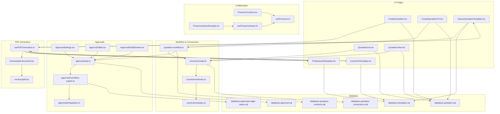

**Diagram sources**
- [CreateQuotation.tsx](file://src/pages/CreateQuotation.tsx)
- [CreateQuotationV2.tsx](file://src/pages/CreateQuotationV2.tsx)
- [QuotationList.tsx](file://src/pages/QuotationList.tsx)
- [QuotationView.tsx](file://src/pages/QuotationView.tsx)
- [ClassicQuotationTemplate.tsx](file://src/pages/ClassicQuotationTemplate.tsx)
- [ProfessionalTemplate.tsx](file://src/pages/ProfessionalTemplate.tsx)
- [InvoiceA4Template.tsx](file://src/pages/InvoiceA4Template.tsx)
- [quotation-workflow.ts](file://src/lib/quotation-workflow.ts)
- [api.ts (conversions)](file://src/conversions/api.ts)
- [hooks.ts (conversions)](file://src/conversions/hooks.ts)
- [types.ts (conversions)](file://src/conversions/types.ts)
- [ApprovalSettings.tsx](file://src/components/ApprovalSettings.tsx)
- [ApprovalTable.tsx](file://src/components/ApprovalTable.tsx)
- [ApprovalDetailDrawer.tsx](file://src/components/ApprovalDetailDrawer.tsx)
- [workflow-engine.ts](file://src/approvals/workflow-engine.ts)
- [api.ts (approvals)](file://src/approvals/api.ts)
- [integration.ts (approvals)](file://src/approvals/integration.ts)
- [PresenceContext.tsx](file://src/hooks/PresenceContext.tsx)
- [usePresence.ts](file://src/hooks/usePresence.ts)
- [usePresenceAware.ts](file://src/hooks/usePresenceAware.ts)
- [PresenceAwareExample.tsx](file://src/examples/PresenceAwareExample.tsx)
- [usePDFGeneration.ts](file://src/hooks/usePDFGeneration.ts)
- [pdf-document.tsx (invoices)](file://src/invoices/pdf-document.tsx)
- [pdf.tsx (invoices)](file://src/invoices/pdf.tsx)
- [database-quotation.sql](file://src/database-quotation.sql)
- [database-quotation-conversions.sql](file://src/database-quotation-conversions.sql)
- [database-quotation-revisions.sql](file://src/database-quotation-revisions.sql)
- [database-templates.sql](file://src/database-templates.sql)
- [database-approval.sql](file://src/database-approval.sql)
- [database-approvals-edge-cases.sql](file://src/database-approvals-edge-cases.sql)

**Section sources**
- [CreateQuotation.tsx](file://src/pages/CreateQuotation.tsx)
- [CreateQuotationV2.tsx](file://src/pages/CreateQuotationV2.tsx)
- [QuotationList.tsx](file://src/pages/QuotationList.tsx)
- [QuotationView.tsx](file://src/pages/QuotationView.tsx)
- [ClassicQuotationTemplate.tsx](file://src/pages/ClassicQuotationTemplate.tsx)
- [ProfessionalTemplate.tsx](file://src/pages/ProfessionalTemplate.tsx)
- [InvoiceA4Template.tsx](file://src/pages/InvoiceA4Template.tsx)
- [quotation-workflow.ts](file://src/lib/quotation-workflow.ts)
- [api.ts (conversions)](file://src/conversions/api.ts)
- [hooks.ts (conversions)](file://src/conversions/hooks.ts)
- [types.ts (conversions)](file://src/conversions/types.ts)
- [ApprovalSettings.tsx](file://src/components/ApprovalSettings.tsx)
- [ApprovalTable.tsx](file://src/components/ApprovalTable.tsx)
- [ApprovalDetailDrawer.tsx](file://src/components/ApprovalDetailDrawer.tsx)
- [workflow-engine.ts](file://src/approvals/workflow-engine.ts)
- [api.ts (approvals)](file://src/approvals/api.ts)
- [integration.ts (approvals)](file://src/approvals/integration.ts)
- [PresenceContext.tsx](file://src/hooks/PresenceContext.tsx)
- [usePresence.ts](file://src/hooks/usePresence.ts)
- [usePresenceAware.ts](file://src/hooks/usePresenceAware.ts)
- [PresenceAwareExample.tsx](file://src/examples/PresenceAwareExample.tsx)
- [usePDFGeneration.ts](file://src/hooks/usePDFGeneration.ts)
- [pdf-document.tsx (invoices)](file://src/invoices/pdf-document.tsx)
- [pdf.tsx (invoices)](file://src/invoices/pdf.tsx)
- [database-quotation.sql](file://src/database-quotation.sql)
- [database-quotation-conversions.sql](file://src/database-quotation-conversions.sql)
- [database-quotation-revisions.sql](file://src/database-quotation-revisions.sql)
- [database-templates.sql](file://src/database-templates.sql)
- [database-approval.sql](file://src/database-approval.sql)
- [database-approvals-edge-cases.sql](file://src/database-approvals-edge-cases.sql)

## Core Components
- Quotation Creation Pages: Provide dynamic forms for header metadata, line items, pricing rules, discounts, taxes, and terms. They integrate with item catalogs and client mappings.
- Quotation List and View: Display lists, filters, and detailed views including status, approvals, revisions, and conversion actions.
- Workflow Orchestration: Centralized logic for state transitions, validation, and triggering conversions or approvals.
- Conversion Layer: Transforms approved quotations into purchase orders or invoices, preserving lineage and auditability.
- Approvals Engine: Configurable multi-step workflows with settings, tables, and detail drawers for reviewers.
- Collaboration: Presence context and hooks enable real-time indicators and conflict resolution during concurrent edits.
- PDF Generation: Reusable hooks and template components render professional PDFs for quotations and invoices.
- Database Schema: Defines core entities, conversions, revisions, templates, and approvals with supporting indexes and constraints.

**Section sources**
- [CreateQuotation.tsx](file://src/pages/CreateQuotation.tsx)
- [CreateQuotationV2.tsx](file://src/pages/CreateQuotationV2.tsx)
- [QuotationList.tsx](file://src/pages/QuotationList.tsx)
- [QuotationView.tsx](file://src/pages/QuotationView.tsx)
- [quotation-workflow.ts](file://src/lib/quotation-workflow.ts)
- [api.ts (conversions)](file://src/conversions/api.ts)
- [hooks.ts (conversions)](file://src/conversions/hooks.ts)
- [types.ts (conversions)](file://src/conversions/types.ts)
- [ApprovalSettings.tsx](file://src/components/ApprovalSettings.tsx)
- [ApprovalTable.tsx](file://src/components/ApprovalTable.tsx)
- [ApprovalDetailDrawer.tsx](file://src/components/ApprovalDetailDrawer.tsx)
- [workflow-engine.ts](file://src/approvals/workflow-engine.ts)
- [api.ts (approvals)](file://src/approvals/api.ts)
- [integration.ts (approvals)](file://src/approvals/integration.ts)
- [PresenceContext.tsx](file://src/hooks/PresenceContext.tsx)
- [usePresence.ts](file://src/hooks/usePresence.ts)
- [usePresenceAware.ts](file://src/hooks/usePresenceAware.ts)
- [usePDFGeneration.ts](file://src/hooks/usePDFGeneration.ts)
- [pdf-document.tsx (invoices)](file://src/invoices/pdf-document.tsx)
- [pdf.tsx (invoices)](file://src/invoices/pdf.tsx)
- [database-quotation.sql](file://src/database-quotation.sql)
- [database-quotation-conversions.sql](file://src/database-quotation-conversions.sql)
- [database-quotation-revisions.sql](file://src/database-quotation-revisions.sql)
- [database-templates.sql](file://src/database-templates.sql)
- [database-approval.sql](file://src/database-approval.sql)
- [database-approvals-edge-cases.sql](file://src/database-approvals-edge-cases.sql)

## Architecture Overview
The system follows a layered architecture:
- Presentation Layer: React pages and reusable components for user interactions.
- Domain Logic Layer: Workflow engine and conversion utilities encapsulate business rules.
- Integration Layer: API clients for persistence and external systems; approvals integration.
- Data Layer: Relational schema with explicit support for conversions, revisions, and templates.
- Cross-Cutting Concerns: Presence/collaboration, PDF rendering, and performance monitoring.

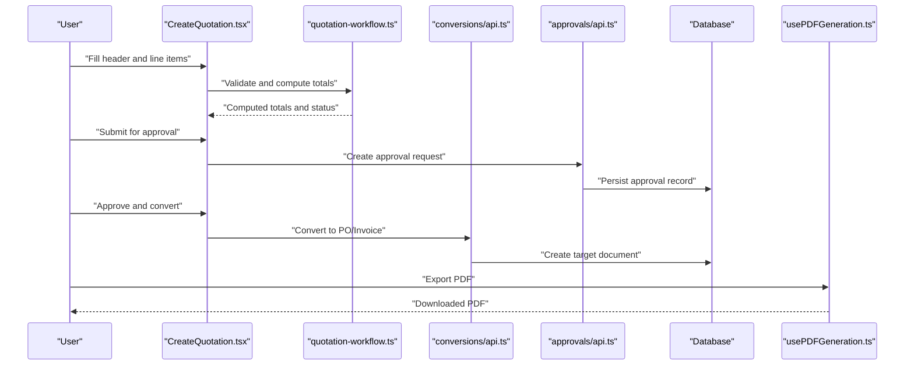

**Diagram sources**
- [CreateQuotation.tsx](file://src/pages/CreateQuotation.tsx)
- [quotation-workflow.ts](file://src/lib/quotation-workflow.ts)
- [api.ts (conversions)](file://src/conversions/api.ts)
- [api.ts (approvals)](file://src/approvals/api.ts)
- [usePDFGeneration.ts](file://src/hooks/usePDFGeneration.ts)

## Detailed Component Analysis

### Dynamic Quotation Creation Workflow
- Header and Line Items: The creation pages manage client selection, project linkage, currency, payment terms, and line items with quantities, unit prices, discounts, and taxes.
- Pricing Logic: Totals are computed by aggregating line-level calculations, applying global discounts/taxes, and respecting client-specific mappings and variants.
- Validation and State: The workflow orchestrator validates required fields, enforces business rules, and updates status transitions (Draft, Submitted, Approved, Converted).
- Draft Persistence: Intermediate drafts are persisted to ensure resilience against interruptions.

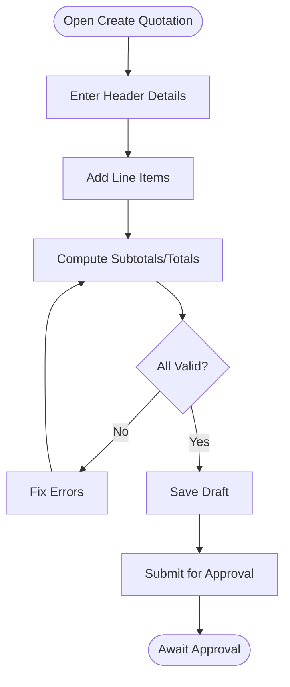

**Diagram sources**
- [CreateQuotation.tsx](file://src/pages/CreateQuotation.tsx)
- [CreateQuotationV2.tsx](file://src/pages/CreateQuotationV2.tsx)
- [quotation-workflow.ts](file://src/lib/quotation-workflow.ts)

**Section sources**
- [CreateQuotation.tsx](file://src/pages/CreateQuotation.tsx)
- [CreateQuotationV2.tsx](file://src/pages/CreateQuotationV2.tsx)
- [quotation-workflow.ts](file://src/lib/quotation-workflow.ts)

### Item Selection and Pricing Logic
- Item Catalog Integration: Searchable selectors pull available items, variants, and mappings to clients.
- Rate Resolution: Last quoted rates, client discount profiles, and variant pricing influence final unit costs.
- Discount and Tax Application: Global and per-line discounts are applied before tax computation; tax rules follow configured settings.
- Real-Time Recalculation: Changes propagate instantly to totals and summaries.

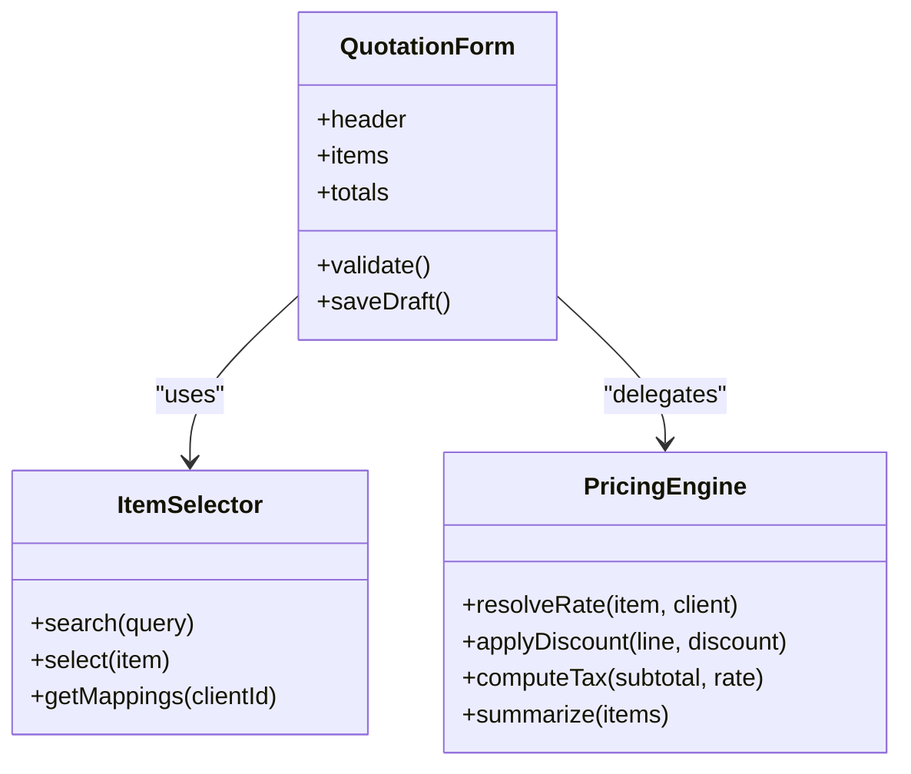

**Diagram sources**
- [CreateQuotation.tsx](file://src/pages/CreateQuotation.tsx)
- [CreateQuotationV2.tsx](file://src/pages/CreateQuotationV2.tsx)

**Section sources**
- [CreateQuotation.tsx](file://src/pages/CreateQuotation.tsx)
- [CreateQuotationV2.tsx](file://src/pages/CreateQuotationV2.tsx)

### Template-Based Document Generation and PDF Export
- Templates: Classic and Professional quotation templates provide structured layouts for branding and content.
- PDF Hook: A shared hook coordinates rendering and download flows, reusing template components.
- Invoice Templates: Similar patterns apply to invoice PDFs using dedicated template components.

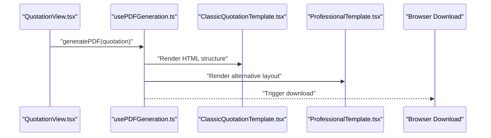

**Diagram sources**
- [QuotationView.tsx](file://src/pages/QuotationView.tsx)
- [usePDFGeneration.ts](file://src/hooks/usePDFGeneration.ts)
- [ClassicQuotationTemplate.tsx](file://src/pages/ClassicQuotationTemplate.tsx)
- [ProfessionalTemplate.tsx](file://src/pages/ProfessionalTemplate.tsx)

**Section sources**
- [QuotationView.tsx](file://src/pages/QuotationView.tsx)
- [usePDFGeneration.ts](file://src/hooks/usePDFGeneration.ts)
- [ClassicQuotationTemplate.tsx](file://src/pages/ClassicQuotationTemplate.tsx)
- [ProfessionalTemplate.tsx](file://src/pages/ProfessionalTemplate.tsx)

### Approval Processes and Revision Tracking
- Settings and Tables: Configuration UI defines steps, roles, and thresholds; tables list pending approvals with actions.
- Detail Drawer: Reviewers inspect changes, comments, and attachments before approving/denying.
- Workflow Engine: Orchestrates transitions, enforces rules, and persists outcomes.
- Revisions: Each significant change creates a new version snapshot linked to the parent quotation.

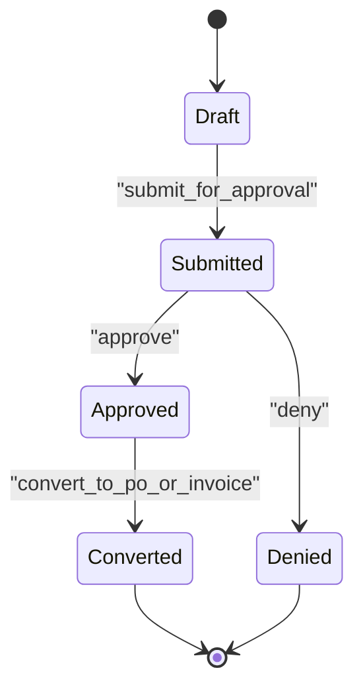

**Diagram sources**
- [ApprovalSettings.tsx](file://src/components/ApprovalSettings.tsx)
- [ApprovalTable.tsx](file://src/components/ApprovalTable.tsx)
- [ApprovalDetailDrawer.tsx](file://src/components/ApprovalDetailDrawer.tsx)
- [workflow-engine.ts](file://src/approvals/workflow-engine.ts)
- [api.ts (approvals)](file://src/approvals/api.ts)
- [database-quotation-revisions.sql](file://src/database-quotation-revisions.sql)

**Section sources**
- [ApprovalSettings.tsx](file://src/components/ApprovalSettings.tsx)
- [ApprovalTable.tsx](file://src/components/ApprovalTable.tsx)
- [ApprovalDetailDrawer.tsx](file://src/components/ApprovalDetailDrawer.tsx)
- [workflow-engine.ts](file://src/approvals/workflow-engine.ts)
- [api.ts (approvals)](file://src/approvals/api.ts)
- [database-quotation-revisions.sql](file://src/database-quotation-revisions.sql)

### Quotation Lifecycle: Creation to Orders and Invoices
- Creation: Drafts are saved incrementally; validations ensure completeness.
- Approval: Multi-step review with configurable approvers and conditions.
- Conversion: Approved quotations convert to purchase orders or invoices via the conversion layer, preserving references and audit trails.
- Post-Conversion: Downstream documents inherit key data and can be further processed.

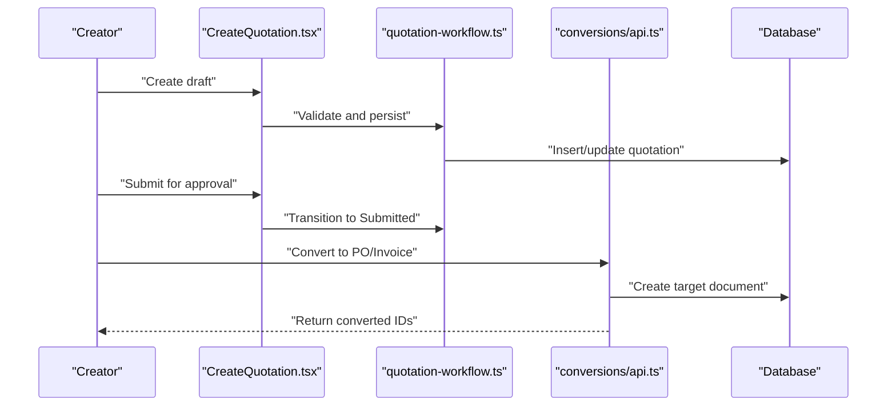

**Diagram sources**
- [CreateQuotation.tsx](file://src/pages/CreateQuotation.tsx)
- [quotation-workflow.ts](file://src/lib/quotation-workflow.ts)
- [api.ts (conversions)](file://src/conversions/api.ts)
- [database-quotation-conversions.sql](file://src/database-quotation-conversions.sql)

**Section sources**
- [CreateQuotation.tsx](file://src/pages/CreateQuotation.tsx)
- [quotation-workflow.ts](file://src/lib/quotation-workflow.ts)
- [api.ts (conversions)](file://src/conversions/api.ts)
- [database-quotation-conversions.sql](file://src/database-quotation-conversions.sql)

### Real-Time Collaboration, Presence Awareness, and Conflict Resolution
- Presence Context: Provides centralized presence state and broadcasting.
- Hooks: usePresence and usePresenceAware expose active collaborators and awareness signals.
- Example Usage: Demonstrates integrating presence into collaborative editors.
- Conflict Resolution: Strategies include last-write-wins with versioning and merge hints where applicable.

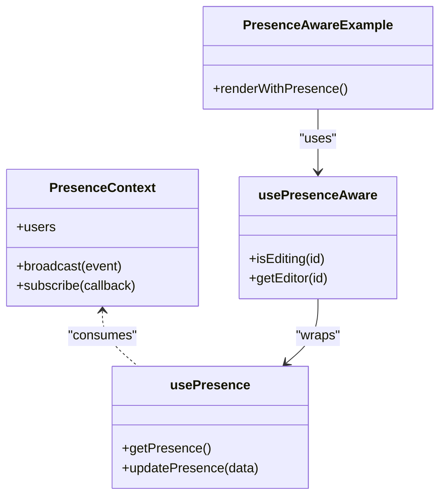

**Diagram sources**
- [PresenceContext.tsx](file://src/hooks/PresenceContext.tsx)
- [usePresence.ts](file://src/hooks/usePresence.ts)
- [usePresenceAware.ts](file://src/hooks/usePresenceAware.ts)
- [PresenceAwareExample.tsx](file://src/examples/PresenceAwareExample.tsx)

**Section sources**
- [PresenceContext.tsx](file://src/hooks/PresenceContext.tsx)
- [usePresence.ts](file://src/hooks/usePresence.ts)
- [usePresenceAware.ts](file://src/hooks/usePresenceAware.ts)
- [PresenceAwareExample.tsx](file://src/examples/PresenceAwareExample.tsx)

### Customizing Quotation Templates
- Template Components: Classic and Professional templates define layout sections, branding, and content blocks.
- Quick Quote Settings: Configure defaults, visibility, and behavior for quick quote flows.
- Template Settings: Manage template selection, ordering, and preview options.

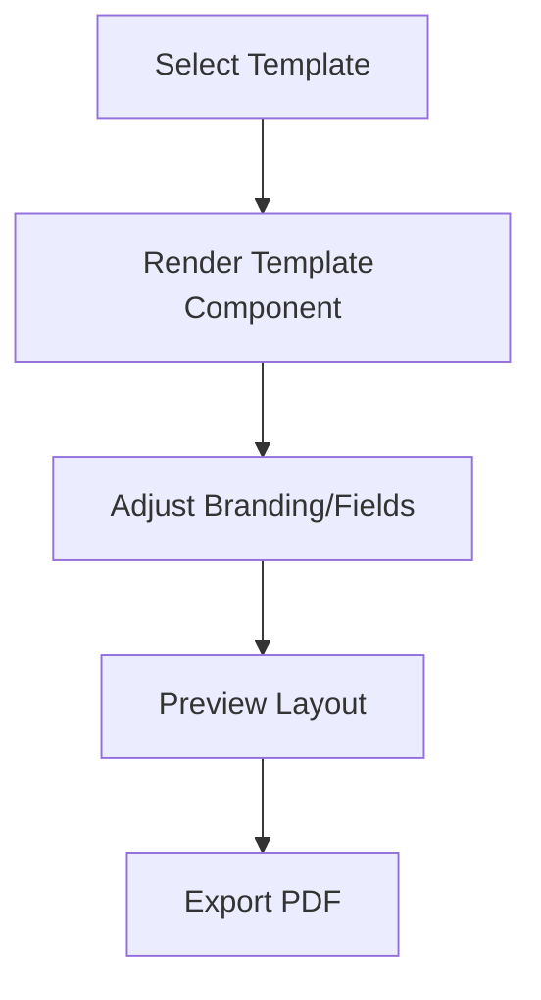

**Diagram sources**
- [ClassicQuotationTemplate.tsx](file://src/pages/ClassicQuotationTemplate.tsx)
- [ProfessionalTemplate.tsx](file://src/pages/ProfessionalTemplate.tsx)
- [QuickQuoteSettings.tsx](file://src/pages/QuickQuoteSettings.tsx)
- [TemplateSettings.tsx](file://src/pages/TemplateSettings.tsx)

**Section sources**
- [ClassicQuotationTemplate.tsx](file://src/pages/ClassicQuotationTemplate.tsx)
- [ProfessionalTemplate.tsx](file://src/pages/ProfessionalTemplate.tsx)
- [QuickQuoteSettings.tsx](file://src/pages/QuickQuoteSettings.tsx)
- [TemplateSettings.tsx](file://src/pages/TemplateSettings.tsx)

### Extending Approval Workflows
- Settings UI: Define steps, approver roles, and conditional routing.
- Workflow Engine: Implements transitions and rule evaluation.
- Integration Layer: Connects to notifications and external systems for escalations.

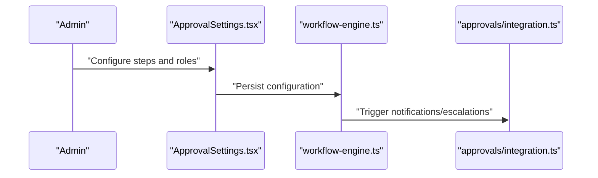

**Diagram sources**
- [ApprovalSettings.tsx](file://src/components/ApprovalSettings.tsx)
- [workflow-engine.ts](file://src/approvals/workflow-engine.ts)
- [integration.ts (approvals)](file://src/approvals/integration.ts)

**Section sources**
- [ApprovalSettings.tsx](file://src/components/ApprovalSettings.tsx)
- [workflow-engine.ts](file://src/approvals/workflow-engine.ts)
- [integration.ts (approvals)](file://src/approvals/integration.ts)

### Integrating with External Systems
- Approvals Integration: Bridges internal approvals with external notification channels and escalation mechanisms.
- Conversion APIs: Provide endpoints to synchronize created orders/invoices with ERP or accounting systems.

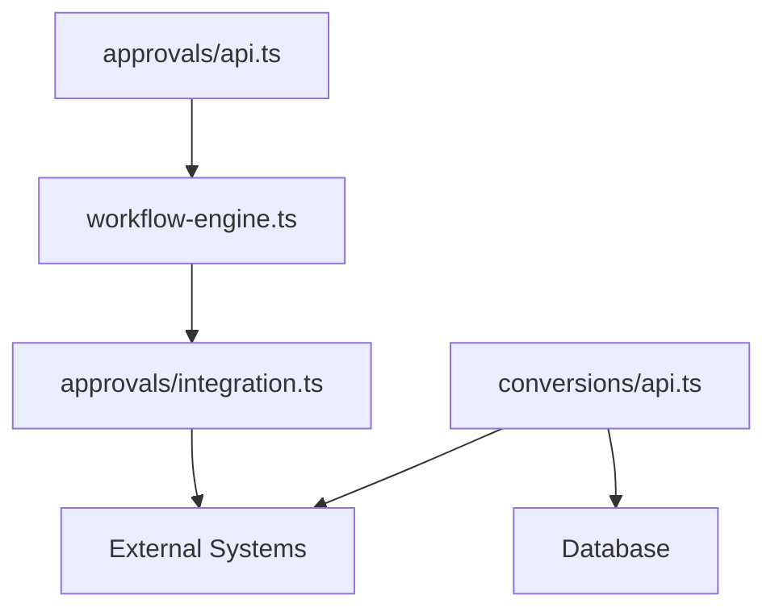

**Diagram sources**
- [api.ts (approvals)](file://src/approvals/api.ts)
- [workflow-engine.ts](file://src/approvals/workflow-engine.ts)
- [integration.ts (approvals)](file://src/approvals/integration.ts)
- [api.ts (conversions)](file://src/conversions/api.ts)

**Section sources**
- [api.ts (approvals)](file://src/approvals/api.ts)
- [workflow-engine.ts](file://src/approvals/workflow-engine.ts)
- [integration.ts (approvals)](file://src/approvals/integration.ts)
- [api.ts (conversions)](file://src/conversions/api.ts)

## Dependency Analysis
Key dependencies and relationships:
- UI pages depend on workflow and conversion APIs.
- Approvals subsystem depends on workflow engine and integration layer.
- PDF generation relies on template components and shared hooks.
- Database schema provides foundational entities and relationships for quotations, conversions, revisions, templates, and approvals.

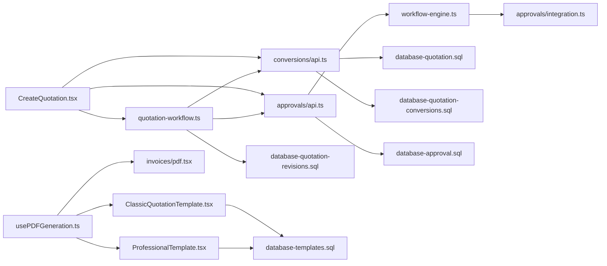

**Diagram sources**
- [CreateQuotation.tsx](file://src/pages/CreateQuotation.tsx)
- [quotation-workflow.ts](file://src/lib/quotation-workflow.ts)
- [api.ts (conversions)](file://src/conversions/api.ts)
- [api.ts (approvals)](file://src/approvals/api.ts)
- [workflow-engine.ts](file://src/approvals/workflow-engine.ts)
- [integration.ts (approvals)](file://src/approvals/integration.ts)
- [usePDFGeneration.ts](file://src/hooks/usePDFGeneration.ts)
- [ClassicQuotationTemplate.tsx](file://src/pages/ClassicQuotationTemplate.tsx)
- [ProfessionalTemplate.tsx](file://src/pages/ProfessionalTemplate.tsx)
- [pdf.tsx (invoices)](file://src/invoices/pdf.tsx)
- [database-quotation.sql](file://src/database-quotation.sql)
- [database-quotation-conversions.sql](file://src/database-quotation-conversions.sql)
- [database-approval.sql](file://src/database-approval.sql)
- [database-quotation-revisions.sql](file://src/database-quotation-revisions.sql)
- [database-templates.sql](file://src/database-templates.sql)

**Section sources**
- [CreateQuotation.tsx](file://src/pages/CreateQuotation.tsx)
- [quotation-workflow.ts](file://src/lib/quotation-workflow.ts)
- [api.ts (conversions)](file://src/conversions/api.ts)
- [api.ts (approvals)](file://src/approvals/api.ts)
- [workflow-engine.ts](file://src/approvals/workflow-engine.ts)
- [integration.ts (approvals)](file://src/approvals/integration.ts)
- [usePDFGeneration.ts](file://src/hooks/usePDFGeneration.ts)
- [ClassicQuotationTemplate.tsx](file://src/pages/ClassicQuotationTemplate.tsx)
- [ProfessionalTemplate.tsx](file://src/pages/ProfessionalTemplate.tsx)
- [pdf.tsx (invoices)](file://src/invoices/pdf.tsx)
- [database-quotation.sql](file://src/database-quotation.sql)
- [database-quotation-conversions.sql](file://src/database-quotation-conversions.sql)
- [database-approval.sql](file://src/database-approval.sql)
- [database-quotation-revisions.sql](file://src/database-quotation-revisions.sql)
- [database-templates.sql](file://src/database-templates.sql)

## Performance Considerations
- Large Quotations:
  - Virtualization and pagination for heavy line-item tables.
  - Debounced search and filtering in item selectors.
  - Incremental saves to avoid long-running transactions.
- Caching Strategies:
  - Client-side caches for catalog lookups and last quoted rates.
  - Memoization for expensive computations (totals, tax breakdowns).
  - Prefetching common templates and settings.
- Mobile Responsiveness:
  - Responsive layouts for form inputs and tables.
  - Touch-friendly controls and collapsible sections.
  - Optimized PDF rendering for smaller screens.

[No sources needed since this section provides general guidance]

## Troubleshooting Guide
- Approval Issues:
  - Verify configuration in settings and ensure approver roles exist.
  - Inspect edge cases handled by the approvals schema.
- Conversion Failures:
  - Check conversion logs and refer to conversion types and hooks for error paths.
- PDF Rendering Problems:
  - Validate template components and ensure assets/fonts are accessible.
- Collaboration Conflicts:
  - Monitor presence events and reconcile conflicting edits using versioning.

**Section sources**
- [database-approvals-edge-cases.sql](file://src/database-approvals-edge-cases.sql)
- [hooks.ts (conversions)](file://src/conversions/hooks.ts)
- [types.ts (conversions)](file://src/conversions/types.ts)
- [pdf-document.tsx (invoices)](file://src/invoices/pdf-document.tsx)
- [PresenceContext.tsx](file://src/hooks/PresenceContext.tsx)

## Conclusion
The Sales & Quotation Management system integrates dynamic creation, robust approvals, flexible templates, and reliable conversions. It supports real-time collaboration, revision tracking, and extensibility through well-defined interfaces and modular components. With attention to performance and mobile UX, it delivers a scalable solution for complex sales workflows.

[No sources needed since this section summarizes without analyzing specific files]

## Appendices
- Key Entities and Relationships:
  - Quotation headers and line items
  - Conversions linking quotations to orders/invoices
  - Revisions capturing snapshots and diffs
  - Templates storing layout definitions
  - Approvals defining steps, roles, and decisions

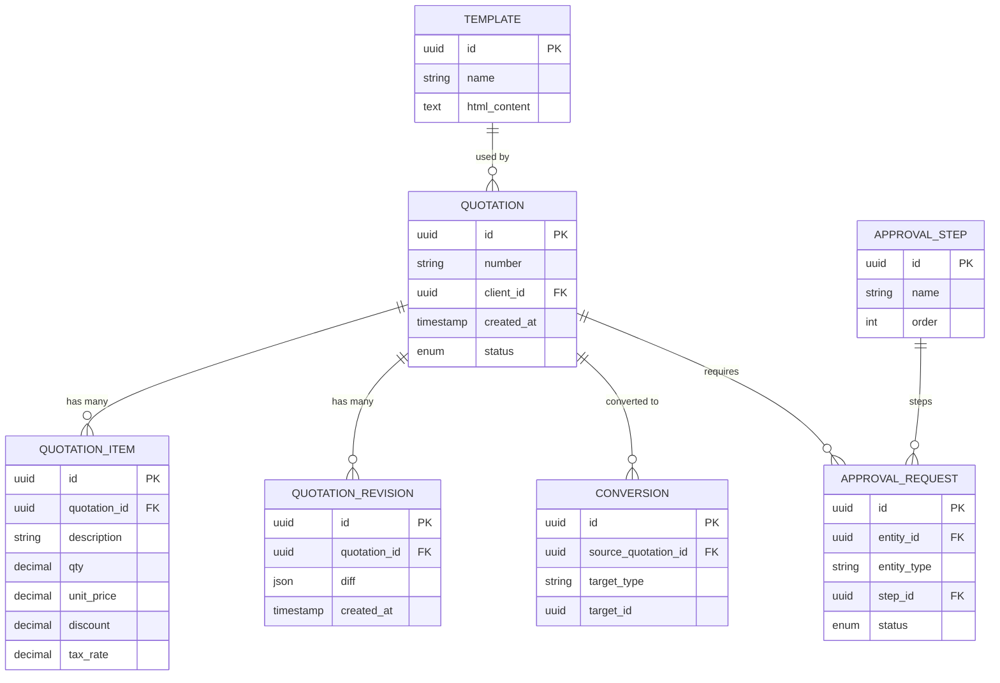

**Diagram sources**
- [database-quotation.sql](file://src/database-quotation.sql)
- [database-quotation-conversions.sql](file://src/database-quotation-conversions.sql)
- [database-quotation-revisions.sql](file://src/database-quotation-revisions.sql)
- [database-templates.sql](file://src/database-templates.sql)
- [database-approval.sql](file://src/database-approval.sql)