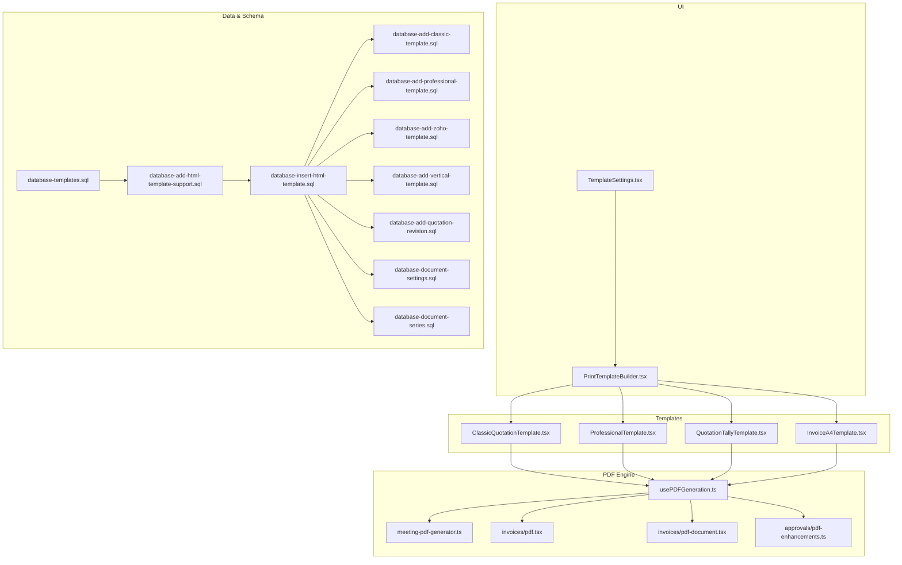
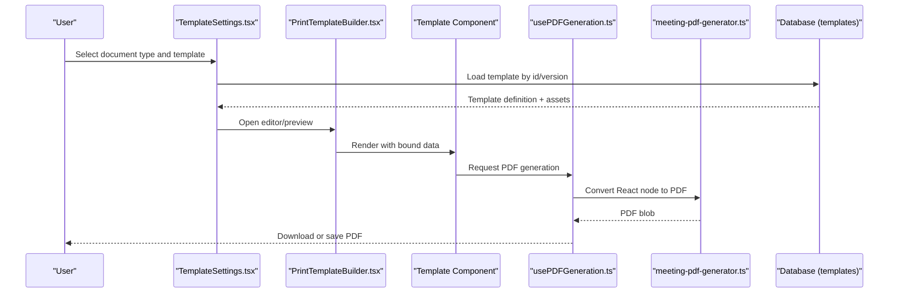
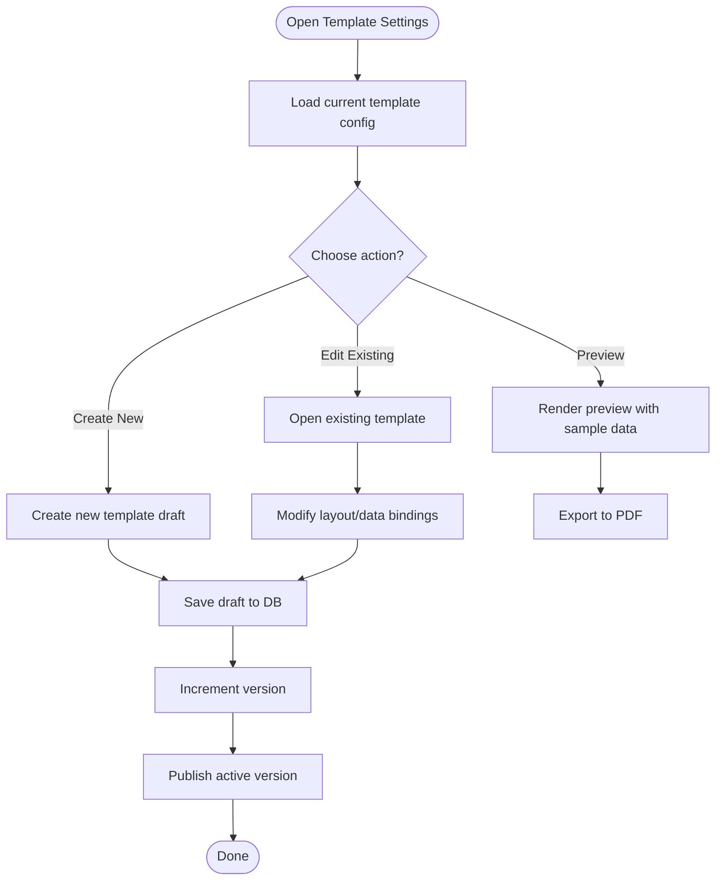
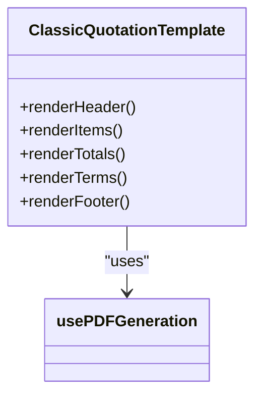
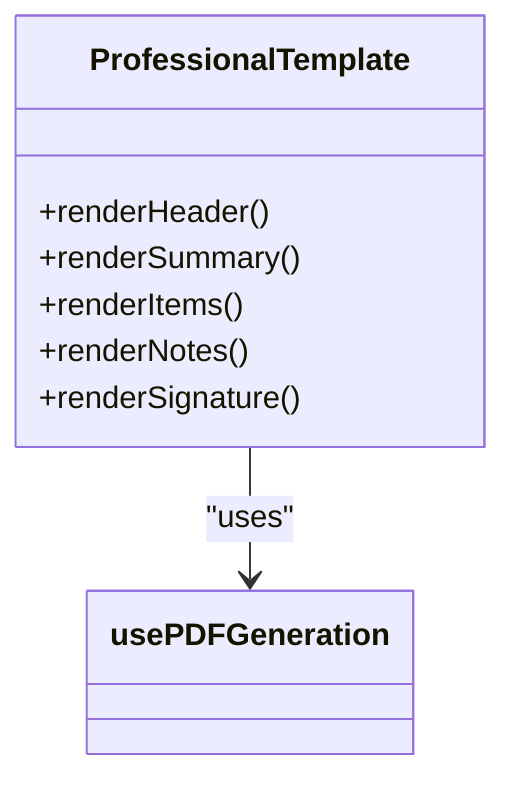
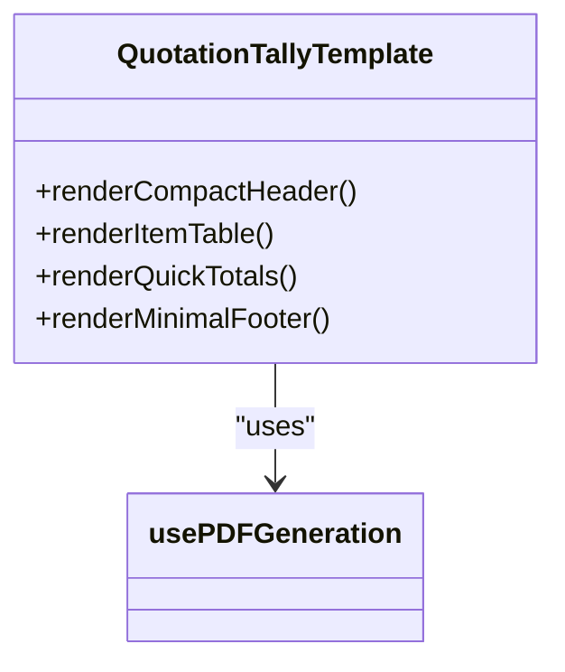
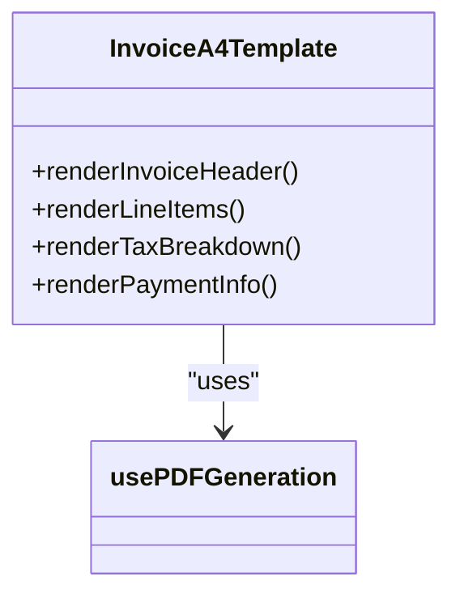
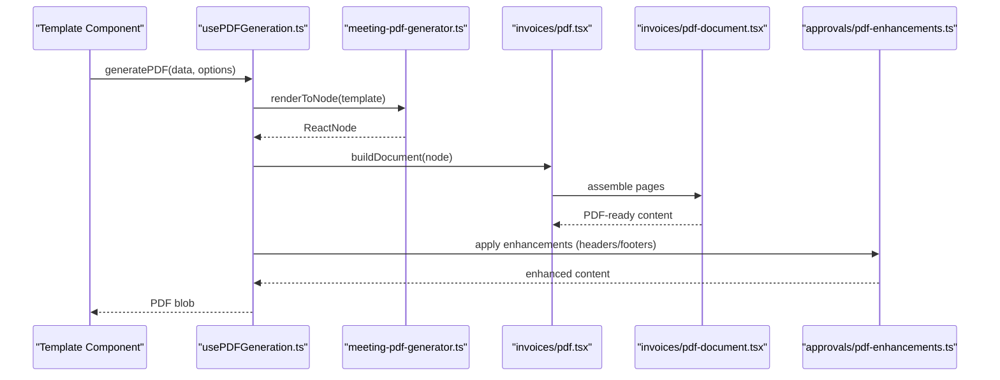
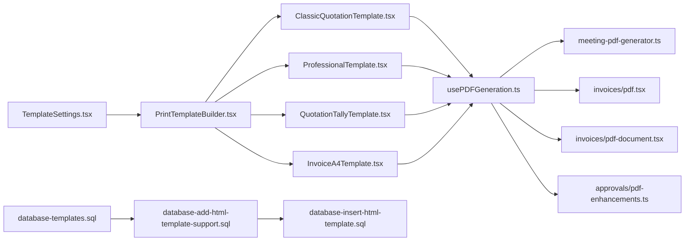

# Template Management

<cite>
**Referenced Files in This Document**
- [src/pages/ClassicQuotationTemplate.tsx](file://src/pages/ClassicQuotationTemplate.tsx)
- [src/pages/ProfessionalTemplate.tsx](file://src/pages/ProfessionalTemplate.tsx)
- [src/pages/QuotationTallyTemplate.tsx](file://src/pages/QuotationTallyTemplate.tsx)
- [src/pages/InvoiceA4Template.tsx](file://src/pages/InvoiceA4Template.tsx)
- [src/pages/PrintTemplateBuilder.tsx](file://src/pages/PrintTemplateBuilder.tsx)
- [src/pages/TemplateSettings.tsx](file://src/pages/TemplateSettings.tsx)
- [src/hooks/usePDFGeneration.ts](file://src/hooks/usePDFGeneration.ts)
- [src/lib/meeting-pdf-generator.ts](file://src/lib/meeting-pdf-generator.ts)
- [src/invoices/pdf-document.tsx](file://src/invoices/pdf-document.tsx)
- [src/invoices/pdf.tsx](file://src/invoices/pdf.tsx)
- [src/approvals/pdf-enhancements.ts](file://src/approvals/pdf-enhancements.ts)
- [src/assets/fonts/manrope/OFL.txt](file://src/assets/fonts/manrope/OFL.txt)
- [src/database-add-html-template-support.sql](file://src/database-add-html-template-support.sql)
- [src/database-insert-html-template.sql](file://src/database-insert-html-template.sql)
- [src/database-templates.sql](file://src/database-templates.sql)
- [src/database-add-classic-template.sql](file://src/database-add-classic-template.sql)
- [src/database-add-professional-template.sql](file://src/database-add-professional-template.sql)
- [src/database-add-zoho-template.sql](file://src/database-add-zoho-template.sql)
- [src/database-add-vertical-template.sql](file://src/database-add-tally-template.sql](file://src/database-add-tally-template.sql)
- [src/database-add-invoice-template.sql](file://src/database-add-invoice-template.sql)
- [src/database-add-quotation-revision.sql](file://src/database-add-quotation-revision.sql)
- [src/database-document-settings.sql](file://src/database-document-settings.sql)
- [src/database-document-series.sql](file://src/database-document-series.sql)
</cite>

## Table of Contents
1. [Introduction](#introduction)
2. [Project Structure](#project-structure)
3. [Core Components](#core-components)
4. [Architecture Overview](#architecture-overview)
5. [Detailed Component Analysis](#detailed-component-analysis)
6. [Dependency Analysis](#dependency-analysis)
7. [Performance Considerations](#performance-considerations)
8. [Troubleshooting Guide](#troubleshooting-guide)
9. [Conclusion](#conclusion)
10. [Appendices](#appendices)

## Introduction
This document explains the Template Management system for generating printable documents (primarily quotations and invoices). It covers:
- The template engine architecture and data binding model
- Built-in quotation templates (Classic, Professional, Zoho/Tally-style), and invoice templates
- Custom template creation and extension patterns
- Template structure, styling options, and responsive design considerations
- PDF generation pipeline, HTML-to-PDF conversion, font embedding, and image handling
- Template customization interface, preview capabilities, and version management
- Caching strategies, performance optimization, and cross-browser compatibility

The goal is to provide both a high-level understanding and implementation details so that developers can create, customize, and maintain templates effectively.

## Project Structure
Templates are implemented as React components with dedicated rendering logic and PDF generation utilities. Key areas include:
- Quotation templates: Classic, Professional, Tally/Zoho-style
- Invoice templates: A4 layout
- Template builder UI and settings
- PDF generation hooks and helpers
- Database schema and seed scripts for template storage and versions

**Diagram sources**
- [src/pages/TemplateSettings.tsx](file://src/pages/TemplateSettings.tsx)
- [src/pages/PrintTemplateBuilder.tsx](file://src/pages/PrintTemplateBuilder.tsx)
- [src/pages/ClassicQuotationTemplate.tsx](file://src/pages/ClassicQuotationTemplate.tsx)
- [src/pages/ProfessionalTemplate.tsx](file://src/pages/ProfessionalTemplate.tsx)
- [src/pages/QuotationTallyTemplate.tsx](file://src/pages/QuotationTallyTemplate.tsx)
- [src/pages/InvoiceA4Template.tsx](file://src/pages/InvoiceA4Template.tsx)
- [src/hooks/usePDFGeneration.ts](file://src/hooks/usePDFGeneration.ts)
- [src/lib/meeting-pdf-generator.ts](file://src/lib/meeting-pdf-generator.ts)
- [src/invoices/pdf.tsx](file://src/invoices/pdf.tsx)
- [src/invoices/pdf-document.tsx](file://src/invoices/pdf-document.tsx)
- [src/approvals/pdf-enhancements.ts](file://src/approvals/pdf-enhancements.ts)
- [src/database-templates.sql](file://src/database-templates.sql)
- [src/database-add-html-template-support.sql](file://src/database-add-html-template-support.sql)
- [src/database-insert-html-template.sql](file://src/database-insert-html-template.sql)
- [src/database-add-classic-template.sql](file://src/database-add-classic-template.sql)
- [src/database-add-professional-template.sql](file://src/database-add-professional-template.sql)
- [src/database-add-zoho-template.sql](file://src/database-add-zoho-template.sql)
- [src/database-add-vertical-template.sql](file://src/database-add-vertical-template.sql)
- [src/database-add-quotation-revision.sql](file://src/database-add-quotation-revision.sql)
- [src/database-document-settings.sql](file://src/database-document-settings.sql)
- [src/database-document-series.sql](file://src/database-document-series.sql)

**Section sources**
- [src/pages/TemplateSettings.tsx](file://src/pages/TemplateSettings.tsx)
- [src/pages/PrintTemplateBuilder.tsx](file://src/pages/PrintTemplateBuilder.tsx)
- [src/pages/ClassicQuotationTemplate.tsx](file://src/pages/ClassicQuotationTemplate.tsx)
- [src/pages/ProfessionalTemplate.tsx](file://src/pages/ProfessionalTemplate.tsx)
- [src/pages/QuotationTallyTemplate.tsx](file://src/pages/QuotationTallyTemplate.tsx)
- [src/pages/InvoiceA4Template.tsx](file://src/pages/InvoiceA4Template.tsx)
- [src/hooks/usePDFGeneration.ts](file://src/hooks/usePDFGeneration.ts)
- [src/lib/meeting-pdf-generator.ts](file://src/lib/meeting-pdf-generator.ts)
- [src/invoices/pdf.tsx](file://src/invoices/pdf.tsx)
- [src/invoices/pdf-document.tsx](file://src/invoices/pdf-document.tsx)
- [src/approvals/pdf-enhancements.ts](file://src/approvals/pdf-enhancements.ts)
- [src/database-templates.sql](file://src/database-templates.sql)
- [src/database-add-html-template-support.sql](file://src/database-add-html-template-support.sql)
- [src/database-insert-html-template.sql](file://src/database-insert-html-template.sql)
- [src/database-add-classic-template.sql](file://src/database-add-classic-template.sql)
- [src/database-add-professional-template.sql](file://src/database-add-professional-template.sql)
- [src/database-add-zoho-template.sql](file://src/database-add-zoho-template.sql)
- [src/database-add-vertical-template.sql](file://src/database-add-vertical-template.sql)
- [src/database-add-quotation-revision.sql](file://src/database-add-quotation-revision.sql)
- [src/database-document-settings.sql](file://src/database-document-settings.sql)
- [src/database-document-series.sql](file://src/database-document-series.sql)

## Core Components
- Template Settings: Central configuration for selecting and managing templates per document type.
- Print Template Builder: UI for creating/editing templates, previewing output, and persisting changes.
- Built-in Templates:
  - Classic Quotation: Traditional layout with clear sections and totals.
  - Professional Quotation: Modern, branded look with enhanced typography and spacing.
  - Tally/Zoho-style Quotation: Compact, tabular format optimized for accounting systems.
  - Invoice A4: Standard A4 invoice layout.
- PDF Generation:
  - usePDFGeneration hook: Orchestrates rendering and PDF export.
  - meeting-pdf-generator: Utility for generating PDFs from React nodes.
  - Invoices PDF modules: Shared PDF rendering logic for invoices.
  - Approvals PDF enhancements: Additional formatting and features for approval documents.

Key responsibilities:
- Data binding between business entities and template fields
- Styling via CSS and embedded fonts
- Responsive layouts for print and screen previews
- Versioned template storage and rollback support

**Section sources**
- [src/pages/TemplateSettings.tsx](file://src/pages/TemplateSettings.tsx)
- [src/pages/PrintTemplateBuilder.tsx](file://src/pages/PrintTemplateBuilder.tsx)
- [src/pages/ClassicQuotationTemplate.tsx](file://src/pages/ClassicQuotationTemplate.tsx)
- [src/pages/ProfessionalTemplate.tsx](file://src/pages/ProfessionalTemplate.tsx)
- [src/pages/QuotationTallyTemplate.tsx](file://src/pages/QuotationTallyTemplate.tsx)
- [src/pages/InvoiceA4Template.tsx](file://src/pages/InvoiceA4Template.tsx)
- [src/hooks/usePDFGeneration.ts](file://src/hooks/usePDFGeneration.ts)
- [src/lib/meeting-pdf-generator.ts](file://src/lib/meeting-pdf-generator.ts)
- [src/invoices/pdf.tsx](file://src/invoices/pdf.tsx)
- [src/invoices/pdf-document.tsx](file://src/invoices/pdf-document.tsx)
- [src/approvals/pdf-enhancements.ts](file://src/approvals/pdf-enhancements.ts)

## Architecture Overview
The Template Management system follows a layered architecture:
- Presentation Layer: Template components render structured content using React.
- Rendering Layer: PDF generation utilities convert rendered content into downloadable PDFs.
- Storage Layer: Database stores template definitions, versions, and related settings.
- Configuration Layer: Template settings control defaults, series, and branding.

**Diagram sources**
- [src/pages/TemplateSettings.tsx](file://src/pages/TemplateSettings.tsx)
- [src/pages/PrintTemplateBuilder.tsx](file://src/pages/PrintTemplateBuilder.tsx)
- [src/pages/ClassicQuotationTemplate.tsx](file://src/pages/ClassicQuotationTemplate.tsx)
- [src/pages/ProfessionalTemplate.tsx](file://src/pages/ProfessionalTemplate.tsx)
- [src/pages/QuotationTallyTemplate.tsx](file://src/pages/QuotationTallyTemplate.tsx)
- [src/pages/InvoiceA4Template.tsx](file://src/pages/InvoiceA4Template.tsx)
- [src/hooks/usePDFGeneration.ts](file://src/hooks/usePDFGeneration.ts)
- [src/lib/meeting-pdf-generator.ts](file://src/lib/meeting-pdf-generator.ts)
- [src/database-templates.sql](file://src/database-templates.sql)

## Detailed Component Analysis

### Template Settings and Builder
- TemplateSettings manages selection and default assignment of templates per document type.
- PrintTemplateBuilder provides an interactive editor with live preview and persistence.
- Both integrate with database schemas for template metadata, versions, and settings.

**Diagram sources**
- [src/pages/TemplateSettings.tsx](file://src/pages/TemplateSettings.tsx)
- [src/pages/PrintTemplateBuilder.tsx](file://src/pages/PrintTemplateBuilder.tsx)
- [src/database-templates.sql](file://src/database-templates.sql)
- [src/database-add-quotation-revision.sql](file://src/database-add-quotation-revision.sql)
- [src/database-document-settings.sql](file://src/database-document-settings.sql)

**Section sources**
- [src/pages/TemplateSettings.tsx](file://src/pages/TemplateSettings.tsx)
- [src/pages/PrintTemplateBuilder.tsx](file://src/pages/PrintTemplateBuilder.tsx)
- [src/database-templates.sql](file://src/database-templates.sql)
- [src/database-add-quotation-revision.sql](file://src/database-add-quotation-revision.sql)
- [src/database-document-settings.sql](file://src/database-document-settings.sql)

### Built-in Quotation Templates

#### Classic Quotation Template
- Purpose: Traditional, readable layout suitable for general business use.
- Features: Clear header/footer, itemized table, totals, terms, and signature blocks.
- Styling: Uses standard fonts and consistent spacing; supports logo and branding.

**Diagram sources**
- [src/pages/ClassicQuotationTemplate.tsx](file://src/pages/ClassicQuotationTemplate.tsx)
- [src/hooks/usePDFGeneration.ts](file://src/hooks/usePDFGeneration.ts)

**Section sources**
- [src/pages/ClassicQuotationTemplate.tsx](file://src/pages/ClassicQuotationTemplate.tsx)
- [src/database-add-classic-template.sql](file://src/database-add-classic-template.sql)

#### Professional Quotation Template
- Purpose: Modern, polished appearance with improved typography and visual hierarchy.
- Features: Enhanced spacing, subtle borders, prominent branding area, and refined tables.
- Styling: Leverages custom fonts and Tailwind classes for consistency.

**Diagram sources**
- [src/pages/ProfessionalTemplate.tsx](file://src/pages/ProfessionalTemplate.tsx)
- [src/hooks/usePDFGeneration.ts](file://src/hooks/usePDFGeneration.ts)

**Section sources**
- [src/pages/ProfessionalTemplate.tsx](file://src/pages/ProfessionalTemplate.tsx)
- [src/database-add-professional-template.sql](file://src/database-add-professional-template.sql)

#### Tally/Zoho-style Quotation Template
- Purpose: Compact, tabular format optimized for accounting integrations and quick review.
- Features: Dense item listing, concise totals, minimal decorative elements.
- Styling: Emphasizes readability and alignment; compatible with strict print layouts.

**Diagram sources**
- [src/pages/QuotationTallyTemplate.tsx](file://src/pages/QuotationTallyTemplate.tsx)
- [src/hooks/usePDFGeneration.ts](file://src/hooks/usePDFGeneration.ts)

**Section sources**
- [src/pages/QuotationTallyTemplate.tsx](file://src/pages/QuotationTallyTemplate.tsx)
- [src/database-add-zoho-template.sql](file://src/database-add-zoho-template.sql)
- [src/database-add-vertical-template.sql](file://src/database-add-vertical-template.sql)

### Invoice Template
- InvoiceA4Template provides a standard A4 invoice layout with line items, taxes, and payment details.
- Integrates with shared PDF rendering utilities for consistent output across documents.

**Diagram sources**
- [src/pages/InvoiceA4Template.tsx](file://src/pages/InvoiceA4Template.tsx)
- [src/hooks/usePDFGeneration.ts](file://src/hooks/usePDFGeneration.ts)

**Section sources**
- [src/pages/InvoiceA4Template.tsx](file://src/pages/InvoiceA4Template.tsx)
- [src/database-add-invoice-template.sql](file://src/database-add-invoice-template.sql)

### PDF Generation Pipeline
The PDF pipeline converts React-rendered templates into downloadable PDFs:
- usePDFGeneration orchestrates rendering and export.
- meeting-pdf-generator handles node-to-PDF conversion.
- invoices/pdf and pdf-document provide reusable rendering logic.
- approvals/pdf-enhancements adds specialized formatting.

**Diagram sources**
- [src/hooks/usePDFGeneration.ts](file://src/hooks/usePDFGeneration.ts)
- [src/lib/meeting-pdf-generator.ts](file://src/lib/meeting-pdf-generator.ts)
- [src/invoices/pdf.tsx](file://src/invoices/pdf.tsx)
- [src/invoices/pdf-document.tsx](file://src/invoices/pdf-document.tsx)
- [src/approvals/pdf-enhancements.ts](file://src/approvals/pdf-enhancements.ts)

**Section sources**
- [src/hooks/usePDFGeneration.ts](file://src/hooks/usePDFGeneration.ts)
- [src/lib/meeting-pdf-generator.ts](file://src/lib/meeting-pdf-generator.ts)
- [src/invoices/pdf.tsx](file://src/invoices/pdf.tsx)
- [src/invoices/pdf-document.tsx](file://src/invoices/pdf-document.tsx)
- [src/approvals/pdf-enhancements.ts](file://src/approvals/pdf-enhancements.ts)

### Template Structure and Data Binding
- Template structure:
  - Header: Company info, logo, document title, date, reference numbers
  - Body: Itemized list with descriptions, quantities, rates, taxes
  - Footer: Totals, notes, terms, signatures
- Data binding:
  - Bindings map business entities (clients, items, totals) to template placeholders
  - Supports conditional sections (e.g., show only when applicable)
  - Allows dynamic styling based on context (brand colors, fonts)
- Styling options:
  - Embedded fonts for consistent rendering
  - CSS classes for layout and responsiveness
  - Image handling for logos and attachments

Implementation references:
- Font assets and licensing information
- HTML template support schema and insertion scripts
- Template storage and versioning schemas

**Section sources**
- [src/assets/fonts/manrope/OFL.txt](file://src/assets/fonts/manrope/OFL.txt)
- [src/database-add-html-template-support.sql](file://src/database-add-html-template-support.sql)
- [src/database-insert-html-template.sql](file://src/database-insert-html-template.sql)
- [src/database-templates.sql](file://src/database-templates.sql)
- [src/database-add-quotation-revision.sql](file://src/database-add-quotation-revision.sql)

### Custom Template Creation and Extension
- Creating a custom template:
  - Use PrintTemplateBuilder to define layout and bindings
  - Store template definition in the templates schema
  - Assign a unique identifier and version
- Extending existing templates:
  - Fork an existing template and modify sections
  - Override styles while preserving core structure
  - Maintain backward compatibility for published versions
- Integrating third-party styling frameworks:
  - Include CSS/JS assets within template scope
  - Ensure print-friendly rules and avoid heavy dependencies
  - Validate cross-browser behavior during preview

Best practices:
- Keep templates modular and focused
- Use semantic markup for better PDF rendering
- Test with real-world data sets for edge cases

**Section sources**
- [src/pages/PrintTemplateBuilder.tsx](file://src/pages/PrintTemplateBuilder.tsx)
- [src/database-templates.sql](file://src/database-templates.sql)
- [src/database-add-html-template-support.sql](file://src/database-add-html-template-support.sql)

### Version Management
- Versioning:
  - Each template has a version number and status (draft/published)
  - Changes increment version; published versions remain immutable
- Rollback:
  - Revert to previous published version if needed
- Auditability:
  - Track who created/modified templates and when
- Series and settings:
  - Link templates to document series and organization settings

**Section sources**
- [src/database-templates.sql](file://src/database-templates.sql)
- [src/database-add-quotation-revision.sql](file://src/database-add-quotation-revision.sql)
- [src/database-document-settings.sql](file://src/database-document-settings.sql)
- [src/database-document-series.sql](file://src/database-document-series.sql)

## Dependency Analysis
The template system depends on:
- UI components for editing and preview
- PDF generation utilities for export
- Database schemas for persistence and versioning
- Fonts and assets for consistent rendering

**Diagram sources**
- [src/pages/TemplateSettings.tsx](file://src/pages/TemplateSettings.tsx)
- [src/pages/PrintTemplateBuilder.tsx](file://src/pages/PrintTemplateBuilder.tsx)
- [src/pages/ClassicQuotationTemplate.tsx](file://src/pages/ClassicQuotationTemplate.tsx)
- [src/pages/ProfessionalTemplate.tsx](file://src/pages/ProfessionalTemplate.tsx)
- [src/pages/QuotationTallyTemplate.tsx](file://src/pages/QuotationTallyTemplate.tsx)
- [src/pages/InvoiceA4Template.tsx](file://src/pages/InvoiceA4Template.tsx)
- [src/hooks/usePDFGeneration.ts](file://src/hooks/usePDFGeneration.ts)
- [src/lib/meeting-pdf-generator.ts](file://src/lib/meeting-pdf-generator.ts)
- [src/invoices/pdf.tsx](file://src/invoices/pdf.tsx)
- [src/invoices/pdf-document.tsx](file://src/invoices/pdf-document.tsx)
- [src/approvals/pdf-enhancements.ts](file://src/approvals/pdf-enhancements.ts)
- [src/database-templates.sql](file://src/database-templates.sql)
- [src/database-add-html-template-support.sql](file://src/database-add-html-template-support.sql)
- [src/database-insert-html-template.sql](file://src/database-insert-html-template.sql)

**Section sources**
- [src/pages/TemplateSettings.tsx](file://src/pages/TemplateSettings.tsx)
- [src/pages/PrintTemplateBuilder.tsx](file://src/pages/PrintTemplateBuilder.tsx)
- [src/pages/ClassicQuotationTemplate.tsx](file://src/pages/ClassicQuotationTemplate.tsx)
- [src/pages/ProfessionalTemplate.tsx](file://src/pages/ProfessionalTemplate.tsx)
- [src/pages/QuotationTallyTemplate.tsx](file://src/pages/QuotationTallyTemplate.tsx)
- [src/pages/InvoiceA4Template.tsx](file://src/pages/InvoiceA4Template.tsx)
- [src/hooks/usePDFGeneration.ts](file://src/hooks/usePDFGeneration.ts)
- [src/lib/meeting-pdf-generator.ts](file://src/lib/meeting-pdf-generator.ts)
- [src/invoices/pdf.tsx](file://src/invoices/pdf.tsx)
- [src/invoices/pdf-document.tsx](file://src/invoices/pdf-document.tsx)
- [src/approvals/pdf-enhancements.ts](file://src/approvals/pdf-enhancements.ts)
- [src/database-templates.sql](file://src/database-templates.sql)
- [src/database-add-html-template-support.sql](file://src/database-add-html-template-support.sql)
- [src/database-insert-html-template.sql](file://src/database-insert-html-template.sql)

## Performance Considerations
- Template caching:
  - Cache rendered template nodes and generated PDF blobs where appropriate
  - Invalidate cache on template updates or data changes
- Rendering optimization:
  - Minimize re-renders by memoizing template components
  - Use efficient data structures for large item lists
- PDF generation:
  - Batch operations and avoid redundant conversions
  - Stream large documents when possible
- Cross-browser compatibility:
  - Validate PDF output across major browsers
  - Prefer widely supported CSS features for print layouts
- Font embedding:
  - Embed only necessary glyphs to reduce file size
  - Verify license compliance for embedded fonts

[No sources needed since this section provides general guidance]

## Troubleshooting Guide
Common issues and resolutions:
- Missing fonts in PDF:
  - Ensure fonts are embedded and licensed correctly
  - Check font paths and availability during rendering
- Images not appearing:
  - Validate image URLs and permissions
  - Use base64 encoding for small images if needed
- Layout shifts in PDF:
  - Adjust CSS for print media queries
  - Avoid dynamic widths that depend on runtime measurements
- Slow generation:
  - Profile rendering and PDF conversion steps
  - Optimize data binding and reduce unnecessary computations
- Version conflicts:
  - Confirm active version selection and publish workflow
  - Review audit logs for recent changes

**Section sources**
- [src/assets/fonts/manrope/OFL.txt](file://src/assets/fonts/manrope/OFL.txt)
- [src/hooks/usePDFGeneration.ts](file://src/hooks/usePDFGeneration.ts)
- [src/lib/meeting-pdf-generator.ts](file://src/lib/meeting-pdf-generator.ts)
- [src/database-templates.sql](file://src/database-templates.sql)
- [src/database-add-quotation-revision.sql](file://src/database-add-quotation-revision.sql)

## Conclusion
The Template Management system provides a robust framework for designing, customizing, and exporting professional documents. With built-in templates, a flexible builder, and a reliable PDF pipeline, teams can maintain brand consistency and adapt quickly to changing requirements. By following best practices for data binding, styling, and performance, organizations can deliver high-quality outputs across platforms and devices.

[No sources needed since this section summarizes without analyzing specific files]

## Appendices

### Example Workflows

#### Creating a Custom Template
- Steps:
  - Open Template Settings and choose “Create New”
  - Use PrintTemplateBuilder to define layout and bind data fields
  - Save draft and increment version
  - Publish after validation
- References:
  - [src/pages/TemplateSettings.tsx](file://src/pages/TemplateSettings.tsx)
  - [src/pages/PrintTemplateBuilder.tsx](file://src/pages/PrintTemplateBuilder.tsx)
  - [src/database-templates.sql](file://src/database-templates.sql)

#### Extending an Existing Template
- Steps:
  - Fork a published template (e.g., Classic)
  - Modify sections and styles
  - Test with sample data and export PDF
  - Publish new version
- References:
  - [src/pages/ClassicQuotationTemplate.tsx](file://src/pages/ClassicQuotationTemplate.tsx)
  - [src/database-add-classic-template.sql](file://src/database-add-classic-template.sql)
  - [src/database-add-quotation-revision.sql](file://src/database-add-quotation-revision.sql)

#### Integrating Third-Party Styling Frameworks
- Steps:
  - Include framework CSS/JS in template scope
  - Ensure print-friendly rules and avoid heavy dependencies
  - Validate cross-browser behavior during preview
- References:
  - [src/pages/PrintTemplateBuilder.tsx](file://src/pages/PrintTemplateBuilder.tsx)
  - [src/database-add-html-template-support.sql](file://src/database-add-html-template-support.sql)