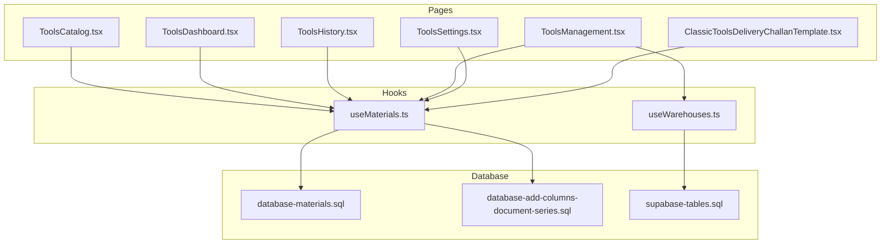
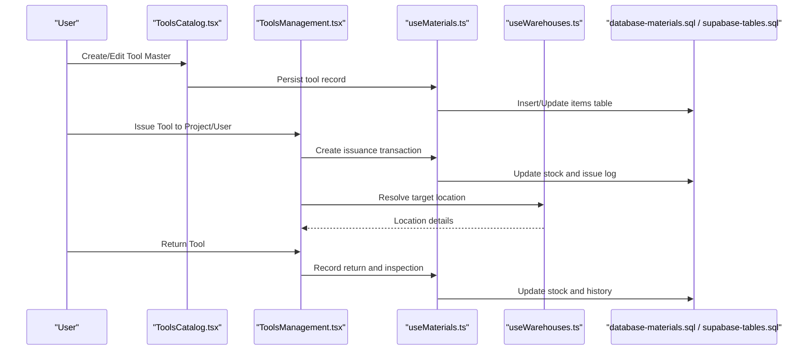
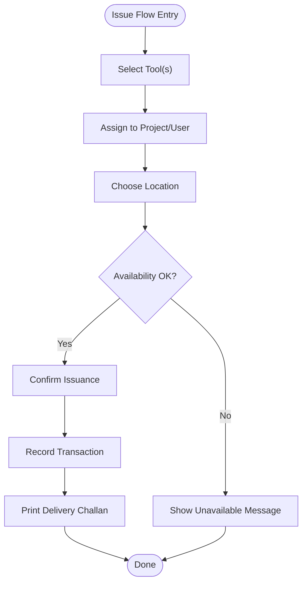
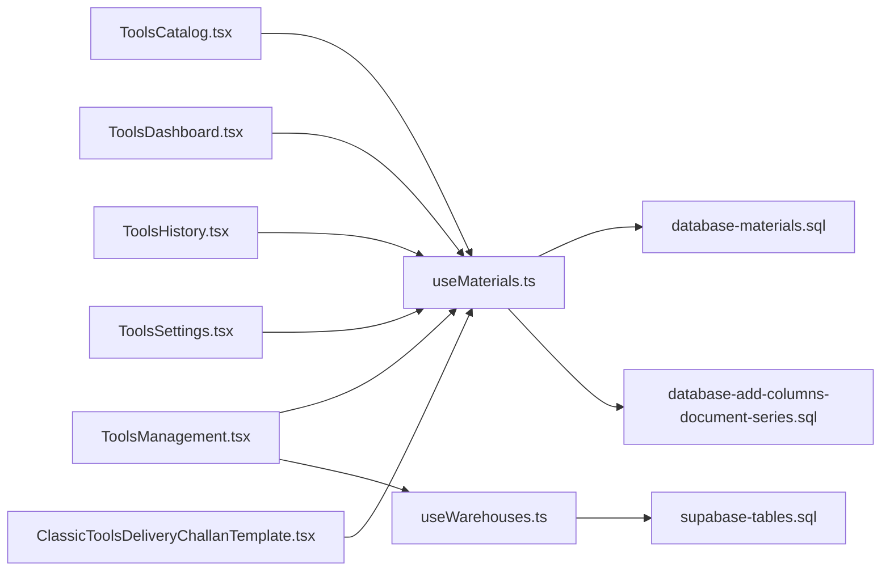

# Tools & Equipment Management

<cite>
**Referenced Files in This Document**
- [ToolsCatalog.tsx](file://src/pages/ToolsCatalog.tsx)
- [ToolsDashboard.tsx](file://src/pages/ToolsDashboard.tsx)
- [ToolsHistory.tsx](file://src/pages/ToolsHistory.tsx)
- [ToolsManagement.tsx](file://src/pages/ToolsManagement.tsx)
- [ToolsSettings.tsx](file://src/pages/ToolsSettings.tsx)
- [ClassicToolsDeliveryChallanTemplate.tsx](file://src/pages/ClassicToolsDeliveryChallanTemplate.tsx)
- [useMaterials.ts](file://src/hooks/useMaterials.ts)
- [useWarehouses.ts](file://src/hooks/useWarehouses.ts)
- [database-add-columns-document-series.sql](file://src/database-add-columns-document-series.sql)
- [database-materials.sql](file://src/database-materials.sql)
- [supabase-tables.sql](file://supabase-tables.sql)
</cite>

## Table of Contents
1. [Introduction](#introduction)
2. [Project Structure](#project-structure)
3. [Core Components](#core-components)
4. [Architecture Overview](#architecture-overview)
5. [Detailed Component Analysis](#detailed-component-analysis)
6. [Dependency Analysis](#dependency-analysis)
7. [Performance Considerations](#performance-considerations)
8. [Troubleshooting Guide](#troubleshooting-guide)
9. [Conclusion](#conclusion)
10. [Appendices](#appendices)

## Introduction
This document describes the Tools & Equipment Management system, focusing on catalog management, issuance and return tracking, maintenance scheduling, utilization monitoring, and the full lifecycle from acquisition to disposal. It also covers depreciation tracking, replacement planning, preventive maintenance, repair history, utilization reports, barcode/QR scanning, mobile accessibility, real-time availability across locations, customization of categories, maintenance schedule setup, and procurement integrations.

## Project Structure
The Tools & Equipment Management feature is implemented as a set of pages and hooks that integrate with the broader materials and warehouse subsystems. The primary entry points are:
- Tools Catalog: manage tool master data and attributes
- Tools Dashboard: overview and quick actions
- Tools History: issuance and return records
- Tools Management: operational workflows (issue, return, transfer)
- Tools Settings: configuration for categories, schedules, and integrations
- Classic Tools Delivery Challan Template: printable issuance documentation

**Diagram sources**
- [ToolsCatalog.tsx](file://src/pages/ToolsCatalog.tsx)
- [ToolsDashboard.tsx](file://src/pages/ToolsDashboard.tsx)
- [ToolsHistory.tsx](file://src/pages/ToolsHistory.tsx)
- [ToolsManagement.tsx](file://src/pages/ToolsManagement.tsx)
- [ToolsSettings.tsx](file://src/pages/ToolsSettings.tsx)
- [ClassicToolsDeliveryChallanTemplate.tsx](file://src/pages/ClassicToolsDeliveryChallanTemplate.tsx)
- [useMaterials.ts](file://src/hooks/useMaterials.ts)
- [useWarehouses.ts](file://src/hooks/useWarehouses.ts)
- [database-materials.sql](file://src/database-materials.sql)
- [database-add-columns-document-series.sql](file://src/database-add-columns-document-series.sql)
- [supabase-tables.sql](file://supabase-tables.sql)

**Section sources**
- [ToolsCatalog.tsx](file://src/pages/ToolsCatalog.tsx)
- [ToolsDashboard.tsx](file://src/pages/ToolsDashboard.tsx)
- [ToolsHistory.tsx](file://src/pages/ToolsHistory.tsx)
- [ToolsManagement.tsx](file://src/pages/ToolsManagement.tsx)
- [ToolsSettings.tsx](file://src/pages/ToolsSettings.tsx)
- [ClassicToolsDeliveryChallanTemplate.tsx](file://src/pages/ClassicToolsDeliveryChallanTemplate.tsx)
- [useMaterials.ts](file://src/hooks/useMaterials.ts)
- [useWarehouses.ts](file://src/hooks/useWarehouses.ts)
- [database-materials.sql](file://src/database-materials.sql)
- [database-add-columns-document-series.sql](file://src/database-add-columns-document-series.sql)
- [supabase-tables.sql](file://supabase-tables.sql)

## Core Components
- Tools Catalog: Central repository for tool definitions, including identifiers, categories, serial numbers, barcodes/QR codes, purchase details, cost, depreciation parameters, and status. Supports creation, editing, archiving, and bulk import/export.
- Tools Dashboard: High-level metrics such as total assets, available vs issued, upcoming maintenance, and utilization heatmaps.
- Tools History: Audit trail of issuance and returns, transfers between locations, and condition changes.
- Tools Management: Operational flows for issuing tools to projects or users, processing returns, performing inspections, and recording repairs.
- Tools Settings: Configuration for categories, maintenance schedules, service providers, depreciation methods, and integration endpoints for procurement systems.
- Classic Tools Delivery Challan Template: Printable issuance receipt with tool details, quantities, and signatures.

Key capabilities:
- Lifecycle tracking: Acquisition → Active → In Maintenance → Decommissioned → Disposed
- Depreciation tracking: configurable methods and useful life; cumulative depreciation and net book value
- Replacement planning: alerts based on age, usage hours, and remaining useful life
- Maintenance management: preventive schedules, work orders, service history, and parts used
- Utilization monitoring: per-tool and per-category utilization rates, idle time, and allocation optimization
- Barcode/QR scanning: scan to identify and perform issue/return quickly
- Mobile accessibility: responsive UI and offline-friendly operations where applicable
- Real-time availability: live counts by location and project

**Section sources**
- [ToolsCatalog.tsx](file://src/pages/ToolsCatalog.tsx)
- [ToolsDashboard.tsx](file://src/pages/ToolsDashboard.tsx)
- [ToolsHistory.tsx](file://src/pages/ToolsHistory.tsx)
- [ToolsManagement.tsx](file://src/pages/ToolsManagement.tsx)
- [ToolsSettings.tsx](file://src/pages/ToolsSettings.tsx)
- [ClassicToolsDeliveryChallanTemplate.tsx](file://src/pages/ClassicToolsDeliveryChallanTemplate.tsx)

## Architecture Overview
The system integrates with the materials and warehouse subsystems to provide unified inventory visibility and transactional integrity.

**Diagram sources**
- [ToolsCatalog.tsx](file://src/pages/ToolsCatalog.tsx)
- [ToolsManagement.tsx](file://src/pages/ToolsManagement.tsx)
- [useMaterials.ts](file://src/hooks/useMaterials.ts)
- [useWarehouses.ts](file://src/hooks/useWarehouses.ts)
- [database-materials.sql](file://src/database-materials.sql)
- [supabase-tables.sql](file://supabase-tables.sql)

## Detailed Component Analysis

### Tools Catalog
Responsibilities:
- Define tool types and variants
- Store identification fields (serial number, barcode/QR code)
- Capture acquisition metadata (vendor, PO link, date, cost)
- Configure depreciation parameters (method, useful life, salvage value)
- Maintain status and category tags

Operational highlights:
- Bulk import/export for large catalogs
- Validation for unique identifiers and required fields
- Linkage to procurement documents via series and references

**Section sources**
- [ToolsCatalog.tsx](file://src/pages/ToolsCatalog.tsx)
- [database-materials.sql](file://src/database-materials.sql)
- [database-add-columns-document-series.sql](file://src/database-add-columns-document-series.sql)

### Tools Dashboard
Responsibilities:
- Aggregate availability counts by location and project
- Surface upcoming maintenance tasks
- Display utilization summaries and top/bottom tools by usage
- Provide quick links to issue/return and maintenance workflows

**Section sources**
- [ToolsDashboard.tsx](file://src/pages/ToolsDashboard.tsx)
- [useMaterials.ts](file://src/hooks/useMaterials.ts)

### Tools History
Responsibilities:
- Immutable ledger of issuance, return, transfer, and maintenance events
- Filterable by date range, project, user, and tool
- Exportable audit trails for compliance

**Section sources**
- [ToolsHistory.tsx](file://src/pages/ToolsHistory.tsx)
- [useMaterials.ts](file://src/hooks/useMaterials.ts)

### Tools Management
Responsibilities:
- Issue workflow: select tool(s), assign to project/user, choose location, capture notes
- Return workflow: inspect condition, update status, adjust stock
- Transfer workflow: move between warehouses or sites
- Maintenance scheduling: create preventive tasks, log repairs, attach service records

**Diagram sources**
- [ToolsManagement.tsx](file://src/pages/ToolsManagement.tsx)
- [ClassicToolsDeliveryChallanTemplate.tsx](file://src/pages/ClassicToolsDeliveryChallanTemplate.tsx)
- [useMaterials.ts](file://src/hooks/useMaterials.ts)

**Section sources**
- [ToolsManagement.tsx](file://src/pages/ToolsManagement.tsx)
- [ClassicToolsDeliveryChallanTemplate.tsx](file://src/pages/ClassicToolsDeliveryChallanTemplate.tsx)
- [useMaterials.ts](file://src/hooks/useMaterials.ts)

### Tools Settings
Responsibilities:
- Category taxonomy: define and customize tool categories and subcategories
- Maintenance schedules: configure periodic preventive tasks and thresholds
- Depreciation rules: set default methods and useful lives
- Procurement integrations: connect to external purchasing systems via APIs or webhooks
- Barcode/QR settings: enable scanning modes and label formats

**Section sources**
- [ToolsSettings.tsx](file://src/pages/ToolsSettings.tsx)

### Classic Tools Delivery Challan Template
Responsibilities:
- Generate issuance receipts with tool details, quantities, and responsible parties
- Support printing and PDF export for field sign-offs

**Section sources**
- [ClassicToolsDeliveryChallanTemplate.tsx](file://src/pages/ClassicToolsDeliveryChallanTemplate.tsx)

## Dependency Analysis
The pages depend on shared hooks for data access and persistence. Database schemas define the canonical structure for items, transactions, and related entities.

**Diagram sources**
- [ToolsCatalog.tsx](file://src/pages/ToolsCatalog.tsx)
- [ToolsDashboard.tsx](file://src/pages/ToolsDashboard.tsx)
- [ToolsHistory.tsx](file://src/pages/ToolsHistory.tsx)
- [ToolsManagement.tsx](file://src/pages/ToolsManagement.tsx)
- [ToolsSettings.tsx](file://src/pages/ToolsSettings.tsx)
- [ClassicToolsDeliveryChallanTemplate.tsx](file://src/pages/ClassicToolsDeliveryChallanTemplate.tsx)
- [useMaterials.ts](file://src/hooks/useMaterials.ts)
- [useWarehouses.ts](file://src/hooks/useWarehouses.ts)
- [database-materials.sql](file://src/database-materials.sql)
- [database-add-columns-document-series.sql](file://src/database-add-columns-document-series.sql)
- [supabase-tables.sql](file://supabase-tables.sql)

**Section sources**
- [useMaterials.ts](file://src/hooks/useMaterials.ts)
- [useWarehouses.ts](file://src/hooks/useWarehouses.ts)
- [database-materials.sql](file://src/database-materials.sql)
- [database-add-columns-document-series.sql](file://src/database-add-columns-document-series.sql)
- [supabase-tables.sql](file://supabase-tables.sql)

## Performance Considerations
- Use pagination and virtualized lists for large catalogs and histories
- Cache dashboard aggregates and refresh at intervals appropriate to operations tempo
- Batch updates for bulk imports and mass maintenance scheduling
- Index frequently queried columns (e.g., tool IDs, locations, dates) in database schema
- Minimize re-renders by memoizing heavy computations and splitting components

[No sources needed since this section provides general guidance]

## Troubleshooting Guide
Common issues and resolutions:
- Availability mismatches: verify concurrent transactions and ensure atomic updates during issue/return
- Missing maintenance tasks: confirm schedule configurations and cron-like triggers if applicable
- Barcode/QR not recognized: validate encoding format and scanner permissions on mobile devices
- Slow dashboard loads: check query complexity and add indexes or materialized views for hot metrics
- Integration failures with procurement systems: review API keys, endpoints, and retry/backoff logic

**Section sources**
- [ToolsManagement.tsx](file://src/pages/ToolsManagement.tsx)
- [ToolsSettings.tsx](file://src/pages/ToolsSettings.tsx)
- [useMaterials.ts](file://src/hooks/useMaterials.ts)

## Conclusion
The Tools & Equipment Management system provides end-to-end control over tool lifecycles, maintenance, and utilization. By integrating with materials and warehouse modules, it delivers accurate availability, robust auditability, and actionable insights for optimizing asset deployment and reducing downtime.

[No sources needed since this section summarizes without analyzing specific files]

## Appendices

### Customizing Tool Categories
- Navigate to Tools Settings to define categories and subcategories
- Apply defaults to new tools and enforce consistent tagging
- Map categories to maintenance templates and depreciation rules

**Section sources**
- [ToolsSettings.tsx](file://src/pages/ToolsSettings.tsx)

### Setting Up Maintenance Schedules
- Configure preventive tasks with frequency and thresholds
- Link tasks to tool categories or specific models
- Enable notifications and auto-create work orders when due

**Section sources**
- [ToolsSettings.tsx](file://src/pages/ToolsSettings.tsx)

### Integrating with Procurement Systems
- Add API credentials and endpoints in Tools Settings
- Sync purchase orders and vendor catalogs into tool masters
- Map fields for cost, warranty, and supplier information

**Section sources**
- [ToolsSettings.tsx](file://src/pages/ToolsSettings.tsx)
- [database-add-columns-document-series.sql](file://src/database-add-columns-document-series.sql)

### Barcode/QR Scanning and Mobile Accessibility
- Enable scanning mode in Tools Catalog and Management
- Use mobile-responsive interfaces for field issue/return
- Ensure camera permissions and network fallbacks for offline scenarios

**Section sources**
- [ToolsCatalog.tsx](file://src/pages/ToolsCatalog.tsx)
- [ToolsManagement.tsx](file://src/pages/ToolsManagement.tsx)

### Real-Time Availability Across Locations
- Leverage warehouse hooks to resolve current stock by site
- Refresh availability on key actions and periodically on dashboards
- Visualize availability heatmaps and alerts for low stock

**Section sources**
- [useWarehouses.ts](file://src/hooks/useWarehouses.ts)
- [ToolsDashboard.tsx](file://src/pages/ToolsDashboard.tsx)