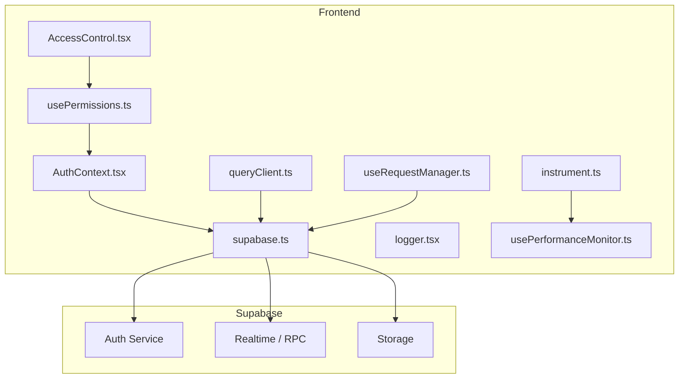
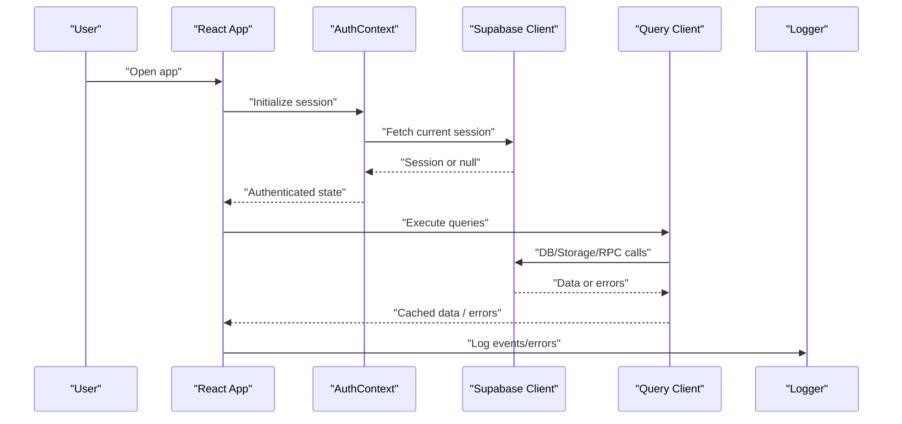
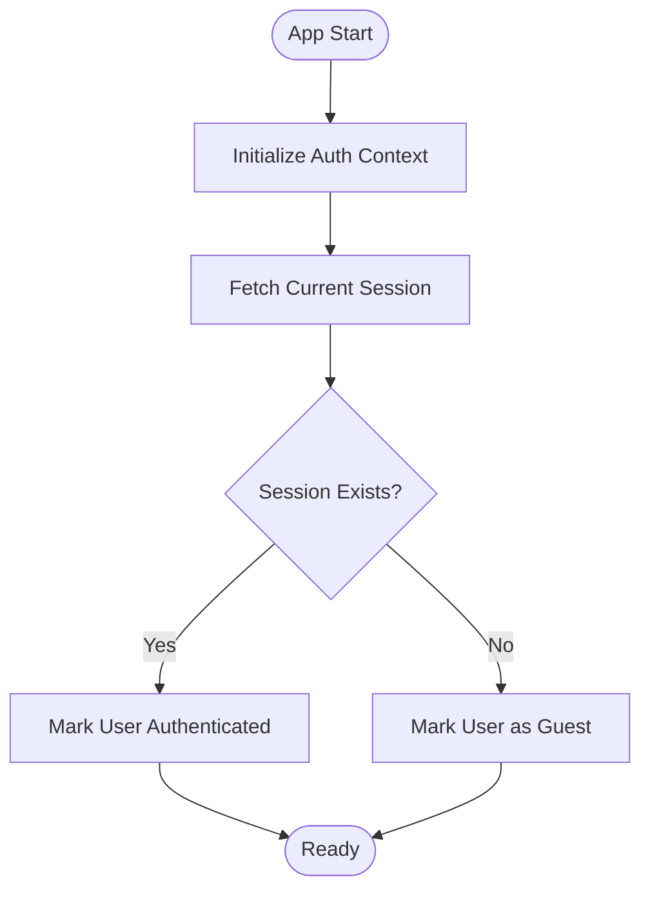
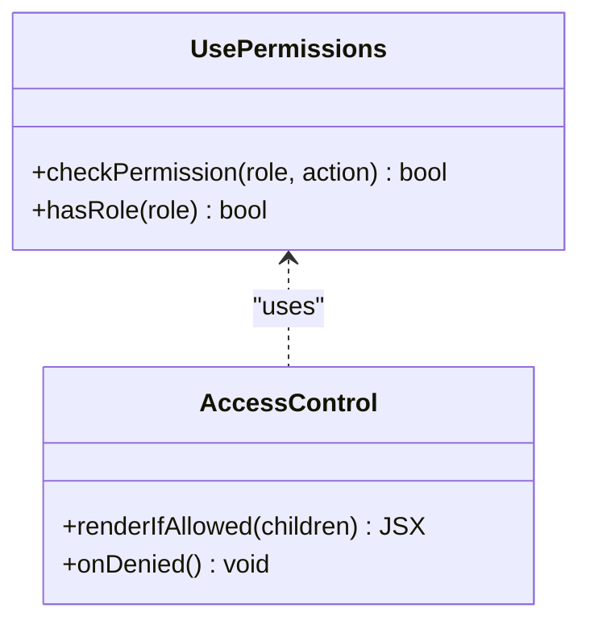
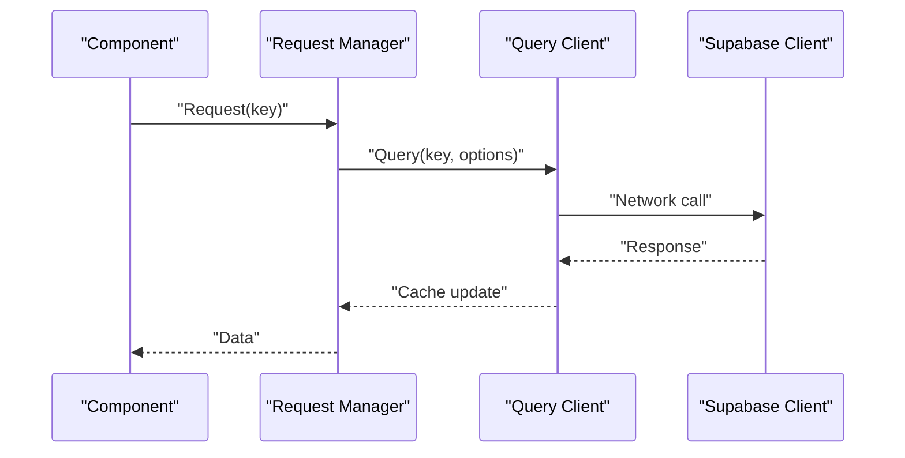
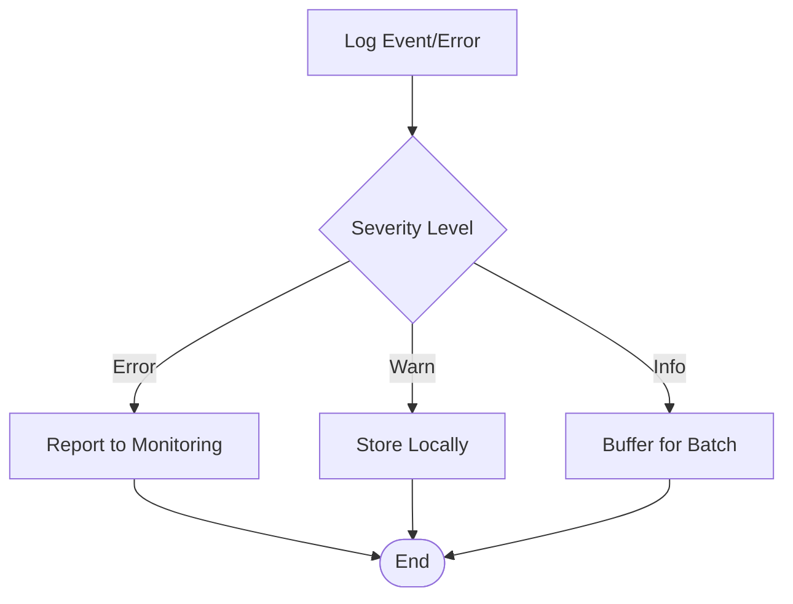
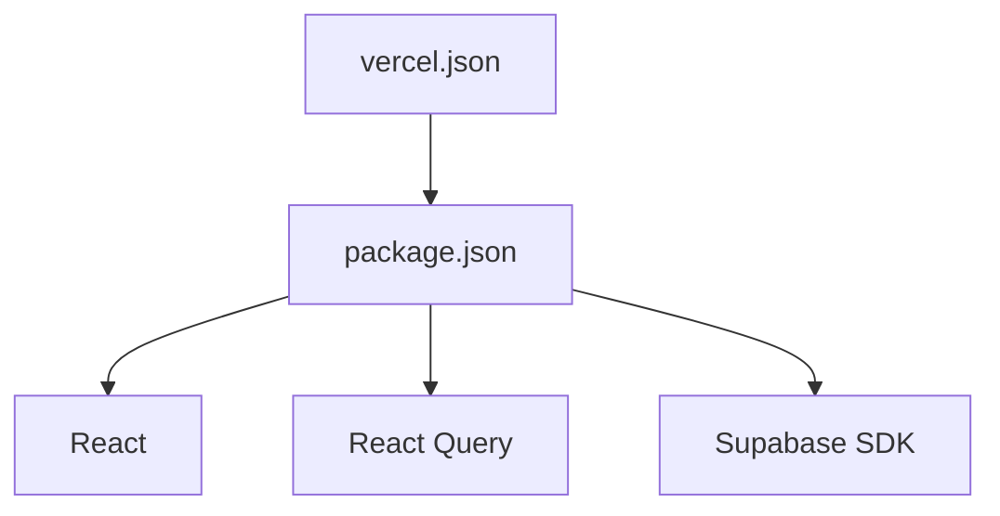

# Troubleshooting & FAQ

<cite>
**Referenced Files in This Document**
- [AuthContext.tsx](file://src/contexts/AuthContext.tsx)
- [supabase.ts](file://src/lib/supabase.ts)
- [queryClient.ts](file://src/config/queryClient.ts)
- [logger.tsx](file://src/lib/logger.tsx)
- [usePermissions.ts](file://src/hooks/usePermissions.ts)
- [AccessControl.tsx](file://src/pages/AccessControl.tsx)
- [instrument.ts](file://src/instrument.ts)
- [usePerformanceMonitor.ts](file://src/hooks/usePerformanceMonitor.ts)
- [useRequestManager.ts](file://src/hooks/useRequestManager.ts)
- [package.json](file://package.json)
- [vercel.json](file://vercel.json)
- [database-setup.sql](file://src/database-setup.sql)
- [fix_rls.sql](file://src/database-fix-rls.sql)
- [database-indexes.sql](file://database-indexes.sql)
</cite>

## Table of Contents
1. [Introduction](#introduction)
2. [Project Structure](#project-structure)
3. [Core Components](#core-components)
4. [Architecture Overview](#architecture-overview)
5. [Detailed Component Analysis](#detailed-component-analysis)
6. [Dependency Analysis](#dependency-analysis)
7. [Performance Considerations](#performance-considerations)
8. [Troubleshooting Guide](#troubleshooting-guide)
9. [Conclusion](#conclusion)
10. [Appendices](#appendices)

## Introduction
This document provides comprehensive troubleshooting and frequently asked questions for the MEP Project ERP system. It focuses on development, deployment, and production issues with step-by-step resolution guides. Topics include React component debugging, Supabase integration problems, database query optimization, performance bottlenecks, memory leaks, browser compatibility, authentication and authorization issues, security-related concerns, diagnostic tools, log analysis, error message interpretation, escalation procedures, and support contacts.

## Project Structure
The web application is a React-based frontend integrated with Supabase for authentication, data access, and storage. Key areas relevant to troubleshooting:
- Authentication context and session management
- Supabase client configuration and environment variables
- Query client setup for caching and retries
- Logging utilities for diagnostics
- Permission hooks and access control components
- Performance monitoring instrumentation
- Request manager for deduplication and cancellation
- Deployment configuration for Vercel
- Database setup and RLS policies

**Diagram sources**
- [AuthContext.tsx](file://src/contexts/AuthContext.tsx)
- [supabase.ts](file://src/lib/supabase.ts)
- [queryClient.ts](file://src/config/queryClient.ts)
- [logger.tsx](file://src/lib/logger.tsx)
- [usePermissions.ts](file://src/hooks/usePermissions.ts)
- [AccessControl.tsx](file://src/pages/AccessControl.tsx)
- [instrument.ts](file://src/instrument.ts)
- [usePerformanceMonitor.ts](file://src/hooks/usePerformanceMonitor.ts)
- [useRequestManager.ts](file://src/hooks/useRequestManager.ts)

**Section sources**
- [AuthContext.tsx](file://src/contexts/AuthContext.tsx)
- [supabase.ts](file://src/lib/supabase.ts)
- [queryClient.ts](file://src/config/queryClient.ts)
- [logger.tsx](file://src/lib/logger.tsx)
- [usePermissions.ts](file://src/hooks/usePermissions.ts)
- [AccessControl.tsx](file://src/pages/AccessControl.tsx)
- [instrument.ts](file://src/instrument.ts)
- [usePerformanceMonitor.ts](file://src/hooks/usePerformanceMonitor.ts)
- [useRequestManager.ts](file://src/hooks/useRequestManager.ts)

## Core Components
- Authentication Context: Manages user session state, login/logout flows, and rehydration from local storage.
- Supabase Client: Initializes the Supabase SDK with environment variables and configures auth and realtime connections.
- Query Client: Configures React Query (TanStack Query) for caching, retries, background updates, and error handling.
- Logger: Centralized logging utility for structured logs and error reporting.
- Permissions Hook: Provides role-based checks and permission evaluation across features.
- Access Control Component: Guards routes and UI elements based on permissions.
- Instrumentation: Global performance and error instrumentation.
- Performance Monitor: Hooks to measure render times and heavy operations.
- Request Manager: Deduplicates requests, handles cancellation, and prevents duplicate network calls.

**Section sources**
- [AuthContext.tsx](file://src/contexts/AuthContext.tsx)
- [supabase.ts](file://src/lib/supabase.ts)
- [queryClient.ts](file://src/config/queryClient.ts)
- [logger.tsx](file://src/lib/logger.tsx)
- [usePermissions.ts](file://src/hooks/usePermissions.ts)
- [AccessControl.tsx](file://src/pages/AccessControl.tsx)
- [instrument.ts](file://src/instrument.ts)
- [usePerformanceMonitor.ts](file://src/hooks/usePerformanceMonitor.ts)
- [useRequestManager.ts](file://src/hooks/useRequestManager.ts)

## Architecture Overview
The application uses a layered architecture:
- UI Layer: React components and pages
- State Layer: Auth context and React Query cache
- Integration Layer: Supabase client for auth, DB, storage, and realtime
- Diagnostics Layer: Logging, performance monitoring, and request management

**Diagram sources**
- [AuthContext.tsx](file://src/contexts/AuthContext.tsx)
- [supabase.ts](file://src/lib/supabase.ts)
- [queryClient.ts](file://src/config/queryClient.ts)
- [logger.tsx](file://src/lib/logger.tsx)

## Detailed Component Analysis

### Authentication Flow
- Session initialization occurs at app start via the authentication context.
- The Supabase client retrieves the current session and persists it locally.
- On logout, the session is cleared and local storage is updated.
- Errors during session fetch are logged and surfaced to the UI.

**Diagram sources**
- [AuthContext.tsx](file://src/contexts/AuthContext.tsx)
- [supabase.ts](file://src/lib/supabase.ts)

**Section sources**
- [AuthContext.tsx](file://src/contexts/AuthContext.tsx)
- [supabase.ts](file://src/lib/supabase.ts)

### Authorization and Access Control
- Role-based checks are implemented via a permissions hook.
- Access control components guard routes and UI elements.
- Denials are logged and can be surfaced to users with helpful messages.

**Diagram sources**
- [usePermissions.ts](file://src/hooks/usePermissions.ts)
- [AccessControl.tsx](file://src/pages/AccessControl.tsx)

**Section sources**
- [usePermissions.ts](file://src/hooks/usePermissions.ts)
- [AccessControl.tsx](file://src/pages/AccessControl.tsx)

### Data Access and Caching
- React Query client is configured for retries, stale time, and refetch strategies.
- Requests are deduplicated and cancellable via the request manager.
- Errors are captured and logged; UI shows appropriate feedback.

**Diagram sources**
- [queryClient.ts](file://src/config/queryClient.ts)
- [useRequestManager.ts](file://src/hooks/useRequestManager.ts)
- [supabase.ts](file://src/lib/supabase.ts)

**Section sources**
- [queryClient.ts](file://src/config/queryClient.ts)
- [useRequestManager.ts](file://src/hooks/useRequestManager.ts)
- [supabase.ts](file://src/lib/supabase.ts)

### Logging and Diagnostics
- Structured logging captures events, errors, and performance metrics.
- Global instrumentation initializes performance monitors and error handlers.
- Logs can be filtered by severity and feature area.

**Diagram sources**
- [logger.tsx](file://src/lib/logger.tsx)
- [instrument.ts](file://src/instrument.ts)

**Section sources**
- [logger.tsx](file://src/lib/logger.tsx)
- [instrument.ts](file://src/instrument.ts)

## Dependency Analysis
Key runtime dependencies and their roles:
- Supabase SDK: Authentication, database, storage, and realtime.
- React Query: Data fetching, caching, and synchronization.
- Vercel: Deployment platform configuration.
- Package scripts: Build, lint, test, and dev server commands.

**Diagram sources**
- [package.json](file://package.json)
- [vercel.json](file://vercel.json)

**Section sources**
- [package.json](file://package.json)
- [vercel.json](file://vercel.json)

## Performance Considerations
- Use virtualization for large tables and lists to reduce DOM size.
- Debounce search inputs and filter changes to limit re-renders.
- Prefer pagination and cursor-based loading for large datasets.
- Leverage React Query caching and background refetching effectively.
- Profile components using performance monitor hooks to identify hotspots.
- Avoid unnecessary re-renders by memoizing expensive computations and stable references.
- Optimize images and assets; compress before upload to storage.

[No sources needed since this section provides general guidance]

## Troubleshooting Guide

### Development Environment Issues
- Symptoms:
  - Local dev server fails to start or build errors occur.
  - Hot reload not working or inconsistent behavior.
- Steps:
  - Verify Node.js version matches project requirements.
  - Clear caches and reinstall dependencies.
  - Check environment variables for required keys.
  - Review package scripts and ensure correct command execution.
- Resolution:
  - Align toolchain versions.
  - Rebuild node modules and clear lock files if necessary.
  - Validate environment variable presence and format.

**Section sources**
- [package.json](file://package.json)

### Deployment Issues (Vercel)
- Symptoms:
  - Build succeeds locally but fails on Vercel.
  - Runtime errors due to missing environment variables.
- Steps:
  - Confirm all required environment variables are set in Vercel dashboard.
  - Ensure build output paths match Vercel expectations.
  - Check for platform-specific differences in file paths or APIs.
- Resolution:
  - Add missing variables and redeploy.
  - Adjust build configuration if needed.
  - Validate post-build steps and asset publishing.

**Section sources**
- [vercel.json](file://vercel.json)

### Authentication Problems
- Symptoms:
  - Users cannot log in or sessions reset unexpectedly.
  - Redirect loops after login or logout.
- Steps:
  - Verify Supabase project URL and anon/public key.
  - Check local storage for corrupted session entries.
  - Inspect auth context initialization and session persistence logic.
  - Review Supabase auth settings (providers, email templates).
- Resolution:
  - Correct environment variables.
  - Clear local storage and retry login.
  - Fix provider configurations in Supabase dashboard.

**Section sources**
- [AuthContext.tsx](file://src/contexts/AuthContext.tsx)
- [supabase.ts](file://src/lib/supabase.ts)

### Authorization and Permission Errors
- Symptoms:
  - Features hidden or inaccessible despite valid login.
  - “Access denied” messages on specific actions.
- Steps:
  - Confirm user roles and permissions in the database.
  - Validate permission checks in the permissions hook.
  - Ensure access control components wrap protected routes correctly.
- Resolution:
  - Update user roles or assign permissions.
  - Fix permission logic mismatches.
  - Wrap UI/route guards appropriately.

**Section sources**
- [usePermissions.ts](file://src/hooks/usePermissions.ts)
- [AccessControl.tsx](file://src/pages/AccessControl.tsx)

### Supabase Integration Issues
- Symptoms:
  - Network errors when querying data or uploading files.
  - Realtime subscriptions failing or disconnecting.
- Steps:
  - Check Supabase client configuration and environment variables.
  - Validate RLS policies and table permissions.
  - Inspect network tab for HTTP status codes and payloads.
  - Review storage bucket permissions and CORS settings.
- Resolution:
  - Fix RLS policies and grants.
  - Adjust CORS and storage rules.
  - Handle transient errors with retries and backoff.

**Section sources**
- [supabase.ts](file://src/lib/supabase.ts)
- [fix_rls.sql](file://src/database-fix-rls.sql)

### Database Setup and Migration Issues
- Symptoms:
  - Missing tables or columns after migration.
  - Foreign key constraints failing.
- Steps:
  - Run database setup script to initialize schema.
  - Apply incremental migrations in order.
  - Verify indexes and constraints exist.
- Resolution:
  - Re-run setup and migrations.
  - Fix constraint violations and backfill data where needed.

**Section sources**
- [database-setup.sql](file://src/database-setup.sql)
- [database-indexes.sql](file://database-indexes.sql)

### Query Optimization
- Symptoms:
  - Slow page loads or list rendering.
  - High CPU usage during data operations.
- Steps:
  - Identify slow queries and add appropriate indexes.
  - Use pagination and selective field retrieval.
  - Leverage Supabase filters and joins efficiently.
- Resolution:
  - Create indexes on frequently queried columns.
  - Refactor queries to minimize payload size.
  - Cache results with React Query and tune stale times.

**Section sources**
- [database-indexes.sql](file://database-indexes.sql)
- [queryClient.ts](file://src/config/queryClient.ts)

### React Component Debugging
- Symptoms:
  - Unexpected re-renders or blank screens.
  - State inconsistencies across tabs.
- Steps:
  - Use React DevTools to inspect component tree and state.
  - Add logging around critical state transitions.
  - Memoize expensive computations and stabilize references.
- Resolution:
  - Fix dependency arrays in effects and hooks.
  - Avoid mutating state directly; use immutable updates.
  - Implement error boundaries for graceful degradation.

**Section sources**
- [logger.tsx](file://src/lib/logger.tsx)
- [usePerformanceMonitor.ts](file://src/hooks/usePerformanceMonitor.ts)

### Memory Leaks
- Symptoms:
  - Increasing memory usage over time.
  - Slower performance after prolonged usage.
- Steps:
  - Profile heap snapshots in Chrome DevTools.
  - Check for lingering event listeners and timers.
  - Ensure cleanup in useEffect and subscription teardown.
- Resolution:
  - Remove unused listeners and cancel pending requests.
  - Unsubscribe from realtime channels and storage events.
  - Avoid retaining large objects in closures.

**Section sources**
- [useRequestManager.ts](file://src/hooks/useRequestManager.ts)
- [instrument.ts](file://src/instrument.ts)

### Browser Compatibility Issues
- Symptoms:
  - Features not working in older browsers.
  - Polyfills missing or conflicts.
- Steps:
  - Check target browsers in build configuration.
  - Add polyfills for missing APIs.
  - Test across major browsers and devices.
- Resolution:
  - Update transpilation targets.
  - Include necessary polyfills and fallbacks.
  - Normalize behavior with feature detection.

**Section sources**
- [package.json](file://package.json)

### Security-Related Issues
- Symptoms:
  - Unauthorized access to sensitive data.
  - Storage uploads failing due to policy restrictions.
- Steps:
  - Audit RLS policies and storage rules.
  - Validate input sanitization and output encoding.
  - Enforce least privilege for service accounts.
- Resolution:
  - Tighten RLS policies to restrict row-level access.
  - Secure storage buckets with proper rules.
  - Implement server-side validations where applicable.

**Section sources**
- [fix_rls.sql](file://src/database-fix-rls.sql)
- [supabase.ts](file://src/lib/supabase.ts)

### Diagnostic Tools and Log Analysis
- Tools:
  - Browser DevTools for network, console, and performance profiling.
  - React DevTools for component inspection.
  - Application logger for structured events and errors.
- Techniques:
  - Filter logs by severity and feature area.
  - Correlate timestamps across frontend and backend.
  - Export logs for deeper analysis.
- Resolution:
  - Use logs to pinpoint failure points.
  - Reproduce issues with minimal steps and capture logs.
  - Escalate with full diagnostic artifacts.

**Section sources**
- [logger.tsx](file://src/lib/logger.tsx)
- [instrument.ts](file://src/instrument.ts)

### Error Message Interpretation
- Common patterns:
  - Network timeouts indicate connectivity or server availability issues.
  - Permission errors suggest misconfigured RLS or roles.
  - Validation errors point to malformed payloads or missing fields.
- Actions:
  - Map error codes to known categories.
  - Provide user-friendly messages and next steps.
  - Log detailed context for developers.

**Section sources**
- [logger.tsx](file://src/lib/logger.tsx)
- [queryClient.ts](file://src/config/queryClient.ts)

### Escalation Procedures
- When to escalate:
  - Persistent authentication failures after environment verification.
  - Data integrity issues requiring database fixes.
  - Performance regressions impacting multiple users.
- How to escalate:
  - Gather logs, screenshots, and reproduction steps.
  - Include environment details and recent changes.
  - Contact support team with categorized issue summary.

**Section sources**
- [logger.tsx](file://src/lib/logger.tsx)

### Support Contacts
- Internal support channel: [Insert contact information here]
- Documentation repository: [Insert link here]
- Issue tracker: [Insert link here]

[No sources needed since this section doesn't analyze specific files]

## Conclusion
This guide consolidates common issues and resolutions across development, deployment, and production for the MEP Project ERP system. By following the step-by-step procedures, leveraging diagnostic tools, and applying best practices for performance and security, teams can quickly resolve issues and maintain a reliable application. For complex cases, use the escalation procedures and provide comprehensive diagnostics to expedite support.

## Appendices

### Frequently Asked Questions
- How do I reset my password?
  - Use the password reset flow in the authentication context and verify email delivery settings in Supabase.
- Why am I seeing “Access denied” on a feature?
  - Check your role assignments and RLS policies; ensure the permissions hook evaluates correctly.
- How can I improve load times for large lists?
  - Enable pagination, virtualization, and optimize queries with indexes.
- What should I do if real-time updates stop working?
  - Verify realtime subscriptions and reconnect logic; check network and firewall settings.
- How do I enable debug logging in production?
  - Configure the logger to capture warnings and errors; avoid verbose info logs to reduce overhead.

[No sources needed since this section doesn't analyze specific files]