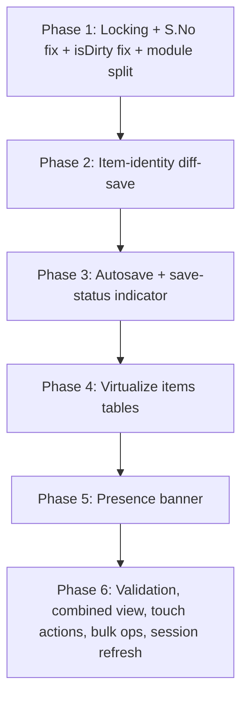

# PRD: CreateQuotation.tsx — Data Safety, Performance & UX Refactor

## 1. Feature Overview

`CreateQuotation.tsx` (5,175 lines, 64 `useState`, 16 `useEffect`, 8 `useMemo`, single component) works functionally today but carries risk and friction that only shows up at scale: multi-user editing, large quotations (50-150+ line items), and everyday interruptions (closed tabs, expired sessions).

This PRD defines a six-phase refactor that:
- Closes a **silent data-loss bug** under concurrent editing (P0)
- Fixes two **functional bugs** (S.No indexing, false dirty-state warning)
- Removes the remaining **performance bottleneck** (unvirtualized 100+ row table)
- Adds the **safety nets** expected of a multi-tenant SaaS ERP (autosave, presence awareness)
- Closes **UX gaps** that compound as quotations grow (validation timing, section switching, touch support, bulk actions, session handling)

Each phase ships and verifies independently. Nothing in Phase N+1 blocks on Phase N being "perfect" — but the recommended run order follows the risk ordering below, because later phases assume earlier structural changes exist (module split, snapshot-for-diffing, etc.).

**Target file(s) after Phase 1:**
```
apps/web/src/pages/CreateQuotation/
├── index.tsx
├── hooks/{useQuotationLoader,useQuotationMutations,useQuotationCalculations,useAutosave,usePresence}.ts
├── components/{QuotationHeaderForm,QuotationItemsTable,ErectionItemsSection,PresenceBanner,SaveStatusIndicator,QuotationActions}.tsx
└── utils/{calculationEngine,itemDiff}.ts
```

---

## 2. Problem Statement (full audit)

| # | Problem | Severity | Phase that closes it |
|---|---|---|---|
| 1 | `quotation_header.update()` has no version check — two users editing the same quotation, the later save silently overwrites the earlier one's header changes | P0 — silent data loss | Phase 1 |
| 2 | `quotation_items` is wholesale deleted and reinserted on every save, using the saving user's stale in-memory array — concurrent item edits from another user vanish with no warning | P0 — silent data loss | Phase 1 (locking catches the conflict) + Phase 2 (fixes the underlying destructive save) |
| 3 | Erection section S.No is computed as `items.slice(0, index)` where `index` is the position in the **filtered** section array, not the full array — S.No always resets near 1 for erection rows | Functional bug | Phase 1 |
| 4 | `useEffect(() => { if (!initLoading) setIsDirty(true) }, [initLoading])` marks the form dirty the instant loading finishes, even with zero user edits — triggers the browser "unsaved changes" warning on read-only visits | UX bug | Phase 1 |
| 5 | Row identity (`quotation_items.id`) is not preserved across saves — breaks any FK, audit log, or comment thread keyed to a specific item row | Data integrity | Phase 2 |
| 6 | No autosave — only a `beforeunload` warning. Closed tab / crashed browser / accidental nav = full data loss of unsaved work | High-frequency pain | Phase 3 |
| 7 | No virtualization on the items table — every keystroke in any cell re-renders every row once a quotation exceeds ~30-50 items | Performance | Phase 4 |
| 8 | No "someone else has this open" signal — conflicts are only discovered at save time, never prevented | Collaboration gap | Phase 5 |
| 9 | Validation (client selected, date range, etc.) only runs on Save click, not as the user fills the form | UX friction | Phase 6 |
| 10 | Materials/Erection sections are a full tab-swap — user loses context switching between them on mixed quotations | UX friction | Phase 6 |
| 11 | Row actions (delete, clear-item) are hover-reveal only — non-functional on touch/tablet, relevant for field-facing use | Accessibility | Phase 6 |
| 12 | No bulk operations — no multi-select delete, bulk discount override, or bulk section-move | Missing capability | Phase 6 |
| 13 | Session-expiry is handled as an inline workaround in `handleSave` (explicit code comment: caused the Save button to "appear dead") rather than a real background-refresh fix | UX / reliability | Phase 6 |

---

## 3. Overall Flow



---

## 4. Phase 1 — Concurrency Lock, S.No Fix, isDirty Fix, Module Split

### 4.1 Problem → Fix mapping
Closes audit items #1, #3, #4, and lays the structural groundwork (module split) that Phases 2-6 build on.

### 4.2 Implementation

**Optimistic locking** (closes #1):
```typescript
// On load, capture:
const [lastLoadedUpdatedAt, setLastLoadedUpdatedAt] = useState<string | null>(null);

// In handleSave, on the editId branch:
const { data: updatedHeader, error: updateError } = await supabase
  .from('quotation_header')
  .update(quotationData)
  .eq('id', editId)
  .eq('organisation_id', organisation?.id)
  .eq('updated_at', lastLoadedUpdatedAt) // concurrency guard
  .select('id, updated_at');

if (updateError || !updatedHeader || updatedHeader.length === 0) {
  toast.error('Save Conflict', {
    description: 'This quotation has been modified by another user. Please reload to fetch changes.'
  });
  return;
}
setLastLoadedUpdatedAt(updatedHeader[0].updated_at);
```
Falls back to the `revision_no` integer column as the concurrency token if `quotation_header.updated_at` doesn't exist or isn't reliably trigger-maintained — verify this against the schema before writing the guard clause.

**S.No fix** (closes #3):
```typescript
const materialItems = useMemo(() => items.filter(i => i.section !== 'erection'), [items]);
const erectionItems = useMemo(() => items.filter(i => i.section === 'erection'), [items]);
// Materials table: S.No = index + 1 (within materialItems)
// Erection table:  S.No = materialItems.filter(i => !i.is_header && !i.is_subtotal).length + index + 1
```

**isDirty fix** (closes #4):
- Delete the `if (!initLoading) setIsDirty(true)` effect entirely.
- Confirm every mutation path (`updateItem`, `removeItem`, `moveToSerialNo`, form field `onChange`) explicitly calls `setIsDirty(true)` at the point of mutation — `removeItem` already does this correctly; use it as the reference pattern for any path that doesn't.

**Module split**: extract `QuotationHeaderForm`, `QuotationItemsTable`, `ErectionItemsSection`, `useQuotationLoader`, `useQuotationMutations`, `useQuotationCalculations` per the directory layout in §1. Pass `materialItems`/`erectionItems` down as props rather than the full `items` array + a section filter.

### 4.3 Edge Cases
- `updated_at` column missing or not trigger-maintained → fall back to `revision_no`, increment it manually on every successful save.
- User has been on the page long enough that `lastLoadedUpdatedAt` is very stale (hours) — conflict toast should still fire correctly; no special-casing needed, the `.eq()` guard handles any staleness uniformly.
- A section (materials or erection) is completely empty — S.No computation must not throw on an empty array (`.length` on `[]` is `0`, so this is naturally safe).

### 4.4 Bottlenecks
- Module split is the largest mechanical change in the whole plan (touches the entire file) — do this as its own reviewed PR, not bundled silently inside the locking fix, so a regression is easy to bisect.

### 4.5 Verification
1. Two tabs, same quotation: save in Tab B, then Tab A — Tab A blocked with the conflict toast, Tab B's changes intact.
2. Materials S.No: `1, 2, 3...` continuous. Erection S.No: starts at `materialCount + 1`, continuous from there.
3. Open a quotation read-only, close the tab — no "unsaved changes" browser warning. Edit one field, close — warning appears.
4. `pnpm --filter=web build` — zero type errors after the module split.

---

## 5. Phase 2 — Item-Identity-Preserving Save

### 5.1 Problem → Fix mapping
Closes audit item #5, and is the real fix for #2 (Phase 1's locking only guards the header; items are still destructively rewritten every save).

### 5.2 Implementation
```typescript
// utils/itemDiff.ts
async function saveItemsDiff(quotationId: string, currentItems: Item[], originalItems: Item[]) {
  const originalById = new Map(originalItems.map(i => [i.id, i]));
  const currentById = new Map(currentItems.map(i => [i.id, i]));

  const toInsert = currentItems.filter(i => typeof i.id === 'string' && i.id.startsWith('new-'));
  const toUpdate = currentItems.filter(i => {
    const orig = originalById.get(i.id);
    return orig && !isEqual(orig, i);
  });
  const toDelete = originalItems.filter(i => !currentById.has(i.id));

  await Promise.all([
    toDelete.length && supabase.from('quotation_items').delete().in('id', toDelete.map(i => i.id)),
    toInsert.length && supabase.from('quotation_items').insert(toInsert.map(stripTempId)),
    ...toUpdate.map(i => supabase.from('quotation_items').update(i).eq('id', i.id)),
  ]);
}
```
- New rows get a client-side temp id (`new-<uuid>`) until the DB assigns a real one.
- `originalItems` is the snapshot captured at load and refreshed after every successful save — same snapshot doubles as the reference for a future `isEqual`-based dirty check if you want to tighten Phase 1's dirty tracking further.
- `display_order` must be included in every `toUpdate` payload so existing reordering (drag, "Move To") keeps persisting correctly.

### 5.3 Edge Cases
- An item was deleted by User A and edited by User B concurrently → B's save will attempt an `update` on a row that no longer exists (0 rows affected, not an error in Supabase by default) — decide explicitly whether this should surface a toast ("that item was removed by someone else") or fail silently; recommend surfacing it, reusing the Phase 1 conflict-toast pattern.
- Bulk-add or AI-document-parser flows that insert many rows at once must also tag new rows with the `new-` temp-id convention, or they'll be misclassified as updates.

### 5.4 Bottlenecks
- `Promise.all` fires one `update` call per changed row — fine at typical edit-session scale (a handful of changed rows), but if a bulk operation (Phase 6.4) changes 50 rows at once, batch those into a single RPC or upsert call instead of 50 individual requests.

### 5.5 Verification
1. Edit 2 fields on an 80-item quotation, save — network tab shows 2 `update` calls, not a delete+insert of all 80.
2. If any feature links to `quotation_items.id` (comments, audit log), confirm the link survives a save.
3. Delete a row, add a row, edit a third — one save call reflects delete + insert + update correctly, `display_order` sequential afterward.

---

## 6. Phase 3 — Autosave + Save-Status Indicator

### 6.1 Problem → Fix mapping
Closes audit item #6.

### 6.2 Implementation
```typescript
// hooks/useAutosave.ts
useEffect(() => {
  if (!isDirty) return;
  const timer = setTimeout(() => {
    silentSave(); // reuses Phase 1 locking + Phase 2 diff-save, skips status-change side effects
  }, 3000);
  return () => clearTimeout(timer);
}, [items, formData, isDirty]);
```
- Status indicator (new `SaveStatusIndicator.tsx`) shows `Saved` / `Saving…` / `Unsaved changes` near the header.
- Autosave persists data only — it must not trigger status transitions (Draft → Sent) or approval-workflow side effects that the explicit manual Save button is responsible for.
- Reuses the exact same mutation path as manual save, so a conflict during autosave surfaces the same toast from Phase 1, not a separate silent failure.

### 6.3 Edge Cases
- User is mid-keystroke when the 3s timer fires — debounce must reset on every `items`/`formData` change, not just fire once after the first edit (the `useEffect` cleanup on `[items, formData, isDirty]` change already handles this correctly as written).
- Autosave fires while a manual save is already in-flight → guard with the existing `saving` state check (`if (saving) return`), same guard `handleSave` already uses.
- Autosave hits a conflict → same toast as manual save; the "Unsaved changes" indicator should reflect that the local state is now stale, not flip to "Saved" incorrectly.

### 6.4 Bottlenecks
- None expected — reuses the diff-save path from Phase 2, which is already the low-payload option.

### 6.5 Verification
1. Edit a field, wait 3s without clicking Save, refresh — edit persisted.
2. Trigger a two-tab conflict during the autosave window — same conflict toast as manual save fires.
3. Confirm autosave never changes `status` field or fires approval-related side effects.

---

## 7. Phase 4 — Virtualize the Items Tables

### 7.1 Problem → Fix mapping
Closes audit item #7 — the remainder of the original performance bottleneck not addressed by the Phase 1 module split.

### 7.2 Implementation
- `@tanstack/react-table` is already a dependency (used today only for the item picker) — pair it with `@tanstack/react-virtual` inside `QuotationItemsTable.tsx` and `ErectionItemsSection.tsx`.
- Only rows in the visible viewport (+ overscan buffer) mount full input/select components; off-screen rows render as fixed-height placeholders.

### 7.3 Edge Cases
- Header rows and subtotal rows (`is_header`, `is_subtotal`) have different heights than regular item rows — virtualization needs per-row height awareness, not a fixed uniform row height, or scroll position will drift.
- Keyboard focus on scroll: a common virtualization regression is losing input focus when the focused row scrolls out of the rendered window — test tab-through behavior explicitly.
- The "Move To" feature and drag-and-drop reordering must still work with virtualized rows — dragging to a row that's currently unmounted (off-screen) needs an auto-scroll-while-dragging behavior, or it becomes impossible to drop onto off-screen targets.

### 7.4 Bottlenecks
- None new — this phase removes a bottleneck rather than introducing one, but is the most likely phase to introduce rendering regressions (focus loss, uneven row heights) given the header/subtotal row-height variance.

### 7.5 Verification
1. Load a 150-item quotation, type continuously in a cell — no visible lag.
2. Scroll to the middle of the table, click into a cell, tab through several rows — focus tracks correctly, no jump.
3. Drag a row toward the bottom of a long list (off-screen target) — auto-scroll engages, drop succeeds.
4. "Move To" a row across a header/subtotal boundary — no layout jump or overlap.

---

## 8. Phase 5 — Presence Banner

### 8.1 Problem → Fix mapping
Closes audit item #8. This is a prevention layer on top of Phase 1's detection layer — locking tells you *after* a conflict happens; presence tells you *before* you start editing.

### 8.2 Implementation
- Reuse the existing `last_active_at` presence pattern already built elsewhere in the app.
- On mount of the quotation page, upsert into a lightweight `document_locks` table (or `editing_by`/`editing_since` columns on `quotation_header`); clear on unmount or successful save.
- If another user's presence is detected on load, show a dismissible, non-blocking banner: *"Ramesh opened this quotation 2 minutes ago — your changes may conflict."*

### 8.3 Edge Cases
- User closes the tab without a clean unmount (crash, force-quit) — presence must expire via a timestamp + TTL check (e.g., "active" if `editing_since` is within the last N minutes), not rely solely on unmount cleanup firing.
- Two users open the quotation within seconds of each other — banner should show for whichever user's presence write lands second, and both should eventually see each other via periodic re-poll or the same realtime presence channel `last_active_at` already uses.
- This must stay a **warning, not a hard lock** — field staff may need to edit the same quotation across different sessions without being blocked outright.

### 8.4 Bottlenecks
- Presence writes on every mount could get noisy at high traffic — reuse whatever throttling/heartbeat interval the existing `last_active_at` pattern already uses rather than inventing a new one.

### 8.5 Verification
1. Open the same quotation in two sessions — second session shows the banner within one heartbeat interval.
2. Close the first session (or let it idle past the TTL) — banner clears or times out in the second session.
3. Confirm the banner never blocks editing or saving — it's advisory only.

---

## 9. Phase 6 — UX Polish

Closes audit items #9-#13. Each sub-phase is independently shippable.

### 9.1 Inline validation (#9)
- Move client/date-range/required-field checks from the bulk pre-flight block in `handleSave` into field-level `onBlur` handlers in `QuotationHeaderForm.tsx`.
- Reuse the existing `zod` `dateValidationSchema` per-field instead of only as a bulk check before save.
- **Edge case**: don't show validation errors before the user has interacted with a field (no "required" errors on initial render) — track touched state per field.

### 9.2 Combined section view (#10)
- Replace the `activeSection` full tab-swap with a single scrollable list: materials rows, a section divider, then erection rows, both tables rendered together rather than conditionally.
- **Edge case**: if either section is empty, the divider should collapse rather than show an empty header.

### 9.3 Touch-friendly row actions (#11)
- Replace opacity/transform hover-reveal buttons with always-visible icon buttons in the action column.
- **Edge case**: tap targets should meet a ~40px minimum on tablet viewports; verify no accidental double-fire on tap-then-scroll gestures.

### 9.4 Bulk operations (#12)
- Add row checkboxes to `QuotationItemsTable`; toolbar actions when 1+ rows selected: bulk delete, bulk discount override, bulk move-to-section.
- Bulk delete reuses the existing `removeItem` confirm-dialog pattern, extended to accept an array of ids.
- **Edge case**: bulk delete on rows with linked erection charges must reuse the existing "Delete Material & Erection Charges" confirmation flow (already in `removeItem`) for each affected row, not silently skip the linked-row warning at bulk scale.
- **Bottleneck**: per Phase 2 §5.4, batch bulk changes into fewer network calls rather than N individual `update`/`delete` calls.

### 9.5 Session-expiry UX (#13)
- Replace the inline `withTimeout(ensureValidSession(), ...)` workaround in `handleSave` with a background token-refresh timer independent of save actions (e.g., checked every 5 minutes).
- Only surface a re-login prompt if the background refresh itself fails.
- **Edge case**: in-flight autosave (Phase 3) during a session refresh must not be dropped — queue or retry once the refresh completes rather than failing the save.

### 9.6 Verification (all of 9.x)
1. Tab through the header form leaving a required field blank — inline error shows without clicking Save; no premature errors on untouched fields.
2. View a mixed quotation (materials + erection) on one continuous scroll — no tab click needed.
3. Test row actions on a tablet or touch emulator — tap targets work without hover.
4. Select 5 rows including one with a linked erection charge, bulk-delete — confirmation dialog correctly warns about the linked row, single batched delete call, `display_order` reindexes correctly.
5. Leave a tab open past session timeout — token refreshes silently, Save/autosave never appear unresponsive.

---

## 10. Full Verification Rollup

```bash
pnpm --filter=web build
```

| Phase | Key manual check |
|---|---|
| 1 | Two-tab conflict blocked; S.No correct in both sections; no false dirty warning |
| 2 | Partial edit on 80-item quotation → only changed rows hit network; linked rows survive save |
| 3 | Edit + wait 3s + refresh → persisted; conflict toast fires during autosave too |
| 4 | 150-item quotation, no typing lag; focus survives scroll; drag auto-scrolls to off-screen targets |
| 5 | Second session shows presence banner; banner is advisory, never blocking |
| 6 | Inline validation, combined view, touch actions, bulk delete with linked-row warning, silent session refresh — all verified per 9.6 |

---

## 11. Recommended Run Order

Run and verify one phase per OpenCode session, in order: **1 → 2 → 3 → 4 → 5 → 6**. Phase 1's module split changes file structure and line numbers enough that Phase 2's prompt should be written fresh against the post-Phase-1 file, not against the current monolithic file.
