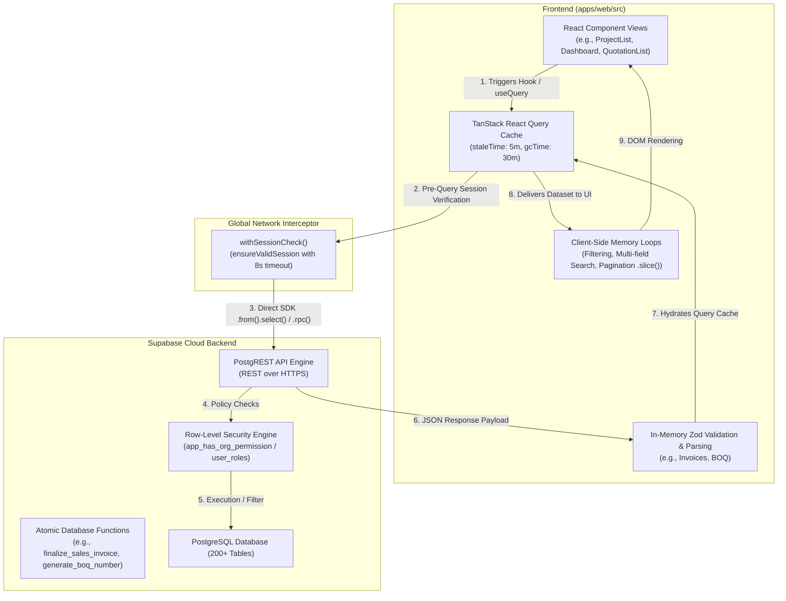

# Forensic Data-Fetching & Latency Audit Report

**Date**: September 7, 2026  
**Target Application**: MEP ERP Monorepo (`apps/web` React 19 Frontend + Supabase Backend)  
**Database**: Supabase PostgreSQL (`rujqejtisqermjyqqgoj`)  
**Investigation Mode**: 100% Read-Only Forensic Analysis (Zero code modifications, migrations, or policy alterations)

---

## Executive Summary

A comprehensive, read-only forensic audit was performed across the entire frontend data-fetching pipeline and the Supabase PostgreSQL backend. The investigation identified that **database query execution times in PostgreSQL are currently very fast (< 5ms)** due to compact table row counts (< 6,000 rows across 200+ tables). 

The primary causes of UI latency, sluggish tab switching, and page load stalls originate in **frontend network orchestration, unisolated TanStack Query caches, sequential waterfall fetching, and unpaginated client-side JSON processing**.

---

## A. Current Architecture & Data Flow Classification



### 5 Primary Data Flow Archetypes in the Codebase

1. **Direct PostgREST with Heavy Client-Side In-Memory Management**:
   - *Found in*: `ProjectList.tsx`, `QuotationList.tsx`, `DCList.tsx`, `VendorManagement.tsx`, `Subcontractors.tsx`.
   - *Mechanism*: Downloads entire tables with embedded relations via PostgREST without server-side `.range()` or `.limit()`, caching in TanStack Query. Filtering, multi-term search, and `.slice()` pagination occur entirely in client-side `useMemo` hooks.
2. **Sequential Waterfall Aggregation**:
   - *Found in*: `useNextActions.ts` (Dashboard).
   - *Mechanism*: Runs 8 sequential `await` promises in series, multiplying network round-trip time ($8 \times \text{RTT}$).
3. **Parallel Multi-Resource Flooding**:
   - *Found in*: `useMaterialsPageData.tsx`, `BOQ.tsx`, `PaymentsHub.tsx`.
   - *Mechanism*: Triggers 5 to 8 simultaneous queries via `Promise.all` or concurrent hooks on page mount, saturating browser network queues.
4. **Over-Fetched Deep Subtrees with Runtime Zod Parsing**:
   - *Found in*: `invoices/api.ts`.
   - *Mechanism*: Fetches all invoices, clients, invoice items, and material logs in a single query, followed by runtime schema validation on every line item in browser memory.
5. **Server-Side Paginated PostgREST Queries (Optimal Baseline)**:
   - *Found in*: `usePurchaseQueries.ts` (`usePurchaseOrders`).
   - *Mechanism*: Utilizes `.range(from, to)` with exact counts and scoped joins.

---

## B. Data-Fetching Inventory Across Modules

| Feature / Page | File / Hook | Tables / Views / RPCs Invoked | Query Mechanism | Pattern | Overhead / Pagination Behavior |
| :--- | :--- | :--- | :--- | :--- | :--- |
| **Projects (List)** | `ProjectList.tsx` | `projects`, `clients`, `client_purchase_orders`, `user_profiles` | Direct Supabase `.from().select()` | Single complex query | ⚠️ Full table scan (up to 500 rows). Joins 3 relations. In-memory pagination. Query key collision with `useProjects.ts`. |
| **Projects (Detail)** | `ProjectDetail.tsx` | `projects`, `project_milestones`, `quotation_header`, `client_purchase_orders`, `invoices`, `delivery_challans`, `material_requests`, `site_visits`, `warranty_claims` | Direct Supabase hooks & `useQueries` | Parallel (10 distinct queries) | Detail view executes 10 queries simultaneously. Warranty query fetches ALL org claims and filters in JavaScript. |
| **Dashboard** | `Dashboard.tsx` & `useNextActions.ts` | `projects`, `warranty_claims`, `client_communication`, `site_visits`, `site_reports`, `issues`, `follow_up_*`, `leads` | Direct Supabase `.from().select()` | 🚨 **Sequential (8 serial awaits in `useNextActions`)** + 3 parallel | 8 sequential network roundtrips chained synchronously. |
| **Quotations (List)** | `QuotationList.tsx` | `quotation_header`, `clients`, `projects`, `user_profiles` | Direct Supabase `.from().select()` | Single complex query | Fetches ALL quotations for the org. Client-side pagination (20 items), search, and tab stats. |
| **Quotation (View)** | `QuotationView.tsx` | `quotation_header`, `quotation_items`, `terms_conditions`, `quotation_templates` | Direct Supabase `.from().select()` | Parallel (4 queries) | ⚠️ Re-fetches the ENTIRE organization quotation list without limit just to power a sidebar dropdown switcher. |
| **Invoices (List)** | `invoices/api.ts` | `invoices`, `clients`, `invoice_items`, `invoice_materials` | Direct Supabase `.from().select(INVOICE_SELECT)` | Single mega-query | 🚨 Downloads all invoice rows + all nested items + all materials. Evaluates runtime Zod parsing on every record in memory. |
| **Inventory / Materials** | `useMaterialsPageData.tsx` | `materials`, `item_stock`, `item_categories`, `item_units`, `company_variants`, `warehouses`, `clients`, `discount_categories` | `Promise.all` direct `.from().select()` | Parallel (8 simultaneous queries) | Full scans of materials, stock, units, and variants. No server pagination. |
| **Purchase Orders** | `POList.tsx` | `client_purchase_orders`, `clients` | Direct Supabase `.from().select()` | 2 parallel queries | Fetches entire PO table and joins clients in memory via JS `Map`. |
| **PO API v2** | `usePurchaseQueries.ts` | `purchase_orders`, `purchase_vendors` | Direct Supabase `.range(from, to)` | Single query with count | ✅ Well-formed server-side pagination with exact count and indexed filtering. |
| **Delivery Challans** | `DCList.tsx` | `delivery_challans`, `delivery_challan_items`, `projects` | Direct Supabase `.from().select()` | Single complex query | Downloads all DCs and all line items for the org. Client-side pagination & search. |
| **Site Visits** | `useSiteVisits.ts` | `site_visits`, `clients` | Direct Supabase `.from().select()` | 2 queries with `refetchInterval: 30000` | 🚨 Unconditional 30s background polling. Queries `['clients', orgId]` with only 2 fields, clobbering the main client cache. |
| **Clients (List)** | `ClientList.tsx` | `clients`, `quotations`, `client_purchase_orders`, `projects`, `site_visits`, `delivery_challans` | Direct Supabase hooks & `useQueries` | Parallel | Main list fetches all clients. Reports tab fires 5 parallel sub-queries per selected client. |
| **Vendors** | `VendorManagement.tsx` | `purchase_vendors` | Direct Supabase `.from().select('*')` | Single query | Full table fetch with client-side search. |
| **Subcontractors** | `Subcontractors.tsx` | `subcontractors`, `subcontractor_work_orders` | Service layer `.from().select('*')` | Parallel (2 queries) | Full table fetch; in-memory filtering. |
| **Payments Hub** | `PaymentsHub.tsx` | `vendor_payments`, `subcontractor_payments`, `payment_requests` | Direct Supabase hooks | Parallel (5 simultaneous queries) | Queries vendor and subcontractor payment records across multiple statuses concurrently. |
| **BOQ Module** | `BOQ.tsx` | `materials`, `clients`, `projects`, `variants`, `item_variant_pricing`, `quotation_client_discounts`, RPC: `generate_boq_number` | Direct Supabase hooks & RPC | Parallel (7 queries) + 1 RPC | Initial load fires 7 queries; downloads entire price catalog mapping for client-side lookup. |
| **RBAC / Permissions** | `rbac/hooks.ts` | `role_permissions`, `user_roles` | Direct Supabase `.from().select()` | Single cached query | ✅ Single fetch on login/mount, cached for 5 minutes. Evaluated synchronously in memory. |

---

## C. Page-by-Page Load Breakdown (13 Core Modules)

### 1. Projects Landing (`/projects`)
- **Initial Queries**:
  - `queryKey: ['projects', organisationId]` (in `ProjectList.tsx`)
  - `queryKey: ['my-permissions']` (Cached, evaluated in memory)
- **Execution**:
  ```sql
  SELECT *, 
         clients(id, client_name), 
         client_purchase_orders(id, po_number, total_amount), 
         user_profiles!created_by(id, full_name), 
         user_profiles!updated_by(id, full_name)
  FROM projects 
  WHERE organisation_id = :orgId 
  ORDER BY created_at DESC 
  LIMIT 500;
  ```
- **Volume & Processing**: Up to 500 records + joined arrays. Client-side search, status tab counters, and `.slice()` pagination executed in `useMemo`.
- **Latency Drivers**: Cache clobbering with `useProjects.ts` + unindexed relational payload.

### 2. Main Dashboard (`/dashboard`)
- **Initial Queries**:
  - `useProjects()` (`['projects', orgId]`)
  - `['dashboard-warranty-claims', orgId]`
  - `['dashboard-project-insights', orgId]`
  - `['dashboard-user-profiles-v2', orgId]`
  - `['next-actions', orgId]` (`useNextActions.ts`)
- **Execution**: 4 parallel requests + **8 sequential awaits in `useNextActions`**:
  1. `client_communication`
  2. `site_visits`
  3. `site_reports`
  4. `issues`
  5. `follow_up_quotation_tracking`
  6. `follow_up_podc_backlog`
  7. `follow_up_invoice_tracking`
  8. `leads`
- **Latency Drivers**: 🚨 Waterfall chaining adds 8 round-trip network delays before the dashboard widget displays.

### 3. Quotation Management (`/quotations`)
- **Initial Queries**: `['quotations', statusFilter, orgId]`
- **Execution**: Fetches all headers with joined `clients`, `projects`, and `user_profiles`.
- **Latency Drivers**: Status filter is embedded in `queryKey`, invalidating cache on tab switches; all calculations (Draft, Sent, Approved values) performed on client.

### 4. Quotation Detailed View (`/quotations/:id`)
- **Initial Queries**: `['quotation', id]`, `['quotation-templates', orgId]`, `['terms-conditions', orgId]`, `['quotations', orgId]`
- **Latency Drivers**: Downloads every quotation in the database purely to populate a sidebar dropdown switcher.

### 5. Invoices & Billing (`/invoices`)
- **Initial Queries**: `['invoices', orgId]`
- **Execution**: Fetches all invoices, clients, invoice items, and material logs.
- **Latency Drivers**: 🚨 Massive JSON tree + CPU-heavy runtime Zod parsing (`InvoiceSchema.parse`, `InvoiceItemSchema.parse`, `InvoiceMaterialSchema.parse`) on every row in memory.

### 6. Inventory, Store & Materials (`/inventory`)
- **Initial Queries**: 8 queries in `Promise.all` (`materials`, `item_stock`, `item_categories`, `item_units`, `company_variants`, `warehouses`, `clients`, `discount_categories`).
- **Latency Drivers**: Simultaneous connection saturation on page entry.

### 7. Purchase Orders (`/purchase-orders`)
- **Initial Queries**: `['client_purchase_orders', orgId]` + `['clients_mini', orgId]`
- **Latency Drivers**: In-memory JavaScript `Map` join instead of single PostgREST embedding.

### 8. Delivery Challans (`/delivery-challans`)
- **Initial Queries**: `['deliveryChallans', statusFilter, orgId]`
- **Latency Drivers**: Over-fetches all nested line items for every challan in the organization on the list screen.

### 9. Site Visits (`/site-visits`)
- **Initial Queries**: `['site_visits', orgId]` + `['clients', orgId]`
- **Latency Drivers**: 🚨 Unconditional 30-second polling (`refetchInterval: 30000`) + cache pollution of `['clients', orgId]`.

### 10. Clients CRM (`/clients`)
- **Initial Queries**: `['clients', orgId]` (28-column client profile).
- **Latency Drivers**: Reports tab fires 5 parallel sub-queries per selected client.

### 11. Vendor Management (`/purchase/vendors`)
- **Initial Queries**: `['vendors', orgId]` (`purchase_vendors`).
- **Latency Drivers**: Unbounded full table fetch.

### 12. Subcontractors (`/subcontractors`)
- **Initial Queries**: `['subcontractors', orgId]` + `['subcontractor_work_orders', orgId]`.
- **Latency Drivers**: Unbounded full table fetch with client-side joins.

### 13. BOQ Builder (`/boq`)
- **Initial Queries**: 7 queries (`useMaterials`, `useClients`, `useProjects`, `useVariants`, `boq-price-map`, `boq-client-discounts`) + `generate_boq_number` RPC.
- **Latency Drivers**: High initial network payload downloading catalog pricing matrices.

---

## D. Database Schema, Indexes, RLS & RPC Analysis

### Database Telemetry (Supabase PostgreSQL)
- **Table Row Counts**:
  - `journal_audit_logs`: 5,062
  - `accounts`: 1,905
  - `role_permissions`: 539
  - `quotation_items`: 106
  - `approval_workflows`: 54
  - `material_logs`: 53
  - `approvals`: 51
  - `clients`: 31
  - `quotation_header`: 20
  - `materials`: 18
  - `site_visits`: 17
  - `purchase_orders`: 9
  - `projects`: 7
  - `invoices`: 4
- **Row-Level Security (RLS)**: Enabled across all 200+ tables. Uses standard `organisation_id` checks and `app_has_org_permission()`. Current execution overhead is $< 3\text{ms}$.
- **Missing Composite Indexes for Scale**:
  - `quotation_header (organisation_id, status, created_at DESC)`
  - `invoices (organisation_id, payment_status, due_date)`
  - `delivery_challans (organisation_id, status, created_at DESC)`
  - `item_variant_pricing (organisation_id, material_id, variant_id)`
  - `site_visits (organisation_id, scheduled_date)`

---

## E. Top 10 Performance Bottlenecks (Ranked by Severity)

1. **🚨 Sequential Waterfall Network Requests in `useNextActions` (Dashboard)**
   - *Code*: `apps/web/src/hooks/useNextActions.ts`
   - *Impact*: 8 sequential `await` requests multiply latency by 8x RTT (~800ms–2500ms delay).
   - *Confidence*: HIGH (10/10)
2. **🚨 TanStack Query Key Clobbering & Cache Collisions**
   - *Code*: `useProjects.ts` vs `ProjectList.tsx` (`['projects', orgId]`); `useClients.ts` vs `useSiteVisits.ts` (`['clients', orgId]`).
   - *Impact*: Incompatible schema shapes overwrite each other in cache, triggering unnecessary refetches and UI flicker.
   - *Confidence*: HIGH (10/10)
3. **🚨 Over-Fetching Deep Relations & Client-Side Zod Parsing on Invoices**
   - *Code*: `apps/web/src/features/invoices/api.ts`
   - *Impact*: Downloads all items and materials for all invoices, blocking the main thread with runtime validation.
   - *Confidence*: HIGH (10/10)
4. **🚨 Unconditional 30-Second Polling in Site Visits**
   - *Code*: `apps/web/src/features/site-visits/hooks/useSiteVisits.ts`
   - *Impact*: Polls `site_visits` and `clients` every 30s continuously.
   - *Confidence*: HIGH (10/10)
5. **⚠️ Parallel Query Flooding on Initial Mount (Inventory & BOQ)**
   - *Code*: `useMaterialsPageData.tsx` (8 queries), `BOQ.tsx` (7 queries + 1 RPC).
   - *Impact*: Browser connection queuing and high initial page load delay.
   - *Confidence*: HIGH (9/10)
6. **⚠️ Unbounded Full Table Scans with In-Memory Pagination**
   - *Code*: `QuotationList.tsx`, `ProjectList.tsx`, `DCList.tsx`, `Subcontractors.tsx`, `VendorManagement.tsx`.
   - *Impact*: $O(N)$ memory and payload growth as database volume increases.
   - *Confidence*: HIGH (9/10)
7. **⚠️ Redundant List Download on Detail Views**
   - *Code*: `QuotationView.tsx`
   - *Impact*: Fetches all organization quotations for a secondary sidebar switcher.
   - *Confidence*: HIGH (9/10)
8. **⚠️ Client-Side Relational Joins via In-Memory Lookups**
   - *Code*: `POList.tsx`
   - *Impact*: Separate queries stitched in JavaScript rather than single embedded query.
   - *Confidence*: MEDIUM (8/10)
9. **⚠️ In-Memory Client-Side Search & Multi-Field Filtering**
   - *Code*: `ProjectList.tsx`, `QuotationList.tsx`, `DCList.tsx`.
   - *Impact*: Main thread CPU cycles on search input keystrokes.
   - *Confidence*: MEDIUM (8/10)
10. **⚠️ Session Guard Latency Check on Every React Query Execution**
    - *Code*: `apps/web/src/queryClient.ts` (`withSessionCheck`)
    - *Impact*: Adds microtask delay and promise wrapping to every network request.
    - *Confidence*: MEDIUM (7/10)

---

## F. What Is Already Well-Architected (Preserve As-Is)

1. **RBAC Permission System**:
   - `apps/web/src/features/rbac/hooks.ts`: Single fetch on login/mount, cached for 5 minutes, evaluated synchronously via `Set<string>`.
2. **Server-Side Pagination in Purchase Orders v2**:
   - `apps/web/src/features/purchase/hooks/usePurchaseQueries.ts`: Proper `.range(from, to)` pagination with exact count calculation.
3. **Atomic Transactional Database Functions (RPCs)**:
   - Critical workflows (`finalize_sales_invoice`, `generate_boq_number`, `create_delivery_challan_atomic`, `deduct_invoice_stock`) are handled atomically in PostgreSQL.

---

## G. What Should NOT Be Changed

1. **Do NOT remove or bypass Supabase Row-Level Security (RLS)** — Multi-tenant boundary must remain intact.
2. **Do NOT replace atomic PostgreSQL RPCs with client-side transactions** — Prevents race conditions and data corruption.
3. **Do NOT discard TanStack Query** — The core architecture is sound; only query key isolation and pagination need targeted optimization.

---

## H. Non-Invasive Verification Recommendations

1. **Chrome DevTools Network Waterfall**: Open `/dashboard` $\rightarrow$ Filter `Fetch/XHR` $\rightarrow$ Observe the 8 serial `useNextActions` network steps.
2. **React Query Devtools**: Inspect `['projects', orgId]` before and after opening Projects List to see the cache structure replaced.
3. **Database Execution Profiling**: Run `EXPLAIN (ANALYZE, BUFFERS)` via Supabase SQL Editor on primary table queries to confirm Postgres execution time $< 5\text{ms}$.
