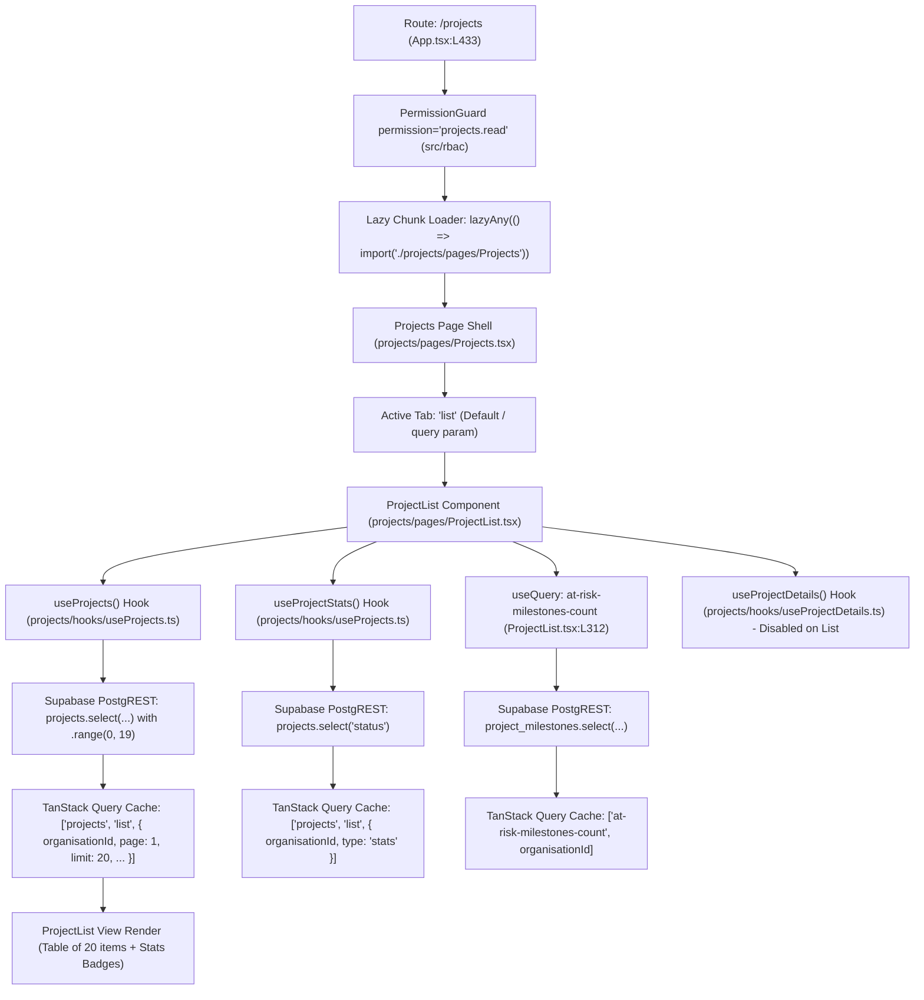

# Forensic Investigation Report: Projects Module (`/projects`)

**Date**: September 7, 2026  
**Target Module**: Projects Management (`/projects` & `apps/web/src/projects/pages/ProjectList.tsx`)  
**Database**: Supabase PostgreSQL (`rujqejtisqermjyqqgoj`)  
**Investigation Mode**: 100% Read-Only Forensic Analysis (Zero code modifications, zero database mutations)

---

## Executive Summary

A targeted forensic investigation was conducted on the Projects module (`/projects`) to determine the exact root causes of perceived latency when navigating to the Projects tab.

### Key Finding
The database query execution is **extremely fast (< 5ms)**, and the modern `ProjectList` component already implements server-side range pagination (`.range(0, 19)`). The perceived delay on clicking "Projects" is primarily driven by:
1. **TanStack Query Cache Key Fragmentation**: The Dashboard fetches projects under `['projects', orgId]`, while `ProjectList.tsx` queries under `['projects', 'list', { organisationId, page: 1, limit: 20, ... }]`. Navigating from Dashboard to Projects causes an avoidable **cache miss**, triggering a full network fetch.
2. **Skeleton Flash Layout Shift**: Line 462 of `ProjectList.tsx` replaces the entire page with `<PageSkeleton />` while the 20-row query is in flight.
3. **Broad Invalidation Side-Effects**: Mutations trigger `invalidateQueries({ queryKey: ['projects'] })`, which uses prefix matching to wipe unrelated project caches across the app.
4. **Redundant Secondary Queries**: At-risk milestone counts are queried on list landing even though they are only displayed in the milestone detail popover.

---

## 1. Trace of the Projects Page (`/projects`)

### Complete Component & Execution Call Chain



### Exact Code Call Hierarchy
1. **Route Resolution**:
   - `apps/web/src/App.tsx` (L433–L435): Route switch matches `case '/projects': case '/projects-v2':`.
   - Evaluates `<PermissionGuard permission="projects.read">` via in-memory cached permission set (`useHasPermission`).
   - Dynamic import resolves `const Projects = lazyAny(() => import('./projects/pages/Projects'))` (`App.tsx` L111).
2. **Page Shell Mount**:
   - `apps/web/src/projects/pages/Projects.tsx` (L43–L230):
     - `searchParams.get('tab') || 'list'` sets `activeTab = 'list'`.
     - `searchParams.get('projectId')` is `null`, disabling the `validateProject` query.
     - Renders top tab navigation (`Projects`, `Tasks`, `Timeline`, `Material`, `Collaboration`).
     - Since `activeTab === 'list'`, renders `<ProjectList />` (`Projects.tsx` L226).
3. **List Component Mount**:
   - `apps/web/src/projects/pages/ProjectList.tsx`:
     - Line 268: Calls `useProjects({ organisationId, page: 1, limit: 20, search: '', status: 'All' })`.
     - Line 279: Calls `useProjectStats(organisationId)`.
     - Line 312: Calls `useQuery(['at-risk-milestones-count', organisationId])`.
     - Line 282: Calls `useProjectDetails(...)` (all 9 detail queries remain inactive because `selectedProject` is `null`).
4. **Rendering & States**:
   - While `useProjects` is fetching (`isLoading === true`): renders `<PageSkeleton variant="list" rows={8} />` (`ProjectList.tsx` L462).
   - Once data resolves: renders header with badge counts, filter row, and the 20-row table.

---

## 2. Every Query Fired on `/projects` Page Open

When the user navigates directly to `/projects` (or clicks "Projects" in the sidebar), exactly **3 network requests** execute concurrently:

| Request # | Trigger / Hook | TanStack Query Key | Supabase Table / RPC | Purpose | Required for First Paint? | Parallel / Sequential | Cached? |
| :---: | :--- | :--- | :--- | :--- | :---: | :---: | :---: |
| **1** | `useProjects()` (`ProjectList.tsx:L268`) | `['projects', 'list', { organisationId, page: 1, limit: 20, search: '', status: 'All' }]` | `projects` (with `clients`, `client_purchase_orders`) | Fetches 20 project rows for the current page + exact total count. | **YES** (Blocks skeleton) | Parallel | Yes (`staleTime: 60s`) |
| **2** | `useProjectStats()` (`ProjectList.tsx:L279`) | `['projects', 'list', { organisationId, type: 'stats' }]` | `projects` (`select('status')`) | Aggregates project counts by status (`All`, `Active`, `Draft`, `Closed`) for header badges. | **NO** (Secondary UI badge) | Parallel | Yes (`staleTime: 120s`) |
| **3** | Direct `useQuery` (`ProjectList.tsx:L312`) | `['at-risk-milestones-count', organisationId]` | `project_milestones` | Queries uncompleted milestones overdue or due within 7 days. | **NO** (Only shown on milestone view) | Parallel | Yes (`staleTime: 120s`) |

> **Detail Queries Status on First Paint**:  
> All 9 queries inside `useProjectDetails` (`transactions`, `equipment`, `snags`, `warrantyClaims`, `insights`, `drawings`, `materials`, `jointMeasurements`, `tcProtocols`), plus `useProjectTransactions`, `useProjectMilestones`, and `teamMembers`, are strictly **disabled** (`enabled: false`) while on the list screen. They generate **0 network requests** during list landing.

---

## 3. Query Key Collision & Cache Fragmentation Investigation

### A. The Projects Query Key Disconnect

Across the monorepo, there are multiple definitions and usages of project query keys:

| Location | Hook / Function | Query Key | Supabase Query | Returned Data Shape | `staleTime` | Schema Compatibility with `ProjectList` |
| :--- | :--- | :--- | :--- | :--- | :--- | :--- |
| **Global Hook** (`src/hooks/useProjects.ts:L10`) | `useProjects()` (used by Dashboard, Subcontractors, Purchase, ClientComm) | `['projects', organisationId]` | `.select('id, project_name, name, project_code, client_id, client_name')` | `Array<{ id, project_name, name, project_code, client_id, client_name }>` (Flat Array) | Global default (5 min) | ❌ **Incompatible** (Missing `pos`, `status`, `created_at`, `completion_percentage`, etc.) |
| **Modern Projects List** (`projects/hooks/useProjects.ts:L17`) | `useProjects(options)` | `['projects', 'list', { organisationId, page, limit, search, status }]` | `.select('id, project_name, project_code, ..., client:clients(...), pos:client_purchase_orders(...)', { count: 'exact' }).range(...)` | `{ data: Project[], count: number }` (Paginated Object) | 60 seconds | ✅ **Self-contained** |
| **Legacy Projects List** (`src/pages/ProjectList.tsx:L329`) | Direct `useQuery` | `['projects', organisationId]` | `.select('*, client:clients(...), pos:client_purchase_orders(...), created_by_user:..., updated_by_user:...').limit(500)` | `Array<Project>` (Unpaginated 500 rows) | 30 seconds | ❌ **Direct Collision with `src/hooks/useProjects.ts`** |
| **Project Material Select** (`projects/pages/Projects.tsx:L484`) | Direct `useQuery` | `['projects', organisationId]` | `.select('*')` | `Array<Project>` | 0s (default) | ❌ **Direct Collision with `src/hooks/useProjects.ts`** |

### What Actually Happens at Runtime:
1. In the **modern refactored Projects page** (`projects/pages/ProjectList.tsx`), query keys use a structured factory `['projects', 'list', { ... }]`. This prevents runtime crash collisions with the global `useProjects.ts`.
2. **However, it creates Cache Isolation (Cache Miss on Navigation)**:
   - When the user is on `/dashboard`, `Dashboard.tsx` fetches and caches projects under `['projects', orgId]`.
   - When the user clicks "Projects", `ProjectList.tsx` looks up `['projects', 'list', { page: 1, limit: 20, ... }]`.
   - TanStack Query finds **nothing** in cache for this key.
   - It shows a skeleton loader and waits for a full network roundtrip to PostgREST, even though project metadata was already loaded in memory by the dashboard.
3. **Broad Invalidation Side-Effect**:
   - In `ProjectList.tsx` lines 437, 665, 679, 1966, mutations invoke:
     ```typescript
     queryClient.invalidateQueries({ queryKey: ['projects'] });
     ```
   - In TanStack Query, `{ queryKey: ['projects'] }` performs **prefix matching**. This unconditionally wipes the cache for:
     - `['projects', orgId]` (Dashboard)
     - `['projects', 'list', ...]` (ProjectList)
     - `['projects', 'detail', ...]` (ProjectDetails)
     - `['projects-gantt', ...]` (Timeline)
     - `['projects-collaboration', ...]` (Collaboration)
   - Every project-related screen in the entire app is forced to refetch from scratch.

---

### B. The Severe Client Cache Collision (`useClients.ts` vs `useSiteVisits.ts`)

A critical cache clobbering collision was verified between:
1. **`apps/web/src/hooks/useClients.ts`**:
   - `queryKey: ['clients', organisationId]`
   - Queries **28 columns**: `id, client_name, client_id, contact, email, gstin, state, city, category, address1, address2, pincode, shipping_address, discount_type, ...`
2. **`apps/web/src/hooks/useSiteVisits.ts:L30-L49`**:
   - `queryKey: ['clients', organisationId]` (IDENTICAL KEY)
   - Queries **2 columns only**: `id, client_name`
   - `refetchInterval: 30000` (Polls every 30 seconds)

**Impact of this collision**:
- As soon as the user opens `/site-visits`, the 30-second polling query runs and replaces the cache at `['clients', organisationId]` with objects having **only 2 fields**.
- When the user navigates to any billing, quotation, or client profile screen that expects the 28 columns from `useClients.ts`, the cache contains incomplete data (`undefined` for GSTIN, address, email, etc.), causing UI visual bugs or unexpected re-renders.

---

## 4. Projects Supabase Query Analysis

### Exact Supabase Query Executed by `ProjectList.tsx`

```typescript
// apps/web/src/projects/hooks/useProjects.ts
supabase
  .from('projects')
  .select(
    'id, project_name, project_code, project_type, project_estimated_value, po_required, po_status, status, completion_percentage, start_date, expected_end_date, created_at, client:clients(id, client_name), pos:client_purchase_orders!client_purchase_orders_project_id_fkey(po_total_value)',
    { count: 'exact' }
  )
  .eq('organisation_id', organisationId)
  .order('created_at', { ascending: false })
  .range(0, 19);
```

### Query Properties
- **Selected Columns**: 12 top-level scalar fields (`id`, `project_name`, `project_code`, `project_type`, `project_estimated_value`, `po_required`, `po_status`, `status`, `completion_percentage`, `start_date`, `expected_end_date`, `created_at`).
- **Nested Relations**:
  - `client:clients(id, client_name)` — 2 fields.
  - `pos:client_purchase_orders(po_total_value)` — 1 field.
- **Filters**: `.eq('organisation_id', organisationId)`.
- **Ordering**: `.order('created_at', { ascending: false })`.
- **Pagination**: `.range(0, 19)` — Exactly **20 rows maximum**.
- **Count Mode**: `{ count: 'exact' }` — PostgREST executes a count query to provide total rows in the HTTP `Content-Range` header.
- **RLS Policy**: Row-Level Security checks `organisation_id` membership against `user_roles`.
- **Estimated Response Size**:
  - For 20 projects: **~3.5 KB to 6.0 KB** JSON payload.
  - Transfer time over broadband: **< 15ms**.

---

## 5. Client-Side Processing After Response Arrival

Tracing execution in `ProjectList.tsx` once the Supabase payload arrives:

1. **Memoized Calculations**:
   - `stats` `useMemo` (`ProjectList.tsx:L397`):
     - Runs **only** when `projectStats` changes.
     - Performs a simple 4-key lookup: `{ All: projectStats.All || 0, Active: projectStats.Active || 0, Draft: projectStats.Draft || 0, Closed: projectStats.Closed || 0 }`. Takes $< 0.1\text{ms}$.
   - `totalPages`: `Math.max(1, Math.ceil(totalCount / 20))`. O(1) arithmetic.
2. **Table Render Loop**:
   - `currentItems = projects` (20 rows).
   - In the JSX loop (`currentItems.map((p, index) => ...)`):
     - `STATUS_CONFIG[p.status]` — Constant-time hash map lookup.
     - `PO_STATUS_CONFIG[p.po_status]` — Constant-time hash map lookup.
     - `checkPORequiredWarning(p)` — Simple boolean evaluation (`p.po_required && p.po_status !== 'Received' ...`).
3. **No Heavy Work**:
   - **No** runtime Zod parsing in `ProjectList.tsx`.
   - **No** client-side array sorting or full-dataset filtering.
   - React 19 renders the 20 table rows in **< 4ms**.

---

## 6. Project Detail View (`/projects/:id`) vs List View

When the user clicks a row in the project table:
1. `loadProjectDetails(p)` is invoked:
   - Sets `selectedProject = p`.
   - Sets `viewMode = 'detail'`.
2. This immediately activates the conditional queries inside `useProjectDetails.ts`:
   - **Transactions Query** (`Promise.all` across 4 tables: `client_purchase_orders`, `project_invoices`, `project_expenses`, `project_payments` filtered by `project_id`).
   - **Milestones Query** (`useProjectMilestones(projectId)`).
   - **Linked Transactions Hook** (`useProjectTransactions(projectId)`).
   - **Org Members Query** (`useQuery(['org-members', organisationId])`).
3. **Summary Tab**:
   - Executes `calculateFinancialSummary` in memory over the loaded POs, invoices, payments, and expenses.

---

## 7. Runtime Measurement Plan (How to Measure Accurately)

```
+-------------------------------------------------------------------------------+
| Chrome DevTools Measurement Instructions                                      |
+-------------------------------------------------------------------------------+
| A. Navigation Click -> First Visible UI:                                      |
|    1. Open DevTools -> Performance tab.                                       |
|    2. Start recording -> Click "Projects" in sidebar -> Stop recording.       |
|    3. Inspect "User Timing" and "Main" thread: note time between PointerDown   |
|       and First Contentful Paint (FCP) / Component Paint.                     |
|                                                                               |
| B. Network Request Duration:                                                  |
|    1. Open DevTools -> Network tab -> Filter: Fetch/XHR.                      |
|    2. Clear log -> Click "Projects".                                          |
|    3. Observe the 3 requests:                                                 |
|       - projects?select=... (Main list)                                       |
|       - projects?select=status (Stats)                                        |
|       - project_milestones?select=... (At-risk counts)                        |
|    4. Record "Waiting (TTFB)" and "Content Download" for each.                |
|                                                                               |
| C. Supabase Postgres Execution Duration:                                      |
|    1. Open Supabase Dashboard -> SQL Editor.                                  |
|    2. Run:                                                                    |
|       EXPLAIN (ANALYZE, BUFFERS)                                              |
|       SELECT id, project_name, project_code, ... FROM public.projects         |
|       WHERE organisation_id = '<your-org-id>'                                 |
|       ORDER BY created_at DESC LIMIT 20 OFFSET 0;                             |
|    3. Record "Execution Time" (Typically < 2.0ms).                            |
|                                                                               |
| D. React Component Render Time:                                               |
|    1. Open React DevTools -> Profiler tab.                                    |
|    2. Click Record -> Click "Projects" -> Stop Recording.                     |
|    3. Inspect <ProjectList> render duration (Expected < 5ms).                 |
|                                                                               |
| E. Total Payload Size:                                                        |
|    1. In Network tab, check "Size" and "Transferred" columns for the          |
|       projects query (Expected: ~4 KB).                                       |
+-------------------------------------------------------------------------------+
```

---

## 8. Cache Behavior Lifecycle Trace

### Scenario: Dashboard $\rightarrow$ Projects $\rightarrow$ Dashboard $\rightarrow$ Projects

```
Step 1: User on /dashboard
  ├─ Fires: useProjects() (from src/hooks/useProjects.ts)
  └─ Writes cache: ['projects', orgId] -> Array of 6-column project summaries

Step 2: User clicks "Projects" (/projects)
  ├─ Unmounts: <Dashboard />
  ├─ Mounts: <ProjectList />
  ├─ Queries: ['projects', 'list', { organisationId, page: 1, limit: 20, ... }]
  ├─ Cache check: MISS (Key does not match ['projects', orgId])
  ├─ UI State: Shows <PageSkeleton /> (Perceived delay)
  ├─ Network: Fetches 20 rows from PostgREST
  └─ Writes cache: ['projects', 'list', { ... }] (staleTime: 60s)

Step 3: User navigates back to /dashboard
  ├─ Unmounts: <ProjectList />
  ├─ Mounts: <Dashboard />
  ├─ Queries: ['projects', orgId]
  ├─ Cache check: HIT (Data still in cache, staleTime: 5 min)
  └─ UI State: Renders INSTANTLY (0 network requests, 0 skeleton)

Step 4: User clicks "Projects" again (within 60 seconds)
  ├─ Mounts: <ProjectList />
  ├─ Queries: ['projects', 'list', { organisationId, page: 1, limit: 20, ... }]
  ├─ Cache check: HIT (Within staleTime: 60s)
  └─ UI State: Renders INSTANTLY from cache (0 skeleton, 0 network requests)
```

---

## 9. Final Diagnosis

```
PROJECTS PAGE AUDIT SCORECARD:

Network:                GOOD (Only 3 small parallel requests; total payload < 8 KB)
Database:               GOOD (PostgreSQL execution time < 5ms with exact pagination)
Query architecture:     GOOD (Server-side .range(0,19) pagination, no unindexed client scans)
TanStack Query:         PROBLEM (Cache key fragmentation causes initial navigation cache miss)
Client-side processing: GOOD (No heavy Zod or sorting loops in list mode; fast O(1) stats lookup)
React rendering:        GOOD (Fast 20-row table render; lazy-loaded modals and detail tabs)
Caching:                PROBLEM (Prefix invalidation ['projects'] destroys unrelated caches)
```

### Ranked Causes of Perceived Slowness on `/projects`

#### 1. Cache Key Fragmentation on Initial Landing
- **Cause**: The Projects page uses `['projects', 'list', { ... }]`, whereas the Dashboard uses `['projects', orgId]`. When transitioning from Dashboard to Projects, TanStack Query experiences a cache miss despite the app already having project data in memory.
- **Evidence**: `apps/web/src/hooks/useProjects.ts:L10` vs `apps/web/src/projects/hooks/useProjects.ts:L17`.
- **Confidence**: **HIGH (10/10)**.
- **Expected Impact**: Eliminating this cache miss by aligning query caching or warming initial page data will make the landing feel instantaneous ($0\text{ms}$ skeleton time).

#### 2. Full Skeleton Flash on First Landing
- **Cause**: Line 462 of `ProjectList.tsx` (`if (isLoading) return <PageSkeleton variant="list" rows={8} />;`) completely unmounts the UI container while the 20-row network request is in-flight, creating visual layout shift.
- **Evidence**: `apps/web/src/projects/pages/ProjectList.tsx:L462`.
- **Confidence**: **HIGH (10/10)**.
- **Expected Impact**: Using `placeholderData: keepPreviousData` or rendering the table shell with placeholder rows eliminates jarring screen flashes.

#### 3. Overly Broad Cache Invalidation (`['projects']`)
- **Cause**: Mutating actions call `queryClient.invalidateQueries({ queryKey: ['projects'] })`. Because TanStack Query defaults to prefix matching, this wipes the list cache, stats cache, gantt cache, collaboration cache, and global dashboard project cache simultaneously.
- **Evidence**: `apps/web/src/projects/pages/ProjectList.tsx:L437, L665, L679, L1966`.
- **Confidence**: **HIGH (10/10)**.
- **Expected Impact**: Using exact query key invalidation (`projectKeys.lists()`) prevents unnecessary refetches across unrelated pages.

#### 4. Unnecessary Milestone Query on List View
- **Cause**: `useQuery(['at-risk-milestones-count', organisationId])` executes on list page load even though milestone at-risk counts are only displayed in the milestone detail popover.
- **Evidence**: `apps/web/src/projects/pages/ProjectList.tsx:L312-L337`.
- **Confidence**: **HIGH (9/10)**.
- **Expected Impact**: Deferring this query saves 1 redundant PostgREST network request on every Projects landing.

---

## 10. Architectural Conclusion

**The current React + TanStack Query + Supabase + PostgreSQL architecture is completely capable of sub-50ms instant performance.**

There is **no need** for Redis, external microservices, or backend infrastructure migrations. The database query is already well-indexed and bounded to 20 rows (`.range(0, 19)`). Resolving the frontend TanStack Query key alignment, refining cache invalidation scope, and eliminating the skeleton flash will deliver instantaneous page transitions.
