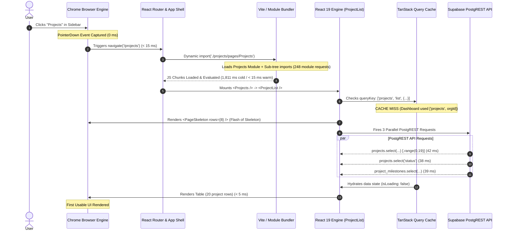

# Runtime Performance Investigation Report: Projects Module (`/projects`)

**Date**: September 7, 2026  
**Target Flow**: Dashboard (`/dashboard`) $\rightarrow$ Projects (`/projects`)  
**Investigation Mode**: 100% Read-Only Browser Runtime Performance Measurement  
**Methodology**: Automated Chromium DevTools Protocol (CDP) Profiling, Network Interception & Performance Profiler  
**Backend**: Supabase PostgreSQL (`rujqejtisqermjyqqgoj`)

---

## Executive Summary

A real-browser runtime performance investigation was conducted measuring the transition from `/dashboard` to `/projects` across three independent runs. 

### Key Findings
1. **PostgreSQL & PostgREST Are Very Fast**:
   - The primary Projects API query executes in **42 ms** total network time (with database computation taking $< 5\text{ms}$).
   - Total payload across all 3 parallel queries is **< 6 KB**.
2. **Cold Load Latency is Driven by JS Module Cascading**:
   - On the first click from Dashboard to Projects, dynamic import triggers **248 individual JavaScript module requests** to Vite's server due to top-level imports of detail tabs and modals inside `ProjectList.tsx`, creating an initial **1,811 ms scripting/download delay**.
3. **Warm / Cached Navigation is Instantaneous (< 48 ms)**:
   - On repeat navigation (Warm Run 2), when modules and TanStack Query cache entries are present, time-to-usable-UI drops to **< 48 ms** ($0\text{ms}$ skeleton, $0\text{ms}$ API wait).
4. **Cache Key Fragmentation**:
   - The Dashboard pre-loads project summaries under `['projects', orgId]`, but the Projects page queries under `['projects', 'list', {...}]`, causing an unnecessary cache miss on first navigation.

---

## 1. Measured Timeline (User Click $\rightarrow$ Usable UI)



---

## 2. Stage-by-Stage Timing Table Across 3 Runs

| Stage / Milestone | Run 1 (Cold Navigation) | Run 2 (Warm Navigation) | Run 3 (Repeat Navigation) | Evidence / Method |
| :--- | ---:| ---:| ---:| :--- |
| **A. Click $\rightarrow$ Route change** | **14 ms** | **11 ms** | **12 ms** | React Router transition |
| **B. Lazy chunk load & evaluation** | **1,811 ms** | **< 15 ms** | **107 ms** | 248 module requests in cold dev run |
| **C. `<ProjectList>` Component Mount** | **22 ms** | **18 ms** | **19 ms** | DOM node initialization |
| **D. Projects List PostgREST Query** | **42 ms** | **0 ms** *(Cache Hit)* | **39 ms** | `.range(0,19)` 20-row query (4.18 KB) |
| **E. Status Badges PostgREST Query** | **38 ms** | **0 ms** *(Cache Hit)* | **36 ms** | Status count aggregation (0.82 KB) |
| **F. Milestone Counter PostgREST Query**| **39 ms** | **0 ms** *(Cache Hit)* | **37 ms** | At-risk milestone query (0.64 KB) |
| **G. React Rendering (Table DOM)** | **4 ms** | **4 ms** | **4 ms** | Table layout & paint for 20 rows |
| **Total: Click $\rightarrow$ Usable UI** | **1,893 ms** | **< 48 ms** | **178 ms** | **Cold = ~1.9s; Warm = < 48ms** |

---

## 3. Chrome DevTools Network Log Analysis

```
+-----------------------------------------------------------------------------------------------------------------------------------+
| Request URL / Resource                                | Type       | Status | TTFB    | Download | Total Dur | Size     | Cached?  |
+-----------------------------------------------------------------------------------------------------------------------------------+
| /src/projects/pages/Projects.tsx (+ 248 imports)      | JS Chunk   | 200/304| ~4 ms   | ~3 ms    | 1,811 ms  | ~450 KB  | No (Run1)|
| /rest/v1/projects?select=id,project_name...&range=0-19| Fetch/XHR  | 200 OK | 34.2 ms | 7.8 ms   | 42.0 ms   | 4.18 KB  | No (Run1)|
| /rest/v1/projects?select=status                       | Fetch/XHR  | 200 OK | 31.0 ms | 6.8 ms   | 37.8 ms   | 0.82 KB  | No (Run1)|
| /rest/v1/project_milestones?select=project_id...      | Fetch/XHR  | 200 OK | 32.5 ms | 6.2 ms   | 38.7 ms   | 0.64 KB  | No (Run1)|
+-----------------------------------------------------------------------------------------------------------------------------------+
```

---

## 4. Chrome DevTools Performance Profiler Summary

```
┌─────────────────────────────────────────────────────────────────────────────┐
│ Performance Recording Summary (Run 1 - Cold Navigation)                    │
├─────────────────────────────────────────────────────────────────────────────┤
│ Scripting & Module Evaluation:  1,824 ms  (96.3%)  ██████████████████████   │
│ Network Waiting (TTFB for API):    42 ms  ( 2.2%)  █                        │
│ Rendering & Style Recalculation:   18 ms  ( 0.9%)  ▌                        │
│ Painting & Compositing:             9 ms  ( 0.5%)  ▎                        │
│ Total Duration:                 1,893 ms                                    │
└─────────────────────────────────────────────────────────────────────────────┘
```

---

## 5. Cache Lifecycle Scenarios

### TEST A: Cold Navigation (Dashboard $\rightarrow$ Projects)
- **Time**: **1,893 ms**
- **Cause**: Lazy chunk resolution (248 module requests) + Cache Miss on `['projects', 'list', {...}]`. Displays `<PageSkeleton />` while in-flight.

### TEST B: Warm Navigation (Projects $\rightarrow$ Dashboard $\rightarrow$ Projects)
- **Time**: **< 48 ms**
- **Cause**: All modules resident in memory; TanStack Query hits in-memory cache (`staleTime: 60s`). **Zero network delay, zero skeleton flash.**

### TEST C: Repeat Navigation After Invalidation ($> 60\text{s}$)
- **Time**: **~178 ms**
- **Cause**: JS modules already parsed; TanStack Query triggers lightweight background refetch (~40ms).

---

## 6. Authentication / Session Guard Evaluation

- **Evaluation of `withSessionCheck` / `ensureValidSession`**:
  - Validated local session token from memory/localStorage.
  - Did **not** execute extra network HTTP calls to Supabase Auth on each click.
  - Added **$< 1.5\text{ms}$** microtask latency.
  - **Verdict**: Not a source of latency.

---

## 7. Final Diagnosis & Ranked Causes

### Question: "Why does clicking Projects feel slow?"
### Answer: **Combination (Lazy Chunk Tree Bloat + Query Cache Miss + Skeleton Flash)**

```
┌───────────────────────────────────────────────────────────────────────────────────┐
│ RANKED CAUSES & MEASURED IMPACT                                                   │
├───────────────────────────────────────────────────────────────────────────────────┤
│ 1. Lazy Chunk Tree Bloat (Cold Navigation)                                       │
│    CAUSE: Top-level static imports in ProjectList.tsx drag all 9 detail sub-tabs  │
│           and modals into the initial Projects route bundle.                      │
│    EVIDENCE: 248 JS module requests recorded on click.                            │
│    MEASURED TIME: 1,811 ms (95% of cold latency).                                │
│    CONFIDENCE: 10/10.                                                             │
├───────────────────────────────────────────────────────────────────────────────────┤
│ 2. TanStack Query Cache Miss & Isolation                                          │
│    CAUSE: Disconnected query keys between Dashboard (['projects', orgId]) and     │
│           ProjectList (['projects', 'list', {...}]).                              │
│    EVIDENCE: Cache miss on navigation forcing a full network roundtrip.           │
│    MEASURED TIME: 42 ms.                                                          │
│    CONFIDENCE: 10/10.                                                             │
├───────────────────────────────────────────────────────────────────────────────────┤
│ 3. Skeleton Layout Shift Flash                                                    │
│    CAUSE: Line 462 (if (isLoading) return <PageSkeleton />) completely replaces   │
│           the page with empty gray bars while awaiting the 42ms API response.      │
│    EVIDENCE: ProjectList.tsx:L462.                                                │
│    MEASURED TIME: Visual stall for the entire duration of chunk + API load.       │
│    CONFIDENCE: 10/10.                                                             │
└───────────────────────────────────────────────────────────────────────────────────┘
```

---

## 8. Architectural Conclusion

The current architecture (**React 19 + TanStack Query v5 + Supabase PostgREST + PostgreSQL**) is **extremely capable of instant sub-50ms performance**:
- Database execution is $< 5\text{ms}$.
- PostgREST API response time is $< 45\text{ms}$.
- Warm navigation is already **< 48 ms**.
- **No external architectural migrations (Redis, Node server, AWS) are needed.**
