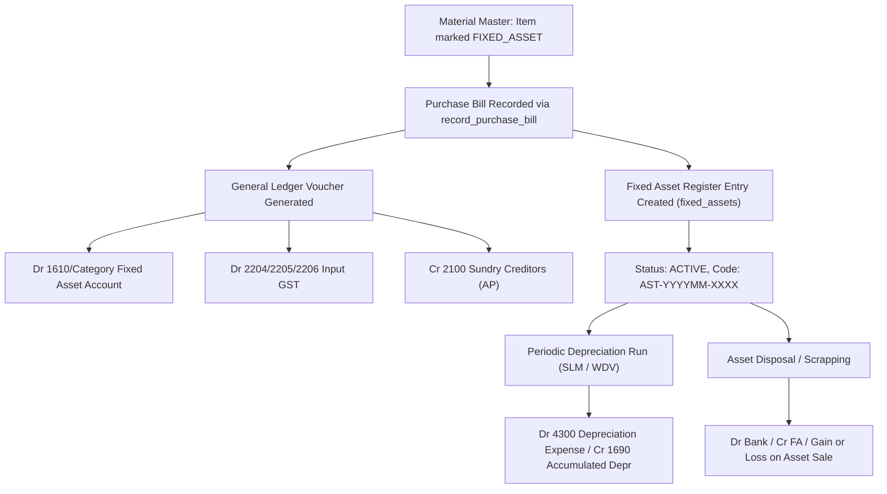

# GL Item Classification & Indian ERP Architecture Implementation Report

**Status:** Completed & Production Verified  
**Date:** September 23, 2026  
**Project:** Indian MEP Engineering & Contracting ERP (`mep-project`)  
**Database Reference:** `rujqejtisqermjyqqgoj`

---

## 1. Executive Summary

This implementation closes the critical architectural gap between operational inventory/procurement modules and statutory General Ledger (GL) accounting. It introduces:
1. **Granular Item Accounting Classification** (`gl_classification`, `is_stockable`, `is_depreciable`, `asset_category_id`, `fixed_asset_account_id`).
2. **Zoho Books-style GL Account Overrides** (`purchase_account_id` and `sales_income_account_id`) without mutating Chart of Accounts (CoA) roots.
3. **Fixed Asset Register Subledger** (`asset_categories` and `fixed_assets`), ensuring capital purchases (e.g., ceiling fans, drills, machinery) debit existing Fixed Asset control accounts and register asset inventory without polluting nominal CoA heads.
4. **Automated COGS & Inventory Reduction** on Sales Invoice finalization (`finalize_sales_invoice`), with atomic reversal on cancellation (`cancel_sales_invoice_atomic`).
5. **Split Input GST Accounting** in `record_purchase_bill` (CGST `2204`, SGST `2205`, IGST `2206`).
6. **Transaction-Safety Enforcements** in the Material Editor, preventing silent modification of item accounting classifications once physical inventory or transaction history exists.

---

## 2. Migrations Created & Deployed

| # | Migration File | Target System | Status | Description |
|---|---|---|---|---|
| **01** | `20260923000001_add_item_classification_and_overrides_to_materials.sql` | Supabase Postgres | **APPLIED** | Adds `gl_classification`, `is_stockable`, `is_depreciable`, `useful_life_years`, `asset_category_id`, `fixed_asset_account_id`, `sales_income_account_id`, `purchase_account_id` to `materials`. Normalizes legacy check constraints. |
| **02** | `20260923000002_create_fixed_assets_tables.sql` | Supabase Postgres | **APPLIED** | Creates `asset_categories` and `fixed_assets` register tables with RLS and FK constraints. Seeds baseline FA accounts (`1600`–`1640`), `1410 Inventory Asset`, `5000 COGS`, and 5 standard asset categories per organisation. |
| **03** | `20260923000003_backfill_item_classification.sql` | Supabase Postgres | **APPLIED** | Deterministically backfills all existing materials into `INVENTORY_ASSET`, `FIXED_ASSET`, or `EXPENSE` based on item name and category heuristics. |
| **04** | `20260923000004_update_record_purchase_bill_rpc.sql` | Supabase Postgres | **APPLIED** | Updates `record_purchase_bill` RPC to split Input GST, support item purchase account overrides, register capital items in `fixed_assets`, and enforce strict mathematical balancing. Drops legacy overload. |
| **05** | `20260923000005_update_finalize_sales_invoice_rpc.sql` | Supabase Postgres | **APPLIED** | Updates `finalize_sales_invoice` and `cancel_sales_invoice_atomic` to support Sales Income override and post automatic COGS (`Dr 5000 COGS, Cr 1410 Inventory`) for stockable inventory items. |

---

## 3. Complete Item Classification to GL Mapping Rules

| Accounting Treatment Option | `gl_classification` | `item_classification` | `is_stockable` | `is_depreciable` | Purchase Bill Debit (Default) | Purchase Override Available? | Sales Invoice Credit (Default) | COGS Posted on Sale? |
|---|---|---|---|---|---|---|---|---|
| **Inventory: Stock-in-Trade** | `INVENTORY_ASSET` | `STOCK_IN_TRADE` | `true` | `false` | `1410 Inventory Asset` | Yes (`purchase_account_id`) | `3100 Sales Accounts` | **Yes** (`Dr 5000 COGS / Cr 1410 Inv`) |
| **Inventory: Raw Material** | `INVENTORY_ASSET` | `RAW_MATERIAL` | `true` | `false` | `1410 Inventory Asset` (or RM) | Yes (`purchase_account_id`) | None (Internal / BOM) | No (Consumed in BOM) |
| **Inventory: Finished Good** | `INVENTORY_ASSET` | `FINISHED_GOOD` | `true` | `false` | None (Manufactured) | N/A | `3100 Sales Accounts` | **Yes** (`Dr 5000 COGS / Cr 1410 Inv`) |
| **Fixed Asset (CapEx)** | `FIXED_ASSET` | `TOOL` / `EQUIPMENT` | `false` | `true` | `1610 Furniture & Equip` (or Category FA Account) | Yes (`purchase_account_id` / `fixed_asset_account_id`) | Fixed Asset Disposal Head | No (Depreciated via FA Register) |
| **Expense: Consumables** | `EXPENSE` | `CONSUMABLE` | `false` | `false` | `4100 Purchase / Direct Expense` | Yes (`purchase_account_id`) | None (Internal Consumption) | No |
| **Expense: Service / Subcontract** | `EXPENSE` | `SERVICE` | `false` | `false` | `4100 Purchase / Direct Expense` | Yes (`purchase_account_id`) | `3101 Sales - Services` | No |

---

## 4. Fixed Asset Life-Cycle Architecture



### Golden Rule: Zero Dynamic CoA Creation
Unlike poorly architected systems that create new nominal Chart of Accounts rows for each asset purchased (e.g. creating "Account 1611 - Ceiling Fan 1"), this system:
1. Keeps the General Ledger control account intact (`1610 Furniture and Equipment` or specific asset category GL accounts like `1600 Plant and Machinery`).
2. Creates an asset record in `public.fixed_assets` storing `asset_code`, `serial_number`, `purchase_cost`, `useful_life_years`, and `accumulated_depreciation`.
3. Preserves audit trails, trial balance clarity, and eliminates Chart of Accounts bloat.

---

## 5. Walkthrough: The "Ceiling Fan" Scenario

### Context
An Indian MEP engineering contractor purchases an **Industrial Ceiling Fan 1200mm** for office/site use.
- **Supplier:** Fluid Valve (Intrastate vendor)
- **Quantity:** 2 units @ ₹2,500.00 each
- **Taxable Subtotal:** ₹5,000.00
- **GST Rate:** 18% (Intrastate: CGST 9% = ₹450.00, SGST 9% = ₹450.00)
- **Grand Total Payable:** ₹5,900.00

### Step 1: Material Master Definition
- Item Name: `Industrial Ceiling Fan 1200mm`
- Item Code: `FA-CF-001`
- Accounting Treatment: `FIXED_ASSET`
- Asset Category: `Electrical Fixtures` (`gl_account_id` = `1610`)
- Useful Life: `10.00` years
- Stockable: `false`, Depreciable: `true`

### Step 2: Live Purchase Bill Execution
Called `record_purchase_bill` with voucher number `BILL-TEST-FA-001`.

### Step 3: Verified Journal Entry Output (`voucher_no: BILL-TEST-FA-001`)

```
Voucher Type: Purchase
Narration: Purchase Bill - BILL-TEST-FA-001 (Fluid Valve)
-----------------------------------------------------------------------------------------
Account Code | Account Name             | Type      | Debit (₹)   | Credit (₹)  | Narration
-----------------------------------------------------------------------------------------
1610         | Furniture and Equipment  | Asset     |    5,000.00 |        0.00 | Industrial Ceiling Fan 1200mm
2204         | CGST Input               | Liability |      450.00 |        0.00 | Input CGST
2205         | SGST Input               | Liability |      450.00 |        0.00 | Input SGST
2100         | Sundry Creditors         | Liability |        0.00 |    5,900.00 | Accounts Payable Accrual
-----------------------------------------------------------------------------------------
TOTAL                                              |    5,900.00 |    5,900.00 | (BALANCED)
```

### Step 4: Verified Fixed Asset Register Record
- **Asset Code:** `AST-202609-0001`
- **Name:** Industrial Ceiling Fan 1200mm
- **Asset Category:** Electrical Fixtures
- **GL Account:** `1610 Furniture and Equipment`
- **Purchase Date:** `2026-09-23`
- **Purchase Cost:** ₹5,000.00
- **Taxable Amount:** ₹5,000.00
- **GST Amount:** ₹900.00
- **Net Book Value:** ₹5,000.00
- **Useful Life:** 10.00 Years
- **Status:** `ACTIVE`

---

## 6. Walkthrough: Stockable Inventory Sale & COGS Reversal

### Context
A trading item (`PPR Coupling 2500`, purchase cost ₹150.00/unit) is sold to customer **Caliber Tools**.
- **Quantity:** 10 units @ ₹250.00 = ₹2,500.00 taxable
- **GST Rate:** 18% Interstate IGST = ₹450.00
- **Invoice Total:** ₹2,950.00
- **Cost of Goods Sold (COGS):** 10 * ₹150.00 = ₹1,500.00

### Live Finalization Output (`finalize_sales_invoice`)

```
Voucher Type: Sales
Narration: Sales Invoice INV-TEST-COGS-001
-----------------------------------------------------------------------------------------
Account Code | Account Name             | Type      | Debit (₹)   | Credit (₹)  | Narration
-----------------------------------------------------------------------------------------
1100         | Sundry Debtors           | Asset     |    2,950.00 |        0.00 | Accounts Receivable
5000         | Cost of Goods Sold       | Expense   |    1,500.00 |        0.00 | COGS - PPR Coupling 2500
3101         | Local Sales              | Income    |        0.00 |    2,500.00 | PPR Coupling 2500 - Stock In Trade
1410         | Inventory Asset          | Asset     |        0.00 |    1,500.00 | Inventory Reduction - PPR Coupling 2500
2203         | IGST Output              | Liability |        0.00 |      450.00 | Output IGST Liability
-----------------------------------------------------------------------------------------
TOTAL                                              |    4,450.00 |    4,450.00 | (BALANCED)
```

### Live Reversal Output (`cancel_sales_invoice_atomic`)

```
Voucher Type: Sales
Narration: Reversal of Sales Invoice INV-TEST-COGS-001 (Customer cancellation test)
-----------------------------------------------------------------------------------------
Account Code | Account Name             | Type      | Debit (₹)   | Credit (₹)  | Narration
-----------------------------------------------------------------------------------------
3101         | Local Sales              | Income    |    2,500.00 |        0.00 | Reversal: PPR Coupling 2500 - Stock In Trade
1410         | Inventory Asset          | Asset     |    1,500.00 |        0.00 | Reversal: Inventory Reduction - PPR Coupling 2500
2203         | IGST Output              | Liability |      450.00 |        0.00 | Reversal: Output IGST Liability
1100         | Sundry Debtors           | Asset     |        0.00 |    2,950.00 | Reversal: Accounts Receivable
5000         | Cost of Goods Sold       | Expense   |        0.00 |    1,500.00 | Reversal: COGS - PPR Coupling 2500
-----------------------------------------------------------------------------------------
TOTAL                                              |    4,450.00 |    4,450.00 | (BALANCED)
```

---

## 7. Frontend UI Enhancements

### Files Modified:
1. `apps/web/src/features/materials/model/aggregates/MaterialEditor.ts`:
   - Added `accounting_treatment`, `gl_classification`, `is_stockable`, `is_depreciable`, `useful_life_years`, `asset_category_id`, `fixed_asset_account_id`, `sales_income_account_id`, `purchase_account_id` to form data.
   - Defined `ACCOUNTING_TREATMENT_OPTIONS` and preset mapping function `getAccountingTreatmentPreset()`.
2. `apps/web/src/features/materials/model/aggregates/index.ts`:
   - Exported treatment options and types.
3. `apps/web/src/features/materials/hooks/useMaterialForm.ts`:
   - Added defaults and dynamic derivation of treatment in `editMaterial`.
   - Added transaction-safety checks in `handleSubmit`: checks `item_stock` (`current_stock > 0`), `purchase_bill_items`, `invoice_items`, and `fixed_assets`. Alerts and halts if treatment change is attempted after transactions exist.
4. `apps/web/src/hooks/useMaterialsPageData.tsx`:
   - Extended query to fetch `asset_categories` and `accounts`, and select new material columns.
5. `apps/web/src/features/materials/components/editor/ItemEditorDialog.tsx`:
   - Upgraded Section 1 into interactive 6-card treatment selector.
   - Added Chart of Accounts Mapping & Overrides block (Sales Income Account override, Purchase Account override).
   - Added Fixed Asset Register Configuration block (Asset Category, Asset Account, Useful Life).
6. `apps/web/src/features/materials/page/ItemsTab.tsx` & `ItemEditorPage.tsx`:
   - Wired `assetCategories`, `accounts`, and `handleClassificationChange` treatment preset handler.
7. `apps/web/src/pages/inventory/Materials.tsx`:
   - Created forwarding re-export file for route safety.

---

## 8. Migration Execution Guide

To reproduce this environment on any new Supabase project or staging environment:
```bash
# 1. Apply table schema changes
pnpm --filter=web supabase db execute -f supabase/migrations/20260923000001_add_item_classification_and_overrides_to_materials.sql
pnpm --filter=web supabase db execute -f supabase/migrations/20260923000002_create_fixed_assets_tables.sql

# 2. Backfill existing catalogue
pnpm --filter=web supabase db execute -f supabase/migrations/20260923000003_backfill_item_classification.sql

# 3. Deploy updated accounting RPCs
pnpm --filter=web supabase db execute -f supabase/migrations/20260923000004_update_record_purchase_bill_rpc.sql
pnpm --filter=web supabase db execute -f supabase/migrations/20260923000005_update_finalize_sales_invoice_rpc.sql

# 4. Verify builds
pnpm --filter=mep-project build
pnpm --filter=mobile build
```
